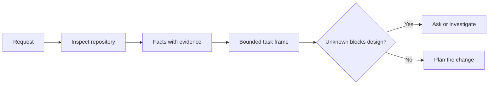

# Enframe a tarefa antes que o agente escreva o código.

> Um agente de codificação pode implementar uma tarefa clara rapidamente. Também pode implementar uma tarefa não clara rapidamente. A velocidade é a mesma. O custo não é.

> **【中文解读】**编码代理 实现清晰任务快速,实现模糊任务同样快速度,价格完全不同. 本课讲 写代码前的第一步:把一个模糊请求变成一个由仓库证据支、边界明确的任务框架 (任务框架)  (任务框架)  (任务框架)  (任务框架)  (任务框架)  (任务框架)  (任务框架) )  (任务框架)  (任务框架)  (任务框架)  (任务框架)  (任务框架)  (任务框架)  (任务框架)  (任务框架)  (任务框架)  (任务框架)  (任务框架)  (任务框架)  (任务框架)  (任务框架)  (任务框架)  (任务框架)  (任务框架)  (任务框架)  (任务框架)  (任务框架)  (任务框架)  (任务框架)  (任务框架)  (任务框架)  (任务框架)  (任务框架)  (任务框架)  (任务框架)  (任务框架)  (任务框架)  (任务  (任务)  (任务)  (任务)  (任务)  (任务)  (任务)  (任务)  (任务)  (任务  (任务)  (任务)  (任务)  (任务)  (任务 (任务)  (任务)  (任务)  (任务)  (任务)  (任务 (任务)  ( ( 任务)  ( 任务) 任务)  ( ( ( 任务) 任务)  ( ( 任务) 任务)  ( ( ( 任务) 任务)  ( ( ( 任务) 任务)  ( ( 任务)  ( ( 任务)  ( ()  ()  ( ()  ()  () 

> - Não .**【前置】**O primeiro é o primeiro a entender o que o modelo vai falhar (para entender o que o modelo vai falhar) e o terceiro é o segundo.`outputs/task-frame.md`A reunião no § 44 se transformou em um plano de execução de um apoio à prova.

**Type:** Learn + Build | **类型:** 学习 + 动手实践
**Languages:** Python (stdlib) | **语言:** Python（标准库）
**Prerequisites:** Phase 14 lessons 31 and 36 | **前置知识:** Phase 14 第 31、36 课
**Time:** ~60 minutes | **时间:** 约 60 分钟

## Objetivos de aprendizagem

- Transforme um pedido em um quadro de tarefas limitado antes de editar.
  Tradução do inglês: 文本译文:在动手编辑之前,把一个请求转化为有边界的任务框架.
- Separar os dados do repositório das suposições e das questões abertas.
  Tradução do inglês para Chinês:把仓库事实与假设, 等决问题区分开.
- Defina os caminhos permitidos, os caminhos proibidos e a prova de aceitação.
  Tradução do inglês: define permitir caminho, proibir caminho e aceitar testemunhos.
- Decida quando o reconhecimento é suficiente para começar a trabalhar.
  Tradução do inglês: judge what time reconnaissance has sufficiently, pode começar a mover-se.

## O fracasso caro. O fracasso caro.

 Adicionar proteção duplicada de e-mail soa específico. Não é. A unicidade pertence à API, serviço de domínio ou banco de dados? É a comparação sensível a casos? Que forma de erro já é pública? É permitida uma migração? Que teste prova o comportamento?

> "Consolidar a protecção da caixa de correio" parece muito específico, na verdade não é específico. A única natureza que deve ser colocada em um API, em um serviço ou em um banco de dados?

Um agente capaz preencherá essas lacunas com opções plausíveis.

> Um agente capaz usaria uma escolha que parecia razoável para preencher esses espaços vazios. Esta é a situação perigosa: a realização pode ser feita, mas ainda não é compatível com todo o sistema.

A primeira unidade de trabalho do agente de codificação não é, portanto, uma edição, mas um quadro de tarefas apoiado por evidências de repositório.

> Assim, a primeira unidade do trabalho do agente não é uma edição única, mas um quadro de tarefas do armazém de evidências.

> **【中文解读】**Durado fracaso não significa que o código tenha sido escrito mal, mas sim que o código tenha sido escrito para o que foi feito, mas a missão foi compreendida mal. A agente não vai mudar por causa da falta de missão e vai ficar devagar.

## O quadro de tarefas.

Um quadro útil tem seis campos:

| Field | Question |
|---|---|
| Goal | What observable behavior must change? |
| Repository facts | What did you verify in code, tests, config, or history? |
| Allowed paths | Where may the change land? |
| Forbidden paths | What must remain untouched? |
| Acceptance evidence | Which commands or observations prove the goal? |
| Unknowns | Which decisions still need evidence or human judgment? |

> **【中文解读】**六个段分别是: objetivos (what can be observed behavior must change) 仓库事实 (what can be observed behavior must change) 仓库事实 (what can be observed behavior must change) 仓库事实 (what can be observed behavior must change) 仓库事实 (what can be observed behavior must change) 仓库事实 (what can be observed behavior must change) 仓库事实 (what can be observed behavior must change) 仓库事实 (what can be observed behavior must change) 仓库事实 (what can be observed behavior must change) 仓库事实 (what can be observed behavior must change) 仓库事实 (what can be observed behavior must change) 仓库事实 (what can be observed behavior must change) 仓库事实 (what can be observed behavior must change) 仓库事事事 (what can be observed behavior must change) 仓库事实 (what can be observed behavior must change) 仓库事实 (what can be observed behavior must change) 仓库事事事事事事事事 (what can be done) 仓库事事事事事事) 仓库事事事事事事事 (what can be done) 仓库事 (what can be done done done done done done) 仓库事) 仓库事事事事 (what can be done done done done) 仓库事) 仓库事 (what can be done done done done done done done done done done done done) 仓库) 仓库 facts (what can be done done done done done done done done done done done done done done)      仓库 facts (what can do done done done done done done done done done done done done done done done done done)                                                                                                      

Os dados precisam de recibos. A API usa 409 para duplicados não é um fato até que você possa apontar para o teste ou processador existente. Um caminho de arquivo e linha são suficientes. Um resultado de comando é melhor quando o comportamento importa.

> O fato requer um diploma. "A API para repetir o 409" não é um fato antes de você se dirigir para um teste ou processador existente.



> - Não .**【类比】**任务框架像装修前的墙审批单:哪面墙能动 (permitido) 、哪面是承重墙绝不能动 (proibido) 验收入住的标准是什么 (prova de aceitação) ⋅ sem este张单子, equipa de montagem (agente) 动作越快,错墙的概率越大──

## Reconhecimento é uma busca de restrições. Reconhecimento é procurar conexões.

Não leia todo o repositório. Procure as superfícies que restringem a alteração:

> Não passe a todo o armazém... e procure as que realmente estão ligadas a essa mudança.

1. O comportamento atual e o que lhe chama.
   Tradução do inglês: Current behavior and its code.
2. O teste mais próximo existente.
   O que é que se passa com o novo sistema de controle?
3. O contrato público ou a forma serializada.
   Tradução do inglês para o inglês: Open contract or sequencing of data shape.
4. As instruções do projeto que regem o caminho.
   Noção do Japão: "Agencias"
5. Os comandos de construção e verificação.
   Tradução do inglês: Construir e verificar.
6. Alterações completas semelhantes que revelam padrões locais.
   Chinese:                                                                                                                                                                                                                                                              

Pare quando cada decisão planejada é apoiada por evidências, explicitamente delegada ou listada como desconhecida.

> Quando cada decisão de um plano tiver provas de que está autorizado ou está listado para um projeto desconhecido, o processo de investigação deve parar.

> **【中文解读】**O objetivo da observação não é entender toda a biblioteca de código, mas encontrar um conjunto: quem o utiliza, qual é o tubo de teste, como é que é que é escrito.

## Os desconhecidos não são fracasso.

Um desconhecido é uma lacuna controlada. Uma suposição é uma resposta descontrolada a essa lacuna.

> O desconhecido é um buraco controlado; a suposição é uma resposta de um buraco incontrolado.

Classificar cada desconhecido:

- **Discoverable:**O repositório ou o sistema operacional podem responder.
  Tradução:**可发现：**O sistema em operação pode responder a isso.
- **Decidable:**O contrato de tarefa dá ao agente a autoridade para escolher.
  Tradução:**可决定：**任务契约已授权 Agente 自行选择──
- **Human:**A escolha altera o comportamento do produto, o custo, o risco ou a compatibilidade pública.
  Tradução:**需人来定：**Esta escolha alterará o comportamento do produto, custo, risco ou compatibilidade pública.
- **Deferred:**A escolha está fora desta fatia e pertence a não-alvos.
  Tradução:**可延后：**Esta escolha não pertence a esta secção, deve ser colocada em um objetivo.

O agente deve continuar através de incógnitas descobertas e delegadas, deve parar em incógnitas humanas antes que a escolha seja enterrada em código.

> Para os incógnitos que podem ser descobertos e autorizados, o Agente deve continuar a avançar; para os incógnitos que precisam ser determinados, o Agente deve parar de fazer a seleção antes de ser enterrado no código.

> **【中文解读】**O que mais se pode fazer é colocar um produto em um bloco de vendas, como um produto em um bloco de vendas, como um bloco de vendas, como um bloco de vendas, como um bloco de vendas, como um bloco de vendas, como um bloco de vendas, como um bloco de vendas, como um bloco de vendas, como um bloco de vendas, como um bloco de vendas, como um bloco de vendas, como um bloco de vendas, como um bloco de vendas, como um bloco de vendas, como um bloco de vendas, como um bloco de vendas, como um bloco de vendas, como um bloco de vendas, como um bloco de vendas, como um bloco de vendas, como um bloco de vendas, como um bloco de vendas, como um bloco de vendas, como um bloco de vendas, como um bloco de vendas, como um bloco de vendas, como um bloco de vendas, como um bloco de vendas, como um bloco de vendas, como um bloco de vendas, como um bloco de vendas, como um bloco de vendas, como um bloco de vendas, como um bloco de vendas, como um bloco de vendas, ou um bloco de vendas, ou um bloco de vendas, ou um bloco de vendas, ou um bloco de vendas, ou um bloco de vendas, ou de vendas, ou de vendas, ou de vendas, ou de vendas, ou de vendas, ou de vendas, ou de vendas, ou de vendas, ou de vendas, ou de vendas, ou de vendas, ou de vendas, ou de vendas, ou de vendas, ou de vendas, ou de vendas, ou de vendas, ou de vendas, ou de vendas, ou de vendas, ou de acordo com ou de acordo com o consumidor, ou de acordo com o consumidor, ou de acordo com o consumidor, ou de acordo com o consumidor, ou de acordo com o consumidor, ou de acordo com o consumidor.

## Aceitação antes da implementação.

Escreva a prova antes do parche.

> Primeiro escrever prova, reescrever complemento.

- um comando de ensaio de unidade ou integração focado;
  Tradução do inglês: 一条聚焦的单元或集成测试命令;
- Uma viagem de navegador com um ponto de vista designado e estado esperado;
  Tradução do inglês: One Time Indicating the Browser Operating Journey of the viewing port and desired state;
- Um pedido por via eletrónica e um contrato de resposta exata;
  Tradução do inglês: a linha sobre o pedido e o acordo de resposta;
- Uma medição de desempenho com um limiar;
  Tradução do inglês: a.
- Uma verificação do alcance que confirme que nenhum arquivo não relacionado foi alterado.
  Tradução do inglês: a.

Caso de testes não é um plano de prova.

> "O teste foi aprovado" não é um programa de prova.

> **【中文解读】** Recebimento antes de realizar é TDD em Agente 工程中的变体:                                                                                                                                                                                                                                                     

## Construí-lo e realizei-o.

O laboratório cria um`TaskFrame`, valida os seus limites e evidências, e escreve `outputs/task-frame.md`- Não .

> 实验部分会创建一个 `TaskFrame`, a sua fronteira com a prova,并写出 `outputs/task-frame.md`- Não.

Correr a partir deste diretório de lições:

```bash
python3 code/main.py
python3 -m unittest discover code/tests -v
```

Descompõe o exemplo de quatro maneiras: remova a meta, remova um recibo de fato, sobrepõe um caminho permitido e proibido e remova o comando de aceitação.

> Use quatro formas de destruir este exemplo: eliminar o objetivo, eliminar um documento de fato, permitir o caminho e proibir o caminho sobreposição, eliminar ordens de aceitação, por diferentes razões, o testeiro deve rejeitar cada quadro destruído.

## Usá-lo num depósito real , em um depósito real .

Antes de pedir a um agente para editar:

> Em que se trata de um agente?

1. Escreva o objetivo como um comportamento, não como uma mudança de arquivo.
   Tradução do inglês para tradução do inglês:把目标写成一行为,而不是一次文件改动――
2. Regista dois ou três fatos com provas exatas.
   O que é que é o "prefeito" de uma cidade?
3. Nomear o menor conjunto de caminhos permitidos.
   Chinese: 点名最小集合的允许路径──
4. Nomear espaço negativo explicitamente.
   Tradução do inglês:
5. Escreva o comando ou observação que encerra a tarefa.
   Tradução do inglês para o inglês: write down关闭 this条任务的命令或观察.
6. Faça uma lista das decisões que ainda não ganhou.
   Não há provas de que você ainda não está qualificado para tomar uma decisão.

O quadro deve caber numa tela. Se não puder, a tarefa pode conter várias alterações independentemente verificáveis.

> O quadro de tarefas deve ser colocado em um plano. Se não for colocado, esta tarefa pode incluir várias mudanças independentes.

> **【中文解读】**Este é um programa de prática de curso, que pode ser inserido diretamente em seu fluxo de trabalho: objetivo de escrita de comportamento, fatos com justificativa, permitindo o caminho de minimização, expressão de espaço negativo, receção de ordens de antecedência, coisas não decididas.

## Exercícios.

1. Enfrente um erro real de um dos teus repositórios sem propor uma solução.
   Tradução do inglês: Choose a real bug from your own warehouse, do seu próprio armazém, do seu próprio armazém,
2. Encontre uma alegação no quadro que seja uma suposição e substitua-a por provas.
   O que é que é um facto?
3. Adicione um humano desconhecido cuja resposta alteraria o contrato público.
   Chinese Translation: adicionar um necessário para determinar  de um incógnito, a sua resposta mudará o acordo público.
4. Dividir um caminho permitido para o menor conjunto de segurança.
   Tradução do inglês para tradução do inglês:把一条过宽的允许路径拆分最小安全集合──
5. Adicionar um recibo de alcance à prova de aceitação.
   Chinese:                                                                                                                                                                                                                                                              

## Mais leitura 延伸阅读

- [Nuseibeh and Easterbrook, Requirements Engineering: A Roadmap](https://www.cs.toronto.edu/~sme/papers/2000/ICSE2000.pdf), para ancorar a implementação a metas do mundo real e às restrições em evolução.
  Tradução do inglês para o inglês: Nuseibeh e Easterbrook 需求工程:路线图如何实现定在真世界目标和演化中的约束上.
- [Yang et al., SWE-agent: Agent-Computer Interfaces Enable Automated Software Engineering](https://arxiv.org/abs/2405.15793), para a prova de que a interface em torno de um agente de codificação altera a sua eficácia.
  O que é que é o que é o que é o que é o que é o que é o que é o que é o que é o que é o que é o que é o que é o que é o que é o que é o que é o que é o que é o que é o que é o que é o que é o que é o que é o que é o que é o que é o que é o que é o que é o que é o que é o que é o que é o que é o que é o que é o que é?

## O que você mantém , o que você retém , o produto .

- Não .`outputs/task-frame.md`É a entrada para a próxima lição, onde o quadro torna-se um plano de execução apoiado por evidências.

> - Não .`outputs/task-frame.md` É a entrada da próxima aula Na próxima aula, o quadro de tarefas se transforma num plano de execução baseado em evidências
