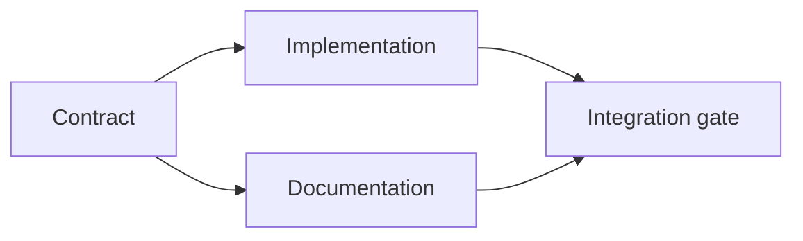

# Construir um plano de execução baseado em provas.

> Um plano não é uma lista de tarefas mais bonita, é um gráfico de dependência em que cada mudança tem uma razão e cada nó terminal tem uma prova.

> **【中文解读】**O plano não é um "programa de espera de melhor qualidade", mas um gráfico de dependência: cada mudança tem razões, cada ponto terminal tem provas, e cada ponto terminal tem provas.

> - Não .**【前置】**Aprenda a fazer o que você quer.`outputs/task-frame.md`)―本课产出 `outputs/evidence-plan.json`Em 45o curso, tornar-se-á um contrato de multi-agente.

**Type:** Learn + Build | **类型:** 学习 + 动手实践
**Languages:** Python (stdlib) | **语言:** Python（标准库）
**Prerequisites:** Phase 14 lesson 43 | **前置知识:** Phase 14 第 43 课
**Time:** ~65 minutes | **时间:** 约 65 分钟

## Objetivos de aprendizagem

- Converte um quadro de tarefa em itens de trabalho com evidências e provas.
  Tradução em chinês:把任务框架转化为带证据与证明的工作项.
- Ordem de modelo como dependências em vez de sequência de prosa.
  Tradução do inglês: using dependency build model precedent sequence, rather than using散文式叙述──
- Detectar fatos perdidos, dependências desconhecidas e ciclos antes de editar.
  Tradução do inglês em inglês:
- Passo separado que pode correr juntos de passos que devem esperar.
  O que é que é o que é preciso fazer?

## Porque é que os planos dos agentes falham?

Os planos fracos repetem o pedido no tempo futuro:

> O programa é apenas fazer um pedido de repetição no futuro:

1. Atualize a API.
   Tradução do português:更新 API。
2. Adicionar testes.
   Tradução do português:加测试──
3. Atualizar a documentação.
   Tradução do português:

Nada nessa lista diz o que foi encontrado, por que esses arquivos são corretos, quais contratos mudam primeiro, ou o que pode acontecer simultaneamente.

> Não há nenhuma frase na lista: descoberto o que, por que são estes documentos, quais são os acordos que devem ser feitos, quais são os passos que podem ser feitos, e o agente pode fazer um passo a passo, ainda fazendo o trabalho de volta.

> **【中文解读】**O programa é caracterizado por um "recurso de revisão" que parece ter um número, mas não tem uma prova de armazenamento.

Um plano sólido estabelece cinco compromissos para cada item de trabalho:

| Commitment | Purpose |
|---|---|
| Identifier | Stable reference for dependencies and handoff |
| Change | The smallest behavior or contract change |
| Evidence | Repository facts that justify the change |
| Dependencies | Work that must be true first |
| Proof | The exact check that closes the item |

> **【中文解读】**五个承诺分别是:标识符 (标识符) 转变 (转变) 变 (变) 变 (变) 变 (变) 变 (变) 变 (变) 变 (变) 变 (变) 变 (变) 变 (变) 变 (变) 变 (变) 变 (变) 变 (变) 变 (变) 变 (变) 变 (变) 变 (变) 变 (变) 变 (变) 变 (变) 变 (变) 变 (变) 变 (变) 变 (变) 变 (变) 变 (变) 变 (变) 变 (变) 变 (变) 变 (变) 变 (变) 变 (变) 变 (变) 变 (变) 变 (变) 变 (变) 变) 变 (变) 变 (变) 变 (变) 变) 变 (变) 变 (变) 变) 变 (变) 变 (变) 变) 变 (变) 变 (变) 变) 变 (变) 变 (变) 变) 变 (变) 变 (变) 变) 变 (变) 变 (变) 变) 变 ( 变) 变 ( 变) 变 ( 变) 变 ( 变) 变 ( 变) 变 ( 变) 变) 变 ( ( 变) 变) 变 ( ( 变) 变) 变 ( ( ( 变) 变) 变) 变 ( ( ( ( 变) 变) 变) 变 ( ( ( ( ( 变) 变) 变) 变) 变) 变 ( ( ( ( ( ( ( ( ( ( 变) 变) 变) 变) 变) 变) 变) 变) 变) 变 ( ( ( ( ( ( ( ( () 变) 变) 变) 变) 变) 变) 变 ( ( ( ( ( () 变) 变) 变) 变) 变) 变 ( ( (

## Planejar o contrato antes de ser executado.

Quando várias superfícies dependem do mesmo comportamento, define o comportamento primeiro. Testes, implementação, documentação e integração podem então compartilhar um contrato em vez de inventar quatro versões.

> Quando várias superfícies dependem do mesmo comportamento, primeiro definem o comportamento em si mesma.

> - Não .**【类比】**契约先行如先定国标插头再生产电器器──插座厂(实现) 和电器厂(文档) pode ser aberto simultaneamente, pois a ligação já está trancada;



O gráfico expõe a simultaneidade segura. A implementação e a documentação podem prosseguir juntas após o contrato ser fixado.

> O quadro revela o desenvolvimento de segurança. Após a fixação do acordo, a implementação e o arquivo podem ser promovidos simultaneamente; a integração deve ser realizada.

## Evidências mudam o plano.

A evidência do depósito não é decoração, deve ser capaz de alterar a obra:

> DATA DE LA GUARDA não é um adorno.

- Um auxiliar existente remove uma nova abstração planejada.
  Tradução do inglês: a.
- Um teste de compatibilidade obriga a uma mudança.
  Tradução do inglês para o inglês: a composição de um teste de composição, forçado a realizar um processo de mudança fora do plano.
- Uma restrição de implantação muda uma mudança de esquema para outra tarefa.
  Tradução do inglês: One deploy约束,把 schema 变更挪进另一个任务.
- Um tipo de resposta pública altera a ordem de execução e documentação.
  Tradução do inglês para o inglês: a public response type, altered implementation with documentation's preceding sequence.

Se as provas não podem alterar o plano, provavelmente não são provas para essa decisão.

> Se a evidência mudar não foi planejada, não é a maior parte da evidência dessa decisão.

> **【中文解读】**Esta é uma boa prova falsa: colocar "evidência" ao lado da decisão, perguntar "se isso acontecer, o plano vai mudar?" Não vai mudar, dizer que é apenas um decoração real que determina algo diferente ([[habitude]], suposição ou valor padrão do agente]] (provimento)  em cada uma das coisas deve ser passado por esta relação).

## Design para Interrupção.

As sessões de agente de codificação terminam inesperadamente.

> A reunião do agente será inesperadamente concluída.

- qual item está completo;
  中文翻译:哪个工作项已完成;
- que prova foi apresentada;
  Tradução do inglês:
- quais os artefatos foram alterados;
  中文翻译: quais são as mudanças;
- quais dependências estão agora desbloqueadas;
  Tradução do inglês:
- Qual é o próximo item seguro.
  Chinese: 下一个安全工作项是什么?

Não codifique o estado apenas nas caixas de seleção dentro de um chat.

> Não coloque o estado apenas codificado em um quadro de seleção do registro de conversação.

> **【中文解读】**O programa deve ser colocado no sistema de documentos como o jogo deve ser armazenado. O artigo "qualquer prova de que foi executado" é especialmente importante: o programa não deve repetir o teste caro demais, nem saltar para pensar que foi executado.

## Validação do plano.

Rejeitar o plano antes da execução quando:

> Quando se verificar a seguinte situação, antes de ser executado, rejeitar este plano:

- O identificador é duplicado;
  Tradução do inglês:
- um objeto de trabalho não contém provas;
  Tradução do inglês:某工作项没有证据;
- um objeto de trabalho não tem provas;
  Tradução do inglês:某工作项没有证明;
- uma dependência designa um item desconhecido;
  Tradução do inglês:
- O gráfico contém um ciclo;
  Tradução do inglês:
- A primeira ação irreversível ocorre antes de a incerteza relevante ser resolvida.
  O primeiro movimento irreversível, apareceu antes que a incerteza de que depende fosse resolvida.

Os primeiros cinco controlos são mecânicos, o último exige julgamento e deve ser convocado explicitamente.

> O último artigo requer poder de julgamento, deve ser explicitamente indicado.

> **【中文解读】**六条拒绝规则里藏藏着本课最重要的排序原则:不可逆动作 (transferir, eliminar, publicar, abrir e abrir um acordo) deve ser eliminado após a incerteza.

## Construí-lo e realizei-o.

`code/main.py`Modela os itens de trabalho, valida os seus recibos, calcula as ondas de execução com um tipo topológico e escreve `outputs/evidence-plan.json`- Não .

> `code/main.py`Construir trabalhos, verificar os seus credenciamentos, utilizar o cálculo de ordem para executar as suas operações, e escrever`outputs/evidence-plan.json`- Não.

- Correr .

> 运行:

```bash
python3 code/main.py
python3 -m unittest discover code/tests -v
```

O exemplo produz três ondas. A definição de contrato é executada primeiro. A implementação e a documentação são executadas juntas. O portão de integração é executado em último.

> Demonstrar que o processo de desenvolvimento é um processo de desenvolvimento de uma sociedade.

> **【中文解读】**"波次" é uma aplicação direta da ordem de trabalho: cada um dos trabalhos de cada série é interdependente, pode ser dividido em diferentes agentes e processos;

## Use-o com um agente de codificação

Peça ao agente para produzir o plano antes de alterar os arquivos.

> Deixar o agente em um plano de produção antes de mudar o documento.

1. Cada reivindicação de caminho e comportamento tem um recibo de depósito.
   Chinese Translation: Cada um dos seus métodos e comportamentos tem um depoimento de dados.
2. Cada item tem uma prova clara de conclusão.
   Tradução do inglês para tradução do inglês:
3. O gráfico retarda o trabalho caro ou irreversível até que a incerteza da qual depende seja resolvida.
   O trabalho depende de um trabalho caro ou irreversível, adiado até que a incerteza dependente seja resolvida.

Aproveite o plano, não uma promessa vaga de ser cuidadoso.

> O que foi aprovado foi o plano, não uma frase de "I'll be a little heart"

## Exercícios.

1. Adicionar um item de migração que requer aprovação humana explícita.
   Chinese Translation:加一个需要人工显然批准的迁移工作项.
2. Crie um ciclo e explique o desacordo oculto por trás dele.
   Tradução do inglês: manufacturing a loop dependence,并 explain it behind hidden product分歧.
3. Divide um item que tem dois comandos de prova.
   Tradução do inglês para tradução do inglês:
4. Adicione um item de trabalho que possa funcionar na segunda onda sem tocar em nenhum dos ramos existentes.
   Tradução do inglês:Add one can in second wave运行、且不触碰两条现有分支工作项──
5. Render o plano como Markdown, mantendo o JSON como a fonte da verdade.
   Tradução do inglês para tradução livre:

## Mais leitura 延伸阅读

- [Nuseibeh and Easterbrook, Requirements Engineering: A Roadmap](https://www.cs.toronto.edu/~sme/papers/2000/ICSE2000.pdf), para a relação iterativa entre metas, especificações, acordo e evolução.
  Tradução do inglês para o inglês:Nuseibeh e Easterbrook
- [Barry Boehm, A Spiral Model of Software Development and Enhancement](https://dl.acm.org/doi/10.1145/12944.12948), para ordenar o desenvolvimento em torno da resolução de riscos em vez de uma sequência linear fixa.
  Tradução do inglês para o inglês: Barry Boehm Software Development's spiral model  around winds dissipation rather than fixed linear order to arrange development

## O que você mantém , o que você retém , o produto .

- Não .`outputs/evidence-plan.json`Torna-se o contrato de delegação na próxima aula.

> - Não .`outputs/evidence-plan.json` Vai tornar-se um compromisso em next class
