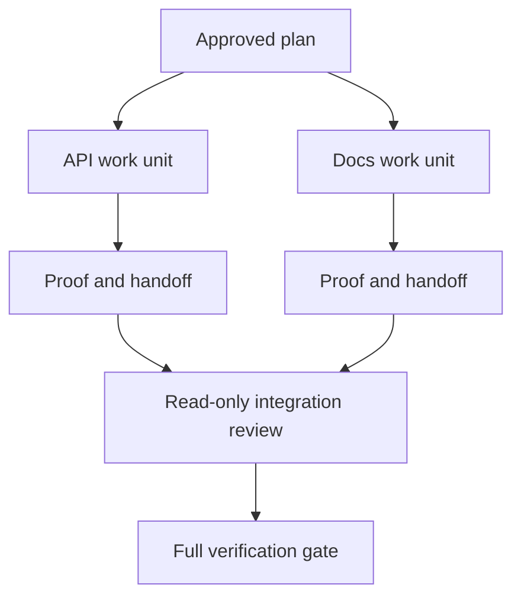

# Agente delegado Trabalha com Contratos de Isolamento e Fusão

> Os agentes paralelos economizam tempo de parede apenas quando o trabalho é independente.

> **【中文解读】**E o agente de parceria só pode gastar tempo quando realmente se encontra em trabalho; caso contrário, ele transforma uma tarefa clara em um problema de coordenação, e falha mais rapidamente.

> - Não .**【前置】**O curso é formado por um grupo de professores que trabalham em uma área de ensino superior, que é composta por professores e professores.`outputs/evidence-plan.json`O que é o resultado do trabalho?`outputs/delegation-plan.json`, registos separados por que é seguro , caminho para quem , integração para receber o que prova .

**Type:** Learn + Build | **类型:** 学习 + 动手实践
**Languages:** Python (stdlib) | **语言:** Python（标准库）
**Prerequisites:** Phase 14 lessons 39 and 44 | **前置知识:** Phase 14 第 39、44 课
**Time:** ~70 minutes | **时间:** 约 70 分钟

## Objetivos de aprendizagem

- Decidir se a delegação é justificada por uma verdadeira independência.
  Tradução do inglês para tradução inglesa:
- Dê a cada trabalhador a propriedade exclusiva dos ficheiros e prova explícita.
  Tradução do Novo Mundo: "Dá a cada trabalhador o direito de propriedade e a prova de que ele é o único que tem o direito de fazer o trabalho".
- As ondas de execução de computadores de dependências.
  Tradução do inglês:
- Desenhar um contrato de fusão para combinar o trabalho de agente com segurança.
  Tradução do inglês para Chinês: 设计一个安全合并 Agent 工作的合并契约。

## O teste de paralelo.

Não delegar porque existam mais agentes disponíveis.

> Não porque "ha mais agente disponível" é emcomendado.

- Duas investigações podem responder independentemente a diferentes incógnitas;
  中文翻译:两项调查能独立回答不同的未知项;
- As duas implementações possuem arquivos e contratos distintos;
  Tradução do inglês para tradução do inglês:
- Um revisor pode inspecionar um artefato concluído sem alterá-lo;
  中文翻译: um revisor pode inspecionar o produto concluído sem modificá-lo;
- Uma verificação externa lenta pode ser executada enquanto o trabalho local continua.
  Tradução do inglês para inglês: a slow-speed external check can be run simultaneously in the local work continuation.

Mantém o trabalho em série quando os agentes precisam dos mesmos arquivos, da mesma decisão não resolvida ou do mesmo ambiente mutável.

> Quando vários agentes precisam de documentos semelhantes, de um mesmo ambiente indeciso ou de um mesmo ambiente variável, mantenham-se em linha.

> **【中文解读】**"Equilíbrio de testes" é a primeira frase do curso: a disponibilidade não é razão, a independência é apenas. O ponto comum dos quatro julgamentos é "não compartilhar o estado de variação" que é o documento, a decisão ou o ambiente, que determina a sua execução.

## Uma unidade de trabalho é um contrato.

Cada unidade delegada precisa:

> Cada unidade encarregada precisa:

| Field | Meaning |
|---|---|
| Goal | One observable result |
| Owner | One accountable worker |
| Paths | Exclusive write ownership |
| Dependencies | Completed units required before starting |
| Proof | Exact evidence returned to the integrator |
| Handoff | Files changed, decisions made, remaining risk |

> **【中文解读】**六段里最关键是路径 (Paths) 和证据 (Proof) 交交交给集成者的确实证据) "Fai-se-de-construir" 之所以不合格,是因为既没有独占的路径,也没有可接受的证据责任不能落在一个工人头上.                                                                                                                                                                                                                      

Manifestação do backend não é uma unidade de trabalho. Implementa a verificação duplicada `app/accounts.py`e prová-lo com o teste de conta focada.

> "Faz o que se passa" não é uma unidade de trabalho.`app/accounts.py`里实现重复检查,并使用聚焦的账户测试证明它"才是.

## O isolamento tem três camadas.

1. **Filesystem isolation:**Os árvores de trabalho ou caixas de areia separadas impedem a edição acidental compartilhada.
   Tradução:**文件系统隔离：**独立工作树或沙箱防止意外的共享编辑──
2. **Ownership isolation:**Os contratos impedem que dois trabalhadores editem intencionalmente o mesmo caminho.
   Tradução:**所有权隔离：**O que é que é que é?
3. **State isolation:**Os registos e as saídas separadas impedem um trabalhador de sobreescrever a prova de outro trabalhador.
   Tradução:**状态隔离：**独立日志与输出防止一个工人覆盖一个工人的证据──

O isolamento do sistema de arquivos não resolve a propriedade. Duas árvores de trabalho limpas ainda podem produzir projetos conflitantes. O contrato de fusão deve resolver interfaces compartilhadas antes do início do trabalho.

> O processo de separação de documentos não resolve a questão da propriedade. Os dois árvores de trabalho em questão podem ainda surgir conflito entre si.

> **【中文解读】**Três níveis de separação são erroneamente considerados "abertos a árvore de trabalho, acabando". Mas a árvore de trabalho só é para evitar choques acidentais, para evitar que dois trabalhadores, em cada um dos seus domínios, tenham uma relação de conflito.



> 图解: plano aprovado desmantelar duas unidades de trabalho, cada uma entre as provas e as notas de comunicação; integrantes primeiro fazer apenas leitura de avaliação, último executar a verificação completa.

## O integrador não reconstrui o trabalho.

O integrador deve:

> 集成者 deveria:

1. confirmar que cada entrega corresponde ao seu âmbito de aplicação atribuído;
   Tradução do inglês: confirmar que cada ligação é de acordo com o âmbito de distribuição;
2. Leia a prova, não apenas o resumo do trabalhador;
   Tradução do inglês: read proof output itself, não merely worker's总结;
3. Combinar as alterações na ordem de dependência;
   Tradução do inglês:
4. executar o portão transversal completo;
   Tradução do inglês:运行完整的跨单元验证门;
5. Rejeitar a expansão oculta do âmbito de aplicação;
   Tradução do inglês: Refuge hidden's scope expand;
6. registar conflitos como novas decisões, não como edições silenciosas.
   Tradução do inglês para tradução livre:

Se a integração requer a reescritura da maior parte do resultado de um trabalhador, a decomposição original foi errada.

> Se a integração precisa reescrever a maior parte dos resultados do trabalhador, a explicação inicial é que a desintegração é errada.

> **【中文解读】**O papel do integrante é "receptor", não "escolhedor de ferramentas"[6].

## Papéis de homem e agente

A delegação não remove o julgamento humano. O humano ainda possui escolhas que mudam o comportamento público, risco, autoridade ou custo irreversível.

> O encargo não substitui a decisão dos outros. O indivíduo continua a ter as opções que alteram o comportamento público, o risco, a autoridade ou o custo irreversível.

Esta é uma autonomia calibrada: o sistema concede liberdade quando as evidências e o retrocesso são fortes, e requer um ponto de controlo quando as consequências são altas.

> É o direito de autonomia calibrada: o sistema tem um poder de controle de dados e de dados, e o sistema tem um poder de controle de dados e de dados.

> **【中文解读】**"A autonomia de cursar" é um valor de "a autonomia não é cada vez maior, mas deve ser comparada com a "intensidade de prova × rotatividade" em relação a "a baixa probabilidade de rotatividade" (em tradução livre) (em tradução livre) (em tradução livre) (em tradução livre) (em tradução livre) (em tradução livre) (em tradução livre) (em tradução livre) (em tradução livre) (em tradução livre) (em tradução livre) (em tradução livre) (em tradução livre) (em tradução livre) (em tradução livre) (em tradução livre) (em tradução livre) (em tradução livre) (em tradução livre) (em tradução livre) (em tradução livre) (em tradução livre) (em tradução livre) (em tradução livre) (em tradução livre) (em tradução livre) (em tradução livre) (em tradução livre) (em tradução livre) (em tradução livre) (em tradução livre) (em tradução livre) (em tradução livre) (em tradução livre) (em tradução livre) (em tradução livre) (em tradução livre) (em tradução livre)), (em tradução livre) (em tradução livre) (em tradução livre) (em tradução livre)), (em tradução livre) (em tradução livre) (do) (do) (do) (do) (do) (do) (do) (do) (do) (do)) (do) (do)) (do)) (do) (do) (do)) (do) (do)) (do) (do)) (do) (do)) (do) (do)) (do) (do) (do)) (do) (do) (do)) (do)) (do) (do) (do)) (do)) (do)

## Construí-lo e realizei-o.

O laboratório verifica a sobreposição dos caminhos, valida dependências, calcula ondas de execução seguras e escreve `outputs/delegation-plan.json`- Não .

> 实验部分会检查路径重叠、校验依赖、计算安全的执行波次,并写出 `outputs/delegation-plan.json`- Não.

- Correr .

> 运行:

```bash
python3 code/main.py
python3 -m unittest discover code/tests -v
```

Mudança a unidade de documentos para a posse `app/`O plano deve bloquear porque a rota principal se sobrepõe à unidade API.

> Deixar o arquivo em um único elemento`app/`O plano deve ser interceptado, pois este caminho e a API se superpõe.

> **【中文解读】**破坏实验 把 docs 单元所有权改成 `app/`O processo de separação de propriedade é o seguinte: o caminho sobrepõe-se não a si mesmo, é rejeitado diretamente pelo testador.

## Exercícios.

1. Descompõe uma mudança real em duas unidades de trabalho independentes e um integrador.
   Tradução do inglês para tradução do inglês:把一个真实改动分解成两个独立工作单元和一个集成者.
2. Encontre uma divisão paralela proposta que só pareça independente.
   Chinese:                                                                                                                                                                                                                                                              
3. Adicione um pesquisador de somente leitura cujo resultado é uma tabela de fatos.
   Tradução do inglês:Add a one only read of a research worker, its output is a 張事實表──
4. Adicione um portão de fusão que verifica o conjunto final de arquivos alterados contra todos os contratos unitários.
   Tradução do inglês para o inglês: 加一个合并门:把最终改动文件集合与所有单元契约逐一核对.
5. Defina uma regra de cancelamento para um trabalhador cuja dependência se torna inválida.
   Tradução do inglês para o inglês:                                                                                                                                                                                                                                                          

## Mais leitura 延伸阅读

- [Reid Smith, The Contract Net Protocol](https://doi.org/10.1109/TC.1980.1675516), para um tratamento formal precoce da atribuição distribuída de tarefas e da comunicação de resultados.
  Reid Smith 契约网协议分布式任务分配与结果汇报的早期形式化处理,本课"工作单元即契约"的思想源头──
- [Eric Horvitz, Principles of Mixed-Initiative User Interfaces](https://dl.acm.org/doi/10.1145/302979.303030), para decidir quando a automação deve agir e quando deve devolver o controlo a uma pessoa.
  O princípio da interface de mistura de direções é o que determina quando se deve automatizar a ação, quando o controle deve ser devolvido ao homem, ou seja, a saída da "autonomia de calibração".

## O que você mantém , o que você retém , o produto .

- Não .`outputs/delegation-plan.json`Regista por que a separação é segura, quem é o dono de cada caminho e que provas a integração deve receber.

> - Não .`outputs/delegation-plan.json`O documento registra o porquê da segregação, a segurança de cada caminho para quem é o seu, e a prova que a integração deve receber.
