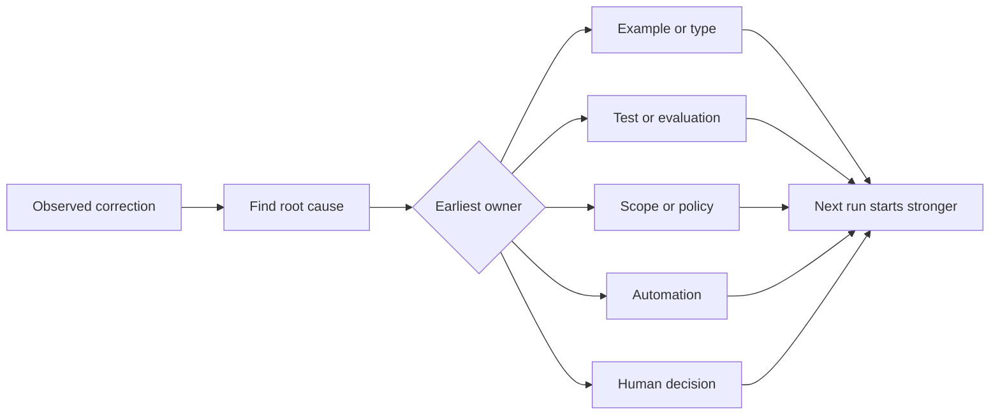

# Transforma cada correção de agente em uma melhoria do sistema.

> Uma correção que só vive no chat corrige uma execução. Uma correção promovida para um teste, limite, exemplo ou ferramenta melhora cada execução posterior.

> **【中文解读】**Apenas viver em registro de chat, apenas corrigir uma vez a execução; ser atualizado para testes, bordes, exemplos ou ferramentas corrigir, cada vez a execução após a melhoria.

> - Não .**【前置】**O curso de aprendizagem é um curso de aprendizagem de aprendizagem de aprendizagem de aprendizagem de aprendizagem de aprendizagem de aprendizagem de aprendizagem de aprendizagem de aprendizagem de aprendizagem de aprendizagem de aprendizagem de aprendizagem de aprendizagem de aprendizagem de aprendizagem de aprendizagem de aprendizagem de aprendizagem de aprendizagem de aprendizagem de aprendizagem de aprendizagem de aprendizagem de aprendizagem de aprendizagem de aprendizagem de aprendizagem de aprendizagem de aprendizagem de aprendizagem de aprendizagem de aprendizagem de aprendizagem de aprendizagem de aprendizagem de aprendizagem de aprendizagem de aprendizagem de aprendizagem de aprendizagem de aprendizagem de aprendizagem de aprendizagem de aprendizagem de aprendizagem de aprendizagem de aprendizagem de aprendizagem de aprendizagem de aprendizagem de aprendizagem de aprendizagem de aprendizagem de aprendizagem de aprendizagem de aprendizagem de aprendizagem de aprendizagem de aprendizagem de aprendizagem de aprendizagem de aprendizagem de aprendizagem de aprendizagem de aprendizagem de aprendizagem de aprendizagem de aprendizagem de aprendizagem de aprendizagem de aprendizagem de aprendizagem de aprendizagem de aprendizagem de aprendizagem de aprendizagem de aprendizagem de aprendizagem de aprendizagem de aprendizagem de aprendizagem de aprendizagem de aprendizagem de aprendizagem de aprendizagem de aprendizagem de aprendizagem de aprendizagem de aprendizagem de aprendizagem de aprendizagem de aprendizagem de aprendizagem de aprendizagem de aprendizagem de aprendizagem de aprendizagem de aprendizagem de aprendizagem de aprendizagem de aprendizagem de aprendizagem de aprendizagem de aprendizagem de aprendizagem de aprendizagem de aprendizagem de aprendizagem de aprendizagem de aprendizagem de aprendizagem de aprendizagem de aprendizagem de aprendizagem de aprendizagem de aprendizagem de aprendizagem de aprendizagem de aprendizagem de aprendizagem de aprendizagem de aprendizagem de aprendizagem de`outputs/feedback-ratchet.json`É um futuro de mudanças de trabalho.

**Type:** Learn + Build | **类型:** 学习 + 动手实践
**Languages:** Python (stdlib) | **语言:** Python（标准库）
**Prerequisites:** Phase 14 lessons 37 to 41 | **前置知识:** Phase 14 第 37-41 课
**Time:** ~65 minutes | **时间:** 约 65 分钟

## Objetivos de aprendizagem

- Convertem correções de agente em controles duráveis.
  Tradução do inglês para tradução do inglês para inglês para tradução do inglês para inglês para inglês para tradução do inglês para inglês para inglês para inglês para inglês para inglês para inglês para inglês para inglês para inglês para inglês para inglês para inglês para inglês para inglês para inglês para inglês para inglês para inglês para inglês para inglês para inglês para inglês para inglês
- Coloque cada controlo na camada mais antiga que possa impedir a recorrência.
  Tradução do inglês: 把每个控制放在能预防复发的最早一层.
- Desdobrar aulas repetidas com impressões digitais estáveis.
  Tradução do inglês para Chinês: using steady finger纹为重复的教训去重──
- Retirar controles que não protegem mais um risco real.
  O que é que é o que é o que é o que é o que é o que é o que é o que é o que é o que é o que é o que é o que é o que é o que é o que é o que é o que é o que é o que é o que é o que é o que é o que é o que é o que é o que é o que é o que é o que é o que é o que é.

## Correções são provas. Correção é prova.

Quando você diz a um agente  não editar esse arquivo, você aprendeu que o limite de alcance não era executável. Quando você diz  esta forma de saída é errada, você aprendeu que um exemplo ou teste estava faltando. Quando a configuração falha novamente, você aprendeu que o conhecimento do ambiente pertence à automação.

> Quando você diz ao Agente: "Bei modificar aquele documento"", você aprende que o alcance da fronteira é impossível de executar;. Quando você diz:" Essa forma de saída não é válida "; você aprende que: falta um exemplo ou teste;. Quando o ambiente é construído novamente falha, você aprende que o conhecimento ambiental deve se automatizar.

Trate a correção como uma observação sobre o sistema de trabalho, não como um erro de escrita imediato.

> O que é preciso para melhorar a percepção do sistema de trabalho, em vez de um simples falha de escrita.

> **【中文解读】**Esta seção mudou de perspectiva: cada correção é um sistema que relata suas falhas. "Fonteiras impossíveis de executar", "exemplos faltantes", "conhecimento sem queda".

## Promover para a primeira camada eficaz .

Use esta ordem:

> 按这个顺序升级:

| Recurring failure | Durable destination |
|---|---|
| Wrong result or regression | Test or evaluation |
| Off-scope or unsafe action | Scope or permission policy |
| Repeated setup or command mistake | Automation or tool |
| Repeated output-format mistake | Canonical example plus validator |
| Ambiguous local convention | Instruction with a scenario check |
| Product disagreement | Human decision record |

Os controles anteriores são mais baratos. Um tipo que impede um estado inválido é mais forte do que um comentário de revisão que o capta mais tarde. Um teste focado é mais forte do que um parágrafo pedindo ao agente para se lembrar.

> 越早的控制越便宜── um tipo de prevenção do surgimento de estados ilegais,强过一条事后才抓住它评审评论── um teste focado,强过一段求代理"记住"的文字──

> **【中文解读】**Este quadro é o quadro central de decisão do curso: resultados erroneamente elevados para testar/avaliar; estratégias de controle de limites; repetidas corridas de controle de ambientes para automatizar; formato erroneamente elevados para especificar exemplos e exames; instruções de controle de cenário; produtos discriminados para determinar a qualidade do produto.



> 图解: observar a correção → 找根因 → 判定最早的责任层(exemplos/ tipos、测试/评估、范围/策略、自动化、人工决定)→ Próxima execução a partir de um ponto de partida mais forte começar。

## O Registo Ratchet.

Captura:

> 记录这些字段:

- Sintoma;
  Tradução do português: sintomas;
- Causa raiz;
  Tradução do português: root因;
- Consequência;
  Tradução: 后果;
- Número de recorrências;
  Tradução do português:
- O controlo escolhido;
  Tradução do inglês:
- Verificação para o controlo;
  Tradução do inglês: control of its own verification method;
- proprietário;
  Tradução do inglês:
- data de revisão ou de aposentadoria.
  Tradução do inglês: 复审或退役日期──

Não promover todas as preferências únicas, mas promover uma correcção quando a recorrência ou consequência justificar a complexidade permanente.

> Não melhore cada preferência de uma vez. Só quando a repetição de vezes ou de consequências graves para a importância de introduzir uma complexidade permanente, é que a melhoria corrige esta frase.

> **【中文解读】**O primeiro garante que este controle realmente interrompeu a vida, se não apenas consolação psicológica; o segundo admite que o controle tem vida útil.

> - Não .**【类比】**棘轮手像一个只不跌的储蓄──之前: cada vez que se corre é do zero em diante, dizendo que se esquece;后: cada vez que se corre é o que impulsiona o 轮单向前进一格, o sistema só se torna forte, não retorna.

## Causa separada dos sintomas.

O agente editado README é um sintoma.

> "Agente 改了 README" é um sintoma.

- A tarefa permitiu a raiz do repositório;
  Tradução do inglês: tasks allowed warehouse root directory;
- Os documentos foram implicitamente considerados seguros;
  中文翻译:文档被默认当作安全区;
- A execução e a documentação do plano em conjunto;
  Tradução do inglês: plan把实现和文档捆绑在一起;
- Dois trabalhadores tinham propriedade sobrepostas.
  Chinese: 翻译: dois trabalhadores têm sobreposto o direito de propriedade.

Cada causa pertence a um controle diferente, uma regra que apenas repete o sintoma falhará no próximo caso ligeiramente diferente.

> Cada causa é controlada de forma diferente. Apenas repito as regras dos sintomas, na próxima vez que houver uma situação um pouco diferente, falharão.

> **【中文解读】**É o passo mais fácil de roubar: escrever "Beija alterar README" em regras é fácil, encontrar "Por que será alterado" é difícil. Mas quatro razões possíveis se referem a quatro diferentes formas de modificação: estreita e permitida viagem, claramente definindo uma via proibida, separando o plano, e a expressão "README" não tem relação com isso.

## Os controles também se deterioram.

Os controles antigos podem entrar em conflito, inchar conteúdo e codificar um sistema que não existe mais.

> 旧控制会相互冲突、大上下文、并固化一个已经不存在的系统──每条升级过的规则都需要退役检查── Quando surgirem as seguintes situações, é necessário eliminar ou reescrevê-la:

- A arquitetura subjacente mudou;
  Tradução do inglês: base-level architecture has changed;
- O controlo executável mais forte o substituiu;
  Tradução do inglês: 更强的可执行控制取代了它;
- A falha não se repetiu numa janela significativa;
  Tradução do inglês: In a meaningful time window
- O controlo cria mais atrito do que o risco que prevê.
  O controle da fricção da fabricação já ultrapassou o risco de resistência.

O objetivo não é o arquivo de instruções mais longo, mas o sistema mais pequeno que preserva o julgamento duramente ganho.

> O objetivo não é o maior documento de instruções, mas sim o menor sistema de poder de julgamento de conservação.

> **【中文解读】**棘轮只进不退,但控制会过期──" Cada regra deve ter cheque de退役" é diretamente relacionado ao mantenimento de um projeto como Agentes.md: não se acumulam regras de eliminação, finalmente se encontram em conflito, se afundam em peso, descrevem um sistema inexistente── o objetivo é "construir o menor sistema de poder de julgamento", não é o mais longo.

## Construí-lo e realizei-o.

O laboratório classifica as correções, promove-as em controles, duplica as impressões digitais e escreve.`outputs/feedback-ratchet.json`- Não .

> A parte experimental vai para a correção de classes, as elevar para controle, usar o punho para pesar, e escrever.`outputs/feedback-ratchet.json`- Não.

- Correr .

> 运行:

```bash
python3 code/main.py
python3 -m unittest discover code/tests -v
```

Adicionar duas correções de formulação diferente com a mesma causa. Melhorar a normalização até que eles colapsem em um controle sem que colapsem falhas não relacionadas.

> 加入两条措辞不同但根因相同的纠正──改进归化逻辑,直到它们合并成一个控制,同时不让无关的失败被错合并──

> **【中文解读】**破坏实验演示指纹去重的关键张力:归一化太松,同一根因的两条纠正各立一条控制;太紧,无关失败被错合并;错伤;错伤;错伤;错伤;错伤;错伤;错伤;错伤;错伤;错伤;错伤;错伤;错伤;错伤;错伤;错伤;错伤;错伤;错伤;错伤;错伤;错伤;错伤;错伤;错伤;错伤;错伤;错伤;错伤;错伤;错伤;错伤;错伤;错伤;错伤;错伤;错伤;错伤;错伤;错伤;错伤;错伤;错伤;错伤;错伤;错伤;错伤;错伤; 错伤; 错伤; 错伤; 错伤; 错伤; 错伤; 错伤; 错伤; 错伤; 错伤; 错伤; 错伤; 错伤; 错伤; 错伤; 错伤; 伤; 伤; 伤; 伤; 伤; 伤; 伤; 伤; 伤; 伤; 伤; 伤; 伤; 伤; 伤; 伤; 伤; 伤; 伤; 伤; 伤; 伤; 伤; 伤; 伤; 伤; 伤; 伤; 伤; 伤; 伤; 伤; 伤; 伤; 伤; 伤; 伤; 伤; 伤; 伤; 伤; 伤; 伤; 伤; 伤; 伤; 伤; 伤; 伤; 伤; 伤; 伤; 伤; 伤; 伤; 伤; 伤; 伤; 伤; 伤; 伤; 伤; 伤; 伤; 伤; 伤; 伤; 伤; 伤; 伤; 伤; 伤; 伤; 伤; 伤; 伤; 伤; 伤; 伤; 伤; 伤; 伤; 伤;

## Exercícios.

1. Tome cinco correções de uma sessão de codificação recente e classifique os seus verdadeiros proprietários.
   Tradução do inglês: From the most recent editing session里取五条纠正,分类它们的真正责任层──
2. Substitua uma regra de prosa por um teste executável.
   Tradução do inglês para tradução inglesa:把一条文字规则替换成一个可执行的测试――
3. Adicionar uma ponderação de consequências para que uma primeira ocorrência grave possa ser promovida imediatamente.
   Chinese: 加后果权重,让严重的第一次发生可以立即升级──
4. Adicione um proprietário e data de aposentadoria à saída do laboratório.
   Tradução do inglês para tradução do inglês:
5. Revisar uma instrução de agente existente e excluí-la apenas após provar que existe um controlo mais forte.
   Tradução do inglês para o inglês: review an existing Agent instruction, only in proof of existence of stronger control after deleting it.

## Mais leitura 延伸阅读

- [Basili, Caldiera, and Rombach, The Goal Question Metric Approach](https://www.cs.toronto.edu/~sme/CSC444F/handouts/GQM-paper.pdf), para transformar os objectivos em questões e medidas operacionais.
  Chinese Language Translation:Basili、Caldiera 与 Rombach目标问题量法把目标转化为问题和可操作的量量
- [Shinn et al., Reflexion](https://arxiv.org/abs/2303.11366), para utilizar os traços de feedback para melhorar as decisões posteriores sem alterar os pesos do modelo.
  Shinn 等Reflexion usou o seu caminho para melhorar a sua decisão e não mudar o seu modelo de peso
- [Madaan et al., Self-Refine](https://arxiv.org/abs/2303.17651), para feedback iterativo e revisão dentro de um loop de tarefas.
  Tradução do inglês para o inglês:Madaan 等Self-Refine task cycle interna de代反与修订──

## O que você mantém , o que você retém , o produto .

- Não .`outputs/feedback-ratchet.json`É o fim duradouro do caminho de Engenharia Assistida por Agentes e a entrada para futuras mudanças no banco de trabalho.

> - Não .`outputs/feedback-ratchet.json` é o ponto de fim permanente da rota de "Agente assistente engenharia" e também é o ponto de entrada de futuros trabalhos.
