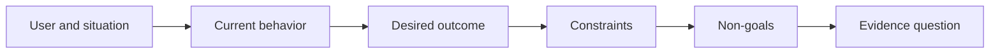

# Defina o resultado antes de escolher o resultado.

> A implementação rápida aumenta a penalidade por escolher o problema errado.

> **【中文解读】**"produção" (output) é algo que você decide construir: um ajudante, uma página, um modelo; "resultados" (output) é uma mudança observável no mundo em que alguém mudou melhor em qualquer situação.

> - Não .**【前置】**无硬性前置课程──本课是 47-54 课程『塑造构建』路径(结果定义 → 工作流发现 → 假设与风险 → 最小切片 → 规格 → 指标 → 分阶段发布 → 反所有权)

**Type:** Learn + Build | **类型:** 学习 + 动手实践
**Languages:** Python (stdlib) | **语言:** Python（标准库）
**Prerequisites:** None | **前置知识:** 无
**Time:** ~60 minutes | **时间:** 约 60 分钟

## Objetivos de aprendizagem

- Escreva um quadro de resultado sem nomear uma solução.
  Tradução do inglês para tradução do inglês: write out a result framework of any solution.
- Identifique o usuário, a situação, o comportamento atual e a mudança desejada.
  Chinese Language Translation: Identificar o usuário, a situação, o comportamento e as expectativas de mudança.
- Faça as restrições e os não-alvos explícitos.
  Tradução do inglês para tradução inglesa:把约束和非目标写明确――
- Detectar vazamento de solução antes de endurecer em escopo.
  Tradução do inglês: In solution leakage hardening into scope

## O resultado não é resultado. O resultado não é igual ao resultado.

Construir um assistente de incidente nomeia uma saída.

> "Fazer um assistente de acidente" é um nome de uma produção. Não diz quem precisa dela, o que vai mudar, o que deve ser seguro.

Um quadro de resultados diz:

> 结果框架 diz:

> Quando chega um alerta de produção, o engenheiro em serviço de chamada identifica o serviço falhado e uma ação segura seguinte dentro de dois minutos, enquanto o diagnóstico permanece apenas leitível e auditable.

> 译文: Quando o aviso de produção chega, o engenheiro de serviço pode localizar o serviço de falha em dois minutos e encontrar um próximo passo seguro, ao mesmo tempo em que o diagnóstico mantém o processo apenas leível e auditável.

Essa frase pode ser satisfeita por um software, um runbook, uma reparação de dados ou uma pequena alteração de interface.

> Essa frase pode ser feita por um software, um manual de trabalho, uma revisão de dados ou uma alteração de interface menor para satisfazer. Ela permite que a equipe fique determinada no resultado, em vez de fixar-se no produto que alguém primeiro imaginou.

> **【中文解读】**A diferença entre o resultado e o resultado é baseada neste curso: o resultado é apenas uma entrada para o espaço, o resultado é o ponto final de chegada. Este modelo vale a pena observar que não tem "assistente" "AI" "interface", só escreve quem, quando, muito rápido, o que não pode mudar.

## O quadro de seis partes.

| Part | Question |
|---|---|
| User | Who experiences the problem directly? |
| Situation | When and where does it occur? |
| Current behavior | What happens today, including workarounds? |
| Desired outcome | What observable state should improve? |
| Constraints | Which safety, policy, cost, or compatibility limits are fixed? |
| Non-goals | What tempting adjacent work is excluded? |



> 图解: usuário与情境 → 当前行为 → 期望结果 → 约束 → 非目标 → 证据问题,六段依序收紧──

> **【中文解读】**六段是有序的:先有人和情境,才谈到行为;先看清现状 (incluindo os métodos de contorno do presente),才谈到改变;约束收紧解空间, não-objetivo 住顺手的诱惑,最后落到"que observação pode provar resultados alcançados" (em inglês: "observando o que se pode provar que o resultado é alcançado").

## Encontrar solução Leakage , encontrar solução fuga

As declarações de resultados vazam soluções quando contêm uma forma de produto, interface, escolha de modelo, estrutura ou arquitetura que não foi obtida por evidências.

> Quando o resultado da apresentação contém uma forma, interface, modelo de seleção, estrutura ou estrutura de produtos que não foram comprovados, a solução já foi vazada.

- Os utilizadores recebem um resumo semanal da IA vazamentos do resumo e da cadência.
  Chinese Translation: "User recebe um resumo de IA por semana" e "resumo por semana" é um ritmo.
- Os utilizadores entendem as alterações da conta antes da aprovação declara o resultado.
  Chinese: "User está em fase de aprovação para entender o seu perfil".
- Deplojar um banco de dados de vetores vazamentos de infraestrutura.
  Chinese: "部署一个向量数据库" ("部署一个向量数据库") vazou infraestrutura.
- Devemos ter evidências políticas relevantes durante a revisãoindica uma capacidade.
  Tradução do inglês para "a capacidade de avaliar a situação de um país é de obter evidências de políticas".

As restrições podem nomear a tecnologia quando a compatibilidade realmente a corrige.

> Quando a compatibilidade está realmente bloqueada quando a tecnologia é escolhida, a tecnologia pode ser identificada.

> **【中文解读】**漏洞检测的判定:句子里出现了"product形态/界面/模型/框架/架构"级别的词语((AI 摘要、向量库、App), enquanto ainda não foi comprovado, é o "leakage" 四个例句两对照漏洞的句子锁死了"怎么做"",干净的句子只说"什么变好"",这直接防住""第一想象硬化成范围""

## As restrições protegem o resultado.

As restrições não são detalhes de implementação, fazem parte do objetivo do mundo real:

> 约束 não é implementar detalhes.

- Não há produção que escreva durante o diagnóstico;
  中文翻译: diagnóstico durante não escrever produção库;
- Resposta dentro do orçamento do tempo de incidente;
  Tradução do inglês:
- Os eventos de auditoria existentes continuam a ser autorizados;
  Tradução do inglês:
- Não haverá nova dependência do tempo de execução;
  Não introduzir novos operadores;
- O comportamento de acessibilidade permanece intacto.
  Não há obstáculos para manter o comportamento perfeito.

Uma construção que atinge o resultado por violar uma restrição não alcançou o resultado.

> Uma construção que chegou contra a lei não teve resultados realmente alcançados.

> **【中文解读】**束写在结果框架里而不是 PR 描述里,原因是最后一句: violação do 束的"sucesso" não é considerado sucesso.

## Não-Objetivos Criar uma Fronteira Não-Objetivos Marcar Fronteiras

Os objetivos não-focais impedem que uma fatia útil se torne uma plataforma.

> Não-objectivo é impedir que um pedaço útil se espalhe para uma plataforma.

- Não há remediação automática;
  Não faz auto-reconstrução.
- Não há novo sistema de envio de alertas;
  Não construímos um novo sistema de segurança.
- Não substituir o comandante do incidente;
  Não se pode substituir o comando de um acidente.
- Não há análises históricas nesta fatia.
  Chinese:                                                                                                                                                                                                                                                              

> **【中文解读】**Não-objectivo é um espaço negativo de alcance, com a construção de "caminhos proibidos" no quadro de tarefas do 43o curso.

## Construí-lo e realizei-o.

O laboratório valida um`OutcomeFrame`E escreve.`outputs/outcome-frame.json`- Não .

> 实验部分会校验一个 `OutcomeFrame`Não escrevi`outputs/outcome-frame.json`- Não.

```bash
python3 code/main.py
python3 -m unittest discover code/tests -v
```

Substitua o resultado desejado por utilizar o assistente de incidente. O validador deve indicar que o resultado proposto foi filtrado no resultado.

> O resultado esperado deve ser substituído por "assistente de uso de acidentes".

> **【中文解读】**破坏实验把"泄漏检测"变成一条机械规则:期望结果一一旦出现解法形态(use/build/deploy加产品名),校验器就拒绝──人工评审时同样只需要问一句:"这句删掉产品名还成立吗?

## Exercícios.

1. Reescrever um pedido de recurso do seu backlog como um quadro de resultado.
   Tradução do inglês para tradução inglesa:把你后载里的一条功能请求重写成结果框架──
2. Adicionar uma restrição que altera as soluções que permanecem possíveis.
   Chinese Translation:加一条能改变" quais soluções ainda podem ser feitas "
3. Adicione dois não-alvos que mantenham a primeira fatia pequena.
   Chinese:加两条非目标,让第一切片保持小──
4. Identifique a observação mais antiga que refutaria o resultado desejado.
   Chinese Translation: indicar o primeiro 能证伪期望结果的观察.
5. Escreva três resultados diferentes que poderiam satisfazer o mesmo resultado.
   Tradução do inglês para o inglês: write out three different products, they all can satisfy the same result.

## Mais leitura 延伸阅读

- [Nuseibeh and Easterbrook, Requirements Engineering: A Roadmap](https://www.cs.toronto.edu/~sme/papers/2000/ICSE2000.pdf), para tratar metas do mundo real como a âncora para o trabalho de software.
  Tradução do inglês para o inglês: Nuseibeh 与 Easterbrook 需求工程:路线图把真实世界目标当作软件工作的点──
- [Dardenne, van Lamsweerde, and Fickas, Goal-Directed Requirements Acquisition](https://doi.org/10.1016/0167-6423(93)90021-G), para refinar os objectivos de alto nível em restrições e requisitos operacionais.
  Tradução do inglês:Dardenne、van Lamsweerde 与 Fickas目标导向的需求获取把高层目标精化为约束与可操作的需求──

## O que você mantém , o que você retém , o produto .

- Não .`outputs/outcome-frame.json`A próxima lição testa-o contra o fluxo de trabalho que as pessoas realmente executam.

> - Não .`outputs/outcome-frame.json` Next Class will take it to look at people's actual execution workflow to check
