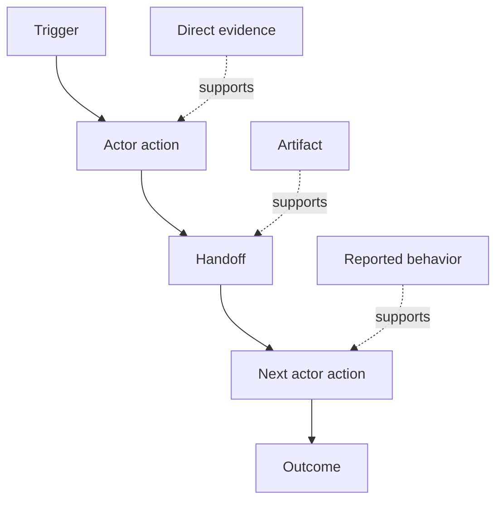

# Descubra o fluxo de trabalho que as pessoas realmente executam.

> Os requisitos não estão esperando em uma reunião para ser coletados, mas estão espalhados por ações, soluções, registros e desentendimentos.

> **【中文解读】**O que você precisa é de um processo de desenvolvimento de uma empresa que se desenvolve em uma empresa ou empresa, que é uma empresa que desenvolve uma empresa ou empresa, que é uma empresa ou empresa, que é uma empresa ou empresa, que é uma empresa ou empresa, que é uma empresa ou empresa, que é uma empresa ou empresa, que é uma empresa ou empresa, que é uma empresa ou empresa, que é uma empresa ou empresa, que é uma empresa ou empresa, que é uma empresa ou empresa, que é uma empresa ou empresa, que é uma empresa ou empresa, que é uma empresa ou empresa, que é uma empresa ou empresa, que é uma empresa ou empresa, ou seja, uma empresa ou empresa, que é uma empresa ou empresa, ou seja, uma empresa ou empresa, ou seja, uma empresa ou empresa, ou seja, uma empresa ou um parceiro ou um parceiro ou um parceiro ou um parceiro ou um parceiro ou um parceiro ou um parceiro ou um parceiro ou um parceiro ou um parceiro ou um parceiro ou um parceiro ou um parceiro ou um parceiro ou um parceiro ou um parceiro ou outro.

> - Não .**【前置】**O resultado da fase 14 é o quadro de resultados exibidos: os resultados esperados devem depender do fluxo de trabalho real das pessoas, e não do fluxo de trabalho imaginário.`outputs/workflow-evidence.json`, a próxima aula transformará o atrito e a incerteza observados num mapa hipotético.

**Type:** Learn + Build | **类型:** 学习 + 动手实践
**Languages:** Python (stdlib) | **语言:** Python（标准库）
**Prerequisites:** Phase 14 lesson 47 | **前置知识:** Phase 14 第 47 课
**Time:** ~70 minutes | **时间:** 约 70 分钟

## Objetivos de aprendizagem

- Modela o fluxo de trabalho atual como ações ordenadas com evidências.
  Tradução do inglês para tradução do inglês:
- Separar observação direta do comportamento relatado ou inferido.
  Tradução do inglês para o inglês:把直接观察与口述、推断的行为区分开――
- Localize o atrito, as entregações, a autoridade e o estado oculto.
  Chinese: 定位摩擦、交接、权限和隐藏状态──
- Mantenha visíveis as alegações incertas, em vez de transformá-las em requisitos.
  Deixe as afirmações não definidas manterem-se visíveis, em vez de transformá-las em necessidades.

## Comece com o Sistema atual.

Não comece por perguntar quais são as características que as pessoas querem, comece por reconstruir o que acontece agora.

> Não pergunte ao povo o que quer que funcione.

Para cada passo, registar:

> Para cada passo, registem:

| Field | Example |
|---|---|
| Actor | On-call engineer |
| Trigger | Production alert arrives |
| Action | Opens alert, then searches dashboards |
| Input | Alert payload and deployment record |
| Output | Candidate service and owner |
| Friction | Context switching across three tools |
| Authority | Incident commander approves a write |
| Evidence | Screen recording, incident log, runbook |

O fluxo de trabalho é maior do que a tela. Inclui espera, copiar-pegar, canais laterais, aprovação, recuperação de erros e os passos que as pessoas deixaram de notar.

> 工作流比屏幕大──incluíam a espera, a cópia, a adesão, a aprovação, a recuperação de erros, bem como os passos que as pessoas já não reparam em.

> **【中文解读】**O que é que é que é que é que é que é que é que é que é que é que é que é que é que é que é que é que é que é que é que é que é que é que é que é que é que é que é que é que é que é que é que é que é que é que é que é que é que é que é que é que é que é que é que é que é que é que é que é que é que é que é que é que é que é que é que é que é que é que é que é que é que é que é que é que é que é que é que é que é que é que é que é que é que é que é que é que é que é que é que é que é que é que é que é que é que é que é que é que é que é que é que é que é que é que é que é que é que é que é que é que é que é que é que é que é que é que é que é que é que é que é que é que é que é que é que é que é que é que é que é que é que é que é que é que é que é que é que é que é que é que é que é que é que é que é que é que é que é que é que é que é que é que é que é que é que é que é que é que é que é que é que é que é que é que é que é que é que é que é que é que é que é que é que é que é que é que é que é que é que é que é que é que é que é que é que é que é que é que é que é que é que é que é que é que é que é que é que é que é que é que é que é que é que é que é que é que é que é que é que é que é que é que é que é que é que é que é que é que é que é que é que é que é que é que é que é que é que é que é que é que é que é que é que é que é que é que é que é que é que é que é que é que é que é que é que é que é que é que é que é que é que é que é que é que é que é que é que é que é que é que é que é que é que é que

## A evidência tem força. A evidência tem força fraca.

Use uma simples escada de provas:

> Usando uma simples escada de provas:

1. **Direct behavior:**Observação, rastreamento, gravação ou evento do sistema.
   Tradução:**直接行为：**Observar, rastrear, registar ou sistemar eventos.
2. **Artifact:**bilhete, cadastro de execução, registro, formulário ou saída concluída.
   Tradução:**产物：**工单、运维手册、日志、表单或已完成的作品──
3. **Reported behavior:**uma pessoa descreve o que faz.
   Tradução:**口述行为：**Alguém descreve o que fazer.
4. **Inference:**A equipa conclui o que provavelmente acontecerá.
   Tradução:**推断：**O grupo disse que o que aconteceu.

Os quatro podem ser úteis, apenas os dois primeiros provam o comportamento atual diretamente, e os outros são marcados para que a confiança não se infle silenciosamente.

> Os quatro níveis podem ser úteis, mas apenas os dois primeiros podem provar diretamente o comportamento atual.

> **【中文解读】**A prova de escada é uma medida de medida desta aula: a mesma frase "o engenheiro de trabalho primeiro verifica o painel de instrumentos", observada diretamente, o trabalho só está deixado, o pessoal diz, a equipe adivinha, a credibilidade é diferente de alguns arquivos.

> - Não .**【类比】**证据阶梯像新闻信源分级级──之前:会议纪要里里"大家都如此干"和录屏观察写成如理直气壮;后:每条记录带等级标签直接观察是第一手信源,口述是当事人回忆,推断是编辑推测,信度不再膨胀──



> 图解:触发 → 行动者动作 → 交接 → 下一个行动者动作 → 结果;不同强度的证据(直接证据、产物、口述) 分别支不同的步骤。

## Procura por Quatro Coisas

- **Friction:**esforço repetido, atraso, reentrada ou recuperação.
  Tradução:**摩擦：**Reinscrição ou recuperação de recursos.
- **Hidden state:**fatos levados em memória, conversa ou notas pessoais.
  Tradução:**隐藏状态：**Por memória, por conversas ou por fatos pessoais.
- **Authority:**A pessoa ou sistema autorizado a efectuar uma alteração consequente.
  Tradução:**权限：**Permitido fazer alterações pessoais ou sistemas com consequências.
- **Exceptions:**O caso em que o fluxo de trabalho normal deixe de ser normal.
  Tradução:**例外：**O normal não é mais normal.

As características da IA muitas vezes falham em entregas e exceções porque o caminho feliz era o único caminho moldado.

> A IA funciona sempre em relação às exceções, porque no início apenas criou um caminho feliz.

> **【中文解读】**Assim é o objetivo de alto valor no fluxo de trabalho: pontos de melhoria de indicadores de atrito; estado oculto é o maior obstáculo à automação; controle de direitos que deve ser mantido em um ponto de verificação artificial; exceção é a raiz comum de "expressão ambiental normal"", produção ambiental transformada"". A última frase que vale a pena ser copiada para baixo é apenas em função de IA projetada em um caminho feliz, exposta na primeira ligação ou na primeira exceção.

## Não mexa a diferença. Não mexa as diferenças.

Os dois utilizadores podem executar fluxos de trabalho diferentes por boas razões.

>  dois usuários podem estar executando diferentes fluxos de trabalho, e cada um tem uma razão válida  reter estas variações até que você perceba que elas representam:

- diferentes funções;
  中文翻译: diferentes角色;
- diferentes níveis de risco;
  Tradução do inglês: different风险等级;
- O processo anterior e o atual;
  Tradução do inglês: old flow with new flow并存;
- Diferenças de competência;
  Tradução do inglês:
- Uma verdadeira divergência política.
  Chinese: 一场真正的政策分歧.

Um fluxo de trabalho médio não pode descrever ninguém.

> Um fluxo de trabalho em média pode ser descrito.

> **【中文解读】**Colocar duas variações em uma "fluxo de trabalho médio" é a prática mais provinciana e também a mais perigosa: descreve um usuário não existente.

## Construí-lo e realizei-o.

O laboratório armazena evidências em cada etapa do fluxo de trabalho, valida a ordem e a confiança, calcula a relação entre evidências diretas e escreve `outputs/workflow-evidence.json`- Não .

> A parte experimentação fornece a cada processo de trabalho um teste de evidência, uma ordem de experimentação e de confiança, calcula a proporção de evidências diretas, e escreve.`outputs/workflow-evidence.json`- Não.

```bash
python3 code/main.py
python3 -m unittest discover code/tests -v
```

Adicione um caminho excepcional no qual o registro de implantação está faltando.

> Adição de um "Restaurante de registos de depósito" de forma excepcional.

> **【中文解读】**破坏实验练是例外建模: o processo dominante mantém a linearidade, a excepção como um ramo de prova própria, e não como um elemento de observação de um passo principal.

## Exercícios.

1. Reconstruir um fluxo de trabalho de um registro sem entrevistar ninguém.
   Não entrevistar ninguém, apenas de um jornal.
2. Entrevistar um utilizador e marcar todas as alegações que ainda não tenham provas diretas.
   Chinese: 面谈一位用户,标记每一条仍然缺少直接证据的断言──
3. Adicione um limite de autoridade e um passo de recuperação de falhas.
   Chinese Language Translation:加一个权限边界和一条失败恢复步骤──
4. Modelo de duas variantes de fluxo de trabalho sem as fundir.
   Chinese: 建模两条工作流变体,不合并它们──
5. Identifique uma característica proposta que remova um passo visível, mas deixa o trabalho oculto intocado.
   Tradução do inglês para o português: "Corte os passos visíveis, mas não encontre o trabalho oculto".

## Mais leitura 延伸阅读

- [Nuseibeh and Easterbrook, Requirements Engineering: A Roadmap](https://www.cs.toronto.edu/~sme/papers/2000/ICSE2000.pdf), especialmente o seu tratamento da elicitação como interpretação, modelagem e validação em vez de simples captura.
  Tradução do português:Nuseibeh e Easterbrook 需求工程:路线图特别是把需求获取看作解释、建模与验证,而不是简单采集──
- [Gotel and Finkelstein, An Analysis of the Requirements Traceability Problem](https://doi.org/10.1109/ICRE.1994.292398), por dificuldade em preservar a relação entre os requisitos e as suas fontes.
  O hotel e o Finkelstein 需求可追踪性问题分析 需求保留与其来源之间的关系的困难──

## O que você mantém , o que você retém , o produto .

- Não .`outputs/workflow-evidence.json`Transforma o atrito e a incerteza observados num mapa de suposições na próxima lição.

> - Não .`outputs/workflow-evidence.json`❖ Next Class will transformar o atrito observado e a incerteza em um mapa hipotético.
