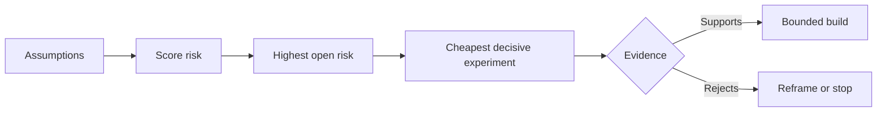

# Mapa de Suposições e Resolver o Risco Um Primeiro

> Um mapa de estrada esconde incerteza dentro de características.

> **【中文解读】**路线图把不确定性藏在一个"功能"里;假设地图将"这些功能值得存在的前提"摊在桌面上. 本课是代理工程方法论系列. 阶段 14 · 43-54) 里承承起起起起起起起起起起起起起起起起起起起起起起起起起起起起起起起起起起起起起起起起起起起起起起起起起起起起起起起起起起起起起起起起起起起起起起起起起起起起起起起起起起起起起起起起起起起起起起起起起起起起起起起起起起起起起起起起起起起起起起起起起起起起起起起起起起起起起起起起起起起起起起起起起起起起起起起起起起起起起起起起起起起起起起起起起起起起起起起起起起起起起起起起起起起起起起起起起起起起起起起起起起起起起起起起起起起起起起起起起起起起起起起起起起起起起起起起起起起起起起起起起起起起起起起起起起起起起起起起起起起起起起起起起起起起起起起起起起起起起起起起起起起起起起起起起起起起起起起起起起起起起起起起起起起起起起起起起起起起起起起起起起起起起起起起起起起起起起起起起起起起起起起起起起起起起起起起起起起起起起起起起起起起起起起起起起起起起起起起起起起起起起起起起起起起起起起起起起起起起起起起起起起起起起起起起起起起起起起起起起起起起起起起起起起起起起起起起起起起起起起起起起起起起起起起起起起起起

> - Não .**【前置】**O estudo de um estudo de um estudo de um estudo de um estudo de um estudo de um estudo de um estudo de um estudo de um estudo de um estudo de um estudo de um estudo de um estudo de um estudo de um estudo de um estudo de um estudo de um estudo de um estudo de um estudo de um estudo de um estudo de um estudo de um estudo de um estudo de um estudo de um estudo de um estudo de um estudo de um estudo de um estudo de um estudo de um estudo de um estudo de um estudo de um estudo de um estudo de um estudo de um estudo de um estudo de um estudo de um estudo de um estudo de um estudo de um estudo de um estudo de um estudo de um estudo de um estudo de um estudo de um estudo de um estudo de um estudo de um estudo de um estudo de um estudo de um estudo de um estudo de um estudo de um estudo de um estudo de um estudo de um estudo de um estudo de um estudo de um estudo de um estudo de um estudo de um estudo de um estudo de um estudo de um estudo de um estudo de um estudo de um estudo de um estudo de um estudo de um estudo de um estudo de um estudo de um estudo de um estudo de um estudo de um estudo de um estudo de um estudo de um estudo de um estudo de um estudo de um estudo de um estudo de um estudo de um estudo de um estudo de um estudo de um estudo de um estudo de um estudo de um estudo de um estudo de um estudo de um estudo de um estudo de um estudo de um estudo de um estudo de um estudo de um estudo de um estudo de um estudo de um estudo de um estudo de um estudo de um estudo de um estudo de um estudo de um estudo de um estudo de um estudo de um estudo de um estudo de um estudo de um estudo de um estudo de um estudo de um estudo de um estudo de um estudo de um estudo de um estudo de um estudo de um estudo de um estudo de um estudo de um estudo de um estudo de um estudo de um estudo de um estudo de um estudo de um estudo de um estudo de um estudo de um estudo de um estudo de um estudo de um estudo de um estudo de um estudo de um estudo de um estudo de um estudo de um estudo sobre sobre o estudo de um estudo de um estudo de um estudo de um estudo de um estudo sobre o assunto sobre o assunto sobre o assunto sobre o assunto sobre o assunto sobre o assunto sobre o assunto sobre o assunto sobre o assunto sobre o assunto`outputs/assumption-map.json`A partir da primeira leitura, o texto é publicado em "A primeira leitura é a primeira leitura".

**Type:** Learn + Build | **类型:** 学习 + 动手实践
**Languages:** Python (stdlib) | **语言:** Python（标准库）
**Prerequisites:** Phase 14 lesson 48 | **前置知识:** Phase 14 第 48 课
**Time:** ~65 minutes | **时间:** 约 65 分钟

## Objetivos de aprendizagem

- Convertem o trabalho proposto em suposições explícitas.
  Tradução do inglês para tradução do inglês para inglês para tradução do inglês para inglês para tradução do inglês para inglês para inglês para tradução do inglês para inglês para inglês para inglês para inglês para inglês para inglês para inglês para inglês para inglês para inglês para inglês para inglês para inglês para inglês para inglês para inglês para inglês para inglês para inglês para inglês para inglês para inglês para inglês para inglês para inglês para inglês para inglês
- O impacto, a incerteza e a irreversão são indicados separadamente.
  Tradução do inglês para o inglês:
- Escolha a próxima experiência por risco, não pelo entusiasmo.
  Tradução do inglês:
- Substituir as suposições testadas por evidências e decisões.
  Tradução do inglês para tradução do inglês: using evidence and decision to replace the already verified assumption.

## Cada edifício contém apostas.

Uma ferramenta de incidente pode depender de que todas estas informações sejam verdadeiras:

> Uma ferramenta de tratamento de acidentes pode depender das seguintes disposições:

- O contexto de alerta contém informações suficientes para identificar um serviço;
  Tradução do inglês para tradução do inglês:
- Os engenheiros confiam numa recomendação que não foram eles próprios a obter;
  Tradução do inglês: Ingeniester会信任一条 não é um conselho de si mesmo;
- O tempo de resposta desejado é importante operacionalmente;
  Tradução do inglês: expectativa de resposta tempo em运维上真重要;
- Os dados necessários podem ser acessados sem autoridade insegura;
  Tradução do inglês:
- O fluxo de trabalho ocorre com frequência suficiente para justificar a manutenção.
  O trabalho é muito importante para a saúde.

Estas não são tarefas de implementação, mas condições para que a construção seja valiosa, utilizável, viável e segura.

> Estas não são tarefas realizadas, mas as condições de construção de "valor, disponibilidade, viabilidade, segurança".

> **【中文解读】**A cada linha da lista de funções, há várias observações ocultas: o usuário usará o código, os dados serão obtidos, a organização será capaz de manter o código. O roteiro nunca mostra essas observações, elas só serão mostradas em forma de uso ou descartado após a conclusão.

## Classe de suposição

| Class | Question |
|---|---|
| Value | Will the outcome matter enough? |
| Usability | Can the user understand and act on it? |
| Feasibility | Can the system produce it with available data and constraints? |
| Viability | Can the organization sustain cost, ownership, and operation? |
| Safety | Can it fail without unacceptable consequence? |

> **【中文解读】**五类假设各问一个问题:价值 (值) 结果足够重要吗) 可用性 (可用性) 用户看懂并能根据此行动吗) 可用性 (可用性)  生存能力 (conhecimento de custos, atribuição e funcionamento)  安全性 (conhecimento de custos, atribuição e funcionamento)                                                                                                                                                                                                                     

Escreva suposições como declarações falsificáveis. A característica é útil não pode ser testada. Oito de dez engenheiros em chamada identificam o serviço correto mais rapidamente com o resultado de somente leitura pode.

> "Esta função é útil" não é um teste; "oito dos 10 engenheiros de valor em trabalho só podem ler os resultados mais rapidamente para se posicionar no serviço correto".

## O risco não é um número.

O laboratório usa três dimensões de um a cinco:

> 实验代码用三个 1 到 5 的维度:

- **Impact:**danos se a suposição for falsa.
  Tradução:**影响：**假设为假时的损失── Não é o caso.
- **Uncertainty:**fraqueza das provas atuais.
  Tradução:**不确定性：**Há provas de que há pouca informação.
- **Irreversibility:**custos de aprendizagem após o compromisso.
  Tradução:**不可逆性：**押上承诺后再学习的代价──

A pontuação do exemplo multiplica o impacto e a incerteza, adicionando então a irreversão. A fórmula não é universal.

> Exemplos de avaliação: o impacto multiplicado por incerteza, mais adicionado à irreversão. Esta fórmula não é comum, o seu objetivo é fazer a equipe dizer claramente: por que esse problema desconhecido deve ser resolvido antes do problema desconhecido.

> - Não .**【类比】**假设排雷像拆迁前的房屋检查: 每面墙(假设) 分别量三数已塌多大面积(影响) 结构判断有多拿不准(不确定性) 错了还能不能回去(不可逆性) 首处理"caiu mais doente + 最拿不准 + 不回去" naquela parede, não melhor naquela face。



> **【中文解读】**Esse esquema é um dos principais motores do curso: Fonte: Fonte: Fonte: Fonte: Fonte: Fonte: Fonte: Fonte: Fonte: Fonte: Fonte: Fonte: Fonte: Fonte: Fonte: Fonte: Fonte: Fonte: Fonte: Fonte: Fonte: Fonte: Fonte: Fonte: Fonte: Fonte: Fonte: Fonte: Fonte: Fonte: Fonte: Fonte: Fonte: Fonte: Fonte: Fonte: Fonte: Fonte: Fonte: Fonte: Fonte: Fonte: Fonte: Fonte: Fonte: Fonte: Fonte: Fonte: Fonte: Fonte: Fonte: Fonte: Fonte: Fonte: Fonte: Fonte: Fonte: Fonte: Fonte: Fonte: Fonte: Fonte: Fonte: Fonte: Fonte: Fonte: Fonte: Fonte: Fonte: Fonte: Fonte: Fonte: Fonte: Fonte: Fonte: Fonte: Fonte: Fonte: Fonte: Fonte: Fonte: Fonte: Fonte: Fonte: Fonte: Fonte: Fonte: Fonte: Fonte: Fonte: Fonte: Fonte: Fonte: Fonte: Fonte: Fonte: Fonte: Fonte: Fonte: Fonte: Fonte: Fonte: Fonte: Fonte: Fonte: Fonte: Fonte: Fonte: Fonte: Fonte: Fonte: Fonte: Fonte: Fonte: Fonte: Fonte: Fonte: Fonte: Fonte: Fonte: Fonte: Fonte: Fonte: Fonte: Fonte: Fonte: Fonte: Fonte: Fonte: Fonte: Fonte: Fonte: Fonte: Fonte: Fonte: Fonte: Fonte: Fonte: Fonte: Fonte: Fonte: Fonte: Fonte: Fonte: Fonte: Fonte: Fonte: Fonte: Fonte: Fonte: Fonte: Fonte: Fonte: Fonte: Fonte: Fonte: Fonte: Fonte: Fonte: Fonte: Fonte: Fonte: Fonte: Fonte: Fonte: Fonte: F

## Projetar um experimento, não um ritual de confirmação.

Um teste útil tem:

> Um teste útil:

- Uma alegação que possa ser falsa;
  Tradução do inglês:
- Uma população ou uma amostra realista;
  Tradução do inglês:
- Um resultado observável;
  Tradução do inglês:
- Um limiar decidido antes do resultado;
  Tradução do inglês: a value determinada antes de ver o resultado;
- A próxima decisão é a de passar, falhar e provas ambíguas.
  Por viação, fracassos e erros.

Evite os testes que só demonstram que a equipe pode construir a ideia.

> Evitar os testes que só provam que a equipa consegue fazer isto.

> **【中文解读】**"Rituais de confirmação" significa as demonstrações que, independentemente do resultado, continuam a ser feitas. O demo conseguiu chegar ao topo, falhou em revisar novamente. A verdadeira experiência tem três sinais difíceis: afirmação pode ser falsa.

## Reversibilidade muda ordem. Reversibilidade muda ordem.

As escolhas irreversíveis e de alta consequência precisam de evidências anteriores. Uma repetição de somente leitura pode preceder uma integração de produção. Um adaptador temporário pode preceder uma migração de dados. Uma recomendação aprovada pelo ser humano pode preceder uma ação automática.

> Os resultados de uma seleção significativa e irreversível exigem provas mais rápidas.

A forma da construção deve seguir a forma da incerteza.

> A forma da construção deve acompanhar a forma de incerteza.

> **【中文解读】**O princípio da classificação tem apenas uma frase: quanto mais difícil for a decisão de retorno, quanto mais tempo necessário para obter provas em forma alternativa e barata.

## Construí-lo e realizei-o.

O laboratório classifica suposições, distingue as reivindicações testadas de abertas, seleciona o maior risco aberto e escreve `outputs/assumption-map.json`- Não .

> √ O código de experimento dá uma classificação de hipóteses √ a distinção entre as afirmações verificadas e ainda abertas √ a seleção de projetos abertos com maior risco, e escreve √`outputs/assumption-map.json`- Não.

```bash
python3 code/main.py
python3 -m unittest discover code/tests -v
```

Mudança das evidências sobre a suposição de maior risco e observe como a próxima experiência muda.

> 修改风险最高那条假设的证据 字段, observar "下一个实验" como isso se transforma.

> **【中文解读】** `risk_score = impact * uncertainty + irreversibility`É um cálculo intencionalmente simples que o seu significado de existência não é preciso, mas transformar "primeiro que fazer a experiência" em uma questão evidente de debate e repetição. Dado que uma suposição de suplemento de evidência, seu estado de abertura para testar, a próxima experiência automaticamente cai em um novo risco máximo: é "com evidência promover a prioridade", e não com conferência impulsionar.

## Exercícios.

1. Escreva cinco suposições para um recurso que deseja construir.
   Tradução do inglês para "For You Wanna Do"
2. Adicione uma suposição de segurança que a sua lista de características omitiu.
   Tradução do inglês:补一条你的功能清单遗漏的安全性假设──
3. Defina um limiar que te faça parar a construção.
   Definir um que te deixará parar com esta construção.
4. Substitua um grande experimento por um teste mais barato e decisivo.
   Tradução do inglês para o inglês:把一個大實驗換成一個更便宜的實驗,但也有決定性的測試.
5. Compare a classificação de riscos com a prioridade do roteiro e explique a desajuste.
   Chinese:                                                                                                                                                                                                                                                              

## Mais leitura 延伸阅读

- [Barry Boehm, A Spiral Model of Software Development and Enhancement](https://dl.acm.org/doi/10.1145/12944.12948), para um ciclo de desenvolvimento orientado ao risco que resolva a incerteza antes de um compromisso mais profundo.
  O desenvolvimento do modelo Boehm 螺旋模型 风险驱动的发展循环:在更深的承诺之前先解决不确定性──
- [Dardenne, van Lamsweerde, and Fickas, Goal-Directed Requirements Acquisition](https://doi.org/10.1016/0167-6423(93)90021-G), para refinar os objectivos ao mesmo tempo em que surgem obstáculos e restrições.
  O que é o "Dardenne" é o "Demand Acquiring" (Demand Obtain) que é o "Demand Obtain" (Demand Obtain) que é o "Demand Obtain" (Demand Obtain) que é o "Demand Obtain" (Demand Obtain) que é o "Objectivo Obtain" (Objectivo Obtain) que é o "Objectivo Obtain" (Objectivo Obtain) que é o "Objectivo Obtain" (Objectivo Obtain) que é o "Objectivo Obtain" (Objectivo Objetivo Objetivo Objetivo Objetivo Objetivo Objetivo Objetivo Objetivo Objetivo Objetivo Objetivo Objetivo Objetivo Objetivo Objetivo Objetivo Objetivo Objetivo Objetivo Objetivo Objetivo Objetivo Objetivo Objetivo Objetivo Objetivo Objetivo Objetivo Objetivo Objetivo Objetivo Objetivo Objetivo Objetivo Objetivo Objetivo Objetivo Objetivo Objetivo Objetivo Objetivo Objetivo Objetivo Objetivo Objetivo Objetivo Objetivo Objetivo Objetivo Objetivo Objetivo Objetivo Objetivo Objetivo Objetivo Objetivo Objetivo Objetivo Objetivo Objetivo Objetivo Objetivo Objetivo Objetivo Objetivo Objetivo Objetivo Objetivo Objetivo Objetivo Objetivo Objetivo Objetivo Objetivo Objetivo Objetivo Objetivo Objetivo Objetivo Objetivo Objetivo Objetivo Objetivo Objetivo Objetivo Objetivo Objetivo Objetivo Objetivo Objetivo Objetivo Objetivo Objetivo Objetivo Objetivo Objetivo Objetivo Objetivo Objetivo Objetivo Objetivo Objetivo Objetivo Objetivo Objetivo Objetivo Objetivo Objetivo Objetivo Objetivo Objetivo Objetivo Objetivo Objetivo Objetivo Objetivo Objetivo Objetivo Objetivo Objetivo Objetivo Objetivo Objetivo Objetivo Objetivo Objetivo Objetivo Objetivo Objetivo Objetivo Objetivo Objetivo Objetivo Objetivo Objetivo Objetivo Objetivo Objetivo Objetivo Objetivo Objetivo Objetivo Objetivo Objetivo Objetivo Objetivo Objetivo Objetivo Objetivo Objetivo Objetivo Objetivo Objetivo Objetivo Objetivo Objetivo Objetivo Objetivo Objetivo Objetivo Objetivo Objetivo Objetivo Objetivo Objetivo Objetivo Objetivo Objetivo Objetivo Objetivo Objetivo Objetivo Objetivo Objetivo Objetivo Objetivo Objetivo Objetivo Objetivo Objetivo Objetivo Objetivo Objetivo Objetivo Objetivo Objetivo Objetivo Objetivo

## O que você mantém , o que você retém , o produto .

- Não .`outputs/assumption-map.json`A próxima lição usa-o para escolher a parte mais pequena que possa produzir provas decisivas.

> - Não .`outputs/assumption-map.json`❖ A próxima aula irá usá-lo para selecionar os menores pedaços de provas decisivas.
