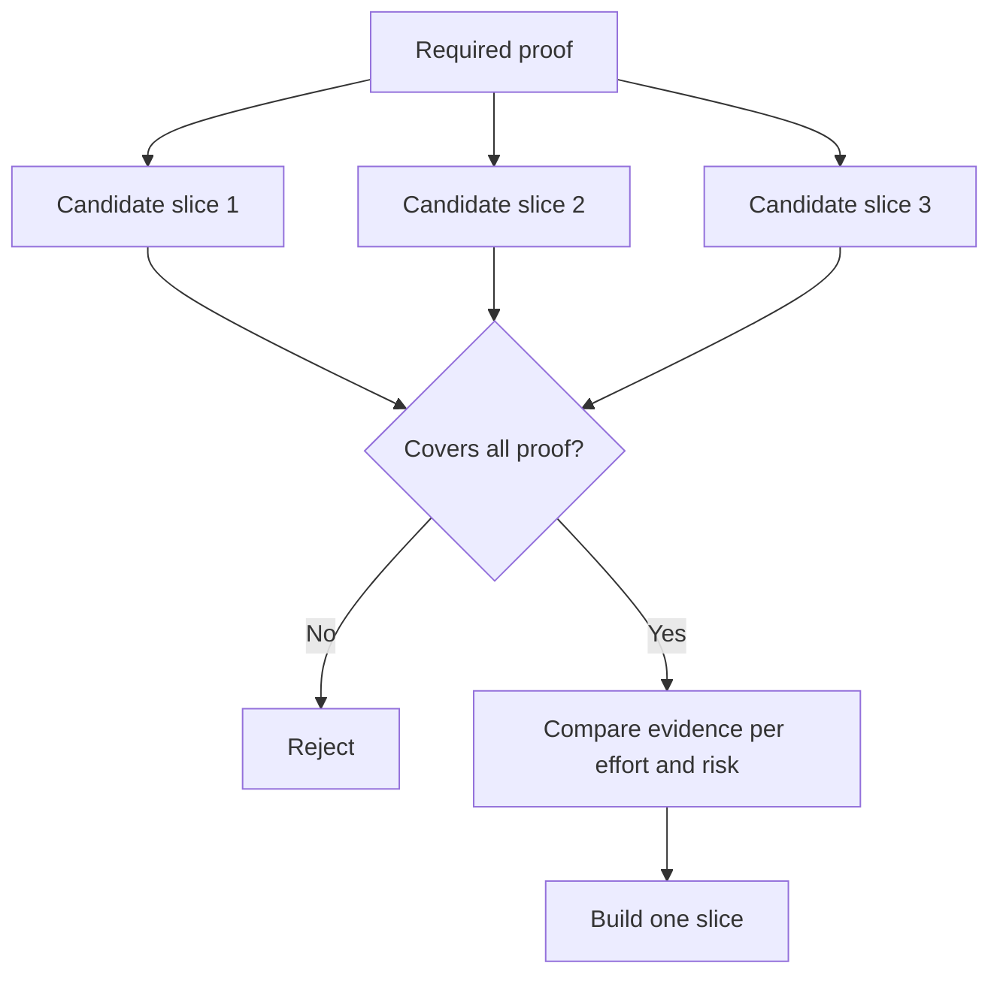

# Escolha a parte mais pequena que possa mudar a decisão

> Uma pequena construção que não pode mudar a próxima decisão é meramente incompleta.

> **【中文解读】**" fazer pequeno " só tem valor em ser capaz de provar que as coisas são necessárias quando o próximo passo é necessário. Uma pequena construção não pode mudar a decisão, não é o mínimo pedaço possível, apenas não é feito.

> - Não .**【前置】**O curso de ensino superior é um curso de ensino superior de ensino médio.`outputs/slice-decision.json`Será inserido no arquivo do artigo 51.o do Regulamento do Ensino.

**Type:** Learn + Build | **类型:** 学习 + 动手实践
**Languages:** Python (stdlib) | **语言:** Python（标准库）
**Prerequisites:** Phase 14 lesson 49 | **前置知识:** Phase 14 第 49 课
**Time:** ~65 minutes | **时间:** 约 65 分钟

## Objetivos de aprendizagem

- Defina uma fatia com base nas suposições que ela prova.
  Chinese: "切片能证明哪些假设" ("切片能证明哪些假设") para definir "切片").
- Equilibrar o valor do resultado, a redução da incerteza, o esforço e a consequência.
  Tradução do inglês:  中文翻译:在结果价值、不确定性消减、投入和后果之间做权衡──
- Prefere provas reversíveis ao compromisso de produção prematura.
  Tradução do inglês para tradução do inglês: Priority Selection可逆的证据, rather than premature production-grade commitments.
- Rejeitar as fatias que omitem a parte arriscada do fluxo de trabalho.
  Tradução do inglês: rejeitar os pedaços de que estão bem em torno do trabalho.

## Vertical significa Evidência de fim a fim.

Uma fatia útil cruza o fluxo de trabalho real mínimo necessário para observar um resultado. Pode ser estreita em usuários, dados, duração e capacidade. Não deve ser estreita eliminando a incerteza exata que você precisa testar.

> Um pedaço útil para atravessar "para observar um resultado" é o mínimo verdadeiro fluxo de trabalho necessário. Pode ser reduzido em usuário, dados, tempo, capacidade, mas não pode ser reduzido através de cortar "a incerteza que você está a verificar".

Exemplos:

> - Não .

- Uma repetição de apenas leitura em dez incidentes reais testa a identificação do serviço e a confiança do operador.
  Tradução do inglês em japonês: 跨十次真实事故的只读回放,能检验服务识别和操作者信任──
- Um painel polido em dados sintéticos pode testar a compreensão, mas não a viabilidade dos dados.
  Tradução do inglês para "Experimentar", em inglês.
- Um automediador de produção testa tudo de uma vez com consequências inaceitáveis.
  O processo de produção de um ambiente de produção é automático, uma vez examinado tudo, mas os resultados são inaceitáveis.

> **【中文解读】**"Longitud" significa de ponta a ponta abrir o verdadeiro fluxo de trabalho: entrada é real, caminho de decisão é real, pode observar um resultado.

> - Não .**【类比】**O que é um modelo de casa? Um tipo de casa, mas deve ter água real? Se o modelo não é hidrelétrico, ele sempre prova que não pode "viver para baixo"

## Defina prova necessária Primeiro define prova necessária

Tomar as suposições abertas de maior risco e transformá-las num conjunto de provas exigidas.

> 取出风险最高开放假设, transformá-los num "necessário conjunto de provas"──Candidatura só cobre este conjunto, é elegível para participar.

Em seguida, compare as fatias elegíveis em:

> Comparar entre os pedaços qualificados:

| Dimension | Direction |
|---|---|
| Outcome value | More is better |
| Uncertainty reduced | More is better |
| Effort | Less is better |
| Consequence | Less is better |
| Reversibility | More is better |

A pontuação do laboratório é intencionalmente simples.

> 实验代码的评分故意简单――资格门比算术更重要――



> **【中文解读】**A ordem aqui é o núcleo do curso: qualification gate (ponta de ombros) = "a primeira, a avaliação aritmética é a segunda". A avaliação é mais alta, mas a falta de uma prova necessária para não participar é o que impede que o "prefeito, mas também não provou" seja um programa de avaliação.

## Minimos falsos comuns

- **The UI-only minimum:**Elimina os dados e a incerteza operacional.
  Tradução:**只有 UI 的最小：**O que é que se passa com o sistema de informação?
- **The infrastructure-only minimum:**prova uma possibilidade técnica sem valor para o utilizador.
  Tradução:**只有基础设施的最小：**Prova de que foi feito de forma técnica, mas não prova de valor do usuário.
- **The happy-path minimum:**O que é mais perigoso é que não há excepção.
  Tradução:**只有正常路径的最小：**Perdeu a maior parte do risco de fabricação.
- **The demo minimum:**produz um artefato persuasivo, mas não uma medida repetível.
  Tradução:**演示级最小：**Produzido um show convincente, mas sem medidas repetíveis.
- **The platform minimum:**Construir máquinas reutilizáveis antes de um fluxo de trabalho ganhá-las.
  Tradução:**平台级最小：**Antes de qualquer trabalho demonstrar valor, já havia sido feito um aparelho reutilizablemente.

> **【中文解读】**五种假最小的各有各种诱惑:UI 最小出图快, infraestrutura mínima para o apetite de engenheiro, demonstração mínima para o melhor liderança. O ponto comum deles é que eles sistematicamente contornam o risco real.

## Adicione uma regra de parada.

Antes da implementação, escreva o que acontece se a fatia falhar:

> Antes de começar a fazer isso, escreva "Carte fracassou como vai acontecer":

- abandonar o resultado;
  Tradução do inglês: abandonando este resultado
- Alterar o utilizador-alvo ou a situação;
  Tradução do inglês para Chinês: 轉换目标用户或使用场景;
- Teste um mecanismo diferente;
  中文翻译:换一种机制再测;
- recolher melhores provas;
  Tradução do inglês:
- Mas ainda mais poder restrito.
  Tradução do inglês:

Se cada resultado levar à construção, a fatia não é um experimento.

> Se cada resultado for "continuar a fazer", esse pedaço não é uma experiência.

> **【中文解读】**停止规则是实验的"诚实检查": uma das conclusões são todos os pedaços de "continuar a construir", apenas usando o plano previamente estabelecido da experiência.

## Construí-lo e realizei-o.

O laboratório filtra os candidatos com as provas necessárias, marca as fatias elegíveis e escreve `outputs/slice-decision.json`- Não .

> 实验代码根据必证过候选人、给有资格的切片打分,并写出 `outputs/slice-decision.json`- Não.

```bash
python3 code/main.py
python3 -m unittest discover code/tests -v
```

Adicione um candidato mais barato que provem apenas uma suposição necessária.

> Adição de um único provando uma suposição necessária, mas mais barato candidato. Mesmo que seu valor numérico de avaliação seja muito alto, também deve ainda não ser qualificado para participar.

> **【中文解读】** `score = (结果价值 + 不确定性消减) / (投入 + 后果 × 不可逆系数)`只是排序工具; 真正的守门员是集合包含检查                                                                                                                                                                                                                                                                                                                                                                                                                                                                                                             `required_proof <= set(item.proves)`                                                                                                                                                                                                                                                              

## Exercícios.

1. Desenhar três fatias para o mesmo resultado em diferentes níveis de consequências.
   Tradução do inglês para o inglês: For the same result designing three different after-fruit grades
2. Indique a prova necessária antes de as marcar.
   Tradução do inglês:
3. Remover uma capacidade, preservando a prova decisiva.
   Tradução do inglês para Chinês: 砍掉一项能力,同时保住决定性的证据──
4. Adicione uma regra de parada para um piloto falhado.
   Tradução do inglês para Chinês:
5. Identificar um componente reutilizarável da plataforma que deve esperar até o término da fatia.
   Chinese:                                                                                                                                                                                                                                                              

## Mais leitura 延伸阅读

- [Barry Boehm, A Spiral Model of Software Development and Enhancement](https://dl.acm.org/doi/10.1145/12944.12948), para combinar cada ciclo de desenvolvimento com os riscos que deve resolver.
  O modelo de bobina de Boehm permite que cada ciclo de desenvolvimento se dependa do risco que deve ser resolvido.
- [Lenarduzzi and Taibi, MVP Explained: A Systematic Mapping Study on the Definitions of Minimal Viable Product](https://arxiv.org/abs/1609.07592), pela ambiguidade em torno de minimum e viable na prática de produtos de software.
  No entanto, o que não é verdade é que o "minimum" é um termo que significa "minimum" ou "可行".

## O que você mantém , o que você retém , o produto .

- Não .`outputs/slice-decision.json`Ele registra porque é que esta fatia é a menor que pode mudar a decisão.

> - Não .`outputs/slice-decision.json`Ele registra porque este pedaço é "o menor pedaço que pode mudar a decisão".
