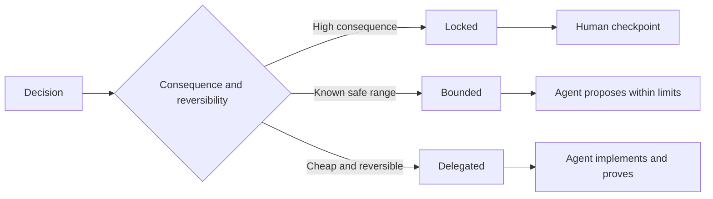

# Escreva especificações que preservam o julgamento.

> Uma especificação útil fixa invariantes e evidências, deixando as opções de implementação reversíveis abertas.

> **【中文解读】**Uma boa regulamentação bloqueia "invariabilidade e evidência", deixa a seleção de implementação reversível para o executor É a fronteira de decisão, não é um esboço                                                                                                                                                                                                                                         

> - Não .**【前置】**O curso de instrução é um curso de instrução em que os alunos podem aprender a fazer a sua própria tarefa.`outputs/executable-specification.json`É um agente codificador e um acordo comum de avaliação humana.

**Type:** Learn + Build | **类型:** 学习 + 动手实践
**Languages:** Python (stdlib) | **语言:** Python（标准库）
**Prerequisites:** Phase 14 lesson 50 | **前置知识:** Phase 14 第 50 课
**Time:** ~75 minutes | **时间:** 约 75 分钟

## Objetivos de aprendizagem

- Resultados separados, invariantes, exemplos, não-objetivos e prova.
  Tradução do inglês para tradução inglesa:区分结果、不变量、示例、非目标和证明──
- Marque as decisões como fechadas, limitadas ou delegadas.
  Tradução do inglês para Chinês:把每个决定标注为锁定、受限或委托──
- Preserva o julgamento dos agentes onde as escolhas são baratas e reversíveis.
  Tradução do inglês: In Choice Cheap and Reversal
- Requerem postos de controlo humanos onde as consequências ou o comportamento público mudem.
  Tradução do inglês para Chinês: Inforcement artificial checkpoint, em locais onde o comportamento público ou significativo mudar.

## Dois Extremos Ruins. Dois extremos Ruins.

Uma tarefa abaixo especificada pede a um agente para adivinhar o sistema.

> 规格不足的任务让代理去猜系统;规格过度的任务让它抄抄一条可能就就错的设计.

O meio útil é um contrato executável:

> O formato intermediário útil é um contrato executável:

| Surface | Purpose |
|---|---|
| Outcome | The observable result |
| Invariants | Conditions that must always remain true |
| Examples | Concrete cases that reveal intent |
| Non-goals | Adjacent behavior intentionally excluded |
| Decision policy | Which choices are locked, bounded, or delegated |
| Proof | Evidence required before completion |

> **【中文解读】**两个极端对应两种浪费:规格不足浪费在返工上(Agen 猜错了重做),规格过度浪费在翻译上(人把设计写成伪代码,Agen 再转抄成代码,中间没有增量智能) 六面契约是中间路:结果说清"要什么"、不变量说清"任何时候不能破坏什么"、示例传递意图、非目标划边界、决策政策声明授权、证明定义"完成"

## Três modos de decisão.

- **Locked:**O agente não deve escolher. Uso para compatibilidade pública, autoridade, segurança, custo irreversível ou compromisso com o produto.
  Tradução:**锁定（Locked）：**O agente não tem de ser escolhido por si mesmo.
- **Bounded:**O agente pode escolher dentro de limites explícitos. Uso para orçamentos de pesquisa, contagens de retest, dependências permitidas ou uma família de interface conhecida.
  Tradução:**受限（Bounded）：**O agente pode escolher dentro de limites definidos.
- **Delegated:**O agente é dono da escolha e deve explicá-la.
  Tradução:**委托（Delegated）：**O agente  possui essa escolha, mas deve ser capaz de explicá-la  para a estrutura local  nome  reversão e implementação  detalhes.



> **【中文解读】**Os três tipos de padrões de divisão são apenas um problema: os resultados e a reversão. Os resultados são grandes e irreversíveis. Os resultados são controlados e estabelecidos em um ponto de inspeção artificial. Os resultados são controlados, mas não são seguros. Os resultados são limitados. Os agentes são livres, e os resultados são convenientes e podem ser reversíveis. Os resultados são de acordo com os resultados.

> - Não .**【类比】**Três tipos de contratos de construção: contrato de construção de muros e de água em direção à morte; contrato de construção de muros e de água em direção à morte; contrato de construção de muros e de água em direção à morte; contrato de construção de muros e de água em direção à morte; contrato de construção de muros e de muros; contrato de construção de muros e de muros; contrato de construção de muros e de muros e de muros; contrato de construção de muros e de muros e de muros; contrato de construção de muros e de muros e de muros; contrato de construção de muros e de muros e de muros; contrato de construção de muros e de muros; contrato de construção de muros e de muros; contrato de construção de muros e de muros; contrato de construção de muros e muros; contrato de construção de muros e muros; contrato de construção de muros e muros; contrato de construção de muros e de muros; contrato de construção de muros e de muros; contrato de construção de muros e de muros; contrato de construção de muros e de muros; e de construção de muros e de muros;

## Especifique o comportamento através de exemplos.

Exemplos comprimem a intenção melhor do que adjetivos. Helpful, robust, e production-ready não são executáveis. Um pequeno conjunto de exemplos normais, vantagem, falha e proibidos dá ao construtor e verificador algo concreto.

> Exemplos de um conjunto de exemplos de situações normais, fronteiras, fracassos e proibições, fornecem coisas concretas que os construtores e os verificadores podem capturar.

Os exemplos não substituem as invariantes.

> Demonstração de uso aprovada não é uma norma de segurança.

> **【中文解读】**Esta seção resolve a "形容词陷": escrever "output 干净" é o mesmo que tudo que não foi escrito, escrever "para um instruidor de ID com depósito deve resolver o serviço responsável" só transmitiu intenções.

## A prova deve corresponder à afirmação. A prova deve corresponder à afirmação.

- Um teste unitário prova um contrato de função local.
  No entanto, o que não é um teste de teste?
- Um teste de fio prova a serialização e o comportamento de transporte.
  Tradução do inglês: 线上(wire) test proof sequencing与传输行为──
- Uma viagem de navegador prova um caminho de interface.
  Tradução do inglês para tradução inglesa:
- Um conjunto de repetições prova o comportamento sobre casos representativos.
  Tradução em inglês:回放集证明行为在代表性用例上的表现──
- Um registro de auditoria prova que os limites de autoridade foram mantidos.
  O controle de dados da empresa é um processo de controle de dados.

Não aceite uma camada inferior como prova de uma alegação de camada superior.

> Não aceite as afirmações de alta classe com provas de nível inferior.

> **【中文解读】**Cada prova tem sua área de competência: função de tubo de teste de um único tipo, protocolo de tubo de teste de um único tipo, interface de tubo de viagem de um navegador, comportamento geral do tubo de registo de dados, controle de dados e registros de dados.

## Preserva o Desconhecido Deliberadamente

Uma especificação pode dizer que a execução pode escolher qualquer fonte de somente leitura que retorne dentro do orçamento temporal.

> 规格 pode ser escrito:" realização pode escolher qualquer fonte de dados apenas para leitura que retorne dentro do orçamento de tempo"".

As especificações devem evoluir quando as evidências mudarem. Preservar a razão por trás de escolhas fechadas e limitadas para que equipes posteriores possam revê-las sem arqueologia.

>  Evidência de mudança  regulamentação  também deve evoluir                                                                                                                                                                                                                                                      

> **【中文解读】**A diferença entre "hazer-se de manter desconhecido" e "não pensar bem" está na fronteira e na prova: o primeiro escreveu o espaço de escolha (qualquer fonte de leitura) ̇o orçamento de tempo (quando o tempo é limitado) e a prova (quando o tempo é limitado) ̇o orçamento de receção (quando o tempo é limitado), o segundo não escreveu nada.

## Construí-lo e realizei-o.

O laboratório valida todas as superfícies do contrato, verifica os modos de decisão e escreve.`outputs/executable-specification.json`- Não .

> 实验代码校验契约的每面、检查决策模式,并写出 `outputs/executable-specification.json`- Não.

```bash
python3 code/main.py
python3 -m unittest discover code/tests -v
```

Mover a decisão de produção-escrever de bloqueado para delegado. Explique por que o esquema aceita o valor mas o risco do produto não.

> Para "produzir escrever" esta decisão de bloquear 改成委托──explicar porquê dados模式(schema) aceitar este valor, enquanto o produto风险 não aceitar──

> **【中文解读】**Os dois rigorosos princípios do ensaiador são: seis faces falta e não é necessário, e o modelo não-comprometido deve ter razões para ser considerado incompleto.

## Exercícios.

1. Converte um bilhete de atrasos nas seis superfícies de especificação.
   Tradução do inglês:把一张后后集 工单转写成六面的规格──
2. Substituir três instruções de execução por uma invariante e dois exemplos.
   Tradução do inglês para tradução do inglês:把三条实现命令替换成一条不变量加两个例──
3. Marque todas as decisões e justifique cada escolha bloqueada ou limitada.
   Tradução do inglês para o inglês: Give to each decision a mark pattern,并 give for each lock or restricted choice a reason.
4. Adicione um recibo de prova para cada invariante.
   Tradução do inglês para "prove proof"
5. Eliminar uma restrição que não tenha provas ou razões para o risco.
   Tradução do inglês: remove掉一条既无证也无风险理由支的约束──

## Mais leitura 延伸阅读

- [Nuseibeh and Easterbrook, Requirements Engineering: A Roadmap](https://www.cs.toronto.edu/~sme/papers/2000/ICSE2000.pdf), para a relação entre metas, especificações precisas, validação, acordo e evolução.
  Tradução do inglês para o inglês:Nuseibeh e Easterbrook 需求工程:路线图目标、精确规格、验证、共识与演化之间的关系──
- [Zave and Jackson, Four Dark Corners of Requirements Engineering](https://doi.org/10.1145/267895.267896), para a separação de pressupostos, requisitos e especificações ambientais.
  Zave e Jackson  necessidades projetos  quatro cantos escuros 区分环境假设、需求与规格──
- [Gotel and Finkelstein, An Analysis of the Requirements Traceability Problem](https://doi.org/10.1109/ICRE.1994.292398), para preservar o porquê de existir uma exigência e de onde veio.
  O hotel e o Finkelstein  demanda retracável  problema de análise   retenção                                                                                                                                                                                                                                                                                                                                                                                                                                                                                                         

## O que você mantém , o que você retém , o produto .

- Não .`outputs/executable-specification.json`Torna-se o contrato que os agentes de codificação e os revisores humanos compartilham.

> - Não .`outputs/executable-specification.json` será um agente codificador e um acordo comum com o juiz humano
