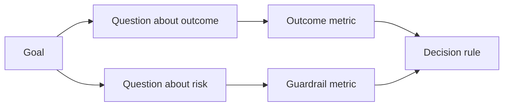

# Metricas de sucesso de design antes que o resultado exista.

> A medição deve responder a uma decisão, não decorar um painel de instrumentos. Comece com o objetivo, derive perguntas, e depois escolha as menores métricas que as respondam.

> **【中文解读】**∆o mensagem deve responder a uma decisão, em vez de colocar um bloco de instrumentos. ∆o mensagem GQM                                                                                                                                                                                                                                                 

> - Não .**【前置】**O resultado inicial do curso é o resultado do estudo e da análise dos resultados.`outputs/measurement-report.json`É o 53o 课原型/试点/生产三档的证据门。

**Type:** Learn + Build | **类型:** 学习 + 动手实践
**Languages:** Python (stdlib) | **语言:** Python（标准库）
**Prerequisites:** Phase 14 lessons 47 and 51 | **前置知识:** Phase 14 第 47、51 课
**Time:** ~70 minutes | **时间:** 约 70 分钟

## Objetivos de aprendizagem

- Derivar perguntas e métricas de um objetivo final.
  Tradução do inglês para o inglês: from result objectif推导出问题和指标──
- Defina os limiares, janelas, fontes e direções antes de observar os resultados.
  Tradução do inglês: 值、窗口、来源和方向──
- Combinar métricas de resultado com barris e contra-metricas.
  Tradução do inglês para "Problematic"
- A prova da avaliação corresponde à decisão que a construção deve apoiar.
  O que é o que é necessário para a construção?

## Objetivo, Pergunta, Métrica Objetivo, Problema, Indicador

Comece com um objetivo:

> Desde um objetivo:

> Reduzir o tempo de identificação do serviço afectado sem aumentar as ações inseguras.
>
> Em condições de operação de segurança não aumentada, reduzir o tempo necessário para o serviço de localização afectado.

Perguntas derivadas:

> 推导出问题:

- Quão rapidamente é identificado o serviço correto?
  Tradução do inglês:
- Quantas vezes o serviço identificado é correto?
  Tradução do inglês para "Língua portuguesa":
- O diagnóstico continua a ser apenas lido?
  O processo de diagnóstico será mantido apenas para ler?
- O fluxo de trabalho aumenta a desativação de alertas ou a carga de trabalho do operador?
  O fluxo de trabalho aumentou a taxa de negligência policial ou o encargo do operador?

Então escolha métricas que operationalizem essas perguntas.

> Então, escolha como transformar essas questões em indicadores de números.



> **【中文解读】**O GQM é um sistema de gestão de dados que permite a criação de dados e de dados para o seu público.

## Um Metric precisa de um contrato.

Cada métrica precisa:

> Cada indicador requer:

| Field | Example |
|---|---|
| Name | `median_identification_seconds` |
| Direction | at most |
| Threshold | 120 |
| Window | ten incident replays |
| Source | replay event log |
| Population | on-call engineers in the pilot |
| Kind | outcome or guardrail |

Sem fonte e janela, um número não pode ser reproduzido.

>  Não há fonte e janela, um número não pode ser reproduzido;  não há valor, não pode impulsionar decisões

> **【中文解读】**契约的七字段回答四个问题:叫什么 (Nome) 朝哪边好 (Direcção) 多好算好 (Threshold) 、在哪测 (Window/Source/Population) 、 pertence a que tipo de [[[[[[[[[[[[[[[[[[[[[[[[[[[[[[[[[[[[[[[[[[[[[[[[[[[[[[[[[[[[[[[[[[[[[[[[[[[[[[[[[[[[[[[[[[[[[[[[[[[[[[[[]]]]]]]]]]]]]]]]]]]]]]]]]]]]]]]]]]]]]]]]]]]]]]]]]]]]]]]]]]]]]]]]]]]]]]]]]]]]]]]]]]]]]]]]]]]]]]]]]]]]]]]]]]]]]]]]]]]]]]]]]]]]]]]]]]]]]]]]]]]]]]]]]]]]]]]]]]]]]]]]]]]]]]]]]]]]]]]]]]]]]]]]]]]]]]]]]]]]]]]]]]]]]]]]]]]]]]]]]]]]]]]]]]]]]]]]]]]]]]]]]]]]]]]]]]]]]]]]]]]]]]]]]]]]]]]]]]]]]]]]]]]]]]]]]]]]]]]]]]]]]]]]]]]]]]]]]]]]]]]]]]]]]]]]]]]]]]]]]]]]]]]]]]]]]]]]]]]]]]]]]]]]]]]]]]]]]]]]]]]]]]]]]]]]]]]]]]]]]]]]]]]]]]]]]]]]]]]]]]]]]]]]]]]]]]]]]]]]]]]]]]]]]]]]]]]]]]]]]]]]]]]]]]]]]]]]]]]]]]]]]]]]]]]]]]]]]]]]]]]]]]]]]]]]]]]]]]]]]]]]]]]]]]]]]]]]]]]]]]]]]]]]]]]]]]]]]]]]]]]]]]]]]]]]]]]]]]]]]]]]]]]]]]]]]]]]]]]]]]]]]]]]]]]]]]]]]]]]]]]]]]]]]]]]]]]]]]]]]]]]]]]]]]]]]]]]]]]]]]]]]]]]]]]]]]]]]]]]]]]]]]]]]]]]]]]]]]]]]]]]]]]]]]]]]]]]]]]]]]]]]]]]]]]]]]]]]]]]]]]]]]]]]]]]]]]]]]]]]]]]]]]]]]]]]]]]]]]]]]]]]]]]]]]]]]]]]]

> - Não .**【类比】**Indicação de acordo com a lista de referência: 抽血前就已印好"尿酸 208-428 μmol/L" tipo de gama e condições. Não há referência de uma lista de números. Você não sabe se 450 é para celebrar ou para pendurar.

## Resultado, Guardrail e Contro-Metric

- **Outcome metric:**melhorou o estado desejado?
  Tradução:**结果指标：**O estado de espera melhorou?
- **Guardrail:**Será que uma restrição fixa permaneceu verdadeira?
  Tradução:**护栏指标：**O limite está ainda em vigor?
- **Counter-metric:**O melhoramento local custou ou prejudicou noutro lugar?
  Tradução:**反指标：**O melhoramento local transferirá os custos ou danos para outro lugar?

Para um fluxo de trabalho incidente, a velocidade não é suficiente. Corretidão, gravações de produção, carga de trabalho do operador e alertas perdidas protegem contra um resultado rápido, mas inseguro.

> Para o fluxo de trabalho de acidentes, apenas a velocidade é insuficiente.

> **【中文解读】**Os três indicadores constituem um triângulo: resultado indicador prova "mute bem",护 indicador guarda "não mudou mal" (((como a produção escreveu em恒为零),反标住"坏处是不是被挪走了" ((本团队快了,是不是把负担给下游值班) ⋅AI 系统最经典的反标例:客服机器人优化"平均处理时间"至极低,同时"人工转接率"和"客户二次来电率"升.

## Evidências Offline e Online.

O replay offline é útil para repetibilidade e cobertura de borda. Um piloto limitado é útil para efeitos reais de comportamento, confiança e fluxo de trabalho. Nenhum substitui o outro.

> O valor da transmissão de dados online é repetibilidade e cobertura de fronteiras; o valor dos testes de fronteiras é real, é de comportamento, é de confiança e é de trabalho.

Use as provas mais baratas que possam responder à decisão em curso.

> Usá-lo para responder às evidências mais convenientes da decisão em curso. Não apenas porque a realização foi concluída, mas também para exposição dos usuários reais.

> **【中文解读】**O mais comum erro é usar um indicador de linha para responder apenas a um teste para responder a uma pergunta. O engenheiro deve "confiar nesta recomendação", ou, ao contrário, um recurso é escrito com o objetivo de aumentar o fluxo real.

## Decida antes de medir, pre-decide, recese os dados.

Escreva o pass, falhas e caminhos ambíguos antes de ver resultados.

> Antes de ver o resultado, escreva bem através de 、 fracassos e模糊三条路径── senão a equipe deve manter esta construção e mover 值──

Exemplo:

> - Não .

- Passagem: taxa de serviço correta de pelo menos 0,9 e tempo médio de 120 segundos;
  Tradução do inglês: 通过:正确服务率不低于0.9 且中位耗时不超过120秒;
- falha: qualquer taxa de produção ou correcção inferior a 0,75;
  Não há nenhuma produção escrita, ou a taxa de correção é inferior a 0,75;
- ambiguidade: pequena melhoria com ampla variação, que exige um conjunto de repetições maior.
  O que é o melhor é que o que é o melhor é que o que é o melhor é que o melhor é que o melhor é que o melhor é que o melhor é que o melhor é que o melhor é que o melhor é que o melhor é que o melhor é que o melhor é que o melhor é que o melhor é que o melhor é que o melhor é que o melhor é que o melhor é que o melhor é que o melhor é que o melhor é que o melhor é que o melhor é que o melhor é que o melhor é que o melhor é que é que o melhor é que é que o melhor é que é que o melhor é que é que o melhor é que é.

> **【中文解读】**"Predefinição de decisão" é uma defesa contra a humanidade: após o data sair, quase todos vão colocar o valor determinado em seu próprio data que acaba de passar bem.

## Construí-lo e realizei-o.

O laboratório valida um plano de medição, avalia os limites inclusivos, registra os valores faltantes e escreve `outputs/measurement-report.json`- Não .

> 实验代码校验一个测量计划、 值求值的含边界值的值求值的记录缺失值,并写出 `outputs/measurement-report.json`- Não.

```bash
python3 code/main.py
python3 -m unittest discover code/tests -v
```

Remova a métrica de proteção e observe por que o plano se torna inválido mesmo quando as métricas de resultado permanecem.

> Remover os indicadores, observar por que, mesmo que os resultados dos indicadores estejam presentes, o plano inteiro também será considerado inefficiente.

> **【中文解读】**As regras do ensaiador são a codificação deste curso: falta de objetivos, falta de problemas, falta de indicadores, falta de resultados, falta de cuidados, orientação ilegal, falta de fontes ou janela qualquer uma das regras vai fazer o status de ser inválido, o valor posterior perderá todo o significado Nota especial: cuidados não farão o relatório "menos um", mas fará com que toda a parte do plano seja abolida sem cuidados  resultados indicadores é o mesmo que permitir "quase, mas não seguro" 

## Exercícios.

1. Derivar três perguntas de um objetivo final.
   Tradução do inglês: From a result goal推导出三个问题──
2. Adicione uma contra-metrica que capta o custo transferido para outro papel.
   Chinese Translation:加一个能抓住" custos são transferidos para outro papel" de um contrasíntese.
3. Defina a fonte, população e janela para cada métrica.
   Tradução do inglês para o inglês:
4. Escreva passes, falhas e decisões ambíguas antes de gerar valores.
   Tradução do inglês: 文文 字 字 字 字 字 字 字 字 字 字 字 字 字 字 字 字 字 字 字 字 字 字 字 字 字 字 字 字 字 字 字 字 字 字 字 字 字 字 字 字 字 字 字 字 字 字 字 字 字 字 字 字 字 字 字 字 字 字 字 字 字 字 字 字 字 字 字 字 字 字 字 字 字 字 字 字 字 字 字 字 字 字 字 字 字 字 字 字 字 字 字 字 字 字 字 字 字 字 字 字 字 字 字 字 字 字 字 字 字 字 字 字 字 字 字 字 字 字 字 字 字 字 字 字 字 字 字 字 字 字 字 字 字 字 字 字 字 字 字 字 字 字 字 字 字 字 字 字 字 字 字 字 字 字 字 字 字 字 字 字 字 字 字 字 字 字 字 字 字 字 字 字 字   字 字 字 字 字                                                                                                                                               
5. Identifique uma métrica que seja fácil de coletar, mas não pode alterar a decisão.
   Descobrir um indicador fácil de coletar mas não mudar de decisão, eliminá-lo.

## Mais leitura 延伸阅读

- [Basili, Software Modeling and Measurement: The Goal/Question/Metric Paradigm](https://drum.lib.umd.edu/items/8119803a-362b-42ec-b6ce-2311713e7236), para a obtenção de medições operacionais a partir de objectivos explícitos.
  Tradução do inglês:Basili软件建模与测量:GQM 范式从显式目标推导可操作测量──
- [Basili, Caldiera, and Rombach, The Goal Question Metric Approach](https://www.cs.toronto.edu/~sme/CSC444F/handouts/GQM-paper.pdf), para a aplicação do método como sistema de feedback e melhoria.
  中文翻译:Basili、Caldiera 与 RombachGQM 方法把该方法用作反与改进系统──

## O que você mantém , o que você retém , o produto .

- Não .`outputs/measurement-report.json`- define o portal de prova para o protótipo, o piloto ou a fase de produção.

> - Não .`outputs/measurement-report.json`■ define a prova do tipo original, do ponto de ensaio ou da fase de produção■■
