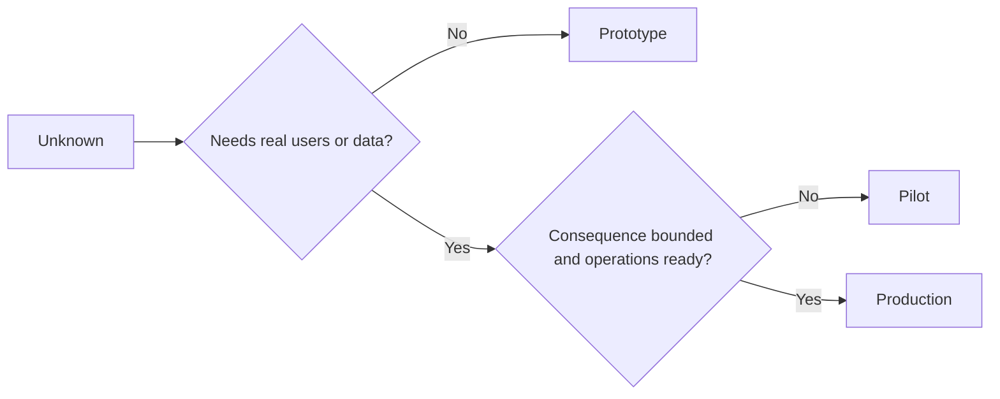

# Escolha Protótipo, Piloto ou Produção Deliberadamente.

> Esses são diferentes ambientes de aprendizagem, não níveis de poluição. Escolha o estágio que responde à corrente desconhecida com a menor consequência desnecessária.

> **【中文解读】**O prototip, o prototip, o prototip pode ser jogado a qualquer momento, o prototip deve ser definido e revertido, a produção significa que a organização assume a responsabilidade contínua. O incidente mais fácil não é o erro selecionado, mas o prototip, o "地", se transforma em sistema de produção.

> - Não .**【前置】**O que é que é que é que é que é que é que é que é que é que é que é que é que é que é que é que é que é que é que é que é que é que é que é que é que é que é que é que é que é que é que é que é que é que é que é que é que é que é que é que é que é que é que é que é que é que é que é que é que é que é que é que é que é que é que é que é que é que é que é que é que é que é que é que é que é que é que é que é que é que é que é que é que é que é que é que é que é que é que é que é que é que é que é que é que é que é que é que é que é que é que é que é que é que é que é que é que é que é que é que é que é que é que é que é que é que é que é que é que é que é que é que é que é que é que é que é que é que é que é que é que é que é que é que é que é que é que é que é que é que é que é que é que é que é que é que é que é que é que é que é que é que é que é que é que é que é que é que é que é que é que é que é que é que é que é que é que é que é que é que é que é que é que é que é que é que é que é que é que é que é que é que é que é que é que é que é que é que é que é que é que é que é que é que é que é que é que é que é que é que é que é que é que é que é que é que é que é que é que é que é que é que é que é que é que é que é que é que é que é que é que é que é que é que é que é que é que é que é que é que é que é que é que é que é que é que é que é que é que é que é que é que é que é que é que é que é que é que é que é que é que é que é que é que é que é que é que é que é que é que é que é que é que é que é que`outputs/stage-decisions.json`É o 54o curso de "Obras de Garrafa"

**Type:** Learn + Build | **类型:** 学习 + 动手实践
**Languages:** Python (stdlib) | **语言:** Python（标准库）
**Prerequisites:** Phase 14 lessons 50 to 52 | **前置知识:** Phase 14 第 50-52 课
**Time:** ~70 minutes | **时间:** 约 70 分钟

## Objetivos de aprendizagem

- Escolha um estágio de construção do desconhecido, público, dados, consequência e prontidão.
  Tradução do inglês: Instrução de construção de arquivos
- Defina os controlos específicos de fase e os critérios de saída.
  Tradução do inglês para o inglês: define档位专属的控制措施和退出标准.
- Prevenção de que os protótipos se tornem silenciosamente sistemas de produção.
  Tradução do inglês para Prevenir Origins Transforming into Production Systems
- Retardar a autoridade real até que a evidência e as operações a justificem.
  Tradução do inglês:把真实权限推迟到证据与运维能力都配得上它的时候.

## Três perguntas diferentes.

| Stage | Primary question |
|---|---|
| Prototype | Can this mechanism produce the evidence at all? |
| Pilot | Does it work safely with a bounded real audience and real conditions? |
| Production | Can we own it continuously at the promised reliability and risk level? |

Um protótipo pode ser tecnicamente completo e ainda ser descartável. Um piloto pode usar dados de produção, mantendo-se limitado em público e autoridade. A produção começa quando a organização aceita a responsabilidade contínua.

> **【中文解读】**Os três tipos de perguntas são três: "O modelo original" o mecanismo pode produzir evidências", "O ponto de partida" é "Se é seguro em um grupo de pessoas e condições reais de um grupo de pessoas", "O problema da produção" é "Se podemos continuar a possuí-lo com um nível de confiabilidade e risco comprometido".

## Protótipo, protótipo.

Use um protótipo quando o desconhecido não requer usuários reais ou dados reais.

> Quando um item desconhecido não precisa de um usuário real ou dados reais, use o modelo original.

- Discaráveis;
  Tradução do português:
- Isolados;
  Tradução: separ separ separando
- - comportamentos estreitos;
  Tradução do inglês: behavior面狭;
- Explicita a questão da aprendizagem;
  Tradução do inglês para tradução do português:
- Sem falsas garantias operacionais.
  Não tenho nenhuma falsidade de que eu sou um homem.

Não otimize a arquitetura antes que o mecanismo ganhe outro estágio.

> Não optimize a estrutura antes de ganhar o próximo ranking.

> **【中文解读】**A lei original dos cinco artigos é mais dura: "isolamento" e "não com falso transporte": isolamento garante que ele falhe quando a onda e a face são para zero; não promete a disponibilidade, garante que ninguém comece a depender dele.

## Pilot , teste

Use um piloto quando o desconhecido requer comportamento real, dados realistas ou um fluxo de trabalho real, mas a consequência ou a prontidão ainda não é compatível com a liberação ampla.

> Quando um projecto desconhecido requer um comportamento real, um sentido real de dados ou um fluxo de trabalho real, mas os resultados ou a disponibilidade não são ainda adequados para uma grande distribuição, use o ponto de experimentação.

Um piloto precisa:

> 试点需要:

- um público designado;
  Tradução do português:
- um proprietário humano;
  中文翻译:一位人类负责人;
- duração e autoridade limitadas;
  Tradução do inglês:
- Auditoria e retrocesso;
  Tradução do inglês: auditör;
- Os limites de saída e de proteção;
  中文翻译:结果与护值 (来自第52 课);
- Critérios de saída para expansão, revisão ou parada.
  Tradução do inglês: expand expand expand、修订或停止的退出标准──

> **【中文解读】**O teste é definido como "real, mas com limites": com dados reais, mas o nome do público, o tempo de expansão, o limite de restrição.

## Produção Produção

A produção requer mais do que a implantação:

> O produto é necessário em relação à sua distribuição:

- Objetivo de nível de serviço;
  Tradução em inglês:服务级别目标(SLO);
- Propriedade de pedido e de incidente;
  Tradução do inglês:
- Revisão da segurança e da privacidade;
  Tradução do inglês: segurança e privacidade;
- Controles de custos e de capacidade;
  Tradução do inglês: cost & capacity control;
- Rolo de volta e recuperação;
  Tradução do inglês:
- Monitoramento contínuo;
  Tradução do inglês:
- um caminho para a aposentadoria.
  Tradução do inglês:



> **【中文解读】**O mais anti-intuitivo de todos os sete é o último "retiro de produção": antes de entrar em produção, é preciso escrever bem como sair. Não é uma tristeza, mas sim reconhecer que cada sistema tem um ciclo de vida.

> - Não .**【类比】**Três fases do treino: estradas de carro: estradas de carro, estradas de carro, estradas de carro, estradas de carro, estradas de carro, estradas de carro, estradas de carro, estradas de carro, estradas de carro, estradas de carro, estradas de carro, estradas de carro, estradas de carro, estradas de carro, estradas de carro, estradas de carro, estradas de carro, estradas de carro, estradas de carro, estradas de carro, estradas de carro, estradas de carro, estradas de carro, estradas de carro, estradas de carro, estradas de carro, estradas de carro, estradas de carro, estradas de carro, estradas de carro, estradas de carro, estradas de carro, estradas de carro, estradas de carro, estradas de carro, estradas de carro, estradas de carro, estradas de carro, estradas de carro, estradas de carro, estradas de carro, estradas de carro, estradas de carro, estradas de carro, estradas de carro, estradas de carro, estradas de carro, estradas de carro, estradas de carro, estradas de carro, estradas de carro, estradas de carro, estradas, estradas de carro, estradas de carro, estradas, estradas de carro, estradas, estradas de carro, estradas, estradas, estradas de carro, estradas, estradas, estradas, estradas, estradas, estradas, estradas, estradas, estradas, estradas, estradas, estradas, estradas, estradas, estradas, estradas, estradas, estradas, estradas, estradas, estradas, estradas, estradas, estradas, estradas, estradas, estradas, estradas, estradas, estradas, estradas, e estradas, e estradas, e estradas, e estradas, e estradas, e estradas, e estradas, e estradas, e estradas, e estradas, e estradas, e estradas, e estradas, e estradas, e estradas, e estradas, e estradas, e estradas, e estradas, e estradas, e estradas, e estradas, e estradas, e estradas, e estradas, e estradas, e

## Escenas Drift                                                                                                                                                                                                                                                                                                                                                                                                                                                                                                                         

O prototipo de código torna-se perigoso quando adquire usuários, dados ou autoridade sem adquirir propriedade. Marque limites do prototipo e piloto na configuração, controle de acesso, telemetria e documentação.

> Quando o código-prototipo é adquirido sem ser atribuído, o usuário, dados ou direitos, torna-se perigoso.

O estágio deve ser observável a partir do próprio sistema.

> O grau deve ser observado do próprio sistema.

> **【中文解读】**阶段漂移(stade drift) é o acidente de silêncio mais comum: "temporar run一下" do roteiro original entrou em contato com o fluxo real, três meses depois tornou-se um caminho-chave para que ninguém se atrevesse a reiniciar. A defesa deve cair no controle técnico sobre o controle de configuração, no controle de acesso, no controle de acesso, no controle de distância, em vez de marcas de interface, em um plano ou em uma palavra.

## Construí-lo e realizei-o.

O laboratório escolhe um estágio do contexto da decisão, retorna os controles necessários e escreve `outputs/stage-decisions.json`- Não .

> Experimental Code: Descrição do processo de decisão`outputs/stage-decisions.json`- Não.

```bash
python3 code/main.py
python3 -m unittest discover code/tests -v
```

Crie o exemplo piloto para uma baixa consequência com prontidão operacional.

> Explique também quais são as provas extras necessárias para apoiar a produção.

> **【中文解读】** `choose_stage`A resposta da experiência de pós-classe não está em código: mesmo que a produção seja determinada, ainda há evidências faltantes, como, por exemplo, o desempenho real de um período de tempo de SLO 跑一段时间, a revisão de segurança, o estabelecimento de um mecanismo de avaliação, o estabelecimento de um grau de determinação é o "baixa mínimo de categoria", não o "título de passagem".

## Exercícios.

1. Classificar três projectos em curso por fase de aprendizagem, não por estado de implantação.
   Tradução do inglês: according learning阶段 (→ "em fase de aprendizagem")
2. Escrever critérios de saída do piloto que incluam uma decisão de parada.
   Tradução do inglês para "Halt"
3. Adicionar um controlo técnico que impeda que um protótipo chegue aos dados de produção.
   Tradução do inglês para o inglês:加一条技术控制,阻止原型碰到生产数据.
4. Identificar a primeira responsabilidade operacional que faz a produção de construção.
   No entanto, o primeiro é que o desenvolvimento de uma empresa é um processo de desenvolvimento.
5. Desenhar um recibo de volta para o piloto limitado.
   Tradução do inglês para "For a purpose"

## Mais leitura 延伸阅读

- [Barry Boehm, A Spiral Model of Software Development and Enhancement](https://dl.acm.org/doi/10.1145/12944.12948), para combinar o compromisso de cada iteração com o risco resolvido.
  O modelo de Boehm  espiral  fazer cada rodada  geração de compromissos correspondem a riscos já resolvidos 
- [Fagerholm et al., Building Blocks for Continuous Experimentation](https://doi.org/10.1145/2601248.2601276), para as condições organizacionais e técnicas necessárias para a execução contínua dos experimentos.
  O processo de construção de um bloco de construção de experiências contínuas é o processo de organização e condições técnicas necessárias para realizar experiências contínuas.

## O que você mantém , o que você retém , o produto .

- Não .`outputs/stage-decisions.json`- Regista por que cada etapa é justificada e quais os controles devem existir antes da próxima.

> - Não .`outputs/stage-decisions.json`O documento registra por que cada categoria foi criada e quais os controles que devem existir antes de entrar na categoria seguinte.
