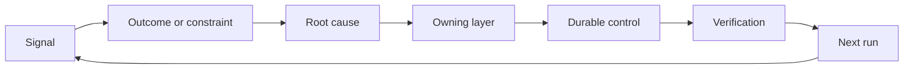

# Construir um Ratchet de Feedback com Propriedade e aposentadoria

> A navegação fecha um ciclo de construção e abre o ciclo de aprendizagem.

> **【中文解读】**O processo de avaliação de um sistema deve ser transformado em um ciclo de construção, ao mesmo tempo em que se abre um ciclo de aprendizagem. A evidência deve mudar o sistema, caso contrário, ele se torna um sistema de distância de dados não reconhecidos por ninguém.

> - Não .**【前置】**O curso de aprendizagem é uma das principais atividades do curso, que consiste em desenvolver um sistema de aprendizagem e aprendizagem de aprendizagem e aprendizagem de aprendizagem.

**Type:** Learn + Build | **类型:** 学习 + 动手实践
**Languages:** Python (stdlib) | **语言:** Python（标准库）
**Prerequisites:** Phase 14 lessons 46 and 53 | **前置知识:** Phase 14 第 46、53 课
**Time:** ~75 minutes | **时间:** 约 75 分钟

## Objetivos de aprendizagem

- Transforme incidentes, avaliações, comportamento do usuário e correções em ações próprias.
  Tradução em chinês:把事故、评估、user behavior和修正转化为有主人的行动──
- Rotear cada sinal para contexto, avaliação, política, tempo de execução ou backlog.
  Tradução do inglês para tradução do inglês:                                                                                                                                                                                                                                                         
- Priorizar a recorrência por gravidade e frequência.
  Tradução do inglês:
- Dê a cada controlo uma condição de aposentadoria.
  Tradução do inglês para o inglês: Give each control measure with a one-year re-entry condition.

## Feedback é Infraestrutura, contra é Infraestrutura.

Uma equipe pode coletar vestígios, avaliações, bilhetes de suporte e registros de incidentes sem aprender com nenhum deles.

> Uma equipa pode juntar o registro, avaliação, trabalho e jornada de acidentes, mas não há nada a aprender de qualquer coisa. O mecanismo de falta é a "promoção": um artigo de observação para um caminho definido de mudança permanente, e mudança para o dono e a prova.

O ciclo é:

> Este ciclo é:

1. Observar um sinal concreto;
   Tradução do inglês: observar a um sinal específico;
2. Conectar-se a um resultado, restrição ou suposição;
   Tradução do inglês: 关联到某结果、约束或假设;
3. Identificar a camada de sistema mais antiga que possui a causa;
   中文翻译: encontrar "têm essa raiz" de mais cedo sistemas de nível;
4. criar uma alteração limitada;
   Tradução do inglês: Crear um cambiamento de bordes;
5. Verificar que a recorrência é menos provável;
   O índice de probabilidade de reversão de testes já diminuiu.
6. Revisar se o controlo deve continuar.
   Tradução do Novo Mundo: Repetir este controle

> **【中文解读】**"反是基础设施" significa: aprender não depende de uma atitude dependente de um mecanismo.

## A rota para a camada de posse.

| Signal | Destination |
|---|---|
| False positive, regression, wrong result | Evaluation or test |
| Missing context, duplicate work, stale fact | Context source or retrieval route |
| Unsafe action or authority gap | Policy or permission boundary |
| Timeout, retry storm, unavailable dependency | Runtime control |
| New product need or unresolved tradeoff | Shaped backlog item |

Corrigir a causa na camada efetiva mais cedo possível. Não adicione outro parágrafo imediato quando um teste ou permissão pode tornar a falha impossível.

> Quando um teste ou um poder pode tornar um tipo de fracasso impossível, não volte a fazer isso imediatamente.



> **【中文解读】**路由表把"什么信号去哪" transformar em "查表操作: err err err err err err err err err err err err err err err err err err err err err err err err err err err err err err err err err err err err err err err err err err err err err err err err err err err err err err err err err err err err err err err err err err err err err err err err err err err err err err err err err err err err err err err err err err err err err err err err err err err err err err err err err err err err err err err err err err err err err err err err err err err err err err err err err err err err err err err err err err err err err err err err err err err err err err err err err err err err err err err err err err err err err err err err err err err err err err err err err err err err err err err err err err err err err err err err err err err err err err err err err err err err err err err err err err err err err err err err err err err err err err err err err err err err err err err err err err err err err err err err err err err err err err err err err err err err err err err err err err err err err err err err err err err err err err err err err err err err err err err err err err err err err err err err err err err err err err err err err err err err err err err err err err err err err err err err err err err err err err err err err err err err err err err err err err err err err err err err err err err err err err err err err err err err err err err err err err err err err err err err err err err err err err err err err err err err err err err err err err err err err err err err err err err err err err err err err err err err err err err err err err err err err err err err err err err err err err err err err err err err err err err err err err err err err err err err err err err err err err err err err err err err err err err err err err err err err err err err err err err err err err err err err err err err err err err err err err err err err err err err err err err err err err err err err err err

## A propriedade é parte do controle.

Toda ação de ratchet precisa:

> Cada rotina precisa de:

- um proprietário;
  Tradução do inglês:
- Uma prioridade baseada em consequências e recorrência;
  Tradução em chinês: baseada em prioridades de resultados e frequência de reversão;
- O artefato a alterar;
  Tradução do inglês:
- A verificação que comprova a alteração;
  Tradução do inglês: prova que o seu efeito é melhor;
- Uma janela de revisão ou de expiração;
  中文翻译:一个复核或到期窗口;
- uma condição de aposentadoria.
  O que é o "reconhecimento" de um homem?

Uma melhoria não-proprietária é uma observação com melhor formatagem.

> Não há melhorias de ninguém, apenas um registro de observação.

> **【中文解读】**六段里"恰好一个主人"和"退役条件" são dois sentidos simples da roda de espinhas: o mestre garante que se transforme em realidade, observação, operação, e condições de retirada garantem que o controle não se acumula ilimitadamente.

## Retire os controles estaleiros.

Os sistemas de feedback acumulam políticas. Essa política pode tornar-se contraditória e cara.

> Contraste-se com as estratégias de acumulação do sistema, e estas estratégias podem se tornar mutuamente contraditórias.

- alterações na arquitetura ou no fluxo de trabalho;
  Tradução do inglês: arquitetura ou trabalho;
- Uma invariante de nível inferior substitui uma instrução de nível superior;
  Tradução do inglês: "Qualquer um nível inferior de constante substituiu um nível superior de ordem".
- A falha protegida não apareceu na janela escolhida;
  Tradução do inglês:被防护的失败在整个观察窗口内一次都没有出现;
- O controlo bloqueia o trabalho legítimo mais frequentemente do que previne o dano.
  O controle impede o trabalho normal mais vezes do que o número de ferimentos.

A aposentadoria também precisa de provas.

> Não se esqueça de "senti-se que já passou o tempo" e de "desligar um controle".

> **【中文解读】**Esta parte é para "rota de espinhos" de instalação de volta-ressa: apenas para dentro e não voltar a espinhos, o final vai colocar a máquina fechada.

## Conectar Construação e Agente de codificação Feedback .

O mesmo ratchet serve as duas faixas:

> Com um serviço de rotas.

- A evidência do produto altera o quadro de resultados, suposições, fatias ou planos de medição.
  Tradução do inglês para inglês: product evidence change results framework、假设、切片或测量计划──
- As correções de agentes de codificação alteram os testes, contexto, alcance, automação ou transferência.
  Tradução do inglês em inglês:编码 Agent 的纠正改变测试、上下文、范围、自动化或交接──
- Os incidentes podem alterar tanto o limite do produto como o banco de trabalho do agente.
  O incidente pode mudar a fronteira do produto, também pode mudar o agente 工作台。

É por isso que a modelagem da construção não é uma fase que termina antes da codificação.

> É por isso que "for construção de forma" não é uma fase de codificação que começa antes de terminar, que atravessa cada mudança aceita.

> **【中文解读】**Esta secção encerra a série 43-54                                                                                                                                                                                                                                                                                                                                                                                                                                                                                                                    

## Construí-lo e realizei-o.

O laboratório classifica sinais, cria ações de propriedade, priorizá-las e escreve.`outputs/feedback-backlog.json`- Não .

>                                                                                                                                                                                                                                                                                                                                                                                                                                                                                                                              `outputs/feedback-backlog.json`- Não.

```bash
python3 code/main.py
python3 -m unittest discover code/tests -v
```

Adicione um sinal de tempo de saída para a execução e confirme que ele se encaminha para a execução em vez do atraso geral.

> Adição de um sinal de tempo super-horário, confirme que ele foi encaminhado para o tempo de execução, em vez de entrar no sistema de espera geral.

> **【中文解读】** `destination()`Usar palavras-chave para combinar a ideia do sistema real (true system can change component class or artificial division),`promote()`则把六字段动作象化: prioridade = gravidade × frequência, cada propósito ligado a um determinado trabalho permanente, tais como`evaluations/regression-suite.json`)、 Certificação de validação fixa e condições de retirada do serviço.`expires_after_days`O significado não é "adopt automaticamente deletado", mas "adopt must recheck"退役要证据,复核是证据的入口──

## Exercícios.

1. Transforma um incidente e uma reclamação de um usuário em ações de "ratchet".
   Tradução do inglês para Chinês:把一次事故和一条用户投诉转写成棘轮动作
2. Nomear a camada mais antiga que pode impedir cada recorrência.
   Chinese:                                                                                                                                                                                                                                                              
3. Adicionar comandos de verificação ou observações à saída do laboratório.
   Tradução do inglês para inglês: Give experiment output supplement upon verification order or observation.
4. Define uma condição de aposentadoria para uma regra de apólice.
   Tradução do inglês para tradução inglesa:
5. Trace um aceitou correção de volta para o próximo quadro de tarefa.
   Tradução do inglês para Chinês:把一条被接受的纠正追溯到下一个任务框架里去.

## Mais leitura 延伸阅读

- [Basili, Caldiera, and Rombach, The Goal Question Metric Approach](https://www.cs.toronto.edu/~sme/CSC444F/handouts/GQM-paper.pdf), para a aprendizagem organizacional através de medição orientada para os objectivos.
  中文翻译:Basili、Caldiera 与 RombachGQM 方法通过目标导向的测量实现组织学习──
- [Fagerholm et al., Building Blocks for Continuous Experimentation](https://doi.org/10.1145/2601248.2601276), para o ciclo técnico e organizacional que liga a evidência ao desenvolvimento contínuo do produto.
  O processo de construção de blocos de experiências contínuas, como o Fagerholm, leva a evidência para o ciclo de desenvolvimento de produtos e organizações contínuos.
- [Nuseibeh and Easterbrook, Requirements Engineering: A Roadmap](https://www.cs.toronto.edu/~sme/papers/2000/ICSE2000.pdf), para tratar os requisitos como evoluindo durante o ciclo de vida do sistema.
  Tradução do inglês:Nuseibeh e Easterbrook 需求工程:路线图把需求视为在系统生命周期中持续演化――

## O que você mantém , o que você retém , o produto .

- Não .`outputs/feedback-backlog.json`É o artefacto final do caminho de julgamento e entrega do produto e a entrada para o próximo quadro de resultados.

> - Não .`outputs/feedback-backlog.json` É a peça final do caminho de "julgamento e entrega de produtos", também é a entrada do próximo quadro de resultados
