# Protocolo de comunicação.

> Os agentes que não sabem falar a mesma língua não são uma equipa, são estranhos a gritar no vazio.

> **【中文解读】**Este artigo apresenta o padronização do protocolo de comunicação entre agentes.

> **【拓展：communication protocols→具体应用】**现代多 Agent 通信协议的三个层次:(1) 传输层A2A (HTTP+JSON)、MCP (JSON-RPC)、gRPC;(2) 语义层Agent Card 描述能力,任务描述意图;(3) 协调层发言人选择、投票、协商──2026年的实践表明,通信协议的选择主要取决于延迟要求和是否需要跨组织协作──


**Type:** Build | **类型:** 构建
**Languages:** TypeScript | **语言:** TypeScript
**Prerequisites:** Phase 14 (Agent Engineering), Lesson 16.01 (Why Multi-Agent) | **前置知识:** Phase 14 (Agent 工程), Lesson 16.01 (为什么需要多 Agent)
**Time:** ~120 minutes | **时间:** ~120 分钟

> - Não .**【前置】**學本節前 請先掌握:Fase 14 Agent 工程基礎) Fase 16·01-02 多 Agent 动机与FIPA 历史) Fase 13 MCP 协议) 本节 动手实现多 Agent 通信选协议 应按延迟和协作范围权衡──
> - Não .**【类比】**多 Agent 通信 = "equipos de comunicação"──HTTP+JSON(A2A) = 邮件(异步、跨组织);JSON-RPC(MCP) = Slack(工具调用);gRPC = 内部电话(低延迟、强类型)──选错协议 = 团队效率灾难──

## Objetivos de aprendizagem

- Implementar a descoberta e invocação de ferramentas MCP para que os agentes possam utilizar ferramentas expostas por servidores externos
  Tradução em chinês: implementar MCP  ferramentas de descoberta e adoção, permitindo que o agente  possa usar ferramentas de exposição de servidores externos
- Construir um cartão de agente A2A e endpoint de tarefa que permite que um agente delegar trabalho para outro através de HTTP
  Construir um agente A2A 卡片和任务端点, permitir que um agente 通过HTTP向另一个代理委派工作
- Comparar MCP (acessos a ferramentas), A2A (agente a agente), ACP (auditoria empresarial) e ANP (confiança descentralizada) e explicar qual protocolo resolve qual problema
  Chinese: 中文翻译:比较 MCP(工具访问) 、A2A(Agenta contra Agente) 、ACP(企业审计) e ANP(去中心化信任),解释哪个协议解决哪个问题
- Conectar vários protocolos em um único sistema onde os agentes descobrem ferramentas através de MCP e delegam tarefas através de A2A
  Tradução do inglês em japonês:  中文翻译:在单一系统中连接多个协议,Agent 通过MCP 发现工具并通过A2A 委派任务

## O problema é o problema da introdução

Dividimos o nosso sistema em vários agentes, um pesquisador, um codificador, um revisor, são ótimos em seus trabalhos individuais, mas agora precisamos que falem uns com os outros.

> Você vai dividir o sistema em vários agentes: um pesquisador, um codificador, um revisor. Eles se mostram bem em suas tarefas. Mas agora você precisa deles para conversar verdadeiramente entre si.

A primeira tentativa é óbvia: passar cadeias. O pesquisador retorna uma mancha de texto, o programador a analisa de qualquer maneira que puder. Funciona até que o programador interprete mal um resumo de pesquisa, ou dois agentes estão em impasse esperando um pelo outro, ou você precisa de agentes construídos por diferentes equipes para colaborar. De repente, "apenas passar cadeias" cai em pedaços.

> Sua primeira tentativa é evidente: transmite um fio de texto. O pesquisador volta a um bloco de texto, o programador faz o possível para resolvê-lo. Isto é, o programador erroneamente interpreta o resumo do estudo.

Sem um contrato compartilhado para como os agentes trocam informações, os sistemas multi-agentes são frágeis, não auditiveis e impossíveis de escalar além de um punhado de agentes que você escreveu pessoalmente.

> É o problema do protocolo de comunicação. Sem Agente, o protocolo de intercâmbio de informações é fraco e não pode ser verificado.

O ecossistema de IA respondeu com quatro protocolos, cada um resolvendo uma fatia diferente do problema:

- **MCP**para acesso a ferramentas
  Tradução:**MCP**Usó usar ferramentas
- **A2A**para a colaboração entre agentes
  Tradução:**A2A**Utilizado por Agente 间协作
- **ACP**para a auditoria das empresas
  Tradução:**ACP**Utilizado para a auditoria empresarial
- **ANP**para a identidade e a confiança descentralizados
  Tradução:**ANP**Para descentralização de identidade e confiança

Esta lição vai muito fundo. Você vai ler formatos reais de fios de cada especificação, construir implementações funcionais e conectar os quatro em um sistema unificado.

> Neste curso, você vai ler o formato real de cada norma, construir implementações operacionais e conectar todos os quatro protocolos a um sistema unificado.

## O conceito central.

### O Paisagem do Protocolo

Pensem nesses quatro protocolos como camadas, cada uma abordando uma questão diferente:

> Veja estes quatro protocolos em diferentes níveis, cada um resolvendo problemas diferentes:

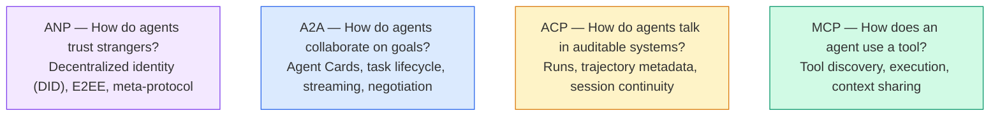

Não são concorrentes, resolvem diferentes problemas em diferentes níveis.

> Não são competências.

Um sistema de produção real utiliza vários protocolos juntos: MCP para ferramentas dentro de um organismo, A2A para colaboração de agentes, registro de trajetórias de estilo ACP para conformidade, ANP para identidade transorgânica.

> A verdadeira estrutura de sistemas de produção usa vários protocolos: MCP usa ferramentas internas de organização, A2A usa agentes, colaboração, ACP, trajetória de um sistema de produção, ANP usa transorganização, seleção de um e forçando tudo através dele, produzindo um sistema pior do que o de um ponto de concentração.

### MCP (recap)

O MCP é abrangido em profundidade na Fase 13. Resumo rápido: O MCP padroniza como um LLM se conecta a ferramentas externas e fontes de dados.**client-server**Protocolo em que o agente (cliente) descobre e chama as ferramentas expostas por um servidor.

> MCP em fase 13 tem uma explicação profunda.**客户端-服务器**协议,Agent ((客户端) encontrou e utilizou ferramentas expostas do servidor.

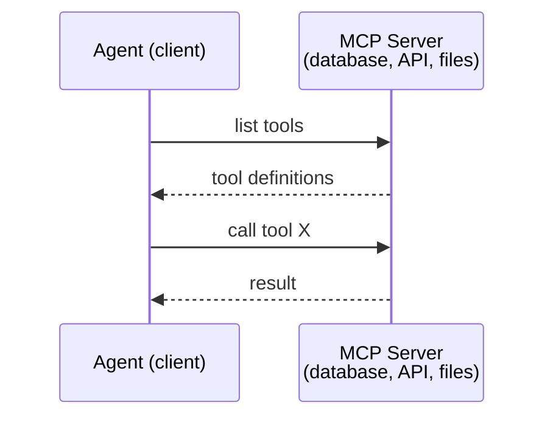

O MCP é **agent-to-tool**Não ajuda os agentes a falarem uns com os outros.

> MCP é**Agent 到工具**Não pode ajudar o agente a comunicar-se.

A divisão vertical/horizontal é limpa: MCP é o fio vertical (o agente chega até às ferramentas/dados); A2A é o fio horizontal (o agente chega até aos agentes pares).

> 垂直/水平分离清晰:MCP é vertical line;;Agent向下到达工具/数据);A2A é horizontal line;;Agent 横向到达对等 Agent);;Production system needs两者──

### A2A (Protocolo Agente2Agent)

**Created by:**Google (agora sob a Linux Foundation como `lf.a2a.v1`)
**Spec version:**1.0.0
**Problem:**Como os agentes autônomos colaboram, negociam e delegam tarefas uns aos outros?

> **创建者：**Google(现由 Linux Foundation 管理为 `lf.a2a.v1`)
> **规范版本：**1.0.0
> **问题：**Agente independente como colaborar, consultar e atribuir tarefas mutuas?

A2A é o protocolo para **peer-to-peer agent collaboration**. Onde a MCP liga um agente a ferramentas, a A2A liga um agente a outros agentes.**Agent Card**Em um URL conhecido, e outros agentes descobrem, negociam e delegam tarefas para ele.

> A2A é**点对点 Agent 协作**O acordo foi concluído em 1 de janeiro de 2015 e o acordo foi concluído em 1 de janeiro de 2015.**Agent 卡片**, outros agentes podem encontrar, consultar e enviar tarefas para os seus comissários.

#### Como funciona a A2A

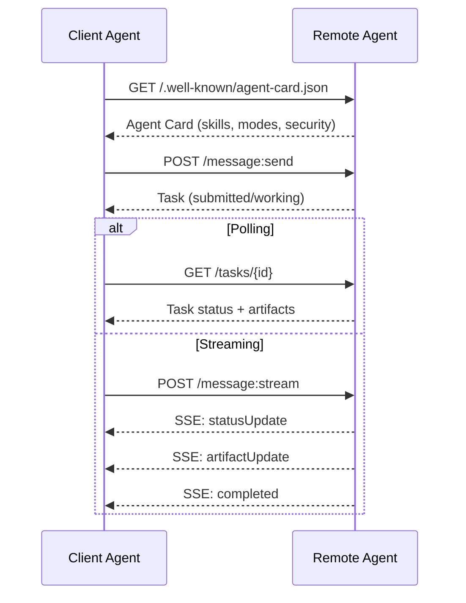

#### O verdadeiro cartão de agente

É assim que um cartão de agente A2A realmente se parece na natureza.`GET /.well-known/agent-card.json`- Não .

```json
{
  "name": "Research Agent",
  "description": "Searches documentation and summarizes findings",
  "version": "1.0.0",
  "supportedInterfaces": [
    {
      "url": "https://research-agent.example.com/a2a/v1",
      "protocolBinding": "JSONRPC",
      "protocolVersion": "1.0"
    },
    {
      "url": "https://research-agent.example.com/a2a/rest",
      "protocolBinding": "HTTP+JSON",
      "protocolVersion": "1.0"
    }
  ],
  "provider": {
    "organization": "Your Company",
    "url": "https://example.com"
  },
  "capabilities": {
    "streaming": true,
    "pushNotifications": false
  },
  "defaultInputModes": ["text/plain", "application/json"],
  "defaultOutputModes": ["text/plain", "application/json"],
  "skills": [
    {
      "id": "web-research",
      "name": "Web Research",
      "description": "Searches the web and synthesizes findings",
      "tags": ["research", "search", "summarization"],
      "examples": ["Research the latest changes in React 19"]
    },
    {
      "id": "doc-analysis",
      "name": "Documentation Analysis",
      "description": "Reads and analyzes technical documentation",
      "tags": ["docs", "analysis"],
      "inputModes": ["text/plain", "application/pdf"],
      "outputModes": ["application/json"]
    }
  ],
  "securitySchemes": {
    "bearer": {
      "httpAuthSecurityScheme": {
        "scheme": "Bearer",
        "bearerFormat": "JWT"
      }
    }
  },
  "security": [{ "bearer": [] }]
}
```

Coisas importantes a observar:
- **Skills**Cada um tem um ID, tags e tipos de entrada / saída MIME suportados. É assim que um agente cliente decide se esse agente remoto pode lidar com seu pedido.
  Tradução:**技能**É algo que o Agente pode fazer. Cada um tem ID, etiqueta e suporte para entrada/saída de tipo MIME.
- **supportedInterfaces**Uma única agente pode falar JSON-RPC, REST e gRPC simultaneamente.
  Tradução:**supportedInterfaces**列出多个协议绑定──单个代理可以同时使用JSON-RPC、REST 和 gRPC──
- **Security**O cliente sabe o que precisa antes de fazer um único pedido.
  Tradução:**安全性**O cliente já sabe o que precisa de certificação antes de enviar uma única solicitação.

#### Ciclo de vida das tarefas

As tarefas são a unidade central de trabalho no A2A.

> 任务是A2A 中的核心工作单元――它们在定义状态之间转换:

A máquina de estado é o que torna o A2A diferente de um simples RPC. Uma tarefa pode pausar (input-required), retomar (cliente fornece input), falhar ou ser cancelada. O cliente não precisa bloquear; ele faz pesquisas ou se inscreve para atualizações.

> 状态机是 A2A与简单 RPC的不同之处──任务可以暂停(input-required) 恢复(客户端提供输入) 失败或取消──客户端不需要阻塞;它轮询或订阅更新──

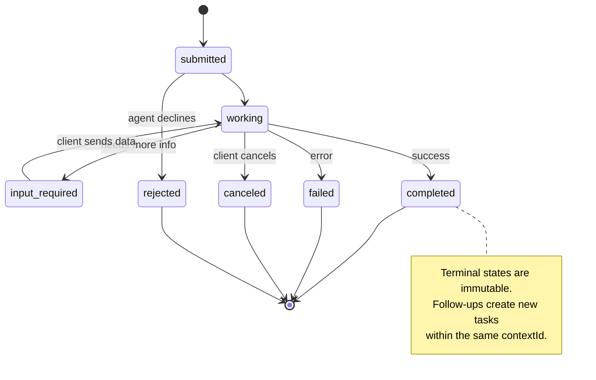

Os 8 estados (a especificação também define `UNSPECIFIED`como sentinela, omitido aqui):

> Os 8 estados estão definidos.`UNSPECIFIED`Como um sentinela, aqui está o provincial:

| State | Terminal? | Meaning / 含义 |
|---|---|---|
| `TASK_STATE_SUBMITTED` | No | Acknowledged, not yet processing / 已确认，尚未处理 |
| `TASK_STATE_WORKING` | No | Actively being processed / 正在处理 |
| `TASK_STATE_INPUT_REQUIRED` | No | Agent needs more info from client / Agent 需要客户端更多信息 |
| `TASK_STATE_AUTH_REQUIRED` | No | Authentication needed / 需要认证 |
| `TASK_STATE_COMPLETED` | Yes | Finished successfully / 成功完成 |
| `TASK_STATE_FAILED` | Yes | Finished with error / 出错完成 |
| `TASK_STATE_CANCELED` | Yes | Canceled before completion / 完成前取消 |
| `TASK_STATE_REJECTED` | Yes | Agent declined the task / Agent 拒绝任务 |

Os estados terminais (completados, falhados, cancelados, rejeitados) são imutáveis  uma vez que uma tarefa chega a uma, não são permitidas novas atualizações.`contextId`Para preservar a continuidade da sessão.

> 终态 (completado, falhado, cancelado, rejeitado) é imutável uma vez que a missão chega ao final, não permite mais actualização`contextId`Na criação de novas tarefas para manter a conversação continuidade.

Uma vez que uma tarefa atinge um estado terminal, é imutável. Não há mais mensagens. Seguimentos criam uma nova tarefa dentro da mesma.`contextId`- Não .

> Uma vez que a missão chega ao final, é imutável. Não pode voltar a enviar.`contextId`Increar novas tarefas.

#### Formatos de fio

A2A usa JSON-RPC 2.0. Aqui está o que um verdadeiro intercâmbio de mensagens parece:

**Client sends a task:**
```json
{
  "jsonrpc": "2.0",
  "id": 1,
  "method": "SendMessage",
  "params": {
    "message": {
      "messageId": "msg-001",
      "role": "ROLE_USER",
      "parts": [{ "text": "Research React 19 compiler features" }]
    },
    "configuration": {
      "acceptedOutputModes": ["text/plain", "application/json"],
      "historyLength": 10
    }
  }
}
```

**Agent responds with a task:**
```json
{
  "jsonrpc": "2.0",
  "id": 1,
  "result": {
    "task": {
      "id": "task-abc-123",
      "contextId": "ctx-xyz-789",
      "status": {
        "state": "TASK_STATE_COMPLETED",
        "timestamp": "2026-03-27T10:30:00Z"
      },
      "artifacts": [
        {
          "artifactId": "art-001",
          "name": "research-results",
          "parts": [{
            "data": {
              "findings": [
                "React 19 compiler auto-memoizes components",
                "No more manual useMemo/useCallback needed",
                "Compiler runs at build time, not runtime"
              ]
            },
            "mediaType": "application/json"
          }]
        }
      ]
    }
  }
}
```

**Streaming via SSE:**
```text
POST /message:stream HTTP/1.1
Content-Type: application/json
A2A-Version: 1.0

data: {"task":{"id":"task-123","status":{"state":"TASK_STATE_WORKING"}}}

data: {"statusUpdate":{"taskId":"task-123","status":{"state":"TASK_STATE_WORKING","message":{"role":"ROLE_AGENT","parts":[{"text":"Searching documentation..."}]}}}}

data: {"artifactUpdate":{"taskId":"task-123","artifact":{"artifactId":"art-1","parts":[{"text":"partial findings..."}]},"append":true,"lastChunk":false}}

data: {"statusUpdate":{"taskId":"task-123","status":{"state":"TASK_STATE_COMPLETED"}}}
```

### ACP (Protocolo de Comunicação do Agente)

**Created by:**IBM / BeeAI
**Spec version:**O valor de um valor de um valor de um valor de um valor de um valor de um valor de um valor de um valor de um valor de um valor de um valor de um valor de um valor de um valor de um valor de um valor de um valor de um valor de um valor de um valor de um valor de um valor de um valor de um valor de um valor de um valor de um valor de um valor de um valor de um valor de um valor de um valor de um valor de um valor de um valor de um valor de um valor de um valor de um valor de um valor de um valor de um valor de um valor de um valor de um valor de um valor de um valor de um valor de um valor de um valor de um valor de um valor de um valor de um valor de um valor de um valor de um valor de um valor de um valor de um valor de um valor de um valor de um valor de um valor de um valor de um valor de um valor de um valor de um valor de um valor de um valor de um valor de um valor de um valor de um valor de um valor de um valor de um valor de um valor de um valor de um valor de um valor de um valor de um valor de um valor de um valor de um valor de um valor de um valor de um valor de um valor de um valor de um valor de um valor de um valor de um valor de um valor de um valor de um valor de um valor de um valor de um valor de um valor de um valor de um valor de um valor de um valor de um valor de um valor de um valor de um valor de um valor de um valor de um valor de um valor de um valor de um valor de um valor de um valor de um valor de um valor de um valor de valor de valor de valor de valor de valor de valor de um valor de valor de valor de um valor.
**Status:**Fusão em A2A sob a Fundação Linux
**Problem:**Como os agentes comunicam com plena auditabilidade, continuidade de sessões e rastreamento de trajetória?

> **创建者：**IBM / BeeAI
> **规范版本：**O valor de um valor de um valor de um valor de um valor de um valor de um valor de um valor de um valor de um valor de um valor de um valor de um valor de um valor de um valor de um valor de um valor de um valor de um valor de um valor de um valor de um valor de um valor de um valor de um valor de um valor de um valor de um valor de um valor de um valor de um valor de um valor de um valor de um valor de um valor de um valor de um valor de um valor de um valor de um valor de um valor de um valor de um valor de um valor de um valor de um valor de um valor de um valor de um valor de um valor de um valor de um valor de um valor de um valor de um valor de um valor de um valor de um valor de um valor de um valor de um valor de um valor de um valor de um valor de um valor de um valor de um valor de um valor de um valor de um valor de um valor de um valor de um valor de um valor de um valor de um valor de um valor de um valor de um valor de um valor de um valor de um valor de um valor de um valor de um valor de um valor de um valor de um valor de um valor de um valor de um valor de um valor de um valor de um valor de um valor de um valor de um valor de um valor de um valor de um valor de um valor de um valor de um valor de um valor de um valor de um valor de um valor de um valor de um valor de um valor de um valor de um valor de um valor de um valor de um valor de um valor de um valor de um valor de um valor de um valor de um valor de um valor de um valor de valor de valor de valor de valor de valor de valor de um valor de valor de valor de um valor.
> **状态：**Está em desenvolvimento na A2A da Linux Foundation
> **问题：**Como o agente comunica com uma contínua e rastreável comunicação?

ACP é o **enterprise protocol**- Contrariamente ao que muitos resumos afirmam, o ACP faz **not**É uma API REST/JSON simples definida através da OpenAPI. O que a torna especial é que**TrajectoryMetadata**A resposta de cada agente pode conter um registro detalhado dos passos de raciocínio e das chamadas de ferramentas que a produziram.

> ACP é**企业协议** Diferente de muitas afirmações, ACP **不**Utilize JSON-LD. É uma simples REST/JSON API definida através da OpenAPI.**TrajectoryMetadata**Cada agente pode levar consigo para produzir seus métodos e ferramentas.

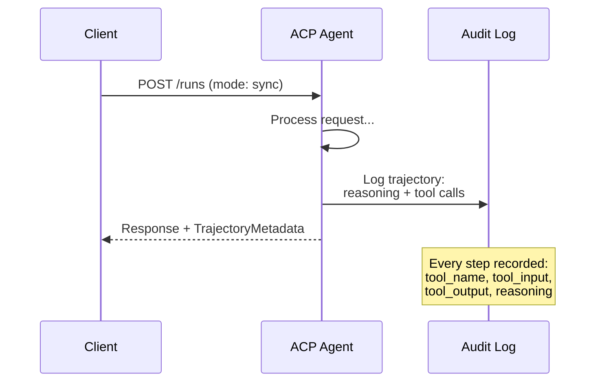

#### Agente Discovery em ACP

ACP define quatro métodos de descoberta:

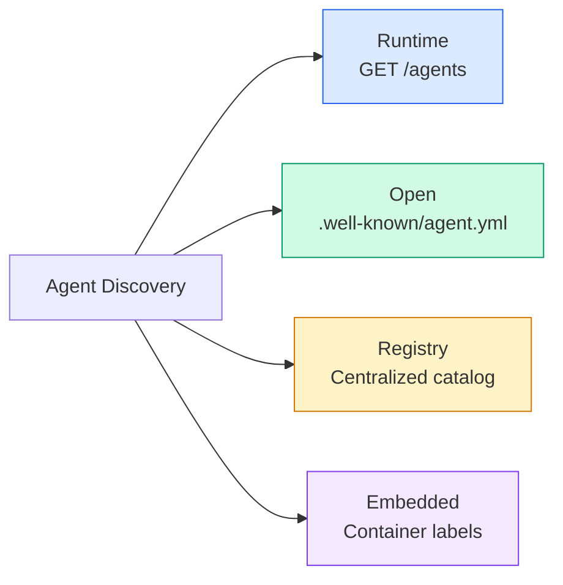

O **AgentManifest**É mais simples do que o cartão de agente da A2A:

> **AgentManifest**Com a A2A, o cartão de agente é mais simples:

```json
{
  "name": "summarizer",
  "description": "Summarizes documents with source citations",
  "input_content_types": ["text/plain", "application/pdf"],
  "output_content_types": ["text/plain", "application/json"],
  "metadata": {
    "tags": ["summarization", "RAG"],
    "framework": "BeeAI",
    "capabilities": [
      {
        "name": "Document Summarization",
        "description": "Condenses long documents into key points"
      }
    ],
    "recommended_models": ["llama3.3:70b-instruct-fp16"],
    "license": "Apache-2.0",
    "programming_language": "Python"
  }
}
```

Não há ligações de protocolo (single REST API), não há esquemas de segurança (delegados para o nível do servidor), não há lista de habilidades (capacidades são metadados planos).

> 沒有协议绑定 ((单一 REST API) 沒有安全方案 ((委托给服务器级别) 沒有技能列表 ((能力是平元数据) ⋅权衡:部署更简单,自描述性较差──

#### Execução do ciclo de vida

O ACP usa "Runs" em vez de "Tasks".

> Utilize ACP "Runs" em vez de "Tasks"―Run é um agente de execução com três modos:

| Mode | Behavior |
|---|---|
| `sync` | Blocking. Response contains the complete result. |
| `async` | Returns 202 immediately. Poll `GET /runs/{id}` for status. |
| `stream` | SSE stream. Events fire as the agent works. |

> - Não, não.
> Não é o que eu faço.
> - Não .`sync`O bloqueio. A resposta inclui o resultado completo.
> - Não .`async`Volto imediatamente para o 202...`GET /runs/{id}`- Não. - Não.
> - Não .`stream`O que aconteceu com o agente?

O modo de escolha mapeia os requisitos da experiência do usuário: sincronização para consultas rápidas, sincronização para trabalhos de fundo, streaming para tarefas de longa duração onde o usuário quer indicadores de progresso.

> 模式选择映射到用户体验需求:sync 用于快速查询,async 用于后台作业,stream 用于用户想要进度指示的长时间运行任务──

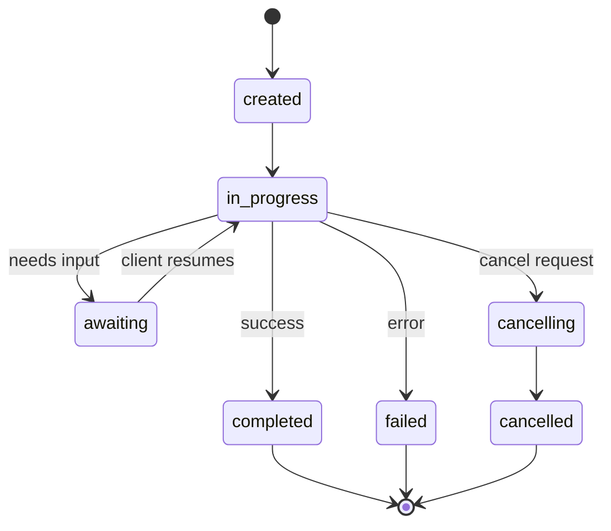

#### TrajetóriaMetadados (O Percurso de Auditoria)

Esta é a diferença-chave do ACP. Cada parte da mensagem pode incluir metadados que mostram exatamente o que o agente fez:

```json
{
  "role": "agent/researcher",
  "parts": [
    {
      "content_type": "text/plain",
      "content": "The weather in San Francisco is 72F and sunny.",
      "metadata": {
        "kind": "trajectory",
        "message": "I need to check the weather for this location",
        "tool_name": "weather_api",
        "tool_input": { "location": "San Francisco, CA" },
        "tool_output": { "temperature": 72, "condition": "sunny" }
      }
    }
  ]
}
```

Para as indústrias regulamentadas, isto é ouro. Cada resposta vem com uma cadeia comprovável de raciocínio: quais as ferramentas que foram chamadas, quais os insumos usados, quais as saídas recebidas.

> Para a indústria regulada, é um valor inestimável. Cada resposta tem uma cadeia de conclusões comprovável: qual ferramenta foi utilizada, qual entrada foi usada, qual saída foi recebida, não há caixa negra.

Os bancos, os cuidados de saúde e as instalações governamentais exigem esse tipo de auditoria. Os metadados de trajetória dos ACP são o que torna aceitáveis os agentes de LLM nesses ambientes.

> O Banco, a saúde e a administração pública necessitam de esta auditoria.

ACP também apoia **CitationMetadata**para atribuição de fonte:

> ACP também apoiado**CitationMetadata**Utilizado para:

```json
{
  "kind": "citation",
  "start_index": 0,
  "end_index": 47,
  "url": "https://weather.gov/sf",
  "title": "NWS San Francisco Forecast"
}
```

### ANP (Protocolo de Rede de Agentes)

**Created by:**Comunidade de código aberto (fundada por GaoWei Chang)
**Repo:** [github.com/agent-network-protocol/AgentNetworkProtocol](https://github.com/agent-network-protocol/AgentNetworkProtocol)
**Problem:**Como os agentes de diferentes organizações confiam uns nos outros sem autoridade central?

> **创建者：**开源社区(由 GaoWei Chang 创立)
> **代码库：** [github.com/agent-network-protocol/AgentNetworkProtocol](https://github.com/agent-network-protocol/AgentNetworkProtocol)
> **问题：**Como os agentes de diferentes organizações podem confiar uns nos outros sem autoridade central?

A ANP é a **decentralized identity protocol**A ANP permite que os agentes comprovam sua identidade criptograficamente.

> ANP é**去中心化身份协议** Utiliza o W3C 去中心化标识符 (DID) e o terminal de criptografia para criar confiança.

A ANP tem três camadas:

> A ANP tem três níveis:

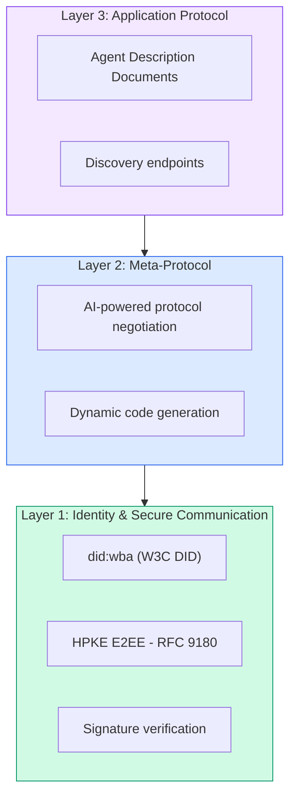

#### Documentação DID (estrutura real)

ANP utiliza um método personalizado chamado DID `did:wba`O DID .`did:wba:example.com:user:alice`resolve `https://example.com/user/alice/did.json`- Não .

```json
{
  "@context": [
    "https://www.w3.org/ns/did/v1",
    "https://w3id.org/security/suites/jws-2020/v1",
    "https://w3id.org/security/suites/secp256k1-2019/v1"
  ],
  "id": "did:wba:example.com:user:alice",
  "verificationMethod": [
    {
      "id": "did:wba:example.com:user:alice#key-1",
      "type": "EcdsaSecp256k1VerificationKey2019",
      "controller": "did:wba:example.com:user:alice",
      "publicKeyJwk": {
        "crv": "secp256k1",
        "x": "NtngWpJUr-rlNNbs0u-Aa8e16OwSJu6UiFf0Rdo1oJ4",
        "y": "qN1jKupJlFsPFc1UkWinqljv4YE0mq_Ickwnjgasvmo",
        "kty": "EC"
      }
    },
    {
      "id": "did:wba:example.com:user:alice#key-x25519-1",
      "type": "X25519KeyAgreementKey2019",
      "controller": "did:wba:example.com:user:alice",
      "publicKeyMultibase": "z9hFgmPVfmBZwRvFEyniQDBkz9LmV7gDEqytWyGZLmDXE"
    }
  ],
  "authentication": [
    "did:wba:example.com:user:alice#key-1"
  ],
  "keyAgreement": [
    "did:wba:example.com:user:alice#key-x25519-1"
  ],
  "humanAuthorization": [
    "did:wba:example.com:user:alice#key-1"
  ],
  "service": [
    {
      "id": "did:wba:example.com:user:alice#agent-description",
      "type": "AgentDescription",
      "serviceEndpoint": "https://example.com/agents/alice/ad.json"
    }
  ]
}
```

Coisas importantes a observar:
- **Key separation**As chaves de assinatura (secp256k1) são separadas das chaves de criptografia (X25519).
  Tradução:**密钥分离**É obrigatório.
- **`humanAuthorization`**As chaves de acesso são exclusivas da ANP. Estas chaves exigem a aprovação humana explícita (biometria, senha, HSM) antes de serem utilizadas.
  Tradução:**`humanAuthorization`**É o ANP único. Estas chaves estão em uso antes de precisar de aprovação humana.
- **`keyAgreement`**As chaves são utilizadas para a criptografia de ponta a ponta HPKE (RFC 9180).
  Tradução:**`keyAgreement`**密钥用于HPKE 端到端加密(RFC 9180)。
- O **service**Seção de ligações ao documento de descrição do agente.
  Tradução:**service**部分链接到 Agente 描述文档──

O padrão de separação de chaves é o que os sistemas criptográficos do mundo real exigem, mas os protocolos JSON muitas vezes ignoram. ANP impõe-o porque agentes trans-organizacionais lidam com dinheiro, contratos e PII  uma única chave comprometida não deve desbloquear todas as capacidades.

> O modelo de separação de chaves é exigido pelo sistema de criptografia real, mas o protocolo JSON é frequentemente saltado. O ANP forçou a executá-lo, porque o agente trans-organizado processou dinheiro, contratos e PII, e as chaves individuais capturadas não conseguiram desbloquear cada capacidade.

#### Como funciona a confiança na ANP

A ANP faz **not**utilizar um gráfico de web-of-trust ou de endosso.

> ANP **不**Utilize信任网络或背书图──信任是双边的,每次交互都会验证:

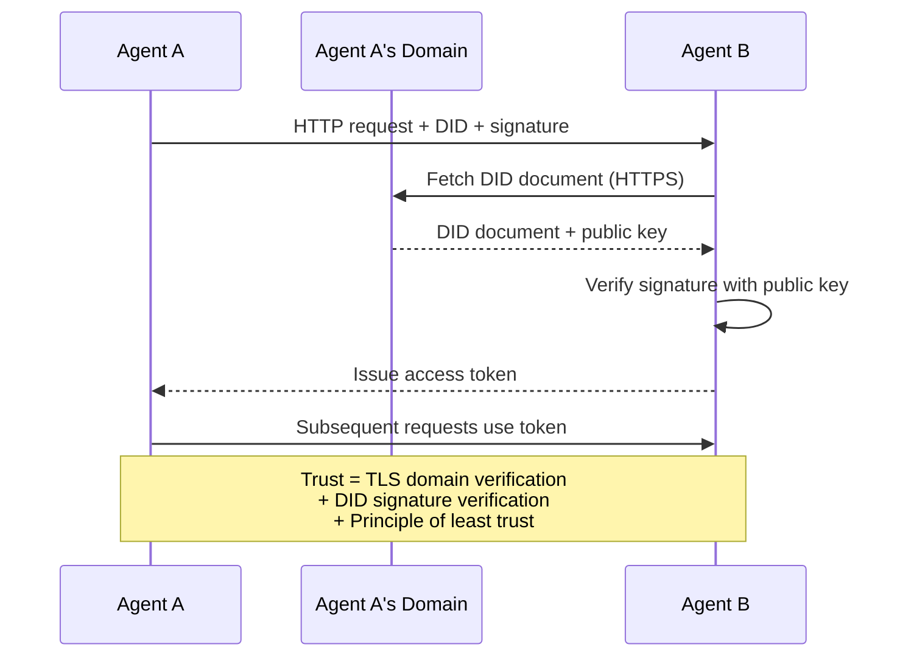

A confiança vem de três fontes:
1. **Domain-level TLS**Verifica o documento DID host
   Tradução:**域级 TLS**验证 DID 文档主机
2. **DID cryptographic signatures**Verificar a identidade do agente
   Tradução:**DID 加密签名**Identidade de Agente de Verificação
3. **Principle of least trust**concede apenas permissões mínimas
   Tradução:**最小信任原则** Apenas conceder o mínimo de direitos

O projeto de três fontes evita pontos únicos de falha. O TLS sozinho é insuficiente (qualquer pessoa com um certificado pode hospedar um DID).

> O TLS não é suficiente para qualquer pessoa com certificado pode ser administrado por DID.

Não há propagação de confiança baseada em fofocas ou pontuação de PageRank.

> Não há nenhuma base em divulgação ou PageRank.

#### Negociação do Meta-Protocolo

Esta é a característica mais nova da ANP. Quando dois agentes de ecossistemas diferentes se encontram, eles não precisam de formatos de dados pré-acordados.

> É a função mais recente da ANP. Quando dois agentes de diferentes ecossistemas se encontram, eles não precisam de um formato de dados pré-definido.

```json
{
  "action": "protocolNegotiation",
  "sequenceId": 0,
  "candidateProtocols": "I can communicate using:\n1. JSON-RPC with hotel booking schema\n2. REST with OpenAPI 3.1 spec\n3. Natural language over HTTP",
  "modificationSummary": "Initial proposal",
  "status": "negotiating"
}
```

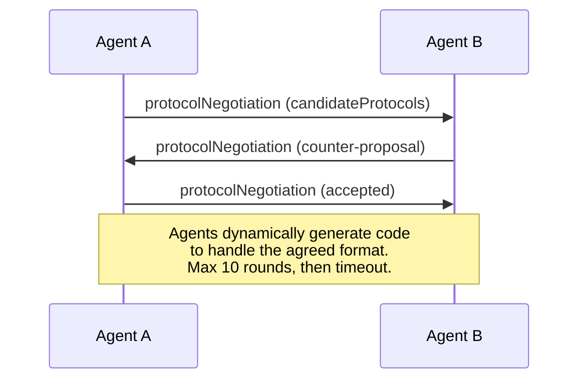

Os agentes vão para frente e para trás (máximo 10 tiros) até concordarem em um formato, e depois geram código dinâmico para lidar com ele.`negotiating`- Não .`rejected`- Não .`accepted`- Não .`timeout`- Não .

> Agente para voltar a discutir ((mais de 10 rotas) até chegar a um acordo de formato, então a atividade gera código para processá-lo.`negotiating`(协商中)`rejected`Não, não.`accepted`(acceptar)`timeout`Não sei.

Isso significa que dois agentes que nunca se viram antes podem descobrir como se comunicar sem que alguém defina pré-definindo um esquema compartilhado.

> Isso significa que dois agentes nunca vistos podem encontrar uma maneira de se comunicar sem ninguém definir o modelo de partilha.

A visão: uma web de agentes abertos onde qualquer agente pode falar com qualquer outro agente, ad-hoc, sem trabalho de integração prévio. Se isso se escala além de demos de brinquedos é uma questão aberta de 2026.

> 愿景: Open Agent 网络中的任何 Agent可以与任何其他 Agent 临时对话,无需前期集成工作──这是否能扩展到玩具演示之外是2026年开放问题──后备总是"User A2A并预先就模式达成──"

### Comparativo (corrigido)

| | MCP | A2A | ACP | ANP |
|---|---|---|---|---|
| **Created by** | Anthropic | Google / Linux Foundation | IBM / BeeAI | Community |
| **Spec format** | JSON-RPC | JSON-RPC / REST / gRPC | OpenAPI 3.1 (REST) | JSON-RPC |
| **Primary use** | Agent to Tool | Agent to Agent | Agent to Agent | Agent to Agent |
| **Discovery** | Tool listing | `/.well-known/agent-card.json` | `GET /agents`, `/.well-known/agent.yml` | `/.well-known/agent-descriptions`, DID service endpoints |
| **Identity** | Implicit (local) | Security schemes (OAuth, mTLS) | Server-level | W3C DID (`did:wba`) with E2EE |
| **Audit trail** | N/A | Basic (task history) | TrajectoryMetadata (tool calls, reasoning) | Not formally specified |
| **State machine** | N/A | 9 task states | 7 run states | N/A |
| **Streaming** | N/A | SSE | SSE | Transport-agnostic |
| **Unique feature** | Tool schemas | Agent Cards + Skills | Trajectory audit trail | Meta-protocol negotiation |
| **Best for** | Tools & data | Dynamic collaboration | Regulated industries | Cross-org trust |
| **Status** | Stable | Stable (v1.0) | Merging into A2A | Active development |

### Como trabalham juntos

Estes protocolos não são mutuamente exclusivos.

> Estes acordos não são mutuamente explorados.

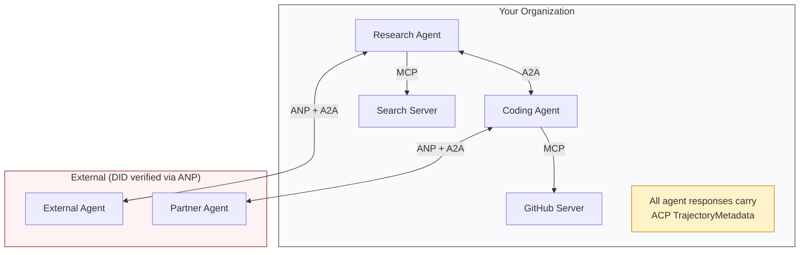

- **MCP**liga cada agente às suas ferramentas
  Tradução:**MCP**Cada agente está ligado a seus instrumentos .
- **A2A**Gestão da colaboração entre agentes (internos e externos)
  Tradução:**A2A**处理 Agente 之间的协作( interno e externo)
- **ACP**Envolve as respostas em metadados de trajetória para auditabilidade
  Tradução:**ACP**Utilizando o envelope de dados de trajetória para alcançar a auditorialidade
- **ANP**fornece verificação de identidade para agentes que não controlas.
  Tradução:**ANP**Por que não controlas o agente ?

## Construí-lo e realizei-o.
```figure
swarm-message-bus
```

## Construí-lo

### Passo 1: Tipos de mensagem

Todos os sistemas multi-agentes começam com um formato de mensagem.

> Cada sistema de Agentes é iniciado com um formato de mensagem.

```typescript
import crypto from "node:crypto";

type MessageRole = "user" | "agent";

type MessagePart =
  | { kind: "text"; text: string }
  | { kind: "data"; data: unknown; mediaType: string }
  | { kind: "file"; name: string; url: string; mediaType: string };

type TrajectoryEntry = {
  reasoning: string;
  toolName?: string;
  toolInput?: unknown;
  toolOutput?: unknown;
  timestamp: number;
};

type AgentMessage = {
  id: string;
  role: MessageRole;
  parts: MessagePart[];
  trajectory?: TrajectoryEntry[];
  replyTo?: string;
  timestamp: number;
};

function createMessage(
  role: MessageRole,
  parts: MessagePart[],
  replyTo?: string
): AgentMessage {
  return {
    id: crypto.randomUUID(),
    role,
    parts,
    replyTo,
    timestamp: Date.now(),
  };
}

function textMessage(role: MessageRole, text: string): AgentMessage {
  return createMessage(role, [{ kind: "text", text }]);
}
```

Observação: `MessagePart`É multimodal (texto, dados estruturados, arquivos) assim como as especificações reais A2A e ACP. `TrajectoryEntry`Captura a cadeia de raciocínio, correspondendo aos Metadados de Trájetória ACP.

> Nota:`MessagePart`É um modelo de texto, estruturação de dados, documentos, como a verdadeira A2A e ACP.`TrajectoryEntry`捕获推理链,匹配 ACP's TrajectoryMetadata:

### Passo 2: Cartão de Agente A2A e Registro

Construa um agente de descoberta que corresponda à especificação real do A2A:

> 构建匹配真实A2A 规范的代理 发现:

```typescript
type Skill = {
  id: string;
  name: string;
  description: string;
  tags: string[];
  inputModes: string[];
  outputModes: string[];
};

type AgentCard = {
  name: string;
  description: string;
  version: string;
  url: string;
  capabilities: {
    streaming: boolean;
    pushNotifications: boolean;
  };
  defaultInputModes: string[];
  defaultOutputModes: string[];
  skills: Skill[];
};

class AgentRegistry {
  private cards: Map<string, AgentCard> = new Map();

  register(card: AgentCard) {
    this.cards.set(card.name, card);
  }

  discoverBySkillTag(tag: string): AgentCard[] {
    return [...this.cards.values()].filter((card) =>
      card.skills.some((skill) => skill.tags.includes(tag))
    );
  }

  discoverByInputMode(mimeType: string): AgentCard[] {
    return [...this.cards.values()].filter(
      (card) =>
        card.defaultInputModes.includes(mimeType) ||
        card.skills.some((skill) => skill.inputModes.includes(mimeType))
    );
  }

  resolve(name: string): AgentCard | undefined {
    return this.cards.get(name);
  }

  listAll(): AgentCard[] {
    return [...this.cards.values()];
  }
}
```

Isto é substancialmente mais rico do que um simples mapa de nome-a-capacidade. Você pode descobrir agentes por etiquetas de habilidade, por tipos de entrada MIME, ou por nome, assim como a especificação real A2A suporta.

> É muito mais rico do que um simples nome para capacitação de mapeamento. Você pode inserir o tipo de MIME ou nome de Agente, como o verdadeiro A2A.

### Passo 3: Ciclo de vida das tarefas A2A

Construir a máquina de estado de tarefa completa:

> 构建完整的任务状态机:

```typescript
type TaskState =
  | "submitted"
  | "working"
  | "input-required"
  | "auth-required"
  | "completed"
  | "failed"
  | "canceled"
  | "rejected";

const TERMINAL_STATES: TaskState[] = [
  "completed",
  "failed",
  "canceled",
  "rejected",
];

type TaskStatus = {
  state: TaskState;
  message?: AgentMessage;
  timestamp: number;
};

type Artifact = {
  id: string;
  name: string;
  parts: MessagePart[];
};

type Task = {
  id: string;
  contextId: string;
  status: TaskStatus;
  artifacts: Artifact[];
  history: AgentMessage[];
};

type TaskEvent =
  | { kind: "statusUpdate"; taskId: string; status: TaskStatus }
  | {
      kind: "artifactUpdate";
      taskId: string;
      artifact: Artifact;
      append: boolean;
      lastChunk: boolean;
    };

type TaskHandler = (
  task: Task,
  message: AgentMessage
) => AsyncGenerator<TaskEvent>;

class TaskManager {
  private tasks: Map<string, Task> = new Map();
  private handlers: Map<string, TaskHandler> = new Map();
  private listeners: Map<string, ((event: TaskEvent) => void)[]> = new Map();

  registerHandler(agentName: string, handler: TaskHandler) {
    this.handlers.set(agentName, handler);
  }

  subscribe(taskId: string, listener: (event: TaskEvent) => void) {
    const existing = this.listeners.get(taskId) ?? [];
    existing.push(listener);
    this.listeners.set(taskId, existing);
  }

  async sendMessage(
    agentName: string,
    message: AgentMessage,
    contextId?: string
  ): Promise<Task> {
    const handler = this.handlers.get(agentName);
    if (!handler) {
      const task = this.createTask(contextId);
      task.status = {
        state: "rejected",
        timestamp: Date.now(),
        message: textMessage("agent", `No handler for ${agentName}`),
      };
      return task;
    }

    const task = this.createTask(contextId);
    task.history.push(message);
    task.status = { state: "submitted", timestamp: Date.now() };

    this.processTask(task, handler, message).catch((err) => {
      task.status = {
        state: "failed",
        timestamp: Date.now(),
        message: textMessage("agent", String(err)),
      };
    });
    return task;
  }

  getTask(taskId: string): Task | undefined {
    return this.tasks.get(taskId);
  }

  cancelTask(taskId: string): boolean {
    const task = this.tasks.get(taskId);
    if (!task || TERMINAL_STATES.includes(task.status.state)) return false;
    task.status = { state: "canceled", timestamp: Date.now() };
    this.emit(taskId, {
      kind: "statusUpdate",
      taskId,
      status: task.status,
    });
    return true;
  }

  private createTask(contextId?: string): Task {
    const task: Task = {
      id: crypto.randomUUID(),
      contextId: contextId ?? crypto.randomUUID(),
      status: { state: "submitted", timestamp: Date.now() },
      artifacts: [],
      history: [],
    };
    this.tasks.set(task.id, task);
    return task;
  }

  private async processTask(
    task: Task,
    handler: TaskHandler,
    message: AgentMessage
  ) {
    task.status = { state: "working", timestamp: Date.now() };
    this.emit(task.id, {
      kind: "statusUpdate",
      taskId: task.id,
      status: task.status,
    });

    try {
      for await (const event of handler(task, message)) {
        if (TERMINAL_STATES.includes(task.status.state)) break;

        if (event.kind === "statusUpdate") {
          task.status = event.status;
        }
        if (event.kind === "artifactUpdate") {
          const existing = task.artifacts.find(
            (a) => a.id === event.artifact.id
          );
          if (existing && event.append) {
            existing.parts.push(...event.artifact.parts);
          } else {
            task.artifacts.push(event.artifact);
          }
        }
        this.emit(task.id, event);
      }
    } catch (err) {
      task.status = {
        state: "failed",
        timestamp: Date.now(),
        message: textMessage("agent", String(err)),
      };
      this.emit(task.id, {
        kind: "statusUpdate",
        taskId: task.id,
        status: task.status,
      });
    }
  }

  private emit(taskId: string, event: TaskEvent) {
    for (const listener of this.listeners.get(taskId) ?? []) {
      listener(event);
    }
  }
}
```

Isso implementa o ciclo de vida real da tarefa A2A: enviado, trabalhando, requerido, estados terminais. Os processadores são geradores de sincronia que produzem eventos (atendimentos de status e fragmentos de artefatos) correspondentes ao modelo de streaming SSE.

> Isto realizou um verdadeiro ciclo de vida de A2A:enviado, trabalhando, requerido, final.

### Passo 4: Caminho de auditoria de estilo ACP

A comunicação com rastreamento de trajetória:

> Usar o seu tráfego de transporte:

```typescript
type AuditEntry = {
  runId: string;
  agentName: string;
  input: AgentMessage[];
  output: AgentMessage[];
  trajectory: TrajectoryEntry[];
  status: "created" | "in-progress" | "completed" | "failed" | "awaiting";
  startedAt: number;
  completedAt?: number;
  sessionId?: string;
};

class AuditableRunner {
  private log: AuditEntry[] = [];
  private handlers: Map<
    string,
    (input: AgentMessage[]) => Promise<{
      output: AgentMessage[];
      trajectory: TrajectoryEntry[];
    }>
  > = new Map();

  registerAgent(
    name: string,
    handler: (input: AgentMessage[]) => Promise<{
      output: AgentMessage[];
      trajectory: TrajectoryEntry[];
    }>
  ) {
    this.handlers.set(name, handler);
  }

  async run(
    agentName: string,
    input: AgentMessage[],
    sessionId?: string
  ): Promise<AuditEntry> {
    const entry: AuditEntry = {
      runId: crypto.randomUUID(),
      agentName,
      input: structuredClone(input),
      output: [],
      trajectory: [],
      status: "created",
      startedAt: Date.now(),
      sessionId,
    };
    this.log.push(entry);

    const handler = this.handlers.get(agentName);
    if (!handler) {
      entry.status = "failed";
      return entry;
    }

    entry.status = "in-progress";
    try {
      const result = await handler(input);
      entry.output = structuredClone(result.output);
      entry.trajectory = structuredClone(result.trajectory);
      entry.status = "completed";
      entry.completedAt = Date.now();
    } catch (err) {
      entry.status = "failed";
      entry.trajectory.push({
        reasoning: `Error: ${String(err)}`,
        timestamp: Date.now(),
      });
      entry.completedAt = Date.now();
    }
    return entry;
  }

  getFullAuditLog(): AuditEntry[] {
    return structuredClone(this.log);
  }

  getAuditLogForAgent(agentName: string): AuditEntry[] {
    return structuredClone(
      this.log.filter((e) => e.agentName === agentName)
    );
  }

  getAuditLogForSession(sessionId: string): AuditEntry[] {
    return structuredClone(
      this.log.filter((e) => e.sessionId === sessionId)
    );
  }

  getTrajectoryForRun(runId: string): TrajectoryEntry[] {
    const entry = this.log.find((e) => e.runId === runId);
    return entry ? structuredClone(entry.trajectory) : [];
  }
}
```

Cada execução de um agente produz uma entrada de auditoria completa: o que entrou, o que saiu, e a trajetória completa das chamadas de ferramenta e passos de raciocínio entre eles.

> Cada vez que o Agente executa, produz-se-á um artigo completo de auditoria: o que foi introduzido, o que foi emitido, bem como a trajetória completa entre as etapas de manipulação e de avaliação.

### Passo 5: Verificação de identidade de estilo ANP

Construir identidade e verificação baseadas em DID:

> Construção baseada em IDD e certificação:

```typescript
type VerificationMethod = {
  id: string;
  type: string;
  controller: string;
  publicKeyDer: string;
};

type DIDDocument = {
  id: string;
  verificationMethod: VerificationMethod[];
  authentication: string[];
  keyAgreement: string[];
  humanAuthorization: string[];
  service: { id: string; type: string; serviceEndpoint: string }[];
};

type AgentIdentity = {
  did: string;
  document: DIDDocument;
  privateKey: crypto.KeyObject;
  publicKey: crypto.KeyObject;
};

class IdentityRegistry {
  private documents: Map<string, DIDDocument> = new Map();

  publish(doc: DIDDocument) {
    this.documents.set(doc.id, doc);
  }

  resolve(did: string): DIDDocument | undefined {
    return this.documents.get(did);
  }

  verify(did: string, signature: string, payload: string): boolean {
    const doc = this.documents.get(did);
    if (!doc) return false;

    const authKeyIds = doc.authentication;
    const authKeys = doc.verificationMethod.filter((vm) =>
      authKeyIds.includes(vm.id)
    );

    for (const key of authKeys) {
      const publicKey = crypto.createPublicKey({
        key: Buffer.from(key.publicKeyDer, "base64"),
        format: "der",
        type: "spki",
      });
      const isValid = crypto.verify(
        null,
        Buffer.from(payload),
        publicKey,
        Buffer.from(signature, "hex")
      );
      if (isValid) return true;
    }
    return false;
  }

  requiresHumanAuth(did: string, operationKeyId: string): boolean {
    const doc = this.documents.get(did);
    if (!doc) return false;
    return doc.humanAuthorization.includes(operationKeyId);
  }
}

function createIdentity(domain: string, agentName: string): AgentIdentity {
  const did = `did:wba:${domain}:agent:${agentName}`;
  const { publicKey, privateKey } = crypto.generateKeyPairSync("ed25519");

  const publicKeyDer = publicKey
    .export({ format: "der", type: "spki" })
    .toString("base64");

  const keyId = `${did}#key-1`;
  const encKeyId = `${did}#key-x25519-1`;

  const document: DIDDocument = {
    id: did,
    verificationMethod: [
      {
        id: keyId,
        type: "Ed25519VerificationKey2020",
        controller: did,
        publicKeyDer,
      },
      {
        id: encKeyId,
        type: "X25519KeyAgreementKey2019",
        controller: did,
        publicKeyDer,
      },
    ],
    authentication: [keyId],
    keyAgreement: [encKeyId],
    humanAuthorization: [],
    service: [
      {
        id: `${did}#agent-description`,
        type: "AgentDescription",
        serviceEndpoint: `https://${domain}/agents/${agentName}/ad.json`,
      },
    ],
  };

  return { did, document, privateKey, publicKey };
}

function signPayload(identity: AgentIdentity, payload: string): string {
  return crypto
    .sign(null, Buffer.from(payload), identity.privateKey)
    .toString("hex");
}
```

Isto reflete o modelo de identidade real da ANP: os agentes têm documentos DID com autenticação separada, acordo-chave e chaves de autorização humana.`IdentityRegistry`Simula a resolução DID (na produção, isso seria trazer HTTP para o domínio do agente).

> Isso reflete o modelo de identidade real da ANP: Agente possuindo documentos de DID com certificação independente, protocolo de chave e chave de autorização artificial.`IdentityRegistry`模拟 DID 解析 (((em ambiente de produção, isto será para o domínio do agente DATA 获取)

### Passo 6: Portal de Protocolo

Conectar os quatro protocolos num sistema unificado:

> Todos os quatro protocolos estão conectados a um sistema único:

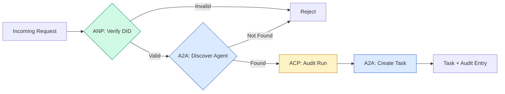

```typescript
class ProtocolGateway {
  private registry: AgentRegistry;
  private taskManager: TaskManager;
  private auditRunner: AuditableRunner;
  private identityRegistry: IdentityRegistry;

  constructor(
    registry: AgentRegistry,
    taskManager: TaskManager,
    auditRunner: AuditableRunner,
    identityRegistry: IdentityRegistry
  ) {
    this.registry = registry;
    this.taskManager = taskManager;
    this.auditRunner = auditRunner;
    this.identityRegistry = identityRegistry;
  }

  async delegateTask(
    fromDid: string,
    signature: string,
    targetAgent: string,
    message: AgentMessage,
    sessionId?: string
  ): Promise<{ task: Task; audit: AuditEntry } | { error: string }> {
    if (!this.identityRegistry.verify(fromDid, signature, message.id)) {
      return { error: "Identity verification failed" };
    }

    const card = this.registry.resolve(targetAgent);
    if (!card) {
      return { error: `Agent ${targetAgent} not found in registry` };
    }

    const audit = await this.auditRunner.run(
      targetAgent,
      [message],
      sessionId
    );
    const task = await this.taskManager.sendMessage(targetAgent, message);

    return { task, audit };
  }

  discoverAndDelegate(
    fromDid: string,
    signature: string,
    skillTag: string,
    message: AgentMessage
  ): Promise<{ task: Task; audit: AuditEntry } | { error: string }> {
    const candidates = this.registry.discoverBySkillTag(skillTag);
    if (candidates.length === 0) {
      return Promise.resolve({
        error: `No agents found with skill tag: ${skillTag}`,
      });
    }
    return this.delegateTask(
      fromDid,
      signature,
      candidates[0].name,
      message
    );
  }
}
```

O portal faz quatro coisas numa chamada:
1. **ANP**: Verifica a identidade do telefonista através da assinatura DID
   Tradução:**ANP**: através de DID 签名验证调用者身份
2. **A2A**: Descobre o agente alvo e verifica as capacidades
   Tradução:**A2A**: detecção do alvo agente e capacidade de inspecção
3. **ACP**: Envolve a execução numa trilha de auditoria com trajetória
   Tradução:**ACP**O que é o "trail audit"
4. **A2A**: Cria uma tarefa com acompanhamento completo do ciclo de vida
   Tradução:**A2A**A criação de missões com um ciclo de vida completo

### Passo 7: Enfiar tudo juntos

```typescript
async function protocolDemo() {
  const registry = new AgentRegistry();
  registry.register({
    name: "researcher",
    description: "Searches and summarizes findings",
    version: "1.0.0",
    url: "https://researcher.local/a2a/v1",
    capabilities: { streaming: true, pushNotifications: false },
    defaultInputModes: ["text/plain"],
    defaultOutputModes: ["text/plain", "application/json"],
    skills: [
      {
        id: "web-research",
        name: "Web Research",
        description: "Searches the web",
        tags: ["research", "search", "summarization"],
        inputModes: ["text/plain"],
        outputModes: ["application/json"],
      },
    ],
  });
  registry.register({
    name: "coder",
    description: "Writes code from specs",
    version: "1.0.0",
    url: "https://coder.local/a2a/v1",
    capabilities: { streaming: false, pushNotifications: false },
    defaultInputModes: ["text/plain", "application/json"],
    defaultOutputModes: ["text/plain"],
    skills: [
      {
        id: "code-gen",
        name: "Code Generation",
        description: "Generates code",
        tags: ["coding", "generation"],
        inputModes: ["text/plain", "application/json"],
        outputModes: ["text/plain"],
      },
    ],
  });

  const taskManager = new TaskManager();
  const auditRunner = new AuditableRunner();

  const researchTrajectory: TrajectoryEntry[] = [];

  taskManager.registerHandler(
    "researcher",
    async function* (task, message) {
      yield {
        kind: "statusUpdate" as const,
        taskId: task.id,
        status: { state: "working" as const, timestamp: Date.now() },
      };

      researchTrajectory.push({
        reasoning: "Searching for React 19 documentation",
        toolName: "web_search",
        toolInput: { query: "React 19 compiler features" },
        toolOutput: {
          results: ["react.dev/blog/react-19", "github.com/react/react"],
        },
        timestamp: Date.now(),
      });

      researchTrajectory.push({
        reasoning: "Extracting key findings from search results",
        toolName: "doc_analysis",
        toolInput: { url: "react.dev/blog/react-19" },
        toolOutput: {
          summary:
            "React 19 compiler auto-memoizes, no manual useMemo needed",
        },
        timestamp: Date.now(),
      });

      yield {
        kind: "artifactUpdate" as const,
        taskId: task.id,
        artifact: {
          id: crypto.randomUUID(),
          name: "research-results",
          parts: [
            {
              kind: "data" as const,
              data: {
                findings: [
                  "React 19 compiler auto-memoizes components",
                  "No more manual useMemo/useCallback needed",
                  "Compiler runs at build time, not runtime",
                ],
                sources: ["react.dev/blog/react-19"],
              },
              mediaType: "application/json",
            },
          ],
        },
        append: false,
        lastChunk: true,
      };

      yield {
        kind: "statusUpdate" as const,
        taskId: task.id,
        status: { state: "completed" as const, timestamp: Date.now() },
      };
    }
  );

  auditRunner.registerAgent("researcher", async () => ({
    output: [
      textMessage("agent", "React 19 compiler auto-memoizes components"),
    ],
    trajectory: researchTrajectory,
  }));

  const identityRegistry = new IdentityRegistry();

  const coderIdentity = createIdentity("coder.local", "coder");
  const researcherIdentity = createIdentity("researcher.local", "researcher");

  identityRegistry.publish(coderIdentity.document);
  identityRegistry.publish(researcherIdentity.document);

  const gateway = new ProtocolGateway(
    registry,
    taskManager,
    auditRunner,
    identityRegistry
  );

  console.log("=== Protocol Demo ===\n");

  console.log("1. Agent Discovery (A2A)");
  const researchAgents = registry.discoverBySkillTag("research");
  console.log(
    `   Found ${researchAgents.length} agent(s):`,
    researchAgents.map((a) => a.name)
  );

  console.log("\n2. Identity Verification (ANP)");
  const message = textMessage("user", "Research React 19 compiler features");
  const signature = signPayload(coderIdentity, message.id);
  const verified = identityRegistry.verify(
    coderIdentity.did,
    signature,
    message.id
  );
  console.log(`   Coder DID: ${coderIdentity.did}`);
  console.log(`   Signature verified: ${verified}`);

  console.log("\n3. Task Delegation (A2A + ACP + ANP)");
  const result = await gateway.delegateTask(
    coderIdentity.did,
    signature,
    "researcher",
    message,
    "session-001"
  );

  if ("error" in result) {
    console.log(`   Error: ${result.error}`);
    return;
  }

  console.log(`   Task ID: ${result.task.id}`);
  console.log(`   Task state: ${result.task.status.state}`);
  console.log(`   Artifacts: ${result.task.artifacts.length}`);

  console.log("\n4. Audit Trail (ACP)");
  console.log(`   Run ID: ${result.audit.runId}`);
  console.log(`   Status: ${result.audit.status}`);
  console.log(`   Trajectory steps: ${result.audit.trajectory.length}`);
  for (const step of result.audit.trajectory) {
    console.log(`     - ${step.reasoning}`);
    if (step.toolName) {
      console.log(`       Tool: ${step.toolName}`);
    }
  }

  console.log("\n5. Full Audit Log");
  const fullLog = auditRunner.getFullAuditLog();
  console.log(`   Total runs: ${fullLog.length}`);
  for (const entry of fullLog) {
    const duration = entry.completedAt
      ? `${entry.completedAt - entry.startedAt}ms`
      : "in-progress";
    console.log(`   ${entry.agentName}: ${entry.status} (${duration})`);
  }
}

protocolDemo().catch((err) => {
  console.error("Protocol demo failed:", err);
  process.exitCode = 1;
});
```

## O que vai mal

Os protocolos resolvem o caminho feliz.

> O acordo resolveu o caminho normal.

**Schema drift.**O Agente A publica um cartão de publicidade .`application/json`O JSON é um sistema de dados de dados que pode ser usado para fazer uma análise de dados.`version`- Em Agente Cards por esta razão.

> **模式漂移。**Agente A , lança uma propaganda .`application/json`输出机器卡片──但 JSON 模式在版本之间发生变化──Agent B 解析旧格式并得到垃圾数据──修复:版本化你的技能和输出模式──A2A 规范为此支持机器卡上的`version`- Não.

**State machine violations.**Um agente de manipulação dá um `completed`O código de correção é silenciosamente o que é o seu código, o que significa que o seu código é um código de correção.`TaskManager`A lei de que se trata de um Estado-Membro é aplicável.`break`Depois dos estados terminais.

> **状态机违规。**Agente  processamento processo produzir um `completed`事件, then try to produce more workpieces──task is unchangeable──your code will silently abandon update or throw out abnormal──repair:`TaskManager`                                                                                                                                                                                                                                                                                                                                                                                                                                                                                                                             `break`Para executar obrigatoriamente.

**Trust resolution failures.**O agente A tenta verificar o DID do agente B, mas o domínio do agente B está sem acesso. O documento DID não pode ser recuperado. Você não abre (aceita agentes não verificados) ou não fecha (refuta tudo)?

> **信任解析失败。**Agente A 试试验证 Agente B's DID, mas o nome de domínio do Agente B 已机机了──DID 文档无法获取──你是开放失败 (têm ou não aceito Agente não verificado)

**Trajectory bloat.**A registros de trajetórias ACP é poderosa, mas cara. Um agente complexo que faz 200 chamadas de ferramentas por rodada produz entradas de auditoria maciças.

> **轨迹膨胀。**O processo de gestão de tráfego ACP 轨迹日志功能强大但代价高昂―― um agente complexo, cada vez que se realiza uma operação de 200 ferramentas, é necessário criar uma grande quantidade de artigos de auditoria―― Reprodução:

**Discovery thundering herd.**50 agentes todos em busca .`GET /agents`Correção: Cachar Cartões de Agente com TTL, intervalos de descoberta escalonados ou usar registro baseado em push em vez de pesquisas.

> **发现惊群。**50 agentes em funcionamento ao mesmo tempo que fazem perguntas .`GET /agents` Modificação: Utilização de TTL 缓存 Agente 卡片,交错发现间隔, ou utilização baseada em registros e não em rotativas de envio 

## Use-o com o framework implementado.

### Implementações reais

**A2A**É o mais maduro.[official spec](https://github.com/google/A2A)O software é de código aberto sob a Linux Foundation. SDKs para Python e TypeScript. Se os seus agentes precisam de descoberta dinâmica e colaboração, comece aqui.

> **A2A**É o mais maduro do Google.[官方规范](https://github.com/google/A2A)Há Python e o SDK TypeScript. Se o seu agente precisa de atividade de descoberta e colaboração, comece aqui.

**ACP**A IBM está a fundir-se na A2A.[BeeAI project](https://github.com/i-am-bee/acp)A utilização de padrões ACP (registros de trajetórias, ciclo de vida de execução) mesmo se utilizarem A2A como transporte.

> **ACP**Está a ser combinado com A2A. IBM.[BeeAI 项目](https://github.com/i-am-bee/acp) A ACP  foi criada como alternativa prioritária ao REST, mas o conceito de trajeto de dados está a ser absorvido no ecossistema A2A.

**ANP**É o mais experimental.[community repo](https://github.com/agent-network-protocol/AgentNetworkProtocol)O conceito de negociação de meta-protocóis é genuinamente novo. Vale a pena observar para implementações de agentes transnacionais.

> **ANP**É o mais experimental.[社区仓库](https://github.com/agent-network-protocol/AgentNetworkProtocol)Há um Python SDK ((AgentConnect) ――元协议协商概念确实新──值得跨组织 Agent 部署关注──

**MCP**Se quiser que os agentes usem ferramentas, o MCP é o padrão.

> **MCP**Já está na Fase 13 e se quiser fazer com que um agente use ferramentas, o MCP é o padrão.

### Escolhendo o Protocolo Correto

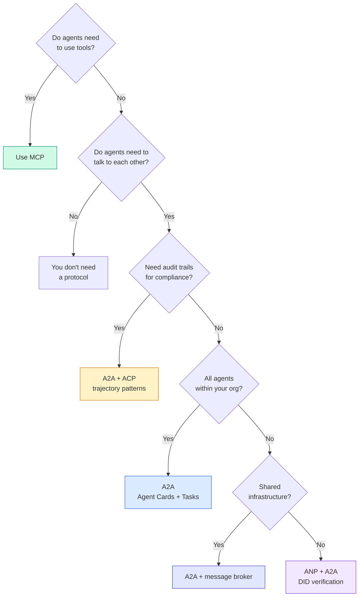

## Envia-o . Produto .

Esta lição produz:
- `code/main.ts`-- implementação completa dos quatro padrões de protocolo
  Tradução:`code/main.ts` Realização completa de todos os quatro protocolos
- `outputs/prompt-protocol-selector.md`- um prompt que ajuda a escolher protocolos para o seu sistema
  Tradução:`outputs/prompt-protocol-selector.md`  ajudá-lo para o sistema escolher acordo de sugestões

## Exercícios.

1. **Multi-hop task delegation.**Extender o `TaskManager`O pesquisador recebe uma tarefa, delega "requisita" e "resuma" subtarefas a dois agentes especializados, espera que ambos completem, e depois funde os resultados em seus próprios artefatos.
   Tradução:**多跳任务委派。**扩展 `TaskManager`, para que o Agente  processamento processo pode ser transferido para outros Agentes  comissionado tarefas ▌, o pesquisador recebe tarefas, vai "receber" e "resumir" sub-tarefas ▌, enviado para dois Agentes especialistas, esperar que os dois sejam concluídos, e então juntar resultados ▌

2. **Streaming audit trail.**Modificar o `AuditableRunner`Em vez de esperar o resultado completo, rendem `AuditEntry`As informações são atualizadas em tempo real à medida que as entradas de trajetória são adicionadas.
   Tradução:**流式审计跟踪。**修改 `AuditableRunner`Não é esperar o resultado completo, mas sim produzir o resultado real através da adição de um trajeto.`AuditEntry`更新── utilização de produzir auditores 

3. **DID rotation.**Adicionar rotação de chave para o `IdentityRegistry`Um agente deve poder publicar um novo documento DID com chaves atualizadas, mantendo um `previousDid`Os verificadores devem aceitar assinaturas da chave atual e anterior durante um período de graça.
   Tradução:**DID 轮换。**Para o`IdentityRegistry`添加密钥轮换──Agente 应能够发布带有更新密钥的新DID 文档,同时维护 `previousDid`引用── verificador deve aceitar a assinatura da chave atual e anterior em prazo de largura──

4. **Protocol negotiation.**Implementar o conceito de meta-protocolo da ANP.`protocolNegotiation`As mensagens com formatos candidatos (por exemplo, "Eu posso falar JSON-RPC" vs "Eu prefiro REST"). Após 3 rodadas, eles concordam em um formato ou tempo de espera. O formato acordado determina qual `TaskManager`ou `AuditableRunner`Eles usam.
   Tradução:**协议协商。**实现 ANP's元协议概念──两个代理 交换带有候选人格式 `protocolNegotiation`消息(如"我可以说 JSON-RPC"对比"我更喜欢 REST") ⋅ Mais de 3 轮后,它们就在格式达成一致或超时──

5. **Rate-limited discovery.**Adicionar um`RateLimitedRegistry`Um envelope que cache buscas de cartão de agente com um TTL configurável e limita as consultas de descoberta por agente por segundo. Simula um rebanho de 100 agentes que se descobrem no início e mede a diferença.
   Tradução:**限速发现。**- Adicione um .`RateLimitedRegistry`包装器, use configurable TTL 缓存  Agent card search,并限制每秒每 Agent's discovery query──模拟 100 Agentes 启动时互相发现惊群效应并测量差异──

## Termos-chave .

| Term | What people say | What it actually means |
|------|----------------|----------------------|
| MCP | "The protocol for AI tools" / "AI 工具协议" | A client-server protocol for agents to discover and use tools. Agent-to-tool, not agent-to-agent. / 用于 Agent 发现和使用工具的客户端-服务器协议。Agent 到工具，不是 Agent 到 Agent。 |
| A2A | "Google's agent protocol" / "Google 的 Agent 协议" | A peer-to-peer protocol for agent collaboration under the Linux Foundation. Discovery via Agent Cards, 9-state task lifecycle, streaming via SSE. Supports JSON-RPC, REST, and gRPC bindings. / Linux Foundation 下的 Agent 协作点对点协议。通过 Agent 卡片发现，9 状态任务生命周期，SSE 流。支持 JSON-RPC、REST 和 gRPC 绑定。 |
| ACP | "Enterprise agent messaging" / "企业 Agent 消息" | IBM/BeeAI's REST API for agent runs with TrajectoryMetadata: every response carries the full chain of reasoning and tool calls. Merging into A2A. / IBM/BeeAI 的 Agent 运行 REST API，带轨迹元数据：每个响应携带完整的推理链和工具调用。正在合并到 A2A。 |
| ANP | "Decentralized agent identity" / "去中心化 Agent 身份" | A community protocol using `did:wba` (DID) for cryptographic identity, HPKE for E2EE, and AI-powered meta-protocol negotiation for agents that have never seen each other. / 使用 `did:wba` (DID) 进行加密身份、HPKE 进行端到端加密、AI 驱动的元协议协商的社区协议。 |
| Agent Card / Agent 卡片 | "An agent's business card" / "Agent 的名片" | A JSON document at `/.well-known/agent-card.json` describing skills, supported MIME types, security schemes, and protocol bindings. / 描述技能、支持的 MIME 类型、安全方案和协议绑定的 JSON 文档。 |
| DID | "Decentralized ID" / "去中心化 ID" | W3C standard for cryptographically verifiable identities hosted on the agent's own domain. ANP uses `did:wba` method. / W3C 标准，用于托管在 Agent 自己域上的加密可验证身份。ANP 使用 `did:wba` 方法。 |
| TrajectoryMetadata / 轨迹元数据 | "The audit receipt" / "审计收据" | ACP's mechanism for attaching reasoning steps, tool calls, and their inputs/outputs to every agent response. / ACP 的机制，将推理步骤、工具调用及其输入/输出附加到每个 Agent 响应。 |
| Meta-protocol / 元协议 | "Agents negotiating how to talk" / "Agent 协商如何对话" | ANP's approach where agents use natural language to dynamically agree on data formats, then generate code to handle them. / ANP 的方法，Agent 使用自然语言动态就数据格式达成一致，然后生成代码处理。 |
| Task / 任务 | "A unit of work" / "工作单元" | A2A's stateful object tracking work from submission through completion. Immutable once terminal. / A2A 的有状态对象，跟踪从提交到完成的工作。一旦终态则不可变。 |

## Mais leitura 延伸阅读

- [Google A2A specification](https://github.com/google/A2A)-- especificações oficiais e SDKs (v1.0.0, Linux Foundation)
  Chinese: Google A2A 规范  官方规范和 SDK(v1.0.0, Linux Foundation)
- [IBM/BeeAI ACP specification](https://github.com/i-am-bee/acp)-- Especificações OpenAPI 3.1 para corridas de agentes e metadados de trajetória
  Tradução do inglês:IBM/BeeAI ACP 规范  Agente 运行和轨迹元数据的 OpenAPI 3.1 规范
- [Agent Network Protocol](https://github.com/agent-network-protocol/AgentNetworkProtocol)-- Identidade baseada em DID, E2EE, negociação de meta-protocol
  中文翻译:Agent Network Protocol  基于 DID的身份、端到端加密、元协议协商
- [Model Context Protocol docs](https://modelcontextprotocol.io/)-- Especificação do MCP da Anthropic (incluída na Fase 13)
  中文翻译:Model Context Protocol 文档  Antropic 的 MCP 规范(在Phase 13 中涵盖)
- [W3C Decentralized Identifiers](https://www.w3.org/TR/did-core/)-- a norma de identidade que sustenta a ANP
  Chinese: W3C 去中心化标识符  支 ANP 的身份标准
- [RFC 9180 (HPKE)](https://www.rfc-editor.org/rfc/rfc9180)-- o sistema de criptografia utilizado pela ANP para o E2EE
  Tradução do inglês:RFC 9180 (HPKE)  ANP Usado para end-to-end encryption of encryption schemes
- [FIPA Agent Communication Language](http://www.fipa.org/specs/fipa00061/SC00061G.html)- O precursor acadêmico dos protocolos de agentes modernos
  中文翻译:FIPA Agent 通信语言  现代 Agent 协议的学术前身
