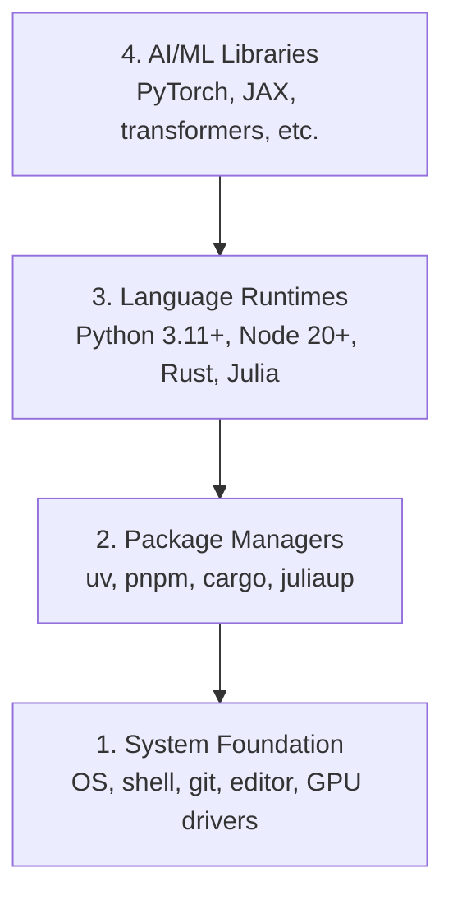

# Dev Çevreyi geliştirmek , inşa etmek

> Aletlerin düşüncelerini şekillendirir.

> **【中文解读】**Senin aletlerin düşüncelerini şekillendirdiğini bir kez daha düşünerek, bir kere daha iyi bir şekilde yapmayı başlattın. Bu bölüm tüm kursun başlangıcı noktasıdır. Tam bir AI inşanı geliştirme ortamı inşa edeceksin.

**Type:** Build | **类型:** 构建
**Languages:** Python, Node.js, Rust | **语言:** Python, Node.js, Rust
**Prerequisites:** None | **前置知识:** 无
**Time:** ~45 minutes | **时间:** ~45 分钟

## Öğrenme hedefleri

- Python 3.11+, Node.js 20+ ve Rust araç zincirlerini sıfırdan kur
  Çine çevirisi: From零搭建 Python 3.11+、Node.js 20+ 和 Rust 工具链
- Tekrarlanabilir yapılandırmalar için sanal ortamları ve paket yöneticilerini yapılandır
  Çinçe Çevirimiçi: yapılandırma, yapılandırma ve paket yöneticisi
- CUDA/MPS ile GPU erişimini doğrulayın ve test tenzor işlemini çalıştırın
  Çinçe Çevirimi:验证 GPU(CUDA/MPS) kullanılabilir mi,运行测试张量运算
- Dört katmanlı yığını anlayın: sistem, paketler, çalıştırma zamanları, AI kütüphaneleri
  Çinçe Çevirim: anlayış dört katlı teknik: sistem katlı, paket yönetimci katlı, dil çalışması zaman katlı, AI katlı

## Sorunları anlatın.

Python, TypeScript, Rust ve Julia'yı kullanarak 500+ ders boyunca AI mühendisliği öğrenmek üzeresiniz. Eğer çevrenizin bozulursa, her ders öğrenmek yerine araçlarla mücadeleye dönüşür.

> Siz 500'den fazla ders geçeceksiniz AI önerge geliştirme, Python 、TypeScript 、Rust 和 Julia ile ilgili. Eğer çevrenize sorun varsa, her dersiniz öğrenmek yerine bir araç olarak değişir.

Çoğu insan çevre ayarını atlıyor, sonra saatlerce import hatalarını, sürüm çatışmalarını ve kayıp CUDA sürücülerini düzeltmeye çalışıyor.

> Çoğu insan çevreyi atladı. Sonra birkaç saat harcadılar.

> **【中文解读】**
> 环境问题是你遇到"import error"",版本冲突"",找不到 CUDA"等报道错误的根本原因──与其每次上课都修环境,不如一次性搭好──

## Konsepten bir şey.

Yapay zeka mühendisliği ortamı dört katman içerir:

> AI  Mühendislik ortamı dört aşama sahiptir:



Her katman altındaki katmanlara bağlı.

> Biz alt üstü yüklüyoruz. Her katın alt katından kaynaklanıyor.

> **【中文解读】**
> AI  İnceleme ortamı dört katlı bir piramittir: en alt katı işletim sistemi ve sürücüdür, yukarıdaki paket yöneticisi, yukarıdaki dil çalışması sırasında, en üst katı PyTorch ‒ dönüştürücüler vb.

> **【拓展：为什么需要 uv 而不是 pip？】**
> Rust yazılmış Python paket yöneticisi, pipo 快 10-100 kat daha hızlı, aynı zamanda gerçek AI projelerinde, aynı zamanda birçok projenin bağımlılığını da koruyabilirsiniz. Örneğin PyTorch 2.1 ile bir diğerini 2.4 ile, ev çevresini ayırmayı çok basit hale getirebilir.
```figure
s0-env-stack
```

## Yapın.

> **【中文解读】**Aşağıdaki adımlar aşağıdaki "Düşünden Yukarı" sıralamasına göre dört katlı araçlar ── her adım doğrudan kopyalanabilir yapıştırma ── bitki yerine getirmek için Windows kullanıyorsanız, Linux için WSL2 (Windows Alt Sistem) kullanmanızı öneririz.

### Adım 1: Sistem Temelisi.

Sistemini kontrol et ve temel şeyleri yükle.

> Sisteminizi kontrol edin ve temel araçları yükleyin.

```bash
# macOS
xcode-select --install
brew install git curl wget

# Ubuntu/Debian
sudo apt update && sudo apt install -y build-essential git curl wget

# Windows (use WSL2)
wsl --install -d Ubuntu-24.04
```

### Adım 2: Python'u UV ile kullanın.

Kullanıyoruz .`uv` pip'ten 10-100 kat daha hızlı ve sanal ortamları otomatik olarak ele alır.

> Biz kullanıyoruz .`uv`Bu, pipten 10-100 kat daha hızlı ve otomatik olarak gerçek ortamı yönetir.

> **【拓展：Python 版本选择】**推 Python 3.12(stabilbil ve performans optimization)。3.11+ var, ama 3.13'i önlemek için `python install`Otomatik olarak indir ve yönet Python  versiyonu, artık pyenv için gerek yok.

```bash
curl -LsSf https://astral.sh/uv/install.sh | sh

uv python install 3.12

uv venv
source .venv/bin/activate  # or .venv\Scripts\activate on Windows

uv pip install numpy matplotlib jupyter
```

Kontrol edin:

> 验证安装:

```python
import sys
print(f"Python {sys.version}")

import numpy as np
print(f"NumPy {np.__version__}")
a = np.array([1, 2, 3])
print(f"Vector: {a}, dot product with itself: {np.dot(a, a)}")
```

### Adım 3: Node.js pnpm ile.

> **【中文解读】**Node.js TypeScript'in işletim ortamıdır. Bu ders Fase 13-17 (Tool Protocol, Agent 工程, vb) TypeScript'i kullanarak 编写, fnm Node 版本管理器,pnpm npm'den daha hızlı paket yöneticisi olarak kullanılır.

TypeScript dersleri için (ajanlar, MCP sunucular, web uygulamaları).

> TypeScript  dersleri için kullanılmıştır.

```bash
curl -fsSL https://fnm.vercel.app/install | bash
fnm install 22
fnm use 22

npm install -g pnpm

node -e "console.log('Node', process.version)"
```

**macOS / Apple Silicon (M1/M2/M3/M4):**Eğer yüklemeci `Error: Cannot install under Rosetta 2 in ARM default prefix (/opt/homebrew)`... terminaliniz Rosetta 2 altında çalışıyor .`arch`Parmak izi`i386`HomeBrew, yerel bir arm64 yapılandırması iken, fnm zorlayıcı arm64'i yükle, kabloya bağla, sonra yukarıdaki komutları tekrar çalıştır.`fnm install 22`- ...

> **苹果芯片 Mac 用户注意**Eğer bir cihazın olması gerekirse`Error: Cannot install under Rosetta 2 in ARM default prefix (/opt/homebrew)`, senin terminalini Rosetta 2'de çalıştırmayı açıkla.`arch`输出 `i386`), Homebrew ise original arm64  versiyonu.`fnm install 22`Başlayın tekrar koşmak için:

```bash
arch -arm64 brew install fnm
echo 'eval "$(fnm env --use-on-cd)"' >> ~/.zshrc
source ~/.zshrc
```

### Dördüncü adım: Rust.

Performans kritik dersleri için (sürekli, sistemler).

> Performans duyarlı dersler kullanmak için

> **【中文解读】**Rust, bu derste performans hassas olan kısımlara, örneğin optimizasyon düşüncesine (Fase 12) ve kendi kendine sistemine (Fase 15-17) göre kullanılır. Rust, resmi yükleme cihazıdır.

```bash
curl --proto '=https' --tlsv1.2 -sSf https://sh.rustup.rs | sh

rustc --version
cargo --version
```

### Adım 5: Julia (Önlü)

Julia'nın parladığı ağır matematik dersleri için.

> Julia'nın iyi bir matematik yoğunluğu dersleri kullanıyor.

```bash
curl -fsSL https://install.julialang.org | sh

julia -e 'println("Julia ", VERSION)'
```

### Adım 6: GPU ayarlama (Eğer varsa)

**NVIDIA (Linux / Windows):**

> **【中文解读】**NVIDIA 显卡先用 `nvidia-smi`确认驱动正常,再安装 CUDA 版 PyTorch;果芯片 Mac 没有 CUDA 属正常现象直接装默认版 PyTorch(内置 MPS/Metal 后端) 即可,不要传 `--index-url .../cuXXX`(O tekerlekler sadece Linux/Windows'u destekler, başarısız olacak)

```bash
nvidia-smi

# Install PyTorch with CUDA
uv pip install torch torchvision torchaudio --index-url https://download.pytorch.org/whl/cu124
```

**macOS / Apple Silicon (M1/M2/M3/M4):**Mac'de beklenen CUDA yok, başarısızlık yok.**not**Geçit .`--index-url .../cuXXX`(o tekerlekler sadece Linux/Windows'dur, bu yüzden kurulum başarısız olur).

> **macOS / 苹果芯片（M1/M2/M3/M4）**Bu bir beklenmedik davranış, bir sorun değil.`--index-url .../cuXXX`(O tekerlekler sadece Linux/Windows'a,传传传了安装会失败)

```bash
uv pip install torch torchvision torchaudio
```

Verify (herhangi bir platformda çalışır):

> 验证(任意平台通用):

```python
import torch
print(f"CUDA available: {torch.cuda.is_available()}")           # False on macOS — expected
print(f"MPS available:  {torch.backends.mps.is_available()}")   # True on Apple Silicon
if torch.cuda.is_available():
    print(f"GPU: {torch.cuda.get_device_name(0)}")
```

Bir GPU yok? Sorun yok. Çoğu ders CPU'da çalışır. Eğitim ağır dersler için Google Colab veya bulut GPU'ları kullanın.

> 没有GPU?没关系── çoğu ders CPU üzerinde çalışılabilir── eğitim miktarı büyük dersler Google Colab veya云端 GPU kullanılabilir──

> **【拓展：GPU vs CPU 性能对比】**訓練 GPT-2 küçük(117M 参数):CPU 约7 天,单块 RTX 3090 约3 小时,A100 约40 分钟──推理阶段差略小但仍然显著──本课程大部分课程可用CPU 跑,只有10期(从零训练LLM)等少数课程建议使用GPU──

> **【拓展：GPU 在 AI 中的作用】**
> GPU (grafik işlemci) Bu yüzden AI'de eksik değildir, çünkü binlerce basit hesaplama yapar.

### 7. Adım: Başlamak istediğin yolu doğrulay.

Bu dersdeki her komutu deposu kökü, dizini,
içerir`README.md`ve `phases/`Uçuş öncesi kontrol sadece ihtiyacınız olan şeyi .
Seçilen yolu başlatır. Öntanımlı olarak daha sonraki araçları atlar böylece yeni öğrenci
Bir duvar uyarı yerine açık bir cevap.

> Bu dersin tüm emirleri deponun altındaki kayıtlarda yer almaktadır.`README.md`和 `phases/`Önceki inceleme kitabı sadece seçtiğiniz yolu kontrol edin, gerçekten ihtiyacınız olan bir şeyi, öntanımlı olarak geçiş sonrası derslerin sadece kullanıldığı araçları kullanın yeni öğrencilerin tüm ekran uyarısı yerine net bir sonucu görmelerini sağlayın.

Tam başlangıç dizisini başlat:

> 启动完整的初学者序列:

```bash
python3 phases/00-setup-and-tooling/01-dev-environment/code/verify.py --route beginner
```

Ya da sadece istediğiniz yolu kontrol edin:

> Ya da sadece öğrenmek istediğin yolu kontrol et:

```bash
python3 phases/00-setup-and-tooling/01-dev-environment/code/verify.py --route ml-foundations
python3 phases/00-setup-and-tooling/01-dev-environment/code/verify.py --route llm-engineering
python3 phases/00-setup-and-tooling/01-dev-environment/code/verify.py --route agents
python3 phases/00-setup-and-tooling/01-dev-environment/code/verify.py --route mcp
python3 phases/00-setup-and-tooling/01-dev-environment/code/verify.py --route agent-skills
python3 phases/00-setup-and-tooling/01-dev-environment/code/verify.py --route certification
```

Ekle`--show-later`Aynı uçuş öncesi araçları kontrol etmek istediğinizde
Kayıp bir sonraki araç asla
Seçilen rota.

> Ön inceleme ve kontrol sonrası derslerin kullanılacağı seçilebilir araçlar ve bağımlılık zamanları, ek olarak.`--show-later`Yokluğun sonraki araçları seni şu anda seçtiğin yola asla engel olmayacak.

Her başarısız gerekli kontrol, tespit edilen yol veya ithalat hatası ve
Ajan yetenekleri ve sertifika yolları da gösterir
Python scriptinin bir AI host'ın sahip olduğunu kanıtlayamadığı için manuel host kontrolleri
Bir beceri keşfetmişsin ya da seçtiğin beceri alanının yazılabilir olduğunu.

> Başarısız olan her gerekli kontrol programı, kontrol edilen yol veya import  hata, yanı sıra kesin bir düzeltme emri ile birlikte yapılır. Ajan becerileri ve sertifikaları) Yol ayrıca yapay yöneticiler tarafından kontrol programlarını gösterir. Python'un yazısı, AI'nin ev sahibi bir beceri bulduğunu kanıtlayamadığı için, seçtiğiniz beceriyi de kanıtlayamaz.

İlk uçuş öncesi uçuş geçince, tam olarak ilk ders yazdırır:

> Başlangıç sınavı geçince, yazı kesin olarak ilk uygulanabilir dersler yazdırırır:

```text
Ready to start Beginner course.
Next: python3 phases/01-math-foundations/01-linear-algebra-intuition/code/vectors.py
```

> **【中文解读】**预检脚本是"按路线最小环境"哲学落地:初学者只需要Python和Git,ml-foundations 再加 NumPy,agents/mcp 路线连 Node 都可以先不装用到再装──Windows 用户把命令里 `python3`换成 `python`- Evet.

## Kullanın. Kullanın.

> **【中文解读】**Aşağıdaki tablo size her dilin hangi aşamada kullanıldığını anlatır. Python mutlak bir güçtür.

Çevre kontrol ettiğiniz rota başlatmak için hazır.
Bir dersin ilk dersini tamamen engellemek yerine, onlardan istediklerinde
İşte tüm programda kullanacağınız:

> Çevresiniz zaten kontrol ettiğiniz bir yolla başlayabilir. Dersin kullanıldığı zamana kadar, tüm teknolojinin size engel olmasına izin vermeyin.

| Language | Used In | Package Manager |
|----------|---------|-----------------|
| Python | Phases 1-12 (ML, DL, NLP, Vision, Audio, LLMs) | uv |
| TypeScript | Phases 13-17 (Tools, Agents, Swarms, Infra) | pnpm |
| Rust | Phases 12, 15-17 (Performance-critical systems) | cargo |
| Julia | Phase 1 (Math foundations) | Pkg |

| 语言 | 用在哪些阶段 | 包管理器 |
|------|------------|---------|
| Python | 阶段 1-12（ML、DL、NLP、视觉、音频、LLM） | uv |
| TypeScript | 阶段 13-17（工具、Agent、集群、基础设施） | pnpm |
| Rust | 阶段 12, 15-17（高性能系统） | cargo |
| Julia | 阶段 1（数学基础） | Pkg |

## İndirin . Ürünler .

> **【拓展：环境检查 Prompt】** `outputs/prompt-env-check.md`Bu, doğrudan AI'ye yardımcı olabilecek bir istek, çevre sorunlarını teşhis etmenize yardımcı olmamaktadır.

Bu ders, herkesin ayarlarını kontrol etmek için çalıştırabileceği bir doğrulama senaryosunu üretir.

> Bu ders, herkesin kendi çevre düzenini kontrol etmek için kullanabileceği bir test kitabı oluşturdu.

Bakın .`outputs/prompt-env-check.md`Yapay zeka asistanlarının çevre sorunlarını teşhis etmesine yardımcı olan bir istek için.

> 参见 `outputs/prompt-env-check.md`Bu, bir AI assistant diagnostik çevre sorunları sorgulaması içerir.

## Egzersizler.

1. Doğrulama senaryosunu çalıştır ve herhangi bir hataları düzelt
   运行验证脚本并修复所有失败的检查项
2. Bu ders için Python sanal ortamı oluşturun ve PyTorch yükleyin
   Bu derste Python oluşturmak 虚拟环境并安装 PyTorch
3. Dört dilde "hello world" yaz ve her birini çalıştır
   Dört dilde bir "Merhaba dünya" yazıp çalışıyorum.
