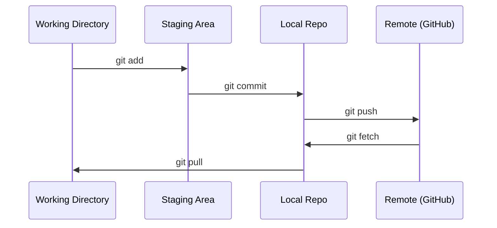

# Git & Collaboration Git & Collaboration

> Her deney, model, ders burada izlenir.
> Versiyon kontrolü seçilemez. Her deneyin, her modelin, her dersin sonuçları takip edilir.

**Type:** Learn | **类型:** 学习
**Languages:** -- | **语言:** 无
**Prerequisites:** Phase 0, Lesson 01 | **前置知识:** Phase 0, 第 01 课
**Time:** ~30 minutes | **时间:** ~30 分钟

## Öğrenme hedefleri

- Git kimliğini yapılandırın ve günlük ekleme, commit ve push iş akışını kullanın
  中文翻译:配置 Git 身份信息,掌握添加、承诺、推的日常工作流
- Ana parçaları kırmadan ayrı deneyler için dallar oluşturun ve birleştirin
  Çinçe çevirisi: yaratmak ve ortak olmak, başlıca bölgeyi bozmadan ayrılık deneyimi gerçekleştirmek
- Bir yazın .`.gitignore`Bu, model kontrol noktalarını ve büyük ikili dosyaları hariç.
  Çeviri: Çeviri: Çeviri: Çeviri: Çeviri: Çeviri: Çeviri: Çeviri: Çeviri: Çeviri: Çeviri: Çeviri: Çeviri: Çeviri: Çeviri: Çeviri: Çeviri: Çeviri: Çeviri: Çeviri: Çeviri: Çeviri: Çeviri: Çeviri: Çeviri: Çeviri: Çeviri: Çeviri: Çeviri: Çeviri: Çeviri: Çeviri: Çeviri: Çeviri: Çeviri: Çeviri: Çeviri: Çeviri: Çeviri: Çeviri: Çeviri: Çeviri: Çeviri: Çeviri: Çeviri: Çeviri: Çeviri: Çeviri: Çeviri: Çeviri: Çeviri: Çeviri: Çeviri: Çeviri: Çeviri: Çeviri: Çeviri: Çeviri: Çeviri: Çeviri`.gitignore`文件,排除模型检查点和大文件
- Bağlantı geçmişini  ile gezin`git log`proje gelişimini anlamak için
  Çeviri: Çeviri: Çeviri: Çeviri: Çeviri: Çeviri: Çeviri: Çeviri: Çeviri: Çeviri: Çeviri: Çeviri: Çeviri: Çeviri: Çeviri: Çeviri: Çeviri: Çeviri: Çeviri: Çeviri: Çeviri: Çeviri: Çeviri: Çeviri: Çeviri: Çeviri: Çeviri: Çeviri: Çeviri: Çeviri: Çeviri: Çeviri: Çeviri: Çeviri: Çeviri: Çeviri: Çeviri: Çeviri: Çeviri: Çeviri: Çeviri: Çeviri: Çeviri: Çeviri: Çeviri: Çeviri: Çeviri: Çeviri: Çeviri: Çeviri: Çeviri: Çeviri: Çeviri: Çeviri: Çeviri: Çeviri: Çeviri: Çeviri: Çeviri: Çeviri: Çeviri: Çeviri: Çeviri: Çeviri: Çeviri: Çeviri`git log`浏览提交历史,了解项目演进过程

> **【中文解读】**
> Git, kodun her bir modifikasyonunu takip etmek için kullanılan bir sürüm kontrol aracıdır. AI projelerinde, deneyde model parametrelerini ve kodunu sık sık değiştirir ve Git'i daha önce herhangi bir durumuna geri dönebilmeni sağlar.

> **【拓展：Git 在 AI 工程中的角色】**AI 工程 ve geleneksel yazılım geliştirme farklılıkları  her deney  超参数调整、数据集变更) hepsi bir" sürüm"── Git  追踪 deney ile anlamı: eğitim sonuçları değişmiştir, yapabilirsiniz `git diff`Bir sorun çıkarmak için bir değişiklik yapalım.`git revert`回滚──大模型团队 (Hugs Face gibi)                                                                                                                                                                                                                                                         

## Sorunları anlatın.

20 aşamada yüzlerce kod dosyası yazmak üzeresin. Sürüm kontrolü olmadan iş kaybedeceksin, geri alamayacağın şeyleri çözeceksin ve başkalarıyla işbirliği yapmanın hiçbir yolu olmayacak.

> 20 aşamada yüzlerce kod dosyası yazacaksın. Sürüm kontrolü olmadan, iş verisini kaybedeceksin. Geri alamayacağın şeyleri yok edeceksin.

Git, bu araç. GitHub, kodun yaşadığı yerdir. Bu ders, bu kurs için ihtiyacınız olanları kapsar ve daha fazlasını içermez.

> Git bir araç, GitHub bir kod yönetimi yeri. Bu ders sadece derslerin ihtiyaçlarını anlatır.

> **【中文解读】**
> Yüzlerce kod dosyası yazacaksın, sürüm kontrolü yok = 随时可能失去工作成果、无法回归、无法协作── Git 解决的就是这个问题──

## Konsepten bir şey.



Hatırlamak için üç şey:
1. Sık sık saklayın (`git commit`)
2. Uzak kontrol (`git push`)
3. Deneyimler için bölge (`git checkout -b experiment`)

> Üç şeyi hatırlamalısın:
> 1. 经常保存(`git commit`)
> 2. 推送到远程(`git push`)
> 3. Uç分支做实验(`git checkout -b experiment`)

> **【中文解读】**
> Git'in çekirdek süreci:工作目录 → 暂存区(git add)→ 本地仓库(git commit)→ 远程仓库(git push)。记住三件事:经常提交、推送到远程、用分支做实验。

> **【拓展：分支策略与 AI 实验】**AI  projesi                                                                                                                                                                                                                                                                                                                                                                                                                                                                                                                          `experiment/lr-0.001`- Evet.`experiment/add-dropout`等── böylece her deneyin kod değişimi ayrıştırılır, deney başarısız olur, doğrudan ayrıntıları siler, başarılı olur. Büyük AI projeleri Git etiketlerini kullanır 标记模型版本(如`v1.0-baseline`), 方便部署时精确指定代码版本──

## Yapın.
```figure
s0-commit-dag
```

## Yapın

### Adım 1: Git'i yapılandır

> 第1 adım: Git yapılandırma

```bash
git config --global user.name "Your Name"
git config --global user.email "you@example.com"
```

### Adım 2: Günlük iş akışı

```bash
git status                              # 查看哪些文件有改动
git add file.py                         # 把改动加入暂存区
git commit -m "Add perceptron implementation"  # 提交到本地仓库
git push origin main                    # 推送到 GitHub 远程仓库
```

### Adım 3: Deneyimler için dalga geçmek.

```bash
git checkout -b experiment/new-optimizer  # 创建并切换到新分支

# ... make changes, commit ...  # 在新分支上修改和提交，不影响主分支

git checkout main                         # 切回主分支
git merge experiment/new-optimizer        # 把实验分支的改动合并到主分支
```

### Dördüncü adım: Bu ders depoyu kullanmak.

> **【拓展：Fork vs Clone】**Eğer kendi öğrenme gelişimini korumak istiyorsan ve orijinal depoyu etkilememişsen, kullan.`fork`GitHub'da kullanılır. Bu yüzden, github'da kullanılır.

Bu yüzden, GitHub'da yazma girişini yapın.`origin`Kendi kopyasında belirtiler:

```bash
git clone https://github.com/YOUR-USERNAME/ai-engineering-from-scratch.git
cd ai-engineering-from-scratch

git checkout -b my-progress
# work through lessons, commit your code
git push origin my-progress
```

## Kullanın. Kullanın.

> **【拓展：.gitignore 在 AI 项目中至关重要】**AI  projeleri büyük miktarda oluşturur.`.pt`- Evet.`.safetensors`Koca 10 GB) ✓ training日志、数据集缓存(`__pycache__`- Evet.`.venv`İyi bir tane.`.gitignore`能防止意外に10GB'li model dosyalarını GitHub'a göndermek.`gitignore.io`生成 Python/ML 项目的模板──

Bu kurs için şu emirlere ihtiyacınız var:

> Bu ders içinde sadece bu emirlere ihtiyacın var:

| Command | When |
|---------|------|
| `git clone` | Get the course repo |
| `git add` + `git commit` | Save your work |
| `git push` | Back it up to GitHub |
| `git checkout -b` | Try something without breaking main |
| `git log --oneline` | See what you've done |

| 命令 | 什么时候用 |
|------|-----------|
| `git clone` | 下载课程仓库 |
| `git add` + `git commit` | 保存你的工作 |
| `git push` | 备份到 GitHub |
| `git checkout -b` | 安全地尝试新想法 |
| `git log --oneline` | 查看你做了什么 |

Bu ders için rebase, cherry-pick veya submodules gerekmiyor.

> Bu derslere temel oluşturma, çerez seçme veya alt modüller gerekmez.

## Egzersizler.

1. Bu repo'yu klonlayın, `my-progress`Dosya yap, bindir, it
   克隆仓库,创建 `my-progress`分支,新建文件,提交并推送
1. Bu repoyu kırp, çatalını klonla, `my-progress`Dosya yap, bindir, it
2. Bir `.gitignore`Bu, kontrol nokta dosyalarının modelini kapsar (`.pt`- Evet .`.pth`- Evet .`.safetensors`)
   创建 `.gitignore`文件,排除模型检查点文件
3. Bu repo ' nun commit tarihiyle ilgili bir bakış .`git log --oneline`Ve derslerin nasıl eklendiğini okuyun.
   Kullan .`git log --oneline`Tarih yazma, derslerin nasıl adım adım yapıldığını öğrenmek için

## Anahtar Terimler

> **【中文解读】**Commit (Commit) = 项目快照,Branch (Branch) = 独立开发线,Merge (Merge) = 分支改动合回来,Remote (Remote) = GitHub'ın deposu副本 (副本) ⋅ bu dört kavramı ele geçirmek için %90'ı AI (İşte Biçim) proje işbirliği sahnesi ile karşılaşabilirsiniz.

| Term | What people say | What it actually means |
|------|----------------|----------------------|
| Commit | "Saving" | A snapshot of your entire project at a point in time |
| Branch | "A copy" | A pointer to a commit that moves forward as you work |
| Merge | "Combining code" | Taking changes from one branch and applying them to another |
| Remote | "The cloud" | A copy of your repo hosted somewhere else (GitHub, GitLab) |

| 术语 | 俗称 | 实际含义 |
|------|------|---------|
| Commit | "保存" | 项目在某一时刻的完整快照 |
| Branch | "副本" | 指向某个提交的可移动指针，随工作向前推进 |
| Merge | "合并代码" | 将一个分支的改动应用到另一个分支 |
| Remote | "云端" | 托管在其他地方的仓库副本（如 GitHub、GitLab） |
