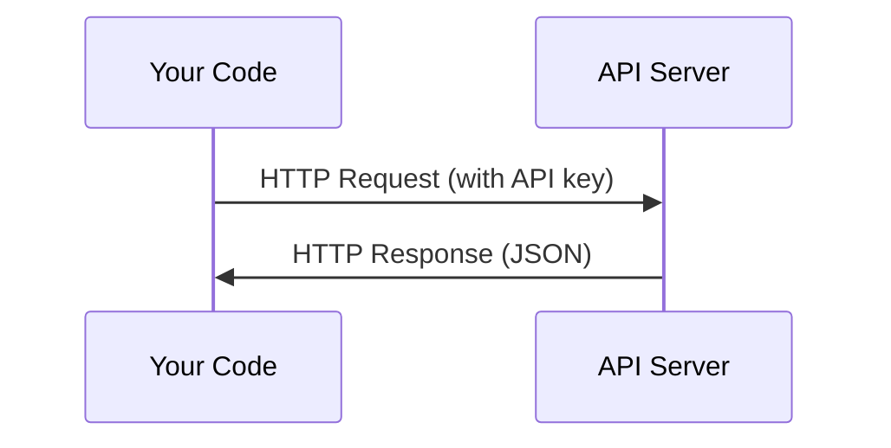

# API & Keys . API ve anahtar yönetimi .

> Her AI API aynı şekilde çalışır: bir istek gönderin, bir cevap alın. Detaylar değişir, desen değişmez.
> Tüm AI API'lerinin çalışma biçimi aynı: Gönderme istekleri, cevap almak.

**Type:** Build | **类型:** 构建
**Languages:** Python, TypeScript | **语言:** Python, TypeScript
**Prerequisites:** Phase 0, Lesson 01 | **前置知识:** Phase 0, 第 01 课
**Time:** ~30 minutes | **时间:** ~30 分钟

## Öğrenme hedefleri

- API anahtarlarını çevre değişkenlerini kullanarak güvenli bir şekilde saklayın ve `.env`dosyalar
  Çinçe Çevirisi:                                                                                                                                                                                                                                                                                                                                                                                                                                                                                                                       `.env`文件安全存储 API 密钥
- Hem Anthropic Python SDK hem de ham HTTP kullanarak LLM API çağrısı yapın
  Çinçe Çevirimi: Antropik Python SDK ve orijinal HTTP 两种方式调用 LLM API
- Çözümleme için SDK tabanlı ve ham HTTP sorgu / yanıt biçimlerini karşılaştır
  Çinçe çevirisi:对比 SDK 和原始 HTTP 的请求/响应格式, afin调试
- Doğrulama ve oran sınırları dahil olmak üzere yaygın API hatalarını tanımlamak ve ele almak
  Çinçe çevirisi: 识别并处理常见 API 错误,包括认证和限流问题

> **【中文解读】**
> Tüm AI API'lerinin çalışma biçimi aynıdır: İletişim istekleri, cevaplar elde etmek. Bu bölüm size API anahtarlarını nasıl güvenli bir şekilde yönetileceğini öğretir. LLM API'si nasıl kullanılacağını, SDK'nin kullanım ve orijinal HTTP isteklerinin farkını anlamalarını öğretir. Bu, AI Ajanının temelini oluşturur.

## Sorunları anlatın.

11. aşamaldan başlayarak LLM API'lerini (Anthropic, OpenAI, Google) arayacaksınız. 13-16 aşamalda bu API'leri döngülerde kullanan ajanlar inşa edeceksiniz. API anahtarlarının nasıl çalıştığını, onları nasıl güvenli bir şekilde saklayacağını ve ilk API çağrınızı nasıl yapacağını bilmeniz gerekir.

> Sınıf 11'den başlayarak, LLM API'si (Anthropic、OpenAI、Google) kullanmak üzere çalışacaksınız. 13-16'da, bu API'lerin ajanlarını kullanmak için bir döngü oluşturmalısınız.

> **【中文解读】**
> Sınıf 11'den başlayarak, LLM API'si kullanmak üzere çalışacaksınız; Sınıf 13-16'da, API'nin bir düzenli düzenleme aracı oluşturmak için çalışacaksınız.

## Konsepten bir şey.



Her API çağrısı:
1. Bir son nokta (URL)
2. API anahtarı (titsinatif)
3. Bir talep kurumu (ne istediğinizi)
4. Bir yanıt vücudu (neyi geri alırsınız)

> Her API 调用 dört unsur içerir:
> 1. 端点(URL)
> 2. API 密钥(身份认证)
> 3. Lütfen ne istiyorsun?
> 4. 响应体(返回什么)

> **【中文解读】**
> Her API 调用包含四要素:端点 URL、API 密钥(身份认证) 请求体(你想要什么) 响应体(返回什么)  Bu modeli anlamak için, tüm AI API'leri aynıdır。

> **【拓展：API 在 AI Agent 中的角色】**
> AI Ajanının çekirdek döngüsü ise: yapılandırma önerisi → LLM API'si kullanmak → 解析响应 → 执行动作 → 再次调用 API──掌握API 调用是构建代理的第一步──
```figure
s0-secret-inject
```

## Yapın

## Yapın.

> **【拓展：API 密钥安全的铁律】**绝不把API key 硬编码在代码里. GitHub'a gittikten sonra, crawler birkaç saniye içinde anahtarınızı kullanmadığını fark eder.`.env`文件 + `python-dotenv`Ya da işletim sistemi çevre değişimi.

### Adım 1: API anahtarlarını güvenli bir şekilde saklayın .

Kodu asla API anahtarlarına sokmayın.

> 永远不要把API 密钥写在代码里.

```bash
export ANTHROPIC_API_KEY="sk-ant-..."  # 设置环境变量（密钥永远不要写在代码里！）
export OPENAI_API_KEY="sk-..."
```

Ya da bir `.env`dosya (ekle `.gitignore`):

> Ya da kullan `.env`文件( hatırlıyorum `.gitignore`):

```
ANTHROPIC_API_KEY=sk-ant-...  # .env 文件（确保加入 .gitignore）
OPENAI_API_KEY=sk-...
```

### Adım 2: İlk API çağrısı (Python)

```python
import os

import anthropic

client = anthropic.Anthropic()  # 自动从环境变量读取密钥

MODEL = os.environ.get("LLM_MODEL", "claude-sonnet-5")

response = client.messages.create(
    model="claude-sonnet-4-20250514",  # 指定模型
    max_tokens=256,  # 最大输出长度
    messages=[{"role": "user", "content": "What is a neural network in one sentence?"}]  # 用户消息
    model=MODEL,
    max_tokens=256,
    messages=[{"role": "user", "content": "What is a neural network in one sentence?"}]
)

print(response.content[0].text)  # 打印模型回复
```

### Adım 3: İlk API çağrısı (TypeScript)

> **【拓展：Token 计费机制】**LLM API 按token计费:Claude Sonnet 约 $3/百万输入 token、$15/million输出 token──1 İngilizce单词约1.3 个标记,中文字约2-3 个标记──`max_tokens=256`Yani model en fazla 256 token çıkartmak için kullanılır.`max_tokens`Bu, maliyetleri tasarruf etmenin önemli bir yolu.
`LLM_MODEL`Diğer sağlayıcılar (OpenAI, Google ve diğerleri) bir anahtarın ve bir model kimliğinin aynı örneğini izler, ancak her birinin kendi SDK, son noktası ve talep / yanıt şeması vardır.

### Adım 3: İlk API çağrısı (TypeScript)

```typescript
import Anthropic from "@anthropic-ai/sdk";

const client = new Anthropic();

const MODEL = process.env.LLM_MODEL ?? "claude-sonnet-5";

const response = await client.messages.create({
  model: MODEL,
  max_tokens: 256,
  messages: [{ role: "user", content: "What is a neural network in one sentence?" }],
});

console.log(response.content[0].text);
```

### Adım 4: Çekirdek HTTP (SDK yok)

```python
import os
import urllib.request
import json

url = "https://api.anthropic.com/v1/messages"  # API 端点
headers = {
    "Content-Type": "application/json",  # 请求格式为 JSON
    "x-api-key": os.environ["ANTHROPIC_API_KEY"],  # 从环境变量读取密钥
    "anthropic-version": "2023-06-01",  # API 版本号
}
body = json.dumps({
    "model": "claude-sonnet-4-20250514",  # 模型名称
    "max_tokens": 256,  # 最大输出 token 数
    "model": os.environ.get("LLM_MODEL", "claude-sonnet-5"),
    "max_tokens": 256,
    "messages": [{"role": "user", "content": "What is a neural network in one sentence?"}],
}).encode()

req = urllib.request.Request(url, data=body, headers=headers, method="POST")  # 构造 POST 请求
with urllib.request.urlopen(req) as resp:
    result = json.loads(resp.read())  # 解析 JSON 响应
    print(result["content"][0]["text"])  # 提取并打印回复文本
```

Bu SDK'lerin kapuk altında yaptıkları şey. Çöm HTTP çağrısını anlamak debugging yaparken yardımcı olur.

> Bu SDK'nin alt katındaki bir şey.

> **【中文解读】**
> SDK  sadece HTTP isteklerinin kapsamını oluşturur. Asıl HTTP 调用ı anlamak API 问题、处理错误、 hatta SDK desteklemeyen dillerde API调用 yardımcı olabilir.

## Kullanın. Kullanın.

> **【中文解读】**Şimdi tüm API'yi kayıt altına almak için gerekli değil. 4-10 aşama, 11-16 aşama, Antropik veya OpenAI'yi kullanmak için gerekli.

Bu ders için:

> Bu ders:

| API | When you need it | Free tier |
|-----|-----------------|-----------|
| Anthropic (Claude) | Phases 11-16 (agents, tools) | $5 credit on signup |
| OpenAI | Phase 11 (comparison) | $5 credit on signup |
| Hugging Face | Phases 4-10 (models, datasets) | Free |

| API | 何时需要 | 免费额度 |
|-----|---------|---------|
| Anthropic (Claude) | 阶段 11-16（Agent、工具） | 注册送 $5 额度 |
| OpenAI | 阶段 11（对比实验） | 注册送 $5 额度 |
| Hugging Face | 阶段 4-10（模型、数据集） | 免费 |

Hepsine şimdi ihtiyacın yok, dersin gerekince ayarla.

> Şimdi tüm API'leri kayıt altına almanız gerekmiyor.

## İndirin . Ürünler .

> **【拓展：429 限流处理】**调用 LLM API 时最常见的错误是 429 Rate Limit──处理方式:指数退避重试(等 1s → 2s → 4s → 8s)──Antropic SDK 内置自动重试,但理解原理很重要在实际代理系统中,你可能需要自己实现限流逻辑来控制成本和避免被封闭──

Bu ders şunları ortaya çıkarır:
- `outputs/prompt-api-troubleshooter.md`- yaygın API hatalarını teşhis etmek

> 本课产 出:
> - `outputs/prompt-api-troubleshooter.md`- 诊断常见 API 错误的提示

## Egzersizler.

1. Bir Anthropic API anahtarı al ve ilk API çağrını yap
   Get Anthropic API 密钥,完成你的第一次API 调用
2. Çöm HTTP sürümünü deneyin ve yanıt biçimini SDK sürümüne karşılaştırın
   尝试原始 HTTP 方式调用, karşı karşı SDK 方式的响应格式
3. Kasten yanlış bir API anahtarı kullanın ve hata mesajını okuyun
   Yanlış API anahtarı kullanmak için yanlış bilgi okumak

## Anahtar Terimler

| Term | What people say | What it actually means |
|------|----------------|----------------------|
| API key | "Password for the API" | A unique string that identifies your account and authorizes requests |
| Rate limit | "They're throttling me" | Maximum requests per minute/hour to prevent abuse and ensure fair usage |
| Token | "A word" (in API context) | A billing unit: input and output tokens are counted and charged separately |
| Streaming | "Real-time responses" | Getting the response word by word instead of waiting for the full response |

| 术语 | 俗称 | 实际含义 |
|------|------|---------|
| API key | "API 密码" | 标识你账户并授权请求的唯一字符串 |
| Rate limit | "被限流了" | 每分钟/小时的请求上限，防止滥用 |
| Token | "词"（API 语境） | 计费单位：输入和输出 token 分别计费 |
| Streaming | "实时响应" | 逐词返回响应，而非等待完整响应 |
