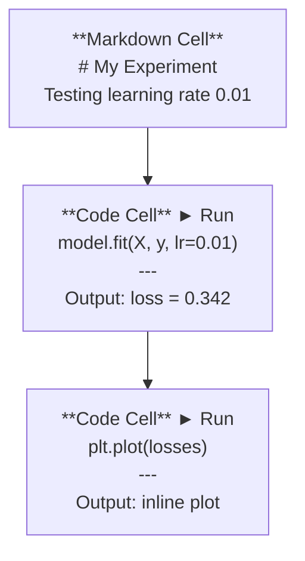
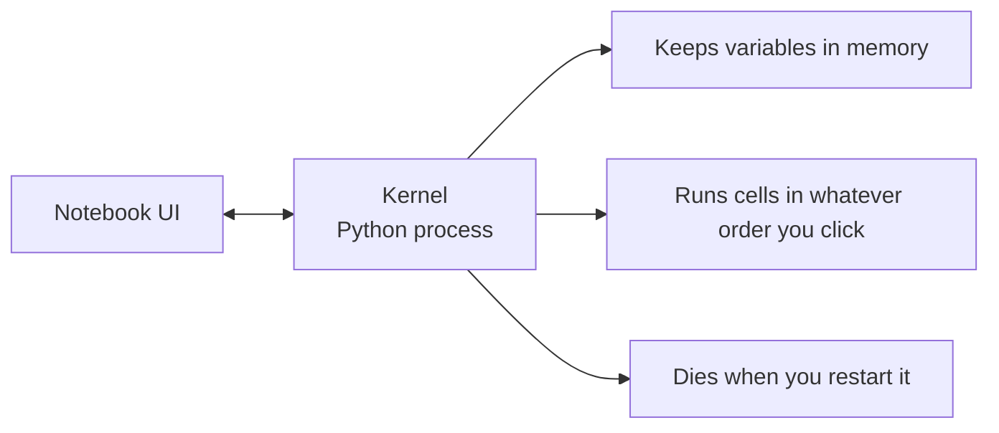

# Jupyter Notlar  Jupyter Notlar

> Bilgisayarlar, Yapay zeka mühendisliği laboratuvarı.
> Bu, AI'nin deney çalışma tabanıdır. Burada bir örnek test yaparsın ve sonra etkin bir kısmını üretime koyarsın.

**Type:** Build | **类型:** 构建
**Languages:** Python | **语言:** Python
**Prerequisites:** Phase 0, Lesson 01 | **前置知识:** Phase 0, 第 01 课
**Time:** ~30 minutes | **时间:** ~30 分钟

## Öğrenme hedefleri

- JupyterLab, Jupyter Notebook veya VS Code'u Jupyter uzantısı ile yükle ve başlat
  中文翻译:安装并启动 JupyterLab、Jupyter Notebook 或带 Jupyter 扩展的 VS Code
- Sihirli komutları kullan (`%timeit`- Evet .`%%time`- Evet .`%matplotlib inline`) referans değerlendirmek ve iç çizgiyi görüntülemek için
  Çeviri: Çeviri: Çeviri: Çeviri: Çeviri: Çeviri: Çeviri: Çeviri: Çeviri: Çeviri: Çeviri: Çeviri: Çeviri: Çeviri: Çeviri: Çeviri: Çeviri: Çeviri: Çeviri: Çeviri: Çeviri: Çeviri: Çeviri: Çeviri: Çeviri: Çeviri: Çeviri: Çeviri: Çeviri: Çeviri: Çeviri: Çeviri: Çeviri: Çeviri: Çeviri: Çeviri: Çeviri: Çeviri: Çeviri: Çeviri: Çeviri: Çeviri: Çeviri: Çeviri: Çeviri: Çeviri: Çeviri: Çeviri: Çeviri: Çeviri: Çeviri: Çeviri: Çeviri: Çeviri: Çeviri: Çeviri: Çeviri: Çeviri`%timeit`- Evet.`%%time`- Evet.`%matplotlib inline`) temel testi ve içe yerleştirme yapılması
- Not defterleri ile senaryoları ne zaman kullanılacağını ayırt edin ve "not defterlerinde keşfet, senaryolarda gönder" iş akışını uygulayın
  Çin Çeviri: 区分何时用笔记本何时用脚本,践行"笔记本中探索、脚本中部署" çalışma akışı
- Genel notebook tuzağını tanımlamak ve önlemek: düzen dışı çalıştırma, gizli durum ve hafıza sızıntıları
  Çinçe Çevirimi:识别并避免笔记本常见陷:乱序执行、隐藏状态和内存泄漏

> **【中文解读】**
> Jupyter Notebook, AI mühendislerinin "laboratorium çalışma stasyonu"ndir. İçinde aşama aşama çalıştırılabilir kod, anında sonuçları görebilir, karıştırılmış yazılı açıklamalar ve çizelgeleri görebilirsiniz.`.py`脚本中部署。

## Sorunları anlatın.

Her AI makalesi, öğretim kitabı ve Kaggle yarışması Jupyter not defterlerini kullanır. Bu makaleler kodları parça parça çalıştırmanıza, çıkışları çizgi içinde görmenize, kodları açıklamalarla karıştırmanıza ve hızlı tekrarlamanıza izin verir. Not defterleri olmadan AI'yi öğrenmeye çalışıyorsanız, çizim kağıdı olmadan matematik ödevlerini yapıyorsunuz.

> 几乎所有 AI 论文、教程和 Kaggle 比赛都使用Jupyter Notebook──它让你分段运行代码、内嵌查看输出、混合代码和文字说明、快速代──如果没有笔记本学 AI,就像没有草稿纸做数学作业──

Ama not defterlerinde gerçek tuzaqlar var. İnsanlar onları her şey için kullanırlar, hatta kötü oldukları şeyler de dahil. not defterini ne zaman kullanıldığını ve senaryoyu ne zaman kullanıldığını bilmek, daha sonra kabusları düzeltmekten sizi kurtaracaktır.

> Ancak notların da gerçek bir tuzağı vardır. İnsanlar bunu her şeyi yapmak için kullanırlar. Üstelik iyi olmayan şeyleri de kullanırlar.

> **【中文解读】**
> Notbuk, AI alanındaki standart araçtır, neredeyse tüm makale ve tartışmalarda kullanılır. Ancak bunun da bir tuzağı vardır: Çelişki, Çalışma, Gizli Durum, Kayıt Sıkıntıları.

## Konsepten bir şey.

Not defteri hücrelerin bir listesidir. Her hücre ya kod ya da metindir.

> Notlar bir dizi "单元格"den oluşur, her birim bir kod veya metin olarak oluşturulur.



Kerneli bir Python süreci olarak kullanılır. Bir hücre çalıştırdığınızda, kodu çekirdeğe gönderir, o da onu işletiyor ve sonucu gönderir. Tüm hücreler aynı çekirdeği paylaşır, bu yüzden hücreler arasında değişkenler kalır.

> Kernel, bir sonraki aşamada çalışan Python  sürecidir. Bir birimden birimden birimden birimden birimden birimden birimden birimden birimden birimden birimden birimden birimden birimden birimden birimden birimden birimden birimden birimden birimden birimden birimden birimden birimden birimden birimden birimden birimden birimden birimden birimden birimden birimden birimden birimden birimden birimden birimden birimden birimden birimden birimden birimden birimden birimden birimden birimden birimden birimden birimden birimden birimden birimden birimden birimden birimden birimden birimden birimden birimden birimden birimden birimden birimden birimden birimden birimden birimden birimden birimden birimden birimden birimden birimden birimden birimden birimden birimden birimdenimdenimdenimdir.



"Neyi sipariş edersen yap" kısmı hem süper güç hem de tabanca.

> "Bunun her türlü şekilde gerçekleştirilmesini sağlayın" bu kısmı hem super yetenek hem de büyük bir çukur.
```figure
s0-cell-order
```

## Yapın

> **【中文解读】**
> Notbuk, çok sayıda "单元格" tarafından oluşturulur, her bir birim bir kod veya bir işaretleme yapabilir. Tüm birimler aynı çekirdeğe paylaşılır.

## Yapın.

> **【拓展：Jupyter 在 AI 行业中的地位】**几乎所有 AI 论文附带的可复现代码都是Jupyter Notebook 格式──Kaggle 比赛方案、Hugging Face示例、PyTorch教程都使用它──Google Colab 本质上就是云端的Jupyter,预装了PyTorch/TensorFlow,并免费提供GPU──本课程中有大量的`.ipynb`練習──

### Adım 1: Aracınızı seçin.

Üç seçenek, tek format:

> Üç çeşit interfaç seçimi, aynı dosya biçimi:

| Interface | Install | Best for |
|-----------|---------|----------|
| JupyterLab | `pip install jupyterlab` then `jupyter lab` | Full IDE experience, multiple tabs, file browser, terminal |
| Jupyter Notebook | `pip install notebook` then `jupyter notebook` | Simple, lightweight, one notebook at a time |
| VS Code | Install "Jupyter" extension | Already in your editor, git integration, debugging |

| 界面 | 安装方式 | 最适合 |
|------|---------|--------|
| JupyterLab | `pip install jupyterlab` 后运行 `jupyter lab` | 完整 IDE 体验、多标签、文件浏览器 |
| Jupyter Notebook | `pip install notebook` 后运行 `jupyter notebook` | 简洁轻量、一次一个笔记本 |
| VS Code | 安装 "Jupyter" 扩展 | 集成在编辑器中、Git 整合、可调试 |

Üçü de aynı şeyi okuyor ve yazıyor .`.ipynb`JupyterLab, AI çalışmalarında en yaygın olanıdır.

> Üç farklı interfaye aynı.`.ipynb`文件格式──选你喜欢的即可──JupyterLab 在 AI 工作中最常见──

```bash
pip install jupyterlab
jupyter lab
```

### Adım 2: Önemli olan klavyeler kısayolları.

İki modda çalışıyorsun.`Escape`Komut modunda (solda mavi çubuğunda), `Enter`düzenleme modunda (yeşil çubuğa).

> İki farklı modda çalışıyorsun.`Escape`进入命令模式(左侧蓝色条),按 `Enter`进入编辑模式(绿色条) 』

**Command mode (most used):**

> **命令模式（最常用的）：**

| Key | Action |
|-----|--------|
| `Shift+Enter` | Run cell, move to next |
| `A` | Insert cell above |
| `B` | Insert cell below |
| `DD` | Delete cell |
| `M` | Convert to markdown |
| `Y` | Convert to code |
| `Z` | Undo cell operation |
| `Ctrl+Shift+H` | Show all shortcuts |

**Edit mode:**

> **编辑模式：**

| Key | Action |
|-----|--------|
| `Tab` | Autocomplete |
| `Shift+Tab` | Show function signature |
| `Ctrl+/` | Toggle comment |

`Shift+Enter`- Günde bin kere kullanacağın bir tane.

> `Shift+Enter`Her gün binlerce hızlı anahtar kullanıyorsun.

### Adım 3: Hücre türleri.

**Code cells**Python çalıştır ve çıkış göster:

> **代码单元格**Python'u gösterir ve çıkartır:

```python
import numpy as np
data = np.random.randn(1000)
data.mean(), data.std()
```

Çıktı: `(0.0032, 0.9987)`

**Markdown cells**Bu, yapmanızı ve neden yaptığınızı belgelemek için kullanın. Başlıkları destekler, büyük, italik, LaTeX matematik (`$E = mc^2$`), tablolar ve görüntüler.

> **Markdown 单元格**染格式化文本──使用它们记录你在做什么以及为什么──支持标题、粗体、斜体、LaTeX 数学公式(`$E = mc^2$`)、表格和图片──

### Dördüncü adım: Sihirli emirler.

Bunlar Python değil, Jupyter'e özel komutlar.`%`(sırh sihir) veya `%%`(Hücre sihirini).

> Bunlar Python değil.`%`(行魔术) veya `%%`(单元格魔术) 专用命令.

**Time your code:**

> **计时你的代码：**

```python
%timeit np.random.randn(10000)  # 多次运行取平均，适合微基准测试
```

Çıktı: `45.2 us +/- 1.3 us per loop`

```python
%%time  # 单次运行，测量总耗时，适合训练耗时测试
model.fit(X_train, y_train, epochs=10)
```

Çıktı: `Wall time: 2.34 s`

`%timeit`Kodu defalarca çalıştırır ve ortalamalar.`%%time`Bir kere çalıştır.`%timeit`mikro işaretler için, `%%time`Eğitim koşularında.

> `%timeit`Çok sayıda çalışma ortalama değer elde etti.`%%time`Sadece bir kez çalışıyorum.`%timeit`, eğitimde zaman geçirmek için test kullanmak`%%time`- Evet.

**Enable inline plots:**

> **启用内嵌图表：**

```python
%matplotlib inline  # 让图表直接显示在笔记本中
```

Her zaman .`plt.plot()`veya `plt.show()`Şimdi doğrudan defterde gösterir.

> Her biri`plt.plot()`Ya da`plt.show()`Şehir doğrudan bir notda 染.

**Install packages without leaving the notebook:**

> **不离开笔记本就能安装包：**

```python
!pip install scikit-learn  # ! 前缀可以在笔记本中执行 shell 命令
```

- Evet .`!`Önceden herhangi bir Shell komut çalıştırılır.

> `!`Ön herhangi bir emir yapabilirim.

**Check environment variables:**

> **检查环境变量：**

```python
%env CUDA_VISIBLE_DEVICES  # 查看环境变量
```

### Adım 5: Zengin çıkışları çizgi içinde gösterin.

> **【拓展：Notebook 是最佳 AI 实验记录工具】**Notbuk Kodu, Çıkış, Şekil, Formulaları bir belge içinde birleştirerek, tam bir " deney kaydı " oluşturdu. AI çalışmasında, bu başkalarının doğrudan deneyinizi tekrarlayabileceği anlamına gelir.

Not defterleri, bir hücrenin son ifadesini otomatik olarak gösterir.

> Notlar otomatik olarak birim içindeki son ifadeleri gösterir. Ama kontrol edebilirsin:

```python
import pandas as pd

df = pd.DataFrame({
    "model": ["Linear", "Random Forest", "Neural Net"],
    "accuracy": [0.72, 0.89, 0.94],
    "training_time": [0.1, 2.3, 45.6]
})
df
```

Bu, bir metin atı değil, biçimlendirilmiş bir HTML tabloyu gösterir.

> Bu, metin çıkışı yerine biçimlendirilmiş bir HTML tabloyu oluşturur.

```python
import matplotlib.pyplot as plt

plt.figure(figsize=(8, 4))
plt.plot([1, 2, 3, 4], [1, 4, 2, 3])
plt.title("Inline Plot")
plt.show()
```

Bu yüzden not defterleri AI'nin çalışmasına hakim olur. Verileri, planı ve kodları birlikte görürsünüz.

> Şekiller doğrudan birim biçiminde gösterilmektedir. Bu yüzden bilgisayarlar AI işinde baskın bir konumdadır.

Resimler için:

> Resim için:

```python
from IPython.display import Image, display
display(Image(filename="architecture.png"))
```

### Adım 6: Google Colab.

Colab, ücretsiz bir Jupyter bilgisayara sahip bulut. GPU, önceden yüklenen kütüphaneler ve Google Drive entegrasyonu sağlar.

> Colab, bir GPU, bir pre-installed kitle ve Google Drive birleştirme sağlar.

1. Git .[colab.research.google.com](https://colab.research.google.com)
2. Herhangi birini yükle `.ipynb`Bu kursdan dosya
3. Çalışma zamanı > Çalışma süresi tipi > T4 GPU (belirli)

Local Jupyter' dan Colab farklılıkları:

> Colab ile yerli Jupyter arasındaki fark:

- Dosyalar oturumlar arasında kalmaz (Drive veya indirmeyi bırak)
  Çinçe Çevirimiçi:文件不会在会话间持久保存(需要保存到驱动或下载)
- Öntanımlı: numpy, pandas, matplotlib, meşale, tensorflow, sklearn
  Çıkışlı, çırpılmış, çırpılmış, çırpılmış, çırpılmış, çırpılmış, çırpılmış, çırpılmış, çırpılmış, çırpılmış, çırpılmış, çırpılmış, çırpılmış, çırpılmış, çırpılmış, çırpılmış, çırpılmış, çırpılmış, çırpılmış, çırpılmış, çırpılmış, çırpılmış, çırpılmış, çırpılmış, çırpılmış, çırpılmış, çırpılmış, çırpılmış, çırpılmış, çırpılmış, çırpılmış, çırpılmış, çırpılmış, çırpılmış, çırpılmış, çırpılmış, çırpılmış.
- `from google.colab import files`Dosyaları yüklemek/dağlatmak
  Çeviri:`from google.colab import files`Ünlü/Ündir dosyaları kullan
- `from google.colab import drive; drive.mount('/content/drive')`Sürekli depolama için
  Çeviri:`from google.colab import drive; drive.mount('/content/drive')`Kalıcı depolama için kullanılır
- 90 dakikalık faaliyetsizlik sonrası seanslar kapanması (belirli seviyede)
  Çin Çeviri: 90 dakika sonra konuşma süper zaman

## Kullanın. Kullanın.

### Not defterleri vs. senaryolar: Hangisini ne zaman kullanırsın?

| Use notebooks for | Use scripts for |
|-------------------|-----------------|
| Exploring a dataset | Training pipelines |
| Prototyping a model | Reusable utilities |
| Visualizing results | Anything with `if __name__` |
| Explaining your work | Code that runs on a schedule |
| Quick experiments | Production code |
| Course exercises | Packages and libraries |

| 用 Notebook | 用脚本 |
|-----------|-------|
| 探索数据集 | 训练管线 |
| 原型开发模型 | 可复用的工具函数 |
| 可视化结果 | 带 `if __name__` 的正式代码 |
| 解释你的工作 | 定时运行的代码 |
| 快速实验 | 生产环境代码 |
| 课程练习 | 包和库 |

Kural:**explore in notebooks, ship in scripts**- Evet .

> 黄金法则:**在笔记本中探索，在脚本中部署**- Evet.

> **【中文解读】**
> 黄金法则:**在 Notebook 中探索，在脚本中部署**❖ Önce Notebook'da 里实验思想,验证可行后再将代码迁移到 `.py`- Evet.

AI'de yaygın bir iş akışı:
1. Not defterindeki verileri araştır
2. Not defterinde model modelin prototipini
3. İşledikten sonra, kodu `.py`dosyalar
4. Onları içeri getir .`.py`Dosyaları daha fazla deney için defterine geri gönder .

> AI 中常见工作流:
> 1. Bilgisayarın bir parçası .
> 2. Bir de bir de bir de bir de bir de bir de bir de bir de bir de bir de bir de bir de bir de bir de bir de bir de bir de bir de bir de bir de bir de bir de bir de bir de bir de bir de bir de bir de bir de bir de bir de bir de bir de bir de bir de bir de bir de bir de bir de bir de bir de bir de bir de bir de bir de bir de bir de bir de bir de bir de bir de bir de bir de bir de bir de bir de bir de bir de bir de bir de bir de bir de bir de bir de bir de bir de bir de bir de bir de bir de bir de bir de bir de bir de bir de bir de bir de bir de bir de bir de bir de bir de bir de bir de bir de bir de bir de bir de bir de bir de bir de bir de bir de bir de bir de bir de bir de bir de bir de bir de bir de bir de bir de bir de bir de bir de bir de bir de bir de bir de bir de bir de bir de bir de bir de bir de bir de bir de bir de bir de bir de bir de bir de bir de bir de bir de bir de bir de bir de bir de bir de bir de bir de bir de bir de bir de bir de bir de bir de bir de bir de bir de bir de bir de bir de bir de bir de bir de bir de bir de bir de bir de bir de bir de bir de bir de bir de bir de bir de bir de bir de bir de bir de bir de bir de bir de bir de bir de bir de bir de bir de bir de bir de bir de bir de bir de bir de bir de bir de bir de bir de bir de bir de bir de bir de bir de bir de bir de bir de bir de bir de bir de bir de bir de bir de bir de bir de bir de bir de bir de bir de bir de bir de bir de bir de bir de bir de bir de bir de bir de bir de bir de bir de bir de bir de bir de bir de bir de bir de bir de bir de bir de bir de bir de bir de bir de bir de bir de bir de bir de bir de bir de bir de bir de bir de bir de bir de bir de bir de bir de bir de bir de bir de bir de bir de bir de bir de bir de bir de bir de bir de bir de bir de bir de bir de
> 3. 验证有效后将代码迁移到 `.py`文件
> 4. - Ne ?`.py`文件导入笔记本 Daha fazla deney yaptırmak

### Ortak tuzaklar.

> **【拓展：Notebook 反模式】**Üç en yaygın Notbuk 反模式:(1) 乱序执行你跳上跑细胞,别人从头跑就挂了;(2) 隐藏状态你删除某个细胞,但它创建的变量还在内存中;(3) 内存泄漏加载4GB 数据集、训练模型、再加载另一个,内存不断增长──解法:定期`Kernel > Restart & Run All`Ya da antrenman sonrasında kullanılır.`del model; gc.collect()`释放内存──

**Out-of-order execution.**5. hücreyi, 2. hücreyi, 7. hücreyi çalıştırırsanız, not defteri makinenizde çalışır, ama biri üst-altı çalıştırdığında kırılır.

> **乱序执行。**Önce beşinci birimleri çalıştırır, sonra ikinci birimleri çalıştırır, sonra yedinci birimleri çalıştırır.

**Hidden state.**Bir hücreyi sildiğinizde, oluşturduğu değişken hala hafızada. Not defteri temiz görünüyor ama hayalet hücresine bağlıdır. Düzeltme: Yüklemeyi düzenli olarak yeniden başlatın.

> **隐藏状态。**Bir tane tane tane tane tane tane tane tane tane tane tane tane tane tane tane tane tane tane tane tane tane tane tane tane tane tane tane tane tane tane tane tane tane tane tane tane tane tane tane tane tane tane tane tane tane tane tane tane tane tane tane tane tane tane tane tane tane tane tane tane tane tane tane tane tane tane tane tane tane tane tane tane tane tane tane tane tane tane tane tane tane tane tane tane tane tane tane tane tane tane tane tane tane tane tane tane tane tane tane tane tane tane tane tane tane tane tane tane tane tane tane tane tane tane tane tane tane tane tane tane tane tane tane tane tane tane tane tane tane tane tane tane tane tane tane tane tane tane tane tane tane tane tane tane tane tane tane tane tane tane tane tane tane tane tane tane tane tane tane tane tane tane tane tane tane tane tane tane tane tane tane tane tane tane tane tane tane tane tane tane tane tane tane tane tane tane tane tane tane tane tane tane tane tane tane tane tane tane tane tane tane tane tane tane tane tane tane tane tane tane tane tane tane tane tane tane tane tane tane tane tane tane tane tane tane tane tane tane tane tane tane tane tane tane tane tane tane tane tane tane tane tane tane tane tane tane tane tane tane tane tane tane tane tane tane tane tane tane tane tane tane tane tane tane tane tane tane tane tane tane tane tane tane tane tane tane tane tane tane tane tane tane tane tane tane tane tane tane tane tane tane tane tane tane tane tane tane tane tane tane tane tane tane tane tane tane tane tane tane tane tane tane tane tane tane tane tane tane tane tane tane tane tane tane tane tane tane tane tane tane tane tane tane tane tane tane tane tane tane tane tane tane tane tane tane tane tane tane tane tane tane tane tane tane tane tane tane tane tane tane tane tane tane tane tane tane tane tane tane tane tane tane tane tane tane tane tane tane tane tane tane tane tane tane tane tane tane tane tane tane tane tane tane tane tane tane tane tane tane tane tane tane tane tane tane tane tane tane tane tane tane tane tane tane tane tane tane tane tane tane tane tane tane tane tane tane tane tane tane tane tane tane tane tane tane tane tane tane tane tane tane tane tane tane tane tane tane tane tane tane tane tane tane tane tane tane tane tane tane tane tane tane tane tane tane tane tane tane tane tane tane tane tane tane tane tane tane tane tane tane tane tane tane tane tane tane tane tane tane tane tane tane tane tane tane tane tane tane tane tane tane tane tane tane tane tane tane tane tane

**Memory leaks.**4GB'lik bir veri kümesi yükleniyor, bir model eğitiliyor, başka bir veri kümesi yükleniyor. Hiçbir şey serbest bırakılmıyor.`del variable_name`ve `gc.collect()`Ya da çekirdeği yeniden başlat.

> **内存泄漏。**4GB'lik bir veri kümesi, eğitim modeli, yeniden yüklenmesi, kayda devam etmiyor.`del variable_name`和 `gc.collect()`, veya Kernel'i yeniden başlatmak.

## İndirin . Ürünler .

> **【拓展：从 Notebook 到生产代码】**Gerçek AI  İnceleme süreci: Not defteri  deney → 验证想法 → 将代码重构为 `.py`模块 → 编写测试 → 部署。 Notbook is "草稿纸", not "最终产品"。养成习惯:实验完成后,把核心代码迁移到`.py`Dosyalarda, Notbuk sadece kullanımı ve görünümünü koruyor.

Bu ders şunları ortaya çıkarır:
- `outputs/prompt-notebook-helper.md`Not defter sorunlarını düzeltmek için

> 本课产 出:
> - `outputs/prompt-notebook-helper.md`Suçlu bir yazı sorusu

## Egzersizler.

1. JupyterLab'ı açın, bir defter oluşturun ve kullanın `%timeit`Liste anlayışı ile numpy arasında 100.000 rastgele sayının bir dizi oluşturmak için karşılaştırmak için
   打開JupyterLab,创建笔记本,用 `%timeit`Liste öne sürüşü ve NumPy ile karşılaştırıldığında 100 bin numara hızını oluşturur
2. CSV'yi yükleyen, bir veri çerçevesini görüntüleyen ve bir tablo çizen bir not defteri oluşturun. Sonra Kernel > Restart & Run All'u çalıştırın ve üstten aşağıya doğru çalışırken doğrulayın
   创建包含Markdown 和代码单元格的笔记本,加载CSV、显示DataFrame、绘图,然后"重启并全部运行"验证顺序正确
3. Şifreyi alın .`code/notebook_tips.py`, Colab bir not defterine yapıştırıp ücretsiz bir GPU ile çalıştır
   - Ben de .`code/notebook_tips.py`Çekilen kodlar, ücretsiz GPU ile çalıştırılır.

## Anahtar Terimler

| Term | What people say | What it actually means |
|------|----------------|----------------------|
| Kernel | "The thing running my code" | A separate Python process that executes cells and keeps variables in memory |
| Cell | "A code block" | An independently runnable unit in a notebook, either code or markdown |
| Magic command | "Jupyter tricks" | Special commands prefixed with `%` or `%%` that control the notebook environment |
| `.ipynb` | "Notebook file" | A JSON file containing cells, outputs, and metadata. Stands for IPython Notebook |

| 术语 | 俗称 | 实际含义 |
|------|------|---------|
| Kernel | "运行代码的那个东西" | 独立的 Python 进程，执行单元格并维护变量状态 |
| Cell | "代码块" | 笔记本中可独立运行的单元，可以是代码或 Markdown |
| Magic command | "Jupyter 魔法" | 以 `%` 或 `%%` 开头的特殊命令，控制笔记本环境 |
| `.ipynb` | "笔记本文件" | 包含单元格、输出和元数据的 JSON 文件 |

## Daha fazla okumak

- [JupyterLab Docs](https://jupyterlab.readthedocs.io/)Tam özellik setinde
  中文翻译:JupyterLab 完整功能文档
- [Google Colab FAQ](https://research.google.com/colaboratory/faq.html)Colab'e özel sınırlar ve özellikler için
  Çinçe Çevirimi:Google Colab 常见问题与限制说明
- [28 Jupyter Notebook Tips](https://www.dataquest.io/blog/jupyter-notebook-tips-tricks-shortcuts/)Güç kullanıcısı için kısayollar
  中文翻译:28 个 Jupyter Notbook 高级技巧
