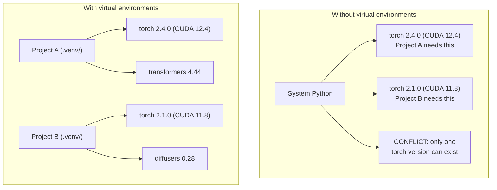

# Python Çevreleri . Python Çevre Yönetimi .

> bağımlılık cehennemi gerçek.
> Dependent Hell is real existence. Yapay ortam çözümdür.

**Type:** Build | **类型:** 构建
**Languages:** Shell | **语言:** Shell
**Prerequisites:** Phase 0, Lesson 01 | **前置知识:** Phase 0, 第 01 课
**Time:** ~30 minutes | **时间:** ~30 分钟

## Öğrenme hedefleri

- `uv`- Evet .`venv`veya`conda`
  Çeviri: Çeviri: Çeviri: Çeviri: Çeviri: Çeviri: Çeviri: Çeviri: Çeviri: Çeviri: Çeviri: Çeviri: Çeviri: Çeviri: Çeviri: Çeviri: Çeviri: Çeviri: Çeviri: Çeviri: Çeviri: Çeviri: Çeviri: Çeviri: Çeviri: Çeviri: Çeviri: Çeviri: Çeviri: Çeviri: Çeviri: Çeviri: Çeviri: Çeviri: Çeviri: Çeviri: Çeviri: Çeviri: Çeviri: Çeviri: Çeviri: Çeviri: Çeviri: Çeviri: Çeviri: Çeviri: Çeviri: Çeviri: Çeviri: Çeviri: Çeviri: Çeviri: Çeviri: Çeviri: Çeviri: Çeviri: Çeviri: Çeviri: Çeviri`uv`- Evet.`venv`Ya da`conda`创建隔离的虚拟环境
- Bir yazın .`pyproject.toml`Seçenekli bağımlılık grupları ile ve yeniden üretilebilirlik için kilitleme dosyaları oluşturur
  Çinçe Çevirisi:编写带可选依赖组的`pyproject.toml`, kilitleme dosyası oluşturmak                                                                                                                                                                                                                                                                                                                                                                                                                                                                                                                      
- Genel sıkıntıları teşhis ve düzeltmek: küresel yüklemeler, pip/conda karışımı, CUDA sürümünde eşleşmeyen değişiklikler
  Çinçe Çevirimi: Diagnosis并修复常见问题: 全局安装、pip/conda 混用、CUDA 版本不匹配
- Çelişkili bağımlılıkları olan projeler için aşamalar arası bir çevre stratejisi uygulanmalıdır
  Çinçe Çevirisi: Çevre stratejisi aşamalarına göre bölünmüş olarak çatışmaya bağlı projeleri gerçekleştirmek için

> **【中文解读】**
> Python  proje bağımlılığı çatışmaları, AI geliştirme içinde en yaygın sorunlardan biridir. Bu proje PyTorch 2.4 gerektirir. Bu proje 2.1  Tüm düzeyde kurulmak için sadece bir sürüm gerektirir.

## Sorunları anlatın.

Bir ince ayarlama projesi için PyTorch 2.4'i yüklersiniz. Gelecek hafta, başka bir projede PyTorch 2.1'e ihtiyaç vardır çünkü CUDA yapılandırması sabitlenir. Küresel olarak yükseltir ve ilk proje kesilir. Aşağı derecelendirir ve ikinci kesilir.

> Bir küçük program için PyTorch 2.4 kurdu. Bir başka proje için CUDA'nın bir sürüm oluşturması için PyTorch 2.1'i yüklediniz.

Bu bağımlılık cehennemi. Bu sürekli olarak AI/ML çalışmasında olur çünkü:

> Bu, AI/ML işinde sıklıkla olur çünkü:

- PyTorch, JAX ve TensorFlow her biri kendi CUDA bağlamalarını gönderir
  Çeviri:PyTorch、JAX 和 TensorFlow Çeşitli CUDA 绑定
- Model kütüphaneler belirli çerçeve sürümlerini pin
  Çinçe Çevirisi:模型库锁定特定框架版本
- Küresel bir `pip install`Önceden olan her şeyi üstü yazıyor.
  Çeviri: Çeviri: Çeviri: Çeviri: Çeviri: Çeviri: Çeviri: Çeviri: Çeviri: Çeviri: Çeviri: Çeviri: Çeviri: Çeviri: Çeviri: Çeviri: Çeviri: Çeviri: Çeviri: Çeviri: Çeviri: Çeviri: Çeviri: Çeviri: Çeviri: Çeviri: Çeviri: Çeviri: Çeviri: Çeviri: Çeviri: Çeviri: Çeviri: Çeviri: Çeviri: Çeviri: Çeviri: Çeviri: Çeviri: Çeviri: Çeviri: Çeviri: Çeviri: Çeviri: Çeviri: Çeviri: Çeviri: Çeviri: Çeviri: Çeviri: Çeviri: Çeviri: Çeviri: Çeviri: Çeviri: Çeviri: Çeviri: Çeviri: Çeviri: Çeviri: Çeviri: Çeviri: Çeviri: Çeviri: Çeviri: Çeviri: Çeviri: Çeviri: Çeviri: Çeviri: Çeviri: Çeviri: Çeviri: Çeviri`pip install`会覆盖之前安装的任何版本 会覆盖之前安装的任何版本 会覆盖之前安装的任何版本 会覆盖之前安装的任何版本 会覆盖之前安装的任何版本 会覆盖之前安装的任何版本 会覆盖之前安装的任何版本 会覆盖之前安装的任何版本 会覆盖之前安装的任何版本 会覆盖之前安装的任何版本 会覆盖之前安装的任何版本 会覆盖之前安装的任何版本 会覆盖之前安装的任何版本 会覆盖之前安装的任何版本 会覆盖之前安装的任何版本 会覆盖之前安装的任何版本 会覆盖之前安装的任何版本 会覆盖之前安装的任何版本 会覆盖之前安装的任何版本 会覆盖之前安装的任何版本 会覆盖之前安装的任何版本的任何版本 会覆盖之前安装的任何版本
- CUDA 11.8 yapılandırmaları CUDA 12.x sürücülerle çalışmaz (ve tam tersi)
  Çine çevirisi:CUDA 11.8 构建在CUDA 12.x 驱动上不工作(反之亦然)

Çözüm: Her proje kendi paketleriyle kendi izole edilmiş ortamına sahip.

> Çözüm: Her projenin kendi ayrılık ortamı vardır, bağımsız bir bağımlılık bağına sahiptir.

> **【中文解读】**
> "Dependenir" AI  projelerinde özellikle sık görülür, çünkü PyTorch/JAX/TensorFlow her türlü CUDA  bağlanmış, sürümler arasında birbirine uyumsuz.

## Konsepten bir şey.

> **【中文解读】**Aşağıdaki tabloda var / yok sanal ortam arasındaki farkı gösterir: sanal ortam yokken, Python sistemi sadece bir PyTorch sürümünü kurar, projeler birbirleriyle çatışır; sanal ortam vardır, her proje bağımsız bir bağımlılık, birbirine engel olmaktır.



## Yapın.

> **【拓展：uv vs pip vs conda — 该选哪个？】**(1) **uv**(推):Rust 写的,比 pip 快 10-100 倍, otomatik olarak görsel ortamı yönet,一行命令搞定 `uv venv && uv pip install`△(2)**venv**Python'un içinde yerleştirilmesi gerekmiyor ama hız yavaş ve işlevleri az.**conda**Bu, bir diğer deyişle, bir deyişle, bir deyişle, bir deyişle, bir deyişle, bir deyişle, bir deyişle, bir deyişle, bir deyişle, bir deyişle, bir deyişle, bir deyişle, bir deyişle, bir deyişle, bir deyişle, bir deyişle, bir deyişle, bir deyişle, bir deyişle, bir deyişle, bir deyişle, bir deyişle, bir deyişle, bir deyişle, bir deyişle, bir deyişle, bir deyişle, bir deyişle, bir deyişle, bir deyişle, bir deyişle, bir deyişle, bir deyişle, bir deyişle, bir deyişle, bir deyişle, bir deyişle, bir deyişle, bir deyişle, bir deyişle, bir deyişle, bir deyişle, bir deyişle, bir deyişle, bir deyişle, bir deyişle, bir deyişle, bir deyişle, bir deyişle, bir deyişle, bir deyişle, bir deyişle, bir deyişle, bir deyişle, bir deyişle, bir deyişle, bir deyişle, bir şekilde, bir deyişle, bir şekilde, bir deyişle, bir şekilde, bir deyişle, bir şekilde, bir de, bir deyişle, bir şekilde, bir de, bir de, bir de, bir de, bir de, bir de, bir de, bir de, bir de, bir de, bir de, bir de, bir de, bir de, bir de, de, de, de, de, de, de, de, de, de, de, de, de, de, de, de, de, de, de, de, de, de, de, de, de, de, de, de, de, de, de, de, de, de, de, de, de, de, de, de, de, de, de, de, de, de, de, de, de, de, de, de, de, de, de, de, de, de, de, de, de, de, de, de, de, de, de, de, de, de, de
```figure
s0-env-isolation
```

## Yapın

### Seçenek 1: uv venv (Önerilen)

`uv`en hızlı Python paket yöneticisi (10-100 kat daha hızlı) Bir araçta sanal ortamları, Python sürümleri ve bağımlılık çözünürlüğünü ele alır.

> `uv`Bu, en hızlı Python paket yöneticisi. Pipe'den 10-100 kat daha hızlı.

```bash
curl -LsSf https://astral.sh/uv/install.sh | sh

uv python install 3.12

cd your-project
uv venv
source .venv/bin/activate
```

Paketleri yükle:

> Çıkartma:

```bash
uv pip install torch numpy
```

Bir proje oluşturmak için `pyproject.toml`Bir adımla:

> Bir adım oluşturmak `pyproject.toml`Program:

```bash
uv init my-ai-project
cd my-ai-project
uv add torch numpy matplotlib
```

### Seçenek 2: venv (İşini yapılmış)

> **【中文解读】**venv Python'un kendi kendine yüklenmiş sanal ortam aracıdır, ek yükleme gerektirmez. Ancak UV'ye kıyasla, Python'un  sürümünü otomatik olarak yönetmez ve kilit dosyası da oluşturmaz.

Eğer yükleyemezsen`uv`Python gemileri ile birlikte .`venv`- ...

> Eğer yüklenemezsen`uv`Python'un kendi kendine.`venv`- ...

```bash
python3 -m venv .venv
source .venv/bin/activate  # Linux/macOS
.venv\Scripts\activate     # Windows

pip install torch numpy
```

Daha yavaş .`uv`Python'un her yerinde çalışır.

> - Hayır .`uv`慢, ama Python'un herhangi bir yerinde kullanılabilir.

### Seçenek 3: Konda (Gerektiğinde)

Conda, CUDA araç kümeleri, cuDNN ve C kütüphaneleri gibi Python dışı bağımlılıkları yönetir.

> Conda 管理非 Python, CUDA 工具包、cuDNN 和 C 库──在以下情况下使用:

- Sistem genelinde kurulmadan belirli bir CUDA araç kit versiyonu gerekiyor
  Çinçe Çevirimi: needs specific CUDA 工具包版本,但不希望全局安装
- Sistem paketlerini yükleyemeyeceğin ortak bir kümede bulunuyorsun.
  Çinçe Çevirimiçi: в общей группе, невозможно установить систем包
- Bir kütüphanenin kurulum talimatları "conda kullan" diyor.
  Çeviri:Közetleme Notası

```bash
# Install miniconda (not the full Anaconda)
curl -LsSf https://repo.anaconda.com/miniconda/Miniconda3-latest-Linux-x86_64.sh -o miniconda.sh
bash miniconda.sh -b

conda create -n myproject python=3.12
conda activate myproject

conda install pytorch torchvision torchaudio pytorch-cuda=12.4 -c pytorch -c nvidia
```

Bir kural: bir ortam için conda kullanıyorsanız, bu ortamdaki tüm paketler için conda kullanın.`pip install`Bir konda env'de sorunlar oluşur ve bu sorunları çözmek zor olur.

> Bir kural: Eğer bir konda  yönetim ortamı kullanıyorsanız, bir konda  yönetim ortamının sahip olduğu tüm paketleri kullanın.`pip install`Bu, zorluklara yol açacak.

### Bu Kurs için: Fazlı Strateji

Tüm kurs için tek bir ortam oluşturabilirsiniz. Yapmayın. Farklı aşamalar farklı (bazen çelişkili) bağımlılıklara ihtiyaç duyar.

> Tüm ders için bir ortam oluşturabilirsiniz. Bunu yapmayın.

Strateji:

> 策略:

```
ai-engineering-from-scratch/
├── .venv/                    <-- shared lightweight env for phases 0-3
├── phases/
│   ├── 04-neural-networks/
│   │   └── .venv/            <-- PyTorch env
│   ├── 05-cnns/
│   │   └── .venv/            <-- same PyTorch env (symlink or shared)
│   ├── 08-transformers/
│   │   └── .venv/            <-- might need different transformer versions
│   └── 11-llm-apis/
│       └── .venv/            <-- API SDKs, no torch needed
```

Senaryoyu oku .`code/env_setup.sh`Bu kurs için temel ortam yaratır.

> `code/env_setup.sh`Ortalama metin kurumunun temel ortamını oluşturur.

## pyproject.toml Basics. pyproject.toml 基础

> **【拓展：pyproject.toml 是现代 Python 项目的标准配置】**Geleneksel bir şey yerine geldi.`setup.py`和 `requirements.txt`◊ One file define project元数据、依赖、开发工具配置──AI 项目推 选择性依赖群的使用 来区分训练依赖(`[train]`) ve bu konuda güvenim`[serve]`), üretim ortamında gereksiz GPU'lar kurulmasını önlemek.

Her Python projesinde bir `pyproject.toml`- Yerine geçiyor .`setup.py`- Evet .`setup.cfg`ve`requirements.txt`Bir dosyada.

> Her Python projesi olmalı .`pyproject.toml`Bir dosya ile değiştirildi.`setup.py`- Evet.`setup.cfg`和 `requirements.txt`- Evet.

```toml
[project]
name = "ai-engineering-from-scratch"
version = "0.1.0"
requires-python = ">=3.11"
dependencies = [
    "numpy>=1.26",
    "matplotlib>=3.8",
    "jupyter>=1.0",
    "scikit-learn>=1.4",
]

[project.optional-dependencies]
torch = ["torch>=2.3", "torchvision>=0.18"]
llm = ["anthropic>=0.39", "openai>=1.50"]
```

Sonra yükle:

> Sonra da:

```bash
uv pip install -e ".[torch]"    # base + PyTorch
uv pip install -e ".[llm]"     # base + LLM SDKs
uv pip install -e ".[torch,llm]" # everything
```

## Kilitleme dosyaları

Bir kilit dosyası, tüm bağımlılıkları (geçici olanlar da dahil) tam sürümlere bağlar. Bu yeniden üretilebilirliği garanti eder: kilit dosyasından yükleyen herkes tam olarak aynı paketleri alır.

> Kilitleme dosyası her bir bağımlılığa göre olacaktır. Bu da tekrarlanabilirliği garanti eder. Kilitleme dosyasından herhangi bir kişi tamamen aynı paketleri alabilir.

```bash
# uv generates uv.lock automatically when using uv add
uv add numpy

# pip-tools approach
uv pip compile pyproject.toml -o requirements.lock
uv pip install -r requirements.lock
```

Kilit dosyayı git'e yükle. Birisi repo'yu klonladığında kilit dosyasından yükler ve aynı sürümleri alır.

> Kilitleme dosyasını git'e göndereceğim. Kimsenin kilitleme depolarını açtığında kilitleme dosyasından tamamen aynı versiyonu alacaklar.

## Genel Hatalar .

> **【中文解读】**Python 环境管理中最常见的 5 个错误:(1) 全局安装(用 `pip install`Bu yüzden, bu bir şey değil.`.venv`目录提交到 git;(5) CUDA 版本不匹配──以下逐个讲解和修复方法──

### 1. Küresel olarak kurulması

```bash
pip install torch  # BAD: installs to system Python

source .venv/bin/activate
pip install torch  # GOOD: installs to virtual environment
```

Paketlerin nereye gittiğini kontrol et:

> Paketi kontrol et:

```bash
which python       # should show .venv/bin/python, not /usr/bin/python
which pip           # should show .venv/bin/pip
```

### 2. Pip ve kondan karışımı

```bash
conda create -n myenv python=3.12
conda activate myenv
conda install pytorch -c pytorch
pip install some-other-package   # BAD: can break conda's dependency tracking
conda install some-other-package # GOOD: let conda manage everything
```

Eğer konda içinde pip kullanmanız gerekiyorsa (bazı paketler sadece pip içindir), önce tüm conda paketlerini yükleyin, sonra da pip paketleri sonuna kadar.

> Eğer bir konda içinde sadece bir paket kullanmak gerekiyorsa, önce tüm paketleri, son olarak tekrar paketleri yükle.

### 3. Aktifleştirmeyi unutuyorum

```bash
python train.py           # uses system Python, missing packages
source .venv/bin/activate
python train.py           # uses project Python, packages found
```

Shell sorgulamanız çevre adı göstermelidir:

> Şekil 提示符 should show环境名称:

```
(.venv) $ python train.py
```

### 4. .venv git'e bağlanıyorum

```bash
echo ".venv/" >> .gitignore
```

Sanal ortamlar 200MB-2GB'dir. Yerel, makineler arasında taşınabilir değil.`pyproject.toml`Ve yerine kilit dosyası.

> Virtual ortamda 200MB-2GB vardır. Yerel, makine arasında nakledilmez.`pyproject.toml`Ve kilitli dosya.

### 5. CUDA sürümü eşleşmiyor.

> **【拓展：CUDA 版本地狱】**PyTorch Her versiyon bağlı belirli CUDA  versiyonu(PyTorch 2.4 → CUDA 12.4) gibi.`nvidia-smi`确认驱动版本,再去 [pytorch.org](https://pytorch.org)查对应的安装命令──用 `uv pip install torch --index-url URL`指定 CUDA 版本──

```bash
nvidia-smi                # shows driver CUDA version (e.g., 12.4)
python -c "import torch; print(torch.version.cuda)"  # shows PyTorch CUDA version

# These must be compatible.
# PyTorch CUDA version must be <= driver CUDA version.
```

## Kullanın. Kullanın.

> **【中文解读】**Bu ders için önerilen strateji: Her aşamada bir sanal ortam oluşturmak`.venv-phase04`), böylece farklı aşamalarda bağımlılık çatışmasını önleyebiliriz.

Kurs ortamınızı oluşturmak için ayar senaryoyu çalıştırın:

> 运行安装脚本创建课程环境:

```bash
bash phases/00-setup-and-tooling/06-python-environments/code/env_setup.sh
```

Bu bir `.venv`çekirdek bağımlılıkları yüklenmiş ve doğrulanmış repo kökü.

> Bu depoda bir tane oluşturur.`.venv`,并安装和验证核心依赖──

## Egzersizler.

1. Çık .`env_setup.sh`ve tüm kontrollerin geçerliliğini kontrol et
   运行环境安装脚本,确认所有检查通过
2. İkinci bir sanal ortam oluşturun, numpy'nin farklı bir versiyonunu yükleyin ve iki ortamın izole edildiğini onaylayın.
   Yeni bir sanal ortam oluştur, farklı sürümler kur NumPy, iki ortamın ayrılığını onayla
3. Bir yazın .`pyproject.toml`PyTorch ve Anthropic SDK'ye ihtiyaç duyan bir proje için
   Aynı zamanda PyTorch ve Anthropic SDK'nin projelerini yazmak için .`pyproject.toml`
4. Kasten bir paket küresel olarak yükle (venv aktive etmeden), nereye gittiğini fark et, sonra onu kaldır
   Çünkü tüm düzeyde bir paket yerleştirmek için, onu nerede yerleştirdiğini gözlemleyip, sonra yüklemeyi denetlemeyi denetlemeyi başlatıyorum.

## Anahtar Terimler

| Term | What people say | What it actually means |
|------|----------------|----------------------|
| Virtual environment | "A venv" | An isolated directory containing a Python interpreter and packages, separate from the system Python |
| Lockfile | "Pinned dependencies" | A file listing every package and its exact version, guaranteeing identical installs across machines |
| pyproject.toml | "The new setup.py" | The standard Python project configuration file, replacing setup.py/setup.cfg/requirements.txt |
| Transitive dependency | "A dependency of a dependency" | Package B depends on C; if you install A which depends on B, C is a transitive dependency of A |
| CUDA mismatch | "My GPU isn't working" | PyTorch was compiled for a different CUDA version than what your GPU driver supports |

| 术语 | 俗称 | 实际含义 |
|------|------|---------|
| Virtual environment | "venv" | 包含独立 Python 解释器和包的隔离目录 |
| Lockfile | "锁定依赖" | 记录每个包精确版本的文件，确保跨机器安装一致 |
| pyproject.toml | "新版 setup.py" | Python 项目标准配置文件，替代 setup.py 和 requirements.txt |
| Transitive dependency | "依赖的依赖" | A 依赖 B，B 依赖 C，C 就是 A 的传递依赖 |
| CUDA mismatch | "GPU 不工作" | PyTorch 编译时的 CUDA 版本与 GPU 驱动不匹配 |
