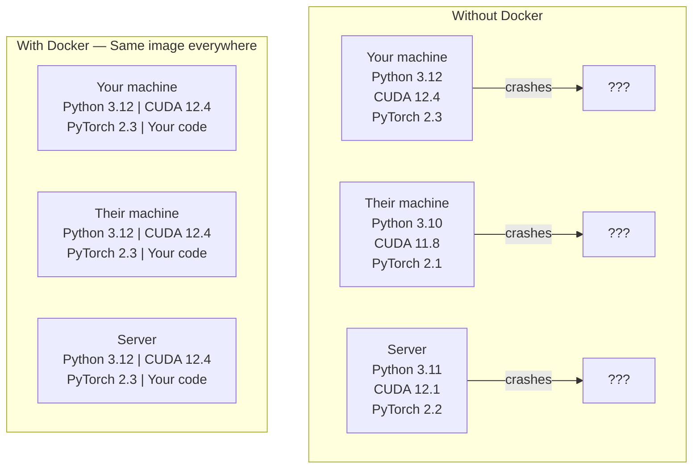

# Docker AI için Docker AI uygulaması

> Kontanerler "makine üzerinde çalışıyorum" bir geçmişi haline getirir.
> 容器让"My机器上能跑" tarihi haline gelmiştir.

**Type:** Build | **类型:** 构建
**Languages:** Docker | **语言:** Docker
**Prerequisites:** Phase 0, Lessons 01 and 03 | **前置知识:** Phase 0, 第 01 课和第 03 课
**Time:** ~60 minutes | **时间:** ~60 分钟

## Öğrenme hedefleri

- Bir Docker dosyasından CUDA, PyTorch ve AI kütüphaneleri ile GPU etkinleştirilmiş bir Docker görüntüsü oluşturun
  Çinçe Çevirimiçi: Dockerfile'den 构建支持GPU'nın Docker 镜像,包含CUDA、PyTorch 和 AI 库
- Konteyner yeniden inşaatları boyunca kalıcı modeller, veri kümeleri ve kodları oluşturmak için host dizinlerini hacme olarak yükleyin
  Çinçe Çevirimi: hangarlı host hostı katalogı için卷, modelle DATAKET ve kodı kalıcılık
- NVIDIA Kontaner Araç Kütüsünü, konteynerlerin içindeki GPU'ları açığa çıkarmak için yapılandır
  Çeviri: NVIDIA Kontaner Araç Kütle, içinde konteyner açığa çıkartılmış GPU
- Docker Compose kullanarak çoklu hizmetli AI uygulamalarını (inferans sunucusu + vektör veritabanı) orkestre edin
  Çinçe Çevirimi: Docker kullanın Yapılandırmak 编排多服务 AI 应用(推理服务器 + 向量数据库)

> **【中文解读】**
> Docker, kodı, çalışma zamanı, deposu ve sistem araçlarını bir "üzem" olarak paketleyerek, herhangi bir makinede çalışma sonuçlarının uyumlu olmasını sağlar.

## Sorunları anlatın.

Laptop'unuzda PyTorch 2.3, CUDA 12.4 ve Python 3.12 ile bir model eğitmişsiniz.

> Siz bir bilgisayarınızda PyTorch 2.3、CUDA 12.4 ve Python 3.12 ile bir model eğitmişsiniz. İş arkadaşlarınız PyTorch 2.1、CUDA 11.8 ve Python 3.10 kullanıyor.

AI projeleri bağımlılık kabuslarıdır. Tipik bir yığın Python, PyTorch, CUDA sürücüleri, cuDNN, sistem düzeydeki C kütüphaneleri ve tam bir kompilire sürümüne ihtiyaç duyan flash-attn gibi özel paketler içerir. Docker tüm bunları her yerde aynı şekilde çalıştırılan tek bir görüntüye paketler.

> AI projesi yönetimden kaynaklanan römlerdir. Tipik teknikler arasında Python, PyTorch, CUDA, sürücü, cuDNN, sistem seviyesinin C kütüphanesi ve flash-attn gibi özel bir düzenlemeci sürümünün olması vardır.

> **【中文解读】**
> AI  projesi en çok Docker'ın projelerinden biridir. CUDA  versiyonu兼容、PyTorch  versiyonu konflikt、cuDNN 缺失

## Konsepten bir şey.

> **【拓展：Docker 在 AI 中的三大用途】**(1) **环境一致性**: Kendi bilgisayarında eğitimli iyi model, servisçiye dağıtılırken kutu versiyonları farklı olduğu için rapor edilmez;**GPU 隔离**:多人共享一台 GPU 服务器,每个人一个容器互不干扰;(3) **一键部署**- ...`docker run`Bir条命令启动完整的AI 服务(模型 + API + 前端),无需手动配置──Hugging Face'ın TGI、vLLM等推理框架都提供Docker 镜像──

Docker, kodunuzu, çalıştırma zamanınızı, kitaplıklarınızı ve sistem araçlarınızı bir konteyner olarak adlandırılan bir ayrı bir birime sarar.

> Docker kodunuzu, çalışma zamanını, kutu ve sistem araçlarını "konut" olarak adlandırılan bir ayrılık birimine bağlar. Bu, bir yüzeysel sanal makine olarak düşünebilirsiniz.



### Neden AI projelerinde Docker daha çok gereklidir ?

> **【中文解读】**AI  projelerin bağımlılık zinciri Özel derin:Python → PyTorch → CUDA → cuDNN → 系统级 C 库。 herhangi bir bir aşama uyumsuzluk tüm eğitim çöküşüne veya sonuçlar uyumsuzluğuna neden olur。Docker Tüm aşamaları bir ayna içine paketleyerek, "makine üzerinde çalışabilir" "her yerde çalışabilir" haline gelmesini sağlayın。

1. **GPU drivers are fragile.**CUDA 12.4 kodu CUDA 11.8'de çalışmıyor. Docker, NVIDIA Container Toolkit aracılığıyla host GPU sürücüsünü paylaşırken, konteyner içindeki CUDA araç kümesini izole eder.

> 1. **GPU 驱动很脆弱。**CUDA 12.4'in kodları CUDA 11.8'de çalıştırılamaz. Docker NVIDIA konteyner araç seti ile CUDA'nın araç paketini ayırarak, aynı zamanda ev sahibi GPU'sını da kullanıyor.

2. **Model weights are large.**7B parametre modeli 14 GB'dır. her yeniden inşa ettiğinizde yeniden indirmeyi istemezsiniz. Docker hacmi, barındırıcıdan bir model dizini monte etmenizi sağlar.

> 2. **模型权重很大。**7B 参数模型在 fp16 下有 14 GB──你不想每次重建容器都重新下载──Docker卷让你从主持人挂载模型目录──

3. **Multi-service architectures are common.**Gerçek bir AI uygulaması sadece Python metni değil. Bu bir sonuçlama sunucusu, RAG için vektör veritabanı, belki de bir web ön uçudur. Docker Compose bunların hepsini tek bir komutla orkestra eder.

> 3. **多服务架构很常见。**Gerçek AI uygulaması sadece bir Python yazı kitabı değil. Bu bir düşünce sunucusu içerir.

### Ana kelime kümesi.

| Term | What it means |
|------|---------------|
| Image | A read-only template. Your recipe. Built from a Dockerfile. |
| Container | A running instance of an image. Your kitchen. |
| Dockerfile | Instructions to build an image. Layer by layer. |
| Volume | Persistent storage that survives container restarts. |
| docker-compose | A tool for defining multi-container applications in YAML. |

| 术语 | 含义 |
|------|------|
| Image（镜像） | 只读模板，相当于菜谱。由 Dockerfile 构建。 |
| Container（容器） | 镜像的运行实例，相当于厨房。 |
| Dockerfile | 构建镜像的指令文件，逐层定义。 |
| Volume（卷） | 持久化存储，容器重启后数据不丢失。 |
| docker-compose | 用 YAML 定义多容器应用的编排工具。 |

### AI'de yaygın konteyner kalıpları

> **【拓展：AI 部署的标准模式】**En sık görülen AI 容器模式:(1) **训练容器**挂载数据集目录, training完完输出模型权重;(2) **推理容器**加载模型权重,提供 REST API;(3) **Jupyter 容器**预装所有库的笔记本 环境──Hugging Face、NVIDIA NGC 大量预构建的AI 基础镜像──

```
Dev Container
  Full toolkit. Editor support. Jupyter. Debugging tools.
  Used during development and experimentation.

Training Container
  Minimal. Just the training script and dependencies.
  Runs on GPU clusters. No editor, no Jupyter.

Inference Container
  Optimized for serving. Small image. Fast cold start.
  Runs behind a load balancer in production.
```

## Yapın.
```figure
s0-image-layers
```

## Yapın

### Adım 1: Docker yükle

```bash
# macOS
brew install --cask docker
open /Applications/Docker.app

# Ubuntu
curl -fsSL https://get.docker.com | sh
sudo usermod -aG docker $USER
# Log out and back in for group change to take effect
```

Kontrol edin:

> 验证安装:

```bash
docker --version
docker run hello-world
```

### Adım 2: NVIDIA Kontaner Araç Kütücükünü (NVIDIA GPU ile Linux) yükle

Bu, Docker konteynerlerinin GPU'ya erişmesine izin verir. macOS ve Windows (WSL2) kullanıcıları bunu atlayabilir; Docker Desktop, bu platformlarda GPU'ları farklı şekilde ele alır.

> Bu, Docker'ın 容器larının GPU'larını ziyaret etmesine izin verir. MacOS ve Windows (WSL2) kullanıcıları bu adımları atlayabilir.

```bash
distribution=$(. /etc/os-release;echo $ID$VERSION_ID)
curl -fsSL https://nvidia.github.io/libnvidia-container/gpgkey | sudo gpg --dearmor -o /usr/share/keyrings/nvidia-container-toolkit-keyring.gpg
curl -s -L https://nvidia.github.io/libnvidia-container/$distribution/libnvidia-container.list | \
    sed 's#deb https://#deb [signed-by=/usr/share/keyrings/nvidia-container-toolkit-keyring.gpg] https://#g' | \
    sudo tee /etc/apt/sources.list.d/nvidia-container-toolkit.list

sudo apt-get update
sudo apt-get install -y nvidia-container-toolkit
sudo nvidia-ctk runtime configure --runtime=docker
sudo systemctl restart docker
```

Bir konteyner içindeki GPU erişimini test edin:

> 测试容器内 GPU 访问:

```bash
docker run --rm --gpus all nvidia/cuda:12.4.1-base-ubuntu22.04 nvidia-smi
```

GPU bilgilerini görürsen, araç kümesi çalışıyor.

> Eğer GPU'yu görebilirseniz, araç paketinin normal olduğunu açıklayın.

### Adım 3: Temel görüntüleri anlamak.

> **【中文解读】**基础镜像是Dockerfile'ın başlangıç noktası。AI 项目推使用NVIDIA 官方的CUDA 镜像(`nvidia/cuda:12.4.0-devel-ubuntu22.04`) veya PyTorch 官方镜像(`pytorch/pytorch:2.4.0-cuda12.4`), CUDA 运行时和深度学习库を预装した.

Doğru taban görüntüsünü seçmek saatlerce debugging tasarruf eder.

> 選正确的基础镜像能省数小时的调试时间──

```
nvidia/cuda:12.4.1-devel-ubuntu22.04
  Full CUDA toolkit. Compilers included.
  Use for: building packages that need nvcc (flash-attn, bitsandbytes)
  Size: ~4 GB

nvidia/cuda:12.4.1-runtime-ubuntu22.04
  CUDA runtime only. No compilers.
  Use for: running pre-built code
  Size: ~1.5 GB

pytorch/pytorch:2.6.0-cuda12.4-cudnn9-runtime
  PyTorch pre-installed on top of CUDA.
  Use for: skipping the PyTorch install step
  Size: ~6 GB

python:3.12-slim
  No CUDA. CPU only.
  Use for: inference on CPU, lightweight tools
  Size: ~150 MB
```

### Adım 4: AI geliştirme için Dockerfile yaz

İşte Docker Dosyası.`code/Dockerfile`- İçinden geç:

> Bu .`code/Dockerfile`İçinde Docker dosyası...

```dockerfile
FROM nvidia/cuda:12.4.1-devel-ubuntu22.04

ENV DEBIAN_FRONTEND=noninteractive
ENV PYTHONUNBUFFERED=1

RUN apt-get update && apt-get install -y --no-install-recommends \
    software-properties-common \
    git \
    curl \
    build-essential \
    && add-apt-repository -y ppa:deadsnakes/ppa \
    && apt-get update && apt-get install -y --no-install-recommends \
    python3.12 \
    python3.12-venv \
    python3.12-dev \
    && rm -rf /var/lib/apt/lists/*

RUN update-alternatives --install /usr/bin/python python /usr/bin/python3.12 1

RUN curl -sSL https://raw.githubusercontent.com/pypa/get-pip/3b73145063be545b649ad9ca83ea8da5fc915a4f/public/get-pip.py -o /tmp/get-pip.py \
    && echo "a341e1a43e38001c551a1508a73ff23636a11970b61d901d9a1cad2a18f57055  /tmp/get-pip.py" | sha256sum -c - \
    && python /tmp/get-pip.py \
    && rm /tmp/get-pip.py \
    && update-alternatives --install /usr/bin/pip pip /usr/local/bin/pip3.12 1

RUN python -m pip install --no-cache-dir --upgrade pip setuptools wheel

RUN python -m pip install --no-cache-dir \
    torch==2.6.0+cu124 \
    torchvision==0.21.0+cu124 \
    torchaudio==2.6.0+cu124 \
    --index-url https://download.pytorch.org/whl/cu124

RUN python -m pip install --no-cache-dir \
    numpy \
    pandas \
    scikit-learn \
    matplotlib \
    jupyter \
    transformers \
    datasets \
    accelerate \
    safetensors

WORKDIR /workspace

VOLUME ["/workspace", "/models"]

EXPOSE 8888

CMD ["python"]
```

Yap:

> 构建镜像:

```bash
docker build -t ai-dev -f phases/00-setup-and-tooling/07-docker-for-ai/code/Dockerfile .
```

Bu, ilk sefer biraz zaman alır (CUDA taban görüntüsünü indir + PyTorch).

> İlk inşaat biraz zaman gerektirir.

Çek şunu:

> 运行容器:

```bash
docker run --rm -it --gpus all \
    -v $(pwd):/workspace \
    -v ~/models:/models \
    ai-dev python -c "import torch; print(f'PyTorch {torch.__version__}, CUDA: {torch.cuda.is_available()}')"
```

Jupyter' i konteyner içinde çalıştır:

> "Jupyter" için:

```bash
docker run --rm -it --gpus all \
    -v $(pwd):/workspace \
    -v ~/models:/models \
    -p 8888:8888 \
    ai-dev jupyter notebook --ip=0.0.0.0 --port=8888 --no-browser --allow-root
```

### Adım 5: Veriler ve modeller için boyut montörleri

Bu cihazlar olmadan, 14 GB model yüklemeleriniz konteyner durduğunda kaybolur.

> Bu yüzden, bu modelle ilgili bir bilgiyi kullanmak için kullanın.

```bash
# Mount your code
-v $(pwd):/workspace

# Mount a shared models directory
-v ~/models:/models

# Mount datasets
-v ~/datasets:/data
```

Eğitim senaryounuzun içinde, monte edilmiş yoldan yüklen:

> Bu yazıda, yükleme yolu yükleme:

```python
from transformers import AutoModel

model = AutoModel.from_pretrained("/models/llama-7b")
```

Modelle sahip dosya sisteminde çalışıyorsun.

> Modelleri host dosya sisteminde depolanıyor.

### Adım 6: Docker Çoklu Hizmetli AI Uygulamaları için Yazı Yap

Gerçek RAG uygulaması bir sonuç sunucusu ve vektör veritabanı gerektirir. Docker Compose her ikisini de bir komutla çalışır.

> Gerçek RAG  uygulaması, sunucu ve akım veritabanını düşünmelidir. Docker Composer, her ikisini aynı anda çalıştırmak için bir emir kullanın.

Bakın .`code/docker-compose.yml`- ...

```yaml
services:
  ai-dev:
    build:
      context: .
      dockerfile: Dockerfile
    deploy:
      resources:
        reservations:
          devices:
            - driver: nvidia
              count: all
              capabilities: [gpu]
    volumes:
      - ../../../:/workspace
      - ~/models:/models
      - ~/datasets:/data
    ports:
      - "8888:8888"
    stdin_open: true
    tty: true
    command: jupyter notebook --ip=0.0.0.0 --port=8888 --no-browser --allow-root

  qdrant:
    image: qdrant/qdrant:v1.12.5
    ports:
      - "6333:6333"
      - "6334:6334"
    volumes:
      - qdrant_data:/qdrant/storage

volumes:
  qdrant_data:
```

Herşeye başla:

> 启动所有服务:

```bash
cd phases/00-setup-and-tooling/07-docker-for-ai/code
docker compose up -d
```

Şimdi AI geliştirme konteyneriniz vektör veritabanına ulaşabilir .`http://qdrant:6333`Docker Compose otomatik olarak paylaşılan bir ağ oluşturur.

> Şimdi AI  geliştirme konteynerleri servis adı ile yapılabilir .`http://qdrant:6333`访问量数据库──Docker Composer 自动创建共享网络──

AI konteynerinin içinden bağlantıyı test edin:

> AI 容器内部测试连接:

```python
from qdrant_client import QdrantClient

client = QdrantClient(host="qdrant", port=6333)
print(client.get_collections())
```

Her şeyi durdur:

> 停止所有服务:

```bash
docker compose down
```

Ekle`-v`Ayrıca qdrant hacmi silmek için:

>  加`-v`Aynı zamanda kaldırmak 卷:

```bash
docker compose down -v
```

### Adım 7: AI çalışması için kullanışlı Docker komutları

> 第7步:AI 工作中常用Docker 命令

```bash
# List running containers
docker ps

# List all images and their sizes
docker images

# Remove unused images (reclaim disk space)
docker system prune -a

# Check GPU usage inside a running container
docker exec -it <container_id> nvidia-smi

# Copy a file from container to host
docker cp <container_id>:/workspace/results.csv ./results.csv

# View container logs
docker logs -f <container_id>
```

## Kullanın. Kullanın.

> **【拓展：Docker vs Conda 选择指南】**简单项目用Conda/uv 即可;需要部署或多人协作时使用Docker。 deney kuralları: "机机上能跑" dersen,Docker kullanman gerektiğini açıkla.

Şimdi yeniden üretilebilir bir AI geliştirme ortamınız var.

> Şimdi bir AI geliştirme ortamı var.

- Kullanım`docker compose up`Dev ortamını ve vektör veritabanını birlikte başlatmak için
  Çeviri: Çeviri: Çeviri: Çeviri: Çeviri: Çeviri: Çeviri: Çeviri: Çeviri: Çeviri: Çeviri: Çeviri: Çeviri: Çeviri: Çeviri: Çeviri: Çeviri: Çeviri: Çeviri: Çeviri: Çeviri: Çeviri: Çeviri: Çeviri: Çeviri: Çeviri: Çeviri: Çeviri: Çeviri: Çeviri: Çeviri: Çeviri: Çeviri: Çeviri: Çeviri: Çeviri: Çeviri: Çeviri: Çeviri: Çeviri: Çeviri: Çeviri: Çeviri: Çeviri: Çeviri: Çeviri: Çeviri: Çeviri: Çeviri: Çeviri: Çeviri: Çeviri: Çeviri: Çeviri: Çeviri: Çeviri: Çeviri: Çeviri: Çeviri`docker compose up`Aynı zamanda geliştirme ve vektör veritabanı başlatıldı
- Kodunuzu, modellerinizi ve verilerinizi bir dizi olarak koyun, böylece yeniden inşa etmek arasında hiçbir şey kaybolmaz
  Çinçe çevirisi:将代码、模型和数据挂载为卷,重建后不会丢失
- Bir dersin yeni bir Python paketi gerektiğinde, onu Dockerfile'e ekle ve yeniden oluştur
  Çin Çeviri: Programda yeni Python paketleri gerekirse, Docker dosyasına eklenir ve yeniden oluşturulur.
- Docker dosyayı takım arkadaşlarınla paylaş.
  Çin Çeviri: Ekibiyle paylaşmak Dockerfile, onlar tamamen aynı ortamı elde

### GPU yok mu?

Çıkar `--gpus all`Bu kontaj, CPU'ya dayalı dersler için hala çalışır. PyTorch CUDA'nın yokluğunu algılar ve otomatik olarak CPU'ya geri döner.

> 移除 `--gpus all`标志和 NVIDIA 配置块──容器 hala CPU tabanlı derslerde kullanılabilir──PyTorch 会自动检测 CUDA不存在并回归CPU──

## Egzersizler.

1. Docker Dosyası oluştur ve çalıştır `python -c "import torch; print(torch.__version__)"`konteyner içinde
   Construct Docker 镜像,在容器内运行 PyTorch 验证
2. Docker-Compose stack ' i başlatın ve Qdrant ' ın AI konteynerinden erişilebildiğini kontrol edin .`http://qdrant:6333/collections`
   启动 docker-compose ,验证 Qdrant 向量数据库可访问
3. Ekle`flask`Dockerfile'e, yeniden inşa edin ve port 5000'de basit bir API sunucusu çalıştırın.`-p 5000:5000`
   Dockerfile İçin Ekle Flask, Yeniden Yapılandırma, API  Servisör
4. Resim boyutunu ölç`docker images`Bas resimini değiştirmeye çalış .`devel`- ...`runtime`Ve boyutları karşılaştır
    ölçüm görüntü büyüklüğü, devel ve çalıştırma süresi karşılaştırıldığında  temel görüntü büyüklüğü farkı

## Anahtar Terimler

| Term | What people say | What it actually means |
|------|----------------|----------------------|
| Container | "Lightweight VM" | An isolated process using the host kernel, with its own filesystem and network |
| Image layer | "Cached step" | Each Dockerfile instruction creates a layer. Unchanged layers are cached, so rebuilds are fast. |
| NVIDIA Container Toolkit | "GPU in Docker" | A runtime hook that exposes host GPUs to containers via `--gpus` flag |
| Volume mount | "Shared folder" | A directory on the host mapped into the container. Changes persist after the container stops. |
| Base image | "Starting point" | The `FROM` image your Dockerfile builds on top of. Determines what is pre-installed. |

| 术语 | 俗称 | 实际含义 |
|------|------|---------|
| Container | "轻量虚拟机" | 使用宿主内核的隔离进程，拥有独立文件系统和网络 |
| Image layer | "缓存层" | 每条 Dockerfile 指令创建一层，未修改的层会被缓存 |
| NVIDIA Container Toolkit | "Docker 中的 GPU" | 通过 `--gpus` 标志将宿主 GPU 暴露给容器的运行时钩子 |
| Volume mount | "共享文件夹" | 宿主目录映射到容器内，容器停止后数据保留 |
| Base image | "起点" | Dockerfile 的 FROM 镜像，决定了预装内容 |
