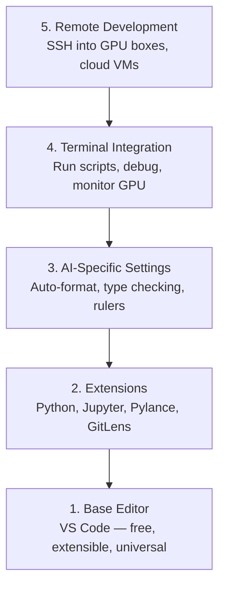

# Editör ayarlama editör ayarlama

> Editörünüz sizin yardımcı pilotunuz, bir kez ayarlayın ki yolunuzdan çıkmasın ve ağırlığını çekmeye başlasın.
> Editör senin yardımcı sürücüsün. Bir kere ayarlayın, bir daha sorun çıkarmasın, gerçek bir rol oynasın.

**Type:** Build | **类型:** 构建
**Languages:** -- | **语言:** 无
**Prerequisites:** Phase 0, Lesson 01 | **前置知识:** Phase 0, 第 01 课
**Time:** ~20 minutes | **时间:** ~20 分钟

## Öğrenme hedefleri

- Python, Jupyter, linting ve uzaktan SSH için gerekli uzantılarla VS Code yükleyin
  Çinçe Çevirim: VS Code 及 Python、Jupyter、代码检查和远程 SSH等必备扩展
- AI iş akışları için format-on-save, tip kontrolü ve notbuk çıkışını kaydırmayı yapılandır
  Çinçe Çevirimi: konfigürasyon save时格式化、类型检查和笔记本 输出滚动等 AI 工作流设置
- Uzaktan GPU makinelerindeki kodları yerel gibi düzenlemek ve hata işlemleri için Uzaktan SSH ayarlayın
  Çinçe Çevirimi: Uzaktan SSH, editör gibi editör ve调试 uzak mesafeli GPU 机器上的代码
- Editör alternatiflerini (Cursor, Windsurf, Neovim) ve AI çalışması için onların pazarlamalarını değerlendirmek
  中文翻译:评估编辑器替代方案 ((Cursor、Windsurf、Neovim) ve onun içinde AI 工作中的优劣

> **【中文解读】**
> Editör, kod yazmanın başlıca gücü aracıdır.

## Sorunları anlatın.

Python yazmak, not defterleri çalıştırmak, eğitim döngüslerini düzeltmek ve GPU kutularına SSH koymak için binlerce saatinizi editörünüzün içinde geçireceksiniz. Yanlış yapılandırılmış bir editör her oturumunu sürtüşmeye dönüştürür: otomatik tamamlanmaz, tip ipucuları yoktur, iç çizgi hataları yoktur, manuel biçimlendirme ve çılgın bir terminal iş akışı.

> Editörde binlerce saat geçireceksiniz Python'u yazmak, Notbook'u çalıştırmak, denetleme eğitim döngüsü, SSH'yi bağlantılandırmak, GPU servisörleri,... Yanlış düzenleme düzenleyicisi her kodlamayı bir sıkıntıya dönüştürecek: otomatik tamamlama yok, tip tipleri yok, iç içe bağlı hatalar yok, el biçimlendirme yok, kötü bir son çalışma akışı yok.

Doğru ayarlama 20 dakika alır, atlamak her gün 20 dakika alır.

> Doğru ayarlama sadece 20 dakika sürer. Bu ayarlamalar gün içinde 20 dakika daha fazla harcama sağlayacaktır.

> **【中文解读】**
> Yapım editörü sadece 20 dakika alır, ancak yapımsızlık size günde 20 dakika daha fazla harcamayı sağlar. Otomatik olarak tamamlanır, tip kontrol edilir, kaydedilme süresi biçimlendirilir. Bu küçük işlevler toplanır ve çok fazla zaman kazandırır.

## Konsepten bir şey.

Bir AI mühendislik editörü kurulması beş şeye ihtiyaç duyar:

> AI 工程 editörleri beş katlı yapılandırma gerektiriyor:



> **【中文解读】**
> AI  geliştirme editörleri beş katlı konfigürasyon gerektirir: temel editör →  genişleme eklentisi → AI  özel ayar →  terminal integrator →  uzaklık geliştirme。
```figure
s0-lsp-roundtrip
```

## Yapın

## Yapın.

> **【拓展：VS Code 为什么是 AI 开发的首选编辑器】**VS Code: 1) ücretsiz ve hafif; 2) Jupyter Notebook 原生支持; 3) Uzaktan SSH  doğrudan bağlantı GPU 服务器编辑代码; 4) Python/Jupyter/Python Debugger 扩展生态完善; 5) AI 辅助编程扩展(Copilot、Cline、Continue) 开箱即用──Cursor 和 Windsurf is based on VS Code'ın AI 增强版,也值得尝试──

### Adım 1: VS kodu yükle.

VS Code önerilen düzenleyici. Ücretsiz, her işletim sisteminde çalışır, birinci sınıf Jupyter notebook desteğine sahiptir ve uzantı ekosisteminin AI çalışması için ihtiyacınız olan her şeyi kapsar.

> VS Code is recommended editor. Bu ücretsiz, platform üzerinden, bir sınıf Jupyter Notebook.

İndir [code.visualstudio.com](https://code.visualstudio.com/)- Evet .

> - Evet .[code.visualstudio.com](https://code.visualstudio.com/)Aşağıya.

Terminalden kontrol edin:

> Son sınavı:

```bash
code --version
```

- Eğer`code`macOS'ta bulunmuyor, VS Code aç, bas `Cmd+Shift+P`, "Shell Komutu" yazın ve "PATH'de 'kod' komutu yükleyin" seçin.

> Eğer macOS 上找不到 `code`命令,打开 VS Code,按 `Cmd+Shift+P`,输入 "Shell Command", "PATH'de 'kod' komutunu yükle" seçin.

### Adım 2: Gerekli Ekstensiyonları Kurun.

> **【中文解读】**AI 开发必备的 VS Code 扩展:Python(调试+Lint)、Jupyter(在编辑器中运行 Notebook)、Pylance(智能补全和类型检查)、GitLens(查看代码历史)。安装后在设置中开启"保存时格式化",从此不用手动整理代码──

Entegre terminalı VS Kodunda aç (`` Ctrl+```) ve AI çalışması için önemli olan uzantıları yükle:

> 打开 VS Code 的集成终端(`Ctrl+`` `Ya da `` Cmd+```), 工作所需的关键扩展:

```bash
code --install-extension ms-python.python
code --install-extension ms-python.vscode-pylance
code --install-extension ms-toolsai.jupyter
code --install-extension eamodio.gitlens
code --install-extension ms-vscode-remote.remote-ssh
code --install-extension ms-python.debugpy
code --install-extension ms-python.black-formatter
code --install-extension charliermarsh.ruff
```

Her birinin yaptığı:

> Her bir genişleme etkisi:

| Extension | Why |
|-----------|-----|
| Python | Language support, virtual env detection, run/debug |
| Pylance | Fast type checking, autocomplete, import resolution |
| Jupyter | Run notebooks inside VS Code, variable explorer |
| GitLens | See who changed what, inline git blame |
| Remote SSH | Open a folder on a remote GPU box as if it were local |
| Debugpy | Step-through debugging for Python |
| Black Formatter | Auto-format on save, consistent style |
| Ruff | Fast linting, catches common mistakes |

Dosya `code/.vscode/extensions.json`Bu ders, proje klasörünü açtığınızda, VS Code, bunları yüklemenizi isteyecektir.

> 本课中 `code/.vscode/extensions.json`包含完整的推列表──当你打开项目文件时,VS Code 会提示你安装──

### Adım 3: Ayarları yapılandır

Ayarları `code/.vscode/settings.json`Bu derste, ya da elle uygulayın.`Settings > Open Settings (JSON)`- Evet .

> Sınıfdan`code/.vscode/settings.json`复制设置,或通过 `Settings > Open Settings (JSON)`Ellemel uygulama.

AI çalışması için ana ayarlar:

> AI 工作的关键设置:

```jsonc
{
    "python.analysis.typeCheckingMode": "basic",
    "editor.formatOnSave": true,
    "editor.rulers": [88, 120],
    "notebook.output.scrolling": true,
    "files.autoSave": "afterDelay"
}
```

Neden bunlar önemli:

> Neden bu ayarlar önemlidir:

- **Type checking on basic**Çekmeden önce yanlış argüman türlerini yakalar. Tensor şekli eşleşmezlikleri ve yanlış API parametreleri üzerinde debugging zaman tasarruf eder.
  Çeviri:**基础类型检查**Çözüm: Geçerli olmayan bir API ı kullanmadan önce yanlış bir parametreler türü yakalamak.
- **Format on save**Bir daha formate etmeyi düşünmeyin.
  Çeviri:**保存时格式化**Şekil: Artık biçimlendirmeyi düşünmeliyim.
- **Rulers at 88 and 120**Siyah sarılır 88. 120 işaretçisi doküstrelerin ve yorumların çok uzun olduğunu gösterir.
  Çeviri:**88 和 120 标尺**Kara: 88'de değişiklik. 120'de gösterilen belgeler.
- **Notebook output scrolling**Eğitim döngüleri binlerce satır yazdırırır.
  Çeviri:**Notebook 输出滚动**Bu yüzden, bu da bir şey değil.
- **Auto-save**: Kaydetmeyi unutacaksınız. Eğitim senaryounuz eski kod çalıştırır. Otomatik kaydetme bunu önler.
  Çeviri:**自动保存**Bu durumun önlenmesi için otomatik olarak kaydetmek gerekir.

### Dördüncü Adım: Terminal Entegreasyonu

VS Code'un entegre terminali eğitim senaryolarını çalıştırmak, GPU'ları izlemek ve ortamları yönetmek için.

> VS Code'un entegre uçası, çalıştırma eğitim kitabı, GPU ve yönetim ortamı kontrolü yeridir.

Doğru ayarlayın:

> Doğruluk ayarları:

```jsonc
{
    "terminal.integrated.defaultProfile.osx": "zsh",
    "terminal.integrated.defaultProfile.linux": "bash",
    "terminal.integrated.fontSize": 13,
    "terminal.integrated.scrollback": 10000
}
```

Kullanılabilir kısayollar:

> 常用快捷键:

| Action | macOS | Linux/Windows |
|--------|-------|---------------|
| Toggle terminal | `` Ctrl+` `` | `` Ctrl+` `` |
| New terminal | `` Ctrl+Shift+` `` | `` Ctrl+Shift+` `` |
| Split terminal | `Cmd+\` | `Ctrl+Shift+5` |

Bölünmüş terminaller yararlıdır: biri senaryoyu çalıştırmak için, biri GPU ile izlemek için `nvidia-smi -l 1`veya `watch -n 1 nvidia-smi`- Evet .

> 分屏终端 çok yararlı: bir işletim script, bir kullan `nvidia-smi -l 1`Ya da`watch -n 1 nvidia-smi`- Kontrol GPU.

### Adım 5: Uzaktan Geliştirme (SSH GPU Kutusu)

> **【拓展：Remote SSH 是 AI 开发的杀手级功能】**Çoğu insan yerel GPU'sı yok, SSH'ye ihtiyaç duyar, uzak GPU servisörü eğitim modeli。 VS Code'un uzak SSH'si genişletilmesi size kendiliğinden tamamlanmasını sağlar.

Bu, AI çalışması için en önemli uzantı. Uzaylı makinelerde (bulut VM'ler, laboratuvar sunucular, Lambda, Vast.ai) eğitim süreceksiniz. Uzaylı SSH uzaylı dosya sistemini açmanıza, dosyaları düzenlemenize, terminalleri çalıştırmanıza ve her şey yerel gibi hata işlemlerini düzeltmenize olanak tanır.

> Bu AI  çalışmalarında en önemli genişleme. Uzaktan makinelerde çalışmak için eğitim alacaksınız.

Yapılandırma:

> 设置步骤:

1. Uzak SSH uzantısını yükleyin (Adım 2'de yapıldı).
2. Basın `Ctrl+Shift+P`(veya `Cmd+Shift+P`), "Uzak-SSH: Host'a Bağlantı" türü.
3. Girin .`user@your-gpu-box-ip`- Evet .
4. VS Code, sunucu bileşenini uzaktan makineye otomatik olarak yükler.

> 1. 扩展 (已在步骤 2 完成)
> 2. 按 `Ctrl+Shift+P`(Yada `Cmd+Shift+P`),输入 "Uzak-SSH: Host'a Bağlantı"。
> 3. 输入 `user@your-gpu-box-ip`- Evet.
> 4. VS Kodu kendiliğinden uzak mesafeli makinelerde sunucu bileşenlerini yükler.

Parolasız erişim için SSH anahtarlarını ayarlayın:

> Şifresiz giriş gerçekleştirmek için SSH anahtarı ayarlayın:

```bash
ssh-keygen -t ed25519 -C "your-email@example.com"
ssh-copy-id user@your-gpu-box-ip
```

Ev sahibi ekle `~/.ssh/config`Uyum için:

> Başlamak için, ev sahibi eklenir.`~/.ssh/config`- ...

```
Host gpu-box
    HostName 203.0.113.50
    User ubuntu
    IdentityFile ~/.ssh/id_ed25519
    ForwardAgent yes
```

Şimdi .`Remote-SSH: Connect to Host > gpu-box`Hemen bağlanır.

> Şimdi .`Remote-SSH: Connect to Host > gpu-box`Bir anlık bağlantı.

## Alternatifler, alternatifler.

> **【拓展：AI 增强编辑器对比】**Cursor (VS Code,内置 AI 编程助手, $ 20/月) ve Windsurf (Codeium 出品,免费层可用) tümüyle 2024-2026 yıllarında yükselen AI-doğal editörlerdir.

### Kursor

[cursor.com](https://cursor.com)Bu, aynı ekstensiyon ekosistemini ve ayar biçimini kullanıyor. Cursor kullanıyorsanız, bu dersdeki her şey hala geçerlidir. Aynı şeyi ithal edin `settings.json`ve `extensions.json`- Evet .

> [cursor.com](https://cursor.com)Bu, aynı genişleme ortamını ve ayar biçimini kullanıyor. Cursor'u kullanıyorsanız, bu dersin tüm içeriği hala geçerlidir.`settings.json`和 `extensions.json`- Evet.

### Rüzgar sürfi

[windsurf.com](https://windsurf.com)Aynı hikaye: aynı uzantılar, aynı ayar formatı, aynı Uzay SSH desteği.

> [windsurf.com](https://windsurf.com)Aynı şekilde: aynı genişleme, aynı ayar biçimi, aynı Uzaylı SSH desteği.

### Vim/Neovim

Eğer zaten Vim veya Neovim kullanıyorsanız ve bu konuda verimliyseniz, orada kalın.

> Eğer Vim veya Neovim kullanıyorsanız ve verimlilik yanlıştırsa, AI Python'un en düşük konfigürasyonunu kullanmaya devam edin:

- **pyright**veya **pylsp**Tip kontrolü için (Mason veya manuel kurulum yoluyla)
  Çeviri:**pyright**Ya da**pylsp**Tip kontrol için kullanılır (Mason veya elle yüklenme yoluyla)
- **nvim-lspconfig**Dil sunucu entegrasyonu için
  Çeviri:**nvim-lspconfig**Kullanılan dil servisleri
- **jupyter-vim**veya **molten-nvim**Not defteri gibi çalıştırmak için
  Çeviri:**jupyter-vim**Ya da**molten-nvim**Not defterine benzer şekilde kullanılır
- **telescope.nvim**Dosya/simbol arama için
  Çeviri:**telescope.nvim**Dosya/kod arama için kullanılır
- **none-ls.nvim**Şartlama/kısaltma için siyah ve kargaşlı
  Çeviri:**none-ls.nvim**配合黑和ruff 格式化/lint için kullanılır

Eğer Vim'i kullanmıyorsanız, şimdi başlamayın. Öğrenme eğriliği AI mühendisliği öğrenmekle rekabet edecek. VS Code kullanın.

> Eğer Vim'i kullanmamışsanız, şimdi başlama.

## Kullanın. Kullanın.

> **【中文解读】**推配置:VS Code + Python + Jupyter + Remote SSH。 Eğer uzaktan GPU  sunucu kullanırsanız, uzaktan SSH 必須。调试训练循环时,Jupyter 扩展让您在编辑器内直接查看张量形和损曲线。

Bu ayarla günlük iş akışınız şöyle görünüyor:

> Bu konuma sahip olmakla birlikte, günlük işlerin şu şekilde:

1. Proje klasörünü VS Code'da açın (veya uzaktan SSH üzerinden GPU kutusuna bağlayın).
   ÇXC: VS Code 中打开项目文件((或通过远程SSH 连接到GPU 服务器)
2. Otomatik tamamlama, yazma ipuçları ve iç hatalı hatalarla Python'u düzenleyicide yazın.
   Çinçe Çevirimiçi: Python'ı editörde düzenle, otomatik olarak tamamlanıp kullanın.
3. Jupyter defterlerini Jupyter uzantısı ile uyumlu çalıştır.
   Çeviri: Yupiter kullan 扩展内嵌运行 Notbook。
4. Eğitim senaryoları için entegre terminal kullanın.`uv pip install`, ve GPU izleme.
   Çeviri: Çeviri: Çeviri: Çeviri: Çeviri: Çeviri: Çeviri: Çeviri: Çeviri: Çeviri: Çeviri: Çeviri: Çeviri: Çeviri: Çeviri: Çeviri: Çeviri: Çeviri: Çeviri: Çeviri: Çeviri: Çeviri: Çeviri: Çeviri: Çeviri: Çeviri: Çeviri: Çeviri: Çeviri: Çeviri: Çeviri: Çeviri: Çeviri: Çeviri: Çeviri: Çeviri: Çeviri: Çeviri: Çeviri: Çeviri: Çeviri: Çeviri: Çeviri: Çeviri: Çeviri: Çeviri: Çeviri`uv pip install`Ve GPU izleme.
5. GitLens ile yapılan değişiklikleri, karar vermeden önce gözden geçirin.
   中文翻译:提交前用 GitLens 检查变更。

## Egzersizler.

1. VS Kod ve 2. Adımda listelenen tüm uzantıları yükle
   VS Kodı ve adım 2 İçinde listelenen tüm genişlemeler
2. Kopyalayın .`settings.json`Bu dersden VS Code yapılandırmalarına
   Sınıfı`settings.json` Kopyalı VS Kodunu  Konfigurasyon içinde
3. Python dosyasını açın ve Pylance'de kaydetken tip ipuçlarını ve siyah biçimleri gösterildiğini doğrulayın
   打开一个Python文件,验证Pylance 显示类型提示、Black 保存时自动格式化
4. Uzaktan bir makineye erişimi varsa, Uzaktan SSH ayarlayın ve üzerinde bir klasör açın
   Eğer bir uzaktan cihaz varsa, Remote SSH ayarlayın ve uzak dosyaları açın.

## Anahtar Terimler

| Term | What people say | What it actually means |
|------|----------------|----------------------|
| LSP | "Autocomplete engine" | Language Server Protocol: a standard for editors to get type info, completions, and diagnostics from a language-specific server |
| Pylance | "The Python plugin" | Microsoft's Python language server using Pyright for type checking and IntelliSense |
| Remote SSH | "Working on the server" | VS Code extension that runs a lightweight server on a remote machine and streams the UI to your local editor |
| Format on save | "Auto-prettier" | The editor runs a formatter (Black, Ruff) every time you save, so code style is always consistent |

| 术语 | 俗称 | 实际含义 |
|------|------|---------|
| LSP | "自动补全引擎" | 语言服务器协议：编辑器获取类型信息、补全和诊断的标准 |
| Pylance | "Python 插件" | 微软的 Python 语言服务器，提供类型检查和智能提示 |
| Remote SSH | "在服务器上开发" | VS Code 在远程机器上运行轻量服务器，将 UI 传输到本地编辑器 |
| Format on save | "保存时自动格式化" | 每次保存时自动运行格式化工具，保持代码风格一致 |
