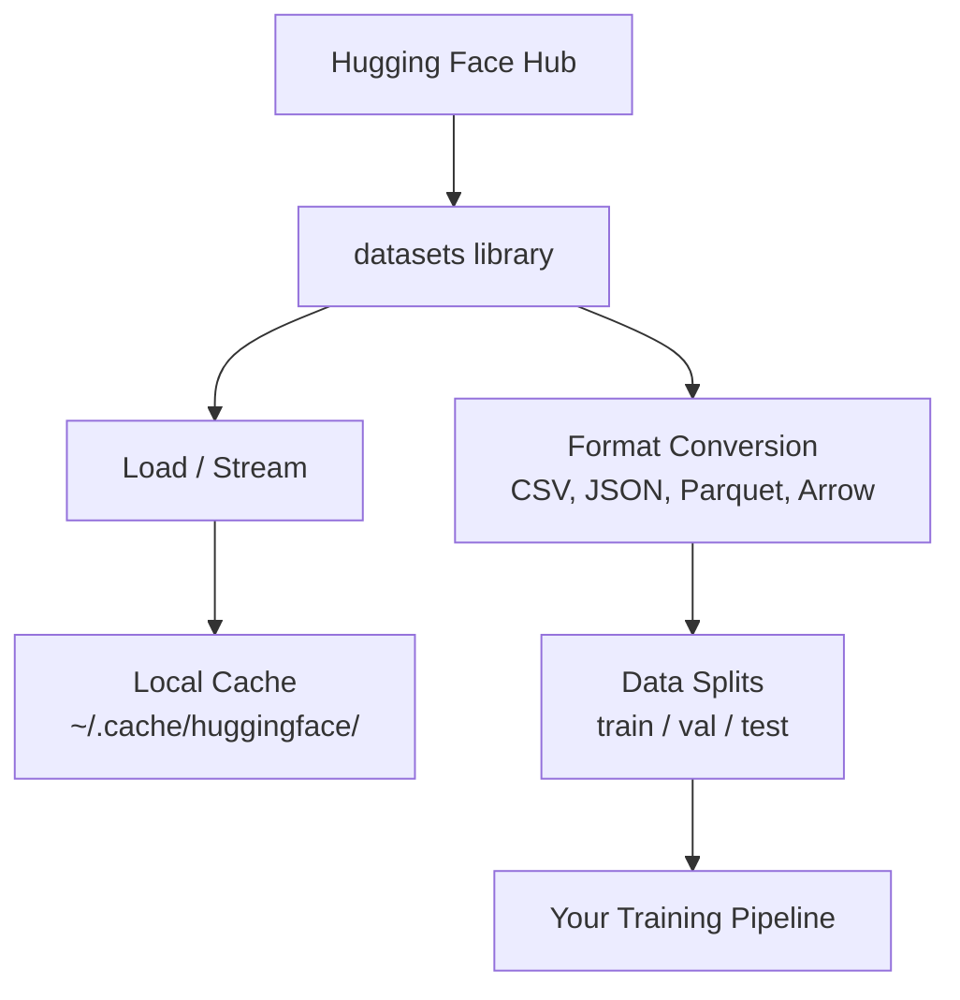

# Veri yönetimi Veri yönetimi

> Veriler yakıt, nasıl yönettiğinizin hızını belirler.
> Veriler yakıt. Onu nasıl yönettiğinize göre daha hızlı çalışabilirsiniz.

**Type:** Build | **类型:** 构建
**Language:**Python .**语言:**Python
**Prerequisites:** Phase 0, Lesson 01 | **前置知识:** Phase 0, 第 01 课
**Time:** ~45 minutes | **时间:** ~45 分钟

## Öğrenme hedefleri

- Kucaklama Yüzü ile veri kümelerini yükle, akışla ve önbelleğe koy `datasets`kütüphane
  Çeviri: Çeviri: Çeviri: Çeviri: Çeviri: Çeviri: Çeviri: Çeviri: Çeviri: Çeviri: Çeviri: Çeviri: Çeviri: Çeviri: Çeviri: Çeviri: Çeviri: Çeviri: Çeviri: Çeviri: Çeviri: Çeviri: Çeviri: Çeviri: Çeviri: Çeviri: Çeviri: Çeviri: Çeviri: Çeviri: Çeviri: Çeviri: Çeviri: Çeviri: Çeviri: Çeviri: Çeviri: Çeviri: Çeviri: Çeviri: Çeviri: Çeviri: Çeviri: Çeviri: Çeviri: Çeviri: Çeviri: Çeviri: Çeviri: Çeviri: Çeviri: Çeviri: Çeviri: Çeviri: Çeviri: Çeviri: Çeviri: Çeviri`datasets`库加载、流式处理和缓存数据集
- CSV, JSON, Parquet ve Arrow biçimleri arasında dönüştürme ve onların anlaşmalarını açıklayın
  Çinçe Çevirim: CSV、JSON、Parquet 和 Arrow 格式 arasında dönüşüm,并各自的优点解释
- Düzgün rastgele tohumlarla tekrarlanabilir tren/valyasyon/test bölümleri oluşturmak
  Çinçe Çevirimi: sabit olan bitkiyi oluşturmak için yeniden yapılandırılabilir eğitim/tesdiq/test test集 ayrıştır
- Büyük model ve veri kümesi dosyalarını kullanmak `.gitignore`Git LFS veya DVC
  Çeviri: Çeviri: Çeviri: Çeviri: Çeviri: Çeviri: Çeviri: Çeviri: Çeviri: Çeviri: Çeviri: Çeviri: Çeviri: Çeviri: Çeviri: Çeviri: Çeviri: Çeviri: Çeviri: Çeviri: Çeviri: Çeviri: Çeviri: Çeviri: Çeviri: Çeviri: Çeviri: Çeviri: Çeviri: Çeviri: Çeviri: Çeviri: Çeviri: Çeviri: Çeviri: Çeviri: Çeviri: Çeviri: Çeviri: Çeviri: Çeviri: Çeviri: Çeviri: Çeviri: Çeviri: Çeviri: Çeviri: Çeviri: Çeviri: Çeviri: Çeviri: Çeviri: Çeviri: Çeviri: Çeviri: Çeviri: Çeviri: Çeviri: Çeviri`.gitignore`、Git LFS veya DVC 管理大型模型和数据文件

> **【中文解读】**
> Bu bölüm seni nasıl sarılanacağını öğretir.`datasets`Kütüp yükleme, depolama, dönüşüm ve ayrıştırma. Verileri yönetme becerisi, makine öğrenme deneylerinin başlangıcıdır.

## Sorunları anlatın.

Her AI projesi verilerle başlar. Veriler bulmanız, indirmeniz, biçimler arasında dönüştürmeniz, eğitim ve değerlendirme için bölmeniz ve deneylerin yeniden üretilebilmesi için versiyon yapmanız gerekir. Bunu her seferinde manuel olarak yapmak yavaş ve hatalara eğilimlidir. Tekrar edilebilir bir iş akışı gerekir.

> Her AI projesi veriden başlıyor. Verim kümelerini bulman gerekiyor, indirmen gerekiyor, biçim değiştirmen gerekiyor, eğitim kümelerine ve değerlendirme kümelerine ayırmalı ve deneyin tekrarlanabilirliğini sağlamak için sürüm yönetimi yapmalısın.

> **【中文解读】**
> Her AI projesi veriden başlıyor. Bu bölüm size tekrarlanabilir veri akımını oluşturmanıza yardımcı oluyor.

> **【拓展：Hugging Face 在 AI 生态中的地位】**
> Hugging Face, Yapay zeka alanındaki GitHub'dur ve yüz binlerce veri kümesi ve önceden eğitim modelini yönetmiştir.`datasets`Kütüphane, Panda'lara benzer bir veri yükleme ve işleme standart aracıdır, ancak AI'ye özel olarak  optimize edilmiştir, süper büyük veri topluğunu yükleme akışını destekler.

## Konsepten bir şey.



Sarılan Yüz`datasets`Kütüphanede, AI çalışması için veri yüklemenin standart yolu, indirme, önbelleğe alma, biçim dönüşümü ve kutudan dışarı akıştırma işlemi yapılır.

> Sarılan Yüz`datasets`Kütüphane, AI'nin veri yüklemesinin standart bir yöntemidir.

> **【中文解读】**
> Sarılan Yüz`datasets`Bu, AI'nin veri yükleme faktörü standardıdır. Bu, otomatik olarak yükleme, depolama, biçim dönüşümü ve akış yükleme işlemini yapar.

> **【拓展：数据格式对训练速度的影响】**
> Gerçek AI çalışmalarında, veri biçimi doğrudan eğitim verimliliğini etkiler. Parket biçimi CSV küçük 60-80%, okuma hızı hızlı 5-10 倍. Google ve Meta'nın iç eğitim hattı tümü Parket / Ok biçimi kullanır.

## Yapın.
```figure
s0-data-pipeline
```

## Yapın

### Adım 1: Veritabeleri kütüphanesi yükle

```bash
pip install datasets huggingface_hub  # 安装 Hugging Face 数据集库和模型仓库工具
```

### Adım 2: Veriler kümesini yükle

```python
from datasets import load_dataset

dataset = load_dataset("imdb")  # 加载 IMDB 电影评论数据集（首次下载，之后从缓存读取）
dataset = load_dataset("stanfordnlp/imdb")
print(dataset)
print(dataset["train"][0])  # 查看训练集第一条样本
```

Bu IMDB film inceleme verileri indirir. İlk indirilmesinden sonra, önbelleği at `~/.cache/huggingface/datasets/`- Evet .

> Bu yayın IMDB'de yayınlandı.`~/.cache/huggingface/datasets/`Kayıtın yüklenmesi:

### Adım 3: Büyük veri kümelerini akışlat

Bazı veri kümeleri diske yerleştirilecek kadar büyüktür. Akış, tümünü indirmeden onları sıra sıra yükler.

> Bazı veri kümeleri çok büyüktür. Tüm veri kümelerini disk diskiye indiremez.

```python
dataset = load_dataset("wikimedia/wikipedia", "20220301.en", split="train", streaming=True)  # 流式加载：不下载完整数据集

for i, example in enumerate(dataset):
    print(example["title"])  # 逐条处理，内存占用恒定
    if i >= 4:
        break
```

Akış size bir `IterableDataset`.Satları geldiğinde işletiyorsunuz. Bilgi kümesi boyutundan bağımsız olarak hafıza kullanımı sabit kalır.

> 流式加载返回 `IterableDataset` Sizler elde edilen verileri hallederseniz, ne kadar büyük olursa olsun, kayda sahip olmaları sabit kalır.

> **【拓展：流式加载在大模型训练中的应用】**
> 流式加载是训练大语言模型的关键技术――Common Crawl 数据集约250TB,不可能全部下载到本地――GPT-4 训练数据通过流式方式从分布式存储中加载,每秒处理数十万条文――Hugging Face 的`streaming=True`参数 size aynı şekilde çok büyük veri kümelerini işlemeyi sağlar, 8GB'lik bir not defteri bile TB seviyesindeki veriyi işleyebilir.

### Adım 4: Veri kümesi biçimleri

- Evet .`datasets`Bu kitaplık kapının altında Apache Arrow kullanıyor.

> `datasets`库底层 Apache Arrow kullanın.

```python
dataset = load_dataset("stanfordnlp/imdb", split="train")

dataset.to_csv("imdb_train.csv")  # 导出为 CSV 格式（通用但体积大）
dataset.to_json("imdb_train.json")  # 导出为 JSON 格式（适合 API 交换）
dataset.to_parquet("imdb_train.parquet")  # 导出为 Parquet 格式（压缩率高、读取快）
```

Format karşılaştırması:

> 格式对比:

| Format | Size | Read Speed | Best For |
|--------|------|-----------|----------|
| CSV | Large | Slow | Human readability, spreadsheets |
| JSON | Large | Slow | APIs, nested data |
| Parquet | Small | Fast | Analytics, columnar queries |
| Arrow | Small | Fastest | In-memory processing (what `datasets` uses internally) |

| 格式 | 体积 | 读取速度 | 最适合 |
|------|------|---------|--------|
| CSV | 大 | 慢 | 人类阅读、电子表格 |
| JSON | 大 | 慢 | API、嵌套数据 |
| Parquet | 小 | 快 | 分析查询、列式存储 |
| Arrow | 小 | 最快 | 内存中处理（datasets 库内部使用） |

AI çalışması için Parquet en iyi depolama biçimidir. Ok hafızada çalışmanız için. CSV ve JSON değişim için.

> AI 工作 için,Parquet en iyi depolama biçimidir. Arrow, verileniş için kullanılan bir biçimdir.

### Adım 5: Veriler bölünüyor

> **【中文解读】**
> Bilgi ayrımı, makinelerle öğrenmenin temel ilkesidir. Eğitim, test, test, test, test, test, test, test, test, test, test, test, test, test, test, test, test, test, test, test, test, test, test, test, test, test, test, test, test, test, test, test, test, test, test, test, test, test, test, test, test, test, test, test, test, test, test, test, test, test, test, test, test, test, test, test, test, test, test, test, test, test, test, test, test, test, test, test, test, test, test, test, test, test, test, test, test, test, test, test, test, test, test, test, test, test, test, test, test, test, test, test, test, test, test, test, test, test, test, test, test, test, test, test, test, test, test, test, test, test, test, test, test, test, test, test, test, test, test, test, test, test, test, test, test, test, test, test, test, test, test, test, test, test, test, test, test, test, test, test, test, test, test, test, test, test, test, test, test, test, test, test, test, test, test, test, test, test, test, test, test, test, test, test, test, test, test, test, test, test, test, test, test, test, test, test, test, test, test, test, test, test, test, test, test, test, test, test, test, test, test, test, test, test, test, test, test, test, test, test, test, test, test, test, test, test, test, test, test, test, test, test, test, test, test, test, test, test, test, test, test, test, test, test, test, test, test, test, test, test, test, test, test, test, test, test, test, test, test, test, test, test, test, test, test, test, test

Her ML projesinin üç bölüme ihtiyacı vardır:

> Her bir ML projesi üç bölüme ihtiyaç duyar:

- **Train**Modelle bu noktada dersler çıkarır (genellikle %80).
  Çeviri:**训练集**Model from here learning (Bundan öğrenmek)
- **Validation**: Eğitim sırasında ilerlemeyi kontrol edersiniz (genellikle %10).
  Çeviri:**验证集**: eğitim sürecinde kontrol gelişimini(genellikle %10)
- **Test**: Eğitimden sonra son değerlendirme (genellikle %10)
  Çeviri:**测试集**: eğitim tamamlandıktan sonra son değerlendirme (genellikle %10)

Bazı veri kümeleri önceden bölünmüştür.

> Bazı veri kümeleri ayrılmış durumda. Eğer değilse, kendi kendini ayırmanız gerekir:

```python
dataset = load_dataset("stanfordnlp/imdb", split="train")

split = dataset.train_test_split(test_size=0.2, seed=42)  # 80% 训练+验证，20% 测试
train_val = split["train"].train_test_split(test_size=0.125, seed=42)  # 从 80% 中取 12.5% 作为验证集

train_ds = train_val["train"]  # 最终：70% 训练集
val_ds = train_val["test"]  # 最终：10% 验证集
test_ds = split["test"]  # 最终：20% 测试集

print(f"Train: {len(train_ds)}, Val: {len(val_ds)}, Test: {len(test_ds)}")
```

Her zaman yeniden üretilebilirlik için bir tohum belirleyin.

> 必須 必須 必須 必須 必須 必須 必須 必須 必須 必須 必須 必須 必須 必須 必須 必須 必須 必須 必須 必須 必須 必須 必須 必須 必須 必須 必須 必須 必須 必須 必須 必須 必須 必須 必須 必須 必須 必須 必須 必須 必須 必須 必須 必須 必須 必須 必須 必須 必須 必須 必須 必須 必須 必須 必須 必須 必須 必須 必須 必須 必須 必須 必須 必須 必須 必須 必須 必須 必須 必須 必須 必須 必須 必須 必須 必須 必須 必須 必須 必須 必須 必須 必須 必須 必須 必須 必須 必須 必須 必須 必須 必須 必須 必須 必須 必須 必須 必須 必須 必須 必須 必須 必須 必須 必須 必須 必須 必須 必須 必須 必須 必須 必須 必須 必須 必須 必須 必須 必須 必須 必須 必須 必須 必須 必須 必須 必須 必須 必須 必須 必須 必須 必須 必須 必須 必須 必須 必須 必須 必須 必須 必須 必須 必須 必須 必須 必須 必須 必須 必須 必須 必須 必須 必須 必須 必須 必須 必須 必須 必須 必須 必須 必須 必須 必須 必須 必須 必須 必須 必須 必須 必須 必須 必須 必須 必須 必須 必須 必須 必須 必須 必須 必須 必須 必須 必須 必須 必須 必須 必須 必須 必須 必須 必須   必須   必須 必須   

### Adım 6: İndirme ve Kaş Modelleri

Modeller büyük dosyalar.`huggingface_hub`kütüphane yükleme ve önbelleğe alma işlemlerini yapar.

> Model büyük bir dosyadır.`huggingface_hub`库负责下载和缓存──

```python
from huggingface_hub import hf_hub_download, snapshot_download

model_path = hf_hub_download(  # 下载单个文件
    repo_id="sentence-transformers/all-MiniLM-L6-v2",
    filename="config.json"
)
print(f"Cached at: {model_path}")

model_dir = snapshot_download("sentence-transformers/all-MiniLM-L6-v2")  # 下载整个模型仓库
print(f"Full model at: {model_dir}")
```

> **【拓展：模型缓存机制】**
> Hugging Face'ın depolama mekanizması çok zeki:模型下载后存储在 `~/.cache/huggingface/hub/`, sonraki yükleme doğrudan okumak için kendi yerindeki depolama. Llama-2-7B gibi bir LLM yaklaşık 14GB, ilk yükleme birkaç dakika, sonra ikinci yükleme gerekir.

Modeller önbelleğe`~/.cache/huggingface/hub/`Bir kez indirildikten sonra, hemen sonraki sürümlere yüklenirler.

> Modell Kaşarıya Kadar`~/.cache/huggingface/hub/` Download once after, 后续运行秒级加载──

### Adım 7: Büyük dosyaları işleme

> **【中文解读】**
> AI 模型文件动数 GB(GPT-2 约500MB,Llama-2-70B 约140GB),普通 git 管理──三种方案各有适用场景:`.gitignore`En basit, büyük dosyaları unutmak,LFS'e uygun,DVC'ye uygun,Devamlı bir deney yaptırmak için.

Model ağırlıkları ve büyük veri kümeleri git'e girmemelidir.

> 模型权重和大型数据集不应放入 git──三种选择:

**Option A: .gitignore (simplest)**

> **选项 A：.gitignore（最简单）**

```
*.bin
*.safetensors
*.pt
*.onnx
data/*.parquet
data/*.csv
models/
```

**Option B: Git LFS (track large files in git)**

> **选项 B：Git LFS（在 git 中追踪大文件）**

```bash
git lfs install
git lfs track "*.bin"
git lfs track "*.safetensors"
git add .gitattributes
```

Git LFS repo'nda göstergeler ve gerçek dosyaları ayrı bir sunucuda saklar. GitHub size 1 GB ücretsiz verir.

> Git LFS depoda depolama göstergesinde, gerçek dosyalar ayrı bir sunucu üzerinde depolanır. GitHub 1 GB ücretsiz alan sağlar.

**Option C: DVC (data version control)**

> **选项 C：DVC（数据版本控制）**

```bash
pip install dvc
dvc init
dvc add data/training_set.parquet
git add data/training_set.parquet.dvc data/.gitignore
git commit -m "Track training data with DVC"
```

DVC küçük yaratır `.dvc`Verilerin kendisi S3, GCS veya başka bir uzaktan depolama arka uçunda yaşıyor.

> DVC 创建小的 `.dvc`文件指向你的数据──数据本身存储在S3、GCS或其他远程存储后端──

> **【拓展：工业级数据版本管理】**
> Google ve Meta gibi büyük fabrikalarda, veri sürümleri yönetimi kod sürümlerini yönetmekten daha karmaşıkdır. Bir önerilen sistem deneyi, onlarca veri kümesi ve milyarlarca numuneyi içerebilir.

| Approach | Complexity | Best For |
|----------|-----------|----------|
| .gitignore | Low | Personal projects, downloaded data you can re-fetch |
| Git LFS | Medium | Teams sharing model weights via git |
| DVC | High | Reproducible experiments, large datasets, teams |

| 方案 | 复杂度 | 最适合 |
|------|--------|--------|
| .gitignore | 低 | 个人项目、可重新下载的数据 |
| Git LFS | 中 | 通过 git 共享模型权重的团队 |
| DVC | 高 | 需要严格复现的实验、大数据集、团队协作 |

Bu ders için,`.gitignore`Makineler arasında tam deneyleri yeniden üretmek için DVC kullanın.

> Bu ders kullanılıyor`.gitignore`Yeter. DVC'yi kullanmaya çalıştığınızda kullanın.

### Adım 8: Depolama kalıpları

> **【中文解读】**
> Bu depo 10GB'den daha fazla veri depolama için uygun. Bu depolama otomatik yönetimidir.

**Local storage**HF önbelleği bunu otomatik olarak işliyor.

> **本地存储** Yaklaşık 10 GB aşağıdaki veri kümesi için uygundur。HF 缓存自动处理。

**Cloud storage**daha büyük veya makineler arasında paylaşılan herhangi bir şey için:

> **云存储**Daha büyük veri kümesi veya bir makinede paylaşım gerektiren durumlar için:

```python
import os

local_path = os.path.expanduser("~/.cache/huggingface/datasets/")

# s3_path = "s3://my-bucket/datasets/"
# gcs_path = "gs://my-bucket/datasets/"
```

DVC S3 ve GCS ile doğrudan entegre edilir:

> DVC 直接与 S3 和 GCS 集成:

```bash
dvc remote add -d myremote s3://my-bucket/dvc-store
dvc push
```

Bu kurs için yerel depolama yeterlidir. Uzaktan GPU örneklerinde ince ayarlama yaptığınızda bulut depolama önemlidir.

> Bu ders içinde yerel depo yeterli. Uzaktan GPU'lar örnekleri üzerinde küçük bir ayar zamanında sadece cloud depolama gerekir.

## Bu Kursda Kullanılan Veri Seti

| Dataset | Lessons | Size | What It Teaches |
|---------|---------|------|----------------|
| IMDB | Tokenization, classification | 84 MB | Text classification basics |
| WikiText | Language modeling | 181 MB | Next-token prediction |
| SQuAD | QA systems | 35 MB | Question answering, spans |
| Common Crawl (subset) | Embeddings | Varies | Large-scale text processing |
| MNIST | Vision basics | 21 MB | Image classification fundamentals |
| COCO (subset) | Multimodal | Varies | Image-text pairs |

| 数据集 | 涉及课程 | 体积 | 教你什么 |
|--------|---------|------|---------|
| IMDB | 分词、分类 | 84 MB | 文本分类基础 |
| WikiText | 语言建模 | 181 MB | 下一个 token 预测 |
| SQuAD | 问答系统 | 35 MB | 问答与区间选择 |
| Common Crawl（子集） | 嵌入 | 不定 | 大规模文本处理 |
| MNIST | 视觉基础 | 21 MB | 图像分类入门 |
| COCO（子集） | 多模态 | 不定 | 图像-文本对 |

Bu kitapların hepsini şimdi indirmen gerekmez.

> Şimdi tüm bu verileri indirmek zorunda değilsin. Her ders ne gerektiğini açıklayacak.

## Çerçeveyi kullanın.

> **【中文解读】**
> 实践环节:运行 `data_utils.py`验证所有数据管理功能正常工作──本脚本将自动下载一个小数据集、做形式转换、拆分训练/验证/测试集,并打印摘要信息──确保您的环境配置正确后再进入后续课程──

Her şeyin çalışmasını sağlamak için kullanılabilirlik senaryoyu çalıştır:

> 运行工具脚本验证一切正常:

```bash
python code/data_utils.py
```

Bu küçük bir veri kümesini indirir, dönüştürür, bölür ve bir özet basar.

> Bu küçük bir veri kümesi indirmek, biçimi değiştirmek, parçalamak ve özet basmak için kullanılır.

## İndirin . Ürünler .

Bu ders şunları ortaya çıkarır:
- `code/data_utils.py`- tekrar kullanılabilir veri yükleme ve önbelleğe alma aracı
- `outputs/prompt-data-helper.md`- bir görev için doğru veri kümesini bulma konusunda aceleci

> 本课产 出:
> - `code/data_utils.py`- Tekrar kullanılabilir veri yükleme ve depolama aracı
> - `outputs/prompt-data-helper.md`- Doğru veri kümesi için kullanılır .

## Egzersizler.

1. Yükleyin .`glue``mrpc`İlk 5 örneği yapılandırıp kontrol et
   Çekil`glue`Önemli bir bilgi`mrpc`配置,查看前 5 条数据
2. Akış `c4`veriler kümesi ve 10 saniyede kaç örnek işleyebileceğinizi sayın
   流式加载   流式加载 `c4`Veriler, istatistik 10 saniye içinde işlem yapabilir
3. Veriler kümesini Parquet'e dönüştür ve dosya boyutunu CSV ile karşılaştır
   Veriler kümesini CSV dosyaları ile karşılaştırıldığında parket biçimine dönüştürmek
4. sabit bir tohumla 70/15/15 tren/val/test bölümü oluşturun ve boyutları doğrulayın
   %1'de %2'de %2'de %2'de %2'de %2'de %2'de %2'de %2'de %2'de %2'de %2'de %2'de %2'de %2'de %2'de %2'de %2'de %2'de %2'de %2'de %2'de %2'de %2'de %2'de %2'de %2'de %2'de %2'de %2'de %2'de %2'de %2'de %2'de %2'de %2'de %2'de %2'de %2'de %2'de %2'de %2'de %2'de %2'de %2'de %2'de %2'de %2'de %2'de %2'de %2'de %2'de %2'de %2'de %2'de %2'de %2'de %2'de %2'de %2'de %2'de %2'de %2'de %2'de %2'de %2'de %2'de %2'de %2'de %2'de %2'de %2'de %2'de %2'de %2'de %2'de %2'de %2'de %2'de %2'de %2'de %2'de %2'de %2'de %2'de %2'de%%%%%%%%%%%%%%%%%%%%%%%%%%%%%%%%%%%%%%%%%%%%%%%%%%%%%%%%%%%%%%%%%%%%%%%%%%%%%%%%%%%%%%%%%%%%%%%%%%%%%%%%%%%%%%%%%%%%%%%%%%%%%%%%%%%%%%%%%%%%%%%%%%%%%%%%%%%%%%%%%%%%%%

## Anahtar Terimler

| Term | What people say | What it actually means |
|------|----------------|----------------------|
| Dataset split | "Training data" | A named subset (train/val/test) used at different stages of the ML lifecycle |
| Streaming | "Load it lazily" | Processing data row by row from a remote source without downloading the full dataset |
| Parquet | "Compressed CSV" | A columnar file format optimized for analytical queries and storage efficiency |
| Arrow | "Fast dataframe" | An in-memory columnar format used internally by the datasets library for zero-copy reads |
| Git LFS | "Git for big files" | An extension that stores large files outside the git repo while keeping pointers in version control |
| DVC | "Git for data" | A version control system for datasets and models that integrates with cloud storage |
| Cache | "Already downloaded" | A local copy of previously fetched data, stored at ~/.cache/huggingface/ by default |

| 术语 | 俗称 | 实际含义 |
|------|------|---------|
| Dataset split | "训练数据" | 数据集的命名子集（训练/验证/测试），用于 ML 生命周期的不同阶段 |
| Streaming | "懒加载" | 逐行处理远程数据，不下载完整数据集 |
| Parquet | "压缩 CSV" | 为分析查询和存储效率优化的列式文件格式 |
| Arrow | "快速数据帧" | datasets 库内部使用的内存列式格式，支持零拷贝读取 |
| Git LFS | "大文件 Git" | 将大文件存储在 git 仓库之外的扩展 |
| DVC | "数据版控" | 数据集和模型的版本控制系统，集成云存储 |
| Cache | "已下载" | 默认存储在 ~/.cache/huggingface/ 的本地缓存 |
