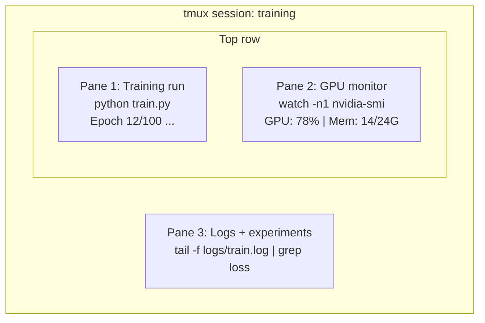

# Terminal & Shell , terminal ve Shell .

> Terminal, AI mühendislerinin yaşadığı yerdir.
> Sonunda bir AI mühendisi evinde kalıyorum.

**Type:** Learn | **类型:** 学习
**Languages:** -- | **语言:** 无
**Prerequisites:** Phase 0, Lesson 01 | **前置知识:** Phase 0, 第 01 课
**Time:** ~35 minutes | **时间:** ~35 分钟

## Öğrenme hedefleri

- - Çöp kullan, yönlendirmeler yap.`grep`Eğitim günlüğünü komut satırından filtrelemek ve işlemek
  Çinçe Çevirim: `grep`Emir Yolu ve İşleme Eğitim Günlüğü
- Aynı anda eğitim ve GPU izleme için birden fazla panel ile sürekli tmux seansları oluşturun
  Çinçe çevirisi: 创建带多面板的持久 tmux 会话,同时训练和监控 GPU için kullanılır
-  ile sistem ve GPU kaynaklarını izlemek`htop`- Evet .`nvtop`ve`nvidia-smi`
  Çeviri: Çeviri: Çeviri: Çeviri: Çeviri: Çeviri: Çeviri: Çeviri: Çeviri: Çeviri: Çeviri: Çeviri: Çeviri: Çeviri: Çeviri: Çeviri: Çeviri: Çeviri: Çeviri: Çeviri: Çeviri: Çeviri: Çeviri: Çeviri: Çeviri: Çeviri: Çeviri: Çeviri: Çeviri: Çeviri: Çeviri: Çeviri: Çeviri: Çeviri: Çeviri: Çeviri: Çeviri: Çeviri: Çeviri: Çeviri: Çeviri: Çeviri: Çeviri: Çeviri: Çeviri: Çeviri: Çeviri: Çeviri: Çeviri: Çeviri: Çeviri: Çeviri: Çeviri: Çeviri: Çeviri: Çeviri: Çeviri: Çeviri: Çeviri`htop`- Evet.`nvtop`和 `nvidia-smi` Kontrol sistemi ve GPU  kaynaklar
- SSH kullanarak yerel ve uzaktan makineler arasında dosya aktarımı, `scp`ve`rsync`
  Çeviri: SSH`scp`和 `rsync`Yerel ve uzaktan makineler arasında aktarım dosyaları

> **【中文解读】**
> 终端 is AI 工程师'ın en sık kullandığı araçlar── eğitim modeli、 denetim GPU、查看日志、遠程连接全部在终端完成──本章教你终端操作的核心技能:管道、tmux 会话、GPU 监控和文件传输──

## Sorunları anlatın.

Bu yüzden, bu programın en iyi yönlendirmesi, bu programın en iyi yönlendirmesi, bu programın en iyi yönlendirmesi, bu programın en iyi yönlendirmesi, bu programın en iyi yönlendirmesi, bu programın en iyi yönlendirmesi, bu programın en iyi yönlendirmesi, bu programın en iyi yönlendirmesi ve bu programın en iyi yönlendirmesi.

> Tüm bilgisayarlar, bilgisayarlar ve bilgisayarlar üzerinde çalışıyorlar. Bu yüzden, tüm bilgisayarlar ve bilgisayarlar, bilgisayarlar ve bilgisayarlar üzerinde çalışıyorlar.

Bu ders, Yapay zeka için önemli olan terminal becerileri kapsar.

> Bu ders sadece AI working içinde gerçekten ihtiyaç duyulan son beceri hakkında konuşuyor.

> **【中文解读】**
> AI mühendisleri, herhangi bir düzenleyici zamanından daha fazladır. Eğitim modeli, GPU'ları izleme, uzaktan SSH'yi kontrol etmek için terminal becerilerine bağlıdır.

## Konsepten bir şey.



Üç şey aynı anda çalışıyor, bir terminal, ayrılıp eve gidebilirsin, SSH'yi geri alabilirsin ve tekrar bağlayabilirsin.

> Üç görev aynı anda çalışmaktadır, bir terminal penceresi vardır.

> **【中文解读】**
> 终端复用是AI 工程师的核心技能――上图展示一个典型的tmux 会话:一个板跑训练一个板运行训练一个板监控 GPU一个板查看日志――三个任务同时在一个终端窗口中运行――断开SSH 后训练继续,第二天重新连接即可恢复――

> **【拓展：tmux 在 GPU 训练中的重要性】**
> AWS p4d  örneklerde(8x A100 GPU, yaklaşık $32.77/小时) üzerinde eğitim LLM, eğer laptop kapatılması nedeniyle eğitim kesintisi, sadece harcama tamamlanmış tüm hesaplamalar, aynı zamanda baştan yeniden eğitim gerekir.

## Yapın.
```figure
s0-shell-pipeline
```

## Yapın

### Adım 1: Kabuklarınızu Bilin

Hangi mermiyi kullanıyorsan kontrol et.

> Hangi kabuğu kullanıyorsanız kontrol edin:

```bash
echo $SHELL
```

Çoğu sistem kullanıyor `bash`veya `zsh`Her ikisi de iyi çalışıyor. Bu kursta komutlar her ikisinde de çalışıyor.

> % % % % % % % % % % % % % % % % % % % % % % % % % % % % % % % % % % % % % % % % % % % % % % % % % % % % % % % % % % % % % % % % % % % % % % % % % % % % % % % % % % % % % % % % % % % % % % % % % % % % % % % % % % % % % % % % % % % % % % % % % % % % % % % % % % % % % % % % % % % % % % % % % % % % % % % % % % % % % % % % % % % % % % % % % % % % % % % % % % % % % % % % % % % % % % % % % % % % % % % % % % % % % % % % % % % % % % % % % % % % % % % % % % % % % % % % % % % % % % % % % % % % % % % % % % % % % % % % % % % % % % % % % % % % % % % % % % % % % % % % % % % % % % % % % % % % % % % % % % % % % % % % % % % % % % % % % % % % % % % % % % % % % % % % % % % % % % % % % % % % % % % % % % % % % % % % % % % % % % % % % % % % % % % % % % % % % % % %`bash`Ya da`zsh`                                                                                                                                                                                                                                                              

Bilmeniz gereken önemli şeyler:

> 关键知识:

```bash
# Move around
cd ~/projects/ai-engineering-from-scratch
pwd
ls -la

# History search (most useful shortcut you'll learn)
# Ctrl+R then type part of a previous command
# Press Ctrl+R again to cycle through matches

# Clear terminal
clear   # or Ctrl+L

# Cancel a running command
# Ctrl+C

# Suspend a running command (resume with fg)
# Ctrl+Z
```

### Adım 2: Borular ve yönlendirmeler

Bu şekilde kayıtları, filtre çıkışını ve zincir araçlarını işleyeceksiniz.

> Bu şekilde bir günlüğü, bir çıkış ve bir bağlantı aracı kullanırsın.

> **【中文解读】**
> 管道 (pipe) x felsefesinin merkezi: her araç sadece bir şeyi yapar, 管道串联完成复杂任务──`cat train.log | grep "loss" | wc -l`Bu emirlerin anlamı:读取日志 → 过含"kayıp"ın 行 → 统计行数──重定向(`>`- Evet.`>>`- Evet.`2>`Bu işlemler, AI mühendislerinin günlük kullanımıyla yapılabilir.

```bash
# Count how many times "loss" appears in a log  统计日志中 "loss" 出现的次数
cat train.log | grep "loss" | wc -l

# Extract just the loss values from training output  提取训练输出中的 loss 值
grep "loss:" train.log | awk '{print $NF}' > losses.txt

# Watch a log file update in real time, filtering for errors  实时过滤错误日志
tail -f train.log | grep --line-buffered "ERROR"

# Sort experiments by final accuracy  按最终准确率排序实验结果
grep "final_accuracy" results/*.log | sort -t= -k2 -n -r

# Redirect stdout and stderr to separate files  分别重定向标准输出和标准错误
python train.py > output.log 2> errors.log

# Redirect both to the same file  将所有输出合并到同一文件
python train.py > train_full.log 2>&1
```

İhtiyacınız olan üç yönlendirme:

> Yapacağın üç yön vardır:

| Symbol | What it does |
|--------|-------------|
| `>` | Write stdout to file (overwrite) |
| `>>` | Append stdout to file |
| `2>` | Write stderr to file |
| `2>&1` | Send stderr to same place as stdout |
| `\|` | Send stdout of one command as stdin to the next |

| 符号 | 作用 |
|------|------|
| `>` | 将标准输出写入文件（覆盖） |
| `>>` | 将标准输出追加到文件 |
| `2>` | 将标准错误写入文件 |
| `2>&1` | 将标准错误合并到标准输出 |
| `\|` | 将一个命令的输出传给下一个命令 |

### Adım 3: Arka plan süreçleri

Eğitim saatlerce sürer, terminalini her zaman açık tutmak istemezsin.

> Eğitim süreci birkaç saat sürer.

```bash
# Run in background (output still goes to terminal)
python train.py &

# Run in background, immune to hangup (closing terminal won't kill it)
nohup python train.py > train.log 2>&1 &

# Check what's running in background
jobs
ps aux | grep train.py

# Bring a background job to foreground
fg %1

# Kill a background process
kill %1
# or find its PID and kill that
kill $(pgrep -f "train.py")
```

`&`- Evet .`nohup`ve`screen`- Ne ?`tmux`- ...

> `&`- Evet.`nohup`和 `screen`- Ne ?`tmux`Çeviri:

| Method | Survives terminal close? | Can reattach? |
|--------|-------------------------|---------------|
| `command &` | No | No |
| `nohup command &` | Yes | No (check log file) |
| `screen` / `tmux` | Yes | Yes |

| 方式 | 关闭终端后存活？ | 可重新连接？ |
|------|---------------|-------------|
| `command &` | 否 | 否 |
| `nohup command &` | 是 | 否（查看日志文件） |
| `screen` / `tmux` | 是 | 是 |

Birkaç dakikadan uzun süre, tmux kullanın.

> Bir kaç dakikadan fazla bir görev için, tmux kullanın.

### 4. adım: tmux

tmux, birden fazla panel ile sürekli terminal seansları oluşturmanıza olanak tanır.

> tmux 让你创建带多面板的持久终端会话──这是管理训练运行最有用的工具──

> **【中文解读】**
> tmux, bir çok panel oluşturmak için bir terminal kullanıcısıdır.

```bash
# Install
# macOS
brew install tmux
# Ubuntu
sudo apt install tmux

# Start a named session
tmux new -s training

# Split horizontally
# Ctrl+B then "

# Split vertically
# Ctrl+B then %

# Navigate between panes
# Ctrl+B then arrow keys

# Detach (session keeps running)
# Ctrl+B then d

# Reattach
tmux attach -t training

# List sessions
tmux ls

# Kill a session
tmux kill-session -t training
```

Tipik bir AI iş akışı oturum:

> Tipik AI 工作流会话:

```bash
tmux new -s train

# Pane 1: start training
python train.py --epochs 100 --lr 1e-4

# Ctrl+B, " to split, then run GPU monitor
watch -n1 nvidia-smi

# Ctrl+B, % to split vertically, tail the logs
tail -f logs/experiment.log

# Now detach with Ctrl+B, d
# SSH out, go get coffee, come back
# tmux attach -t train
```

### Adım 5: Htop ve nvtop ile izleme

```bash
# System processes (better than top)  系统进程监控（比 top 更好用）
htop

# GPU processes (if you have NVIDIA GPU)  GPU 进程监控
# Install: sudo apt install nvtop (Ubuntu) or brew install nvtop (macOS)
nvtop

# Quick GPU check without nvtop  快速查看 GPU 状态
nvidia-smi

# Watch GPU usage update every second  每秒刷新 GPU 使用情况
watch -n1 nvidia-smi

# See which processes are using the GPU  查看占用 GPU 的进程
nvidia-smi --query-compute-apps=pid,name,used_memory --format=csv
```

> **【拓展：GPU 监控在实际训练中的价值】**
> Çoklu GPU eğitiminde, GPU kullanım oranı %80'ten düşüktür. Genellikle bu, bir şişe olarak yüklenen veri anlamına gelir.`nvidia-smi`Yazı: GİVİDİŞİŞİŞİŞİŞİŞİŞİŞİŞİŞİŞİŞİŞİŞİŞİŞİŞİŞİŞİŞİŞİŞİŞİŞİŞİŞİŞİŞİŞİŞİŞİŞİŞİŞİŞİŞİŞİŞİŞİŞİŞİŞİŞİŞİŞİŞİŞİŞİŞİŞİŞİŞİŞİŞİŞİŞİŞİŞİŞİŞİŞİŞİŞİŞİŞİŞİŞİŞİŞİŞİŞİŞİŞİŞİŞİŞİŞİŞİŞİŞİŞİŞİŞİŞİŞİŞİŞİŞİŞİŞİŞİŞİŞİŞİŞİŞİŞİŞİŞİŞİŞİŞİŞİŞİŞİŞİŞİŞİŞİŞİŞİŞİŞİŞİŞİŞİŞİŞİŞİŞİŞİŞİŞİŞİŞİŞİŞİŞİŞİŞİŞİŞİŞİŞİŞİŞİŞİŞİŞİŞİŞİŞİŞİŞİŞİŞİŞİŞİŞİŞİŞİŞİŞİŞİŞİŞİŞİŞİŞİŞİŞİŞİŞİŞİŞİŞİŞİŞİŞİŞİŞİŞİŞİŞİŞİŞİŞİŞİŞİŞİŞİŞİŞİŞİŞİŞİŞİŞİŞİŞİŞİŞİŞİŞİŞİŞİŞİŞİŞİŞİŞİŞİŞİŞİŞİŞİŞİŞİŞİŞİŞİŞİŞİŞİŞİŞİŞİŞİŞİŞİŞİŞİŞİŞİŞİŞİŞİŞİŞİŞİŞİŞİŞİŞİŞİŞİŞİŞİŞİŞİŞİŞİŞİŞİŞİŞİŞİŞİŞİŞİŞ`--query-compute-apps`参数能精确找到哪个进程占用 GPU 显存 显存 显存 显存 显存 显存 显存 显存 显存 显存 显存 显存 显存 显存 显存 显存 显存 显存 显存 显存 显存 显存 显存 显存 显存 显存 显存 显存 显存 显存 显存 显存 显存 显存 显存 显存 显存 显存

`htop`Kullandığınız anahtar bağlamalar:

> `htop`常用快捷键:

- `F6`veya `>`sütunlara göre sıralamak (hüye kayıplarını bulmak için hafıza kayıplarına göre sıralamak)
  Çeviri:`F6`Ya da`>`按列排序(按内存排序找到内存泄漏)
- `F5`ağaç görünümünü değiştirmek için (bkz. çocuk süreçleri)
  Çeviri:`F5`切换树形视图(查看子进程)
- `F9`Bir süreci öldürmek için
  Çeviri:`F9`终止进程
- `/`Bir işlem adı aramak için
  Çeviri:`/`搜索进程名

### Adım 6: Uzak GPU kutuları için SSH

Bulut GPU'sunu kiraladığınızda (Lambda, RunPod, Vast.ai), SSH üzerinden bağlantı kurarsınız.

> Bir süre sonra, bir süre sonra, bir süre sonra, bir süre sonra, bir süre sonra, bir süre sonra, bir süre sonra, bir süre sonra, bir süre sonra, bir süre sonra, bir süre sonra, bir süre sonra, bir süre sonra, bir süre sonra, bir süre sonra, bir süre sonra, bir süre sonra, bir süre sonra, bir süre sonra, bir süre sonra, bir süre sonra, bir süre sonra, bir süre sonra, bir süre sonra, bir süre sonra, bir süre sonra, bir süre sonra, bir süre sonra, bir süre sonra, bir süre sonra, bir süre sonra, bir süre sonra, bir süre sonra, bir süre sonra, bir süre sonra, bir süre sonra, bir süre sonra, bir süre sonra, bir süre sonra, bir süre sonra, bir süre sonra, bir süre sonra, bir süre sonra, bir süre sonra, bir süre sonra, bir süre sonra, bir süre sonra, bir süre sonra, bir süre sonra, bir süre sonra, bir süre sonra, bir süre sonra, bir süre sonra, bir süre sonra, bir süre sonra, bir süre sonra, bir süre sonra, bir süre sonra, bir süre sonra, bir süre sonra, bir süre sonra, bir süre sonra, bir süre sonra, bir süre sonra, bir süre sonra, bir süre sonra, bir süre sonra, bir süre sonra, bir süre sonra, bir süre sonra, bir süre sonra, bir süre sonra, bir süre sonra, bir süre sonra, bir süre sonra, bir süre sonra, bir süre sonra, bir süre sonra, bir süre sonra, bir süre sonra, bir süre sonra, bir sürecececececececececececececececececececececececececececececececececececececececececececececececececececececececececececececececececececececececececececececececececececececececececececececececececececececececececececececececececececececececececececececececececececececececececececececececececececececececececececececececececececececececececececececececececececececececece

```bash
# Basic connection  基本 SSH 连接
ssh user@gpu-box-ip

# With a specific key  使用指定密钥连接
ssh -i ~/.ssh/my_gpu_key user@gpu-box-ip

# Copy files to remote  复制文件到远程服务器
scp model.pt user@gpu-box-ip:~/models/

# Copy files from remote  从远程服务器复制文件
scp user@gpu-box-ip:~/results/metrics.json ./

# Sync a whole directory (faster for many files)  同步整个目录（比 scp 更快）
rsync -avz ./data/ user@gpu-box-ip:~/data/

# Port forward (access remote Jupyter/TensorBoard locally)  端口转发（本地访问远程服务）
ssh -L 8888:localhost:8888 user@gpu-box-ip
# Now open localhost:8888 in your browser
```

# SSH yapılandırması kolaylık için
# ~/.ssh/config'e ekle:
# Ev sahibi Gpu
#     HostName 192.168.1.100
#     Kullanıcı Ubuntu
#     Kimlik Dosyası ~/.ssh/gpu_key
# Bir de bir de
# O zaman sadece:
# Ssh gpu
```

### Step 7: Useful aliases for AI work

> **【中文解读】**
> Shell 别名（alias）是将常用长命令缩短为短命令的方式。AI 工程中，`gpu` 查看 GPU 状态、`killtraining` 终止所有训练进程、`watchloss` 实时监控 loss——这些别名每天要用几十次。将它们加入 `~/.bashrc` 或 `~/.zshrc` 后，每次打开终端自动生效。

Add these to your `~/.bashrc` or `~/.zshrc`:

> 将这些添加到你的 `~/.bashrc` 或 `~/.zshrc`：

```bash
Kaynak aşamaları/00-setup-and-tooling/10-terminal-and-shell/code/shell_aliases.sh
```

Or copy the ones you want. The key aliases:

> 或者复制你想要的。关键别名：

```bash
# GPU durumu bir bakışta 一行查看 GPU  durumu
alias gpu='nvidia-smi --query-gpu=index,name,use.gpu,memory.used,memory.total,temperature.gpu --format=csv,noheader'

# Python eğitim sürecini kapat 终止所有训练进程
Alias killtraining='pkill -f "python.*train"'

# Hızlı sanal ortamı etkinleştir 快速激活虚拟环境
alias ae='source .venv/bin/activate'

# Geliştirme kaybını izle 实时监控geliştirme kaybı
- "Kırıklık" - "Kırıklık"
```

See `code/shell_aliases.sh` for the full set.

> 完整的别名列表参见 `code/shell_aliases.sh`。

> **【拓展：管道与重定向在 AI 日志分析中的威力】**
> 在 Google Brain 和 DeepMind，研究员用管道链处理实验日志：`grep "loss" train.log | awk '{print $3}' | sort -n | head -5` 可以在一秒内从百万行日志中找出 loss 最低的 5 个 epoch。这种技能不依赖任何 IDE 或 GUI 工具，在远程 GPU 服务器上尤其有用——那里只有终端可用。

### Step 8: Common AI terminal patterns

These come up repeatedly in practice:

> 这些模式在实践中反复出现：

> **【中文解读】**
> 这些是 AI 工程中反复出现的终端模式：用 `tee` 同时输出到终端和日志文件、用 `diff` 对比实验结果、用 `find` 找到最大的模型文件清理磁盘、用 `tar` 解压数据集。掌握这些命令组合能大幅提升日常效率。

```bash
# Eğitim yap, her şeyi kaydet, bittiğinde haber ver.
Python train.py 2>&1 ✓ tee train.log; echo "DONE" ✓ mail -s "Training complete" you@email.com

# İki deney logunu yan yana karşılaştır
<(grep "sağlık" exp1.log) <(grep "sağlık" exp2.log)

# En büyük model dosyalarını bul (disk alanını temizle)
-Name "*.pt" -o-name "*.sefetensors"

# Hugging Face'dan bir model indir
- Evet .https://huggingface.co/model/resolve/main/model.safetensors

# Veriler kümesini çöz
tar xzf veri kümesi.tar.gz -C ./data/

# Tüm Python dosyalarında satır sayın (projenin ne kadar büyük olduğunu görün)
- Adı "*py" .

# Disk alanını kontrol edin (öğretim verileri diskleri hızlı doldurur)
df -h
-sh./data/*

# Eğitimden önce çevre değişkeninin kontrolü
- Ben de çok iyiyim.
- Ben de meşaleyi yakaladım.
```

## Use It | 用框架实现

Here's when each tool comes into play during this course:

> 以下是每个工具在本课程中的使用场景：

| Tool | When you use it |
|------|----------------|
| tmux | Every training run (Phases 3+) |
| `tail -f` + `grep` | Monitoring training logs |
| `nohup` / `&` | Quick background tasks |
| `htop` / `nvtop` | Debugging slow training, OOM errors |
| SSH + `rsync` | Working on cloud GPUs |
| Piping + redirects | Processing experiment results |
| Aliases | Saving time on repetitive commands |

| 工具 | 使用场景 |
|------|---------|
| tmux | 所有训练任务（Phase 3+） |
| `tail -f` + `grep` | 监控训练日志 |
| `nohup` / `&` | 快速后台任务 |
| `htop` / `nvtop` | 排查训练慢、OOM 错误 |
| SSH + `rsync` | 云 GPU 工作 |
| 管道 + 重定向 | 处理实验结果 |
| 别名 | 节省重复命令时间 |

> **【拓展：AI 工程师的终端工作流】**
> 一个高效的 AI 工程师通常同时维护 2-3 个 tmux 会话：一个用于训练（长时间运行）、一个用于数据处理和调试、一个用于监控。SSH config 文件可以简化连接——配置好后只需 `ssh gpu` 就能连上远程服务器。rsync 是传输大数据集的最佳选择，它只传输变化的字节，支持断点续传，比 scp 快 10 倍以上。

## Exercises | 练习题

1. Install tmux, create a session with three panes, and run `htop` in one, `watch -n1 date` in another, and a Python script in the third. Detach and reattach.
   安装 tmux，创建包含三个面板的会话，分别运行 htop、定时命令和 Python 脚本，然后分离并重新连接。
2. Add the aliases from `code/shell_aliases.sh` to your shell config and reload with `source ~/.zshrc` (or `~/.bashrc`).
   将 `code/shell_aliases.sh` 中的别名添加到你的 shell 配置中并重载。
3. Create a fake training log with `for i in $(seq 1 100); do echo "epoch $i loss: $(echo "scale=4; 1/$i" | bc)"; sleep 0.1; done > fake_train.log` and then use `grep`, `tail`, and `awk` to extract just the loss values.
   创建模拟训练日志，用 `grep`、`tail` 和 `awk` 提取 loss 值。
4. Set up an SSH config entry for a server you have access to (or use `localhost` to practice the syntax).
   为你有权限的服务器设置 SSH config 条目。

## Key Terms | 关键术语

| Term | What people say | What it actually means |
|------|----------------|----------------------|
| Shell | "The terminal" | The program that interprets your commands (bash, zsh, fish) |
| tmux | "Terminal multiplexer" | A program that lets you run multiple terminal sessions inside one window, and detach/reattach |
| Pipe | "The bar thing" | The `\|` operator that sends one command's output as input to another |
| PID | "Process ID" | A unique number assigned to every running process, used to monitor or kill it |
| nohup | "No hangup" | Runs a command immune to the hangup signal, so closing the terminal won't kill it |
| SSH | "Connecting to the server" | Secure Shell, an encrypted protocol for running commands on a remote machine |

| 术语 | 俗称 | 实际含义 |
|------|------|---------|
| Shell | "终端" | 解释执行命令的程序（bash、zsh、fish） |
| tmux | "终端复用器" | 在一个窗口中运行多个终端会话，支持分离/重连 |
| Pipe（管道） | "竖线那个" | `\|` 操作符，将一个命令的输出传给另一个命令 |
| PID | "进程号" | 每个运行进程的唯一编号，用于监控或终止 |
| nohup | "不挂断" | 关闭终端也不会终止命令 |
| SSH | "连服务器" | 安全外壳协议，用于远程执行命令 |
