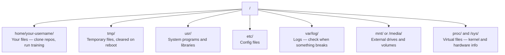

# Linux AI için Linux tabanı

> Çoğu AI Linux'ta çalışır.
> Çoğu AI Linux'ta çalışır. Yeterince bilgi sahibi olmak gerekir.

**Type:** Learn | **类型:** 学习
**Languages:** -- | **语言:** 无
**Prerequisites:** Phase 0, Lesson 01 | **前置知识:** Phase 0, 第 01 课
**Time:** ~30 minutes | **时间:** ~30 分钟

## Öğrenme hedefleri

- Linux dosya sistemini gezin ve komut satırından gerekli dosya işlemlerini yap
  Çinçe çevirisi: in Linux 文件系统中导航, from命令行执行基本文件操作
- Dosya izinlerini  ile yönet`chmod`ve `chown`"Yasal izin reddedildi" hatalarını çözmek için
  Çeviri: Çeviri: Çeviri: Çeviri: Çeviri: Çeviri: Çeviri: Çeviri: Çeviri: Çeviri: Çeviri: Çeviri: Çeviri: Çeviri: Çeviri: Çeviri: Çeviri: Çeviri: Çeviri: Çeviri: Çeviri: Çeviri: Çeviri: Çeviri: Çeviri: Çeviri: Çeviri: Çeviri: Çeviri: Çeviri: Çeviri: Çeviri: Çeviri: Çeviri: Çeviri: Çeviri: Çeviri: Çeviri: Çeviri: Çeviri: Çeviri: Çeviri: Çeviri: Çeviri: Çeviri: Çeviri: Çeviri: Çeviri: Çeviri: Çeviri: Çeviri: Çeviri: Çeviri: Çeviri: Çeviri: Çeviri: Çeviri: Çeviri: Çeviri`chmod`和 `chown`管理文件权限,解决"Yarık izin" hata
-  ile sistem paketlerini yükle`apt`Ve yeni bir GPU kutu kurmak için AI çalışma
  Çeviri: Çeviri: Çeviri: Çeviri: Çeviri: Çeviri: Çeviri: Çeviri: Çeviri: Çeviri: Çeviri: Çeviri: Çeviri: Çeviri: Çeviri: Çeviri: Çeviri: Çeviri: Çeviri: Çeviri: Çeviri: Çeviri: Çeviri: Çeviri: Çeviri: Çeviri: Çeviri: Çeviri: Çeviri: Çeviri: Çeviri: Çeviri: Çeviri: Çeviri: Çeviri: Çeviri: Çeviri: Çeviri: Çeviri: Çeviri: Çeviri: Çeviri: Çeviri: Çeviri: Çeviri: Çeviri: Çeviri: Çeviri: Çeviri: Çeviri: Çeviri: Çeviri: Çeviri: Çeviri: Çeviri: Çeviri: Çeviri: Çeviri: Çeviri`apt`Yeni GPU için sistem paketleri, servisçi konfigürasyonu AI  çalışma ortamı
- Uzak makinelerde çalışan geliştiricilerin sıklıkla hata yapan macOS-Linux arasındaki farkları tanımlayın
  Çinçe çevirisi: 识别 macOS 切换到 Linux 时常见的踩坑点

> **【中文解读】**
> Çoğu AI eğitimi Linux sunucularında çalışır. SSH'yi bulutlu GPU'ya geçirdiğinde, yalnızca bir terminal arayüzü vardır.

## Sorunları anlatın.

MacOS veya Windows'ta geliştirilir. Ama bulutlu bir GPU kutuya SSH'yi, Lambda örneğini kiraladığınızda veya EC2 makinesini döndürdüğünüzde Ubuntu'ya yerleşirsiniz. Terminal tek arayüzün. Arayan, Explorer, GUI yok. Dosya sistemini gezinemiyorsanız, paketleri yükleyemezseniz ve komut satırından işlemleri yönetemiyorsanız, "Linux'da bir dosyayı nasıl açılır" diye bir Google'da çalışırken, boş GPU saatleri için ödeme yapıyorsunuz.

> MacOS veya Windows'ta geliştirilmektedir. Ancak bir kez SSH'yi bulutlu GPU sunucusu'na ulaştığınızda Lambda'yı kiraladığınızda veya EC2 makinelerini başlattığınızda, Ubuntu'ya girmiş olursunuz.

Bu bir hayatta kalma rehberidir. Yapay zeka için uzaktan bir Linux makinesi üzerinde çalışmak için tam olarak ne ihtiyacınız olduğunu kapsar.

> Bu bir yaşam rehberi. Sadece uzaktan Linux makinelerinde AI'nin çalışması için gereken bilgiyi kapsar.

> **【中文解读】**
> MacOS veya Windows'ta geliştirilmiş, ancak bir SSH'ye bir bulut GPU sunucusu Linux'a girdi.

## Dosya Sistem Layout

Linux her şeyi tek bir kök altında organize eder .`/`- Yok .`C:\`veya `/Volumes`Dokunacağın dizinler:

> Linux tüm içeriği tek bir dizinle organize edecek .`/`Aşağıda yok.`C:\`Ya da`/Volumes`你实际会接触的目录:

> **【中文解读】**
> Linux dosya sistemi tek bir ağaç şeklinde yapı, kök dizisi`/`- Evet.`/home/用户名/`(简写 `~`Bu senin iş defterin. Hemen hemen tüm işlemler burada yapılıyor.`/tmp/`存临时文件,重启后清空──`/var/log/`Sorun çıkmak için zaman ayırmak gerekir.`/mnt/`Bu yapı, Linux'un servisçilerinde çalışmanın temelinde anlaşılır.



Ev defteriniz `~`veya `/home/your-username`Neredeyse yaptığın her şey burada olur.

> Senin başlık defterin de bu.`~`Ya da`/home/your-username`Neredeyse tüm operasyonlar burada yapılıyor.

## Eseryal Komutlar.

Bunlar uzaktan bir GPU kutusunda yapacağınız şeyin %95'ini kapsayan 15 komut.

> Bu 15 emir, uzaktan GPU sunucularında 95% çalışmayı kapsar.

> **【中文解读】**
> Uzaktan Linux sunucusunda 95%'i tamamlayabilmek için sadece 15 emir öğrenmelisiniz. Bu emirler dört sınıfta ayrılmıştır:导航(pwd、ls、cd) 文件操作(cp、mv、rm、mkdir) 查看文件(cat、head、tail、grep) ve arama 搜索(find、grep杂r) ◊ Bu emirleri öğrenmek için GUI 工具更实用──

### Etrafta hareket ediyorum.

```bash
pwd                         # Where am I?  当前在哪个目录？
ls                          # What's here?  列出当前目录内容
ls -la                      # What's here, including hidden files with details?  详细列出所有文件（含隐藏文件）
cd /path/to/dir             # Go there  切换到指定目录
cd ~                        # Go home  回到主目录
cd ..                       # Go up one level  返回上一级目录
```

### Dosya ve Dizinler

```bash
mkdir my-project            # Create a directory  创建目录
mkdir -p a/b/c              # Create nested directories in one shot  递归创建多级目录

cp file.txt backup.txt      # Copy a file  复制文件
cp -r src/ src-backup/      # Copy a directory (recursive)  递归复制目录

mv old.txt new.txt          # Rename a file  重命名文件
mv file.txt /tmp/           # Move a file  移动文件

rm file.txt                 # Delete a file (no trash, it's gone)  删除文件（无法恢复！）
rm -rf my-dir/              # Delete a directory and everything inside  递归删除目录（危险操作！）
```

`rm -rf`Giriş'e vurmadan önce yolun kontrolünü yap.

> `rm -rf`Bu, bir süredir devamlı olarak kaldırılıyor.

### Dosyaları okuyorum . Dosyaları izle .

```bash
cat file.txt                # Print entire file  打印整个文件内容
head -20 file.txt           # First 20 lines  查看前 20 行
tail -20 file.txt           # Last 20 lines  查看后 20 行
tail -f log.txt             # Follow a log file in real time (Ctrl+C to stop)  实时跟踪日志文件
less file.txt               # Scroll through a file (q to quit)  分页浏览文件
```

### Arama ve arama

```bash
grep "error" training.log           # Find lines containing "error"  搜索包含 "error" 的行
grep -r "learning_rate" .           # Search all files in current directory  递归搜索所有文件
grep -i "cuda" config.yaml          # Case-insensitive search  不区分大小写搜索

find . -name "*.py"                 # Find all Python files under current dir  查找所有 Python 文件
find . -name "*.ckpt" -size +1G     # Find checkpoint files larger than 1GB  查找大于 1GB 的检查点文件
```

## İzinler , dosya hakkı .

Linux'taki her dosyanın sahibi ve izin bitleri vardır. Skriptler çalıştırılmadığında veya bir dizinye yazabilmediğinde buna rastlanırsınız.

> Linux'taki her dosyanın sahibi ve yetki alanı vardır. Yazıların yürütülmediği veya katalogda yazılamadığı zaman bu soruna rastlanırsınız.

> **【中文解读】**
> Linux 权限分为三组:文件所有者 (文件所有者) 、同组用户 (user) 、其他用户 (user) 、其他用户 (user) 、 每组有读 (读) 、写 (写) 、执行 (exe) 、 x) 三种权限──`chmod +x`让脚本可执行,`chmod 644`設定文件为所有者可读写、其他人只读──"Yasal izin" 错误几乎可以使用`chmod`Ya da`sudo`Çözmek.

```bash
ls -l train.py
# -rwxr-xr-- 1 user group 2048 Mar 19 10:00 train.py
#  ^^^             owner permissions: read, write, execute
#     ^^^          group permissions: read, execute
#        ^^        everyone else: read only
```

Genel düzeltmeler:

> 常见修复方法:

```bash
chmod +x train.sh           # Make a script executable  让脚本可执行
chmod 755 deploy.sh         # Owner: full, others: read+execute  所有者全部权限，其他人可读可执行
chmod 644 config.yaml       # Owner: read+write, others: read only  所有者可读写，其他人只读

chown user:group file.txt   # Change who owns a file (needs sudo)  修改文件所有者（需要 sudo）
```

Bir şey "Izin reddedildi" derse, neredeyse her zaman izin sorunu olur.`chmod +x`veya `sudo`Çoğu davası düzeltecek.

> "Yasal izin" ortaya çıktığında, neredeyse her zaman bir hak sorunu vardır.`chmod +x`Ya da`sudo`能解决大多数情况――

## Paket Yönetimi (apt) 包管理

Ubuntu kullanıyor `apt`Sistem düzeyinde yazılım kurmak için bu şekilde.

> Ubuntu kullan `apt`Bu sistemli bir yazılımdır.

```bash
sudo apt update             # Refresh the package list (always do this first)  更新软件包列表（首先执行）
sudo apt install -y htop    # Install a package (-y skips confirmation)  安装软件包（-y 跳过确认）
sudo apt install -y build-essential  # C compiler, make, etc. Needed by many Python packages  C 编译器和构建工具
sudo apt install -y tmux    # Terminal multiplexer (keep sessions alive after disconnect)  终端复用器

apt list --installed        # What's installed?  查看已安装的软件包
sudo apt remove htop        # Uninstall  卸载软件包
```

> **【中文解读】**
> `apt`Ubuntu'nun paket yöneticisi.`apt update`Yeni bir listeyi yenile.`build-essential`C 编译器,很多 Python 包(如numpy、torch) needs it to compile──`tmux`Bu, uzun mesafeli konuşmayı kesilmeden sürdürmenin bir temel araçtır.

> **【拓展：新 GPU 服务器的初始化清单】**
> Yeni bir GPU sunucusu elde edildikten sonra, genellikle:`apt update && apt install -y build-essential git curl wget tmux htop unzip python3-venv` Sonra NVIDIA 驱动和 CUDA Toolkit yükle, conda/uv──AWS EC2'nin derin öğrenme AMI'si yeniden yükle  Çoğu araç önceden yüklenmiştir, ancak Lambda Labs 和 Vast.ai'nin örnekleri genellikle manuel başlangıç gerektirir──

Yeni bir GPU kutuya yükleyeceğiniz ortak paketler:

> Yeni GPU sunucuları üzerinde genellikle yüklenecek paket:

```bash
sudo apt update && sudo apt install -y \
    build-essential \
    git \
    curl \
    wget \
    tmux \
    htop \
    unzip \
    python3-venv
```

## Kullanıcı ve sudo Kullanıcı ve yetki yükseltme

Genellikle normal bir kullanıcı olarak giriş yapıyorsunuz. Bazı işlemlere root (admin) erişimi gerekmektedir.

> Genellikle normal kullanıcı girişleri vardır. Bazı işlemler root yöneticisi hakkı gerektirir.

```bash
whoami                      # What user am I?  查看当前用户名
sudo command                # Run a single command as root  以 root 权限执行命令
sudo su                     # Become root (exit to go back, use sparingly)  切换为 root 用户（谨慎使用）
```

> **【中文解读】**
> Linux'un zorlu bir yetki seviyesine sahiptir.`sudo`(superuser do) ―― en iyi uygulama sadece gerekli zamanlarda kullanmaktır `sudo`, uzun süre root olarak çalışmayın böylece sistem dosyalarını yanlış silmeyi önleyebilirsiniz.

Bulut GPU örneklerinde, genellikle tek kullanıcı ve zaten sudo erişiminiz vardır. Her şeyi root olarak çalıştırmayın.

> Bulut GPU'sunda, genellikle tek kullanıcı ve zaten sudo  yetkisi vardır.

## Süreç ve sistem yönetimi

Eğitiminiz bitince veya ne olduğunu kontrol etmeniz gerektiğinde:

> Eğitim sırasında veya çalışmakta olan süreci kontrol etmek için:

```bash
htop                        # Interactive process viewer (q to quit)  交互式进程查看器
ps aux | grep python        # Find running Python processes  查找 Python 进程
kill 12345                  # Gracefully stop process with PID 12345  优雅终止进程
kill -9 12345               # Force kill (use when graceful doesn't work)  强制终止进程
nvidia-smi                  # GPU processes and memory usage  查看 GPU 进程和显存
```

> **【中文解读】**
> Eğitimdeyken, kullan.`htop`查看哪个进程占用资源,用 `kill`终止失控的进程──`kill -9`- Evet, sadece normal.`kill`无效时使用──`nvidia-smi`GPU'nun hangi süreçleri kullanıyor olduğunu görebilmek için CPU'nun süreç yönetiminin temel emri.

Sistemd hizmetleri yönetir ( arka plan daemonları).

> Sistemd 管理服务 (后台守护进程) 〜 Eğer bir servisci kullanırsan, kullanırsın:

```bash
sudo systemctl start nginx          # Start a service  启动服务
sudo systemctl stop nginx           # Stop it  停止服务
sudo systemctl restart nginx        # Restart it  重启服务
sudo systemctl status nginx         # Check if it's running  查看服务状态
sudo systemctl enable nginx         # Start automatically on boot  设置开机自启
```

## Disk alanı disk alanı

GPU kutuları genellikle sınırlı disk alanına sahiptir.

> GPU sunucusunun disk alanı genellikle sınırlıdır.

```bash
df -h                       # Disk usage for all mounted drives  查看所有磁盘使用情况
df -h /home                 # Disk usage for /home specifically  查看 /home 分区使用情况

du -sh *                    # Size of each item in current directory  查看当前目录各项大小
du -sh ~/.cache             # Size of your cache (pip, huggingface models land here)  缓存目录大小
du -sh /data/checkpoints/   # Check how big your checkpoints are  检查检查点文件大小

# Find the biggest space hogs  找出最大的空间占用
du -h --max-depth=1 / 2>/dev/null | sort -hr | head -20
```

> **【中文解读】**
> GPU  sunucularının disk alanı sık sık yetersizlidir.`df -h`查看整体磁盘使用,用 `du -sh *`找到具体哪个目录占占空间最多──定期清理 `~/.cache/huggingface/`Ve eski kontrol nokta dosyaları.

Ortak uzay tasarrufu cihazları:

> 常见的空间清理方法:

```bash
# Clear pip cache  清理 pip 缓存
pip cache purge

# Clear apt cache  清理 apt 缓存
sudo apt clean

# Remove old checkpoints you don't need  删除不需要的旧检查点
rm -rf checkpoints/epoch_01/ checkpoints/epoch_02/
```

## Ağlama , ağlama

Modeller indirilir, dosyaları aktarılır ve komut satırından API'leri vurursunuz.

> Bu yüzden, bu şekilde, bu şekilde, bu şekilde, bu şekilde, bu şekilde, bu şekilde, bu şekilde, bu şekilde, bu şekilde, bu şekilde, bu şekilde, bu şekilde, bu şekilde, bu şekilde, bu şekilde, bu şekilde, bu şekilde, bu şekilde, bu şekilde, bu şekilde, bu şekilde, bu şekilde, bu şekilde, bu şekilde, bu şekilde, bu şekilde, bu şekilde, bu şekilde, bu şekilde, bu şekilde, bu şekilde, bu şekilde, bu şekilde, bu şekilde, bu şekilde, bu şekilde, bu şekilde, bu şekilde, bu şekilde, bu şekilde, bu şekilde, bu şekilde, bu şekilde, bu şekilde, bu şekilde, bu şekilde, bu şekilde, bu şekilde, bu şekilde, bu şekilde, bu şekilde, bu şekilde, bu şekilde, bu şekilde,

```bash
# Download files  下载文件
wget https://example.com/model.bin                   # Download a file  下载文件
curl -O https://example.com/data.tar.gz              # Same thing with curl  用 curl 下载
curl -s https://api.example.com/health | python3 -m json.tool  # Hit an API, pretty-print JSON  调用 API 并格式化输出

# Transfer files between machines  在机器间传输文件
scp model.bin user@remote:/data/                     # Copy file to remote machine  复制文件到远程机器
scp user@remote:/data/results.csv .                  # Copy file from remote to local  从远程复制到本地
scp -r user@remote:/data/checkpoints/ ./local-dir/   # Copy directory  复制整个目录

# Sync directories (faster than scp for large transfers, resumes on failure)  同步目录（比 scp 快，支持断点续传）
rsync -avz --progress ./data/ user@remote:/data/
rsync -avz --progress user@remote:/results/ ./results/
```

> **【中文解读】**
> 网络命令是AI 工程师的日常工具──`wget`和 `curl`Aşağıda Modell&Data Collection`scp`Yerel ve uzaktan makineler arasında kopyalama dosyası.`rsync`Bu, sadece değişik şifreyi aktarmanın en başlıca seçeneği, bir dizi değişikliği desteklemektedir, bir dizi değişikliği daha hızlı bir şekilde aktarılır.

> **【拓展：rsync 在 AI 工作流中的关键作用】**
> AWS p4d örneğinde bir LLM'yi tamamladığınızda, 50GB'lik bir kontrol noktasını yerel olarak aktarmanız gerekir.

Kullanım`rsync`- Tamam .`scp`Sadece değişen baytları aktarır ve kesilmiş bağlantıları ele alır.

>                                                                                                                                                                                                                                                                                                                                                                                                                                                                                                                              `rsync`Hayır.`scp`❖ Sadece değişken şifreyi aktarır, ❖ kesinti bağlantısını işleyebilir.

## Sessions'i canlı tut.

Uzaktan bir kutuya girerken dizüstü bilgisayarınızı kapatmak eğitim koşunuzu öldürür.

> Uzak servislere ulaştığınızda, bu durumdan kaçınmak için kapatın.

```bash
tmux new -s train           # Start a new session named "train"  创建名为 "train" 的新会话
# ... start your training, then:
# Ctrl+B, then D            # Detach (training keeps running)  分离会话（训练继续运行）

tmux ls                     # List sessions  列出所有会话
tmux attach -t train        # Reattach to session  重新连接到会话

# Inside tmux:  tmux 内操作：
# Ctrl+B, then %            # Split pane vertically  垂直分割面板
# Ctrl+B, then "            # Split pane horizontally  水平分割面板
# Ctrl+B, then arrow keys   # Switch between panes  切换面板
```

> **【中文解读】**
> tmux is a remote GPU 训练的保命工具──没有 tmux,关闭SSH 连接或笔记本电脑就会终止训练──用 tmux 创建会话后,`Ctrl+B, D`Ayrıl, antrenmanın ardından devam et.`tmux attach`重新连接──长时间训练任务必须用tmux──

Hep uzun süre eğitim işleri yaparlar.

> 长时间训练任务务必在tmux 中运行――务必如此――

> **【拓展：Linux 在 AI 基础设施中的统治地位】**
> Küresel olarak %99'dan fazla AI eğitimi Linux üzerinde çalışır. AWS, GCP, Azure'un GPU örnekleri tümü Linux üzerinde çalışır.

## Windows Kullanıcıları için WSL2

> **【中文解读】**
> WSL2  Windows kullanıcılarının gerçek Linux  ortamı elde etmelerine izin ver, hiçbir iki sistemin gerekmediği için.`/mnt/c/Users/用户名/`访问── Windows kullanıcılarının Linux ve AI geliştirmesi için en iyi çözümdür──

Windows'taysanız, WSL2 size çift başlatmadan gerçek bir Linux ortamı verir.

> Windows kullanıyorsanız, WSL2'nin gerçek bir Linux ortamı sağlayabilmesi için iki sistem gerekmiyor.

```bash
# In PowerShell (admin)
wsl --install -d Ubuntu-24.04

# After restart, open Ubuntu from Start menu
sudo apt update && sudo apt upgrade -y
```

WSL2 gerçek bir Linux çekirdeği çalıştırıyor. Bu dersdeki her şey içeride çalışıyor. Windows dosyalarınız`/mnt/c/Users/YourName/`WSL'nin içinden.

> WSL2 运行真正的Linux内核──本课的内容都可在其中使用──Windows 文件在 WSL内通过 `/mnt/c/Users/YourName/`访问。

GPU pasthrough Windows tarafında kurulan NVIDIA sürücülerle çalışır. Windows NVIDIA sürücüsünü (Linux değil) yükleyin ve CUDA WSL2 içinde kullanılabilir olacaktır.

> GPU doğrudan Windows 侧安装的NVIDIA 驱动工作──安装 Windows 版 NVIDIA 驱动(不是Linux 版),CUDA 就能在 WSL2 内使用──

> **【拓展：WSL2 GPU 支持的实际表现】**
> WSL2'nin GPU doğrudan performansı orijinal Linux, PyTorch ve TensorFlow'a yakın.`nvidia-smi`Windows'un GPU'sını görebilirsiniz.`/mnt/c/`) WSL2 orijinal dosya sisteminden 3-5 kat daha yavaş.`~/`Şu anda en iyi performans elde etmek için.

## MacOS Linux'a MacOS Linux'a basma yönlendirmesi

MacOS'tan geliyorsa sizi tökezletecek şeyler:

> MacOS'tan geçersen bu şeyler seni bir yere sokar:

| macOS | Linux | Notes |
|-------|-------|-------|
| `brew install` | `sudo apt install` | Different package names sometimes. `brew install htop` vs `sudo apt install htop` works the same, but `brew install readline` vs `sudo apt install libreadline-dev` does not. |
| `open file.txt` | `xdg-open file.txt` | But you won't have a GUI on a remote box. Use `cat` or `less`. |
| `pbcopy` / `pbpaste` | Not available | Pipe to/from clipboard doesn't exist over SSH. |
| `~/.zshrc` | `~/.bashrc` | macOS defaults to zsh. Most Linux servers use bash. |
| `/opt/homebrew/` | `/usr/bin/`, `/usr/local/bin/` | Binaries live in different places. |
| `sed -i '' 's/a/b/' file` | `sed -i 's/a/b/' file` | macOS sed needs an empty string after `-i`. Linux does not. |
| Case-insensitive filesystem | Case-sensitive filesystem | `Model.py` and `model.py` are two different files on Linux. |
| Line endings `\n` | Line endings `\n` | Same. But Windows uses `\r\n`, which breaks bash scripts. Run `dos2unix` to fix. |

| macOS | Linux | 注意事项 |
|------|------|---------|
| `brew install` | `sudo apt install` | 包名有时不同，如 readline vs libreadline-dev |
| `open file.txt` | `xdg-open file.txt` | 远程服务器无 GUI，用 `cat` 或 `less` |
| `pbcopy` / `pbpaste` | 不可用 | SSH 下无法操作剪贴板 |
| `~/.zshrc` | `~/.bashrc` | macOS 默认 zsh，Linux 服务器多用 bash |
| `/opt/homebrew/` | `/usr/bin/`, `/usr/local/bin/` | 可执行文件路径不同 |
| `sed -i '' 's/a/b/' file` | `sed -i 's/a/b/' file` | macOS sed 的 `-i` 后需要空字符串 |
| 大小写不敏感 | 大小写敏感 | `Model.py` 和 `model.py` 是两个不同文件 |
| 换行符 `\n` | 换行符 `\n` | 相同，但 Windows 的 `\r\n` 会破坏 bash 脚本 |

## Hızlı İpucu Kartı .

```
Navigation:     pwd, ls, cd, find
Files:          cp, mv, rm, mkdir, cat, head, tail, less
Search:         grep, find
Permissions:    chmod, chown, sudo
Packages:       apt update, apt install
Processes:      htop, ps, kill, nvidia-smi
Services:       systemctl start/stop/restart/status
Disk:           df -h, du -sh
Network:        curl, wget, scp, rsync
Sessions:       tmux new/attach/detach
```

## Egzersizler.
```figure
s0-process-fork
```

## Egzersizler

1. SSH'yi herhangi bir Linux makinesine (veya WSL2'yi aç) ekleyin ve ev dizinize gezinin.`touch`, sonra onları listede bul .`ls -la`- Evet .
   SSH Linux 机器,创建项目文件和空文件,用 `ls -la`列出
2. Kurulum`htop`apt ile çalıştırıp en çok hafıza kullanan işlemleri belirleyin.
   Htop'u kullanıp en fazla bellekyi kullanan süreçleri bul
3. Bir tmux seansı başlatın, çalışın.`sleep 300`İçeride, ayrılıp, seansları listele ve tekrar bağla.
   创建 tmux 会话,运行睡眠 命令,分离后重新连接
4. Kullanım`df -h`Kullanılabilir disk alanını kontrol etmek için, sonra kullan `du -sh ~/.cache/*`- Kayınatkasında ne yer alıyorsa onu bul.
   Disk disk alanını kontrol et, depoda en fazla alanı kapsayan içeriği bul
5. Lokal makinenizden bir dosyayı uzaktan birine aktarmak için `scp`, sonra aynı transferü yap `rsync`Ve deneyimi karşılaştır.
   SCP ve Rsync ile iki farklı yolla
