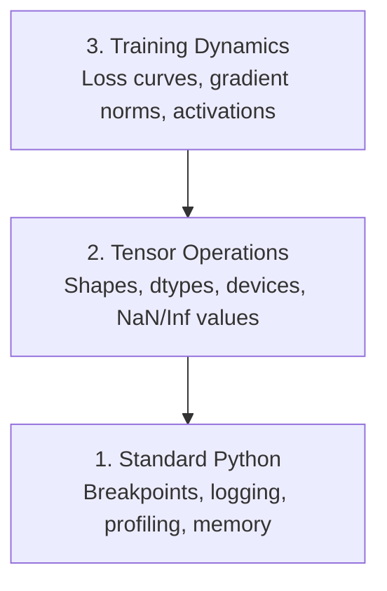

# Çözüm ve Profilleme 调试与性能分析

> En kötü AI böcekleri çökmezler. Çöp üzerinde sessizce eğitim alırlar ve güzel bir kayıp eğri rapor ederler.
> En kötü AI hataları programın çökmesine izin vermezler. Onlar çöp verilerinde sessizce eğitilirler ve sonra güzel bir kayıp kayıpları rapor ederler.

**Type:** Build | **类型:** 构建
**Language:**Python .**语言:**Python
**Prerequisites:** Lesson 1 (Dev Environment), basic PyTorch familiarity | **前置知识:** 第 1 课（开发环境），基本 PyTorch 知识
**Time:** ~60 minutes | **时间:** ~60 分钟

## Öğrenme hedefleri

- Şartlı kullan `breakpoint()`ve `debug_print`Tenzor şekilleri, dtypleri ve NaN değerlerini eğitimin ortasında incelemek için
  Çeviri: Çeviri: Çeviri: Çeviri: Çeviri: Çeviri: Çeviri: Çeviri: Çeviri: Çeviri: Çeviri: Çeviri: Çeviri: Çeviri: Çeviri: Çeviri: Çeviri: Çeviri: Çeviri: Çeviri: Çeviri: Çeviri: Çeviri: Çeviri: Çeviri: Çeviri: Çeviri: Çeviri: Çeviri: Çeviri: Çeviri: Çeviri: Çeviri: Çeviri: Çeviri: Çeviri: Çeviri: Çeviri: Çeviri: Çeviri: Çeviri: Çeviri: Çeviri: Çeviri: Çeviri: Çeviri: Çeviri: Çeviri: Çeviri: Çeviri: Çeviri: Çeviri: Çeviri: Çeviri: Çeviri: Çeviri: Çeviri: Çeviri: Çeviri: Çeviri: Çeviri`breakpoint()`和 `debug_print`Eğitim sürecinde 张量形状、数据类型和 NaN 值
- Profil eğitim döngüleri `cProfile`- Evet .`line_profiler`ve`tracemalloc`Şişek boynuzları bulmak için
  Çeviri: Çeviri: Çeviri: Çeviri: Çeviri: Çeviri: Çeviri: Çeviri: Çeviri: Çeviri: Çeviri: Çeviri: Çeviri: Çeviri: Çeviri: Çeviri: Çeviri: Çeviri: Çeviri: Çeviri: Çeviri: Çeviri: Çeviri: Çeviri: Çeviri: Çeviri: Çeviri: Çeviri: Çeviri: Çeviri: Çeviri: Çeviri: Çeviri: Çeviri: Çeviri: Çeviri: Çeviri: Çeviri: Çeviri: Çeviri: Çeviri: Çeviri: Çeviri: Çeviri: Çeviri: Çeviri: Çeviri: Çeviri: Çeviri: Çeviri: Çeviri: Çeviri: Çeviri: Çeviri: Çeviri: Çeviri: Çeviri: Çeviri: Çeviri`cProfile`- Evet.`line_profiler`和 `tracemalloc`分析训练循环, 找到性能瓶
- Genel AI hatalarını tespit edin: şekil eşleşmezliği, NaN kaybı, veri sızması ve yanlış cihaz tenzorları
  Çinçe çevirisi:检测常见 AI bug:形状不匹配、NaN kaybı、数据泄漏和设备错误
- Kalan eğrilikleri, ağırlık histogramları ve gradient dağılımlarını görüntülemek için TensorBoard ayarlayın
  Çinçe Çevirim: TensorBoard görünüm kaybı 曲线、权重直方图和梯度分布

> **【中文解读】**
> AI 代码的 bug 和普通代码不同: it will not collapse 报错, but silsice use errore data training into a useless model― 本章 teaches you how to modify张量形、检测 NaN、分析性能瓶,以及 TensorBoard 可视化训练过程──

> **【拓展：AI 调试为什么特别难？】**
> 传统 Web 开发 bugs 常常有明确错误──但 AI's bug is "静默失败"模型在错误数据上训练8小时,损失看起来正常,但最终预测全是垃圾──常见原因:张量形不匹配、NaN 出现、数据泄漏、张量在错误设备上──

## Sorunları anlatın.

AI kodu normal kodtan farklı olarak başarısız olur. Bir web uygulaması bir yığın izle çöker. Yanlış yapılandırılmış bir eğitim döngüsü 8 saat sürer, GPU süresi 200 $ yakar ve her girişin ortalamasını tahmin eden bir model üretir.`.detach()`Ya da etiketlerin özelliklere sızması.

> AI kodunun başarısız olması normal kodlardan farklıdır. Veb uygulamaları çöküyor ve bir sürü takip ediyor. Bir yapılandırma hatası eğitim döngüsü 8 saat çalışmaktadır. 200 dolarlık GPU süresini yakar, sonra tüm girişlerin ortalama değerini tahmin eden bir model üretir. Kod hiç rapor edilmemiş hatalar yapmaktadır.`.detach()`、or etiketler 、 、 、 、 、 、 、 、 、 、 、 、 、 、 、 、 、 、 、 、 、 、 、 、 、 、 、 、 、 、 、 、 、 、 、 、 、 、 、 、 、 、 、 、 、 、 、 、 、 、 、 、 、 、 、 、 、 、 、 、 、 、 、 、 、 、 、 、 、 、 、 、 、 、 、 、 、 、 、 、 、 、 、 、 、 、 、 、 、 、 、 、 、 、 、 、 、 、 、 、 、 、 、 、 、 、 、 、 、 、 、 、 、 、 、 、 、 、 、 、 、 、     、     、 、                                                                                                                                                                                                                                                       

Zamanınızı ve hesaplarınızı harcamadan önce bu sessiz başarısızlıkları yakalayacak debugging araçlarına ihtiyacınız var.

> Bu sessizlikten önce zaman ve hesaplama gücü kaybına uğramadan önce onları yakalamak için bir test aracı gerekir.

> **【中文解读】**
> AI 调试最难的地方在"静默失败":代码不报错,但训练结果完全错误――例如张量在CPU而不是GPU上、忘记`.detach()`Bu hatalar anormal hale gelmez ama modelin çöp çıkmasına neden olur.

## Konsepten bir şey.

AI debugging üç seviyede çalışır:

> AI 调试在三个层次上进行:



Çoğu insan doğrudan seviye 3'e atlar (TensorBoard'a bakarak). Ama AI hatalarının %80'i seviye 1 ve 2'de yaşar.

> Büyük çoğunluk doğrudan 3. katılara atlıyor. Ancak AI hatalarının %80'i 1. ve 2. katlarda bulunmaktadır.

> **【中文解读】**
> AI 调试分为三个层:第一层是标准 Python 调试(断点、日志、内存分析);第二层是张量操作检查(形状、数据类型、设备、NaN 值);第三层是训练动态观察(lususu 曲线、梯度分布、激活值) 🏼 Çoğu insan doğrudan TensorBoard'a bakır, ancak hataların %80'i aslında ön iki katta bulunur.

## Yapın.
```figure
s0-flame-hot
```

## Yapın

### 1. Bölüm: Baskı Çözümleri (Evet, Çalışıyor)

Tansor kodu için, hedeflenmiş bir baskı ifadesi bir defigerden geçmekten daha iyidir çünkü şekilleri, türleri ve değer aralıklarını bir anda görmeniz gerekir.

> 打印调试常被轻视──但不应如此──张量代码, 定向打印语句, adım adım 调试'tan daha etkili olur, çünkü aynı anda şekil, veri tipi ve değer aralığını görmeniz gerekir──

```python
def debug_print(name, tensor):
    print(f"{name}: shape={tensor.shape}, dtype={tensor.dtype}, "
          f"device={tensor.device}, "  # 张量在 CPU 还是 GPU 上？
          f"min={tensor.min().item():.4f}, max={tensor.max().item():.4f}, "
          f"mean={tensor.mean().item():.4f}, "
          f"has_nan={tensor.isnan().any().item()}")  # 检测是否有 NaN 值
```

Her şüpheli operasyondan sonra bunu söyleyin.

> Bu işlemden sonra kullanın.

### Bölüm 2: Python Debugger (pdb ve breakpoint)

Yapılı defugger, AI çalışması için küçümselir.`breakpoint()`Eğitim döngüsüne girerek, tensörleri etkileşimli olarak kontrol edin.

> İçeride yerleştirilen ayarlama cihazları AI çalışmalarında düşük derecede değerlendirilmiştir.`breakpoint()`,                                                                                                                                                                                                                                                               

> **【中文解读】**
> `breakpoint()`Bu, eğitim sürecinde önemli bir şey. Her adımını aşamalı olarak ayarlayamazsın.`p`命令检查张量形、值范围和梯度──

```python
def training_step(model, batch, criterion, optimizer):
    inputs, labels = batch
    outputs = model(inputs)
    loss = criterion(outputs, labels)

    if loss.item() > 100 or torch.isnan(loss):  # loss 异常大或为 NaN 时触发断点
        breakpoint()  # 进入交互式调试器

    loss.backward()
    optimizer.step()
```

Çözücü sizi içeri atınca, yararlı komutlar:

> 调试器激活后,常用命令:

- `p outputs.shape`şekilleri kontrol etmek için
  Çeviri:`p outputs.shape`检查形状
- `p loss.item()`Kayıp değerini görmek için
  Çeviri:`p loss.item()`查看 kaybı  değeri
- `p torch.isnan(outputs).sum()`NAN'ları saymak
  Çeviri:`p torch.isnan(outputs).sum()`统计 NaN 个数
- `p model.fc1.weight.grad`Değişiklikleri kontrol etmek için
  Çeviri:`p model.fc1.weight.grad`检查梯度
- `c`devam etmek için.`q`İptal etmek
  Çeviri:`c`继续,`q`Çıkış

Bu şartlı bir debugging. Bir şey yanlış görünce durursun.

> Bu şartlar ayarlanıyor. Sadece olağanüstü bir durum olduğunda durursan durur.

### Bölüm 3: Python Kayıtlama

Çizim ifadelerini, çürütme işleminiz hızlı bir kontrolden daha fazla olduğunda kayıtlama ile değiştirin.

> Sınav hızla kontrolden çıkınca 语句──ı günlüğüyle değiştir.

```python
import logging

logging.basicConfig(
    level=logging.INFO,
    format="%(asctime)s [%(levelname)s] %(message)s",  # 带时间戳和级别的格式
    handlers=[
        logging.FileHandler("training.log"),  # 输出到文件
        logging.StreamHandler()  # 同时输出到终端
    ]
)
logger = logging.getLogger(__name__)

logger.info("Starting training: lr=%.4f, batch_size=%d", lr, batch_size)
logger.warning("Loss spike detected: %.4f at step %d", loss.item(), step)  # 警告级别
logger.error("NaN loss at step %d, stopping", step)  # 错误级别
```

> **【中文解读】**
> Günlük yazım 强大得多:自动加时间、分级别(INFO/WARNING/ERROR) 、同时写入文件和终端──凌晨3点训练崩时,你需要日志文件而不是已滚动终端输出──

Kayıtlama size zaman damgaları, ciddiyet seviyeleri ve dosya çıkışı sağlar. Öğretim çalışması sabah 3'te başarısız olduğunda, ekranın dışına kaydırılan terminal çıkışı değil, bir günlük dosyası istiyorsunuz.

> Günlükler zaman sağlar, ciddi seviyeler ve dosya çıkışı. Sabahın 3'ünde başarısız olduğunda, ekranın son çıkışına değil, günlük dosyalarına ihtiyacın var.

### Bölüm 4: Zamanlama Kod Bölümleri

Zamanın nereye gittiğini bilmek, optimize edilme için ilk adımdır.

> Zamanın nerede geçtiğini bilmek iyileşmenin ilk adımıdır.

```python
import time

class Timer:
    def __init__(self, name=""):
        self.name = name

    def __enter__(self):
        self.start = time.perf_counter()  # 高精度计时器
        return self

    def __exit__(self, *args):
        elapsed = time.perf_counter() - self.start
        print(f"[{self.name}] {elapsed:.4f}s")  # 打印耗时

with Timer("data loading"):  # 计时数据加载
    batch = next(dataloader_iter)

with Timer("forward pass"):  # 计时前向传播
    outputs = model(batch)

with Timer("backward pass"):  # 计时反向传播
    loss.backward()
```

Genel bulgu: veri yüklenmesi eğitim süresinin %60'ını alır.`num_workers > 0`DataLoader'de, daha hızlı bir GPU değil.

> 常见发现: DataLoader'in kuruluşu, eğitim süresinin %60'ını oluşturuyor.`num_workers > 0`Daha hızlı GPU'ları satın almak yerine.

> **【中文解读】**
> Performansı iyileştirmenin ilk adımı şişeyi bulmak.`Timer`Python'da kullanılan üst yazılım yöneticisi her adımın doğru zamanlaması için en sık kullanılan bulgu ise veri yüklemesinin %60'lık eğitim süresi olduğunu bulmuştur.`num_workers > 0`- Evet.

> **【拓展：数据加载瓶颈是 AI 训练的头号性能杀手】**
> Endüstriyelde, GPU kullanım oranının %80'den düşük olmasının en büyük nedeni, verilerin yüklenmesi çok yavaş olmasıdır.`num_workers`(genellikle 4-8 olarak kullanılır)`pin_memory=True` 加速 CPU-GPU 传输、使用 `prefetch_factor`Google'ın içindeki TPU eğitim hattı, özel veri akışları optimizasyonu kullanıyor, böylece TPU'nun sonsuza dek bu tür verilere ihtiyacı yoktur.

### Bölüm 5: cProfile ve line_profil

El zamanlayıcılarından fazlasına ihtiyacınız olduğunda:

> Elden geçtikçe yeterli değilken:

```bash
python -m cProfile -s cumtime train.py  # 按累计时间排序的性能分析
```

Bu, her fonksiyon çağrısını kumületif zaman ile sıralamayı gösterir.

> Bu, her fonksiyonun düzenlenmesi olarak gösterilmiştir.

```bash
pip install line_profiler
```

```python
@profile  # line_profiler 装饰器，逐行统计耗时
def train_step(model, data, target):
    output = model(data)
    loss = F.cross_entropy(output, target)
    loss.backward()
    return loss

# Run with: kernprof -l -v train.py  运行逐行性能分析
```

### Bölüm 6: Hatıra Profili

> **【中文解读】**
> CPU ve GPU'dan ayrılmış bir CPU analiz`tracemalloc`En fazla kayıtlı kod çizelgesini bul, GPU kullan `torch.cuda.memory_summary()`查看显存使用──OOM(Out of Memory)                                                                                                                                                                                                                                                        

#### Tracemalloc ile CPU belleği

```python
import tracemalloc

tracemalloc.start()  # 开始跟踪内存分配

# your code here
model = build_model()
data = load_dataset()

snapshot = tracemalloc.take_snapshot()  # 拍摄内存快照
top_stats = snapshot.statistics("lineno")  # 按代码行统计内存
for stat in top_stats[:10]:
    print(stat)
```

#### CPU belleği memory_profileri ile

```bash
pip install memory_profiler
```

```python
from memory_profiler import profile

@profile  # 逐行分析内存使用
def load_data():
    raw = read_csv("data.csv")       # watch memory jump here  观察内存跳变
    processed = preprocess(raw)       # and here  数据预处理也会增加内存
    return processed
```

Çabuk koş .`python -m memory_profiler your_script.py`Hatalı hafıza kullanımını görmek için.

> 运行  İşlem`python -m memory_profiler your_script.py`查看逐行内存使用──

#### PyTorch ile GPU belleği

```python
import torch

if torch.cuda.is_available():
    print(torch.cuda.memory_summary())  # GPU 显存完整报告

    print(f"Allocated: {torch.cuda.memory_allocated() / 1e9:.2f} GB")  # 已分配的显存
    print(f"Cached: {torch.cuda.memory_reserved() / 1e9:.2f} GB")  # 缓存的显存
```

OOM'u (Hatırdan) bastığınızda:

> OOM'la karşılaştığında:

1. Toplu boyutunu azaltmak (her zaman denemek için ilk şey)
   Çine dilinde: 减小批量 (),
2. Kullanım`torch.cuda.empty_cache()`Önbelleğe alınan hafızaları serbest bırakmak için
   Çeviri: Çeviri: Çeviri: Çeviri: Çeviri: Çeviri: Çeviri: Çeviri: Çeviri: Çeviri: Çeviri: Çeviri: Çeviri: Çeviri: Çeviri: Çeviri: Çeviri: Çeviri: Çeviri: Çeviri: Çeviri: Çeviri: Çeviri: Çeviri: Çeviri: Çeviri: Çeviri: Çeviri: Çeviri: Çeviri: Çeviri: Çeviri: Çeviri: Çeviri: Çeviri: Çeviri: Çeviri: Çeviri: Çeviri: Çeviri: Çeviri: Çeviri: Çeviri: Çeviri: Çeviri: Çeviri: Çeviri: Çeviri: Çeviri: Çeviri: Çeviri: Çeviri: Çeviri: Çeviri: Çeviri: Çeviri: Çeviri: Çeviri: Çeviri`torch.cuda.empty_cache()`释放缓存内存
3. Kullanım`del tensor`Ardından `torch.cuda.empty_cache()`Büyük ara ürünler için
   Çeviri: büyük orta değişim kullanımı`del tensor` 加`torch.cuda.empty_cache()`
4. Karışık bir hassasiyet kullanın (`torch.cuda.amp`) hafıza kullanımını yarıya indirmek için
   Çeviri: `torch.cuda.amp`% % % % % % % % % % % % % % % % % % % % % % % % % % % % % % % % % % % % % % % % % % % % % % % % % % % % % % % % % % % % % % % % % % % % % % % % % % % % % % % % % % % % % % % % % % % % % % % % % % % % % % % % % % % % % % % % % % % % % % % % % % % % % % % % % % % % % % % % % % % % % % % % % % % % % % % % % % % % % % % % % % % % % % % % % % % % % % % % % % % % % % % % % % % % % % % % % % % % % % % % % % % % % % % % % % % % % % % % % % % % % % % % % % % % % % % % % % % % % % % % % % % % % % % % % % % % % % % % % % % % % % % % % % % % % % % % % % % % % % % % % % % % % % % % % % % % % % % % % % % % % % % % % % % % % % % % % % % % % % % % % % % % % % % % % % % % % % % % % % % % % % % % % % % % % % % % % % % % % % % % % % % % % % % % % % % % % % % % % % % % % % % % % % % % % % % % % % % % % % % % % % % % % % % % % % % % % % % % % % % % % % % % % % % % % % % % % % % % % % % % % % % % % % % % % % % % % % % % % % % % % % % % % % % % % % % % % % % % % % % % % % % % % % % % % % % % % % % % % % % % % % % % % % % % % %
5. Çok derin modeller için gradient kontrol noktasını kullanın
   Çinçe Çevirimi: çok derin model kullanımı 梯度检查点

### Bölüm 7: Genel Yapay Bilgi Böcekleri ve Onları Nasıl Yakalarsınız

> **【中文解读】**
> Bu bölümün en pratik kısmıdır. Bu bölümde en yaygın AI hataları vardır: şekil uyumsuzluğu, numara değer patlaması, veri sızması, eğitim kurumu ve test kurumu üzerinde bir yük vardır.

#### Şekil Uymazlığı

En sık rastlanan böcek.`[batch, features]`model beklediği zaman `[batch, channels, height, width]`- Evet .

> En sık görülen böcek.`[batch, features]`Ama model beklentileri var.`[batch, channels, height, width]`- Evet.

```python
def check_shapes(model, sample_input):
    print(f"Input: {sample_input.shape}")  # 打印输入形状
    hooks = []

    def make_hook(name):
        def hook(module, inp, out):
            in_shape = inp[0].shape if isinstance(inp, tuple) else inp.shape
            out_shape = out.shape if hasattr(out, "shape") else type(out)
            print(f"  {name}: {in_shape} -> {out_shape}")  # 打印每层的输入输出形状
        return hook

    for name, module in model.named_modules():
        hooks.append(module.register_forward_hook(make_hook(name)))  # 注册钩子函数

    with torch.no_grad():  # 不计算梯度，仅检查形状
        model(sample_input)

    for h in hooks:
        h.remove()  # 清理钩子
```

Bunu bir örnek seriyle çalıştırın.

> Bir örnek seriyle bir kez çalıştırılsın.

#### Kayıplar

NaN kaybı, patlamış bir şey anlamına gelir.

> Bir şey patladı demek.

> **【拓展：NaN 在大模型训练中的灾难性影响】**
> LLM eğitiminde, NaN bir kez gradient içinde ortaya çıktığında, tüm parametrelere doğru yayılmaya ve tüm modelin geri alınamayacağını sağlayacak şekilde yayılır. GPT-3 eğitim makalesinde, NaN'i önlemek için gradient kesimi (gadient kılıflama) ve öğrenme oranı (prewarmup) kullanıldığını belirtti. NaN'e ulaştıktan sonra, normal uygulama, geri dönmek ve son kontrol noktasına yeniden başlamak, tekrar çalışmak yerine geri dönmektir. Bu, GPU'nun hesaplama süresi için onlarca saat harcamaktadır.

- Öğrenme oranı çok yüksek
  Çinçe Çevirisi: öğrenme oranı çok yüksek
- Gümrük Kayıplarında sıfırla bölünme
  Çeviri: Öz tanım kaybı
- 0 veya negatif sayının kayıtları
  Çinçe Çevirimi:对零或负数取对数
- RNN'lerde patlama gradiyenti
  Çin Çeviri:RNN 中的梯度爆炸

```python
def detect_nan(model, loss, step):
    if torch.isnan(loss):  # 检测 loss 是否为 NaN
        print(f"NaN loss at step {step}")
        for name, param in model.named_parameters():
            if param.grad is not None:
                if torch.isnan(param.grad).any():  # 检测梯度中的 NaN
                    print(f"  NaN gradient in {name}")
                if torch.isinf(param.grad).any():  # 检测梯度中的 Inf
                    print(f"  Inf gradient in {name}")
        return True
    return False
```

#### Veriler Sızdırılıyor

Test setinde modeliniz %99 doğruluk elde ediyor.

> Testte %99 doğruluk oranı elde etti. Çok iyi görünüyor.

```python
def check_data_leakage(train_set, test_set, id_column="id"):
    train_ids = set(train_set[id_column].tolist())  # 训练集 ID 集合
    test_ids = set(test_set[id_column].tolist())  # 测试集 ID 集合
    overlap = train_ids & test_ids  # 取交集
    if overlap:
        print(f"DATA LEAKAGE: {len(overlap)} samples in both train and test")  # 发现重叠！
        return True
    return False
```

Ayrıca zamanlı sızıntıları kontrol edin: geçmişi tahmin etmek için gelecek verileri kullanın.

> Ayrıca, zaman sızıntılarını kontrol etmek için:

#### Yanlış Cihaz

Farklı cihazlarda (CPU vs. GPU) olan tenzorlar çalıştırma saatinde hatalara neden olur. Ama bazen bir tenzor CPU'da sessizce kalırken diğer her şey GPU'da kalır ve eğitim yavaş çalışır.

> Cihazdaki angomunun farklılıkları (CPU vs GPU) çalıştırma sırasında hatalara yol açabilir. Ama bazen angomunun CPU'da kalması, diğerlerinin ise GPU'da olması, eğitim sadece yavaşlaşır.

```python
def check_devices(model, *tensors):
    model_device = next(model.parameters()).device  # 获取模型所在设备
    print(f"Model device: {model_device}")
    for i, t in enumerate(tensors):
        if t.device != model_device:  # 检查张量和模型是否在同一设备
            print(f"  WARNING: tensor {i} on {t.device}, model on {model_device}")
```

### Bölüm 8: TensorBoard Temellikleri

TensorBoard size eğitim içinde ne olduğunu gösteriyor.

> TensorBoard  eğitim sürecinde meydana gelen değişiklikleri göstermek

```bash
pip install tensorboard  # 安装 TensorBoard
```

```python
from torch.utils.tensorboard import SummaryWriter

writer = SummaryWriter("runs/experiment_1")  # 创建日志写入器

for step in range(num_steps):
    loss = train_step(model, batch)

    writer.add_scalar("loss/train", loss.item(), step)  # 记录训练 loss
    writer.add_scalar("lr", optimizer.param_groups[0]["lr"], step)  # 记录学习率

    if step % 100 == 0:
        for name, param in model.named_parameters():
            writer.add_histogram(f"weights/{name}", param, step)  # 记录权重分布
            if param.grad is not None:
                writer.add_histogram(f"grads/{name}", param.grad, step)  # 记录梯度分布

writer.close()
```

Başlatın:

> Açıştır TensorBoard:

```bash
tensorboard --logdir=runs  # 启动 TensorBoard 可视化服务
```

Ne aramalı:

> 观察要点:

- **Loss not decreasing**: Öğrenme oranı çok düşük veya model mimarisi sorunu
  Çeviri:**Loss 不降**Öğrenme oranı çok düşük veya model yapıdaki sorunlar
- **Loss oscillating wildly**: Öğrenme oranı çok yüksek
  Çeviri:**Loss 剧烈震荡**Öğrenme oranı çok yüksek
- **Loss goes to NaN**: Sayısal dengesizlik (yukarıdaki NaN bölümüne bakın)
  Çeviri:**Loss 变 NaN**: 數值不穩定 (NN 部分)
- **Train loss decreasing, val loss increasing**: Üstü takma
  Çeviri:**训练 loss 降但验证 loss 升**- Evet.
- **Weight histograms collapsing to zero**: Kayıp dereceler
  Çeviri:**权重直方图趋零**- Kaybolma
- **Gradient histograms exploding**: Gezi kesimi gerekiyor
  Çeviri:**梯度直方图爆炸**: needs to cut

> **【中文解读】**
> TensorBoard, eğitim görülebilirliği standart bir araçtır. KEY BEAK POINT: LOSS 不降(learning rate too low or model architecture has problems) √ LOSS 剧烈震荡(learning rate too high) √ LOSS 变 NaN √数值不稳定) √ training loss 降但验证 loss 升(过拟合) √权重直方图趋零(梯度消失) √梯度直方图爆炸(需要梯度剪) 

> **【拓展：Weights & Biases 与 TensorBoard 的对比】**
> TensorBoard, Google'ın açık kaynaklı bir eğitim görselleştirme aracıdır, bireysel ve küçük takımlara uygundur. Ağırlıklar ve Tarafsızlıklar (W&B) ticari bir araçtır, deney karşılaştırmasını arttırır, ekip işbirliği, süperparamantal arama ve diğer özelliklerdir. OpenAI, Anthropic ve diğer şirketlerde, W&B standart deney takip platformudur. Tipik bir büyük deney binlerce göstergeyi takip eder: kayb, öğrenme oranı, gradient sayısı, her katlıktaki ağırlık dağılımı, GPU kullanım oranı, vb. Bu veri mühendislerine yüzlerce deneyde en iyi süperparamantal bulmasına yardımcı olur.

### Bölüm 9: VS Kod Debugger

Etkinleştirme işlemleri için, VS Kod'u  ile yapılandırın.`launch.json`- ...

> 对于交互式调试,用 `launch.json`配置 VS Kod:

```json
{
    "version": "0.2.0",
    "configurations": [
        {
            "name": "Debug Training",
            "type": "debugpy",
            "request": "launch",
            "program": "${file}",  // 调试当前打开的文件
            "console": "integratedTerminal",  // 使用集成终端
            "justMyCode": false  // 允许调试第三方库代码
        }
    ]
}
```

Debug konsolu, Python ifadelerini çalıştırma sırasında kullanmanızı sağlar.

> Klik 行号 左侧 設定 断点──使用变量板检查张量属性──调试控制台让你在执行过程中运行任意 Python 表达式──

Her dönüşümü görmek istediğiniz veri öncesi işleme boru hattı üzerinden geçmek için kullanışlı.

>  adım adım denetleme için uygundur, her değişimin sonuçlarını görün.

## Çerçeveyi kullanın.

> **【中文解读】**
> 实践中的调试工作流分五步: eğitim前用 `check_shapes`验证维度;前 10 步用 `debug_print`检查张量值; training中使用TensorBoard 监控;出问题时使用 `breakpoint()`交互调试; performance bottles with timer and内存 analyzer positioning── bu süreç çoğu AI hatasını yakalayabilir──

İşte en çok AI hatalarını yakalayan debugging iş akışı:

> Aşağıda AI'nin çoğu hatayı yakalayabilecek bir çalışma akımı bulunmaktadır:

1. **Before training**Çıkış .`check_shapes`Giriş ve çıkış boyutlarının beklentilere uygun olduğunu kontrol edin.
   Çeviri:**训练前**:用样本批 运行 `check_shapes`,verification input output dimension is expected to meet 
2. **First 10 steps**Kullanım:`debug_print`Hiçbir şey NaN olmadığını ve değerlerin makul bir aralığında olduğunu onaylayın.
   Çeviri:**前 10 步**: Kayıp, çıkış ve kullanım oranı`debug_print`, NaN 且值在合理范围内 olmadığını doğrula
3. **During training**: Günlük kaybı, öğrenme hızı ve gradient normları. Görüntüleme için TensorBoard kullanın.
   Çeviri:**训练中**Bu nedenle, bu programın en iyi bir şekilde kullanılması gerekir.
4. **When something breaks**Düşürürüm .`breakpoint()`Tesörleri etkileşimli olarak kontrol edin.
   Çeviri:**出问题时**Bu yüzden de bir şey yapamadım.`breakpoint()`,交互式检查张量──
5. **For performance**Verilerin yüklenmesi vs ileri vs geri geçiş zamanı.
   Çeviri:**性能优化**:分分计时数据加载、前向传播和反向传播── OOM'ya yaklaşırsanız,内存 analizleri yapın──

## İndirin . Ürünler .

Çözümleme araç kümesi senaryosunu çalıştır:

> 运行调试工具脚本:

```bash
python phases/00-setup-and-tooling/12-debugging-and-profiling/code/debug_tools.py
```

Bakın .`outputs/prompt-debug-ai-code.md`AI-specifik hataları teşhis etmeye yardımcı olan bir istek için.

> 参见 `outputs/prompt-debug-ai-code.md`Bu, AI'nin belirli bir hata teşhisine yardımcı olan bir ipucu içerir.

## Egzersizler.

1. Çık .`debug_tools.py`Ve her bölümün çıkışını okuyun. NaN (sunuç: ileri geçideki sıfırla bölün) getirmek için numayel model değiştirin ve detektörün onu yakalamasını izleyin.
   运行调试工具脚本, Modified模型 introduction NaN,观察检测器 nasıl yakaladığını
2. Eğitim döngüsünü profil edin `cProfile`ve en yavaş fonksiyonu belirleyin.
   CProfile Analyze Eğitim Çember, en yavaş işlevi bulmak
3. Kullanım`tracemalloc`veri yükleme hattınızdaki hangi satır en fazla bellek ayırıyor.
   Tracemalloc kullanın . En fazla kayda hangi satır paylaşıldı ?
4. TenzorBoard'ı basit bir eğitim için ayarlayın ve modelin aşırı uygun olup olmadığını belirleyin.
   settings TensorBoard  monitoring training process, judgment model over suited
5. Kullanım`breakpoint()`Bir eğitim döngüsünün içinde. Debugger prompt'tan tenzor şekilleri, cihazları ve gradient değerlerini incelemeyi deneyin.
   Eğitim döngüsünde kesinti noktasını kullanmak, 量形、设备和梯度值
