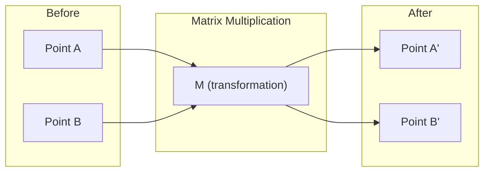
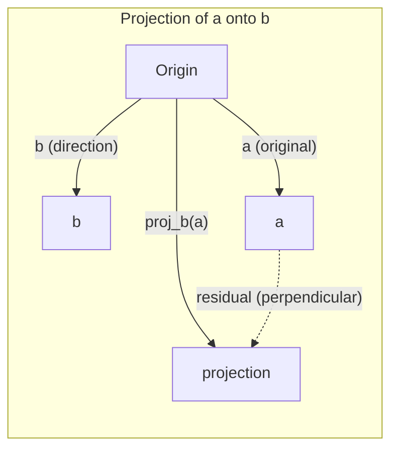

# Düzsel Cevab İçselliği
# 线性代数直觉

> Her AI modeli sadece matris matematikası ve şık bir şapka giyiyor.
> Her AI modeli aslında bir güzel kıyafet giymek için bir matron çalışmasıdır.

**Type:** Learn | **类型:** 学习 | **Languages:** Python, Julia | **语言:** Python, Julia | **Prerequisites:** Phase 0 | **前置知识:** Phase 0 | **Time:** ~60 minutes | **时间:** ~60 分钟

## Öğrenme hedefleri

- Python'da vektör ve matris işlemlerini (ekle, nokta ürünü, matris çarpımı) sıfırdan uygula
  0'dan gerçekleşen vektör ve matraj işlemleri (kafar, nokta, matraj çarpı)
- Düğüm ürünü, projeksiyon ve Gram-Schmidt işleminin ne yaptığını jeometrik olarak açıklayın
  Görevi açıdan açıklama nokta 积 投影 Gram-Schmidt  sürecinin anlamı
- Satır azaltımı kullanarak bir dizi vektörün doğrusal bağımsızlığını, sıra ve tabanını belirleyin
  Üzn:                                                                                                                                                                                                                                                              
- Düzsel cebir kavramlarını AI uygulamalarına bağlayın: yerleşimler, dikkat puanları ve LoRA
  **将线性代数概念与 AI 应用对接：词嵌入、注意力分数、LoRA 微调**

## Sorun , neden öğrenmek zorundayım ?

Herhangi bir ML kağıdı açın. İlk sayfada vektörler, matrisler, nokta ürünleri ve dönüşümleri göreceksiniz. Sınırlı cebir içgüdüsi olmadan bunlar sadece semboller.

Matematikçi olman gerekmez, bu işlemlerin geometrik anlamını görmelisin ve sonra da kendin kodla.

> **【中文解读】**Birinci sayfa, bir mektup açarak, bir mektup açarak, bir mektup açarak, bir mektup açarak, bir mektup açarak, bir mektup açarak, bir mektup açarak, bir mektup açarak, bir mektup açarak, bir mektup açarak, bir mektup açarak, bir mektup açarak, bir mektup açarak, bir mektup açarak, bir mektup açarak, bir mektup açarak, bir mektup açarak, bir mektup açarak, bir mektup açarak, bir mektup açarak, bir mektup açarak, bir mektup açarak, bir mektup açarak, bir mektup açarak, bir mektup açarak, bir mektup açarak, bir mektup açarak, bir mektup açarak, bir mektup açarak, bir mektup açarak, bir mektup açarak, bir mektup açarak, bir mektup açarak, bir mektup açarak, bir mektup açarak, bir mektup açarak, bir mektup açarak, bir mektup yazmak için bir matematikçi olmak gerekmez.

## Konsepten bir şey.

### vektörler noktalar ve yönlerdir.

Vectör sadece sayılar listesi. Ama bu sayılar bir anlam taşır. Uzaydaki koordinatlar.

**2D vector [3, 2]:**

| x | y | Point |
|---|---|-------|
| 3 | 2 | The vector points from origin (0,0) to (3, 2) on the plane |

vektörün büyüklüğü karartı ((3^2 + 2^2) = karartı ((13) ve yukarı ve sağa doğru gösterir.

Yapay zeka'da vektörler her şeyi temsil eder:
- Bir kelime → 768 sayının vektörü (eğlenme alanında "mavzu")
- Bir görüntü → milyonlarca piksel değerinin vektörü
- Bir kullanıcı → bir tercih vektörü

> **【中文解读】**向量就是一组数字,代表空间中的坐标──`[3, 2]`Gösterme (0,0) 指向 (3,2) の箭头,长度 = √(32+22) = √13。
>
> **【拓展：向量在 AI 中的化身】**
> - **词嵌入 (Word Embedding)**Her kelime 768 维向量── "kral" ve "kral" ′′ ′′ ′′ ′′ ′′ ′′ ′′ ′′ ′′ ′′ ′′ ′′ ′′ ′′ ′′ ′′ ′′ ′′ ′′ ′′ ′′ ′′ ′′ ′′ ′′ ′′ ′′ ′′ ′′ ′′ ′′ ′′ ′′ ′′ ′′ ′′ ′′ ′′ ′′ ′′ ′′ ′′ ′′ ′′ ′′ ′′ ′′ ′′ ′′ ′′ ′′ ′′ ′′ ′′ ′′ ′′ ′′ ′′ ′′ ′′ ′′ ′′ ′′ ′′ ′′ ′′ ′′ ′′ ′′ ′′ ′′ ′′ ′′ ′′ ′′ ′′ ′′ ′′ ′′ ′′ ′′ ′′ ′′ ′′ ′′ ′′ ′′ ′′ ′′ ′′ ′′ ′′ ′′ ′′ ′′ ′′ ′′ ′′ ′′ ′′ ′′ ′′ ′′ ′′ ′′ ′′ ′′ ′′ ′′ ′′ ′′ ′′ ′′ ′′ ′′ ′′ ′′ ′′ ′′ ′′ ′′ ′′ ′′ ′′ ′′ ′′ ′′ ′′ ′′ ′′ ′′ ′′ ′′ ′′ ′′ ′′ ′′ ′′ ′′ ′′ ′′ ′′ ′′ ′′ ′′ ′′ ′′ ′′ ′′ ′′ ′′ ′′ ′′ ′′ ′′ ′′ ′′ ′′ ′′ ′′ ′′ ′′ ′′ ′′ ′′ ′′ ′′ ′′ ′′ ′′ ′′ ′′ ′′ ′′ ′′ ′′ ′′ ′′ ′′ ′′ ′′ ′′ ′′ ′′ ′′ ′′ ′′ ′′ ′′ ′′ ′′ ′′ ′′ ′′ ′′ ′′ ′′ ′′ ′′ ′′ ′′ ′′ ′′ ′′ ′′ ′′ ′′ ′′ ′′ ′′ ′′ ′′ ′′ ′′ ′′ ′′ ′′ ′′ ′′ ′′ ′′ ′′ ′′ ′′ ′′ ′′ ′′ ′′ ′′ ′′ ′′ ′′ ′′ ′′ ′′ ′′ ′′ ′′ ′′             
> - **图片特征**Bir 张 224 × 224 彩色图片 = 150,528 个数字的向量;;CNN aslında bu向量'ı adım adım sıkıştırmaktadır;;
> - **用户画像**Bu nedenle, bu sayede, bu sayede, bu sayede, bu sayede, bu sayede, bu sayede, bu sayede, bu sayede, bu sayede, bu sayede, bu sayede, bu sayede, bu sayede, bu sayede, bu sayede, bu sayede, bu sayede, bu sayede, bu sayede, bu sayede, bu sayede, bu sayede, bu sayede, bu sayede, bu sayede, bu sayede, bu sayede, bu sayede, bu sayede, bu sayede, bu sayede, bu sayede, bu sayede, bu sayede, bu sayede, bu sayede, bu sayede, bu sayede, bu sayede, bu sayede, bu sayede, bu sayede, bu sayede, bu sayede,

### Matrisler Değişikliklerdir.

Bir matris bir vektörü başka bir vektöre dönüştürür. Döner, ölçeklendirir, uzanır veya projekte edebilir.



Yapay zeka'da, matrisler model:
- Nöral ağ ağırlıkları → girişleri çıkışa dönüştüren matrisler
- Dikkat puanları → hangi şeye odaklanacağımızı belirleyen matrisler
- Sözcükleri vektörlere haritası yapan yerleşimler → matrisler

> **【中文解读】**矩阵就是一个"变换规则": bir 矩阵ı girip başka 矩阵ı çıkarmak.
>
> **【拓展：神经网络就是矩阵乘法的嵌套】**
> 神经网络 bir katman = `output = W × input + bias`
> - W is权重矩阵 (öğrenmek için)
> - Giriş = 输入向量 (üst katı 输出)
> - Bir üç katlı ağ, üç katlı bir metin çarpma yönteminin bir bağlantısıdır.
> - GPT-3'de 1750 milyar parametre var. Aslında birkaç yüz büyük matron.
> - **训练**= Bu matronların sayısını sürekli düzenlemek için aşağı derecede aşağı

### Dot ürün ölçümleri benzerlik .

İki vektörün nokta ürünü, birbirlerine ne kadar benzer olduklarını gösterir.

```
a · b = a₁×b₁ + a₂×b₂ + ... + aₙ×bₙ

Same direction:      a · b > 0  (similar)
Perpendicular:       a · b = 0  (unrelated)
Opposite direction:  a · b < 0  (dissimilar)
```

Arama motorları, tavsiye sistemleri ve RAG'lar bu şekilde çalışır. Yüksek nokta ürünleri olan vektörleri bulurlar.

> **【中文解读】**Bütük =                                                                                                                                                                                                                                                             
>
> **【拓展：点积是 AI 最核心的数学操作】**
> 1. **Transformer Attention**- ...`Attention(Q,K,V) = softmax(Q·K^T / √d)·V`
>    - Soru) ve K (key) = "Bu kelimeyle daha fazla ilgilenmeliyim"
>    - Bu ChatGPT,BERT ve diğer tüm büyük modellerin merkezi mekanizması.
> 2. **RAG 检索**: Kullanıcı sorunu bir kütleye çevirin, ve tüm dosya kütleleri bir nokta toplayın, en ilgili dosyaları bul
> 3. **推荐系统**: user preference向量 · 商品特征向量 = 推分数
> 4. **余弦相似度**= 归一化后的点积,`cos(a,b) = a·b / (|a|×|b|)`, değer alanı [-1, 1]
>    "Önlü" ve "Çok Sevinç" ifadeleri, "Yol" ve "Yol" ifadelerinden daha iyi.

### Düzsel Bağımsızlık.

Eğer v1, v2, v3 bağımsız ise, 3 boyutlu bir alanı kapsarlar. Eğer bir vektör diğerlerinin bir kombinasyonu ise, sadece bir düzlem kapsarlar.

Bu, AI için neden önemlidir: Özellik matrisinizin doğrusal bağımsız sütunları olması gerekir. İki özellik mükemmel bir şekilde ilişkili (linear olarak bağımlı) ise, model onların etkilerini ayırt edemez. Bu, gerileme sırasında çok doğrusallığa neden olur - ağırlık matrisi istikrarsız hale gelir ve küçük giriş değişiklikleri vahşi çıkış dalgalanmaları üretir.

**Concrete example:**

```
v1 = [1, 0, 0]
v2 = [0, 1, 0]
v3 = [2, 1, 0]   # v3 = 2*v1 + v2
```

v1 ve v2 bağımsızdır. Ne bir skalar katı ne de diğerinin kombinasyonu. ama v3 = 2*v1 + v2, bu yüzden {v1, v2, v3} bağımlı bir set. Bu üç vektör hepsi xy düzleminde.

Veriler kümesinde: eğer feature_3 = 2*feature_1 + feature_2, ekleyerek feature_3 modelde sıfır yeni bilgi verir. Daha da kötüsü, normal denklemleri tek başına yapar - ağırlıklar için benzersiz bir çözüm yoktur.

> **【中文解读】**Bir grup yönü"线性无关" = 没有任何一个能被其他向量出──
>
> Örnek:`[1,0,0]`- Evet .`[0,1,0]`- Evet .`[0,0,1]`相互独立 ✓
>     `[1,0,0]`- Evet .`[0,1,0]`- Evet .`[2,1,0]`İndépendant (III) = 2×III.
>
> **【拓展：多重共线性问题】**
> Finansal verilerde sık sık görülür: Örneğin "Ev fiyatı dolarlık" ve "Ev fiyatı人民çe" tamamen linear olarak ilişkili.
> Aynı zamanda, modelin içine bırakılması, ağırlığın dengesiz olmasına neden olur.

### Temel ve Rank.

Bir temel, tüm alanı kaplayan asgari bir dizi doğrusal bağımsız vektördür.

3D alanı için standart temel {1,0,0], [0,1,0], [0,0,1]}. Ancak 3D'deki herhangi üç bağımsız vektör geçerli bir temel oluşturur.

Bir matrisin rütbesi = doğrusal bağımsız sütun sayısı = doğrusal bağımsız satır sayısı.
- Sistemde sonsuz sayıda çözüm vardır (veya hiç yoktur)
- Değişiklik sırasında bilgi kaybolur.
- Matris tersine çevirilemez

| Situation | Rank | What it means for ML |
|-----------|------|---------------------|
| Full rank (rank = min(m, n)) | Maximum possible | Unique least-squares solution exists. Model is well-conditioned. |
| Rank deficient (rank < min(m, n)) | Below maximum | Features are redundant. Infinitely many weight solutions. Regularization needed. |
| Rank 1 | 1 | Every column is a scaled copy of one vector. All data lies on a line. |
| Near rank-deficient (small singular values) | Numerically low | Matrix is ill-conditioned. Tiny input noise causes large output changes. Use SVD truncation or ridge regression. |

> **【中文解读】**
> - **基 (Basis)**: description of a space needed's minimale向量──3D 空间的标准基是 [1,0,0], [0,1,0], [0,0,1]──
> - **秩 (Rank)**:矩阵中真正独立的列数 (rektörlerin sayısı)
>
> # Durum # # anlamı # # etkisi #
> - Ne zaman?
> # Bilgi tamdır # # Tek çözüm var, model sabit #
> # Aşağı sıralama # # Fazla fazla # # Sonsuz çözüme, normalleşmeye gerek #
> # Veriler neredeyse bütün bağlantılar # # Tüm bilgiler tek bir yönde #
>
> **【拓展：LoRA —— 秩在 AI 中最惊艳的应用】**
> LoRA(Low-Rank Adaptation)
> - Orijinal ağırlık矩阵 W = 4096×4096
> - 微调时,权重更新 ΔW 实际上是"低排"的(Gerçek değişiklikler sadece birkaç yönde gerçekleşir)
> - LoRA'yı ΔW'ye ayırarak A'nın küçük bir matrasına ayırın.
> - 参数1600000 → 130.000, azalmış **99%**Ama sonuçlar neredeyse azalmaz.
> - Bu "iş" kavramının doğrudan gerçekleşmiş bir örneği.

### Projection Projection

Proje vectörü **a**vektörüne**b****a****b**- ...

```
proj_b(a) = (a dot b / b dot b) * b
```

Geri kalan (a - proj_b(a)) b'ye diktir. Bu ortogonal parçalanma en az karelik yerleşimlerin temelidir.

Projection her yerde ML'de:
- Düzsel gerileme gözlemlerden sütun alanına olan mesafeyi en aza indirir.
- PCA, en yüksek değişikliğin yönlerine yönelik verileri projeseler
- Transformatörlerde dikkat, sorguların anahtarlara projeksiyonlarını hesaplar



**Example:**A = [3, 4], b = [1, 0]

proj_b(a) = (3*1 + 4*0) / (1*1 + 0*0) * [1, 0] = 3 * [1, 0] = [3, 0]

Y bileşenini düşüren projeksiyon, en basit biçimindeki boyutların azalmasıdır.

> **【中文解读】**投影 = 向量在某方向上的"影子"──
> `a=[3,4]`投影到 x 轴 `[1,0]`上 = `[3,0]`Sadece bir parça atıp atıyorsun.
> 残差 = 原向量 - 投影 = `[0,4]`, ile proje yönü垂直──
>
> **【拓展：投影与降维的关系】**
> 投影是最简单的"降维"抛掉不关心的方向──PCA(主成分分析)
> Bu, sabit yönleri atmak yerine, "en büyük fark"ı otomatik olarak bulur.
> 1000'den fazla verinin 50'e kadar projeksini yaparak, %95'den fazla bilgiyi saklamak.

### Gram-Schmidt süreci, Gram-Schmidt'in dönüşümü.

Ortonormal, her vektörün uzunluğu 1 ve her çiftin dik olması anlamına gelir.

Algoritm:
1. İlk vektörü alın, normalleştirin.
2. İkinci vektörü alın, ilk vektörün üzerinde projeksiyonunu çıkarın, normalleştirin.
3. Üçüncü vektörü alın, tüm önceki vektörlere projeksiyonlarını çıkarın, normalleştirin.
4. Geri kalan vektörler için tekrarlayın

```
Input:  v1, v2, v3, ... (linearly independent)

u1 = v1 / |v1|

w2 = v2 - (v2 dot u1) * u1
u2 = w2 / |w2|

w3 = v3 - (v3 dot u1) * u1 - (v3 dot u2) * u2
u3 = w3 / |w3|

Output: u1, u2, u3, ... (orthonormal basis)
```

QR parçalanması içsel olarak bu şekilde çalışır. Q ortonomal temeldir, R projeksiyon katılıklarını yakalar. QR parçalanması:
- Düzsel sistemlerin çözümü (Gaussian ortadan kaldırılmasından daha istikrarlı)
- Bilgisayar öz değerleri (QR algoritması)
- En az kare geri dönüşü (standard sayısal yöntem)

> **【中文解读】**Herhangi bir grup vektörü "birbirine dikey + 长度为1" standartlarına dönüştürmek doğru bir ilişkilidir.
>
> 直觉: Her yeni yön önce, zaten var olan yöndeki "重合部分" (kişikleme) de azaltılır, sadece tüm yeni yönleri korur, yeniden yeniden yeniden birleştirilmektedir.
> Sanki her bir parça yeni bir yön seçmiş gibi.
>
> **【拓展：为什么"正交"这么重要？】**
> Eğer bir kütle arasındaki "küçük" bir "küçük" bir "küçük" bir "küçük" bir "küçük" bir "küçük" bir "küçük" bir "küçük" bir "küçük" bir "küçük" bir "küçük" bir "küçük" bir "küçük" bir "küçük" bir "küçük" bir "küçük" bir "küçük" bir "küçük" bir "küçük" bir "küçük" bir "küçük" bir "küçük" bir "küçük" bir "küçük" bir "küçük" bir "küçük" bir "küçük" bir "küçük" bir "küçük" bir "kü" bir "kü" "kü" bir "kü" "kü" "kü" "kü" "kü" "kü" "kü" "kü" "kü" "kü" "kü" "kü" "kü" "kü" "kü" "kü" "kü" "kü" "kü" "kü" "kü" "kü" "ü" "kü" "ü" "kü" "ü" "ü" "ü" "ü" "ü" "ü" "ü" "ü" "ü" " " " " " " " " " " " " " " " " " " " " " " " " " " " " " " " " " " " " " " " " " " " " " " " " " " " " " " " " " " " " " " " " " " " " " " " " " " " " " " " " " " " " " " " " " " " " " " " " " " " " " " " " " " " " " " " " " " " " " " " " " " " " " " " " " " " " " " " " " " " " " " " " " " " " " " " " " " " " " " " " " " " " " " " " " " " " " " " " " " " " " " " " " " " " " " " " " " " " " " " " " " " " " " " " " " " " " " " " " " " " " " " " " " " " " " " " " " " " " " " " " " " "
> QR 分解(Gram-Schmidt'ın矩阵形式) sayısal değer hesaplama temel taşıdır:
> - NumPy 解方程 alt katı kullanımı sadece QR 分解
> - Özellik değer hesaplama kullanımı QR 代 algoritması
> - En küçük ikinci katı geri dönüşün standart sayısal değer çözümü

## Yapın.
```figure
eigen-directions
```

## Yapın

### Adım 1: sıfırdan vektörler (Python)

```python
class Vector:
    def __init__(self, components):
        self.components = list(components)
        self.dim = len(self.components)

    def __add__(self, other):
        return Vector([a + b for a, b in zip(self.components, other.components)])

    def __sub__(self, other):
        return Vector([a - b for a, b in zip(self.components, other.components)])

    def dot(self, other):
        # 点积：对应分量相乘后求和。AI 中最核心的相似度度量。
        return sum(a * b for a, b in zip(self.components, other.components))

    def magnitude(self):
        return sum(x**2 for x in self.components) ** 0.5

    def normalize(self):
        # 归一化：缩放到长度1。归一化后点积=余弦相似度。
        mag = self.magnitude()
        return Vector([x / mag for x in self.components])

    def cosine_similarity(self, other):
        # 余弦相似度：只看方向不看长度，值域[-1,1]
        return self.dot(other) / (self.magnitude() * other.magnitude())

    def __repr__(self):
        return f"Vector({self.components})"


a = Vector([1, 2, 3])
b = Vector([4, 5, 6])

print(f"a + b = {a + b}")
print(f"a · b = {a.dot(b)}")
print(f"|a| = {a.magnitude():.4f}")
print(f"cosine similarity = {a.cosine_similarity(b):.4f}")
```

### Adım 2: sıfırdan matrisler (Python)

```python
class Matrix:
    def __init__(self, rows):
        self.rows = [list(row) for row in rows]
        self.shape = (len(self.rows), len(self.rows[0]))

    def __matmul__(self, other):
        # 矩阵乘法 = 神经网络一层的前向传播
        if isinstance(other, Vector):
            return Vector([
                sum(self.rows[i][j] * other.components[j] for j in range(self.shape[1]))
                for i in range(self.shape[0])
            ])
        rows = []
        for i in range(self.shape[0]):
            row = []
            for j in range(other.shape[1]):
                row.append(sum(
                    self.rows[i][k] * other.rows[k][j]
                    for k in range(self.shape[1])
                ))
            rows.append(row)
        return Matrix(rows)

    def transpose(self):
        return Matrix([
            [self.rows[j][i] for j in range(self.shape[0])]
            for i in range(self.shape[1])
        ])

    def __repr__(self):
        return f"Matrix({self.rows})"


rotation_90 = Matrix([[0, -1], [1, 0]])
point = Vector([3, 1])

rotated = rotation_90 @ point
print(f"Original: {point}")
print(f"Rotated 90°: {rotated}")
```

### Adım 3: Bu neden AI için önemli?

```python
import random

random.seed(42)
weights = Matrix([[random.gauss(0, 0.1) for _ in range(3)] for _ in range(2)])
input_vector = Vector([1.0, 0.5, -0.3])

output = weights @ input_vector
print(f"Input (3D): {input_vector}")
print(f"Output (2D): {output}")
print("This is what a neural network layer does -- matrix multiplication.")
# 矩阵乘法：3维输入 → 2维输出。这就是神经网络一层的全部计算。
# 一个真正的网络就是把很多这样的层串起来，每层都有一个权重矩阵。
```

### Dördüncü adım: Julia versiyonu.

```julia
a = [1.0, 2.0, 3.0]
b = [4.0, 5.0, 6.0]

println("a + b = ", a + b)
println("a · b = ", a ⋅ b)       # Julia supports unicode operators
println("|a| = ", √(a ⋅ a))
println("cosine = ", (a ⋅ b) / (√(a ⋅ a) * √(b ⋅ b)))

# Matrix-vector multiplication
W = [0.1 -0.2 0.3; 0.4 0.5 -0.1]
x = [1.0, 0.5, -0.3]
println("Wx = ", W * x)
println("This is a neural network layer.")
```

### Adım 5: Düzsel bağımsızlık ve sıfırdan projeksyon (Python)

```python
def is_linearly_independent(vectors):
    # 高斯消元法：把向量排成矩阵，化简，看秩是否等于向量个数
    n = len(vectors)
    dim = len(vectors[0].components)
    mat = Matrix([v.components[:] for v in vectors])
    rows = [row[:] for row in mat.rows]
    rank = 0
    for col in range(dim):
        pivot = None
        for row in range(rank, len(rows)):
            if abs(rows[row][col]) > 1e-10:
                pivot = row
                break
        if pivot is None:
            continue
        rows[rank], rows[pivot] = rows[pivot], rows[rank]
        scale = rows[rank][col]
        rows[rank] = [x / scale for x in rows[rank]]
        for row in range(len(rows)):
            if row != rank and abs(rows[row][col]) > 1e-10:
                factor = rows[row][col]
                rows[row] = [rows[row][j] - factor * rows[rank][j] for j in range(dim)]
        rank += 1
    return rank == n


def project(a, b):
    # 投影：a 在 b 方向上的"影子"
    scalar = a.dot(b) / b.dot(b)
    return Vector([scalar * x for x in b.components])


def gram_schmidt(vectors):
    # 正交化：每个向量减去在已有方向上的投影，只保留新方向
    orthonormal = []
    for v in vectors:
        w = v
        for u in orthonormal:
            proj = project(w, u)
            w = w - proj
        if w.magnitude() < 1e-10:
            continue
        orthonormal.append(w.normalize())
    return orthonormal


v1 = Vector([1, 0, 0])
v2 = Vector([1, 1, 0])
v3 = Vector([1, 1, 1])
basis = gram_schmidt([v1, v2, v3])
for i, u in enumerate(basis):
    print(f"u{i+1} = {u}")
    print(f"  |u{i+1}| = {u.magnitude():.6f}")

print(f"u1 · u2 = {basis[0].dot(basis[1]):.6f}")
print(f"u1 · u3 = {basis[0].dot(basis[2]):.6f}")
print(f"u2 · u3 = {basis[1].dot(basis[2]):.6f}")
```

## Onu gerçek savaşta kullanacağın şekilde kullan.

NumPy ile aynı şey -- pratikte kullanacağınız şey:
NumPy ile şu anda kullandığın şey şu:

```python
import numpy as np

a = np.array([1, 2, 3], dtype=float)
b = np.array([4, 5, 6], dtype=float)

print(f"a + b = {a + b}")
print(f"a · b = {np.dot(a, b)}")
print(f"|a| = {np.linalg.norm(a):.4f}")
print(f"cosine = {np.dot(a, b) / (np.linalg.norm(a) * np.linalg.norm(b)):.4f}")

W = np.random.randn(2, 3) * 0.1
x = np.array([1.0, 0.5, -0.3])
print(f"Wx = {W @ x}")
```

### Rank, Projection ve QR NumPy 秩、投影 ve QR 分解 ile

```python
import numpy as np

A = np.array([[1, 2], [2, 4]])
print(f"Rank: {np.linalg.matrix_rank(A)}")  # 秩=1，第2行是第1行的2倍

a = np.array([3, 4])
b = np.array([1, 0])
proj = (np.dot(a, b) / np.dot(b, b)) * b
print(f"Projection of {a} onto {b}: {proj}")

Q, R = np.linalg.qr(np.random.randn(3, 3))  # QR 分解 = Gram-Schmidt 的矩阵形式
print(f"Q is orthogonal: {np.allclose(Q @ Q.T, np.eye(3))}")  # Q 正交
print(f"R is upper triangular: {np.allclose(R, np.triu(R))}")  # R 上三角
```

### PyTorch -- Tensörler Otodiff'li vektörlerdir PyTorch:带自动求导的张量

```python
import torch

x = torch.randn(3, requires_grad=True)  # 3维向量，开启自动求导
y = torch.tensor([1.0, 0.0, 0.0])

similarity = torch.dot(x, y)  # 点积
similarity.backward()          # 自动求导！

print(f"x = {x.data}")
print(f"y = {y.data}")
print(f"dot product = {similarity.item():.4f}")
print(f"d(dot)/dx = {x.grad}")  # 梯度 = y 本身，因为 d(x·y)/dx = y
```

> **【拓展：自动求导的魔法】**
> PyTorch'in `backward()`Otomatik hesaplama d  x  y) / dx = y 
> 神经网络训练 = 反复做:
> 1. Önüne yayılmak için
> 2. 计算损失 (söz miktarı)
> 3. İnteşkinlik`backward()`Kendini her güç ve ağırlık derecesine çevir)
> 4. 更新权重(梯度下降)
> 第2-3 adım tamamen "otomatik arayış"a bağlıdır, otomatik arayışın matematiksel temeli ise zincir kuralıdır.

Doppler ürününün x ile ilgili gradiyenti sadece y. PyTorch bunu otomatik olarak hesapladı. Bir sinir ağındaki her işlem bu tür işlemlerden oluşur. Matris çarpıcıları, nokta ürünleri, projeksiyonlar ve tüm bunlar üzerinden gradiyenti otomatik olarak izler.

NumPy'nin yaptığı şeyi bir satırdan inşa ettin.
NumPy'nin kodunu yeni çözdün. Şimdi altta ne olduğunu biliyorsun.

## İndirin . Ürünler .

Bu ders şunları ortaya çıkarır:
- `outputs/prompt-linear-algebra-tutor.md`-- AI asistanlarının geometrik algebereyi öğretmeleri için bir ipucu

## Bağlantılar kavramı

Bu dersdeki her şey modern Yapay zeka'nın belirli parçalarıyla bağlantılı:
Bu ders her kavramı doğrudan modern AI'nin bir bileşeniyle karşılaştırır:

| Concept 概念 | Where it shows up 在 AI 中的位置 |
|---------|------------------|
| Dot product 点积 | Attention scores in transformers, cosine similarity in RAG / Transformer 的注意力分数、RAG 的余弦相似度 |
| Matrix multiply 矩阵乘法 | Every neural network layer, every linear transformation / 神经网络的每一层 |
| Linear independence 线性无关 | Feature selection, avoiding multicollinearity / 特征选择、避免多重共线性 |
| Rank 秩 | Determining if a system is solvable, LoRA (low-rank adaptation) / 方程可解性判断、LoRA 微调 |
| Projection 投影 | Linear regression (projecting onto column space), PCA / 线性回归、PCA 降维 |
| Gram-Schmidt / QR | Numerical solvers, eigenvalue computation / 数值求解器、特征值计算 |
| Orthonormal basis 正交基 | Stable numerical computation, whitening transforms / 数值稳定计算、白化变换 |

LoRA özel bir değinime layık. Ağır dil modellerini düşük sıralama matrislerine parçalayarak ince ayarlar. LoRA, 4096x4096 ağırlık matrisini (16M parametreleri) güncelleme yerine, 4096x16 ve 16x4096 boyutlarındaki iki matrisi (131K parametreleri) güncelleme yapmaktadır. 16 sıradaki kısıtlama, LoRA'nın ağırlık güncellemeyi 4096 boyutlu alanın 16 boyutlu bir alt alanında yaşatmasını varsaydığını gösterir. Bu gerçek iş yapan doğrusal cebir.

> **【中文解读】LoRA 特别值得一提。**Büyük modelin küçük düzenlemelerinin düşük düzenli metrekan işlemlerine ayrılır.
> 4096×4096'ın ağırlıklı matrajını yenilemek için çalıştım.
> LoRA sadece 4096×16 ve 16×4096'ı yeniliyor.
> "秩=16" anlamı: güç yeniden yüklenme aslında sadece 16 yönde gerçekleşir, tam 4096 dimensiy uzay değil.
> Bu, ıntılı faktörlerin AI'deki en iyi uygulamasıdır.

## Egzersizler.

1. Uygulama`Vector.angle_between(other)`İki vektör arasındaki açıyı derecelerdeki dönüştürür.
   **实现计算两向量夹角的方法（返回角度）**
2. X koordinatını ikiye katlayan ve y koordinatını üç katlayan 2 boyutlu bir ölçekleme matrisi oluşturup, sonra vektöre uygulayın [1, 1]
   **创建一个 2D 缩放矩阵（x坐标翻倍，y坐标三倍），应用到向量 [1, 1]**
3. 5 rastgele kelime benzeri vektör ( boyut 50), iki en benzerini cosine benzerliği kullanarak bul
   **给定5个随机50维"词向量"，用余弦相似度找最相似的2个**
4. Gram-Schmidt çıkışının gerçekten ortonom olduğunu kontrol edin: Her çiftin 0 nokta ürünü ve her vektörün 1 büyüklüğü olduğunu kontrol edin
   **验证 Gram-Schmidt 输出确实正交：任意两个点积=0，每个长度=1**
5. 2 sıralı 3x3 bir matris oluşturun. `rank()`Sonra sütunların hangi geometrik nesneyi kapsadığını açıklayın.
   **构造一个秩为2的3×3矩阵，验证秩，解释它的列向量张成什么几何体（答案：一个平面）**
6. [1, 2, 3] vektörünü [1, 1, 1] üzerine projekt edin.
   **把 [1,2,3] 投影到 [1,1,1] 上，几何含义是什么？（答案：在对角线方向上的分量）**

## Anahtar Şartlar .

| Term 英文 | What people say 常见误解 | What it actually means 准确含义 |
|------|----------------|----------------------|
| Vector 向量 | "An arrow 一根箭头" | A list of numbers representing a point or direction in n-dimensional space / n维空间中的点或方向 |
| Matrix 矩阵 | "A table of numbers 一堆数字" | A transformation that maps vectors from one space to another / 把向量从一个空间映射到另一个空间的变换 |
| Dot product 点积 | "Multiply and sum 乘完加起来" | A measure of how aligned two vectors are -- the core of similarity search / 衡量对齐程度——相似度搜索的核心 |
| Embedding 嵌入 | "Some AI magic AI魔法" | A vector that represents the meaning of something (word, image, user) / 表示事物"意义"的向量 |
| Linear independence 线性无关 | "They don't overlap 不重叠" | No vector in the set can be written as a combination of the others / 没有向量能用其他向量凑出来 |
| Rank 秩 | "How many dimensions 几个维度" | The number of linearly independent columns (or rows) in a matrix / 独立列（行）的数量 |
| Projection 投影 | "The shadow 影子" | The component of one vector in the direction of another / 一个向量在另一个方向上的分量 |
| Basis 基 | "The coordinate axes 坐标轴" | A minimal set of independent vectors that span the space / 张成整个空间的最少独立向量 |
| Orthonormal 正交归一 | "Perpendicular unit vectors 垂直单位向量" | Vectors that are mutually perpendicular and each have length 1 / 互相垂直且长度各为1 |
