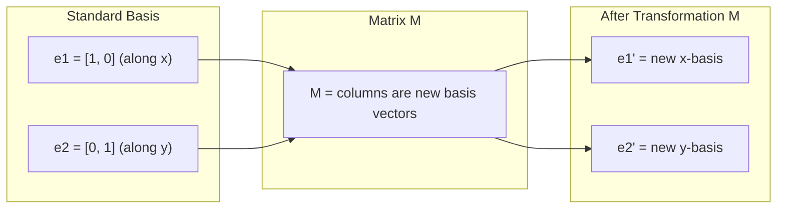
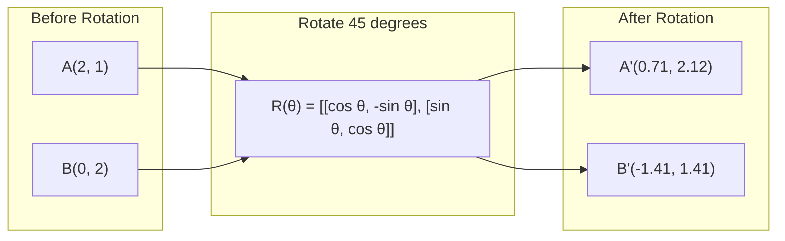
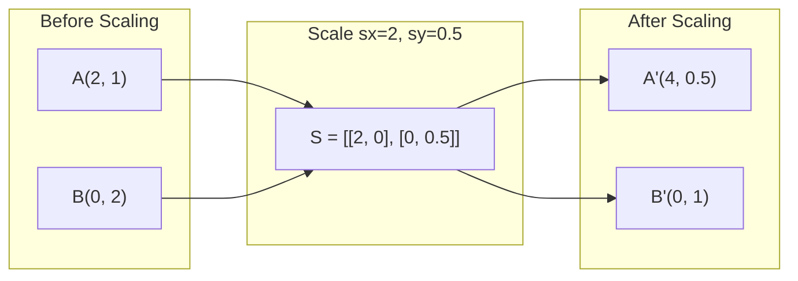
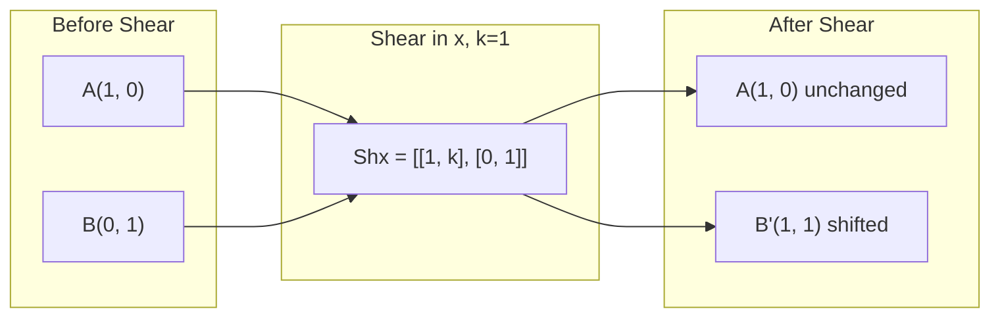
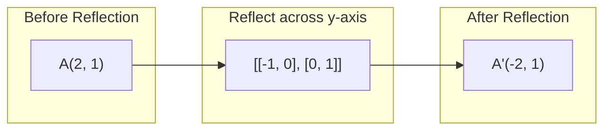
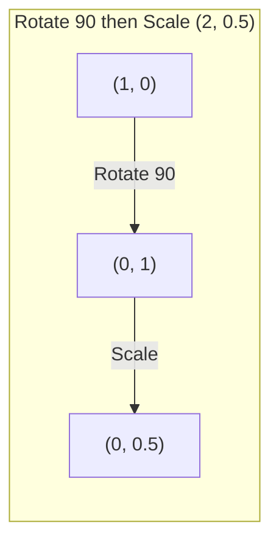
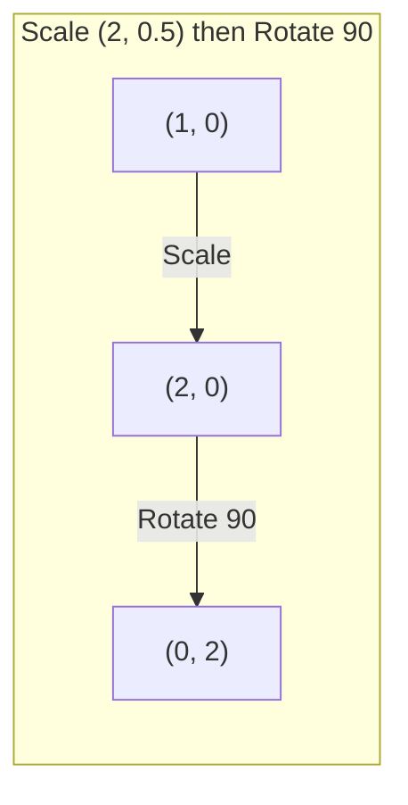

# Matrix Transformations.

> Matrix, uzayı yeniden şekillendiren bir makine. Her noktaya ne yaptığını öğrenir ve tüm dönüşümü anlarsın.

> Rektür, "Yüklenme Uzayı"nın bir makinesi. Her noktayı etkilemesini anlamak, tüm değişimi anlamak demektir.

**Type:** Build | **类型:** 动手
**Languages:** Python, Julia | **语言:** Python, Julia
**Prerequisites:** Phase 1, Lessons 01-02 (Linear Algebra Intuition, Vectors & Matrices Operations) | **前置知识:** Phase 1, Lessons 01-02（线性代数直觉、向量与矩阵运算）
**Time:** ~75 minutes | **时间:** ~75 分钟

## Öğrenme hedefleri

- Dönüşüm, ölçekleme, kesme ve yansıma matrislerini oluşturun ve bunları 2D ve 3D noktalara uygulayın
   Konstruksiyon dönüm, küçültme, kesme, refleksyon matçları ve 2D ve 3D noktaları kullanılır
- Matris çarpımı ile birden fazla dönüşüm oluşturun ve sırayı değerlendirmek için
  通过矩阵乘法组合多变,验证顺序的重要性
- Karakteristik denklemden 2x2 matrislerin öz değerlerini ve öz vektörlerini hesaplayın
  Özellik denkleminden hesap 2x2  rektürün özellik değeri ve özellik yükü
- Kendi değerlerin neden PCA yönlerini, RNN istikrarını ve spektral gruplama davranışını belirlediğini açıklayın
  解释特征值为何决定 PCA 方向、RNN 稳定性和谱聚类行为

> **【中文解读】**
> Mütekçenin uzaydaki değişimleri, dönümleri, küçülmeleri, kesimleri ve dönüşümleri. Mütekçenin geometrik anlamını anladıktan sonra, PCA, RNN, sabitlik, sekme topluluğu kavramları netleşmiştir.

> **【拓展：特征值/特征向量在 AI 中的位置】**
> - **PCA（主成分分析）**: 找到数据方差矩阵的特征向量,就是数据方差最大的方向──
> - **RNN 稳定性**Eğer bir ağırlık matçının özellik değeri mutlak değeri 1'den büyükse, 梯度会指数增长 (梯度爆炸) ̊; 梯度小于 1则会衰减到零 (梯度消失) ̊.
> - **谱聚类**K-Mans'a göre daha uygun olmayan küresel verilere göre, TÜLAPRAŞ'ın matronunun özellikleri ve vektörleri ile toplanmaya yöneliktir.

## Sorunlar. Sorunlar.

> **【中文解读】**PCA, "birbirliği arasındaki bir matronun özellikleri yönlendirmesini bulmak", model sabitliği, "tekerlilik değerinin 1'den küçük olup olmadığını kontrol etmek" diyor, "data增强" diyor, "asked rotation" bunlar, matronun uzaydaki geometrik değişiklikleri anlamaya ihtiyaç duyar.

## Konsepten bir şey.

> **【拓展：Transformer 中的矩阵变换】**Transformer'in her dikkatli başı, bir matç değişiminde bulunur: Q=W_q·x, K=W_k·x, V=W_v·x, bunların içinde W_q/W_k/W_v öğrenilebilir bir değişim matçıdır.

### Matrisler olarak dönüşümler

2 boyutlu her doğrusal dönüşüm 2x2 matris olarak yazılabilir. Matris size temel vektörlerin [1, 0] ve [0, 1] nerede sona ereceğini tam olarak söyler.

> İki boyutlu uzaydaki her bir çizgi değişim 2x2 矩阵 olarak yazılabilir.

> 矩阵的列就是变换后的基向量──如果矩阵的第一列是 [2, 0],说明 e1=[1,0]被映射到 [2,0](沿 x 轴拉伸 2 倍)──



### Dönüşüm

2 boyutlu bir dönüm açısı ile teta uzaklıkları ve açıları sağlam tutar.

> İki boyutlı dönüm, mesafe ve açıyı değişmez şekilde, her noktayı yuvarlak bir yürek boyunca hareket ettirir.

> 旋转矩阵 R(θ) = [[cosθ, -sinθ], [sinθ, cosθ]]。θ 为正表示逆时针旋转。R^T = R^(-1),转置即逆旋转。



3 boyutlu bir aksanın etrafında dönersiniz.

> Üç boyutlu bir uzayda, bir aksiyete dönersin. Her aksiyondaki kendi dönüm matrası vardır.

```
Rz(theta) = | cos  -sin  0 |     Rotate around z-axis
            | sin   cos  0 |     (x-y plane spins, z stays)
            |  0     0   1 |

Rx(theta) = | 1   0     0    |   Rotate around x-axis
            | 0  cos  -sin   |   (y-z plane spins, x stays)
            | 0  sin   cos   |

Ry(theta) = |  cos  0  sin |     Rotate around y-axis
            |   0   1   0  |     (x-z plane spins, y stays)
            | -sin  0  cos |
```

### Ölçekleme

Ölçekleme her eksesi boyunca bağımsız olarak uzanır veya sıkıştırır.

> 缩放沿每轴独立地拉伸或压缩──

> 缩放矩阵 S = [[sx, 0], [0, sy]]。sx、sy farklı olabilir。 eğer bir ≠负,等价于沿该轴反射。



### Çekim

Çekim, diğerini sabit tutarak bir ekseni eğilerek düzgenleri paralelogramlara dönüştürür.

> Bir aksiyeti eğilen ve diğer aksiyeti sabit tutan kesmek, düz şekiline düz dört boyutlu şekil haline gelir.

> 剪切保持面积不变(行列式=1) ・・・想象一克牌向一边推:底牌不动,顶牌平移──



Çekim matrisleri:
- `Shx = [[1, k], [0, 1]]`x by k * y
- `Shy = [[1, 0], [k, 1]]`y'yi k * x'e çevirir

> 剪切矩阵:`Shx`沿 y 偏移 x(x 新 = x + k*y),`Shy`沿 x 偏移 y(y 新 = y + k*x) 』

### Düşünce

Yansıma bir ekseni veya çizgi boyunca noktaları yansıtır.

> Bir çerçeve veya çizgi hakkında bir reflection will point.

> Bu yön değişir, ama uzaklıkta kalır.



Refleksiyon matrisleri:
- Y-öksü boyunca yansıt: `[[-1, 0], [0, 1]]`
- X-ötesinin üzerinde yansıt: `[[1, 0], [0, -1]]`

> Reflection: About y 轴反射 `[[-1, 0], [0, 1]]`, x 轴反射 hakkında `[[1, 0], [0, -1]]`- Evet.

### Yapı: zincirleme dönüşümleri

A ve sonra B dönüşümlerini uygulayarak matrislerini çarpmakla aynıdır: `result = B @ A @ point`Düzenle, sonra ölçekle dön ve sonra ölçekle dön.

> Bir değişim yaparak bir değişim yaparak bir değişim yaparak B'yi onların matronunu çarpmak için yaparak yaparak yaparak yaparak yaparak yaparak yaparak yaparak yaparak yaparak yaparak yaparak yaparak yaparak yaparak yaparak yaparak yaparak yaparak yaparak yaparak yaparak yaparak yaparak yaparak yaparak yaparak yaparak yaparak yaparak yaparak yaparak yaparak yaparak yaparak yaparak yaparak yaparak yaparak yaparak yaparak yaparak yaparak yaparak yaparak yaparak yaparak yaparak yaparak yaparak yaparak yaparak yaparak yaparak yaparak yaparak yaparak yaparak yaparak yaparak yaparak yaparak yaparak yaparak yaparak yaparak yaparak yaparak yaparak yaparak yaparak yaparak yaparak yaparak yaparak yaparak yaparak yaparak yaparak yaparak yaparak yaparak yaparak yaparak yaparak yaparak yaparak yaparak yaparak yaparak yaparak yaparak yaparak yaparak yaparak yaparak yaparak yaparak yaparak yaparak yaparak yaparak yaparak yaparak yaparak yaparak yaparak yaparak yaparak yaparak yaparak yaparak yaparak yaparak yaparak yaparak yaparak yaparak yaparak yaparak yaparak yaparak yaparak yaparak yaparak yaparak yaparak yaparak yaparak yaparak yaparak yaparak yaparak yaparak yaparak yaparak yaparak yaparak yaparak yaparak yaparak yaparak yaparak yaparak yaparak yaparak yaparak yaparak yaparak yaparak yaparak yaparak yaparak yaparak yaparak yaparak yaparak yaparak yaparak yaparak yaparak yaparak yaparak yaparak yaparak yaparak yaparak yaparak yaparak yaparak yaparak yaparak yaparak yaparak yaparak yaparak yaparak yaparak yaparak yaparak yaparak yaparak yaparak yaparak yaparak yaparak yaparak yaparak yaparak yaparak yaparak yaparak yaparak yaparak yaparak yaparak yaparak yaparak yaparak yaparak yaparak yaparak yaparak yaparak yaparak yaparak yaparak`result = B @ A @ point`◊ sırası önemli  ön döngü yeniden döngüye dönüşümün sonucu, ön döngüye dönüşümün sonucuyla farklıdır 

> Bu yüzden PyTorch'un içinde nn.Sequential  sıkı bir sırayla uygulanmış modüller ve sırayla çarpıtılan bir sırayla dönüştürülmüştür.



Yapılanlar: `S @ R = [[0, -2], [0.5, 0]]`

> Önceki dönüş 90° Yeniden küçültülme (2, 0.5): 1,0) → 旋转后 (0,1) → 缩放后 (0, 0.5)──组合矩阵 S @ R = [[0, -2], [0,5, 0]]──



Yapılanlar: `R @ S = [[0, -0.5], [2, 0]]`

> Önceden küçültülmüş (2, 0.5) Yeniden 90° döndürülmüş: (1,0) → 缩放后 (2, 0) → 旋转后 (0, 2)──组合矩阵 R @ S = [[0, -0.5], [2, 0]],与上完全不同──

Matrix çarpımı kommutatif değil.

> 结果不同──矩阵乘法不满足交换律这就是为什么变压器注意力中 Q、K、V 的相乘顺序至关重要──

### Kendi değerler ve kendi vektörler

Bir matris onlara çarptığında çoğu vektör yön değiştirir. Eigenvektorlar özeldir: matris sadece onları ölçeklendirir, asla döndürmez. Ölçekleme faktörü öz değerdir.

> Çoğu vektör, bir matçın değişiminden sonra yön değişir.

> 几何直觉: 向量特征是变换中"方向不变"的方向──如果矩阵是圆变换, 向量特征指向圆的长短轴──

```
A @ v = lambda * v

v is the eigenvector (direction that survives)
lambda is the eigenvalue (how much it stretches)

Example: A = | 2  1 |
             | 1  2 |

Eigenvector [1, 1] with eigenvalue 3:
  A @ [1,1] = [3, 3] = 3 * [1, 1]     (same direction, scaled by 3)

Eigenvector [1, -1] with eigenvalue 1:
  A @ [1,-1] = [1, -1] = 1 * [1, -1]  (same direction, unchanged)
```

Matris, alanı [1, 1] boyunca 3x uzatır ve [1, -1] değişmez kalır.

> The矩阵沿 [1, 1] 方向拉伸 3 倍,保持 [1, -1] 方向不变──其他所有方向是这两方向的组合──

### Kendi bileşimi

Bir matrisin n doğrusal bağımsız öz vektörü varsa, parçalanabilir:

> Eğer bir matron n 个线性无关的特征向量 varsa, A = V D V−1 olarak parçalanabilir.

> Özellik parçalanmasının geometrik anlamı: "töküntüye dönüştürülmek" için "herhangi bir değişim parçalanması" için "töküntüye dönüştürülmek" için "töküntüye dönüştürülmek" için "töküntüye dönüştürülmek" için "töküntüye dönüştürülmek" için "töküntüye dönüştürülmek" için "töküntüye dönüştürülmek" için "töküntüye dönüştürülmek" için "töküntüye dönüştürmek" için "töküntüye dönüştürmek" için "töküntüye dönüştürmek" için üç adım.

```
A = V @ D @ V^(-1)

V = matrix whose columns are eigenvectors
D = diagonal matrix of eigenvalues
V^(-1) = inverse of V

This says: rotate into eigenvector coordinates, scale along each axis, rotate back.
```

> Bu, bir karakter ve kütle koordinatına dönmek, her bir akselin kısaltılması boyunca, tekrar dönmek anlamına gelir.

### Kendi değerlerin neden önemli olduğu

**PCA.**Kovayans matrisinin öz vektörleri ana bileşenlerdir. öz değerleri size her bileşen ne kadar farklılık yakaladığını söyler. öz değerlere göre sıralayın, üst k'yi tutun ve boyut oranı azalır.

> **PCA（主成分分析）。**协方差矩阵'nın özellik vektörü ana bileşen, özellik değeri size her ana bileşenin ne kadar büyük bir fark yakaladığını söyler.

**Stability.**Tekrarlanan ağlarda ve dinamik sistemlerde, büyüklüğü > 1 olan öz değerleri çıkışların patlamasına neden olur. Büyüklük < 1 onları ortadan kaldırır. Bu bir cümlede belirtilen kaybolma/fışkırma gradient sorunu.

> **稳定性。**Döngü ağ ve güç sistemlerinde, özellik değerleri mutlak değer > 1 ′ çıkış patlamalara yol açar,< 1 ′ kaybolmaya yol açar.

**Spectral methods.**Grafik sinir ağları, bitişiklik matrisinin öz değerlerini kullanır. Spektral gruplama, Laplakya öz değerlerini kullanır.

> **谱方法。**图神经网络 图神经网络 图的特征值,谱聚类 图的特征值, 图的特征值, 图的特征值, 图的特征量, 图的结构, 图的结构, 图的结构, 图的结构, 图的结构, 图的结构, 图的结构, 图的结构, 图的结构, 图的结构, 图的结构, 图的结构, 图的结构, 图的结构, 图的结构, 图的结构, 图的结构, 图的结构, 图的结构, 图的结构, 图的结构, 图的结构, 图的结构, 图的结构, 图的结构, 图的结构, 图的结构, 图的特征的结构, 图的结构, 图的结构, 图的特征的结构, 图的结构, 图的结构, 图的特征的结构, 图的特征的结构, 图的特征的结构, 图的特征的结构, 图的特征的结构, 图的特征的结构, 图的特征的结构, 图的特征的结构, 图的特征的特征的结构, 图的特征的

### Volüm ölçekleme faktörü olarak belirleyici

Bir dönüşüm matrisinin belirleyicisi size alanın (2D) veya hacminin (3D) ne kadar ölçeklendirdiğini söyler.

> 变换矩阵的行列式 size 变换矩阵的行列式 tells you it shrunked to the extent of the area (Bölüm 2D) or the volume (Bölüm 3D) △) △

> Det=0 is "katastrophe"矩阵把空间压缩到低维((如2D → 1D 线), bilgi kaybı,矩阵不可逆── 神经网络初始化时应避免权重矩阵接近奇异──

```
det = 1:   area preserved (rotation)
det = 2:   area doubled
det = 0:   space crushed to lower dimension (singular)
det = -1:  area preserved but orientation flipped (reflection)

| det(Rotation) | = 1        (always)
| det(Scale sx, sy) | = sx * sy
| det(Shear) | = 1           (area preserved)
| det(Reflection) | = -1     (orientation flipped)
```

> 行列式含义:det=1 保面积(旋转);det=2 面积翻倍;det=0 空间崩缩到低维(奇异,矩阵不可逆);det=-1 保面积但翻转方向(反射) ・・・

## Yapın.
```figure
matrix-transform
```

## Yapın

### Adım 1: Değişiklik matrisleri sıfırdan (Python)

> 第1 adım: 0'dan 0'ya dönüştürülme matçları

> 0'dan gerçekleşen dönüşüm, kısaltma, kesim, refleksyon matçları. Tüm değişimler 2x2 matçlardır.

```python
import math

def rotation_2d(theta):
    c, s = math.cos(theta), math.sin(theta)
    return [[c, -s], [s, c]]

def scaling_2d(sx, sy):
    return [[sx, 0], [0, sy]]

def shearing_2d(kx, ky):
    return [[1, kx], [ky, 1]]

def reflection_x():
    return [[1, 0], [0, -1]]

def reflection_y():
    return [[-1, 0], [0, 1]]

def mat_vec_mul(matrix, vector):
    return [
        sum(matrix[i][j] * vector[j] for j in range(len(vector)))
        for i in range(len(matrix))
    ]

def mat_mul(a, b):
    rows_a, cols_b = len(a), len(b[0])
    cols_a = len(a[0])
    return [
        [sum(a[i][k] * b[k][j] for k in range(cols_a)) for j in range(cols_b)]
        for i in range(rows_a)
    ]

point = [1.0, 0.0]
angle = math.pi / 4

rotated = mat_vec_mul(rotation_2d(angle), point)
print(f"Rotate (1,0) by 45 deg: ({rotated[0]:.4f}, {rotated[1]:.4f})")

scaled = mat_vec_mul(scaling_2d(2, 3), [1.0, 1.0])
print(f"Scale (1,1) by (2,3): ({scaled[0]:.1f}, {scaled[1]:.1f})")

sheared = mat_vec_mul(shearing_2d(1, 0), [1.0, 1.0])
print(f"Shear (1,1) kx=1: ({sheared[0]:.1f}, {sheared[1]:.1f})")

reflected = mat_vec_mul(reflection_y(), [2.0, 1.0])
print(f"Reflect (2,1) across y: ({reflected[0]:.1f}, {reflected[1]:.1f})")
```

### Adım 2: Değişikliklerin oluşumu

> İkinci adım: değişim

> 验证矩阵乘法不可交换:先旋转90° 再缩放 (2, 0.5) ve先缩放再旋转 tamamen farklı sonuçlar elde ediyor.

```python
R = rotation_2d(math.pi / 2)
S = scaling_2d(2, 0.5)

rotate_then_scale = mat_mul(S, R)
scale_then_rotate = mat_mul(R, S)

point = [1.0, 0.0]
result1 = mat_vec_mul(rotate_then_scale, point)
result2 = mat_vec_mul(scale_then_rotate, point)

print(f"Rotate 90 then scale: ({result1[0]:.2f}, {result1[1]:.2f})")
print(f"Scale then rotate 90: ({result2[0]:.2f}, {result2[1]:.2f})")
print(f"Same? {result1 == result2}")
```

> 验证:先旋转后缩放, sonuçlar önce缩放后旋转 ile farklıdır.

### Adım 3: Öz değerleri sıfırdan (2x2)

> 第3 adım: 0 hesaplama özellik değeri

> 2x2 矩阵的特征值通过解二次方程 λ2 - trace·λ + det = 0 得到,其中 trace=a+d,det=ad-bc──特征向量通过 (A - λI) v = 0 求解──

2x2 matris için `[[a, b], [c, d]]`, öz değerleri karakteristik denklemi çözüyor: `lambda^2 - (a+d)*lambda + (ad - bc) = 0`- Evet .

> 2x2 矩阵 için`[[a, b], [c, d]]`,特征值满足特征方程 λ2 - (a+d)λ + (ad-bc) = 0──其中 (a+d) 是迹(trace),(ad-bc) 是行列式──

```python
def eigenvalues_2x2(matrix):
    a, b = matrix[0]
    c, d = matrix[1]
    trace = a + d
    det = a * d - b * c
    discriminant = trace ** 2 - 4 * det
    if discriminant < 0:
        real = trace / 2
        imag = (-discriminant) ** 0.5 / 2
        return (complex(real, imag), complex(real, -imag))
    sqrt_disc = discriminant ** 0.5
    return ((trace + sqrt_disc) / 2, (trace - sqrt_disc) / 2)

def eigenvector_2x2(matrix, eigenvalue):
    a, b = matrix[0]
    c, d = matrix[1]
    if abs(b) > 1e-10:
        v = [b, eigenvalue - a]
    elif abs(c) > 1e-10:
        v = [eigenvalue - d, c]
    else:
        if abs(a - eigenvalue) < 1e-10:
            v = [1, 0]
        else:
            v = [0, 1]
    mag = (v[0] ** 2 + v[1] ** 2) ** 0.5
    return [v[0] / mag, v[1] / mag]

A = [[2, 1], [1, 2]]
vals = eigenvalues_2x2(A)
print(f"Matrix: {A}")
print(f"Eigenvalues: {vals[0]:.4f}, {vals[1]:.4f}")

for val in vals:
    vec = eigenvector_2x2(A, val)
    result = mat_vec_mul(A, vec)
    scaled = [val * vec[0], val * vec[1]]
    print(f"  lambda={val:.1f}, v={[round(x,4) for x in vec]}")
    print(f"    A@v = {[round(x,4) for x in result]}")
    print(f"    l*v = {[round(x,4) for x in scaled]}")
```

> 验证 A=[[2,1],[1,2]] 的特征值是3 和 1,对应特征向量 [1,1]/√2 和 [1,-1]/√2。验证 A@v = λ×v 成立。

### Adım 4: Hızlılık ölçekleme faktörü olarak belirleyici

> 第4 adım: √ √ √ √ √ √ √ √ √ √ √ √ √ √ √ √ √ √ √ √ √ √ √ √ √ √ √ √ √ √ √ √ √ √ √ √ √ √ √ √ √ √ √ √ √ √ √ √ √ √ √ √ √ √ √ √ √ √ √ √ √ √ √ √ √ √ √ √ √ √ √ √ √ √ √ √ √ √ √ √ √ √ √ √ √ √ √ √ √ √ √ √ √ √ √ √ √ √ √ √ √ √ √ √ √ √ √ √ √ √ √ √ √ √ √ √ √ √ √ √ √ √ √ √ √ √ √ √ √ √ √ √ √ √ √ √ √ √ √ √ √ √ √ √ √ √ √ √ √ √ √ √ √ √ √ √ √ √ √ √ √ √ √ √ √ √ √ √ √ √ √ √ √ √ √ √ √ √ √ √ √ √ √ √ √ √ √ √ √ √ √ √ √ √ √ √ √ √ √ √ √ √ √ √ √ √ √ √ √ √ √ √ √ √ √ √ √ √ √ √ √ √ √ √ √ √ √ √ √ √ √ √ √ √ √ √ √ √ √ √ √ √ √ √ √ √ √ √ √ √ √ √ √

```python
def det_2x2(matrix):
    return matrix[0][0] * matrix[1][1] - matrix[0][1] * matrix[1][0]

print(f"det(rotation 45) = {det_2x2(rotation_2d(math.pi/4)):.4f}")
print(f"det(scale 2,3)   = {det_2x2(scaling_2d(2, 3)):.1f}")
print(f"det(shear kx=1)  = {det_2x2(shearing_2d(1, 0)):.1f}")
print(f"det(reflect y)   = {det_2x2(reflection_y()):.1f}")

singular = [[1, 2], [2, 4]]
print(f"det(singular)     = {det_2x2(singular):.1f}")
print("Singular: columns are proportional, space collapses to a line.")
```

> 奇异矩阵例:[[1, 2], [2, 4]] 的行列式为 0,因为两行成比例──空间被压缩到一条线,变换不可逆──

## Çerçeveyi kullanın.

NumPy, tüm bunları optimize edilmiş rutinlerle halleder.

> NumPy tüm bu işlemleri işlemek için optimize edilmiş bir yöntem kullanıyor.

> NumPy'nin `np.linalg.eig`和 `np.linalg.det`底层调用 LAPACK(C/Fortran 写的线性代数库),比手写 Python 快 100-1000 倍──

```python
import numpy as np

theta = np.pi / 4
R = np.array([[np.cos(theta), -np.sin(theta)],
              [np.sin(theta),  np.cos(theta)]])

point = np.array([1.0, 0.0])
print(f"Rotate (1,0) by 45 deg: {R @ point}")

S = np.diag([2.0, 3.0])
composed = S @ R
print(f"Scale(2,3) after Rotate(45): {composed @ point}")

A = np.array([[2, 1], [1, 2]], dtype=float)
eigenvalues, eigenvectors = np.linalg.eig(A)
print(f"\nEigenvalues: {eigenvalues}")
print(f"Eigenvectors (columns):\n{eigenvectors}")

for i in range(len(eigenvalues)):
    v = eigenvectors[:, i]
    lam = eigenvalues[i]
    print(f"  A @ v{i} = {A @ v}, lambda * v{i} = {lam * v}")

print(f"\ndet(R) = {np.linalg.det(R):.4f}")
print(f"det(S) = {np.linalg.det(S):.1f}")

B = np.array([[3, 1], [0, 2]], dtype=float)
vals, vecs = np.linalg.eig(B)
D = np.diag(vals)
V = vecs
reconstructed = V @ D @ np.linalg.inv(V)
print(f"\nEigendecomposition A = V @ D @ V^-1:")
print(f"Original:\n{B}")
print(f"Reconstructed:\n{reconstructed}")
```

> Özellik ayrıştırma testi:A = V @ D @ V−1 应能完美重建原矩阵── bu, herhangi bir karşı karşıya köngülmüş矩阵ın "tökün → 缩放 → 旋转回来" üç adım olarak parçalanabileceğini kanıtlıyor.

### NumPy ile 3 boyutlu dönüşümler

```python
def rotation_3d_z(theta):
    c, s = np.cos(theta), np.sin(theta)
    return np.array([[c, -s, 0], [s, c, 0], [0, 0, 1]])

def rotation_3d_x(theta):
    c, s = np.cos(theta), np.sin(theta)
    return np.array([[1, 0, 0], [0, c, -s], [0, s, c]])

point_3d = np.array([1.0, 0.0, 0.0])
rotated_z = rotation_3d_z(np.pi / 2) @ point_3d
rotated_x = rotation_3d_x(np.pi / 2) @ point_3d

print(f"\n3D point: {point_3d}")
print(f"Rotate 90 around z: {np.round(rotated_z, 4)}")
print(f"Rotate 90 around x: {np.round(rotated_x, 4)}")
```

> NumPy  3D  dönüştürme matçının gerçekleştirilmesi: etrafı z 轴 ve etrafı x 轴 her türlü bağımsız 3x3  dönüştürme matçı。 3D 图形学、机器人学、计算机视觉都依赖于这些矩阵。

## İndirin . Ürünler .

Bu ders PCA (Fase 2) ve nöral ağ ağırlık analizi için geometrik temel oluşturur. Burada inşa edilen öz değer / egigenvektor kodu, üretim ML sistemlerinde boyut azaltımı, spektral kümelerleme ve istikrar analizini destekleyen aynı algoritmadır.

> Bu ders PCA'nın (2) aşamasını ve sinir ağlarının ağırlık analizinin geometrik temelini oluşturdu. Burada, özellik değeri/karakterik vektör kodunun üretiminde ML sistemindeki düşürülme, sekme toplanması ve istikrar analizi ile aynı algoritma kullanılmıştır.

> Bu ders çıktı: ZERO gerçekleştirilen değişim matçları kitlesinden + özellik değerleri / özellikleri 量求解器── kod doğrudan PCA、谱聚类、GNN 谱方法 vb gibi yüksek konularda anlamak için kullanılabilir──

## Egzersizler.

1. Birim kareye ([0,0], [1,0], [1,1], [0,1] köşeler) dönüşüm, ölçekleme ve kesme uygulayın. Her bir köşenin dönüştürülmüş köşelerini yazdırın.
   Birimlerin tam şekli için: [0,0]、[1,0]、[1,1]、[0,1]) Apply rotation、缩放、剪切──印每变后的角──验证旋转保持角之间距离不变──

2. Karakteristik denklemden yararlanarak matrisin öz değerlerini elle bulun.
   Hand工用特征方程求矩阵的特征值 [[4, 2], [1, 3]] , sonra ise sıfırdan gerçekleştirilen işlevi ve NumPy 验证。

3. Üç dönüşümden oluşan bir kompozisyon oluşturun (30 derece döndürün, [1.5, 0.8 ile ölçeklendirin], kx=0.3 ile kesin ve bir döngü içinde düzenlenen 8 noktaya uygulayın. Koordinatların önünü ve arkasını yazdırın.
   组合三个变换(旋转30°、缩放 [1.5, 0.8]、剪切 kx=0.3), 圆 üzerinde 8 个点──印前后坐标──计算组合矩阵的行列式,验证它等于各自行列式的乘积──

## Anahtar Şartlar .

| Term | What people say | What it actually means |
|------|----------------|----------------------|
| Rotation matrix | "Spins things" | An orthogonal matrix that moves points along circular arcs while preserving distances and angles. Determinant is always 1. |
| Scaling matrix | "Makes things bigger" | A diagonal matrix that stretches or compresses independently along each axis. Determinant is the product of scale factors. |
| Shearing matrix | "Slants things" | A matrix that shifts one coordinate proportionally to another, turning rectangles into parallelograms. Determinant is 1. |
| Reflection | "Mirrors things" | A matrix that flips space across an axis or plane. Determinant is -1. |
| Composition | "Do two things" | Multiplying transformation matrices to chain operations. Order matters: B @ A means apply A first, then B. |
| Eigenvector | "Special direction" | A direction that the matrix only scales, never rotates. The transformation's fingerprint. |
| Eigenvalue | "How much it stretches" | The scalar factor by which the matrix scales its eigenvector. Can be negative (flip) or complex (rotation). |
| Eigendecomposition | "Break the matrix apart" | Writing a matrix as V @ D @ V^(-1), separating it into its fundamental scaling directions and magnitudes. |
| Determinant | "A single number from a matrix" | The factor by which the transformation scales area (2D) or volume (3D). Zero means the transformation is irreversible. |
| Characteristic equation | "Where eigenvalues come from" | det(A - lambda * I) = 0. The polynomial whose roots are the eigenvalues. |

> 术语速查:Oturma matrisi(töküntü矩阵,正交,行列式=1) √ Ölçekleme matrisi(töküntü矩阵,对角) √ Çizim(剪切,矩形→平行四边形) √ Refleksiyon(反射,行列式=-1) √ Kompozisyon(组合,B@A 表示先 A 后 B) √Eigenvector(特征向量,只缩放不值旋转的方向) √Eigenvalue(特征,缩放倍数,可为负数或复数) √Eigendecomposition √特征分解 A=VDV−1) √ Determinant行列式,面积/体积放放因子,0 = 奇异) √Caracteristic equation √特征方方形(((((A-λ-I=0) √

## Daha fazla okumak

- [3Blue1Brown: Linear Transformations](https://www.3blue1brown.com/lessons/linear-transformations)-- Matrislerin uzayı nasıl yeniden şekillendirdiğini görsel sezgiler
- [3Blue1Brown: Eigenvectors and Eigenvalues](https://www.3blue1brown.com/lessons/eigenvalues)-- öz vektörlerin geometrik anlamı hakkında en iyi görsel açıklama
- [MIT 18.06 Lecture 21: Eigenvalues and Eigenvectors](https://ocw.mit.edu/courses/18-06-linear-algebra-spring-2010/)- Gilbert Strang'ın klasik tedavisi.
