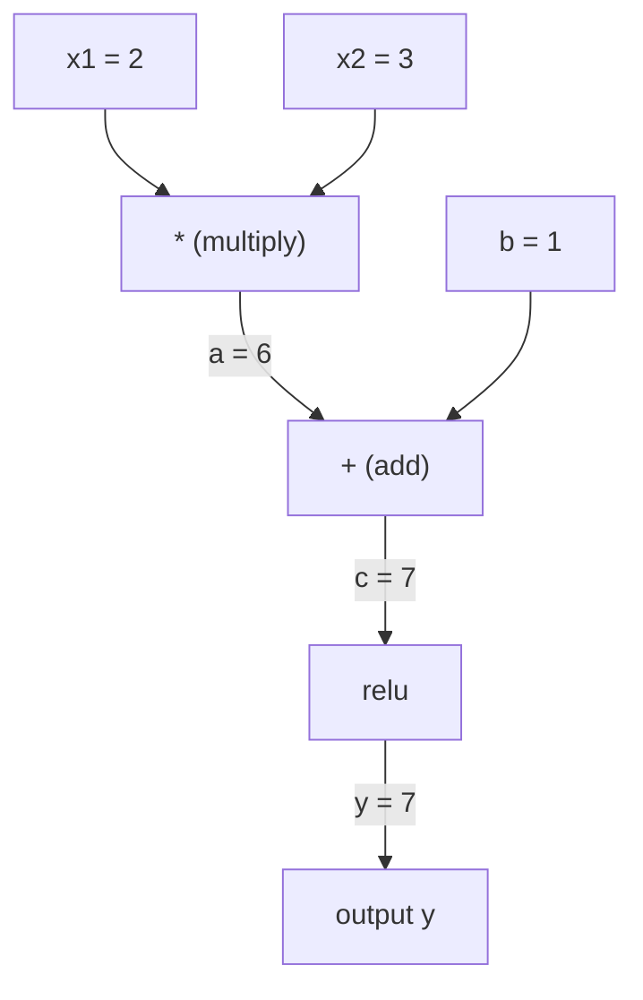
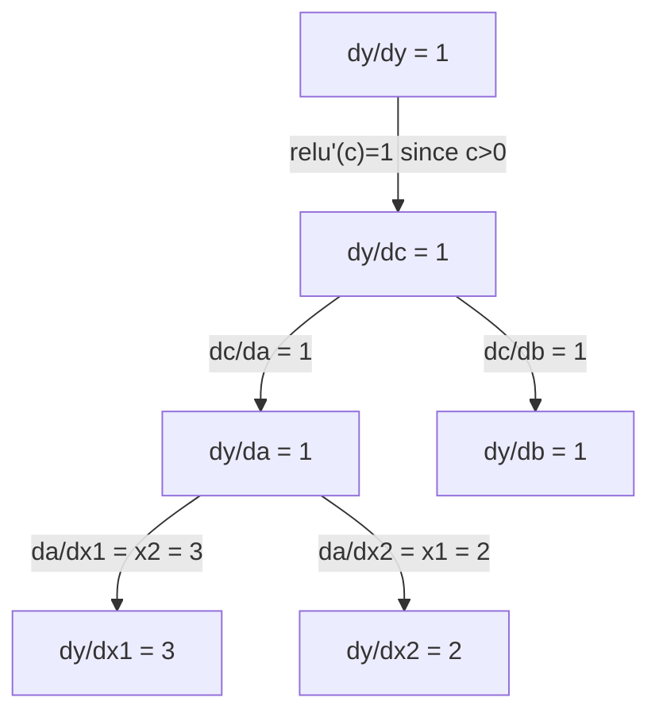

# Zincir Kuralı ve Otomatik Farklılık .

> Zincir kuralı öğrenen her sinir ağının arkasındaki motor.

**Type:** Build | **类型:** 动手
**Language:**Python .**语言:**Python
**Prerequisites:** Phase 1, Lesson 04 (Derivatives & Gradients) | **前置知识:** Phase 1, Lesson 04（导数与梯度）
**Time:** ~90 minutes | **时间:** ~90 分钟

## Öğrenme hedefleri

- Operasyonları kaydeten ve ters mod otomatik olarak gradientleri hesaplayan minimal bir otograd motoru (Değer sınıfı) oluşturun
  构建最小化 autograd 引擎(Value 类),记录运算并通过反向模式自动微分计算梯度
- Topolojik sıralama kullanarak bir hesaplama grafiği üzerinden ileri ve geri geçişler uygulayın
  Bilgisayarın ön ve karşı yönlü yayılmasını gerçekleştirmek için
- Sadece sıfırdan otograd motoru kullanarak XOR üzerinde çok katmanlı bir perceptron inşa ve eğit
  Sadece sıfırdan gerçekleştirilen otograd motorunu inşa ederek ve XOR'da eğitim veren çok katlı algılama makinesi kullanır.
- Sayısal sınırlı farklara karşı gradient kontrolü kullanarak otomatik değişikliğin doğruluğunu kontrol edin
  Sınırlama ve kontrol için sınırlı değer kullanın.

> **【中文解读】**
> 链式法则是"Fonktion Suite Function's Guide How to Calculate"──神经网络就是几百个函数嵌套在一起:矩阵乘法→加偏置→激活函数→再矩阵乘法→Softmax→交叉──链式法则让你从最后一层开始,逐层往返计算每个参数的梯度这是反向传播──

> **【拓展：链式法则 → 反向传播 → PyTorch autograd】**
> Çit kuralı ⇒ ⇒ ⇒ ⇒ ⇒ ⇒ ⇒ ⇒ ⇒ ⇒ ⇒ ⇒ ⇒ ⇒ ⇒ ⇒ ⇒ ⇒ ⇒ ⇒ ⇒ ⇒ ⇒ ⇒ ⇒ ⇒ ⇒ ⇒ ⇒ ⇒ ⇒ ⇒ ⇒ ⇒ ⇒ ⇒ ⇒ ⇒ ⇒ ⇒ ⇒ ⇒ ⇒ ⇒ ⇒ ⇒ ⇒ ⇒ ⇒ ⇒ ⇒ ⇒ ⇒ ⇒ ⇒ ⇒ ⇒ ⇒ ⇒ ⇒ ⇒ ⇒ ⇒ ⇒ ⇒ ⇒ ⇒ ⇒ ⇒ ⇒ ⇒ ⇒ ⇒ ⇒ ⇒ ⇒ ⇒ ⇒ ⇒ ⇒ ⇒ ⇒ ⇒ ⇒ ⇒ ⇒ ⇒ ⇒ ⇒ ⇒ ⇒ ⇒ ⇒ ⇒ ⇒ ⇒ ⇒ ⇒ ⇒ ⇒ ⇒ ⇒ ⇒ ⇒ ⇒ ⇒ ⇒ ⇒ ⇒ ⇒ ⇒  ⇒ ⇒ ⇒  ⇒ ⇒   ⇒ ⇒ ⇒  ⇒   ⇒ ⇒    ⇒ ⇒     ⇒ ⇒ ⇒ ⇒ ⇒     ⇒ ⇒              ⇒                                                                                                                                                                                                                   `autograd`、TensorFlow'un `GradientTape`Bu bölümde, tüm dereceleri hesaplamak için zincir biçiminde bir motor oluşturursunuz.

## Sorunlar. Sorunlar.

Basit fonksiyonların türevlerini hesaplayabilirsiniz. Ama bir sinir ağı basit bir fonksiyon değildir. Birbiriyle oluşan yüzlerce fonksiyon: matris çarpımı, tarafsızlık ekleme, etkinleştirme uygulama, matris tekrar çarpımı, softmax, çapraz entropi kaybı.

> Siz basit bir işlevin yönlendirme sayısı hesaplayabilirsiniz. Ancak sinir ağları basit bir işlevin bir parçası değildir. Bu, yüzlerce işlevin bir karmaşasıdır:矩阵乘法加偏置,激活函数 再矩阵乘法、Softmax、交叉损失──输出, işlevin bir işlevi işleviymiş gibi.

Ağı eğitmek için, her tek ağırlığa göre kaybın gradiyendine ihtiyacınız var. Bunu el ile yapmak milyonlarca parametre için imkansızdır. Sayısal olarak yapmak (sonuçlu farklılıklar) çok yavaş.

> Eğitim için bir ağ, her bir ağırlık derecesine bir kayıp gerekir.

Zincir kuralı size matematik verir. Otomatik farklılık size algoritma verir. Birlikte, tek ileri geçişle orantılı olarak, zaman içinde işlevlerin keyfi bir kompozisyonu ile kesin gradientleri hesaplamanıza izin verirler.

> 链式法则 gives mathematics, automatically gives algorithm── bitkisi de, size tek bir ön- ön ve ön- önüne yayılan eşdeğer bir zamanda, herhangi bir karmaşık işlevinin kesin derecesini hesaplamak için sağlar.

PyTorch, TensorFlow ve JAX'in işleyişleri bu şekilde.

> İşte PyTorch, TensorFlow ve JAX'in çalışma biçimi.

> **【中文解读】**神经网络 = 函数的函数的函数──链式法则让你逐层解解复合函数的导数:dL/dw = dL/d_out × d_out/d_hidden × d_hidden/d_w──自动求导把这个过程自动化PyTorch的`backward()`Bir kod satırı milyonlu parametrelerin derecesini hesaplamak için.

## Konsepten bir şey.

> **【拓展：自动求导是深度学习的引擎】**PyTorch'in `loss.backward()`Bu yöntemin sayısal değeri ise milyonlarca kat daha fazla.`backward()`Bir kez tüm parametrelerin derecesini hesaplayabildim.

### Zincir Kuralı

- Eğer`y = f(g(x))`, derivatif `y``x`Bu:

> Eğer `y = f(g(x))`,y x'in yönlendirme sayısı:

```
dy/dx = dy/dg * dg/dx = f'(g(x)) * g'(x)
```

Zincir boyunca türevleri çarpın. Her bağlantı yerel türevini ekler.

> 沿链路乘导数── her adım kendi yerel yönlendirmesine katkıda bulunur──

Örnek: `y = sin(x^2)`

```
g(x) = x^2       g'(x) = 2x
f(g) = sin(g)     f'(g) = cos(g)

dy/dx = cos(x^2) * 2x
```

> Örneğin: y = sin(x2);;内层 g(x) = x2 的导数是2x,外层 f(g) = sin(g) 的导数是 cos(g),链式相乘:dy/dx = cos(x2) × 2x。

Daha derin kompozisyonlar için zincir uzanır:

```
y = f(g(h(x)))

dy/dx = f'(g(h(x))) * g'(h(x)) * h'(x)
```

> Daha derin bir复合:y = f(g(h(x))),导数为 f'(g(h(x))) × g'(h((x)) × h'(x),每多一层就多乘一项。

Bir sinir ağının her katmanı bu zincirdeki bir bağlantıdır.

> Nöral ağın her katmanı bu zincirdeki bir bağlantıdır.

### Hesaplama Grafikleri

Bir hesaplama grafiği zincir kuralını görsel hale getirir. Her işlem bir düğüm olur. Veriler grafiğin üzerinden ileri akıyor. Gradyentler geri akıyor.

> 計算圖讓链式法则可視化── her işlem bir düğmeye dönüşür, veri ileriye akıyor, derece geriye akıyor──

> 计算图是 PyTorch autograd'ın alt katlı çekimleri:节点是运算,前向时存储中值,反向时计算局部梯度──

**Forward pass (compute values):**



**Backward pass (compute gradients):**



Geriye geçiş, her düğümde zincir kuralını uyguluyor ve çıkıştan girişlere gradientleri yayıyor.

> Karşı yönlü yayılma, her noktada kullanılan zincir kuralında, çıkıştan yayılmaya girişe kadar bir derecede olacaktır.

### Önceki Mod vs Geriye Geçerli Mod

Bir grafik aracılığıyla zincir kuralını uygulamanın iki yolu vardır.

> 通过计算图应用链式法则有两种方式──

**Forward mode**Girişlerdeki işlemleri başlatır ve türevleri ileriye doğru itirir.`dx/dx = 1`Bu, çok az giriş ve çok çıkış olduğunda iyi olur.

> **前向模式**Giriştan başlamak için ileriye doğru ilerleme gösterim sayısı.`dx/dx = 1`Ve her işlemden sonra yayılıyor.

```
Forward mode: seed dx/dx = 1, propagate forward

  x = 2       (dx/dx = 1)
  a = x^2     (da/dx = 2x = 4)
  y = sin(a)  (dy/dx = cos(a) * da/dx = cos(4) * 4 = -2.615)
```

**Reverse mode**çıkıştan başlayıp, eğrilikleri geriye çekir.`dy/dy = 1`Bu, çok fazla giriş ve çok az çıkış olduğunda iyi olur.

> **反向模式**Dışarı çıkıştan geriye doğru.`dy/dy = 1`Ve her işlemin karşı tarafa doğru. Çok fazla giriş, çok az çıkış olduğunda uygulanır.

```
Reverse mode: seed dy/dy = 1, propagate backward

  y = sin(a)  (dy/dy = 1)
  a = x^2     (dy/da = cos(a) = cos(4) = -0.654)
  x = 2       (dy/dx = dy/da * da/dx = -0.654 * 4 = -2.615)
```

Nöral ağlar milyonlarca giriş (koşul) ve bir çıkış (kayıp) vardır. Ters mod tüm gradientleri bir geri geçişle hesaplar. Bu nedenle geri yayılma ters mod kullanır.

> Neural ağında milyonlarca giriş ve bir çıkış var.

| Mode | Seed | Direction | Best when |
|------|------|-----------|-----------|
| Forward | `dx_i/dx_i = 1` | Input to output | Few inputs, many outputs |
| Reverse | `dy/dy = 1` | Output to input | Many inputs, few outputs (neural nets) |

> 两种模式对比:前向模式种子 dx/dx = 1,输入到输出,适合少输入多输出;反向模式种子 dy/dy = 1,输出到输入,适合多输入少输出(神经网络)

### Önceki Mod için Çift Sayılar

Önceki mod ikili sayı ile zarif bir şekilde uygulanabilir.`a + b*epsilon`nerede`epsilon^2 = 0`- Evet .

> Ön yönlü model, çift sayısal olarak kullanılabilir.`a + b*ε`, içinden `ε² = 0`- Evet.

```
Dual number: (value, derivative)

(2, 1) means: value is 2, derivative w.r.t. x is 1

Arithmetic rules:
  (a, a') + (b, b') = (a+b, a'+b')
  (a, a') * (b, b') = (a*b, a'*b + a*b')
  sin(a, a')         = (sin(a), cos(a)*a')
```

> Bu nedenle, bu sayıların sayısı, bir dizi metin, bir dizi metin, bir dizi metin, bir dizi metin, bir dizi metin, bir dizi metin, bir dizi metin, bir dizi metin, bir dizi metin, bir dizi metin, bir dizi metin, bir dizi metin, bir dizi metin, bir dizi metin, bir dizi metin, bir dizi metin, bir dizi metin, bir dizi metin, bir dizi metin, bir dizi metin, bir dizi metin, bir dizi metin, bir dizi metin, bir dizi metin, bir dizi metin, bir dizi metin, bir dizi metin, bir dizi metin, bir dizi metin, bir dizi metin, bir dizi metin, bir dizi metin, bir dizi metin, bir dizi metin, bir dizi metin, bir dizi metin, bir dizi metin, bir dizi metin, bir dizi metin, bir metin, bir metin, bir metin, bir metin, bir metin, bir metin, bir metin, bir metin, bir metin, bir metin, bir metin, bir metin, bir metin, bir metin, bir metin, bir metin, bir metin, bir metin, bir metin, bir metin, bir metin, bir metin, bir metin, bir metin, bir metin, bir metin, bir metin, bir metin, bir metin, bir metin, bir metin, bir metin, bir metin, bir metin, bir metin, bir metin, bir metin, bir metin, bir metin, bir metin, bir metin, bir metin, bir metin, bir metin, bir metin, metin, metin, metin, metin, metin, metin, metin, metin, metin, metin, metin, metin, metin, metin, metin, metin, metin, metin, metin, metin, metin, metin, metin, metin, metin, metin, metin, metin, metin, metin, metin, metin, metin, metin, metin, metin, metin, metin, metin, metin, metin, metin, met

Giriş değişkenini türev 1 ile ekle. türev her işlem boyunca otomatik olarak çoğalabilir.

> Giriş değişkeninin yönlendirme sayısı 1, yönlendirme sayısı her işlemden otomatik olarak yayılır.

### Autograd Motor Oluşturma

Bir otograd motoru üç şeye ihtiyaç duyar:

1. **Value wrapping.**Her sayıyı değerini ve eğilimi depolayan bir nesneye sarın.
2. **Graph recording.**Her işlem girişlerini ve yerel gradient fonksiyonunu kaydeder.
3. **Backward pass.**Topolojik olarak grafikleri sıralayıp, sonra her düğümde zincir kuralını uygulayarak tersine yürüyün.

> Autograd Motor üç şey gerektiriyor: 1.**数值包装**: Her bir rakamı depolama değerinin ve derecenin nesne olarak paketleyin;**图记录**: Her işlem giriş ve yerel derecelilik fonksiyonunu kaydeder;**反向传播**:拓排序图,反向遍历和每个节点应用链式法则──

PyTorch'ın işi tam olarak bu.`autograd`- Evet.`torch.Tensor`sınıf değerleri sarar, işlemleri kaydetir.`requires_grad=True`, ve çağrıda gradient hesaplar .`.backward()`- Evet .

> Bu da PyTorch'in.`autograd`Yapma işim.`torch.Tensor`包装数值,当 `requires_grad=True`时记录操作,调用 `.backward()`时计算梯度──

### PyTorch Autograd Kapuç altında Nasıl Çalışır

PyTorch kodu yazarken:

```python
x = torch.tensor(2.0, requires_grad=True)
y = x ** 2 + 3 * x + 1
y.backward()
print(x.grad)  # 7.0 = 2*x + 3 = 2*2 + 3
```

> PyTorch 代码时:x 设 requires_grad=True,运算自动记录,调用倒向() 后 x.grad 自动算出梯度 7.0。

PyTorch içi:

1. Bir `Tensor` için düğüm`x`- Evet .`requires_grad=True`
2. Her operasyon (`**`- Evet .`*`- Evet .`+`) yeni bir düğüm oluşturur ve geriye doğru işlevi kaydeder
3. `y.backward()`Kaydedilen grafik üzerinden ters mod otomatik devreyi tetikler
4. Her düğümün `grad_fn`Yerel gradientleri hesaplar ve ana düğümlerine aktarır
5. Gradientler `.grad`Katkı yoluyla atributlar (değiştirilmez)

> PyTorch 内部:1) X 创建紧节点;2) 每运算(**、*、+)创建新节点并记录反向函数;3) y.backward() 触发反向自动微分;4) Her节点的 grad_fn 计算局部梯度并传给父节点;5) 梯度通过加法累积到 .grad 属性(不是替代) 

Grafik dinamiktir (hareketle tanımlanır). Her ileri geçişte yeni bir grafik inşa edilir. Bu nedenle PyTorch modeller içinde kontrol akışını (eğer / başka, döngüler) destekliyor.

> 計算圖是動态的 (), 計算圖是動态的 (), 計算圖是動态的 (), 計算圖是動态的 (), 計算圖是動态的 (), 計算圖是動态的 (), 計算圖是動态的 (), 計算圖是動态的 (), 計算圖是動态的 (), 計算圖是動态的 (), 計算圖是動態的 (), 計算圖是動態的 (), 計算圖是動態的 (), 計算圖是動態的 (), 計算圖是動態的 (), 計算圖是動態的 (), 計算圖是動態的 (), 計算圖是動態的 (), 計算圖是動態的 (), 計算圖是動態的 (), 計算圖是動態的 (), 計算圖是動態的 (), 計算圖是動態的 (), 計算的的的原因 (), 計算的原因是的原因 (), 計算的原因是的原因 (), 計算的原因是的原因是是的)

## Yapın.
```figure
chain-rule
```

## Yapın

### Adım 1: Değer sınıfı

```python
class Value:
    def __init__(self, data, children=(), op=''):
        self.data = data
        self.grad = 0.0
        self._backward = lambda: None
        self._prev = set(children)
        self._op = op

    def __repr__(self):
        return f"Value(data={self.data:.4f}, grad={self.grad:.4f})"
```

> Değer sınıfı, otogradın çekirdek veri yapısıdır. Her Değer depolama değeri, derecesi, ters yönlü işlevi, kapalı ve küçük nokta işaretleri.

Her zaman .`Value`sayısal verilerini, gradiyenti (başlangıçta sıfır), geriye dönük bir fonksiyonu ve ürettiği çocuk düğümlerine işaretler depolar.

> Her biri .`Value`存储数值、梯度(初始为零) 、反向函数和产生它的子节点指针──

### Adım 2: Gradyent izleme ile aritmetik işlemler

```python
    def __add__(self, other):
        other = other if isinstance(other, Value) else Value(other)
        out = Value(self.data + other.data, (self, other), '+')
        def _backward():
            self.grad += out.grad
            other.grad += out.grad
        out._backward = _backward
        return out

    def __mul__(self, other):
        other = other if isinstance(other, Value) else Value(other)
        out = Value(self.data * other.data, (self, other), '*')
        def _backward():
            self.grad += other.data * out.grad
            other.grad += self.data * out.grad
        out._backward = _backward
        return out

    def relu(self):
        out = Value(max(0, self.data), (self,), 'relu')
        def _backward():
            self.grad += (1.0 if out.data > 0 else 0.0) * out.grad
        out._backward = _backward
        return out
```

Her işlem, yerel gradientleri hesaplayıp akıntıdaki gradientle çarpmayı bilen bir kapanma oluşturur (`out.grad`                                                                                                                                                                                                                                                                                                                                                                                                                                                                                                                             `+=`Bir değer birden fazla işlemde kullanıldığı durumları ele alır.

> Her işlem bir kapak oluşturur, nasıl hesaplanacağını bilir.`+=`处理一个值被多操作使用的情况 (Büyük bir değeri birden fazla işletim tarafından kullanılmıştır)

> 关键设计:加法的反向是1(梯度直接传给两个输入),乘法的反向是另一个操作数(链式法则:d(a*b)/da = b)。relu 的反向是0 或 1(取决于前向是否激活)。

### Adım 3: Geriye geçiş

```python
    def backward(self):
        topo = []
        visited = set()
        def build_topo(v):
            if v not in visited:
                visited.add(v)
                for child in v._prev:
                    build_topo(child)
                topo.append(v)
        build_topo(self)

        self.grad = 1.0
        for v in reversed(topo):
            v._backward()
```

Topolojik sıralama, her düğümün, çocuklarına yayılmadan önce tamamen hesaplanmasını sağlar.

> 拓排序 拓排序 拓排序 拓排序 拓排序 拓排序 拓排序 拓排序 拓排序 拓排序 拓排序 拓排序 拓排序 拓排序 拓排序 拓排序 拓排序 拓排序 拓排序 拓排序 拓排序 拓排序 拓排序 拓排序 拓排序 拓排序 拓排序 拓排序 拓排序 拓排序 拓排序 拓排序 拓排序 拓排序 拓排序 拓排序 拓排序 拓排序 拓排序 拓排序 拓排序 拓排序 拓排序 拓排序 拓排序 拓排序 拓排序 拓排序 排序 排序 排序 排序 排序 排序 排序 排序 排序 排序 排序 排序 排序 排序 排序 排排排排排排排排排 排 排 排 排 排 排 排 排 排 排 排 排 排 排 排 排 排 排 排 排 排 排 排 排 排 排 排 排 排 排 排 排 排 排 排 排 排 排 排 排 排 排 排 排 排 排 排 排 排 排 排 排 排 排 排 排 排 排 排 排 排 排 排 排 排 排 排 排 排 排 排 排 排 排 排 排 排 排 排 排 排 排 排 排 排 排 排 排 排 排 排 排 排 排 排 排 排 排 排 排 排 排 排 排 排 排 排 

> Arka doğru (Arka doğru) Algoritme: önce dönüştürülmüş yapılandırma aşamasında (Her bir aşama ortaya çıkıyor) sonra, tekrar aşama aşamasında (Her bir aşama'nın geriye doğru) aşamasında (Backward) aşamasında (Backward) aşamasında (Backward) aşamasında (Backward) aşamasında (Backward) aşamasında (Backward) aşamasında (Backward) aşamasında (Backward) aşamasında (Backward) aşamasında (Backward) aşamasında (Backward) aşamasında (Backward) aşamasında (Backward) aşamasında (Backward) aşamasında (Backward) aşamasında (Backward) aşamasında (Backward) aşamasında (Backward) aşamasında) aşamasında (Backward) aşamasında (Backward) aşamasında) aşamasında (Backward) aşamasında (Backward) aşamasında) aşamasında (Backward) aşamasında) aşamasında (Backward) aşamasında) aşamasında (Backward) aşamasında) aşamasında (Backward) aşamasında) aşamasında (Back) aşamasında) aşamasında) aşamasında (Back) aşamasında) aşamasında (Back) aşamasamasamasamasamasamasamasamasamasamasamasamasamasamasamasamasamasamasamasamasamasamasamasamasamasamasamasamasamasamasamasamasamasamasamasamasamasamasamasamasamasamasamasamasamasamasamasamasamasamasamasamasamasamasamasamasamasamasamasamasamasamasamasamasamasamasamasamasamasamasamasamasamasamasamasamasamasamasamasamasamasamasamasamasamasamasamasamasamasamasamasamasamasamasamasamasamasamasamasamasamasamasamasamasamasamasamasamasamasamasamasamasamasamasamasamasamasamasamasamasamasamasamasamasamasamasamasamasamasamasamasamasamasamasamasamasamasamasamasamasamasamasamasamasamasamasamasamasamasamasamasamasamasamasamasamasamasamasamasamasamasamasamasamasamasamasamasamasamasamasamasamasamasamasamasamasamasamasamasamasamasamasamasamasamasamasamasamasamas

### Dördüncü adım: Tam bir motor için daha fazla operasyon

Temel değer sınıfı ekleme, çarpma ve relü ile ilgilenir. Gerçek bir otograd motoruna daha fazlası gerekmektedir.

> 基础 Value 类只支持加加、乘、relu──真正的自格级 引擎需要更多操作:减法、、除法、exp、log、tanh──

```python
    def __neg__(self):
        return self * -1

    def __sub__(self, other):
        return self + (-other)

    def __radd__(self, other):
        return self + other

    def __rmul__(self, other):
        return self * other

    def __rsub__(self, other):
        return other + (-self)

    def __pow__(self, n):
        out = Value(self.data ** n, (self,), f'**{n}')
        def _backward():
            self.grad += n * (self.data ** (n - 1)) * out.grad
        out._backward = _backward
        return out

    def __truediv__(self, other):
        return self * (other ** -1) if isinstance(other, Value) else self * (Value(other) ** -1)

    def exp(self):
        import math
        e = math.exp(self.data)
        out = Value(e, (self,), 'exp')
        def _backward():
            self.grad += e * out.grad
        out._backward = _backward
        return out

    def log(self):
        import math
        out = Value(math.log(self.data), (self,), 'log')
        def _backward():
            self.grad += (1.0 / self.data) * out.grad
        out._backward = _backward
        return out

    def tanh(self):
        import math
        t = math.tanh(self.data)
        out = Value(t, (self,), 'tanh')
        def _backward():
            self.grad += (1 - t ** 2) * out.grad
        out._backward = _backward
        return out
```

**Why each operation matters:**

| Operation | Backward rule | Used in |
|-----------|--------------|---------|
| `__sub__` | Reuses add + neg | Loss computation (pred - target) |
| `__pow__` | n * x^(n-1) | Polynomial activations, MSE (error^2) |
| `__truediv__` | Reuses mul + pow(-1) | Normalization, learning rate scaling |
| `exp` | exp(x) * upstream | Softmax, log-likelihood |
| `log` | (1/x) * upstream | Cross-entropy loss, log probabilities |
| `tanh` | (1 - tanh^2) * upstream | Classic activation function |

> Çeşitli işlemlerin ters yönü kuralları:减法复用加法+取负;用 n*x^(n-1);除法复用乘法+(-1);exp用 exp(x) ×上游;log用 (1/x) ×上游;tanh用 (1-tanh2) ×上游。

Akıllı tarafı:`__sub__`ve `__truediv__`Bu işlemler, zincir kuralının altta yatan ekleme/mul/pow işlemleri ile oluşturulduğu için ücretsiz olarak doğru gradientler elde eder.

> 巧妙之處:`__sub__`和 `__truediv__`通过已有操作定义,所以梯度通过链式法则自动正确这是组合性的力量──

### Adım 5: Mini MLP sıfırdan

Tam bir değer sınıfı ile, bir sinir ağı oluşturabilirsin. PyTorch yok NumPy yok. Sadece değerler ve zincir kuralı.

> Tam bir Değer Klasi ile, sinir ağını inşa edebilirsin. PyTorch gerekmiyor NumPy gerekmiyor, sadece Değer ve Çit Kuralı ile. Karpati'nin mikro derecesinin temelini oluşturur.

```python
import random

class Neuron:
    def __init__(self, n_inputs):
        self.w = [Value(random.uniform(-1, 1)) for _ in range(n_inputs)]
        self.b = Value(0.0)

    def __call__(self, x):
        act = sum((wi * xi for wi, xi in zip(self.w, x)), self.b)
        return act.tanh()

    def parameters(self):
        return self.w + [self.b]

class Layer:
    def __init__(self, n_inputs, n_outputs):
        self.neurons = [Neuron(n_inputs) for _ in range(n_outputs)]

    def __call__(self, x):
        return [n(x) for n in self.neurons]

    def parameters(self):
        return [p for n in self.neurons for p in n.parameters()]

class MLP:
    def __init__(self, sizes):
        self.layers = [Layer(sizes[i], sizes[i+1]) for i in range(len(sizes)-1)]

    def __call__(self, x):
        for layer in self.layers:
            x = layer(x)
        return x[0] if len(x) == 1 else x

    def parameters(self):
        return [p for layer in self.layers for p in layer.parameters()]
```

A.`Neuron`hesaplamalar`tanh(w1*x1 + w2*x2 + ... + b)`- A.`Layer`Bu, nöronların bir listesidir.`MLP`Her ağırlık bir `Value`, bu yüzden arıyorum`loss.backward()`Her parametreye gradientleri yayar.

> Bir tane .`Neuron`计算 `tanh(w1*x1 + w2*x2 + ... + b)`Bir tane.`Layer`- Evet, evet.`MLP`堆叠多层──每个权重都是 `Value`, bu yüzden kullanın `loss.backward()`Bu, her bir parametreye yayılır.

**Training on XOR:**

> **在 XOR 上训练**XOR klasik bir kablosuz bir sorun, tek katlı algılama makinesi çözülemez, en az bir katlı gizli katlılık kullanmalıdır.

```python
random.seed(42)
model = MLP([2, 4, 1])  # 2 inputs, 4 hidden neurons, 1 output

xs = [[0, 0], [0, 1], [1, 0], [1, 1]]
ys = [-1, 1, 1, -1]  # XOR pattern (using -1/1 for tanh)

for step in range(100):
    preds = [model(x) for x in xs]
    loss = sum((p - y) ** 2 for p, y in zip(preds, ys))

    for p in model.parameters():
        p.grad = 0.0
    loss.backward()

    lr = 0.05
    for p in model.parameters():
        p.data -= lr * p.grad

    if step % 20 == 0:
        print(f"step {step:3d}  loss = {loss.data:.4f}")

print("\nPredictions after training:")
for x, y in zip(xs, ys):
    print(f"  input={x}  target={y:2d}  pred={model(x).data:6.3f}")
```

Bu, mikrograd. Temiz Python'da otomatik farklılık ile tam bir sinir ağı eğitim döngüsü. Her ticari derin öğrenme çerçevesinde büyük ölçekte aynı şey yapılır.

> İşte bu, mikro derece. Tamamen Python'la gerçekleştirilen tam sinir ağı eğitim döngüsü ve otomatik küçük bölümler.

> 訓練循環 5 步骤:1) 前向预测;2) 計算損失 (MSE);3) 清零所有参数梯度;4) 反向传播;5) 沿梯度负方向更新参数──这是 PyTorch 訓練循环的核心──

### Adım 6: Aralıklı kontrol

Otodiff'in doğru olduğunu nasıl bileceksin? Sayısal türevlerle karşılaştır. Bu gradient kontrolü.

> - Nasıl bildin ki, senin arabaların doğru mu?

```python
def gradient_check(build_expr, x_val, h=1e-7):
    x = Value(x_val)
    y = build_expr(x)
    y.backward()
    autodiff_grad = x.grad

    y_plus = build_expr(Value(x_val + h)).data
    y_minus = build_expr(Value(x_val - h)).data
    numerical_grad = (y_plus - y_minus) / (2 * h)

    diff = abs(autodiff_grad - numerical_grad)
    return autodiff_grad, numerical_grad, diff
```

Karmaşık bir ifadeyle test edin:

```python
def expr(x):
    return (x ** 3 + x * 2 + 1).tanh()

ad, num, diff = gradient_check(expr, 0.5)
print(f"Autodiff:  {ad:.8f}")
print(f"Numerical: {num:.8f}")
print(f"Difference: {diff:.2e}")
# Difference should be < 1e-5
```

> 测试复杂表达式:(x3 + 2x + 1) 的 tanh 在 x=0.5 处的梯度──autodiff 和数值导数 的差异应 < 1e-5,验证反向传播实现正确──

Yeni işlemler uygulandığında derecelerin kontrolü gereklidir. Geriye doğru geçişinizde bir hata varsa, sayısal kontrol onu yakalar.

> Yeni bir işlem gerçekleştirirken dereceli kontrol gereklidir. Eğer ters yönde yayılmaya karşı bir hata varsa, sayısal değer kontrolü bulunabilir.

**When to use gradient checking:**

| Situation | Do gradient check? |
|-----------|-------------------|
| Adding a new operation to your autograd | Yes, always |
| Debugging a training loop that won't converge | Yes, check gradients first |
| Production training | No, too slow (2x forward passes per parameter) |
| Unit tests for autograd code | Yes, automate it |

> 何时使用梯度检查:给自格rad 加新操作(永远要);调试不收的训练循环(先查梯度);生产训练(不要,太慢);autograd 单元测试(自动化)

### Adım 7: El hesaplama karşısında kontrol edin

```python
x1 = Value(2.0)
x2 = Value(3.0)
a = x1 * x2          # a = 6.0
b = a + Value(1.0)    # b = 7.0
y = b.relu()          # y = 7.0

y.backward()

print(f"y = {y.data}")          # 7.0
print(f"dy/dx1 = {x1.grad}")   # 3.0 (= x2)
print(f"dy/dx2 = {x2.grad}")   # 2.0 (= x1)
```

> 手动验证:y = relu(x1*x2 + 1), çünkü x1*x2 + 1 = 7 > 0,relu is恒等映射──dy/dx1 = x2 = 3,dy/dx2 = x1 = 2──引擎计算结果完全匹配──

El kontrolü: `y = relu(x1*x2 + 1)`- O zamandan beri .`x1*x2 + 1 = 7 > 0`Relu bir kimliktir.
`dy/dx1 = x2 = 3`- Evet .`dy/dx2 = x1 = 2`Motor eşleşir.

## Çerçeveyi kullanın.

### PyTorch ile karşılaştır

> PyTorch karşılaştırma testi: Torch kullanılarak yeniden yazın

```python
import torch

x1 = torch.tensor(2.0, requires_grad=True)
x2 = torch.tensor(3.0, requires_grad=True)
a = x1 * x2
b = a + 1.0
y = torch.relu(b)
y.backward()

print(f"PyTorch dy/dx1 = {x1.grad.item()}")  # 3.0
print(f"PyTorch dy/dx2 = {x2.grad.item()}")  # 2.0
```

Motorunuz PyTorch ile aynı sonucu hesaplar çünkü matematik aynı: zincir kuralıyla ters mod otomatik olarak çalıştırma.

> Aynı derecede. Motor ve PyTorch aynı sonucu hesaplar. Çünkü matematik aynıdır.

## İndirin . Ürünler .

Bu ders şunları ortaya çıkarır:
- `outputs/skill-autodiff.md`-- otograd sistemlerini oluşturma ve düzeltme becerisi
- `code/autodiff.py`- ... uzatabileceğiniz en az bir oto-üstü motoru

> 本课产出: yapılandırma ve düzenleme otograd 系统的技能文档 + 可扩展的最小自格rad 引擎代码──

Burada oluşturulan Değer sınıfı 3. aşamada sinir ağı eğitim döngüsünün temelini oluşturur.

> Bu yapılandırılmış değer sınıfı, 3 aşamada sinir ağları eğitim döngüsünün temelini oluşturur.

### Daha karmaşık bir ifade

```python
a = Value(2.0)
b = Value(-3.0)
c = Value(10.0)
f = (a * b + c).relu()  # relu(2*(-3) + 10) = relu(4) = 4

f.backward()
print(f"df/da = {a.grad}")  # -3.0 (= b)
print(f"df/db = {b.grad}")  #  2.0 (= a)
print(f"df/dc = {c.grad}")  #  1.0
```

> Daha karmaşık ifade: relu(a*b + c) a=2, b=-3, c=10 处, sonuç relu(4) = 4。df/da = b = -3,df/db = a = 2,df/dc = 1。

## Egzersizler.

1. Ekle`__pow__`Değer sınıfına gönderin böylece hesaplayabilirsiniz `x ** n`- Bunu kontrol et .`d/dx(x^3)`- ...`x=2`eşit `12.0`- Evet .
   给 Value 类添加 `__pow__`, senin hesaplayabilmeni istiyorum .`x ** n`❖ Test`d/dx(x^3)`- Evet .`x=2`处等于 `12.0`- Evet.

2. Ekle`tanh`- Bu bir aktivasyon fonksiyonu.`tanh'(0) = 1`ve `tanh'(2) = 0.0707`(Yaklaşık).
   添加 `tanh`激活函数──验证 `tanh'(0) = 1`- Evet .`tanh'(2) ≈ 0.0707`- Evet.

3. Tek bir nöron için hesaplama grafikleri oluştur: `y = relu(w1*x1 + w2*x2 + b)`Beş gradientini hesaplayın ve PyTorch'a karşı doğrulayın.
   Tek bir sinir için hesaplama yapım:`y = relu(w1*x1 + w2*x2 + b)`△ hesaplama tüm 5 ̊ ̊ ̊ ̊ ̊ ̊ ̊ ̊ ̊ ̊ ̊ ̊ ̊ ̊ ̊ ̊ ̊ ̊ ̊ ̊ ̊ ̊ ̊ ̊ ̊ ̊ ̊ ̊ ̊ ̊ ̊ ̊ ̊ ̊ ̊ ̊ ̊ ̊ ̊ ̊ ̊ ̊ ̊ ̊ ̊ ̊ ̊ ̊ ̊ ̊ ̊ ̊ ̊ ̊ ̊ ̊ ̊ ̊ ̊ ̊ ̊ ̊ ̊ ̊ ̊ ̊ ̊ ̊ ̊ ̊ ̊ ̊ ̊ ̊ ̊ ̊ ̊ ̊ ̊ ̊ ̊ ̊ ̊ ̊ ̊ ̊ ̊ ̊ ̊ ̊ ̊ ̊ ̊ ̊ ̊ ̊ ̊ ̊ ̊ ̊ ̊ ̊ ̊ ̊ ̊ ̊ ̊ ̊ ̊ ̊ ̊ ̊ ̊ ̊ ̊ ̊ ̊ ̊ ̊ ̊ ̊ ̊ ̊ ̊ ̊ ̊ ̊ ̊ ̊ ̊ ̊ ̊ ̊ ̊ ̊ ̊ ̊ ̊ ̊ ̊ ̊ ̊ ̊ ̊ ̊ ̊ ̊ ̊ ̊ ̊ ̊ ̊ ̊ ̊ ̊ ̊ ̊ ̊ ̊ ̊ ̊ ̊ ̊ ̊ ̊ ̊ ̊ ̊ ̊ ̊ ̊ ̊ ̊ ̊ ̊ ̊ ̊ ̊ ̊ ̊ ̊ ̊ ̊ ̊ ̊ ̊ ̊ ̊ ̊ ̊ ̊ ̊ ̊ ̊ ̊ ̊ ̊ ̊ ̊ ̊ ̊ ̊ ̊ ̊ ̊ ̊ ̊ ̊ ̊    ̊ ̊ ̊ ̊           ̊ ̊   ̊ ̊    ̊       ̊                ̊ ̊    ̊       ̊          

4. Önceki modda ikili numaralar kullanarak otomatik olarak kullanın.`Dual`sınıflandırıp, ters mod motorunuzla aynı türevleri verdiyse doğrulayın.
   Ardından, bir dizi çiftlik için bir ön yönlü model oluşturmak için otomatik olarak küçük bir bölüm oluşturmak.`Dual`类并验证 Bu sizin ters yönlü model motor ile aynı yönlendirmeler sağlar.

## Anahtar Şartlar .

| Term | What people say | What it actually means |
|------|----------------|----------------------|
| Chain rule | "Multiply the derivatives" | The derivative of composed functions equals the product of each function's local derivative, evaluated at the right point |
| Computational graph | "The network diagram" | A directed acyclic graph where nodes are operations and edges carry values (forward) or gradients (backward) |
| Forward mode | "Push derivatives forward" | Autodiff that propagates derivatives from inputs to outputs. One pass per input variable. |
| Reverse mode | "Backpropagation" | Autodiff that propagates gradients from outputs to inputs. One pass per output variable. |
| Autograd | "Automatic gradients" | A system that records operations on values, builds a graph, and computes exact gradients via the chain rule |
| Dual numbers | "Value plus derivative" | Numbers of the form a + b*epsilon (epsilon^2 = 0) that carry derivative information through arithmetic |
| Topological sort | "Dependency order" | Ordering graph nodes so every node comes after all its dependencies. Required for correct gradient propagation. |
| Gradient accumulation | "Add, don't replace" | When a value feeds into multiple operations, its gradient is the sum of all incoming gradient contributions |
| Dynamic graph | "Define by run" | A computation graph rebuilt on every forward pass, allowing Python control flow inside models (PyTorch style) |
| Gradient checking | "Numerical verification" | Comparing autodiff gradients against numerical finite-difference gradients to verify correctness. Essential for debugging. |
| MLP | "Multi-layer perceptron" | A neural network with one or more hidden layers of neurons. Each neuron computes a weighted sum plus bias, then applies an activation function. |
| Neuron | "Weighted sum + activation" | The basic unit: output = activation(w1*x1 + w2*x2 + ... + b). The weights and bias are learnable parameters. |

> 术语速查:Chain rule (链式法则,复合函数导数=各局部导数之积) 計算图 (计算图,运算为节点的有向无环图)  前向模式 (前向模式,输入到输出传播导数) 逆向模式 (反向模式,输出到输入传播梯度,即反向传播)  自動级 (PyTorch 自动微分系统) 双数 (双数) 偶数 (a+bε,前向模式实现)  Topolojik 拓拓拓排序,依赖排序排序点)  梯度积累积,加法不是替代) 动态下行图,前向图 (前向图)   梯度检查,激增值与重量化机 (前向图)                                                                                                                                                          

## Daha fazla okumak

- [3Blue1Brown: Backpropagation calculus](https://www.youtube.com/watch?v=tIeHLnjs5U8)-- nöral ağlarda zincir kuralının görsel açıklaması
- [PyTorch Autograd mechanics](https://pytorch.org/docs/stable/notes/autograd.html)-- gerçek sistemin nasıl çalıştığını
- [Baydin et al., Automatic Differentiation in Machine Learning: a Survey](https://arxiv.org/abs/1502.05767)-- kapsamlı referans
