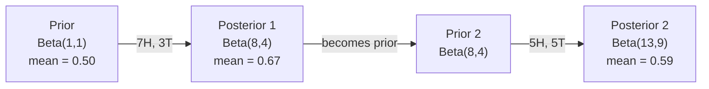

# Bayes teoremi. Bayes teorisi.

> Muhtemelen beklediğiniz şeyle ilgili Bayes teoremi de öğrendiğiniz şeyle ilgili.
> 概率 senin beklentilerine bağlı. Bayes'in teorisi senin öğrendiğin şeylere bağlı.

**Type:** Build | **类型:** 动手
**Language:**Python .**语言:**Python
**Prerequisites:** Phase 1, Lesson 06 (Probability Fundamentals) | **前置知识:** Phase 1, Lesson 06（概率基础）
**Time:** ~75 minutes | **时间:** ~75 分钟

## Öğrenme hedefleri

- Önceden, olasılıklardan ve kanıtlardan sonraki olasılıkları hesaplamak için Bayes teorimini uygulayın
- Laplace düzeltmesi ve log- uzay hesaplama ile Naive Bayes metin sınıflandırıcısını sıfırdan oluşturun
- MLE ve MAP tahminlerini karşılaştırın ve MAP'nin L2 düzenlenmesine nasıl karşılık verdiğini açıklayın
- A/B testleri için Beta-Binomial konjugat öncüleri kullanarak sıralı Bayesian güncelleştirmeyi uygulayın

> **【中文解读】**
> 贝叶斯定理的核心思想: With new evidence update your belief──先验概率──你原本的猜测──× 似然──证据出现的概率──= 后验概率──更新后的猜测──本章 简单的构建──本章 简单的构建──本章 简单的构建──本章 简单的构建──本章 简单的构建──本章 简单的构建──本章 简单的构建──本章 简单的构建──本章 简单的构建──本章 简单的构建──本章 简单的构建──本章 简单的构建──本章 简单的构建──本章 简单的构建──本章 简单的构建──本章 简单的构建──本章 简单的构建──本章 简单的构建──本章 简单的构建──本的构建──本的构建──本的构建──本的构建──本的构建──本的构建──本的构建的构建──本的构建的构建的的概率

> **【拓展：贝叶斯在 AI 中的位置】**
> - **朴素贝叶斯分类器**Bu yüzden, bu konuda çok şey öğrendim.`GaussianNB`- Ne ?`MultinomialNB`- Evet.
> - **贝叶斯优化**Optuna gibi, daha fazla arama yaparak.
> - **MAP 与正则化**Bu, Bayes'in bakış açısından "Önce uygun" olmaktan kaçınmak için yapılan bir değerdir.

## Sorunlar. Sorunlar.

> **【中文解读】**Bir tıbbi test doğruluk oranı %99'dur, sen doğruyu ölçüyorsun, gerçek hastalığa olan olasılık nedir?

## Konsepten bir şey.

> **【拓展：贝叶斯思维是 AI 的核心范式】**Bayes kararını`P(假设|证据) = P(证据|假设) × P(假设) / P(证据)`Bu arada, bu da bir şey değil.**朴素贝叶斯分类器**:垃垃垃邮过的经典方法;(2) **贝叶斯优化**:调超参数的高效方法(比网格搜索快 10 倍);(3) **MAP = L2 正则化**En büyük son tahmin, L2  ceza eklenmesine eşittir.**贝叶斯神经网络**Bilmiyorum.

Çoğu insan 99% diyor. Gerçek cevap hastalığın ne kadar nadir olduğuna bağlıdır. Eğer 10.000 kişiden 1 kişi hastalıktırsa, olumlu sonuçlar sadece hasta olma şansının %1'ini verir. Diğer olumlu sonuçların %99'u sağlıklı insanlardan gelen sahte alarmlardır.

> Çoğu insan 99% diyor. Gerçek cevap nadir hastalıklara bağlıdır. Eğer milyonda bir kişi hastalanırsa, olumlu sonuçlar sadece yaklaşık% 1 hastalığa yol açar.

Bu bir hile sorusu değil. Bayes teoremi. Her spam filtre, her tıbbi teşhis, belirsizlikleri ölçen her makine öğrenme modeli bu tam olarak mantık kullanır. İnançla başlarsınız. Kanıt görürsünüz. Güncelleştiriyorsunuz.

> Bu bir beyin sürekliliği değil. Bu Bayes'in teorisi. Her bir çöp posta filtresi, her bir tıbbi teşhis, her bir belirsizlik ölçümünün bir ML modeli aynı bir düşünceyi kullanıyor: inançtan çıkmak, kanıt görmek, inanç yenilemek.

Bunu anlamadan ML sistemleri inşa ederseniz, model çıkışlarını yanlış yorumlarsınız, kötü eşiği belirlersiniz ve aşırı güvenli tahminler gönderirsiniz.

> Eğer bunu anlamıyorsan, bir ML sistemi oluşturursan, model çıkışını yanlış yargılayacaksın, yanlış değerleri ayarlayacaksın, aşırı güvenli bir tahmin yayınlayacaksın.

## Konsepten bir şey.

### Ortak olasılıktan Bayes'e

Ders 06 ' dan beri şartsal olasılığın:

> 6. Sınıfda koşulları öğrenmiş olmalısınız.

```
P(A|B) = P(A and B) / P(B)
```

Ve simetrik olarak:

```
P(B|A) = P(A and B) / P(A)
```

Her iki ifade de aynı sayıcıya sahiptir: P(A ve B).

>  iki ifade aynı molekülün ortaklığı: P(A ve B)。 onları eşit ve yeniden düzenleyecektir:

```
P(A and B) = P(A|B) * P(B) = P(B|A) * P(A)

Therefore:

P(A|B) = P(B|A) * P(A) / P(B)
```

Bu Bayes teoremi. 4 büyüklük, 1 denklem.

> İşte Bayes'in teorisi.

### Dört bölüm

| Part | Name | What it means |
|------|------|---------------|
| P(A\|B) | Posterior / 后验 | Your updated belief about A after seeing evidence B / 看到证据 B 后对 A 的更新信念 |
| P(B\|A) | Likelihood / 似然 | How probable the evidence B is if A is true / 如果 A 为真，证据 B 出现的概率 |
| P(A) | Prior / 先验 | Your belief about A before seeing any evidence / 看到任何证据前对 A 的信念 |
| P(B) | Evidence / 证据 | Total probability of seeing B under all possibilities / 在所有可能情况下看到 B 的总概率 |

Kanıt terimi P(B) normalleştiricidir. Toplam olasılık yasasını kullanarak genişletebilirsiniz:

> 证据项 P(B) 归一化因子──全概率公式展开:

```
P(B) = P(B|A) * P(A) + P(B|not A) * P(not A)
```

### Tıbbi test örneği

Bir hastalık 10.000 kişiden 1'i etkiliyor. Test %99 doğrudur (hastalık olanların %99'unu yakalar, %1'inde yanlış pozitif verir).

> Bir hastalık, milyonlarca insanı etkileyen bir hastalık.

```
P(sick)          = 0.0001     (prior: disease is rare)
P(positive|sick) = 0.99       (likelihood: test catches it)
P(positive|healthy) = 0.01    (false positive rate)

P(positive) = P(positive|sick) * P(sick) + P(positive|healthy) * P(healthy)
            = 0.99 * 0.0001 + 0.01 * 0.9999
            = 0.000099 + 0.009999
            = 0.010098

P(sick|positive) = P(positive|sick) * P(sick) / P(positive)
                 = 0.99 * 0.0001 / 0.010098
                 = 0.0098
                 = 0.98%
```

Bir hastalığa rastlananlar bile, çoğu kez yanlış pozitif sonuçlar verir.

> %1'e kadar değil. İlk deney olasılığı da en çok görülür.

### Spam filtre örneği

"Lotteri" kelimesini içeren bir e-posta aldınız.

> "Lotteri" içeren bir e-posta aldın mı?

```
P(spam)                = 0.3      (30% of email is spam)
P("lottery"|spam)      = 0.05     (5% of spam emails contain "lottery")
P("lottery"|not spam)  = 0.001    (0.1% of legitimate emails contain "lottery")

P("lottery") = 0.05 * 0.3 + 0.001 * 0.7
             = 0.015 + 0.0007
             = 0.0157

P(spam|"lottery") = 0.05 * 0.3 / 0.0157
                  = 0.955
                  = 95.5%
```

Bir kelime olasılığı %30'dan %95.5'e kaydırır. Gerçek bir spam filtresi Bayes'i yüzlerce kelime üzerinde aynı anda uyguluyor.

> Bir kelime %30'dan %95.5'e kadar gerçekleşecek.

### Naive Bayes: Bağımsızlık varsayımı

Naive Bayes, tüm özelliklerin sınıfı göz önüne alındığında koşulsuz bağımsız olduğunu varsayarak bunu birden fazla özelliğe uzattı:

> Basitçe Beyaz, tüm özelliklerin belirli sınıf koşullarında birbirinden bağımsız olduğunu varsayarak, çeşitli özelliklere yayılacaktır:

```
P(class | feature_1, feature_2, ..., feature_n)
  = P(class) * P(feature_1|class) * P(feature_2|class) * ... * P(feature_n|class)
    / P(feature_1, feature_2, ..., feature_n)
```

"Sane" kısmı bağımsızlık varsayımıdır. Metinde, kelime olayları bağımsız değildir ("Yeni" ve "York" ilişkilidir). Ancak varsayım pratikte şaşırtıcı derecede iyi çalışır çünkü sınıflandırıcı sadece sınıfları sıralamalı, kalibrli olasılıkları üretmemelidir.

> "Pürün" kısmı bağımsızlık varsayımıdır. Yazıda, kelimelerin ortaya çıkması bağımsız değildir.

Tüm sınıflar için isimlendirici aynı olduğundan, onu atlayıp saylayıcıları karşılaştırabilirsiniz:

> Çünkü 分母 tüm sınıflara eşit olduğundan, sadece molekülleri karşılaştırarak atlayabilirsiniz:

```
score(class) = P(class) * product of P(feature_i | class)
```

En yüksek puanı alan sınıfı seç.

> 选择得分最高的类──

### Maksimum olasılık tahminleri (MLE)

Eğitim verilerinden P                                                                                                                                                                                                                                                            

> √ √ √ √ √ √ √ √ √ √ √ √ √ √ √ √ √ √ √ √ √ √ √ √ √ √ √ √ √ √ √ √ √ √ √ √ √ √ √ √ √ √ √ √ √ √ √ √ √ √ √ √ √ √ √ √ √ √ √ √ √ √ √ √ √ √ √ √ √ √ √ √ √ √ √ √ √ √ √ √ √ √ √ √ √ √ √ √ √ √ √ √ √ √ √ √ √ √ √ √ √ √ √ √ √ √ √ √ √ √ √ √ √ √ √ √ √ √ √ √ √ √ √ √ √ √ √ √ √ √ √ √ √ √ √ √ √ √ √ √ √ √ √ √ √ √ √ √ √ √ √ √ √ √ √ √ √ √ √ √ √ √ √ √ √ √ √ √ √ √ √ √ √ √ √ √ √ √ √ √ √ √ √ √ √ √ √ √ √ √ √ √ √ √ √ √ √ √ √ √ √ √ √ √ √ √ √ √ √ √ √ √ √ √ √ √ √ √ √ √ √ √ √ √ √ √ √ √ √ √     √ √ √ √             √                        

```
P("free"|spam) = (number of spam emails containing "free") / (total spam emails)
```

Bu MLE: gözlemlenen verileri en olası yapan parametreler değerlerini seçin. Muhtemelenlik fonksiyonunu en üst düzeye çıkarıyorsunuz, bu da ayrı sayılar için nispet frekansına düşürür.

> İşte MLE (Maksimal Similarity Estimation): Seçim gözlem verisini en olası ortaya çıkan parametre değerini oluşturur.

Sorun: Eğer bir kelime eğitim sırasında spam'de hiç görünmezse, MLE ona sıfır olasılık verir.

> 问题: Eğer bir kelime eğitim sırasında hiç çöp postalarında görünmezse, MLE 给它概率零――一个未见的词就会破坏整个乘积――

```
P(word|class) = (count(word, class) + 1) / (total_words_in_class + vocabulary_size)
```

Her saymaya 1 eklemek, hiç bir olasılığın asla sıfır olmadığını sağlar.

>                                                                                                                                                                                                                                                               

### Maksimum a posteriori (MAP)

MLE soruyor: hangi parametreler P ((dataparameters) maksimum olarak değerlendiriyor?

> MLE 问: P                                                                                                                                                                                                                                                            

MAP soruyor: hangi parametreler P                                                                                                                                                                                                                                                           

> MAP 问: What参数使 P parameters in data) Maksimum?

Bayes teoremiyle:

> Bayes'in teorisine göre:

```
P(parameters|data) proportional to P(data|parameters) * P(parameters)
```

MAP, parametrelerin kendileri üzerinde bir öncü ekler. Eğer parametrelerin küçük olması gerektiğine inanıyorsanız, bunu büyük değerleri cezalandıran bir öncü olarak kodlarsınız. Bu ML'deki L2 düzenlenmesine benzer. Kırmızı tepede "boğaz" cezası, ağırlıklarda kelimenin tam anlamıyla Gaussian öncüdür.

> MAP, parametre üzerinde bir ön deney ekledi. Eğer parametre daha küçük olması gerektiğini düşünüyorsanız, ön deney cezasının büyük değerini kullanın. ML'deki L2 normalleşmesiyle tamamen eşit bir değerdir.

| Estimation | Optimizes | ML equivalent |
|------------|-----------|---------------|
| MLE | P(data\|params) | Unregularized training / 无正则化训练 |
| MAP | P(data\|params) * P(params) | L2 / L1 regularization / L2/L1 正则化 |

### Bayesian vs. Frequentist: pratik fark

Frequentistler parametreyi bilinmeyen bir şey olarak görüyor ve "Bu deneyi defalarca tekrarlarsam ne olur?" diye soruyorlar.

> 频率学派将参数视为固定的未知量――:"Bu deneyi birçok kez tekrarlarsam, ne olur?" diye sordular.

Bayesililer parametreleri dağılım olarak görüyor ve "Ben gözlemlediğimden dolayı parametreler hakkında ne düşünüyorum?" diye soruyorlar.

> Bayes okulunda, parametreler dağılım olarak görülecek. "Ben gözlemlediğimden, parametrlere inancım nedir?" diye soruyorlar.

ML sistemlerinin inşaatı için pratik fark:

> Construction ML system için, gerçek fark şu:

| Aspect | Frequentist | Bayesian |
|--------|-------------|----------|
| Output | Point estimate / 点估计 | Distribution over values / 值的分布 |
| Uncertainty | Confidence intervals (about procedure) / 置信区间（关于过程） | Credible intervals (about parameter) / 可信区间（关于参数） |
| Small data | Can overfit / 可能过拟合 | Prior acts as regularization / 先验充当正则化 |
| Computation | Usually faster / 通常更快 | Often requires sampling (MCMC) / 通常需要采样（MCMC） |

Çoğu üretim ML frekansist (SGD, nokta tahminleri) Bayesian yöntemler kalibrli belirsizlik (tıp kararları, güvenlik kritik sistemleri) veya verilerin az olduğu (çık atışlı öğrenme, soğuk başlangıç) zaman parlaklık gösterir.

> Çoğu üretim ML'dir sıklık okulunun (SGD、 nokta tahminleri) ⋅ Eğer kurumsal belirsizliklere ihtiyaç duyarsanız (medical decisionmaking、 safety key system) veya çok az veri varsa (<br /><br /><br /><br /><br /><br /><br /><br /><br /><br /><br /><br /><br /><br /><br /><br /><br /><br /><br /><br /><br /><br /><br /><br /><br /><br /><br /><br /><br /><br /><br /><br /><br /><br /><br /><br /><br /><br /><br /><br /><br /><br /><br /><br /><br /><br /><br /><br /><br /><br /><br /><br /><br /><br /><br /><br /><br /><br /><br /><br /><br /><br /><br /><br /><br /><br /><br /><br /><br /><br /><br /><br /><br /><br /><br /><br /><br /><br /><br /><br /><br /><br /><br /><br /><br /><br /><br /><br /><br /><br /><br /><br /><br /><br /><br /><br /><br /><br /><br /><br /><br /><br /><br /><br /><br /><br /><br /><br /><br /><br /><br /><br /><br /><br /><br /><br /><br /><br /><br /><br /><br /><br /><br /><br /><br /><br /><br /><br /><br /><br /><br /><br /><br /><br /><br /><br /><br /><br /><br /><br />

### Bayesian düşüncesinin ML için neden önemli olduğu

Bağlantı analogiden daha derin:

> Bu bağ daha derin:

**Priors are regularization.**Gaussian önlemleri L2 düzenlemesi, Laplace önlemleri L1'dir. Her düzenleme terimini eklediğinizde, hangi parametreler değerlerini beklediğiniz hakkında Bayesian bir ifade yapıyorsunuz.

> **先验就是正则化。**Vücut ağırlığının yüksek önlemleri L2 normalleşmesidir, raplas önlemleri L1lerdir. Her normalleşme eklediğinizde, parametre beklenmedik değeri hakkında bir Bayes açıklaması yapıyorsunuz.

**Posteriors are uncertainty.**Tek tahmin edilen olasılık, modelin bu tahminle ilgili ne kadar güvenli olduğunu söylemez. Bayesian yöntemleri size bir dağılım verir: "P(spam) 0.8 ile 0.95 arasında olduğunu düşünüyorum".

> **后验就是不确定性。**单个预测概率不能告诉你模型对这个估计有多少信心――贝叶斯方法给你一个分布:"我认为P(spam) 之间0.8到0.95 之间――"

**Bayes updates are online learning.**Bugünün arkası yarınki öncesidir. Modeliniz yeni verileri gördüğünde, inançlarını sıfırdan yeniden eğitmek yerine, aşamalı olarak güncelleyecek.

> **贝叶斯更新就是在线学习。**Bugünün sonucunda, yarının sonucunda bir deneyim oluşur. Model yeni verileri gördüğünde, yeniden eğitilmek yerine inançları yenileyerek büyütür.

**Model comparison is Bayesian.**Bayesian bilgi kriterleri (BIC), sınırlı olasılıkla ve Bayes faktörleri, aşırı uygun olmadan modeller arasında seçim yapmak için Bayesian mantık kullanır.

> **模型比较是贝叶斯的。**Bayles'in bilgi kuralları (BIC) 、 边际似然と Bayles'in faktörleri, aşırı uygunluğa yol açmadan modeller arasında seçim yapmak için Bayles'in önerilerini kullanmaktadırlar.

## Yapın.
```figure
bayes-update
```

## Yapın

### Adım 1: Bayes teoremi işlevi

```python
def bayes(prior, likelihood, false_positive_rate):
    evidence = likelihood * prior + false_positive_rate * (1 - prior)
    posterior = likelihood * prior / evidence
    return posterior

result = bayes(prior=0.0001, likelihood=0.99, false_positive_rate=0.01)
print(f"P(sick|positive) = {result:.4f}")
```

### Adım 2: Naive Bayes sınıflandırıcısı

```python
import math
from collections import defaultdict

class NaiveBayes:
    def __init__(self, smoothing=1.0):
        self.smoothing = smoothing
        self.class_counts = defaultdict(int)
        self.word_counts = defaultdict(lambda: defaultdict(int))
        self.class_word_totals = defaultdict(int)
        self.vocab = set()

    def train(self, documents, labels):
        for doc, label in zip(documents, labels):
            self.class_counts[label] += 1
            words = doc.lower().split()
            for word in words:
                self.word_counts[label][word] += 1
                self.class_word_totals[label] += 1
                self.vocab.add(word)

    def predict(self, document):
        words = document.lower().split()
        total_docs = sum(self.class_counts.values())
        vocab_size = len(self.vocab)
        best_class = None
        best_score = float("-inf")
        for cls in self.class_counts:
            score = math.log(self.class_counts[cls] / total_docs)
            for word in words:
                count = self.word_counts[cls].get(word, 0)
                total = self.class_word_totals[cls]
                score += math.log((count + self.smoothing) / (total + self.smoothing * vocab_size))
            if score > best_score:
                best_score = score
                best_class = cls
        return best_class
```

Log olasılığı, düşük akışın önlenmesini sağlar. Birçok küçük olasılığı çarpırken yüzen nokta için çok küçük sayılar üretilir. Log olasılığı toplamı sayısal olarak istikrarlıdır ve matematiksel olarak eşittir.

> Sayı olasılığı önlemek için aşağı sıfırlanmak için çok küçük sayıların oluşması için çok küçük sayıların oluşması için çok küçük olasılıkların çarpması için çok küçük sayıların oluşması için sayı olasılığı artarak sayı değerleri sabit ve matematiksel eşit değerler vardır.

### Adım 3: Spam verilerini eğit

```python
train_docs = [
    "win free money now",
    "free lottery ticket winner",
    "claim your prize today free",
    "urgent offer free cash",
    "congratulations you won free",
    "meeting tomorrow at noon",
    "project update attached",
    "can we schedule a call",
    "quarterly report review",
    "lunch on thursday sounds good",
    "team standup notes attached",
    "please review the pull request",
]

train_labels = [
    "spam", "spam", "spam", "spam", "spam",
    "ham", "ham", "ham", "ham", "ham", "ham", "ham",
]

classifier = NaiveBayes()
classifier.train(train_docs, train_labels)

test_messages = [
    "free money waiting for you",
    "meeting rescheduled to friday",
    "you won a free prize",
    "please review the attached report",
]

for msg in test_messages:
    print(f"  '{msg}' -> {classifier.predict(msg)}")
```

### Dördüncü adım: Öğrenilen olasılıkları incelemek

```python
def show_top_words(classifier, cls, n=5):
    vocab_size = len(classifier.vocab)
    total = classifier.class_word_totals[cls]
    probs = {}
    for word in classifier.vocab:
        count = classifier.word_counts[cls].get(word, 0)
        probs[word] = (count + classifier.smoothing) / (total + classifier.smoothing * vocab_size)
    sorted_words = sorted(probs.items(), key=lambda x: x[1], reverse=True)
    for word, prob in sorted_words[:n]:
        print(f"    {word}: {prob:.4f}")

print("\nTop spam words:")
show_top_words(classifier, "spam")
print("\nTop ham words:")
show_top_words(classifier, "ham")
```

## Çerçeveyi kullanın.

Scikit-Learn gemileri üretime hazır saf Bayes uygulamalar:

> Scikit-learn  üretimi hazırlıklı basit bir uygulama sağladı:

```python
from sklearn.feature_extraction.text import CountVectorizer
from sklearn.naive_bayes import MultinomialNB
from sklearn.metrics import classification_report

vectorizer = CountVectorizer()
X_train = vectorizer.fit_transform(train_docs)
clf = MultinomialNB()
clf.fit(X_train, train_labels)

X_test = vectorizer.transform(test_messages)
predictions = clf.predict(X_test)
for msg, pred in zip(test_messages, predictions):
    print(f"  '{msg}' -> {pred}")
```

Aynı algoritma. CountVectorizer, işaretleme ve kelime birikimi oluşturmayı halleder. MultinomialNB, düzeltmeyi ve kayıt olasılıklarını içeride haller.

> Aynı algoritma──CountVectorizer 处理分词和词汇构建,MultinomialNB 内部处理平滑和对数概率──Zinzin 0'dan 40'e kadar sürümde aynı şeyi yaptı──

## İndirin . Ürünler .

Burada inşa edilen NaiveBayes sınıfı tüm hattı gösterir: tokenizasyon, Laplace düzleştirmesi ile olasılık tahminleri, log- uzay tahminleri.`code/bayes.py`Python'un standart kütüphanesi dışında hiçbir bağımlılık olmadan son-son çalıştırılır.

> Bu yapılandırılmış NaiveBayes sınıfı, tüm süreci gösterir:分词、带拉普拉斯平滑的概率估算、对数空间预测──`code/bayes.py`Çeviri: Python, Python, Python, Python, Python, Python, Python, Python, Python, Python, Python, Python, Python, Python, Python, Python, Python, Python, Python, Python, Python, Python, Python, Python, Python, Python, Python, Python, Python, Python, Python, Python, Python, Python, Python, Python, Python, Python, Python, Python, Python, Python, Python, Python, Python, Python, Python, Python, Python, Python, Python, Python, Python, Python, Python, Python, Python, Python, Python, Python, Python, Python, Python, Python, Python, Python, Python, Python, Python, Python, Python, Python, Python, Python, Python, Python, Python, Python, Python, Python, Python, Python, Python, Python, Python, Python, Python, Python, Python, Python, Python, Python, Python, Python, Python, Python, Python, Python, Python, Python, Python, Python, Python, Python, Python, Python, Python, Python, Python, Python, Python, Python, Python, Python, Python, Python, Python, Python, Python, Python, Python, Python, Python, Python, Python, Python, Python, Python, Python, Python, Python, Python, Python, Python, Python, Python, Python, Python, Python, Python, Python, Python, Python, Python, Python, Python, Python, Python, Python, Python, Python, Python, Python, Python, Python, Python, Python, Python, Python, Python, Python, Python, Python, Python, Python, Python, Python, Python, Python, Python, Python, Python, Python, Python, Python, Python, Python, Python, Python, Python, Python, Python, Python, Python, Python, Python, Python, Python, Python, Python, Python, Python, Python, Python, Python, Python, Python, Python, Python, Python, Python, Python, Python, Python, Python, Python, Python, Python, Python, Python, Python, Python, Python, Python, Python, Python, Python, Python, Python, Python, Python, Python, Python, Python, Python, Python, Python, Python, Python, Python, Python,

### Birlikte Birlikte Birlikte Birlikte Birlikte Birlikte Birlikte Birlikte Birlikte Birlikte Birlikte Birlikte Birlikte Birlikte Birlikte Birlikte Birlikte Birlikte Birlikte Birlikte Birlikte Birlikte Birlikte Birlikte Birlikte Birlikte Birlikte Birlikte Birlikte Birlikte Birlikte Birlikte Birlikte Birlikte Birlikte Birlikte Birlikte Birlikte Birlikte Birlikte Birlikte Birlikte Birlikte Birlikte Birlikte Birlikte Birlikte Birlikte Birlikte Birlikte Birlikte Birlikte Birlikte Birlikte Birlikte Birlikte Birlikte Birlikte Birlikte Birlikte Birlikte Birlikte Birlikte Birlikte Birlikte Birlikte Birlikte Birlikte Birlikte Birlikte Birlikte Birlikte Birlikte Birlikte Birlikte Birlikte Birlikte Birlikte Birlikte Birlikte Birlikte Birlikte Birlikte Birlikte Birlikte Birlikte Birlikte Birlikte Birlikte Birlikte Birlikte Birlikte Birlikte Birlikte Birlikte Birlikte Birlikte Birlikte Birlikte Birlikte Birlikte Birlikte Birlikte Birlikte Birlikte Birlikte Birlikte Birlikte Birlikte Birlikte Birlikte Birlikte Birlikte Birlikte Birlikte Birlikte Birlikte Birlikte Birlikte Birlikte Birlikte Birlikte Birlikte Birlikte Birlikte Birlikte Birlikte Birlikte Birlikte Birlikte Birlikte Birlikte Birlikte Birlikte Birlikte Birlikte Birlikte Birlikte Birlikte Birlikte Birlikte Birlikte Birlikte Birlikte Birlikte Birlikte Birlikte Birlikte Birlikte Birlikte Birlikte Birlikte Birlikte Birlikte Birlikte Birlikte Birlikte Birlikte Birlikte Birlikte Birlikte Birlikte Birlikte Birlikte Birlikte Birlikte Birlikte Birlikte Birlikte Birlikte Birlikte Birlikte Birlikte Birlikte Birlikte Birlikte Birlikte Birlikte Birlikte Birlikte Birlikte Birlikte Birlikte Birlikte Birlikte Birlikte Birlikte Birlikte Birlikte Birlikte Birlikte Birlikte Birlikte Birlikte Birlikte Birlikte Birlikte Birlikte Birlikte Birlikte Birlikte Birlikte Birlikte Birlikte Birlikte Birlikte Birlikte Birlikte Birlikte Birlikte Birlikte Birlikte Birlikte Birlikte Birlikte Birlikte Birlikte Birlikte Birlikte Birlikte Birlikte Birlikte Birlikte Birlikte Birlikte Birlikte Birlikte Birlikte Birlikte Birlikte Birlikte Birlikte Birlikte Birlikte Birlikte Birlikte Birlikte Birlikte Birlikte Birlikte Birlikte Birlikte Birlikte Birlikte Birlikte Birlikte Birlikte Birlikte Birlikte Birlikte Birlikte Birlikte Birlikte Birlikte Birlikte

Ön ve arka bölünme aynı bölünme ailesine ait olduğunda ön bölünme "konjugat" olarak adlandırılır. Bu Bayesian güncelleştirmesini cebirsel olarak temiz yapar.

> İlk ve son deneyler aynı dağılımlara ait olduğunda, ilk deneyler " ortak " olarak adlandırılır. Bu, bir sonraki deneylerin kapalı bir biçimde elde edilebilmesi için çok basit bir değişikliğe neden olur.

| Likelihood | Conjugate Prior | Posterior | Example |
|-----------|----------------|-----------|---------|
| Bernoulli | Beta(a, b) | Beta(a + successes, b + failures) | Coin flip bias estimation / 抛硬币偏差估计 |
| Normal (known variance) | Normal(mu_0, sigma_0) | Normal(weighted mean, smaller variance) | Sensor calibration / 传感器校准 |
| Poisson | Gamma(a, b) | Gamma(a + sum of counts, b + n) | Modeling arrival rates / 建模到达率 |
| Multinomial | Dirichlet(alpha) | Dirichlet(alpha + counts) | Topic modeling, language models / 主题建模，语言模型 |

Bu neden önemlidir: konjugat ön önlemleri olmadan, sonradan yaklaşmak için Monte Carlo örneklemesine veya varyasyon sonucuya ihtiyacınız var.

> Neden bu önemli: ortak bir öncü yoktur, yakın bir soncu deney için Monte Carlo'nun bir örnek veya bir sonucu gerekir.

Beta dağılım, pratikte en yaygın konjugat öncidir. Beta(a, b) bir olasılık parametri hakkında inancınızı temsil eder. Ortalama a/(a+b.

> Beta 分布 is the most commonly used共先验在实践中──beta(a, b) Bir olasılık parametresi inancını ifade etmektedir──平均值 is a/(a+b)──a+b 越大,分布越集中(越自信)──

Beta öncesi özel durumlar:
- Beta ((1, 1) = üniform. Parametre hakkında hiçbir fikriniz yok.
  Çince: 均分布,你对参数没有任何看法──
- Beta ((10, 10) = 0.5'e ulaştı.
  Çin Çeviri: 0.5'de en yüksek seviyede, sen güçlü olarak bu değerin 0.5'e yakın olduğunu düşünüyorsun.
- Beta ((1, 10) = 0'a doğru eğilen. Parametre küçük olduğuna inanıyorsun.
  Çeviri: 0'ya doğru, sence sayı çok küçük.

Güncelleme kuralı çok basit:

> 更新规则极其简单:

```
Prior:     Beta(a, b)
Data:      s successes, f failures
Posterior: Beta(a + s, b + f)
```

Entegral yok, örnekleme yok, sadece ekleme.

> 无需积分,无需采样,只需加法──

### Bayesian Değişiklikleri

Bayesian sonuçları doğal olarak sıradan bir şekilde gerçekleşir. Bugünün arkası yarınki öncesine dönüşür. Gerçek sistemler tüm tarihi verileri yeniden işleme yapmadan bu şekilde adım adım öğrenir.

> Bayes'in sonucu doğal olarak devamlıdır. Bugünün sonucunun yarının sonucuna dönüşmesi. Bu gerçek sistemlerin tüm tarihi verileri yeniden işlemeyerek nasıl büyütüleceğini gösterir.

Konkrete bir örnek: bir madeni paranın adil olup olmadığını tahmin etmek.

> 具体例: bir kârın adil olup olmadığını tahmin etmek

**Day 1: No data yet.**
Beta'dan başlayalım. 1'den başlayalım.
- Önceki ortalama: 0,5
- Prior, düz bir [0, 1]

> **第 1 天：还没有数据。**Beta'dan (1,1) 开始均先验,你没有预设观点──

**Day 2: Observe 7 heads, 3 tails.**
Arka = Beta(1 + 7, 1 + 3) = Beta(8, 4)
- Arka ortalama: 8/12 = 0.667
- Kanıtlar para başlara doğru yönlendirilmiş olduğunu gösteriyor

> **第 2 天：观察到 7 次正面，3 次反面。**后验 = Beta(8, 4), ortalama değer 0.667,证据暗示硬币偏向正面──

**Day 3: Observe 5 more heads, 5 more tails.**
Dünki arka parayı bugünün ön parayı olarak kullan.
Arka = Beta(8 + 5, 4 + 5) = Beta(13, 9)
- Ardından ortalama: 13/22 = 0,591
- Dengeli yeni veriler tahminleri 0.5'e geri çekmiş.

> **第 3 天：又观察 5 次正面，5 次反面。**Dünki son deneylerin bugünkü son deneylerin önüne geçmesi için kullanılır.



Gözetimlerin sırası önemli değildir. Beta(1,1) aynı anda tüm 12 baş ve 8 kuyruğu ile güncellenmiş Beta(13, 9) - aynı sonuç verir.

> 观测顺序无关紧要――Beta(1,1) 一次性用全部12次正面和8次反面更新得到Beta(13, 9)  Aynı sonuçlar──序贯更新和批量更新在数学上等价──但序贯更新让你在每步做决定而无需存储原始数据──

Bu, üretim ML sistemlerinde çevrimiçi öğrenmenin temelidir. Thompson'un banditler için örneklemesi, artışlı önerme sistemleri ve akış anomali tespitçileri bu örneği kullanır.

> Bu, ML sistemlerinde çevrimiçi öğrenmenin temelini oluşturur.

### A/B Testlerine Bağlantı

A/B testleri Bayesian sonucu olarak gizlenir.

> A/B test, sahte bir Bayes'in sonucu.

Kurulum: iki düğme rengi test ediyorsunuz. A (mavi) ve B (yeşil) variansı. Hangisinin daha fazla tıklama aldığını bilmek istiyorsunuz.

> 设置:你在测试两种按颜色──变体 A(蓝色) 和变体 B(绿色)──你想知道哪个获得更多点击──

Bayesian A/B testi:

> 贝叶斯 A/B 测试步骤:

1. **Prior.**Her iki varians için Beta ((1, 1) ile başlayın.
2. **Data.**A Variant: 1000 görüntüden 50 tıklama. B Variant: 1000 görüntüden 65 tıklama.
3. **Posteriors.**
   - A: Beta(1 + 50, 1 + 950) = Beta(51, 951). Ortalama = 0.051
   - B: Beta(1 + 65, 1 + 935) = Beta(66, 936). Ortalama = 0,066
4. **Decision.**P ((B > A) hesaplayın -- B'nin gerçek dönüşüm oranının A'dan daha yüksek olasılığı.

P (B) > A) hesaplamak analitik olarak zor ama Monte Carlo onu önemsiz kılar:

> 解析计算 P(B > A) 很难――但蒙特卡洛让这变得轻而易举:

```
1. Draw 100,000 samples from Beta(51, 951)  -> samples_A
2. Draw 100,000 samples from Beta(66, 936)  -> samples_B
3. P(B > A) = fraction of samples where B > A
```

Eğer P(B > A) > 0.95, B varianti gönderirsiniz. Eğer 0.05 ile 0.95 arasında ise, verileri toplamaya devam edersiniz.

> Eğer P(B > A) > 0.95, B değişikliği yayınlıyorsa. Eğer 0.05 ve 0.95 arasında ise, verileri toplamaya devam ediyorsa.

Sıklıklı A/B testlerine göre avantajlar:
- Doğrudan bir olasılık ifadesi elde ediyorsunuz: "B'nin daha iyi olma ihtimali %97'dir"
  Çin Çeviri: Bir Doğrudan Yeterlilik Şöyledir: "B Daha İyi Yeterlik %97'dir"
- P değerini karıştırmak yok, "siflet hipotezini reddetme" koruma yok.
  Çinçe Çevirisi: hiç p 值的混, hiç "未能拒绝零假设" kelimesinin anlamlı ifadeleri
- Yanlış pozitif oranları şişirmeyerek sonuçları herhangi bir zamanda kontrol edebilirsiniz (bir "bakma sorunu" yok)
  Çinçe çevirisi: "Sıcak bakma sorunu yok"
- Önceki bilgiyi içerebilirsiniz (örneğin, önceki testler dönüşüm oranlarının genellikle %3-8 olduğunu göstermektedir)
  Çinçe çevirisi: Önceki bilgiyi yerleştirebilirsiniz.

| Aspect | Frequentist A/B | Bayesian A/B |
|--------|----------------|--------------|
| Output | p-value / p 值 | P(B > A) |
| Interpretation | "How surprising is this data if A=B?" / "如果 A=B，数据有多令人惊讶？" | "How likely is B better than A?" / "B 比 A 好的可能性有多大？" |
| Early stopping | Inflates false positives / 会增加假阳性 | Safe at any point (given a well-chosen prior and correctly specified model) / 随时安全（假设先验选择合理且模型正确） |
| Prior knowledge | Not used / 不使用 | Encoded as Beta prior / 编码为 Beta 先验 |
| Decision rule | p < 0.05 | P(B > A) > threshold / P(B > A) > 阈值 |

## Egzersizler.

1. **Multiple tests.**Bir hasta iki kez bağımsız testlerde pozitif testler yapar (her ikisi de %99 doğrudur, hastalık yayılması 10.000'den 1'dir).

2. **Smoothing impact.**Spam sınıflandırıcısını 0.01, 0.1, 1.0 ve 10.0'luk düzeltme değerleriyle çalıştırın.

3. **Add features.**NaiveBayes sınıfını genişletmek için mesaj uzunluğu (kısık/uzun) kelimeler sayısının yanında bir özellik olarak kullanın.

4. **MAP by hand.**Görülen verileri (7 baş 10 para atışında) göz önüne alarak, tarafsızlığın MAP tahminini Beta ((2,2) öncesi kullanılarak hesaplayın.

## Anahtar Şartlar .

| Term | What people say | What it actually means |
|------|----------------|----------------------|
| Prior | "My initial guess" / "我的初始猜测" | P(hypothesis) before observing evidence. In ML: the regularization term. / 观测证据前的 P(hypothesis)。在 ML 中：正则化项。 |
| Likelihood | "How well the data fits" / "数据拟合得好不好" | P(evidence\|hypothesis). How probable the observed data is under a specific hypothesis. / 在特定假设下观测数据的概率。 |
| Posterior | "My updated belief" / "我的更新信念" | P(hypothesis\|evidence). The prior multiplied by the likelihood, then normalized. / 先验乘以似然再归一化。 |
| Evidence | "The normalizing constant" / "归一化常数" | P(data) across all hypotheses. Ensures the posterior sums to 1. / 所有假设下 P(data) 的总和，确保后验求和为 1。 |
| Naive Bayes | "That simple text classifier" / "那个简单的文本分类器" | A classifier that assumes features are independent given the class. Works well despite the false assumption. / 假设特征在给定类别下独立的分类器，尽管假设不成立但效果很好。 |
| Laplace smoothing | "Add-one smoothing" / "加一平滑" | Adding a small count to every feature to prevent zero probabilities from unseen data. / 给每个特征加一个小计数以防止未见数据的零概率。 |
| MLE | "Just use the frequencies" / "直接用频率" | Choose parameters that maximize P(data\|parameters). No prior. Can overfit with small data. / 选择使 P(data\|parameters) 最大的参数。无先验，小数据可能过拟合。 |
| MAP | "MLE with a prior" / "带先验的 MLE" | Choose parameters that maximize P(data\|parameters) * P(parameters). Equivalent to regularized MLE. / 选择使 P(data\|parameters) * P(parameters) 最大的参数，等价于正则化 MLE。 |
| Log-probability | "Work in log space" / "在对数空间计算" | Using log(P) instead of P to avoid floating-point underflow when multiplying many small numbers. / 用 log(P) 代替 P，避免许多小数相乘时的浮点下溢。 |
| False positive | "A wrong alarm" / "错误警报" | The test says positive, but the true state is negative. Drives the base rate fallacy. / 检测为阳性但实际为阴性，是基本比率谬误的根源。 |

## Daha fazla okumak

- [3Blue1Brown: Bayes' theorem](https://www.youtube.com/watch?v=HZGCoVF3YvM)- tıbbi test örneği ile görsel açıklama
- [Stanford CS229: Generative Learning Algorithms](https://cs229.stanford.edu/notes2022fall/cs229-notes2.pdf)- Naif Bayes ve onun ayrımcılık modellerine ilişkisi
- [Think Bayes](https://greenteapress.com/wp/think-bayes/)- ücretsiz kitap, Bayesian istatistikleri Python kodu ile
- [scikit-learn Naive Bayes](https://scikit-learn.org/stable/modules/naive_bayes.html)- üretim uygulamaları ve her variantın ne zaman kullanılacağı
