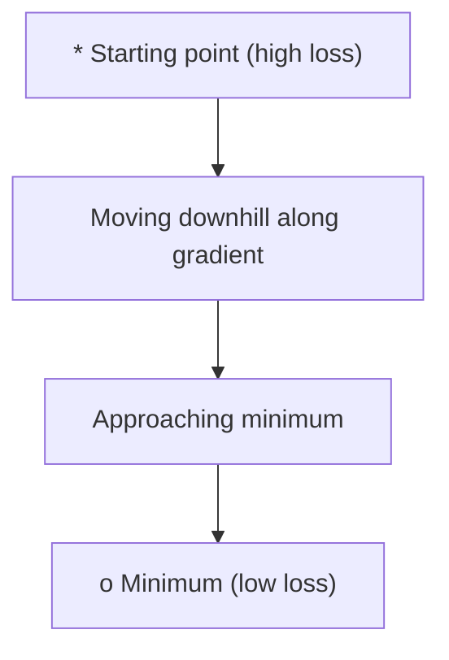
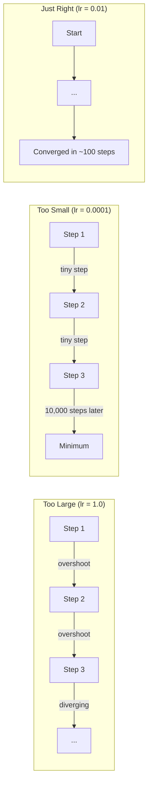
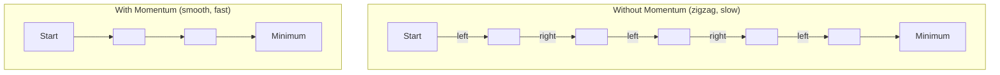
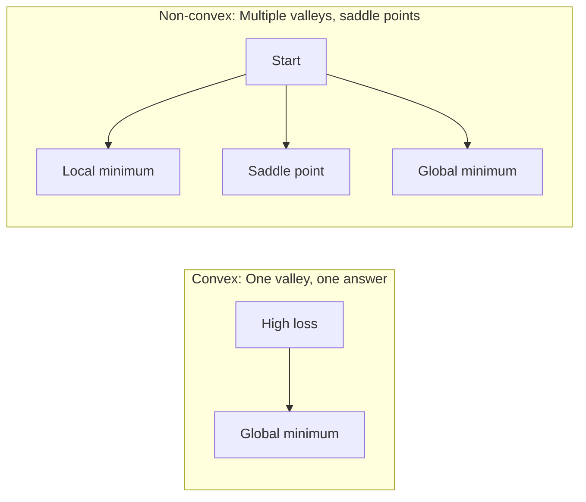
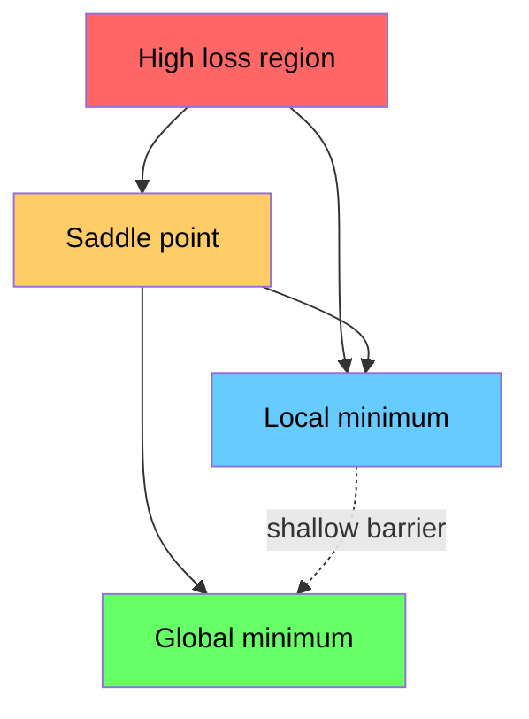

# Optimize.

> Bir sinir ağını eğitmek, bir vadinin dibini bulmaktan başka bir şey değildir.
> 訓練神經網無非就是山谷'nın en düşük noktasını bulmak.

**Type:** Build | **类型:** 动手
**Language:**Python .**语言:**Python
**Prerequisites:** Phase 1, Lessons 04-05 (Derivatives, Gradients) | **前置知识:** Phase 1, Lessons 04-05 (Derivatives, Gradients)
**Time:** ~75 minutes | **时间:** ~75 分钟

## Öğrenme hedefleri

- Vanilya derecesinin düşüşünü, SGD'yi hızla ve Adam'ı sıfırdan uygula
  Çizimden başlangıç derecesi düşüşü, hareketlilik miktarı SGD ve Adam  optimizer
- Rosenbrock fonksiyonunda optimizer konverjensiyasını karşılaştırın ve Adam'ın ağırlık başına öğrenme oranlarını neden uyarladığını açıklayın
  Rosenbrock fonksiyonunda, Adam'ın her bir yükü için kendi kendine uyum sağlayan öğrenme oranının nedenini açıklayın.
- Konveks kayıpları olmayan landşaftları ayırt edin ve yüksek boyutlarda otlak noktalarının rolünü açıklayın
  凸与非凸损曲面的区别,高维空间中点的作用的解释
- Eğitim istikrarı için öğrenme hızının programlarını (adım çöküşü, kozinik gerileme, ısınma) yapılandırmak
  配置学习率调度(步衰减、余弦退火、预热) eğitim sabitliğini sağlamak için

> **【中文解读】**
> 訓練神經網就是"山谷最低点"──損失函数 size şu anda çok fazla hata olduğunu söyler, gradient size hangi yönde hataları daha küçük yapabileceğini söyler, optimizer sizin nasıl yürüdüğünüzü belirler──本章零实现 SGD、 Momentum 和 AdamPyTorch'ın en sık kullanılan üç optimizer──

> **【拓展：优化器在 AI 中的位置】**
> - **SGD**: 最基础的优化器, tüm优化器ların "önkeleri"
> - **Adam**Günümüzde en popüler optimizer, otomatik adaptasyon öğrenme oranı + 动量, neredeyse bir tercih haline geldi.
> - **学习率调度**: 訓練初期用大步长快速接近最优,後期用小步长精细调整──Cosine Annealing 和 Warmup is Transformer 訓練的標準配置──

## Sorunlar. Sorunlar.

Kayıp fonksiyonu var. modelinizin ne kadar yanlış olduğunu söyler. Değişiklikler var. Kayıpın hangi yönde daha kötü olduğunu söylerler. Şimdi tepeden aşağı yürüyecek bir stratejiye ihtiyacınız var.

> Kayıp fonksiyonunuz size modelin çok farklı olduğunu söyler. Düzeni olduğunuz, kayıpların daha büyük olduğunuzu söyler.

Saf yaklaşım basit: gradiyentin karşısına hareket et. Adımı öğrenme oranı olarak adlandırılan bir sayıya göre ölçeyin. Tekrar ediyorum. Bu bir gradient düşüşü ve işe yarıyor. Ama "iş"in bazı uyarıları var. Çok yüksek bir öğrenme hızı var ve vadide tamamen geçiyor ve duvarlar arasında sıçrayıyorsun. Çok küçük ve binlerce gereksiz adım üzerinde cevap için kaydırırsın. Bir sedil noktasına vurur ve bir minimum bulmadığınız halde hareket etmeyi bırakırsınız.

> 朴素方法很简单:梯度反方向移动,步长由学习率控制──不断重复──这就是梯度下降──但"有效"是有条件的:学习率太大,你会跳越谷底在两壁之间来回震荡;太小,你会慢爬在数千步不必要的代中──碰到点,你会停下但未达到最低点──

Derin öğrenme alanındaki her optimizer aynı soruya cevap verir: Vadinin dibine daha hızlı ve daha güvenilir bir şekilde nasıl ulaşabilirsiniz?

> Derin öğrenimdeki her optimizasyon aynı soruya cevap veriyor: Nasıl daha hızlı, daha güvenilir bir yere çöplük altına ulaşır?

> **【中文解读】**Senin kayıpların olduğunu söyle) ve derecesi olduğunu söyle) Şimdi bir strateji gerekiyor. "Yüzün Yüzün Yüzün Yüzün" (Yüzün Yüzün Yüzün) (Yüzün Yüzün) (Yüzün Yüzün) (Yüzün Yüzün) (Yüzün Yüzün) (Yüzün Yüzün) (Yüzün Yüzün) (Yüzün Yüzün) (Yüzün Yüzün) (Yüzün Yüzün) (Yüzün Yüzün) (Yüzün Yüzün) (Yüzün Yüzün) (Yüzün Yüzün) (Yüzün Yüzün) (Yüzün Yüzün) (Yüzün Yüzün) (Yüzün Yüzün) (Yüzün Yüzün) (Yüzün Yüzün) (Yüzün) (Yüzün) (Yüzün) (Yüzün) (Yüzün) (Yüzün) (Yüzün) (Yüzün) (Yüzün) (Yüzün) (Yüzün) (Yüzün) (Yüzün) (Yüzün) (Yüzün) (Yüzün) (Yüzün) (Yüzün) (Yüzün) (Yüzün) (Yüzün) (Yüzün) (Yüzün) (Yüzün) (Yüzün) (Yüzün) (Yüzün) (Yüzün) (Yüzün) (Yüzün) (Yüzün) (Yüzün) (Yüzün) (Yüzün) (Yüzün) (Yüzün) (Yüzün) (Yüzün) (Yüzün) (Yüzün) (Yüzün) (Yüzün) (Yüzün) (Yüzün) (Yüzün) (Yüzün) (Yüzün) (Yüzün) (Yüzün) (Yüzün) (Yüzün) (Yüzün) (Yüzün) (Yüzün) (Yüzün) (Yüzün) (Yüzün) (Yüzün) (Yüzün) (Yüzün) (Yüzün) (Yüzün) (Yüzün

## Konsepten bir şey.

### Optimize etmek ne demek?

Optimize, bir fonksiyonu en aza indirgen (veya en üst düzeye çıkaran) giriş değerlerini bulmaktır. Makine öğreniminde, işlev kaybıdır. Girişler modelin ağırlıklarıdır. Eğitim optimizasyondur.

> 优化就是找到使函数最小化 (±最大化) 的输入值──在机学习中,函数是损失函数,输入是模型权重──训练就是优化──

```
minimize L(w) where:
  L = loss function
  w = model weights (could be millions of parameters)
```

> **【拓展：优化是机器学习的引擎】**訓練 = 优化──GPT-4'ün eğitim süreci şudur: 1.8 milyar parametre kaybı işlevi ile, Adam 优化器代调整参数,预测越来越准确──预测越来越准确── büyük bir Transformer eğitimi 10^20 FLOPS'ün hesaplanması gerekebilir, ancak çekirdeği operasyonın tekrar tekrar gerçekleştirilmesi.`w = w - lr * gradient`- Evet.

### Sıcak düşüş (vanil) 梯度下降 (sıradan aşağı)

En basit optimizör. Her ağırlığa göre kaybın gradiyenti hesaplayın. Her ağırlığı gradiyentin karşı yönüne taşıyin.

> En basit optimizer, her ağırlığın derecesine kayıp hesaplama, ters yöne hareket, adımlar öğrenme oranı kontrolü ile.

```
w = w - lr * gradient
```

Tüm algoritma bu.

> Bu tam bir algoritma.

> **【中文解读】**梯度下降: hesaplama kaybı her ağırlık 梯度, boyunca karşı yönde bir adım, adım adım öğrenme oranı kontrolü tarafından.`w = w - lr * gradient`, bir yolun tam algoritması──直觉:蒙着眼下山,每一步都朝最的下坡方向走──



### Öğrenme oranı: en önemli hiperparametre

Öğrenme hızı adım boyutunu kontrol eder.

> Öğrenme oranı kontrol etmesi, her şeyi kabul etmesi için karar vermesi.



Doğru öğrenme oranı için bir formül yoktur. Bunu deney yoluyla bulursunuz. Ortak başlangıç noktaları: Adam için 0.001 , SGD için 0.01 hızla.

> 没有公式能告诉你正确的学习率──你只能通过实验找到──常见起点:Adam 0.001 kullanıyor,SGD 0.01 kullanıyor.

> **【拓展：学习率选择的实践指南】**Öğrenme oranı en zor düzenlenen süper parameterdir. Deneyim kuralları: 0.001'den başlamak, gözlemleme tren eğilimi.

### SGD vs. parti vs. mini parti . SGD vs. tam miktar vs. küçük miktar

Vanilla gradient düşüşü, bir adım atmadan önce tüm veri kümesi üzerindeki gradient hesaplar. Bu, parti gradient düşüşü olarak adlandırılır.

> İlk aşama kadar tüm veri hesaplama aşamasını kullanmak için, tüm miktar aşamasını indirmek, sabit ama yavaş olarak adlandırmak gerekir.

Stochastic gradient descent (SGD), tek bir rastgele örnekte gradient hesaplar ve hemen adımlar atar.

> 随机梯度下降 (SGD) 随机梯度下降 (SGD) 随机梯度下降 (SGD) 随机梯度下降) 随机梯度下降 (SGD) 随机梯度下降 (SGD) 随机梯度下降 (SGD) 随机梯度下降) 随机更新 (SGD) 随机梯度下降 (SGD) 随机梯度下降 (SGD) 随机梯度下降 (SGD) 随机更新 (SGD) 随机梯度下降) 随机更新 (SGD) 随机梯度下降 (SGD) 随机梯度下降) 随机更新 (GD) 随机噪音大但快――

Mini-batch gradient düşüş farkı bölüyor. gradientini küçük bir parti üzerinde hesaplayın (32, 64, 128, 256 örnek), sonra adım atın.

> Küçük Satı Dönemi: Bir Satı Verimle (32、64、128、256 个样本)

| Variant | Batch size | Gradient quality | Speed per step | Noise |
|---------|-----------|-----------------|---------------|-------|
| Batch GD / 全批量 | Entire dataset | Exact / 精确 | Slow / 慢 | None / 无 |
| SGD / 随机 | 1 sample | Very noisy / 噪声大 | Fast / 快 | High / 高 |
| Mini-batch / 小批量 | 32-256 | Good estimate / 好的估计 | Balanced / 均衡 | Moderate / 中等 |

SGD ve mini-batch'taki gürültü bir hata değil.

> SGD ve küçük birimdeki gürültü bir hata değil, düşük seviyede yerel en az değer ve 点 ︎ kaçmasına yardımcı olur.

> **【中文解读】**Üç çeşit derece hesaplama yöntemleri: 1) Tüm Satır  Tüm verileri bir kez, fakat yavaş olarak hesaplamak; 2) Sürekli SGD  bir tane, fakat hızlı bir şekilde, ama gürültüyle hesaplamak; 3) Küçük Satır 折中方案, 32/64/256 条数据── gerçek AI 訓練lerinde neredeyse her şey küçük bir satır, parti boyutu ile diğer önemli bir süperparametridir.

### İndir: Top aşağı doğru yuvarlanıyor.

Vanilla gradient düşüşü sadece akım gradientini izler. Eğer gradient zigzagları (sık sık dar vadilerde) varsa, ilerleme yavaş olur. Momentum, geçmiş gradientleri bir hız terimi olarak biriktirerek bunu düzeltir.

> İlk derecede düşüş sadece mevcut derecede görülür. Eğer derece biçiminde ise, ilerleme yavaş olur.

```
v = beta * v + gradient
w = w - lr * v
```

Benzer bir örnek: bir top tepeden aşağı doğru yuvarlanır. Her çarpışmada durmaz ve yeniden başlatmaz.

> 类比: top dağ yamacından yuvarlanır. Her bir köşe üzerinde durup yeniden başlamaz.



`beta`Daha yüksek beta, daha fazla momentum, daha düzgün yollar, ama yön değişimlerine daha yavaş tepki gösterir.

> `beta`(genellikle 0.9) kontrol daha fazla tarih korumak. Daha yüksek beta daha büyük hareketlilik, daha düz bir yol anlamına gelir, ancak yön değişikliğine daha yavaş yanıt verir.

> **【拓展：动量在深度学习中的效果】**动量法让优化"记住" önceki yön, tıpkı top roll down mountain坡 gibi积累动能──好处:(1) 加快通过平坦区域;(2) 抑制震荡(在狭谷中来回弹问题)──PyTorch 中`torch.optim.SGD(lr=0.1, momentum=0.9)`Zamanı = 0.9 = normal konut.

### Adaptatif öğrenme oranı.

Farklı ağırlıkların farklı öğrenme oranlarına ihtiyacı vardır. Nadiren büyük dereceler elde eden bir ağırlık sonunda daha büyük adımlar atmalıdır. Sürekli büyük dereceler elde eden bir ağırlık daha küçük adımlar atmalıdır.

> Farklı ağırlıklar farklı öğrenme oranına ihtiyaç duyar. Çok az sayıda yüksek derecede ağırlık kazanmak daha büyük adımlar atmalıdır.

Adam (Adaptif Moment Tahmini) ağırlık başına iki şeyi takip ediyor:
  Adam (Öz-İdeleme) her bir güç için iki ölçü takip eder:

1. İlk an (m): gradientlerin (momantum gibi) akış ortalaması
   Bir aşama (m): 梯度的移动平均(类似动量)
2. İkinci an (v): seksenlik derecelerin (gradyen büyüklüğü) devam eden ortalaması
   İkinci sekme (v): 梯度平方的移动平均 (梯度大小)

```
m = beta1 * m + (1 - beta1) * gradient
v = beta2 * v + (1 - beta2) * gradient^2

m_hat = m / (1 - beta1^t)    bias correction
v_hat = v / (1 - beta2^t)    bias correction

w = w - lr * m_hat / (sqrt(v_hat) + epsilon)
```

Bölüm `sqrt(v_hat)`Bu, temel anlayışdır. Büyük gradientli ağırlıklar büyük bir sayıyla bölünür (küçük etkili adım). Küçük gradientli ağırlıklar küçük bir sayıyla bölünür (büyük etkili adım). Her ağırlık kendi uyarlayıcı öğrenme oranına sahiptir.

> Üstelik`sqrt(v_hat)`Bu, bir dizi farklılıkların farkındadır.

Öntanımlı hiperparametre: `lr=0.001, beta1=0.9, beta2=0.999, epsilon=1e-8`Bu öntanımlılar çoğu sorun için iyi çalışır.

> 默认超参数:`lr=0.001, beta1=0.9, beta2=0.999, epsilon=1e-8`Bu standartlar çoğu soruya uygundur.

> **【中文解读】**Adam = Momentum + Öz adaptasyon öğrenme oranı。 bu, her parametre için bağımsız "hız" sağlar, 梯度 tarihsel otomatik düzenleme adımları uzunluğuna göre─ 梯度 büyük parametre küçük adımlar, 梯度小的参数大步── Adam şu anda en sık kullanılan optimizer, PyTorch içi.`torch.optim.Adam(lr=0.001)`Neredeyse bir seçimdir.

### Öğrenme oranı programları

Sıkı bir öğrenme oranı bir uzlaşma. Eğitimde erken saatlerde hızlı ilerleme sağlamak için büyük adımlar atmak istersin. Eğitimde geç saatlerde, en azına yakın ince ayarlama yapmak için küçük adımlar atmak istersin.

> 固定 learning rate is a folding scheme── erken eğitim hızla ilerleme gerektirir, sonraki eğitim döneminde küçük adımlar gerektirir──

Ortak programlar:
  常见调度方式:

| Schedule / 调度方式 | Formula / 公式 | Use case / 使用场景 |
|----------|---------|----------|
| Step decay / 步衰减 | lr = lr * factor every N epochs | Simple, manual control / 简单手动控制 |
| Exponential decay / 指数衰减 | lr = lr_0 * decay^t | Smooth reduction / 平滑递减 |
| Cosine annealing / 余弦退火 | lr = lr_min + 0.5 * (lr_max - lr_min) * (1 + cos(pi * t / T)) | Transformers, modern training / Transformer、现代训练 |
| Warmup + decay / 预热+衰减 | Linear ramp up, then decay | Large models, prevents early instability / 大模型，防止早期不稳定 |

### Konveks vs. Konveks olmayan .

Bir eğri fonksiyonun en az bir tane olması gerekmektedir.`f(x) = x^2`-Konküks.

> 凸 işlevi sadece en az bir değer, gradi gradi desc descrease总能找到──像 `f(x) = x^2`Bu tür ikinci işlevi de bir konumda bulunur.

Nöral ağ kaybı fonksiyonları konveks değildir. Birçok yerel minimum, otlak noktaları ve düz bölgelere sahiptir.

> Nöral ağların kayıp işlevi belirgin değildir, birçok bölgede en az değer vardır.



Bu nedenle, bu durumun bir parçası olarak, yerel minimumlar, yüksek boyutlu sinir ağlarında nadiren bir sorun oluşturur. Çoğu yerel minimum, küresel minimumlara yakın bir kayıp değeri vardır.

> 實踐中,高维神經網絡中局部最小值很少是問題──────────────────────────────────────────────────────────────────────────────────────────────────────────────────────────────────────────────────────────────────────────────────────────────────────────────────────────────────────────────────────────────────────────────────────────────────────────────────────────────────────────────────────────────────────────────────────────────────────────────────────────────────────────────────────────────────────────────────────────────────────────────────────────────────────────────────────────────────────────────────────────────────────────────────────────────────────────────────────────────────────────────────────────────────────────────────────────────────────────────────────────────────────────────────────────────────────────────────────────────────────────────────────────────────────────────────────────────────────────────────────────────────────────────────────────────────────────────────────────────────────────────────────

> **【拓展：神经网络的损失曲面为什么是非凸的】**線性归归的损失函数凸的(1 tane en az nokta, kesinlikle bulunabilir), ancak sinir ağının kaybı eğilimi içinde sayısız yerel en az nokta ve 点 vardır. 100 milyon boyutlu parametre alanında,点(böyle bir boyut yükselme, bazı boyutların düşme noktası) yeryüzündeki en düşük noktadan çok daha fazladır. İyi haber: Adam ve diğer öz-adaptaş optimizerleri 点'den etkili olarak kaçabilirler. Bu da derin öğrenmenin iyi optimizerlere  değil sadece 梯度 aşağıya güvenmesinin nedenini de gösterir.

### Kayıp manzarayı görme kaybı

Kayıp tüm ağırlıkların işlevi. 1 milyon ağırlıklı bir model için kayıp manzarası 1.000.001 boyutlu bir alanda yaşar.

> 損失, sahip olduğu ağırlık fonksiyonudur. 100 milyon ağırlıklı model için, 損失曲面 1.000.000001 维空间 içindedir.



Keskin minimumlar kötü bir şekilde genelleşir. Düz minimeler iyi bir şekilde genelleşir. Bu, SPD'nin hızla Adam'dan son test doğruluğunda genellikle daha iyi performans göstermesinin bir nedeni: gürültüsü keskin minimumlara yerleşmesini engeller.

> 尖的最小值泛化能力差,平坦的最小值泛化能力好── bu, final test精度 üzerinde sürekli olarak Adam'dan üstün olan SGD'nin nedenlerinden biridir: gürültüsü,尖'in en düşük değerine düşmekten korur.
```figure
gradient-descent
```

## Yapın

## Yapın.

### Adım 1: Bir test fonksiyonunu tanımlayın.

Rosenbrock fonksiyonu klasik bir optimizasyon referansıdır. En azı (1, 1) bulmak kolay ama takip etmek zor olan dar bir eğri vadide bulunur.

> Rosenbrock işlevi klasik optimizasyon tabanıdır. En az değeri (1, 1), kolay bulunur ama takip etmek zor olan bir kısayolun içinde bulunur.

```
f(x, y) = (1 - x)^2 + 100 * (y - x^2)^2
```

```python
def rosenbrock(params):
    x, y = params
    return (1 - x) ** 2 + 100 * (y - x ** 2) ** 2

def rosenbrock_gradient(params):
    x, y = params
    df_dx = -2 * (1 - x) + 200 * (y - x ** 2) * (-2 * x)
    df_dy = 200 * (y - x ** 2)
    return [df_dx, df_dy]
```

### Adım 2: Vanil gradienti düşüşü.

```python
class GradientDescent:
    def __init__(self, lr=0.001):
        self.lr = lr

    def step(self, params, grads):
        return [p - self.lr * g for p, g in zip(params, grads)]
```

### Adım 3: İndirme ile SGD

```python
class SGDMomentum:
    def __init__(self, lr=0.001, momentum=0.9):
        self.lr = lr
        self.momentum = momentum
        self.velocity = None

    def step(self, params, grads):
        if self.velocity is None:
            self.velocity = [0.0] * len(params)
        self.velocity = [
            self.momentum * v + g
            for v, g in zip(self.velocity, grads)
        ]
        return [p - self.lr * v for p, v in zip(params, self.velocity)]
```

### Adım 4: Adam 4. Adım: Adam Optimizer

```python
class Adam:
    def __init__(self, lr=0.001, beta1=0.9, beta2=0.999, epsilon=1e-8):
        self.lr = lr
        self.beta1 = beta1
        self.beta2 = beta2
        self.epsilon = epsilon
        self.m = None
        self.v = None
        self.t = 0

    def step(self, params, grads):
        if self.m is None:
            self.m = [0.0] * len(params)
            self.v = [0.0] * len(params)

        self.t += 1

        self.m = [
            self.beta1 * m + (1 - self.beta1) * g
            for m, g in zip(self.m, grads)
        ]
        self.v = [
            self.beta2 * v + (1 - self.beta2) * g ** 2
            for v, g in zip(self.v, grads)
        ]

        m_hat = [m / (1 - self.beta1 ** self.t) for m in self.m]
        v_hat = [v / (1 - self.beta2 ** self.t) for v in self.v]

        return [
            p - self.lr * mh / (vh ** 0.5 + self.epsilon)
            for p, mh, vh in zip(params, m_hat, v_hat)
        ]
```

### Adım 5: Çekip karşılaştırın.

```python
def optimize(optimizer, func, grad_func, start, steps=5000):
    params = list(start)
    history = [params[:]]
    for _ in range(steps):
        grads = grad_func(params)
        params = optimizer.step(params, grads)
        history.append(params[:])
    return history

start = [-1.0, 1.0]

gd_history = optimize(GradientDescent(lr=0.0005), rosenbrock, rosenbrock_gradient, start)
sgd_history = optimize(SGDMomentum(lr=0.0001, momentum=0.9), rosenbrock, rosenbrock_gradient, start)
adam_history = optimize(Adam(lr=0.01), rosenbrock, rosenbrock_gradient, start)

for name, history in [("GD", gd_history), ("SGD+M", sgd_history), ("Adam", adam_history)]:
    final = history[-1]
    loss = rosenbrock(final)
    print(f"{name:6s} -> x={final[0]:.6f}, y={final[1]:.6f}, loss={loss:.8f}")
```

Beklenen çıkış: Adam en hızlı bir şekilde yaklaşır. SGD'nin hızı daha dengeli bir yol izler. Vanilla GD'nin dar vadide yavaş ilerlemesi.

> 预期输出:Adam 收最快,SGD with momentum 路径更平滑,原始 GD 在狭谷中进展缓慢──

## Çerçeveyi kullanın.

Pratikte PyTorch veya JAX optimizörlerini kullanın. Parametre gruplarını, ağırlık kaybını, gradient kesimini ve GPU hızlandırmasını işleyebilirler.

>  Praktede PyTorch veya JAX'in optimizerlerini kullanmakla                                                                                                                                                                                                                                                      

> **【中文解读】**PyTorch 中优化器的标准使用法:`optimizer = torch.optim.Adam(model.parameters(), lr=0.001)`Sonra da bir eğitim döngüsünde.`optimizer.zero_grad()`→ `loss.backward()`→ `optimizer.step()`Bu üç yol kodunun derin öğrenme eğitimi merkezi döngüsüdür.

```python
import torch

model = torch.nn.Linear(784, 10)

sgd = torch.optim.SGD(model.parameters(), lr=0.01, momentum=0.9)
adam = torch.optim.Adam(model.parameters(), lr=0.001)
adamw = torch.optim.AdamW(model.parameters(), lr=0.001, weight_decay=0.01)

scheduler = torch.optim.lr_scheduler.CosineAnnealingLR(adam, T_max=100)
```

Basamak kuralları:
  经验法则:

- Adam'dan başlayın (lr=0.001).
  Adam'dan (lr=0.001) 开始,无需调参即可解决大多数问题──
- En iyi son doğruluğa ihtiyacınız olduğunda ve daha fazla ayarlama yapabileceğiniz zaman (lr=0.01, momentum=0.9) SGD'ye geçin.
  En iyi son keskinlik ve daha fazla düzenlemeyi kaldırmak için, SGD'ye hızla geçiş yapın.
- Transformatörler için AdamW (Kahırılmış ağırlık kaybı olan Adam) kullanın.
  Transformer 模型使用AdamW(带解权重衰减的Adam)
- Her zaman birkaç dönemden uzun süreli eğitim için öğrenme oranı programını kullanın.
  訓練 ︎ ︎ ︎ ︎ ︎ ︎ ︎ ︎ ︎
- Eğitim dengesizse öğrenme hızını azaltın. Eğitim çok yavaşsa, onu artırın.
   eğitim sabit değilken öğrenme oranı azalır, eğitim çok yavaş giderken üniversite öğrenme oranı artırır.

## İndirin . Ürünler .

Bu ders doğru optimizasyon cihazını seçmek için bir ipucu oluşturur.`outputs/prompt-optimizer-guide.md`- Evet .

> Bu ders bir seçkin uygun optimizer ⇒ ⇒ ⇒ ⇒ ⇒ ⇒ ⇒ ⇒ ⇒ ⇒ ⇒ ⇒ ⇒ ⇒ ⇒ ⇒ ⇒ ⇒ ⇒ ⇒ ⇒ ⇒ ⇒ ⇒ ⇒ ⇒ ⇒ ⇒ ⇒ ⇒ ⇒ ⇒ ⇒ ⇒ ⇒ ⇒ ⇒ ⇒ ⇒ ⇒ ⇒ ⇒ ⇒ ⇒ ⇒ ⇒ ⇒ ⇒ ⇒ ⇒ ⇒ ⇒ ⇒ ⇒ ⇒ ⇒ ⇒ ⇒ ⇒ ⇒ ⇒ ⇒ ⇒ ⇒ ⇒ ⇒ ⇒ ⇒ ⇒ ⇒ ⇒ ⇒ ⇒ ⇒ ⇒ ⇒ ⇒ ⇒ ⇒ ⇒ ⇒ ⇒    ⇒    ⇒     ⇒                                                                                                                                                                                                                                                                                                                                  `outputs/prompt-optimizer-guide.md`- Evet.

Burada inşa edilen optimizer sınıfları, nöral ağı sıfırdan eğittikten sonra 3. aşamada yeniden ortaya çıkar.

> Bu yapılandırılan optimizer sınıfı, 3. aşamada sıfır eğitim sinir ağlarında yeniden ortaya çıkacak.

## Egzersizler.

1. **Learning rate sweep.**Rosenbrock işlevi üzerinde öğrenme oranları ile vanilya gradient düşüşü çalıştırın [0.0001, 0.0005, 0.001, 0.005, 0.01]. Her biri için 5000 adımdan sonra son kaybı çizin veya yazdırın.
   **学习率扫描。**Farklı öğrenme oranı ile [0.0001, 0.0005, 0.001, 0.005, 0.01] Rosenbrock fonksiyonunda çalışın başlangıç derecesi aşağı aşağı.

2. **Momentum comparison.**Rosenbrock fonksiyonunda momentum değerleri ile SGD çalıştırın. Her adımda kayıpları takip edin. Hangi momentum değerinin en hızlı yakınlaşması? Hangi atışlar?
   **动量比较。**Farklı değerler kullanın [0.0, 0.5, 0.9, 0.99] Rosenbrock fonksiyonunda SGD'yi çalıştırın.

3. **Saddle point escape.**Fonksiyonu tanımlayın `f(x, y) = x^2 - y^2`Vanilya GD, SGD ve Adam'ın hareketlerini karşılaştırın.
   **鞍点逃逸。**定义函数 `f(x, y) = x^2 - y^2`(原点处有点) 〜 (0.01, 0.01) 开始──Comparate original GD、SGD with momentum 和 Adam'ın davranışıyla── hangi kaçış noktası?

4. **Implement learning rate decay.**GradientDescent sınıfına bir eksponensel çöküş programı ekleyin: `lr = lr_0 * 0.999^step`Rosenbrock fonksiyonunda çürümeden ve çürümeden bir yakınlık karşılaştırın.
   **实现学习率衰减。**Gelişme oranı oranı:`lr = lr_0 * 0.999^step` Rosenbrock fonksiyonunda  oranı  oranı  oranı  oranı  oranı  oranı  oranı  oranı  oranı  oranı  oranı  oranı  oranı  oranı  oranı  oranı  oranı  oranı  oranı  oranı  oranı  oranı  oranı  oranı  oranı  oranı  oranı  oranı  oranı  oranı  oranı  oranı  oranı  oranı  oranı  oranı  oranı  oranı  oranı  oranı  oranı  oranı  oranı  oranı  oranı  oranı  oranı  oranı  oranı  oranı  oran  oranı  oran  oran  oran  oran  oran  oran  oran  oran  oran  oran  oran  oran  oran  oran  oran  oran  oran  oran  oran  oran  oran  oran  oran  oran  oran   oran                                                                                                           

## Anahtar Şartlar .

| Term / 术语 | What people say | What it actually means / 实际含义 |
|------|----------------|----------------------|
| Gradient descent / 梯度下降 | "Go downhill" | Update weights by subtracting the gradient scaled by the learning rate. The most basic optimizer. / 用学习率缩放梯度后从权重中减去，更新权重。最基础的优化器。 |
| Learning rate / 学习率 | "Step size" | A scalar that controls how far each update moves the weights. Too large causes divergence. Too small wastes compute. / 控制每次更新移动多远的标量。太大导致发散，太小浪费算力。 |
| Momentum / 动量 | "Keep rolling" | Accumulate past gradients into a velocity vector. Dampens oscillations and accelerates movement through consistent directions. / 将历史梯度累积到速度向量中。抑制震荡，在一致方向上加速。 |
| SGD / 随机梯度下降 | "Random sampling" | Stochastic gradient descent. Compute gradient on a random subset instead of the full dataset. Almost always means mini-batch SGD in practice. / 随机梯度下降。在随机子集上计算梯度。实践中几乎都指小批量 SGD。 |
| Mini-batch / 小批量 | "A chunk of data" | A small subset of training data (32-256 samples) used to estimate the gradient. Balances speed and gradient accuracy. / 训练数据的小子集（32-256 个样本），用于估计梯度。平衡速度和梯度精度。 |
| Adam / Adam 优化器 | "The default optimizer" | Adaptive Moment Estimation. Tracks per-weight running averages of gradients and squared gradients to give each weight its own learning rate. / 自适应矩估计。跟踪每个权重的梯度和平方梯度的移动平均，为每个权重提供独立的学习率。 |
| Bias correction / 偏差校正 | "Fix the cold start" | Adam's first and second moments are initialized to zero. Bias correction divides by (1 - beta^t) to compensate during early steps. / Adam 的一阶和二阶矩初始化为零。偏差校正除以 (1 - beta^t) 来补偿早期步骤。 |
| Learning rate schedule / 学习率调度 | "Change lr over time" | A function that adjusts the learning rate during training. Large steps early, small steps late. / 训练过程中调整学习率的函数。早期大步，后期小步。 |
| Convex function / 凸函数 | "One valley" | A function where any local minimum is the global minimum. Gradient descent always finds it. Neural network losses are not convex. / 任何局部最小值都是全局最小值的函数。梯度下降总能找到。神经网络损失不是凸的。 |
| Saddle point / 鞍点 | "Flat but not a minimum" | A point where the gradient is zero but it is a minimum in some directions and a maximum in others. Common in high dimensions. / 梯度为零但在某些方向是最小值、某些方向是最大值的点。在高维中常见。 |
| Loss landscape / 损失曲面 | "The terrain" | The loss function plotted over weight space. Visualized by slicing along two random directions. / 在权重空间上绘制的损失函数。通过沿两个随机方向切片来可视化。 |
| Convergence / 收敛 | "Getting there" | The optimizer has reached a point where further steps do not meaningfully reduce the loss. / 优化器已到达一个点，进一步步进不会显著降低损失。 |

## Daha fazla okumak

- [Sebastian Ruder: An overview of gradient descent optimization algorithms](https://ruder.io/optimizing-gradient-descent/)- Tüm büyük optimizörlerin kapsamlı araştırması
  梯度下降优化算法综述,全面覆盖所有主要优化器
- [Why Momentum Really Works (Distill)](https://distill.pub/2017/momentum/)- momentum dinamiklerinin etkileşimli görselleştirilmesi
  Neden hareket etkin, hareket hareketlerinin etkileşiminin görülebilirliği
- [Adam: A Method for Stochastic Optimization (Kingma & Ba, 2014)](https://arxiv.org/abs/1412.6980)- orijinal Adam kağıdı, okunur ve kısa
  Adam 原始论文, 可读且简短
- [Visualizing the Loss Landscape of Neural Nets (Li et al., 2018)](https://arxiv.org/abs/1712.09913)- keskin ve düz minimumları gösteren kağıt
  展示尖与平坦最小值论文
