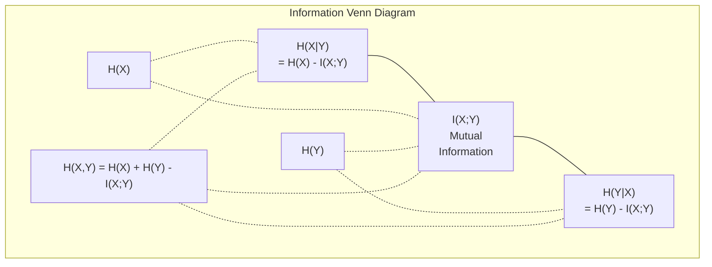

# Bilgi Teorisi . Bilgi Dergisi .

> Bilgi teorisi sürpriz ölçümleri. Kayıp fonksiyonları buna dayanıyor.
> 信息论衡惊喜程度──损失函数建立在此──

**Type:** Learn | **类型:** 学习
**Language:**Python .**语言:**Python
**Prerequisites:** Phase 1, Lesson 06 (Probability) | **前置知识:** Phase 1, Lesson 06 (Probability)
**Time:** ~60 minutes | **时间:** ~60 分钟

## Öğrenme hedefleri

- Entrofi, çapraz entropi ve KL farklılığını sıfırdan hesaplayın ve ilişkilerini açıklayın
  Zıf hesaplama 、交叉  ve KL 散度, aralarındaki ilişkiyi açıklayın
- Çarpışık entropi kaybını neden en aza indirmek log olasılığını en üst düzeye çıkarmakla eşdeğer olduğunu öğrenin .
  推导为什么最小化交叉 损失等价最大化对数似然
- Özellikler ve hedef arasındaki karşılıklı bilgileri, özellik önemini sıralamak için hesaplayın
   hesaplama özellikleri ve hedefler arasındaki karşılıklı bilgi sıralanması
- Bir dil modeli etkili kelime kümesi boyutundan seçtiği gibi karmaşıklığı açıklayın
  解释困惑度作为语言模型选择的有效词汇量

> **【中文解读】**
> 信息论 信息论 信息论 信息论 信息论 信息论 信息论 信息论 信息论 信息论 信息论 信息论 信息论 信息论 信息论 信息论 信息论 信息论 信息论 信息论 信息论 信息论 信息论 信息论 信息论 信息论 信息论 信息论 信息论 信息论 信息论 信息论 信息论 信息论 信息论 信息论 信息论 信息论 信息论 信息论 信息论 信息论 信息论 信息论 信息论 信息论 信息论 信息论 信息论 信息论 信息论 信息论 信息论 信息论 信息论 信息论 信息论 信息论 信息论 信息论 信息论 信息论 信息论 信息论 信息论 信息论 信息论 信息论 信息论 信息论 信息论 信息论 信息论 信息论 信息论 信息论 信息论 信息论 信息论 信息论 信息论 信息论 信息论 信息论 信息论 信息论 信息论 信息论 信息论 信息论 信息论 信息论 信息论 信息论 信息论 信息论 信息论 信息论 信息 信息论 信息 信息 信息论 信息 信息 信息 论 信息 论 信息 信息 信息 论 信息 信息 信息 论 信息 信息 信息 论 信息 论 信息 信息 信息 论 信息 信息 论 信息 信息 信息 论 信息 信息 论 信息 信息 信息 论 信息 信息 信息 论 信息 信息 论 信息 信息 论 信息 信息 信息 信息 信息 信息 论 信息 信息 论 信息 信息 信息 论 信息 信息 论 信息 信息 信息 论 信息 信息 信息 信息 信息 论 信息 信息 信息 信息 信息 信息 信息 信息 信息 信息 论 信息 信息 信息 论 信息 信息 信息 信息 信息 信息 信息 信息 信息 信息 信息 信息

> **【拓展：信息论在 AI 中的位置】**
> - **交叉熵损失**: 所有分类模型和语言模型的标准损失函数 (BİLİK)`CrossEntropyLoss`)。
> - **KL 散度**VAE'nin kaybı fonksiyonlarından biri, bilgi birikimi çekirdeği, RLHF'de ödüllendirme modeli eğitim amacı.
> - **困惑度(Perplexity)**语言模型的评价标准,越低越好,表示模型对下一个词的预测越确定──

## Sorunlar. Sorunlar.

> **【中文解读】**Eğitim sırasında kullandığın bir model .`CrossEntropyLoss()`Bu, bağımsız kavramlar değil, bilgi teorisinin ortak kaynağıdır, sadece farklı bir başlık değiştirmiştir.

## Konsepten bir şey.

> **【拓展：Shannon 与信息论的诞生】**1948 yılında Claude Shannon yayınladı 通信の数学理論, bit ölçümleri ile bilgi miktarı çerçevesini önerdi. 80 yıl sonra, bu çerçeve AI'nin temel taşı haline geldi:交叉 tüm sınıf ve dil modellerinin kaybı işlevi, KL 散度 is generating model (VAE、 散散模型) eğitim amacı, karşılıklı bilgi özellik seçimi araçlarıdır.

### Bilgi içeriği (Sorprize) 信息量(惊喜度)

Bir şey gerçekleşmesi beklenmedik olduğunda, daha fazla bilgi taşıyor.

> Orası çok şaşırtıcı değil.

P olasılığı olan bir olayın bilgi içeriği:
  概率为 p 的事件的信息量为:

```
I(x) = -log(p(x))
```

Log base 2'yi kullanarak bitler elde ediyoruz.
  2 olarak kullanılan doğal sayıların sayılarının sayılarının sayılarının sayılarının sayılarının sayılarının sayılarının sayılarının sayılarının sayılarının sayılarının sayılarının sayılarının sayılarının sayılarının sayılarının sayılarının sayılarının sayılarının sayılarının sayılarının sayılarının sayılarının sayılarının sayılarının sayılarının sayılarının sayılarının sayılarının sayılarının sayılarının sayılarının sayılarının sayılarının sayılarının sayılarının sayılarının sayılarının sayılarının sayılarının sayılarının sayılarının sayılarının sayılarının sayılarının sayılarının sayılarının sayılarının sayılarının sayılarının sayılarının sayılarının sayılarının sayılarının sayılarının sayılarının sayılarının sayılarının sayılarının sayılarının sayılarının sayılarının sayılarının sayılarının sayılarının sayılarının sayılarının sayılarının sayılarının sayılarının sayılarının sayılarının sayılarının sayılarının sayılarının sayılarının sayılarının sayılarının sayılarının sayılarının sayılarının sayılarının sayılarının sayılarının sayılarının sayılarının sayılarının sayılarının sayılarının sayılarının sayılarının sayılarının sayılarının sayılarının sayılarının sayılarının sayılarının sayılarının sayılarının sayılarının sayılarının sayılarının sayılarının sayılarının sayılarının sayılarının sayılarının sayılarının sayılarının sayılarının sayılarının sayıların sayılarının sayılarının sayılarının sayılarının sayıların sayılarının sayılarının sayılarının sayılarının sayılarının sayılarının sayılarının sayılarının sayılarının sayılarının sayılarının sayılarının sayılarının sayılarının sayılarının sayılarının sayılarının sayılarının sayılarının sayılarının sayılarının sayılarının sayılarının sayılarının sayılarının sayılarının sayılarının sayılarının sayılarının sayılarının sayılarının sayılarının sayılarının sayılarının sayılarının sayılarının sayılarının sayılarının sayılarının sayılarının sayılarının sayılarının sayılarının sayılarının sayılarının sayılarının sayılarının sayılarının sayılarının sayılarının sayılarının sayılarının sayılarının sayılarının sayılarının sayılarının sayılarının sayılarının sayılarının sayılarının sayılarının sayılarının sayılarının sayılarının sayılarının sayılarının sayılarının sayılarının sayılarının sayılarının sayılarının sayılarının sayılarının sayılarının sayılarının sayılarının sayılarının sayılarının sayılarının sayılarının sayılarının sayılarının sayılarının sayılarının sayılarının sayılarının sayılarının sayı ile bir değeri vardır.

```
Event              Probability    Surprise (bits)
Fair coin heads    0.5            1.0
Rolling a 6        0.167          2.58
1-in-1000 event    0.001          9.97
Certain event      1.0            0.0
```

Bazı olaylar sıfır bilgi taşır.
> Muhtemelen olaylar, hiçbir şeyle beraber değildir.

### - Ne kadar şaşırtıcı.

Entropi, bir dağıtımın tüm olası sonuçları üzerinde beklenen sürprizdir.
> 是分布中所有可能结果的期待惊喜──

```
H(P) = -sum( p(x) * log(p(x)) )  for all x
```

Bir adil maden, ikili değişken için en fazla entropiye sahiptir: 1 bit. Tarafsız bir maden (% 99 başları) düşük entropiye sahiptir: 0.08 bit. Ne olacağını zaten biliyorsunuz, bu yüzden her atış size neredeyse hiçbir şey söylemez.
> 公平硬币对二元变量有最大:1 比特──偏置硬币(99% 正面) 的非常低:0.08 比特──你已经知道会发生什么,所以每次抛货币几乎没有提供新信息──

```
Fair coin:    H = -(0.5 * log2(0.5) + 0.5 * log2(0.5)) = 1.0 bit
Biased coin:  H = -(0.99 * log2(0.99) + 0.01 * log2(0.01)) = 0.08 bits
```

Entropi bir dağılımdaki eksiksiz belirsizlikleri ölçer.
>  Ölçüm dağılımında belirsizliklerin azalması mümkün değil.

### Çarpıcı entropiy (Her gün kullandığınız kaybı işlevi)

Çelişki entropisi, P dağılımından gelen olayları kodlamak için dağılım Q'yi kullandığınızda ortalama sürpriz ölçümünü ölçer.
> 交叉 ölçüm dağılım kullanımı Q 编码 aslında kendinize P'nin olayları sırasında ortalama şaşırtıcılık

```
H(P, Q) = -sum( p(x) * log(q(x)) )  for all x
```

P, gerçek dağılımdır. Q, modelinizin tahminidir. Q, P ile mükemmel bir şekilde eşleşirse, çapraz entropi entropiye eşittir. Herhangi bir eşleşme eksikliği onu daha büyük yapar.
> P gerçek dağılımdır, Q modelin öngörüdür. Eğer Q mükemmel bir uyumlu P ise,交叉等于── herhangi bir uyumsuzluk onu daha büyük yapar.

Sınıflandırmada, P bir tek sıcak vektördür (gerçek sınıfın olasılığı 1'dir, diğer her şey 0). Bu, çapraz entropiyi basitleştirir:
> Bu nedenle, P = 1'den daha fazla.

```
H(P, Q) = -log(q(true_class))
```

Bu sınıflandırma için bütün çapraz entropi kaybı formülü. Doğru sınıfın öngörülen olasılıklarını en üst düzeye çıkarın.
> Bu, sınıfın tam değişimi  kaybı formülü                                                                                                                                                                                                                                                                                                                                                                                                                                                                                                                  

### KL Farklılık (Distributions Distance)

KL farklılığı, P yerine Q kullanmanın ne kadar fazladan sürpriz aldığını ölçer.
> KL 散度量量使用 Q 代替 P 时多出的惊喜度──

```
D_KL(P || Q) = sum( p(x) * log(p(x) / q(x)) )  for all x
             = H(P, Q) - H(P)
```

Çelişki entropisi, entropi artı KL farklılığıdır. Gerçek dağılımın entropi eğitimin sırasında sabit olduğundan, çapraz entropiyi en aza indirmek KL farklılığı en aza indirmekle aynıdır.
> 交叉 =  + KL 散度──由于训练过程中真实分布的是常数,最小化交叉等价于最小化 KL 散度──你在把模型分布推向真实分布──

KL farklılığı simetrik değildir: D_KL(P  Q) != D_KL(Q  P). Gerçek bir mesafe metrik değildir.
> KL 散度不对称:D_KL  P_  Q) != DKL  Q                                                                                                                                                                                                                                                 

### Karşılıklı bilgi .

Karşılıklı bilgi, bir değişkenin bir değişken hakkında ne kadar bilgi vermesini ölçer.
> 互信息衡量知道一个变量后能告诉你关于另一个变量多少信息──

```
I(X; Y) = H(X) - H(X|Y)
        = H(X) + H(Y) - H(X, Y)
```

Eğer X ve Y bağımsız ise karşılıklı bilgi sıfırdır. Birini bilmek size diğerini hakkında hiçbir şey söylemez. Eğer mükemmel bir şekilde ilişkili ise karşılıklı bilgi her iki değişkenin entropiye eşit olur.
> Eğer X ve Y  bağımsız ise, birbirinin bilgisi sıfırdır. Bilirsin ki, biri diğerinin herhangi bir bilgisi hakkında size hiçbir şey söyleyemez. Eğer tamamen ilişkili ise, birbirinin bilgisi bir değişkenin ──'e eşit olur.

Özellik seçimi sırasında, bir özellik ve hedef arasındaki yüksek karşılıklı bilgi, özellikin yararlı olduğu anlamına gelir.
> Özellik seçimi sırasında, özellik ve hedef arasındaki yüksek etkileşim özellik kullanışlı anlamına gelir.

### Şartlı Entropi.

H(Y de X) Y hakkında ne kadar belirsizlik kaldığını ölçer.
> H(Y X)  Y hakkında daha fazla belirsizlik var 

```
H(Y|X) = H(X,Y) - H(X)
```

İki aşırılık:
  İki uç:

- Eğer X tamamen Y'yi belirlerse, H(Y de X) = 0. X'i bilmek Y hakkında tüm belirsizlikleri ortadan kaldırır. Örnek: X = sıcaklık Celsius, Y = sıcaklık Fahrenheit.
  Eğer X tamamen Y'yi belirlese, H(Y'nin X'i = 0── bilir X  Y'ye ilişkin tüm belirsizlikleri ortadan kaldırır.
- Eğer X size Y hakkında hiçbir şey söylemezse, H(YX ) = H(Y). X'i bilmek hiç de belirsizlikinizi azaltmaz.
  Eğer X ile Y arasında herhangi bir bilgi yoksa, H(YX de) = H(Y) ・・・ bilir X 完全不减少不确定性。

Şartlı entropi her zaman negatif değildir ve asla H(Y'yi aşmaz:
> 条件始终非负且不超过 H(Y):

```
0 <= H(Y|X) <= H(Y)
```

Makine öğreniminde koşullu entropi karar ağaçlarında ortaya çıkar. Her bölünmede, algoritma H(Y) ile ilgili en fazla belirsizlikten kurtulduğu özelliği olan H ((Y)) değerini en aza indirgenir.
> Makineler öğreniminde, koşullar karar ağacında ortaya çıkar. Her bölünme sırasında, algoritma H  Y Y Y X'yi seçer. En küçük özellik X                                                                                                                                                                                                                                            

### Ortak Entropi.

H(X,Y) X ve Y'nin ortak dağılımının entropi.
> H(X,Y) X 和 Y 联合分布的──

```
H(X,Y) = -sum sum p(x,y) * log(p(x,y))   for all x, y
```

Ana özellik:
  关键性质:

```
H(X,Y) <= H(X) + H(Y)
```

X ve Y bağımsız olduğunda eşitlik geçerlidir. Bilgiler paylaşırsa, ortak entropi bireysel entropi toplamından daha azdır. "Kayıp" entropi tam olarak karşılıklı bilgi.
> X ve Y 独立时等号成立时―― eğer onlar paylaşmak bilgi, birleşmek 小于各自之和──"缺失" 恰好是互信息──



İlişkiler:
  关系式:

- H(X,Y) = H(X) + H(Y
- H (H) - H (H) - H (H) - H (H) - H (H) - H (H) - H (H) - H (H) - H (H) - H (H) - H (H) - H (H) - H (H) - H (H) - H (H) - H (H) - H (H) - H (H) - H (H) - H (H) - H (H) - H (H) - H (H) - H (H) - H (H) - H (H) - H (H) - H (H) - H (H) - H (H) - H (H) - H (H) - H (H) - H (H) - H) - H (H) - H (H) - H) - H (H) - H) - H (H) - H) - H (H) - H) - H) - H (H) - H) - H) - H (H) - H) - H) - H) - H) - H (H) - H) - H) - H) - H) - H - H - H - H - H - H - H - H - H - H - H - H - H - H - H - H - H - H - H - H - H - H - H - H - H - H - H - H - H - H - H - H - H - H - H - H - H - H - H - H - H - H - H - H - H - H - H - H - H - H - H - H - H - H - H - H - H - H - H - H - H - H - H - H - H - H - H - H - H - H - H - H - H - H - H - H - H - H - H - H - H - H - H - H - H - H - H - H - H - H - H - H - H - H - H - H - H - H - H - H - H - H - H - H - H - H - H - H - H - H - H - H - H - H - H - H - H - H - H - H - H - H - H - H - H - H -
- H(X,Y) = H(X) + H(Y) - I(X;Y)

### Karşılıklı Bilgi (Deep Dive) 互信息(深入理解)

Karşılıklı bilgi I(X;Y) bir değişkenin ne kadar bilinmesi diğerine ilişkin belirsizlikleri azaltır.
> 互信息 I(X;Y) 量化知道一个变量后对另一个变量不确定性的减少量──

```
I(X;Y) = H(X) - H(X|Y)
       = H(Y) - H(Y|X)
       = H(X) + H(Y) - H(X,Y)
       = sum sum p(x,y) * log(p(x,y) / (p(x) * p(y)))
```

Özellikleri:
  Seks:

- I ((X;Y) >= 0 her zaman. Bir şeyi gözlemleyerek asla bilgiyi kaybetmezsiniz.
  I(X;Y) >= 0 始终成立──观察事物永远不会丢失信息──
- I(X;Y) = 0 eğer ve sadece X ve Y bağımsızsa.
  I(X;Y) = 0 当且仅当 X 和 Y 独立。
- I(X;Y) = I(Y;X) KL farklılığından farklı olarak simetriktir.
  I(X;Y) = I(Y;X) ・・・ bu, KL 散度 ile farklı olarak,
- I(X;X) = H(X). Bir değişken tüm bilgilerini kendisiyle paylaşır.
  I(X;X) = H(X)。变量与自身共享所有信息──

**Mutual information for feature selection.**ML'de hedef hakkında bilgilendirici özellikler istiyorsunuz. karşılıklı bilgi size özellikleri sıralamanın prensipsel bir yolunu sağlar:
> **互信息用于特征选择。**Makine öğreniminde, hedeflerin bilgi miktarı özelliklerine ihtiyaç duyarsınız.

1. Her bir özellik için X_i, Y hedef değişken olduğu I(X_i; Y) hesaplayın.
   Her bir özellik için X_i, hesap I(X_i; Y), Y ise hedef değişimidir.
2. MI puanı ile sıralama özellikleri.
   按MI 得分排序特征──
3. Üst k özelliklerini tut.
   Kalmak için bir şey yapın.

Bu özellik ve hedef arasındaki herhangi bir ilişki için çalışır - doğrusal, doğrusal olmayan, tek sesli veya değil. Korrelasyon sadece doğrusal ilişkileri yakalar. MI her şeyi yakalar.
> Bu, özellik ve hedef arasındaki herhangi bir ilişki için geçerlidir 线性、非线性、单调的或非单调的──相关性只能捕捉线性关系,互信息只能捕捉一切──

| Method / 方法 | Detects / 检测 | Computational cost / 计算成本 | Handles categorical? / 处理类别型？ |
|--------|---------|-------------------|---------------------|
| Pearson correlation / 皮尔逊相关 | Linear relationships / 线性关系 | O(n) | No / 否 |
| Spearman correlation / 斯皮尔曼相关 | Monotonic relationships / 单调关系 | O(n log n) | No / 否 |
| Mutual information / 互信息 | Any statistical dependency / 任何统计依赖 | O(n log n) with binning | Yes / 是 |

### Etiket: Düzeltme ve Çelişki İçeriği

Standart sınıflandırma sert hedefler kullanır: [0, 0, 1, 0]. Gerçek sınıf olasılık 1 alır, diğer her şey 0. Etiket düzeltme bunları yumuşak hedeflerle değiştirir:
> 标准分类使用硬目标:[0, 0, 1, 0]──真实类概率为 1,其余为 0──标签平滑将其替换为软目标:

```
soft_target = (1 - epsilon) * hard_target + epsilon / num_classes
```

Epsilon = 0,1 ve 4 sınıf:
  Epsilon = 0.1 ve 4 sınıf vardır:

- Zor hedef: [0, 0, 1, 0]
- Yumuşak hedef: [0.025, 0.025, 0.925, 0.025]

Bilgi teorisi açısından etiket düzeltmesi hedef dağılımının entropiyi arttırır. sert bir sıcak hedeflerin entropi 0 vardır - belirsizlik yoktur. yumuşak hedeflerin pozitif entropi vardır.
> Bilgi teorisi açısından, etiket düzleminin hedef dağılımının artması ⋅ sert bir sıcak ⋅ hedeflerin ⋅ 0 ⋅ belirsizlik ⋅ yumuşak hedeflerin doğru ⋅

Bu neden yardımcı oluyor:
  Neden bu işe yarıyor?

- Modelin logitleri aşırı değerlere götürmesini engeller (çelişkin entropi altında tek sıcak bir hedefe mükemmel şekilde eşleşmek için sonsuz logitler gerekmektedir)
  防止模型将 logits 推到极端值
- Düzenlendirme olarak hareket eder: model % 100 güvenli olamaz
  作为正则化:模型不能100%自信
- Kalibrasyonu iyileştirir: öngörülen olasılıklar gerçek belirsizlikleri daha iyi yansıtır
  改善校准:预测概率更好地反映真实不确定性
- Eğitim ve sonuçlandırma davranışları arasındaki farkı azaltır
  Treyin ve düşünce davranışları arasındaki farkı azaltmak

Etiket düzeltmesi ile çapraz entropi kaybı:
> 带标签平滑的交叉损失为:

```
L = (1 - epsilon) * CE(hard_target, prediction) + epsilon * H_uniform(prediction)
```

İkinci terim, bir yandan da aynı olmayan tahminleri cezalandırır. Güven konusunda doğrudan düzenlenme.
> İkinci ceza ise, inançların doğrudan düzeltilmesi.

### Neden çapraz entropiyası sınıflandırma kaybıdır?

Üç bakış açısı, aynı sonucu.
> Üç açı, aynı sonucu.

**Information theory view.**Çarpışık entropi, modelinizin gerçek dağılım yerine dağıtımını kullanarak kaç bit harcadığınızı ölçer.
> **信息论视角。**交叉 Ölçüm model dağıtım gerçek dağıtım yerine kullanmak için çok fazla bit harcadı.

**Maximum likelihood view.**Gerçek sınıf y_i olan N eğitim örnekleri için:
> **最大似然视角。**对于 N 个训练样本,真实类别为 y_i:

```
Likelihood     = product( q(y_i) )
Log-likelihood = sum( log(q(y_i)) )
Negative log-likelihood = -sum( log(q(y_i)) )
```

Son satır, çapraz entropi kaybı. çapraz entropiyi en aza indirmek = modeliniz altında eğitim verilerinin olasılığını artırmak.
> Son bir satır ise, birleştirme  kaybı                                                                                                                                                                                                                                                                                                                                                                                                                                                                                                                  

**Gradient view.**Logitler ile ilgili çapraz entropi gradiyenti basit ( öngörülmüş - doğru) temiz, istikrarlı ve hesaplama hızıdır.
> **梯度视角。**交叉对logits的梯度就是 (预测 - true) 简洁、稳定、计算快速── işte bu yüzden softmax ile mükemmel bir şekilde eşleşmektedir──

### Bits vs Nats.

Tek fark, kütük tabanı.
> Tek fark, sayıların altıncı sayılarıdır.

```
log base 2   -> bits      (information theory tradition / 信息论传统)
log base e   -> nats      (machine learning convention / 机器学习惯例)
log base 10  -> hartleys  (rarely used / 很少使用)
```

1 nat = 1/ln(2) bit = 1.4427 bit. PyTorch ve TensorFlow varsayılan olarak doğal log (nats) kullanırlar.
> 1 nat = 1/ln(2) bit = 1.4427 bit。PyTorch 和 TensorFlow 默认使用自然对数(nats)。

### Kafası karışıklık.

Kafası karışıklık, çapraz entropiyi gösterir. modelin arasında belirsiz olduğu eşit olası seçeneklerin etkin sayısını gösterir.
> 困惑度是交叉的指数──它告诉你模型在多少等概率选择之间犹──

```
Perplexity = 2^H(P,Q)   (if using bits / 使用 bits 时)
Perplexity = e^H(P,Q)   (if using nats / 使用 nats 时)
```

50 karmaşıklığı olan bir dil modeli ortalama olarak, 50 olası sonraki jetonlardan eşit bir şekilde seçmek zorunda olduğu gibi karışık.
> 困惑度为 50 的语言模型,平均而言就像在 50 个可能的下一个词中均选择一样困惑──越低越好──

GPT-2 ortak referans değerlerinde ~30 karmaşıklığa ulaştı. Modern modeller iyi temsil edilen alanlar için tek rakamlıdır.
> GPT-2'de, normal temel üzerinde ~30'luk bir karışıklığa ulaştı.

## Yapın.
```figure
entropy-kl
```

## Yapın

### Adım 1: Bilgi içeriği ve entropi.

```python
import math

def information_content(p, base=2):
    if p <= 0 or p > 1:
        return float('inf') if p <= 0 else 0.0
    return -math.log(p) / math.log(base)

def entropy(probs, base=2):
    return sum(
        p * information_content(p, base)
        for p in probs if p > 0
    )

fair_coin = [0.5, 0.5]
biased_coin = [0.99, 0.01]
fair_die = [1/6] * 6

print(f"Fair coin entropy:   {entropy(fair_coin):.4f} bits")
print(f"Biased coin entropy: {entropy(biased_coin):.4f} bits")
print(f"Fair die entropy:    {entropy(fair_die):.4f} bits")
```

### İkinci adım: Çelişki entropisi ve KL ayrılığı.

```python
def cross_entropy(p, q, base=2):
    total = 0.0
    for pi, qi in zip(p, q):
        if pi > 0:
            if qi <= 0:
                return float('inf')
            total += pi * (-math.log(qi) / math.log(base))
    return total

def kl_divergence(p, q, base=2):
    return cross_entropy(p, q, base) - entropy(p, base)

true_dist = [0.7, 0.2, 0.1]
good_model = [0.6, 0.25, 0.15]
bad_model = [0.1, 0.1, 0.8]

print(f"Entropy of true dist:     {entropy(true_dist):.4f} bits")
print(f"CE (good model):          {cross_entropy(true_dist, good_model):.4f} bits")
print(f"CE (bad model):           {cross_entropy(true_dist, bad_model):.4f} bits")
print(f"KL divergence (good):     {kl_divergence(true_dist, good_model):.4f} bits")
print(f"KL divergence (bad):      {kl_divergence(true_dist, bad_model):.4f} bits")
```

### Adım 3: Sıralama kaybı olarak çapraz entropi.

```python
def softmax(logits):
    max_logit = max(logits)
    exps = [math.exp(z - max_logit) for z in logits]
    total = sum(exps)
    return [e / total for e in exps]

def cross_entropy_loss(true_class, logits):
    probs = softmax(logits)
    return -math.log(probs[true_class])

logits = [2.0, 1.0, 0.1]
true_class = 0

probs = softmax(logits)
loss = cross_entropy_loss(true_class, logits)

print(f"Logits:      {logits}")
print(f"Softmax:     {[f'{p:.4f}' for p in probs]}")
print(f"True class:  {true_class}")
print(f"Loss:        {loss:.4f} nats")
print(f"Perplexity:  {math.exp(loss):.2f}")
```

### Dördüncü adım: Çarpışma, negatif ile sayı eşit.

```python
import random

random.seed(42)

n_samples = 1000
n_classes = 3
true_labels = [random.randint(0, n_classes - 1) for _ in range(n_samples)]
model_logits = [[random.gauss(0, 1) for _ in range(n_classes)] for _ in range(n_samples)]

ce_loss = sum(
    cross_entropy_loss(label, logits)
    for label, logits in zip(true_labels, model_logits)
) / n_samples

nll = -sum(
    math.log(softmax(logits)[label])
    for label, logits in zip(true_labels, model_logits)
) / n_samples

print(f"Cross-entropy loss:      {ce_loss:.6f}")
print(f"Negative log-likelihood: {nll:.6f}")
print(f"Difference:              {abs(ce_loss - nll):.2e}")
```

### Adım 5: Karşılıklı bilgi

```python
def mutual_information(joint_probs, base=2):
    rows = len(joint_probs)
    cols = len(joint_probs[0])

    margin_x = [sum(joint_probs[i][j] for j in range(cols)) for i in range(rows)]
    margin_y = [sum(joint_probs[i][j] for i in range(rows)) for j in range(cols)]

    mi = 0.0
    for i in range(rows):
        for j in range(cols):
            pxy = joint_probs[i][j]
            if pxy > 0:
                mi += pxy * math.log(pxy / (margin_x[i] * margin_y[j])) / math.log(base)
    return mi

independent = [[0.25, 0.25], [0.25, 0.25]]
dependent = [[0.45, 0.05], [0.05, 0.45]]

print(f"MI (independent): {mutual_information(independent):.4f} bits")
print(f"MI (dependent):   {mutual_information(dependent):.4f} bits")
```

## Çerçeveyi kullanın.

NumPy'yi kullanan aynı kavramlar, pratikte nasıl kullanacağınız:
> NumPy kullanmak 实现同样的概念,

```python
import numpy as np

def np_entropy(p):
    p = np.asarray(p, dtype=float)
    mask = p > 0
    result = np.zeros_like(p)
    result[mask] = p[mask] * np.log(p[mask])
    return -result.sum()

def np_cross_entropy(p, q):
    p, q = np.asarray(p, dtype=float), np.asarray(q, dtype=float)
    mask = p > 0
    return -(p[mask] * np.log(q[mask])).sum()

def np_kl_divergence(p, q):
    return np_cross_entropy(p, q) - np_entropy(p)

true = np.array([0.7, 0.2, 0.1])
pred = np.array([0.6, 0.25, 0.15])
print(f"Entropy:    {np_entropy(true):.4f} nats")
print(f"Cross-ent:  {np_cross_entropy(true, pred):.4f} nats")
print(f"KL div:     {np_kl_divergence(true, pred):.4f} nats")
```

Neyi sıfırdan inşa ettin ?`torch.nn.CrossEntropyLoss()`Şimdi eğitim sırasında kayıpların neden azaldığını biliyorsunuz: modelinizin tahmin edilen dağılım, değersiz bilgi nats'lerinde ölçülen gerçek dağılımına yaklaşmaktadır.
> Sen de sıfırdan inşa ettin.`torch.nn.CrossEntropyLoss()`内部做的事情──现在你知道为什么训练中损失会下降:模型预测分布越来越接近真实分布,浪费信息的特点数来衡量──

## Egzersizler.

1. İngilizce alfabesinin entropiyi, aynı dağılım (26 harf) ile hesaplayın.
   假设均分布计算英文字母表(26 个字母) 的──然后使用实际字母频率估计──哪个更高?为什么?

2. Bir model gerçek sınıf 1 olan bir örnek için logitler çıkarır.`cross_entropy_loss`Hangi logitler sıfır kaybı verir?
   模型对真实类别为 1 的样本输出逻辑 [5.0, 2.0, 0.5]──手算交叉损失,然后用你的函数验证──什么逻辑会给出零损失?

3. KL farklılığının simetrik olmadığını gösterin. iki dağılım seçin P ve Q ve hesaplayın D_KL_P_K  Q) ve DL Q  P. Neden farklı olduklarını açıklayın.
   证明 KL 散度不对称──选择两个分布 P 和 Q,计算 D_KL(P 含 Q) 和 D_KL(Q 含 P) ――解释为为它们不同──

4. Bir dizi belirti tahmininin karmaşıklığını hesaplayan bir işlev oluşturun. (true_token_index, predicted_logits) çiftlerinin bir listesini vererek, sıradanın karmaşıklığını geri gönderin.
   构建一个计算代号 预测序列困惑度的函数──给定 (gerçek delil 索引, 预测 logits) 对列的困惑度,返回序列的困惑度──

## Anahtar Şartlar .

| Term / 术语 | What people say | What it actually means / 实际含义 |
|------|----------------|----------------------|
| Information content / 信息量 | "Surprise" | The number of bits (or nats) needed to encode an event: -log(p) / 编码事件所需的比特数（或奈特数）：-log(p) |
| Entropy / 熵 | "Randomness" | The average surprise across all outcomes of a distribution. Measures irreducible uncertainty. / 分布中所有结果的平均惊喜度。衡量不可约减的不确定性。 |
| Cross-entropy / 交叉熵 | "The loss function" | Average surprise when using model distribution Q to encode events from true distribution P. / 使用模型分布 Q 编码来自真实分布 P 的事件时的平均惊喜度。 |
| KL divergence / KL 散度 | "Distance between distributions" | Extra bits wasted by using Q instead of P. Equals cross-entropy minus entropy. Not symmetric. / 使用 Q 代替 P 浪费的额外比特。等于交叉熵减熵。不对称。 |
| Mutual information / 互信息 | "How related are X and Y" | Reduction in uncertainty about X from knowing Y. Zero means independent. / 知道 Y 后关于 X 不确定性的减少。零意味着独立。 |
| Softmax | "Turn logits into probabilities" | Exponentiate and normalize. Maps any real-valued vector to a valid probability distribution. / 指数化并归一化。将任意实值向量映射为有效概率分布。 |
| Perplexity / 困惑度 | "How confused the model is" | Exponential of cross-entropy. The effective vocabulary size the model is choosing from at each step. / 交叉熵的指数。模型每一步选择时的有效词汇量。 |
| Bits / 比特 | "Shannon's unit" | Information measured with log base 2. One bit resolves one fair coin flip. / 用以 2 为底的对数衡量的信息。一比特解决一次公平抛硬币。 |
| Nats / 奈特 | "ML's unit" | Information measured with natural log. Used by PyTorch and TensorFlow by default. / 用自然对数衡量的信息。PyTorch 和 TensorFlow 默认使用。 |
| Negative log-likelihood / 负对数似然 | "NLL loss" | Identical to cross-entropy loss for one-hot labels. Minimizing it maximizes the probability of correct predictions. / 对 one-hot 标签等价于交叉熵损失。最小化它等于最大化正确预测的概率。 |

## Daha fazla okumak

- [Shannon 1948: A Mathematical Theory of Communication](https://people.math.harvard.edu/~ctm/home/text/others/shannon/entropy/entropy.pdf)- orijinal kağıt, hala okunur
  Önemli bir yazı.
- [Visual Information Theory (Chris Olah)](https://colah.github.io/posts/2015-09-Visual-Information/)- entropinin ve KL farklılığının en iyi görsel açıklaması
   ve KL 散度 en iyi görülebilir açıklama
- [PyTorch CrossEntropyLoss docs](https://pytorch.org/docs/stable/generated/torch.nn.CrossEntropyLoss.html)- yeni inşa ettiğiniz şeyi nasıl uygulayacağınız
  框架 nasıl oluşturduğunuz içeriği gerçekleştirmek için
