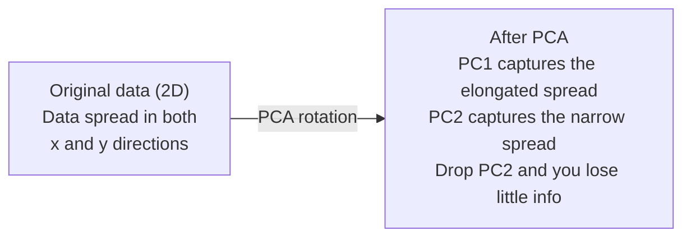

# Boyutları azaltmak.

> Yüksek boyutlu verilerin yapısı vardır. Doğru açıdan bakarak bulabilirsiniz.
> Yüksek veri yapılandırması var. Görmek için doğru açıyı bulmanız gerekir.

**Type:** Build | **类型:** 动手
**Language:**Python .**语言:**Python
**Prerequisites:** Phase 1, Lessons 01 (Linear Algebra Intuition), 02 (Vectors, Matrices & Operations), 03 (Eigenvalues & Eigenvectors), 06 (Probability & Distributions) | **前置知识:** Phase 1, Lessons 01-03, 06
**Time:** ~90 minutes | **时间:** ~90 分钟

## Öğrenme hedefleri

- PCA'yı sıfırdan uygulamak: merkez verileri, kovariansa matrisini hesaplamak, eigendecompose ve proje
  PCA'yı sıfırdan gerçekleştirmek: veri merkezileştirme, hesaplama eşik farklılıkları, özellik değer ayrımı, projekssiyon
- Ana bileşenlerin sayısını seçmek için açıklanan varyansa oranı ve dirsek yöntemi kullanın.
  Kullanım açıklaması ve boyun eğimi kuralları
- 2 boyutlu MNIST rakamlarını görselleştirmek için PCA, t-SNE ve UMAP'yi karşılaştırın ve onların anlaşmazlıklarını açıklayın
  PCA ̊t-SNE ̊ UMAP ile karşılaştırın MNIST el yazısı 2D görülebilirlik içinde etkisi ve ağırlık
- Standart PCA'nın işleme yapamadığı çizgisiz veri yapıları ayırmak için RBF çekirdeği ile çekirdek PCA uygulamak
  应用带 RBF 核的核 PCA 分离标准 PCA 无法处理的非线性数据结构

> **【中文解读】**
> 784 维'nin el yazısı dijital veriler görülemez. 降维'de "en iyi açı" projektör verileri bulmak, mümkün olduğunca az boyutla mümkün olduğunca fazla bilgiyi korumak için 降维'de bulunur. PCA, t-SNE ve UMAP'de 線性 olmayan verilerin görülebilmesi için en klasik yöntemdir.

> **【拓展：降维在 AI 中的位置】**
> - **PCA**Bu: sklearn `PCA`, veri öncesi işleme standart adımları, aynı zamanda özellik değerleri parçalanma en iyi uygulama anlamak için.
> - **t-SNE/UMAP**Yüksek boyutlu veri 2D görselleştirme standart araçları, makalede neredeyse her yerleşim görselleştirme kullanılmıştır.
> - **推荐系统**协同过本质上就是对用户物体矩阵做降维,发现隐因子──

## Sorunlar. Sorunlar.

> **【中文解读】**784 维的手写数字数据(28×28 像素) görünmez, ne de doğrudan anlaşılabilir. Ancak bunların çoğu reduktördür.

Belki el yazılı rakamların piksel değerleri olabilir. Belki de gen ekspresyonu seviyeleri olabilir. Belki de kullanıcı davranış sinyalleri olabilir. 784 boyutları görsel olarak göremiyorsunuz. Onları çizemiyorsunuz. Onlar hakkında düşünemiyorsunuz.
> Belki el yazılı bir rakamın resim değeri, belki de genlerin ifadesi seviyesi, belki de kullanıcı davranış sinyalleri... 784'i göremezsiniz, çizemezsiniz, hatta hayal bile edemezsiniz...

Ama bu 784 özelliklerinin çoğu fazladan. Gerçek bilgi çok daha küçük bir yüzeyde yaşar. El yazılı "7" onu tanımlamak için 784 bağımsız sayıya ihtiyacı yoktur. Birkaç şeye ihtiyacı vardır: çarpmanın açısı, çapraz çubuğun uzunluğu, ne kadar eğilimi.
> Ancak bu 784 özelliklerin çoğu boştur. Gerçek faydalı bilgiler daha küçük bir yüzeyde bulunur. Bir el yazısı "7" 784'in tanımlanması için bağımsız bir rakama ihtiyaç duymaz. Sadece birkaç tane: pence açısı,横線長度, eğilimi seviyesi, gerisi gürültü.

Boyut azaltma, daha küçük yüzeyi bulur. 784 boyutlu verilerinizi alır ve önemli olan yapıyı korurken 2, 10 veya 50 boyutlara sıkıştırır.
> 降维找到那更小的面──它将784 维数据压缩到2、10 或50 维,同时保留有意的结构──

## Konsepten bir şey.

> **【拓展：PCA 与 LoRA 的数学联系】**PCA'nın en büyük yönünü bulması (en büyük yönü) ise LoRA'nın 微调'un temel düşüncesidir.

### Boyutsuzluk laneti.

Yüksek boyutlu alanlar içgüdüsel değildir.
> Yüksek boyutlu alan, boyut artışıyla birlikte sorun doğurur.

**Distance becomes meaningless.**Yüksek boyutlarda, herhangi iki rastgele nokta arasındaki mesafe aynı değere doğru birleştiğinde, her nokta diğer noktalardan yaklaşık olarak aynı mesafeyi bulursa, en yakın komşu arayışı çalışmayı bırakır.
> **距离变得无意义。**Yüksek seviyede, herhangi iki boşluk arasındaki mesafe aynı değere yakındır. Eğer her nokta diğer tüm noktalara yakın mesafeye yakındırsa, yakın komşu arama başarısız olur.

```
Dimension    Avg distance ratio (max/min between random points)
2            ~5.0
10           ~1.8
100          ~1.2
1000         ~1.02
```

**Volume concentrates in corners.**D boyutlu bir birim hiper küpünün 2'lik köşeleri vardır. 100 boyutda, neredeyse tüm hacmin merkezin uzak köşelerinde olması.
> **体积集中在角落。**d 维单位超立方体有2^d 个角──在100 维中,几乎所有的体积都在角落中,远离中心──数据点扩散到边缘,模型在内部缺乏数据──

**You need exponentially more data.**Bir uzaydaki örneklerin aynı yoğunluğunu korumak için 2 boyuttan 20 boyut'a geçmek 10^18 kat daha fazla veriye ihtiyaç duyar.
> **需要指数级更多的数据。**2D'den 20D'ye kadar, aynı örnek yoğunluğunu korumak için 10^18 倍 veri gerektirir.

### PCA: önemli yönleri bul

Ana Komponent Analiz (PCA) verilerinizin en çok değişen ekselerini bulur. Koordinat sisteminizi döndürür böylece ilk eksesi en çok değişimi, ikinci eksesi en çok değişimi algılar ve benzeri şeyler.
> 主成分分析 (PCA) 找到数据变化最大的轴──它旋转坐标系,使第一个轴捕获最大方差,第二个捕获次大方差,依类推──

Algoritm:
  算法步骤:

```
1. Center the data        (subtract the mean from each feature) / 数据中心化
2. Compute covariance     (how features move together) / 计算协方差
3. Eigendecomposition     (find the principal directions) / 特征值分解
4. Sort by eigenvalue     (biggest variance first) / 按特征值排序
5. Project               (keep top k eigenvectors, drop the rest) / 投影
```

Özelleme neden? Kovariansa matrisi simetrik ve pozitif yarı belirlenmiş. Kendi vektörleri özellik alanında ortogonal yönlerdir. Kendi değerleri size her yönün ne kadar değişimi yakaladığını söyler. En büyük kendi değer noktalarına sahip olan kendi vektör maksimum değişimin yönünde.
> Neden özellik değerini çözünür? Koeskuebirans矩阵 is called right-half fixed。 özellik vektörleri özellik alanındaki doğru yön değişikliğilerdir。 özellik değeri size her yönde ne kadar yön değişikliği ele aldığını söyler。 en büyük özellik değeri karşı karşı karşı yön değişikliği en büyük yön değişikliği yönlendirmektedir。



- **Before PCA:**Veri bulutu hem x hem de y ekselerinde diyagonal olarak yayılmıştır
  **PCA 前：**Görevi: Kısayol Y  Aşı
- **After PCA:**Koordinat sistemi döndürülür, böylece PC1 maksimum varyansa yönüne (uzunlaştırılmış yayılma) ve PC2 minimum varyansa yönüne (kısık yayılma) uyum sağlar.
  **PCA 后：**坐标系旋转,PC1 için en büyük yönlü,PC2 için en küçük yönlü
- **Dimensionality reduction:**PC2'yi bırakmak, verileri PC1'e gönderir. Çok az bilgi kaybedilir.
  **降维：**PC2'yi bırakıp verileri PC1'e aktarırken çok az bilgi kaybedildi.

### Açıklanan değişim oranı                                                                                                                                                                                                                                                                                                                                                                                                                                                                                                                       

Her ana bileşen toplam değişikliğin bir kısmını yakalar.
> Her ana bileşen toplam çekirdeklerin bir parçasıdır.

```
Component    Eigenvalue    Explained ratio    Cumulative
PC1          4.73          0.473              0.473
PC2          2.51          0.251              0.724
PC3          1.12          0.112              0.836
PC4          0.89          0.089              0.925
...
```

Toplam açıklanan varyansa 0,95'e ulaştığında, birçok bileşenin bilgiyi 95%'ini yakaladığını biliyorsun.
> Toplam açıklama farkı 0.95'e ulaştığında, bu bileşenler 95%'i elde eder.

### Bileşen sayısını seçmek  选择成分数

Üç strateji:
  Üç tür kuralı:

1. **Threshold.**Farklılığın %90-95'ini açıklayacak kadar bileşen tut.
   **阈值法。**%90-95'in farkını açıklamak için yeterli bileşen tutun.
2. **Elbow method.**Plan, bileşenler arasındaki değişimi açıkladı.
   **肘部法则。**Her bileşenin açıklaması farklı, hızlı bir şekilde düşen noktaları aramak için çizim yapın.
3. **Downstream performance.**PCA'yı önceden işleme olarak kullanın. k'yi tarayın ve modelinizin doğruluğunu ölçün.
   **下游性能。**PCA'yı önceden işleme olarak kullanmak.

### Bölgeyi korumak için.

t-Distributed Stochastic Neighbor Embedding (t-SNE) görselleştirme için tasarlanmıştır.
> t-SNE 专为可视化设计──高维数据映射到2D((或3D),同时保留哪些点彼此接近──

İntüyüs: orijinal alanda, uzaklıklarına göre nokta çiftlerine olasılık dağılımını hesaplayın. Yakın noktalarda yüksek olasılık elde edilir. Uzak noktalarda düşük olasılık elde edilir. Sonra aynı olasılık dağılımının geçerli olduğu 2 boyutlu bir düzenleme bulun. 784 boyutlarda komşu olan noktalar 2 boyutlu komşu kalır.
> 直觉: İlk uzayda, uç noktası ile uç mesafesi arasında olasılık dağılımına dayanarak, yakın noktası oranı yüksek, uzak noktası oranı düşük olacaktır.

T-SNE'nin temel özellikleri:
  t-SNE'nin anahtar özellikleri:

- - PCA'nın yapamadığı karmaşık manifoldları ortaya çıkarabilir.
  Çözümlü olmayan, PCA'nın karmaşık ve işlenemediği biçimleri
- Farklı koşular farklı düzeni oluşturur.
  随机性──不同运行产生不同布局──
- Kafası karışıklık parametri, kaç komşunu dikkate almayı belirler (tipik aralığı: 5-50).
  Kafası karışıklık 参数控制考虑多少邻居 (tipiği: 5-50)
- Çıktıdaki kümeler arasındaki mesafeler anlamlı değildir. Sadece kümelerin kendileri anlamlıdır.
  输出中聚类之间的距无意义―― 聚类本身只有有意义――
- Büyük veri kümeleri üzerinde yavaş.
  Büyük veriler üzerinde yavaş.

### UMAP: Daha hızlı, daha iyi küresel yapı.

Teker teker yaklaşım ve projeksiyon (UMAP) t-SNE'ye benzer şekilde çalışır ancak iki avantajı vardır:
> UMAP ve t-SNE'ye benzer, ancak iki avantajı vardır:

- Tüm çiftlik mesafelerini hesaplamak yerine en yakın komşu grafiklerini kullanıyor.
  Daha hızlı. Yakınlık yapısını kullanmak, uzaklık yapısını hesaplamak yerine.
- Daha iyi küresel yapı.Klysterlerin üretimdeki göreceli konumları t-SNE'ye göre daha anlamlı olma eğilimindedir.
  Daha iyi genel yapı, t-SNE'den daha anlamlı.

UMAP, yüksek boyutlu alanlarda ağırlıklı bir grafik ( "kafık topolojik temsil") oluşturur ve daha sonra bu grafikleri mümkün olduğunca iyi koruyan düşük boyutlu bir düzen bulur.
> UMAP, yüksek boyutlu bir uzayda yapılandırma hakkını gösterir.

Ana parametreler:
  关键参数:

- `n_neighbors`Bu nedenle, daha yüksek değerler daha küresel bir yapıyı korur.
  `n_neighbors`: how many neighbour defined local structure( benzer karmaşıklık)。更高的值保留更多全局结构。
- `min_dist`Daha düşük değerler daha yoğun kümeler oluşturur.
  `min_dist`: output middle point cluster 'nin yoğunluğu. Daha düşük değer daha yoğun cluster oluşturur.

### Ne zaman hangi yöntemi kullanalım?

| Method / 方法 | Use case / 使用场景 | Preserves / 保留 | Speed / 速度 |
|--------|----------|-----------|-------|
| PCA | Preprocessing before training / 训练前预处理 | Global variance / 全局方差 | Fast (exact), works on millions of samples / 快速（精确），支持百万级样本 |
| PCA | Quick exploratory visualization / 快速探索性可视化 | Linear structure / 线性结构 | Fast / 快 |
| t-SNE | Publication-quality 2D plots / 发表级 2D 图 | Local neighborhoods / 局部邻域 | Slow (< 10k samples ideal) / 慢（<1万样本最佳） |
| UMAP | 2D visualization at scale / 大规模 2D 可视化 | Local + some global structure / 局部+部分全局结构 | Medium (handles millions) / 中等（支持百万级） |
| PCA | Feature reduction for models / 模型特征降维 | Variance-ranked features / 方差排序特征 | Fast / 快 |
| t-SNE / UMAP | Understanding cluster structure / 理解聚类结构 | Cluster separation / 聚类分离 | Medium to slow / 中等到慢 |

Basamak kural: önceden işleme ve veri sıkıştırması için PCA kullanın. 2 boyutlu yapıyı görselleştirmeniz gerektiğinde t-SNE veya UMAP kullanın.
> 經驗法:PCA, ön işleme ve veri sıkıştırma için kullanılır.

### Nükleer PCA.

Standart PCA, doğrusal alt alanlar bulur. Koordinat sisteminizi döndürür ve ekseleri düşürür. Ama veriler doğrusal olmayan bir çeşitlikte bulunursa ne olur? 2 boyutlu bir daire hiçbir çizgiyle ayırılamaz. Standart PCA yardımcı olmaz.
> 標準 PCA 找线性子空间── fakat eğer veriler 線性流形 üzerinde yer alırsa? 2D'deki yuvarlaklar herhangi bir düz çizgiyle ayrılmaz.

Kernel PCA, bir çekirdek fonksiyonu tarafından tetiklenen yüksek boyutlu bir özellik alanında, bu alanın koordinatlarını açıkça hesaplamadan PCA'yı uyguluyor.
> 核PCA, nükleer fonksiyon tarafından yönlendirilmiş yüksek özellikli uzayda uygulanır, açıkça bu uzaydaki koordinatları hesaplamaz.

Algoritm:
  算法步骤:

1. K_ij = k(x_i, x_j) olduğu çekirdek matrisini hesaplayın
   计算核矩阵 K, K_ij = k(x_i, x_j)
2. Yükleme alanında çekirdek matrisini merkeze edin
   Özellikleri uzayda merkezi çekirdek matron
3. Eigendecompose merkezli çekirdek matrisi
   Merkezli nükleer matron için değer ayrımı yapım
4. Üst öz vektörler (1/sqrt(öz değerleri ile ölçebilir) projeksiyonlardır
   顶部特征向量(缩放 1/sqrt(特征值)) yani proje için

Genel çekirdek fonksiyonları:
  常见核函数:

| Kernel / 核函数 | Formula / 公式 | Good for / 适用于 |
|--------|---------|----------|
| RBF (Gaussian) | exp(-gamma * \|\|x - y\|\|^2) | Most nonlinear data, smooth manifolds / 大多数非线性数据，光滑流形 |
| Polynomial / 多项式 | (x . y + c)^d | Polynomial relationships / 多项式关系 |
| Sigmoid | tanh(alpha * x . y + c) | Neural network-like mappings / 类神经网络映射 |

Kerneli PCA ile standart PCA ne zaman kullanılır:
  核 PCA vs 标准 PCA 的使用场景:

| Criterion / 标准 | Standard PCA / 标准 PCA | Kernel PCA / 核 PCA |
|-----------|-------------|------------|
| Data structure / 数据结构 | Linear subspace / 线性子空间 | Nonlinear manifold / 非线性流形 |
| Speed / 速度 | O(min(n^2 d, d^2 n)) | O(n^2 d + n^3) |
| Interpretability / 可解释性 | Components are linear combinations of features / 成分是特征的线性组合 | Components lack direct feature interpretation / 成分缺乏直接特征解释 |
| Scalability / 可扩展性 | Works on millions of samples / 支持百万级样本 | Kernel matrix is n x n, memory-limited / 核矩阵为 n x n，受内存限制 |
| Reconstruction / 重建 | Direct inverse transform / 直接逆变换 | Requires pre-image approximation / 需要预图像近似 |

Klasik örnek: 2 boyutlu konsentrik döngüler. Birbiri diğerinin içinde iki nokta halka. Standart PCA her ikisini de aynı çizgiye doğru projekt eder. sınıflandırma için işe yaramaz. RBF çekirdeği ile çekirdeği PCA, iç döngüyü ve dış döngüyü farklı bölgelerde haritası yapar ve onları doğrusal olarak ayırır.
> Klasik örnek: 2D aynı merkez yuvarlakı, iki döngü nokta, bir döngü diğer döngü içinde. Standart PCA iki yönü de aynı çizgiye doğru projekte eder.

### Yeniden inşaat hatası .

Boyutların ne kadar azalıyor? 784 boyutları 50'e sıkıştırdın.
> 784'i 50'e kadar küçültürsün. Ne kaybettin?

Yeniden yapılandırma hatasını ölçmek:
  测量重建差:

1. Proje verileri k boyutlara: X_reduced = X @ W_k
   K                                                                                                                                                                                                                                                                                                                                                                                                                                                                                                                             
2. Yeniden yapılandır: X_hat = X_reduced @ W_k^T
   Şimdiki
3. Hesaplama MSE: ortalama
   计算 MSE

PCA için, yeniden yapılama hatası açıklanan varyansa ile temiz bir ilişkiye sahiptir:
> PCA'ya göre, yeniden yapılama hataları ve açıklama farklılıkları arasında basit bir ilişki vardır:

```
Reconstruction error = sum of eigenvalues NOT included
Total variance = sum of ALL eigenvalues
Fraction lost = (sum of dropped eigenvalues) / (sum of all eigenvalues)
```

Her bileşen için açıklanan varyansa oranı:
> Her bileşenin açıklaması:

```
explained_ratio_k = eigenvalue_k / sum(all eigenvalues)
```

Toplam açıklanan parça sayısı ile ilgili çizim, size "ikkinci" eğri verir.
> 図集 図集 図集 図集 図集 図集 図集 図集 図集 図集 図集 図集 図集 図集 図集 図集 図集 図集 図集 図集 図集 図集 図集 図集 図集 図集 図集 図集 図集 図集 図集 図集 図集 図集 図集 図集 図集 図集 図集 図集 図集 図集 図集 図集 図集 図集 図集 図集 図集 図集 図集 図集 図集 図集 図集 図集 図集 図集 図集 図集 図集 図集 図集 図集 図集 図集 図集 図集 図集 図集 図集 図集 図集 図集 図 図集 図 図 図 図 図 図 図 図 図 図 図 図 図 図 図 図 図 図 図 図 図 図 図 図 図 図 図 図 図 図 図 図 図 図 図 図 図 図 図 図 図 図 図 図 図 図 図 図 図 図 図 図 図 図 図 図 図 図 図 図 図 図 図 図 図 図 図 図 図 図 図 図 図 図 図 図 図 図 図 図 図 図 図 図 図 図 図 図 図 図 図 図 図 図 図 図 図 図 図 図 図 図 図 図 図 図 図 図 図 図 図 図 図 図 図 図 図 図 図 図 図 図 図 図 図 図 図 図 図 図 図 図 図 図 図 図 図 図 図 図 図 

- Eğitimi azaltmak (eğitimi azaltmak) / 曲线变平(收益递减)
- Toplam değişkenlik eşiğin eşiğini geçer (genellikle 0.90 veya 0.95) / 累积方差超值
- Aşağı akıntılı görev performans platoları / 下游 görev performance reach platform期

Yeniden inşaat hatası k seçmekten daha yararlıdır. Anomalyayı tespit etmek için kullanabilirsiniz: yüksek yeniden inşaat hatası olan örnekler öğrenilen alt alanına uymayan dış değerlerdir. Bu, üretim sistemlerinde PCA tabanlı anomaly tespitinin temelini oluşturur.
> K. seçmek için kullanılmaz. Değişik deneme için de kullanılabilir. Değişik deneme için kullanılan örnek öğrenme alanının anormal değerine uymamaktadır.

## Yapın.
```figure
pca-axes
```

## Yapın

> **【中文解读】**Aşağıda sıfırdan PCA'nın gerçekleştirilmesi için tamamlanmış bir süreç: Data Centrization → 协方差矩阵 → 投影→ sonra MNIST verilerine göre PCA、t-SNE、UMAP'ın görülebilirlik etkisi¬¬¬¬¬¬tir.

### Adım 1: PCA sıfırdan.

```python
import numpy as np

class PCA:
    def __init__(self, n_components):
        self.n_components = n_components
        self.components = None
        self.mean = None
        self.eigenvalues = None
        self.explained_variance_ratio_ = None

    def fit(self, X):
        self.mean = np.mean(X, axis=0)
        X_centered = X - self.mean

        cov_matrix = np.cov(X_centered, rowvar=False)

        eigenvalues, eigenvectors = np.linalg.eigh(cov_matrix)

        sorted_idx = np.argsort(eigenvalues)[::-1]
        eigenvalues = eigenvalues[sorted_idx]
        eigenvectors = eigenvectors[:, sorted_idx]

        self.components = eigenvectors[:, :self.n_components].T
        self.eigenvalues = eigenvalues[:self.n_components]
        total_var = np.sum(eigenvalues)
        self.explained_variance_ratio_ = self.eigenvalues / total_var

        return self

    def transform(self, X):
        X_centered = X - self.mean
        return X_centered @ self.components.T

    def fit_transform(self, X):
        self.fit(X)
        return self.transform(X)
```

### İkinci adım: Sintez veri üzerinde test.

```python
np.random.seed(42)
n_samples = 500

t = np.random.uniform(0, 2 * np.pi, n_samples)
x1 = 3 * np.cos(t) + np.random.normal(0, 0.2, n_samples)
x2 = 3 * np.sin(t) + np.random.normal(0, 0.2, n_samples)
x3 = 0.5 * x1 + 0.3 * x2 + np.random.normal(0, 0.1, n_samples)

X_synthetic = np.column_stack([x1, x2, x3])

pca = PCA(n_components=2)
X_reduced = pca.fit_transform(X_synthetic)

print(f"Original shape: {X_synthetic.shape}")
print(f"Reduced shape:  {X_reduced.shape}")
print(f"Explained variance ratios: {pca.explained_variance_ratio_}")
print(f"Total variance captured: {sum(pca.explained_variance_ratio_):.4f}")
```

### Adım 3: MNIST 2D rakamları

```python
from sklearn.datasets import fetch_openml

mnist = fetch_openml("mnist_784", version=1, as_frame=False, parser="auto")
X_mnist = mnist.data[:5000].astype(float)
y_mnist = mnist.target[:5000].astype(int)

pca_mnist = PCA(n_components=50)
X_pca50 = pca_mnist.fit_transform(X_mnist)
print(f"50 components capture {sum(pca_mnist.explained_variance_ratio_):.2%} of variance")

pca_2d = PCA(n_components=2)
X_pca2d = pca_2d.fit_transform(X_mnist)
print(f"2 components capture {sum(pca_2d.explained_variance_ratio_):.2%} of variance")
```

### Adım 4: Sklürn ile karşılaştırın.

```python
from sklearn.decomposition import PCA as SklearnPCA
from sklearn.manifold import TSNE

sklearn_pca = SklearnPCA(n_components=2)
X_sklearn_pca = sklearn_pca.fit_transform(X_mnist)

print(f"\nOur PCA explained variance:     {pca_2d.explained_variance_ratio_}")
print(f"Sklearn PCA explained variance: {sklearn_pca.explained_variance_ratio_}")

diff = np.abs(np.abs(X_pca2d) - np.abs(X_sklearn_pca))
print(f"Max absolute difference: {diff.max():.10f}")

tsne = TSNE(n_components=2, perplexity=30, random_state=42)
X_tsne = tsne.fit_transform(X_mnist)
print(f"\nt-SNE output shape: {X_tsne.shape}")
```

### Adım 5: UMAP karşılaştırması

```python
try:
    from umap import UMAP

    reducer = UMAP(n_components=2, n_neighbors=15, min_dist=0.1, random_state=42)
    X_umap = reducer.fit_transform(X_mnist)
    print(f"UMAP output shape: {X_umap.shape}")
except ImportError:
    print("Install umap-learn: pip install umap-learn")
```

## Çerçeveyi kullanın.

> **【拓展：t-SNE vs UMAP 选哪个？】**t-SNE: klasik yöntem, maintain local neighbouring relations, adaptate find data in聚类结构──缺点:慢(O(n2))、 cannot be used for new data projection──UMAP:更快(O(n))、 can project new data、 retain more whole-site structure──2026 yıl önerisi: exploratory analysis using UMAP, essay in the context of t-SNE(reviewers are more familiar)── ikisi de aşağıdaki modellerin özellikleri için işbirliği için uygun değil.

Bir sınıflandırıcıdan önce önceden işleme olarak PCA:
> PCA'yı bir sınıflandırma işleminin öncesi işlem olarak kullanmak:

```python
from sklearn.decomposition import PCA as SklearnPCA
from sklearn.linear_model import LogisticRegression
from sklearn.model_selection import train_test_split
from sklearn.metrics import accuracy_score

X_train, X_test, y_train, y_test = train_test_split(
    X_mnist, y_mnist, test_size=0.2, random_state=42
)

results = {}
for k in [10, 30, 50, 100, 200]:
    pca_k = SklearnPCA(n_components=k)
    X_tr = pca_k.fit_transform(X_train)
    X_te = pca_k.transform(X_test)

    clf = LogisticRegression(max_iter=1000, random_state=42)
    clf.fit(X_tr, y_train)
    acc = accuracy_score(y_test, clf.predict(X_te))
    var_captured = sum(pca_k.explained_variance_ratio_)
    results[k] = (acc, var_captured)
    print(f"k={k:>3d}  accuracy={acc:.4f}  variance={var_captured:.4f}")
```

784 boyuttan çok önce performans platoları.
> Performans 784'ten çok daha düşük. Bu platform sizin en iyi işlem noktasınız.

## İndirin . Ürünler .

Bu ders şunları ortaya çıkarır:
> 本课程产出:

- `outputs/skill-dimensionality-reduction.md`- belirli bir görev için doğru boyut azaltma tekniğini seçme becerisi
  Bir görev için uygun bir teknik seçimi becerileri dosyası

## Egzersizler.

1. PCA sınıfını desteklemek için değiştir `inverse_transform`. 10, 50 ve 200 bileşenden MNIST rakamlarını yeniden oluşturun. Her bir bileşen için yeniden oluşturma hatasını (orjinalden ortalama kare farkı) yazdırın.
   修改 PCA 类以支持 `inverse_transform`△ 10、50 和 200 个成分でMNISTı yeniden inşa etmek için kullanılır.

2. t-SNE'yi aynı MNIST alt kümesi üzerinde 5, 30 ve 100'lik karmaşıklık değerleriyle çalıştırın. Çıktılık değişimi nasıl açıklayın.
   Çelişki değerleri 5、30 和 100 ile aynı MNIST 子集上运行 t-SNE。 açıklama çıkış değişimi。 neden çelişki 聚类密度 etkisi?

3. Sadece 5'i bilgilendirici olan 50 özellikten oluşan bir veri kümesi alın (bir tane `sklearn.datasets.make_classification`). PCA uygulayın ve açıklanan varyansa eğri verilerin aslında beş boyutlu olduğunu doğru bir şekilde belirlediğini kontrol edin.
   50 özellikli bir veri kümesi alın ama sadece 5 yararlı veri kümesi alın. PCA uygulaması, doğru bir şekilde tanımlama verisinin 5 boyutlu olup olmadığını kontrol eder.

## Anahtar Şartlar .

| Term / 术语 | What people say | What it actually means / 实际含义 |
|------|----------------|----------------------|
| Curse of dimensionality / 维度灾难 | "Too many features" | Distances, volumes, and data density all behave counterintuitively as dimensions grow. Models need exponentially more data to compensate. / 随维度增长，距离、体积和数据密度都反直觉。模型需要指数级更多数据来补偿。 |
| PCA / 主成分分析 | "Reduce dimensions" | Rotate your coordinate system so the axes align with the directions of maximum variance, then drop the low-variance axes. / 旋转坐标系使轴对齐最大方差方向，然后丢弃低方差轴。 |
| Principal component / 主成分 | "An important direction" | An eigenvector of the covariance matrix. The direction in feature space along which the data varies most. / 协方差矩阵的特征向量。特征空间中数据变化最大的方向。 |
| Explained variance ratio / 解释方差比 | "How much info this component has" | The fraction of total variance captured by one principal component. Sum the top k ratios to see how much k components preserve. / 一个主成分捕获的总方差比例。累加前 k 个比率看 k 个成分保留了多少。 |
| Covariance matrix / 协方差矩阵 | "How features correlate" | A symmetric matrix where entry (i,j) measures how feature i and feature j move together. Diagonal entries are individual variances. / 对称矩阵，第 (i,j) 项衡量特征 i 和 j 如何共同变化。对角项是各自方差。 |
| t-SNE | "That cluster plot" | A nonlinear method that maps high-dimensional data to 2D by preserving pairwise neighborhood probabilities. Good for visualization, not for preprocessing. / 非线性方法，通过保留成对邻域概率将高维数据映射到 2D。适合可视化，不适合预处理。 |
| UMAP | "Faster t-SNE" | A nonlinear method based on topological data analysis. Preserves both local and some global structure. Scales better than t-SNE. / 基于拓扑数据分析的非线性方法。保留局部和部分全局结构。扩展性优于 t-SNE。 |
| Perplexity / 困惑度 | "A t-SNE knob" | Controls the effective number of neighbors each point considers. Low perplexity focuses on very local structure. High perplexity captures broader patterns. / 控制每个点考虑的有效邻居数。低困惑度关注局部结构，高困惑度捕获更广模式。 |
| Manifold / 流形 | "The surface the data lives on" | A lower-dimensional surface embedded in a higher-dimensional space. A sheet of paper crumpled in 3D is a 2D manifold. / 嵌入高维空间的低维曲面。揉成团的纸是 2D 流形。 |

## Daha fazla okumak

- [A Tutorial on Principal Component Analysis](https://arxiv.org/abs/1404.1100)(Shlens) - PCA'nın net bir şekilde yerden çıkartılması
  PCA 清晰推导
- [How to Use t-SNE Effectively](https://distill.pub/2016/misread-tsne/)(Wattenberg et al.) - t-SNE tuzağı ve parametreler seçimi için interaktif rehber
  t-SNE 使用指南,交互式展示参数选择和陷
- [UMAP documentation](https://umap-learn.readthedocs.io/)- UMAP yazarlarının teorisi ve pratik rehberliği
  UMAP 理論与實践指南
