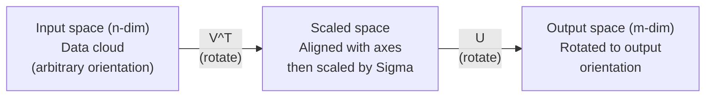
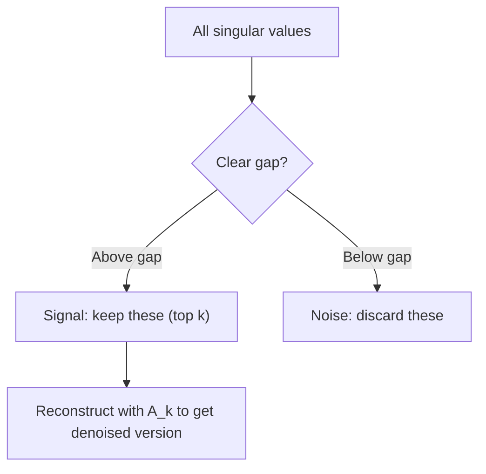

# Tek değer parçalanması . 奇异值分解 (SVD)

> SVD, çizgisi cebirdeki İsviçre ordusu bıçağı. Her matrisin bir tane vardır. Her veri bilimcisi bir taneye ihtiyaç duyar.
> SVD, "Swiss Army Knife" olarak adlandırılır. Her bir rekütanın bir tane vardır.

**Type:** Build | **类型:** 动手
**Languages:** Python, Julia | **语言:** Python, Julia
**Prerequisites:** Phase 1, Lessons 01 (Linear Algebra Intuition), 02 (Vectors & Matrices Operations), 03 (Matrix Transformations) | **前置知识:** Phase 1, Lessons 01-03
**Time:** ~120 minutes | **时间:** ~120 分钟

## Öğrenme hedefleri

- Güç İterasyonu yoluyla SVD uygulamak ve U, Sigma ve V^T'nin geometrik anlamını açıklamak
  代实现 SVD, U、Sigma 和 V^T'in几何含义 açıklamak
- Resim sıkıştırılması için kısaltılmış SVD uygulayın ve sıkıştırma oranı vs. yeniden yapılandırma hatasını ölçün
                                                                                                                                                                                                                                                                                                                                                                                                                                                                                                                               
- SVD üzerinden Moore-Penrose pseudoinversini hesaplayın .
  SVD üzerinden Moore-Penrose hesaplamaları
- SVD'yi PCA'ya, tavsiye sistemlerine (latent faktörler) ve NLP'deki latent semantik analizi ile bağlayın
  SVD'yi PCA'yla 推系统 (İhint Factor) ve NLP'deki potansiyel anlam analizi ile bağlayın

> **【中文解读】**
> SVD, "Rüse ordusu kılığı"nın 線性代数idir. Herhangi bir matrajı U * Sigma * V^T olarak parçalanabilir.

> **【拓展：SVD 在 AI 中的位置】**
> - **推荐系统**Netflix  yarışmasının kazanan bir çözümü, kullanıcı-iç ürün değerlendirme hattının SVD bölümüdür.
> - **图像压缩**SVD'nin en büyük birkaç garip değerini koruduğu için çok az veri kullanılabilir.
> - **LSA (潜在语义分析)**NLP'de en erken tema modelleri metod, SVD'nin SVD'yi yapması için kullanılan dosya-söz matçları

## Sorunlar. Sorunlar.

> **【中文解读】**Eğer 1000×2000'lik bir matçınız varsa, matçı üç faktöre ayırır. U·Σ·V^T, matçın "ne yaptığını" ortaya çıkarır.

Belki de kullanıcı filmleri derecelendirme. Belki de bir belge term frekans tablosudur. Belki de bir resmin piksel değerleri. Onu sıkıştırmak, tanımlamak, içinde gizli bir yapı bulmak veya en az kareli bir sistem çözmek gerekir. Eigendecomposition sadece kareli matrislerde çalışır.
> Belki de kullanıcı-film değerleri, belki de dosya-söz frekansları, belki de resim resimleri. Belki de görüntü görüntüleri. Belki de, bir kullanıcı-film değerleri, belki de bir resim resim resimleri. Belki de, bir resim resim resimleri. Belki de, bir resim resim resimleri, belki de bir resim resim resimleri, belki de bir resim resim resimleri, belki de bir resim resim resimleri, belki de bir resim resim resimleri, belki de bir resim resim resimleri, belki de bir resim resimleri, belki de bir resim resimleri, belki de bir resim resim resimleri, belki de bir resim resimleri, belki de bir resim resimleri, belki de bir resimleri, belki de bir resimleri, belki de bir resimleri, belki de bir resimleri, belki de bir resimleri, belki de bir resimleri, belki de bir resimleri, belki de bir resimleri, belki de bir resimleri, belki de bir resimleri ve resimleri, belki de bir resimleri, belki de bir resimleri ve resimleri, belki de bir resimleri, bir resimleri ve resimleri, birileri ve resimleri, birileri, birileriyle ilgili olarak kullanılabilir.

SVD herhangi bir matris üzerinde çalışır. Herhangi bir şekil. Her sıra. Hiç koşul yoktur. Matrisin uzayla ne yaptığını ortaya çıkaran üç faktöre parçaladı.
> SVD herhangi bir matron için uygundur. Herhangi bir biçim, herhangi bir düzen, koşulsuzluk, matronun üç faktöre ayrılması, matronun uzay için ne yaptığını ortaya çıkarır.

## Konsepten bir şey.

> **【拓展：SVD 是 LoRA 的数学根基】**LoRA 微调的核心假设:权重更新矩阵 ΔW 是低排的──SVD 告诉我们, herhangi bir矩阵 U·Σ·V^T olarak ayrılabilir, bunlardan Σ'in ortalarında büyük bir sıralama göre değişik değerleri vardır──LoRA sadece en büyük k 个奇异值对应的分量───即级-k 近似,参数 m 减少到 k  m+n) ─这是SVD'nin teoriden uygulamaya doğrudan dönüşümü──

### SVD'nin geometrik olarak ne yaptığını SVD'nin geometrik anlamı

Her matris, şekilinden bağımsız olarak, üç işlem yapar: dön, ölçek, dön.
> Her bir matron, şekli ne olursa olsun, üç işlemleri sırayla gerçekleştirir: dönmek, kısaltmak, dönmek.

```
A = U * Sigma * V^T

      m x n     m x m    m x n    n x n
     (any)    (rotate)  (scale)  (rotate)
```

A matrisi göz önüne alındığında, SVD onu aşağıdaki konularda değerlendirir:
> 给定任意矩阵 A,SVD'yi şöyle parçaladı:

- V^T giriş alanında vektörleri döndürür (n boyutlu)
  V^T в输入空间(n 维) 中旋转向量
- Her eksesi boyunca Sigma ölçekleri (kendi veya kompres)
  Sigma 沿每个轴缩放 (bkz.
- U sonucu çıkış alanına döndürür (m boyutlu)
  Sonuçlar dışarı çıkış alanına döner.



SVD'ye bir matris verilir. "Bu matris bir giriş küresini alır, önce V^T ile döndürür, sonra Sigma ile elipsoide uzatır, sonra elipsoide U ile döndür".
> 想像一下: SVD'ye bir matron verdiğini düşün. "Bu matron bir takım toplu girişleri alır, önce V^T  rotasyonu kullanır, sonra Sigma 拉伸成球, sonra U 旋球──"Oca değer, 球各軸的長度です──"

### Tam bir parçalanma.

M x n şekli olan A matrisi için:

```
A = U * Sigma * V^T

where:
  U     is m x m, orthogonal (U^T U = I)
  Sigma is m x n, diagonal (singular values on the diagonal)
  V     is n x n, orthogonal (V^T V = I)

The singular values sigma_1 >= sigma_2 >= ... >= sigma_r > 0
where r = rank(A)
```

U sütunları sol tek tek vektörler olarak adlandırılır. V sütunları sağ tek tek vektörler olarak adlandırılır. Sigma'nın diyagonal girişleri tek tek değerler olarak adlandırılır. Onlar her zaman negatif olmayan ve geleneksel olarak azalır sırada sıralanmıştır.
> U'nun sırası sol sıradan ve V'nin sırası sağ sıradan ve Sigma'nın köşel elementlerinin sıradan değerleri olarak adlandırılır.

### Sol tekerleyici vektörler, tekerleyici değerler, sağ tekerleyici vektörler.

SVD'nin her bileşeninin farklı bir geometrik anlamı vardır.
> SVD'nin her bölümü kendine özgü bir geometrik anlamı vardır.

**Right singular vectors (columns of V):**Bunlar giriş alanı (R^n) için bir ortonomal temel oluşturur. Bunlar giriş alanındaki yönleridir. Matris çıkış alanındaki ortogonal yönlere haritası yapar.
> **右奇异向量（V 的列）：**构成输入空间 (R^n) 之正交基──它们是输入空间中的矩阵映射到输出空间正交方向的方向──

**Singular values (diagonal of Sigma):**Bu, ölçekleme faktörleri. i. tek değer, matrisin i. sağ tek vektör boyunca vektörleri ne kadar uzattığını söyler.
> **奇异值（Sigma 的对角线）：**缩放因子──第1 个奇异值告诉你矩阵沿第1 个右奇异向量方向拉伸多少──奇异值为零意味着矩阵完全压了该方向──

**Left singular vectors (columns of U):**Bunlar çıkış alanı için bir ortonomal temel oluşturur (R^m). I. sol tek tek tek tek tek tek tek tek tek tek tek tek tek tek tek tek tek tek tek tek tek tek tek tek tek tek tek tek tek tek tek tek tek tek tek tek tek tek tek tek tek tek tek tek tek tek tek tek tek tek tek tek tek tek tek tek tek tek tek tek tek tek tek tek tek tek tek tek tek tek tek tek tek tek tek tek tek tek tek tek tek tek tek tek tek tek tek tek tek tek tek tek tek tek tek tek tek tek tek tek tek tek tek tek tek tek tek tek tek tek tek tek tek tek tek tek tek tek tek tek tek tek tek tek tek tek tek tek tek tek tek tek tek tek tek tek tek tek tek tek tek tek tek tek tek tek tek tek tek tek tek tek tek tek tek tek tek tek tek tek tek tek tek tek tek tek tek tek tek tek tek tek tek tek tek tek tek tek tek tek tek tek tek tek tek tek tek tek tek tek tek tek tek tek tek tek tek tek tek tek tek tek tek tek tek tek tek tek tek tek tek tek tek tek tek tek tek tek tek tek tek tek tek tek tek tek tek tek tek tek tek tek tek tek tek tek tek tek tek tek tek tek tek tek tek tek tek tek tek tek tek tek tek tek tek tek tek tek tek tek tek tek tek tek tek tek tek tek tek tek tek tek tek tek tek tek tek tek tek tek tek tek tek tek tek tek tek tek tek tek tek tek tek tek tek tek tek tek tek tek tek tek tek tek tek tek tek tek tek tek tek tek tek tek tek tek tek tek tek tek tek tek tek tek tek tek tek tek tek tek tek tek tek tek tek tek tek tek tek tek tek tek tek tek tek tek tek tek tek tek tek tek tek tek tek tek tek tek tek tek tek tek tek tek tek tek tek tek tek tek tek tek tek tek tek tek tek tek tek tek tek tek tek tek tek tek tek tek tek tek tek tek tek tek tek tek tek tek tek tek tek tek tek tek tek tek tek tek tek tek tek tek tek tek tek tek tek tek tek tek tek tek tek tek tek tek tek tek tek tek tek tek tek tek tek tek tek tek tek tek tek tek tek tek tek tek tek tek tek tek tek tek tek tek tek tek tek tek tek tek tek tek tek tek tek tek tek tek tek tek tek tek tek tek tek tek tek tek tek tek tek tek tek tek tek tek tek tek tek
> **左奇异向量（U 的列）：**构成输出空间 (R^m) 的正交基──第 i 个左奇异向量是第 i 个右奇异向量(缩放后)落在输出空间中的方向──

Arasındaki ilişki:
> Arasındaki ilişki:

```
A * v_i = sigma_i * u_i

The matrix A takes the i-th right singular vector v_i,
scales it by sigma_i, and maps it to the i-th left singular vector u_i.
```

Bu size herhangi bir matrisin ne yaptığını koordinat-koordinat bir resim verir.
> Bu size herhangi bir matrajın işleminin bir biriminden birimini sunar.

### Dış ürün biçimi

SVD, 1 sınıf matrislerinin toplamı olarak yazılabilir:
> SVD olarak yazabilirsiniz:

```
A = sigma_1 * u_1 * v_1^T + sigma_2 * u_2 * v_2^T + ... + sigma_r * u_r * v_r^T

Each term sigma_i * u_i * v_i^T is a rank-1 matrix (an outer product).
The full matrix is the sum of r such matrices, where r is the rank.
```

Bu form düşük sıralama yaklaşımının temelidir. Her terim bir yapı katmanı ekler. Birinci terim tek en önemli örneği yakalar. İkinci terim bir sonraki en önemli olanı yakalar. Ve buna benzer. Bu toplamı kısaltmak size verilen herhangi bir sıralamada mümkün olan en iyi yaklaşım sağlar.
> Bu biçim düşük sıralama yaklaşımının temelidir. Her bir katman bir katman yapısıdır. Birinci, en önemli biçimi, ikinci, en önemli biçimi, bu tip öneriler üzerine ayrıştırılır.

```
Rank-1 approx:    A_1 = sigma_1 * u_1 * v_1^T
                  (captures the dominant pattern)

Rank-2 approx:    A_2 = sigma_1 * u_1 * v_1^T + sigma_2 * u_2 * v_2^T
                  (captures the two most important patterns)

Rank-k approx:    A_k = sum of top k terms
                  (optimal by the Eckart-Young theorem)
```

### Kendi bileşimiyle ilişki ve değer parçalanma ilişkisi

SVD ve eigende kompozisyon derin bir bağlantıya sahiptir. A'nın tek değerleri ve vektörleri doğrudan A^T A ve A^T'nin öz değerlerinden ve öz vektörlerinden gelir.
> SVD ve özellik değerleri derinliklere ilişkili olarak A'nın garip değerleri ve vektörleri doğrudan A^T A ve A^T'nin özellik değerleri ve özellik vektörlerinden kaynaklanır.

```
A^T A = V * Sigma^T * U^T * U * Sigma * V^T
      = V * Sigma^T * Sigma * V^T
      = V * D * V^T

where D = Sigma^T * Sigma is a diagonal matrix with sigma_i^2 on the diagonal.

So:
- The right singular vectors (V) are eigenvectors of A^T A
- The singular values squared (sigma_i^2) are eigenvalues of A^T A

Similarly:
A A^T = U * Sigma * V^T * V * Sigma^T * U^T
      = U * Sigma * Sigma^T * U^T

So:
- The left singular vectors (U) are eigenvectors of A A^T
- The eigenvalues of A A^T are also sigma_i^2
```

Bu bağlantı size üç şeyi anlatıyor:
> Bu bağlantı size üç şey anlatıyor:

1. Tek değerler her zaman gerçek ve negatif değildir (pozitif yarı tanımlı bir matrisin öz değerlerinin kare köküdürler).
   奇异值始终为实数且非负──
2. SVD'yi A^T A'nın kendi bileşimi ile hesaplayabilirsiniz, ancak bu durum numarasını karesine katarak sayısal doğruluğu kaybeder.
   A^T A'nın özellik değerini çözmekle SVD'yi hesaplayabilirsiniz, ancak bu da kareler, kayıplar ve sayısal değerlerin doğruluğu olacaktır.
3. A kare ve simetrik pozitif yarı belirlenmiş olduğunda, SVD ve eigende kompozisyon aynı şeydir.
   A = = = = = = = = = = = = = = = = = = = = = = = = = = = = = = = = = = = = = = = = = = = = = = = = = = = = = = = = = = = = = = = = = = = = = = = = = = = = = = = = = = = = = = = = = = = = = = = = = = = = = = = = = = = = = = = = = = = = = = = = = = = = = = = = = = = = = = = = = = = = = = = = = = = = = = = = = = = = = = = = = = = = = = = = = = = = = = = = = = = = = = = = = = = = = = = = = = = = = = = = = = = = = = = = = = = = = = = = = = = = = = = = = = = = = = = = = = = = = = = = = = = = = = = = = = = = = = = = = = = = = = = = = = = = = = = = = = = = = = = = = = = = = = = = = = = = = = = = = = = = = = = = = = = = = = = = = = = = = = = = = = = = = = = = = = = = = = = = = = = = = = = = = = = = = = = = = = = = = = = = = = = = = = = = = = = = = = = = = = = = = = = = = = = = = = = = = = = = = = = = = = = = = = = = = = = = = = = = = = = = = = = = = = = = = = = = = = = = = = = = = = = = = = = = = = = = = = = = = = = = = = = = = = = = = = = = = = = = = = = = = = = = = = = = = = = = = = = = = = = = = = = = = = = = =

### SVD'nin kısaltılması: düşük dereceli yaklaşım.

Eckart-Young-Mirsky teoremi, A'ya en iyi sıra-k yaklaşımının (hem Frobenius hem de spektral normda) sadece üst k tek değerlerini ve ilgili vektörlerini tutarak elde edildiğini belirtir:
> Eckart-Young-Mirsky 定理指出,A'nın en iyi sıralaması yakınında (((在 Frobenius 和谱范数下) sadece önce k 个奇异值 ve onun karşı karşıya gelen 量 elde ederek:

```
A_k = U_k * Sigma_k * V_k^T

where:
  U_k     is m x k  (first k columns of U)
  Sigma_k is k x k  (top-left k x k block of Sigma)
  V_k     is n x k  (first k columns of V)

Approximation error = sigma_{k+1}  (in spectral norm)
                    = sqrt(sigma_{k+1}^2 + ... + sigma_r^2)  (in Frobenius norm)
```

Bu sadece "iyi" bir yaklaşım değil. Bu, provable olarak, sıra k'nin en iyi yaklaşımıdır.
> Bu sadece "iyi" bir yaklaşım değil. Bu, A'ya daha yakın bir sıralama değil.

| Component | Relative magnitude | Kept in rank-3 approx? / 保留在秩-3 近似中？ |
|-----------|-------------------|------------------------|
| sigma_1 | Largest / 最大 | Yes / 是 |
| sigma_2 | Large / 大 | Yes / 是 |
| sigma_3 | Medium-large / 中大 | Yes / 是 |
| sigma_4 | Medium / 中 | No (error) / 否（误差） |
| sigma_5 | Medium-small / 中小 | No (error) / 否（误差） |
| sigma_6 | Small / 小 | No (error) / 否（误差） |
| sigma_7 | Very small / 很小 | No (error) / 否（误差） |
| sigma_8 | Tiny / 极小 | No (error) / 否（误差） |

A_3 en büyük üç tek değerini yakalar. Hata = kalan değerler (sigma_4 ile sigma_8).

Tek değerler hızlı bir şekilde bozulursa, küçük bir k matrisin çoğunu yakalar.
> Eğer bu değişik değer hızla düşerse, küçük k'nin büyük bir kısmını yakalayabilmesi gerekir.

### SVD ile görüntü sıkıştırma SVD ile sıkıştırma görüntü

Gri ölçekli bir görüntü, piksel yoğunlukları matrisidir. 800x600 görüntüde 480.000 değer vardır. SVD onu daha az ile yaklaştırmanıza izin verir.
> Grayness görüntü, bir grafik gücünün bir matçıdır. 800x600'ün görüntülerinin 480.000 değerleri vardır. SVD'nin bu değerden daha azı kullanılabilir.

```
Original image: 800 x 600 = 480,000 values

SVD with rank k:
  U_k:      800 x k values
  Sigma_k:  k values
  V_k:      600 x k values
  Total:    k * (800 + 600 + 1) = k * 1401 values

  k=10:   14,010 values   (2.9% of original)
  k=50:   70,050 values  (14.6% of original)
  k=100: 140,100 values  (29.2% of original)

  The compression ratio improves as k gets smaller,
  but visual quality degrades.
```

Anahtar anlayış: doğal görüntüler hızlı bir şekilde bozulan tekerlek değerlerine sahiptir. İlk birkaç tekerlek değerleri geniş yapıyı (şekiller, gradientler) yakalar. Sonrakiler ince ayrıntıları ve gürültüyi yakalar. 50'de kesmek genellikle orijinaline neredeyse benzer görünen bir görüntü üretir.
> 关键洞见: Doğal görüntülerin garip değerleri hızla azalıyor. Önceki birkaç garip değer makro yapıları (şekil biçimleri) yakalamakta, sonrakilerde detay ve gürültü yakalamakta.

### SVD önerme sistemleri için SVD önerme sistemleri için

Netflix Ödülü bunu ünlü kıldı. Çoğu giriş kayıp olduğu bir kullanıcı filmleri derecelendirme matrisiniz var.
> Netflix 竞赛使之出名──你有一个大部分条目缺失的用户电影评分矩阵──

```
             Movie1  Movie2  Movie3  Movie4  Movie5
  User1      [  5      ?       3       ?       1  ]
  User2      [  ?      4       ?       2       ?  ]
  User3      [  3      ?       5       ?       ?  ]
  User4      [  ?      ?       ?       4       3  ]

  ? = unknown rating
```

Bu değerlendirme matrisi düşük bir sıralama sahiptir. Kullanıcıların tamamen bağımsız zevkleri yoktur. Çoğu tercihleri açıklayan bir avuç gizli faktör vardır (harekete karşı drama, eskiye karşı yeniye, beyinye karşı visceral).
> 核心思想:评分矩阵是低排的──用户的品味并非完全独立──存在少数隐因子──动作 vs.文艺、老片 vs. 新片)

SVD (dolmuş) derecelendirme matrisinde, aşağıdaki bölümlere ayrılır:
> SVD'nin özetleme yöntemi:

- U: gizli faktör alanındaki kullanıcı profilleri / 隐因子空间中的用户画像
- Sigma: her gizli faktörün önemi / 每个隐因子的重要性
- V^T: gizli faktör alanındaki film profilleri / 隐因子空间中的电影画像

Bir kullanıcı tarafından bir film için tahmin edilen derece, kullanıcı profilinin film profilinin nokta ürünüdür (birbirlik değerleriyle ağırlanır).
> Kullanıcı filmleri için tahmin değerleri, kullanıcı resimleri ve film resimleri için değerler.

### SVD NLP: Latent Semantic Analysis. SVD NLP:潜在语义分析.

Latent Semantic Analysis (LSA), ayrıca Latent Semantic Indexing (LSI) olarak da adlandırılır, SVD'yi bir term-dokümant matrisine uyguluyor.
> 潜在语义分析 (LSA) SVD 应用于词文档矩阵──

```
             Doc1   Doc2   Doc3   Doc4
  "cat"      [  3      0      1      0  ]
  "dog"      [  2      0      0      1  ]
  "fish"     [  0      4      1      0  ]
  "pet"      [  1      1      1      1  ]
  "ocean"    [  0      3      0      0  ]

After SVD with rank k=2:

  Each document becomes a point in 2D "concept space."
  Each term becomes a point in the same 2D space.
  Documents about similar topics cluster together.
  Terms with similar meanings cluster together.
```

LSA, çiğ metinden semantik benzerliği yakalamak için ilk başarılı yöntemlerden biriydi. Aynı metinlerde eş anlamlı terimler görünmeye eğilimli olduğu için çalışır.
> LSA, orijinal metinlerden birinde semantik benzerliği yakalama konusunda en erken başarılı yöntemlerden biridir. Bu yöntem geçerlidir çünkü semantik kelimeler genellikle benzer metinlerde ortaya çıkar.

### SVD gürültü azaltmak için kullanılır.

Gürültülü veriler, sinyalin en üst tek değerlerde yoğunlaştığını ve gürültü tüm tek değerlere yayıldığını gösterir.
> 噪音数据中信号集中在顶部奇异值中,噪音分散在所有奇异值中──截断移除噪音基──



Bu, sinyal işleme, bilimsel ölçüm ve veri temizlemesinde kullanılır.
> Bu, sinyal işleme, bilimsel ölçüm ve veri temizliği için kullanılır. Eğer bir matronda daha fazla gürültü kirliliği varsa, kesim SVD, sinyal ve gürültü ayırma yöntemi olarak kullanılır.

### SVD üzerinden sahte tersine hesaplama

Moore-Penrose pseudoinverse A+ metrik inversiyonunu kareler olmayan ve tekerlekli metriklere genelleştirir.
> Moore-Penrose 伪逆 A+ 将矩阵求逆推广到非方阵和奇异矩阵──SVD 使计算变得简单──

```
If A = U * Sigma * V^T, then:

A+ = V * Sigma+ * U^T

where Sigma+ is formed by:
  1. Transpose Sigma (swap rows and columns)
  2. Replace each non-zero diagonal entry sigma_i with 1/sigma_i
  3. Leave zeros as zeros
```

Pseudoinverse en az kare problemlerini çözür. Ax = b'nin kesin çözümü yoksa (över belirlenmiş sistem), o zaman x = A + b en az kare çözümüdür (BXAx - b'yi en az azaltır).
> 伪逆求解最小二乘解问题──如果 Ax = b 没有精确解(超定系统),则 x = A+ b 是最小二乘解──

### Sayısal istikrar avantajları Sayısal istikrar avantajları

A^T A'nın kendi bileşimi hesaplamak tek değerleri karıştırır (A^T A'nın kendi değerleri sigma_i^2) Bu durum sayısını karıştırır ve sayısız hataları artırır.
> 計算 A^T A'nın özellikleri ayrıştırılır 平方奇异值,平方条件数,放大数值差──

Modern SVD algoritmaları (Golub-Kahan bidiagonalizasyonu) doğrudan A'da çalışırlar, asla A^T A oluşturmazlar. Bu nedenle her zaman tercih edilmelidir `np.linalg.svd(A)`- Tamam .`np.linalg.eig(A.T @ A)`- Evet .
> Modern SVD 算法 direkt A 操作, A^T A ı oluşturmuyor.`np.linalg.svd(A)`Hayır.`np.linalg.eig(A.T @ A)`- Evet.

### PCA ile bağlantı

PCA, merkezi veriler üzerinde SVD'dir. Bu bir benzerlik değil.
> PCA, SVD'yi merkezileştirilmiş verilere yapmaktır.

```
Given data matrix X (n_samples x n_features), centered (mean subtracted):

Covariance matrix: C = (1/(n-1)) * X^T X

PCA finds eigenvectors of C. But:

  X = U * Sigma * V^T    (SVD of X)

  X^T X = V * Sigma^2 * V^T

  C = (1/(n-1)) * V * Sigma^2 * V^T

So the principal components are exactly the right singular vectors V.
The explained variance for each component is sigma_i^2 / (n-1).

In sklearn, PCA is implemented using SVD, not eigendecomposition.
It is faster and more numerically stable.
```

Bu, 10. derste boyut azaltma hakkında öğrendiğiniz her şey SVD'nin kapuk altında olduğunu gösterir. PCA, makine öğreniminde SVD'nin en yaygın uygulamasıdır.
> Bu, 10. derste öğrendiğiniz derecelendirme içeriğinin alt katı SVD'dir. PCA, makine öğreniminde SVD'nin en yaygın uygulamasıdır.

## Yapın.
```figure
svd-rank-reconstruction
```

## Yapın

### Adım 1: SVD'yi sıfırdan güç iterasyonu kullanarak kullanın.

Fikir: en büyük tek değer ve vektörlerini bulmak için, A^T A (veya A A^T) üzerinde güç iterasyonunu kullanın.
> Düşünce: A^T A'da en büyük garip değer ve onun yönü için bir zaman kullanın, sonra da geriye dönüp bir sonraki garip değer bulun.

```python
import numpy as np

def power_iteration(M, num_iters=100):
    n = M.shape[1]
    v = np.random.randn(n)
    v = v / np.linalg.norm(v)

    for _ in range(num_iters):
        Mv = M @ v
        v = Mv / np.linalg.norm(Mv)

    eigenvalue = v @ M @ v
    return eigenvalue, v

def svd_from_scratch(A, k=None):
    m, n = A.shape
    if k is None:
        k = min(m, n)

    sigmas = []
    us = []
    vs = []

    A_residual = A.copy().astype(float)

    for _ in range(k):
        AtA = A_residual.T @ A_residual
        eigenvalue, v = power_iteration(AtA, num_iters=200)

        if eigenvalue < 1e-10:
            break

        sigma = np.sqrt(eigenvalue)
        u = A_residual @ v / sigma

        sigmas.append(sigma)
        us.append(u)
        vs.append(v)

        A_residual = A_residual - sigma * np.outer(u, v)

    U = np.column_stack(us) if us else np.empty((m, 0))
    S = np.array(sigmas)
    V = np.column_stack(vs) if vs else np.empty((n, 0))

    return U, S, V
```

### Adım 2: NumPy ile test ve karşılaştırma

```python
np.random.seed(42)
A = np.random.randn(5, 4)

U_ours, S_ours, V_ours = svd_from_scratch(A)
U_np, S_np, Vt_np = np.linalg.svd(A, full_matrices=False)

print("Our singular values:", np.round(S_ours, 4))
print("NumPy singular values:", np.round(S_np, 4))

A_reconstructed = U_ours @ np.diag(S_ours) @ V_ours.T
print(f"Reconstruction error: {np.linalg.norm(A - A_reconstructed):.8f}")
```

### Adım 3: Resim sıkıştırma gösterisi

```python
def compress_image_svd(image_matrix, k):
    U, S, Vt = np.linalg.svd(image_matrix, full_matrices=False)
    compressed = U[:, :k] @ np.diag(S[:k]) @ Vt[:k, :]
    return compressed

image = np.random.seed(42)
rows, cols = 200, 300
image = np.random.randn(rows, cols)

for k in [1, 5, 10, 20, 50]:
    compressed = compress_image_svd(image, k)
    error = np.linalg.norm(image - compressed) / np.linalg.norm(image)
    original_size = rows * cols
    compressed_size = k * (rows + cols + 1)
    ratio = compressed_size / original_size
    print(f"k={k:>3d}  error={error:.4f}  storage={ratio:.1%}")
```

### Dördüncü adım: Gürültü azaltma.

```python
np.random.seed(42)
clean = np.outer(np.sin(np.linspace(0, 4*np.pi, 100)),
                 np.cos(np.linspace(0, 2*np.pi, 80)))
noise = 0.3 * np.random.randn(100, 80)
noisy = clean + noise

U, S, Vt = np.linalg.svd(noisy, full_matrices=False)
denoised = U[:, :5] @ np.diag(S[:5]) @ Vt[:5, :]

print(f"Noisy error:    {np.linalg.norm(noisy - clean):.4f}")
print(f"Denoised error: {np.linalg.norm(denoised - clean):.4f}")
print(f"Improvement:    {(1 - np.linalg.norm(denoised - clean) / np.linalg.norm(noisy - clean)):.1%}")
```

### Adım 5: Pseudoinverse.

```python
A = np.array([[1, 1], [2, 1], [3, 1]], dtype=float)
b = np.array([3, 5, 6], dtype=float)

U, S, Vt = np.linalg.svd(A, full_matrices=False)
S_inv = np.diag(1.0 / S)
A_pinv = Vt.T @ S_inv @ U.T

x_svd = A_pinv @ b
x_lstsq = np.linalg.lstsq(A, b, rcond=None)[0]
x_pinv = np.linalg.pinv(A) @ b

print(f"SVD pseudoinverse solution:  {x_svd}")
print(f"np.linalg.lstsq solution:   {x_lstsq}")
print(f"np.linalg.pinv solution:    {x_pinv}")
```

## Çerçeveyi kullanın.

Tam çalışma gösterileri var .`code/svd.py`.SVD'yi görüntü sıkıştırma, tavsiye sistemleri, gizli semantik analiz ve gürültü azaltma için kullanmak için çalıştırın.
> 完整可运行的演示在 `code/svd.py`SVD'yi görüntü sıkıştırma, önerme sistemi, potansiyel anlam analizi ve gürültü düşürme için kullanmak için kullanılabilir.

```bash
python svd.py
```

Julia versiyonu .`code/svd.jl`Julia'nın doğuştan kullandığı aynı kavramları gösterir.`svd()`işlevi ve `LinearAlgebra`Paket.
> `code/svd.jl`中的 Julia 版本使用 Julia 原生 `svd()`函数和 `LinearAlgebra`包演示相同概念──

```bash
julia svd.jl
```

## İndirin . Ürünler .

Bu ders şunları ortaya çıkarır:
> 本课程产出:

- `outputs/skill-svd.md`- Gerçek projelerde SVD'yi ne zaman ve nasıl uygulayacağınızı bilme yeteneği
  Gerçek projelerde SVD'nin nasıl uygulanacağı hakkında bir beceri dosyası

## Egzersizler.

1. A^T A'nın kendi bileşimini hesaplayın ve V ve tek değerleri elde edin, sonra U = A V Sigma^{-1} hesaplayın.
   代用从零实现完整SVD──改为计算A^T A'nın özellik değerleri çözülmesi için V 和奇异值 elde etmek için, sonra U = A V Sigma^{-1}──比较数值精度──

2. Gerçek bir gri ölçekli görüntü yükleyin (veya birini gri ölçekli olarak dönüştürün). 1, 5, 10, 25, 50, 100 sıralarında sıkıştırın. Her bir sıra için sıkıştırma oranını ve görevi hatayı hesaplayın.
   Ünlü bir görüntü bulunur. Ünlü bir görüntü bulunur. Ünlü bir görüntü bulunur. Ünlü bir görüntü bulunur. Ünlü bir görüntü bulunur. Ünlü bir görüntü bulunur. Ünlü bir görüntü bulunur. Ünlü bir görüntü bulunur. Ünlü bir görüntü bulunur. Ünlü bir görüntü bulunur. Ünlü bir görüntü bulunur. Ünlü bir görüntü bulunur. Ünlü bir görüntü bulunur. Ünlü bir görüntü bulunur. Ünlü bir görüntü bulunur. Ünlü bir görüntü bulunur. Ünlü bir görüntü bulunur. Ünlü bir görüntü bulunur. Ünlü bir görüntü bulunur. Ünlü bir görüntü bulunur. Ünlü bir görüntü bulunur. Ünlü bir görüntü bulunur. Ünlü bir görüntü bulunur. Ünlü bir görüntü bulunur. Ünlü bir görüntü bulunur. Ünlü bir görüntü bulunur. Ünlü bir görüntü bulunur. Ünlü bir görüntü bulunur. Ünlü bir görüntü bulunur. Ünlü bir görüntü bulunur. Ünlü bir görüntü bulunur. Ünlü bir görüntü bulunur. Ünlü bir görüntü bulunur. Ünlü bir görüntü bulunur. Ünlü bir görüntü bulunur. Ünlü bir görüntü bulunur. Ünlü bir görüntü bulunur. Ünlü bir görüntü bulunur. Ünlü bir görüntü bulunur. Ünlü bir görüntü bulunur. Ünlü bir görüntü bulunur. Ünlü bir görüntü bulunur. Ünlü bir görüntü bulunur. Ünlü bir görüntü bulunur. Ünlü bir görüntü bulunur. Ünlü bir görüntü bulunur. Ünlü bir durum durum durum durum durum durum durum durum durum durum durum durum durum durum durum durum durum durum durum durum durum durum durum durum durum durum durum durum durum durum durum durum durum durum durum durum durum durum durum durum durum durum durum durum durum durum durum durum durum durum durum durum durum durum durum durum durum durum durum durum durum durum durum durum durum durum durum durum durum durum durum durum durum durum durum durum durum durum durum durum durum durum durum durum durum durum durum durum durum durum durum durum durum durum durum durum durum durum durum durum durum durum durum durum durum durum durum durum durum durum durum durum durum durum durum durum durum durum durum durum durum durum durum durum durum durum durum durum durum durum durum durum durum durum durum durum durum durum

3. Küçük bir önerme sistemi oluşturun. Bilinen bazı girişlerle 10x8 kullanıcı filmi dereceleri matrisi oluşturun. Kayıp girişleri satır araçlarıyla doldurun. SVD hesaplayın ve sıra-3 yaklaşımını yeniden oluşturun. Kayıp dereceleri tahmin etmek için yeniden yapılandırılmış matrisi kullanın.
   建建小型推系统──创建 10x8 用户-电影评分矩阵──使用行平均值填充缺失条目──计算 SVD 并重建排-3 近似──使用重建矩阵预测缺失评分──

4. Her konu 5 ilişkili terimlere sahiptir. Ses ekleyin. SVD uygulayın ve üst 3 tek kelime değerinin diğerlerinden çok daha büyük olduğunu doğrulayın. 3 boyutlu gizli alanı belgeleri projelendir ve aynı konu kümesinden gelen belgeleri birlikte kontrol edin.
   创建一个有3个合成主题的100x50 文档词矩阵──每个主题有5个关联词──加噪──应用 SVD 验证前3个奇异值远大于其余的──

5. Temiz düşük sıralama matrisi (seviye 3, boyut 50x40) oluşturun ve farklı seviyelerde Gaussian gürültüsü ekleyin (sigma = 0.1, 0.5, 1.0, 2.0). Her gürültü seviyesine göre, k'yi 1'den 40'a kadar süpürerek ve temiz matrisi karşısında yeniden yapılama hatasını ölçerek en uygun kesim sırasını bulun.
   Doğuştan temiz olan sıralar (3 x 40), farklı derecelerdeki yüksek sesler için en iyi kesintiyi aramak için.

## Anahtar Şartlar .

| Term / 术语 | What people say | What it actually means / 实际含义 |
|------|----------------|----------------------|
| SVD / 奇异值分解 | "Factor any matrix" | Decompose A into U Sigma V^T where U and V are orthogonal and Sigma is diagonal with non-negative entries. Works for any matrix of any shape. / 将 A 分解为 U Sigma V^T，U 和 V 正交，Sigma 对角非负。适用于任何形状的矩阵。 |
| Singular value / 奇异值 | "How important this component is" | The i-th diagonal entry of Sigma. Measures how much the matrix stretches along the i-th principal direction. / Sigma 的第 i 个对角线元素。衡量矩阵沿第 i 主方向的拉伸程度。 |
| Left singular vector / 左奇异向量 | "Output direction" | A column of U. The direction in output space that the i-th right singular vector maps to. / U 的列。第 i 个右奇异向量映射到的输出空间方向。 |
| Right singular vector / 右奇异向量 | "Input direction" | A column of V. The direction in input space that the matrix maps to the i-th left singular vector. / V 的列。矩阵映射到第 i 个左奇异向量的输入空间方向。 |
| Truncated SVD / 截断 SVD | "Low-rank approximation" | Keep only the top k singular values and their vectors. Produces the provably best rank-k approximation (Eckart-Young theorem). / 只保留前 k 个奇异值及其向量。产生可证明的最佳秩-k 近似。 |
| Rank / 秩 | "True dimensionality" | The number of non-zero singular values. Tells you how many independent directions the matrix actually uses. / 非零奇异值的数量。告诉你矩阵实际使用多少独立方向。 |
| Pseudoinverse / 伪逆 | "Generalized inverse" | V Sigma+ U^T. Inverts non-zero singular values, leaves zeros as zeros. Solves least-squares for non-square or singular matrices. / V Sigma+ U^T。反转非零奇异值，零保持不变。 |
| Condition number / 条件数 | "How sensitive to errors" | sigma_max / sigma_min. A large condition number means small input changes cause large output changes. / sigma_max / sigma_min。条件数大意味着小的输入变化引起大的输出变化。 |
| Latent factor / 隐因子 | "Hidden variable" | A dimension in the low-rank space discovered by SVD. In recommendations, a genre preference. In NLP, a topic. / SVD 发现的低秩空间中的维度。推荐中是类型偏好，NLP 中是主题。 |
| Frobenius norm / Frobenius 范数 | "Total matrix size" | Square root of the sum of squared entries. Equals sqrt of sum of squared singular values. / 所有元素平方和的平方根。等于奇异值平方和的平方根。 |
| Eckart-Young theorem / Eckart-Young 定理 | "SVD gives the best compression" | For any target rank k, the truncated SVD minimizes the approximation error over all possible rank-k matrices. / 对任意目标秩 k，截断 SVD 在所有可能的秩-k 矩阵中最小化近似误差。 |
| Power iteration / 幂迭代 | "Find the biggest eigenvector" | Repeatedly multiply a random vector by the matrix and normalize. Converges to the largest eigenvector. / 反复将随机向量乘以矩阵并归一化。收敛到最大特征向量。 |

## Daha fazla okumak

- [Gilbert Strang: Linear Algebra and Its Applications, Chapter 7](https://math.mit.edu/~gs/linearalgebra/)- SVD' nin uygulamalar ile iyice tedavi edilmesi
  SVD'nin tam işleme ve uygulaması
- [3Blue1Brown: But what is the SVD?](https://www.youtube.com/watch?v=vSczTbgc8Rc)- SVD için geometrik algılama
  SVD'nin geometrisinin
- [We Recommend a Singular Value Decomposition](https://www.ams.org/publicoutreach/feature-column/fcarc-svd)- Amerikan Matematik Derneği tarafından erişilebilir genel bakış
  AMS'in SVD'den gelen
- [Netflix Prize and Matrix Factorization](https://sifter.org/~simon/journal/20061211.html)- Simon Funk'ın SVD'deki orijinal blog yazısı tavsiyeler için
  Simon Funk  SVD 推的原始博客
- [Latent Semantic Analysis](https://en.wikipedia.org/wiki/Latent_semantic_analysis)- SVD'nin orijinal NLP uygulaması
  SVD NLP'de orijinal uygulama
- [Numerical Linear Algebra by Trefethen and Bau](https://people.maths.ox.ac.uk/trefethen/text.html)- SVD algoritmalarını anlamak için altın standart
  SVD 算法的 altın standartlarını anlamak
