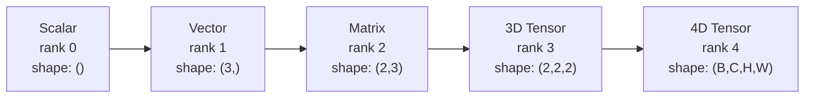
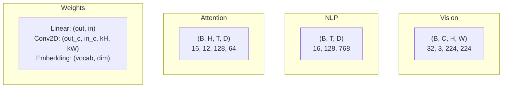
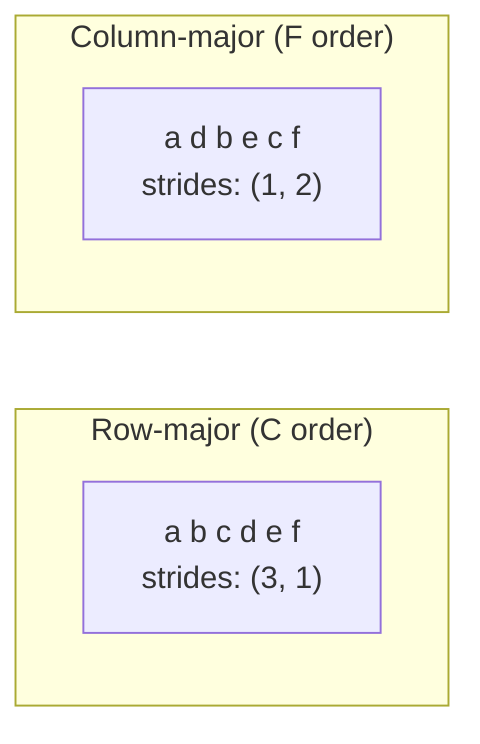
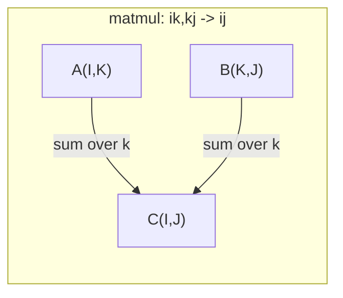

# Tenzor Operasyonları .

> Tensorlar veriler ve derin öğrenme arasındaki ortak dil. Her görüntü, her cümle, her gradient onların içinden akıyor.
> 张量 is the general language of data and deep learning. 张量, bilgi ve derinlik öğrenme için kullanılan bir dildir.

**Type:** Build | **类型:** 动手
**Language:**Python .**语言:**Python
**Prerequisites:** Phase 1, Lessons 01 (Linear Algebra Intuition), 02 (Vectors, Matrices & Operations) | **前置知识:** Phase 1, Lessons 01-02
**Time:** ~90 minutes | **时间:** ~90 分钟

## Öğrenme hedefleri

- Şekil, adım, yeniden şekil, transpose ve element-hikmetli işlemlerle sıfırdan bir tensor sınıfı uygulayın
  0'dan oluşu­du­du­du­du­du­du­du­du­du­du­du­du­du­du­du­du­du­du­du­du­du­du­du­du­du­du­du­du­du­du­du­du­du­du­du­du­du­du­du­du­du­du­du­du­du­du­du­du­du­du­du­du­du­du­du­du­du­du­du­du­du­du­du­du­du­du­du­du­du­du­du­du­du­du­du­du­du­du­du­du­du­du­du­du­du­du­du­du­du­du­du­du­du­du­du­du­du­du­du­du­du­du­du­du­du­du­du­du­du­du­du­du­du­du­du­du­du­du­du­du­du­du­du­du­du­du­du­du­du­du­du­du­du­du­du­du­du­du­du­du­du­du­du­du­du­du­du­du­du­du­du­du­du­du­du­du­du­du­du­du­du­du­du­du­du­du­du­du­du­du­du­du­du­du­du­du­du­du­du­du­du­du­du­du­du­du­du­du­du­du­du­du­du­du­du­du­du­du­du­du­du­du­du­du­du­du­du­du­du­du­du­du­du­du­du­du­du­du­du­du­du­du­du­du­du­du­du­du­du­du­du­du­du­du­du­du­du­du­du­du­du­du­du­du­du­du­du­du­du­du­du­du­
- Veri kopyasını yapmadan farklı şekillerdeki tenzorlarda çalışmak için yayın kurallarını uygula
  应用广播规则 farklı şekillerdeki 张量 üzerinde işlem yapılması için kopyalanma gerekmez
- Düğüm ürünleri, matris çarpmaları, dış ürünler ve seri işlemler için birim ifadeleri yazın
   编写数 表达式实现点积、矩阵乘法、外积和批量操作
- Çok başlı dikkatin her adımı boyunca tam tenzor şekilleri izleyin
  Çok dikkatli bir adımın tam şekli

> **【中文解读】**
> 张量是数据和深度学习的通用语言──向量是张量,矩阵是二维张量,RGB 图像是三维张量──本章零实现张量类,理解形状、步长、广播和 einsum──Transformer 多头注意力中 Q/K/V 都是四维张量,理解张量形状是调试的关键──

## Sorunlar. Sorunlar.

> **【中文解读】**Bir Transformer inşa ettin, çalıştırdın.`RuntimeError: shapes cannot be multiplied (32x768 and 512x768)` Şekil  hataları derin öğrenimdeki en yaygın hatalardır.  Transformer birkaç reshape / transpose / yayın  operasyonları vardır.  Bir işleyiş hatası vardır.                                                                                                                                                                                                                                                                             

## Konsepten bir şey.

> **【拓展：张量 shape 是 AI 工程师的日常】**调试神经网络 90% 的时间在处理形 问题──关键工具:`print(tensor.shape)`- Şekil.`.reshape()`Şıklık,`.transpose()`转置,`.unsqueeze()`增加维度──PyTorch'in birimi`torch.einsum('bhd,bhd->bh', q, k)`) Einstein'ın 求和约定一行搞定复杂张量运算, is Transformer 实现的利器──

### Tensör nedir?

Tensör, bir eşit veri tipi olan çok boyutlu bir sayı dizisidir.**rank**(veya **order**) Her boyut bir **axis**- Ne ?**shape**her eksesi boyunca boyutları listeden bir tuple.
> 张量 is a unified data type of multi-dimensional array.**秩**(Yada**阶**), her boyut bir**轴**- Evet .**形状**Bu, her büyük ve küçük bir gruptan oluşmaktadır.



Toplam elementler = tüm boyutların ürünü.`(2, 3, 4)`Tutulur .`2 * 3 * 4 = 24`unsurlar.
> 总元素数 = 所有维度大小的乘积──形状 `(2, 3, 4)`包含 `2 * 3 * 4 = 24`个元素──

### Derin öğrenimdeki 张量形

Farklı veri türleri, konvansiyonla belirli tenzor şekillerine haritası yapmaktadır.
> Farklı veri türleri, adet olarak belirli bir miktar şekline kadar görüntülenir.



PyTorch, NCHW (kanallar ilk) kullanır. TensorFlow, NHWC (kanallar son) için varsayılan özelliklere sahiptir.
> PyTorch NCHW kullanmak, TensorFlow 默认 NHWC

### Hatıra düzenlemesi nasıl çalışır ?

Hatıradaki 2 boyutlu bir dizil, 1 boyutlu bir bayt dizisidir. **Strides**Her eksesi boyunca bir adım atmak için kaç element atlamayı söyleyebilirim.
> 内存中的 2D 数组是 1D 字节序列──**步长**Her hareketin bir adım boyunca kaç element atlamak gerektiğini söyleyin.



Transpose verileri hareket ettirmez.**non-contiguous**-- bir satırdaki elementler artık hafızada bitişik değil.
> 转置不移动数据──它交换步长,使张量**不连续** Bir satırdaki element artık bellekte birbirine yakın değil.

### Yayınlama kuralları.

Yayınlama, verileri kopyalamadan farklı şekillerdeki tensörleri çalıştırmanıza olanak tanır. Sağdan şekillerin uyumlu olması. İki boyut eşit olduğunda veya bir tane 1.
> 广播让你对形的不同张量操作而无需复制数据──右对齐形──两维相等或其中一个为1 时兼容──较小的维度在左侧填充1──

```
Tensor A:     (8, 1, 6, 1)
Tensor B:        (7, 1, 5)
Padded B:     (1, 7, 1, 5)
Result:       (8, 7, 6, 5)
```

### Einsum: evrensel tensor işlevi.

Einstein toplamı her ekseni bir harf ile etiketler. Girişdeki ekseler toplamlanır ama çıkış değil. Her iki eksede de saklanır.
> Einstein 求和字母标记每个轴──输入中轴被求和──输出中轴被求和──两者都有轴保留──



Anahtar örnekler: `i,i->`(dot ürün / 点积),`i,j->ij`(dış ürün / 外积), `ii->`(iç / 迹), `ij->ji`(transpose / 转置),`bij,bjk->bik`(batch matmul / 批量矩阵乘法),`bhtd,bhsd->bhts`(Dikkat puanları / dikkat çekme sayı).

## Yapın.
```figure
tensor-broadcast
```

## Yapın

Kod içinde yaşıyor .`code/tensors.py`Her adım, orada uygulanmaya işaret eder.
> - Evet .`code/tensors.py`Her adımın içinde, orada gerçekleşenleri de görüyorum.

### Adım 1: Tensiyon depolama ve adımlar .

Bir tensör, sayıların düz listesini ve şekil metadatalarını saklar.
> 张量存储一个平的数字列表加上形状元数据──步长 索引逻辑 索引逻辑 索引逻辑 索引 索引 索引 索引 索引 索引 索引 索引 索引 索引 索引 索引 索引 索引 索引 索引 索引 索引 索引 索引 索引 索引 索引 索引 索引 索引 索引 索引 索引 索引 索引 索引 索引 索引 索引 索引 索引 索引 索引 索引 索引 索引 索引 索引 索引 索引 索引 索引 索引 索引 索引 索引 索引 索引 索引 索引 索引 索引 索引 索引 索引 索引 索引 索引 索引 索引 索引 索引 索引 索引 索引 索引 索引 索引 索引 索引 索引 索引 索引 索引 索引 索引 索引 索引 索引 索引 索引 索引 索引 索引 索引 索 索 索 索 索 索 索 索 索 索 索 索 索 索 索 索 索 索 索 索 索 索 索 索 索 索 索 索 索 索 索 索 索 索 索 索 索 索 索 索 索 索 索 索 索 索 索 索 索 索 索 索 索 索 索 索 索 索 索 索 索 索 索 索 索 索 索 索 索 索 索 索 索 索 索 索 索 索 索 索 索 索 索 索 索 索 索 索 索 索 索 索 索 索 索 索 索 索 索 索 

```python
class Tensor:
    def __init__(self, data, shape=None):
        if isinstance(data, (list, tuple)):
            self._data, self._shape = self._flatten_nested(data)
        elif isinstance(data, np.ndarray):
            self._data = data.flatten().tolist()
            self._shape = tuple(data.shape)
        else:
            self._data = [data]
            self._shape = ()

        if shape is not None:
            total = reduce(lambda a, b: a * b, shape, 1)
            if total != len(self._data):
                raise ValueError(
                    f"Cannot reshape {len(self._data)} elements into shape {shape}"
                )
            self._shape = tuple(shape)

        self._strides = self._compute_strides(self._shape)

    @staticmethod
    def _compute_strides(shape):
        if len(shape) == 0:
            return ()
        strides = [1] * len(shape)
        for i in range(len(shape) - 2, -1, -1):
            strides[i] = strides[i + 1] * shape[i + 1]
        return tuple(strides)
```

Şekil için`(3, 4)`, adımlar `(4, 1)`-- bir satır ileriye 4 element atlamak, bir sütun ileriye 1 element atlamak.
> 对于形状 `(3, 4)`,步长为 `(4, 1)`前进一行跳过4个元素,前进一列跳过1个元素──

### Adım 2: Yeniden şekillendirin, sıkın, sıkın.

Modelleştirme, element sırasını değiştirmeden şeklini değiştirir.`-1`Bir boyut için boyutunu çıkarmak için.
> Şekil değişimi, unsurların sırası değişmeden değişim biçimi.`-1`Kendini bir boyuttan daha büyük bir boyuttan daha büyük bir boyuttan daha büyük bir boyuttan daha büyük bir boyuttan daha büyük bir boyuttan daha büyük bir boyuttan daha büyük bir boyuttan daha büyük bir boyuttan daha büyük bir boyuttan daha büyük bir boyuttan daha büyük bir boyuttan daha fazla boyuttan daha büyük bir boyuttan daha fazla boyuttan daha büyük bir boyuttan daha fazla boyuttan daha fazla boyuttan daha fazla boyuttan daha büyük bir boyuttan daha fazla boyuttan daha fazla boyuttan daha fazla boyuttan daha fazla boyuttan daha fazla boyuttan daha fazla boyuttan daha fazla boyuttan daha fazla boyuttan daha fazla boyuttan daha fazla boyuttan daha fazla boyuttan daha fazla boyuttan daha fazla boyuttan daha fazla boyuttan daha fazla boyuttan daha fazla boyuttan daha fazla boyuttan daha fazla boyuttan daha fazla boyuttan daha fazla boyuttan daha fazla boyuttan daha fazla boyuttan daha fazla boyuttan daha fazla boyuttan daha fazla boyuttan daha fazla boyuttan daha fazla boyuttan daha fazlasına ulaştıra ulaştı.

```python
t = Tensor(list(range(12)), shape=(2, 6))
r = t.reshape((3, 4))
r = t.reshape((-1, 3))
```

Squeeze, 1. boyuttaki ekseni çıkarır. Uncpress bir ekler.`(D,)`bir partiye eklenir `(B, T, D)`Çekilmemesi gerek .`(1, 1, D)`- Evet .
> Squeeze 移除大小为 1 的轴,Squeeze 插入一个──Squeeze for广播至关重要偏向量 `(D,)`Toplamalar için .`(B, T, D)`Üstüne sıkıştırılmamalı.`(1, 1, D)`- Evet.

```python
t = Tensor(list(range(6)), shape=(1, 3, 1, 2))
s = t.squeeze()
v = Tensor([1, 2, 3])
u = v.unsqueeze(0)
```

### Adım 3: Transpose ve permute.

Transpose iki ekseni değiştirir, Permute tüm ekseni yeniden düzenler.
> Transpose 交换两个轴──Permute 重排所有轴── bu NCHW ve NHWC 之间转换的方法──

```python
mat = Tensor(list(range(6)), shape=(2, 3))
tr = mat.transpose(0, 1)

t4d = Tensor(list(range(24)), shape=(1, 2, 3, 4))
perm = t4d.permute((0, 2, 3, 1))
```

Transpose veya permute sonrasında, tenzor hafızada birbiriyle uzlaşmaz.`view`Düzsel olmayan tenzorlarda başarısız olur -- kullan `reshape`Ya da aramak .`.contiguous()`Önce.
> 转置或排列后,张量在内存中不连续──PyTorch 中 `view`Sürekli olmayan 张量上会失败使用 `reshape`Ya da önce kullanın.`.contiguous()`- Evet.

### Adım 4: Element-wise işlemler ve azaltmalar.

Element-wise ops (ekle, çarp, çıkar) her öğeye bağımsız olarak uygulanır ve şeklini korur.
> 逐元素操作 (加、乘、减) bağımsız olarak her element için uygulanır ve biçimini korur.

```python
a = Tensor([[1, 2], [3, 4]])
b = Tensor([[10, 20], [30, 40]])
c = a + b
d = a * 2
s = a.sum(axis=0)
```

CNN'de küresel ortalama birleştirme: `(B, C, H, W).mean(axis=[2, 3])`üretir `(B, C)`. NLP'de sırayla birleştirme ortalaması: `(B, T, D).mean(axis=1)`üretir `(B, D)`- Evet .
> CNN'in genel haber ortalaması:`(B, C, H, W).mean(axis=[2, 3])` oluşuyor`(B, C)`❖NLP içindeki sıralar ortalama değerleri:`(B, T, D).mean(axis=1)` oluşuyor`(B, D)`- Evet.

### Adım 5: NumPy ile yayınlama .

- Evet .`demo_broadcasting_numpy()``tensors.py`- Temel modellerini gösteriyor.
> `tensors.py`Orta `demo_broadcasting_numpy()`函数 gösterdi çekirdek modeli¬

```python
activations = np.random.randn(4, 3)
bias = np.array([0.1, 0.2, 0.3])
result = activations + bias

images = np.random.randn(2, 3, 4, 4)
scale = np.array([0.5, 1.0, 1.5]).reshape(1, 3, 1, 1)
result = images * scale

a = np.array([1, 2, 3]).reshape(-1, 1)
b = np.array([10, 20, 30, 40]).reshape(1, -1)
outer = a * b
```

Yayınlama yoluyla çiftlik mesafe: yeniden şekillendirmek `(M, 2)`- ...`(M, 1, 2)`ve `(N, 2)`- ...`(1, N, 2)`, çıkar, kare, son eksesi boyunca toplam, kare kökü alın. Sonuç: `(M, N)`- Evet .
> 通过广播计算成对距离:将 `(M, 2)`Şıklık`(M, 1, 2)`- Evet .`(N, 2)`Şıklık`(1, N, 2)`,相减、平方、沿最后轴求和、取平方根── sonuç:`(M, N)`- Evet.

### Adım 6: Einsum Operasyonları

- Evet .`demo_einsum()`ve `demo_einsum_gallery()`fonksiyonlar her ortak örneği geçer.
> `demo_einsum()`和 `demo_einsum_gallery()`函数演示了每种常见模式──

```python
a = np.array([1.0, 2.0, 3.0])
b = np.array([4.0, 5.0, 6.0])
dot = np.einsum("i,i->", a, b)

A = np.array([[1, 2], [3, 4], [5, 6]], dtype=float)
B = np.array([[7, 8, 9], [10, 11, 12]], dtype=float)
matmul = np.einsum("ik,kj->ij", A, B)

batch_A = np.random.randn(4, 3, 5)
batch_B = np.random.randn(4, 5, 2)
batch_mm = np.einsum("bij,bjk->bik", batch_A, batch_B)
```

Bir kısıtlamanın hesaplama maliyeti tüm indeks boyutlarının (daha fazla ve toplam) ürünüdür.`bij,bjk->bik`B=32, I=128, J=64, K=128:`32 * 128 * 64 * 128 = 33,554,432`kat kat kat kat kat kat kat kat kat kat kat kat kat kat kat kat kat kat kat kat kat kat kat kat kat kat kat kat kat kat kat kat kat kat kat kat kat kat kat kat kat kat kat kat kat kat kat kat kat kat kat kat kat kat kat kat kat kat kat kat kat kat kat kat kat kat kat kat kat kat kat kat kat kat kat kat kat kat kat kat kat kat kat kat kat kat kat kat kat kat kat kat kat kat kat kat kat kat kat kat kat kat kat kat kat kat kat kat kat kat kat kat kat kat kat kat kat kat kat kat kat kat kat kat kat kat kat kat kat kat kat kat kat kat kat kat kat kat kat kat kat kat kat kat kat kat kat kat kat kat kat kat kat kat kat kat kat kat kat kat kat kat kat kat kat kat kat kat kat kat kat kat kat kat kat kat kat kat kat kat kat kat kat kat kat kat kat kat kat kat kat kat kat kat kat kat kat kat kat kat kat kat kat kat kat kat kat kat kat kat kat kat kat kat kat kat kat kat kat kat kat kat kat kat kat kat kat kat kat kat kat kat kat kat kat kat kat kat kat kat kat kat kat kat kat kat kat kat kat kat kat kat kat kat kat kat kat kat kat kat kat kat kat kat kat kat kat kat kat kat kat kat kat kat kat kat kat kat kat kat kat kat kat kat kat kat kat kat kat kat kat kat kat kat kat kat kat kat kat kat kat kat kat kat kat kat kat kat kat kat kat kat kat kat kat kat kat kat kat kat kat kat kat kat kat kat kat kat kat kat kat kat kat kat kat kat kat kat kat kat kat kat kat kat kat kat kat kat kat kat kat kat kat kat kat kat kat kat kat kat kat kat kat kat kat kat kat kat kat kat kat kat kat kat kat kat kat kat kat kat kat kat kat kat kat kat kat kat kat kat kat kat kat kat kat kat kat kat kat kat kat kat kat kat kat kat kat kat kat kat kat kat kat kat kat kat kat kat kat kat kat kat kat kat kat kat kat kat kat kat kat kat kat kat kat kat kat kat kat kat kat kat kat kat kat kat kat kat kat kat kat kat kat kat kat kat kat kat kat kat kat kat kat kat kat kat kat kat kat kat kat kat kat kat kat kat kat kat kat kat kat kat kat kat kat kat kat kat kat kat kat kat kat kat kat kat kat kat kat kat kat kat kat kat kat kat kat kat kat kat
> 缩me hesaplama maliyeti tüm indekslerin                                                                                                                                                                                                                                                          

### 7. Adım: Eynüm ile dikkat mekanizmasını gerçekleştirmek.

- Evet .`demo_attention_einsum()`Bu işlevi, bir çok başlı dikkat uygulaması ile başlıyor.
> `demo_attention_einsum()`函数端到端实现多头注意力──

```python
B, H, T, D = 2, 4, 8, 16
E = H * D

X = np.random.randn(B, T, E)
W_q = np.random.randn(E, E) * 0.02

Q = np.einsum("bte,ek->btk", X, W_q)
Q = Q.reshape(B, T, H, D).transpose(0, 2, 1, 3)

scores = np.einsum("bhtd,bhsd->bhts", Q, K) / np.sqrt(D)
weights = softmax(scores, axis=-1)
attn_output = np.einsum("bhts,bhsd->bhtd", weights, V)

concat = attn_output.transpose(0, 2, 1, 3).reshape(B, T, E)
output = np.einsum("bte,ek->btk", concat, W_o)
```

Her adım bir tensor işlemidir: projeksiyon (matmul via einsum), baş bölünmesi (reform + transpose), dikkat puanları (batch matmul via einsum), ağırlıklı toplam (batch matmul via einsum), baş birleşimi (transpose + reshape), çıkış projeksiyonu (matmul via einsum).
> Her adım 张量操作:投影 (投影) ̇einsum 矩阵乘法) ̇头分裂 (分化) ̇注意力分数 (重量) ̇ einsum 批量矩阵乘法) ̇加权求和、头合并 (重量) ̇输出投影 (重量) ̇

## Çerçeveyi kullanın.

### Çizik vs NumPy El yazısı vs NumPy

| Operation / 操作 | Scratch (Tensor class) | NumPy |
|---|---|---|
| Create / 创建 | `Tensor([[1,2],[3,4]])` | `np.array([[1,2],[3,4]])` |
| Reshape / 重塑 | `t.reshape((3,4))` | `a.reshape(3,4)` |
| Transpose / 转置 | `t.transpose(0,1)` | `a.T` or `a.transpose(0,1)` |
| Squeeze / 压缩 | `t.squeeze(0)` | `np.squeeze(a, 0)` |
| Sum / 求和 | `t.sum(axis=0)` | `a.sum(axis=0)` |
| Einsum | N/A | `np.einsum("ij,jk->ik", a, b)` |

### Çizik vs PyTorch .

```python
import torch

t = torch.tensor([[1, 2, 3], [4, 5, 6]], dtype=torch.float32)
t.shape
t.stride()
t.is_contiguous()

t.reshape(3, 2)
t.unsqueeze(0)
t.transpose(0, 1)
t.transpose(0, 1).contiguous()

torch.einsum("ik,kj->ij", A, B)
```

PyTorch, otograd, GPU desteği ve optimize edilmiş BLAS çekirdeklerini ekler. Şekil semantikleri aynıdır.
> PyTorch  otomatik olarak küçük bölümleri GPU  destek ve optimize BLAS 内核──形状语义完全相同──理解手写版本后,PyTorch 形状错误变得可读──

### Her sinir ağının katmanı bir tensor işlevi olarak.

| Operation / 操作 | Tensor Form / 张量形式 | Einsum |
|---|---|---|
| Linear layer / 线性层 | `Y = X @ W.T + b` | `"bd,od->bo"` + bias |
| Attention QKV | `Q = X @ W_q` | `"btd,dh->bth"` |
| Attention scores / 注意力分数 | `Q @ K.T / sqrt(d)` | `"bhtd,bhsd->bhts"` |
| Attention output / 注意力输出 | `softmax(scores) @ V` | `"bhts,bhsd->bhtd"` |
| Batch norm / 批归一化 | `(X - mu) / sigma * gamma` | element-wise + broadcast |
| Softmax | `exp(x) / sum(exp(x))` | element-wise + reduction |

## İndirin . Ürünler .

Bu ders iki tekrar kullanılabilir ipucu verir:
> Bu ders iki tekrarlanabilir ipucu sözcükten oluşur:

1. **`outputs/prompt-tensor-shapes.md`**- Tenzor şekli eşleşmezliği düzeltmek için sistematik bir istek.
   Bir sistematik 张量形状不匹配调试提示词──

2. **`outputs/prompt-tensor-debugger.md`**-- Bir adım adım defaggerleme uyarısı şekil hatası sizi engellediğinde herhangi bir AI asistanına yapıştırmak için.
   Bir adım adım bir yanlış engelleme sırasında herhangi bir AI yardımcılarına yapıştırmak için bir ipucu sözcüğü.

## Egzersizler.

1. **Easy -- Reshape round-trip.**Şekil tensörü alın .`(2, 3, 4)`- Onu yeniden şekillendir .`(6, 4)`Sonra da `(24,)`, sonra geri dön .`(2, 3, 4)`. Verify elementleri sırası, her adımda düz verileri basarak korunur.
   **简单 -- 重塑往返。**取形形 `(2, 3, 4)`Çang量,重塑为`(6, 4)`, tekrar `(24,)`, tekrar dön .`(2, 3, 4)`❖ Test elementleri sırası değişmez.

2. **Medium -- Implement broadcasting.**`Tensor`sınıfı`broadcast_to(shape)`Bu yöntem, hedef şekline uygun olarak 1 boyut boyutlarını genişletir.`_elementwise_op`İşlemden önce otomatik olarak yayınlanmak için.`(3, 1)`ve `(1, 4)`üretimi`(3, 4)`- Evet .
   **中等 -- 实现广播。**- Evet .`Tensor`类中添加 `broadcast_to(shape)`方法──修改 `_elementwise_op`Öz动广播──测试 `(3, 1)`和 `(1, 4)` oluşuyor`(3, 4)`- Evet.

3. **Hard -- Build einsum from scratch.**Temel bir uygulama yapın `einsum(subscripts, *tensors)`En az: nokta ürünü (`i,i->`), matris çarpımı (`ij,jk->ik`), dış ürün (`i,j->ij`(), ve transpose (`ij->ji`) Alt yazılı dizileri analiz edin, sözleşmiş indeksleri belirleyin ve tüm indeks kombinasyonlarını inceleyin.`np.einsum`- Evet .
   **困难 -- 从零构建 einsum。**实现基本的 `einsum`函数处理点积、矩阵乘法、外积和转置──解析下标字符串,识别缩索引,遍历所有索引组合──

4. **Hard -- Attention shape tracker.**Alıcı bir fonksiyon yaz `batch_size`- Evet .`seq_len`- Evet .`embed_dim`ve`num_heads`Çok başlı dikkatin her adımda tam şekli olarak girdiler ve yazdırdılar.
   **困难 -- 注意力形状追踪器。**编写函数,输入 `batch_size`- Evet.`seq_len`- Evet.`embed_dim`和 `num_heads`, basmak çok dikkat her adımın kesin şekli

## Anahtar Şartlar .

| Term / 术语 | What people say | What it actually means / 实际含义 |
|---|---|---|
| Tensor / 张量 | "A matrix but more dimensions" | A multi-dimensional array with uniform type and defined shape, strides, and operations / 具有统一类型和定义的形状、步长、操作的多维数组 |
| Rank / 秩 | "The number of dimensions" | The number of axes. A matrix has rank 2, not rank equal to its matrix rank / 轴的数量。矩阵的秩为 2 |
| Shape / 形状 | "The size of the tensor" | A tuple listing the size along each axis. `(2, 3)` means 2 rows, 3 columns / 列出各轴大小的元组 |
| Stride / 步长 | "How memory is laid out" | The number of elements to skip to advance one position along each axis / 沿每个轴前进一个位置要跳过的元素数 |
| Broadcasting / 广播 | "It just works when shapes differ" | A strict set of rules: align from right, dimensions must be equal or one must be 1 / 严格规则：从右对齐，维度必须相等或一个为 1 |
| Contiguous / 连续 | "The tensor is normal" | Elements stored sequentially in memory with no gaps / 元素在内存中顺序存储无间隙 |
| Einsum | "A fancy way to write matmul" | A general notation that expresses any tensor contraction, outer product, trace, or transpose in one line / 通用表示法，一行表达任何张量收缩、外积、迹或转置 |
| View / 视图 | "Same as reshape" | A tensor sharing the same memory buffer but with different shape/stride metadata. Fails on non-contiguous data / 共享内存缓冲区但形状/步长元数据不同的张量 |
| Contraction / 收缩 | "Summing over an index" | The general operation where a shared index between tensors is multiplied and summed / 共享索引被乘和求和的通用操作 |
| NCHW / NHWC | "PyTorch vs TensorFlow format" | Memory layout conventions for image tensors / 图像张量的内存布局约定 |

## Daha fazla okumak

- [NumPy Broadcasting](https://numpy.org/doc/stable/user/basics.broadcasting.html)-- Görsel örneklerle birlikte Kanonik Kurallar
  NumPy 广播规则与可视化示例
- [PyTorch Tensor Views](https://pytorch.org/docs/stable/tensor_view.html)- Görüşler ne zaman çalışır ve ne zaman kopyalar
  PyTorch 视图何时工作何时 kopy
- [einops](https://github.com/arogozhnikov/einops)- Tenzor yeniden şekillendirmeyi okuyabilir ve güvenli hale getiren bir kitaplık
  让张量重塑可读且安全的库
- [The Illustrated Transformer](https://jalammar.github.io/illustrated-transformer/)- Dikkatin içinden akıp giden tenzor şekilleri görselleştirir
  Görülebilir dikkat içinde hareket eden 张量形
- [Einstein Summation in NumPy](https://numpy.org/doc/stable/reference/generated/numpy.einsum.html)-- Örneklerle birlikte tam bir toplam belgesini
  NumPy einsum 完整文档与示例
