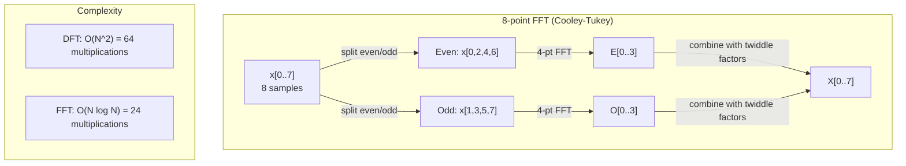
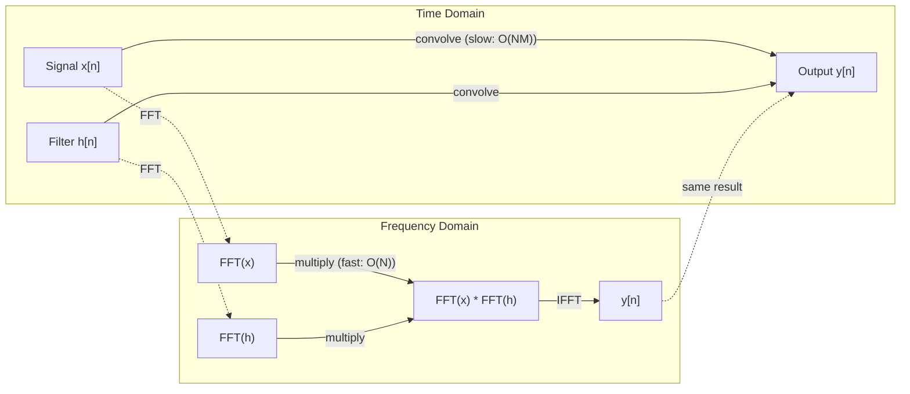

# Fourier Transform'u değişti.

> Her sinyal sinüs dalgalarının toplamıdır. Fourier dönüşümü hangisini söyler.
> Her sinyal, bir gergin dalgaların üstüdür.

**Type:** Build | **类型:** 动手
**Language:**Python .**语言:**Python
**Prerequisites:** Phase 1, Lessons 01-04, 19 (complex numbers) | **前置知识:** Phase 1, 第 01-04 课、第 19 课（复数）
**Time:** ~90 minutes | **时间:** ~90 分钟

## Öğrenme hedefleri

- DFT'yi sıfırdan uygulayın ve O(N log N) Cooley-Tukey FFT'ye karşı doğrulayın
  DFT'yi gerçekleştirmekten ve O(N log N) ile Cooley-Tukey FFT 验证
- Frekans koefisienlerini yorumlayın: bir sinyaldeki amplitud, faz ve güç spektrumu çıkarın
  解释频率系数: signal中提取幅度、相位和功率谱 (Vahte Spektrumu)
- FFT çarpımı yoluyla konvulsiyon gerçekleştirmek için konvulsiyon teoremi uygulayın
  应用卷积定理通过 FFT 乘法执行卷积
- Fourier frekansı parçalanmasını transformatör pozisyon kodlama ve CNN konvolisyon katmanlarına bağlayın
  Transformer  konum kodlaması ve CNN   卷积层 ile bağlantı


> **【中文解读】**
> 任何信号都可以分解为正弦波──音频处理、图像压缩都依赖于FFT──卷积定理说时域卷积等于频域乘法,可用FFT 加速CN卷积──Transformer 正弦位置编码就是里叶基函数──

## Sorunlar. Sorunlar.

Bir ses kaydesi, zamanla basınç ölçümlerinin bir dizilemesidir. Bir stok fiyatı, günler boyunca değerlerin bir dizilemesidir. Bir görüntü, uzay üzerinde piksel yoğunluklarının bir çubuğudur. Bunların hepsi zaman alanındaki (veya uzay alanındaki) veridir.

> 音频录制, zamanla değişen basınç ölçümleri sırasıdır. 股票价格是天数变化的价值序列. 图像是空间上像素强度的网格.

Ancak zaman alanında birçok desen görünmez. Bu ses sinyali saf bir ton mu yoksa akord mu? Bu hisse senedi bir haftalık döngü mi var? Bu görüntü tekrarlayan bir doku mu var?

> Ancak zaman alanında birçok model görünmez. Bu ses sinyali saf sesli mi yoksa akrabalı mı?

Fourier dönüşümü, bir sinyal alır ve farklı frekanslarda sinüs dalgalarına parçalayır. Her sinüs dalgasının bir amplitudusu (ne kadar güçlü olduğu) ve bir aşaması vardır (nereye başladığı). Fourier dönüşümü her ikisini de söyler.

> 里叶变换将数据从时域转换到频域──它接收一个信号并将其分解为不同频率的正弦波──每正弦波有幅度(有多强) 和相位──从哪里开始)──里叶变换告诉你两者──

Bu ML için önemlidir çünkü frekans alanı düşüncesi her yerde ortaya çıkar. Konvülsiyonal sinir ağları konvülsiyonu gerçekleştirir, bu da frekans alanında çarpma. Transformer pozisyon kodlamaları konumları temsil etmek için frekans parçalanmasını kullanır. Ses modelleri (söz tanıma, müzik üretimi) spektrogramlar üzerinde çalışır - seslerin frekans temsilleri. Zaman dizisi modelleri periyodik desenleri arıyor. Fourier dönüşümünü anlamak, bunların hepsini kullanmak için kelime birikimi verir.

> Bu, ML için çok önemlidir, çünkü frekans alanı düşünce bulunmaz. Bu frekans alanında çarpma biçimidir. Bu, frekans alanında çarpma biçimidir.

## Konsepten bir şey.

> **【中文解读】**
> 里叶变换的核心思想: herhangi bir sinyal farklı frekanslı 正弦波之和――DFT olarak parçalanabilir. Zaman alanı sinyalini frekanslı 频域系数 olarak ayırarak her系 size "bu frekansın ne kadar enerji olduğunu" söyler.

> **【拓展：FFT 的计算影响力】**
> FFT, 20. yüzyılın en önemli sayısal algoritmalarından biri olarak tanınır. Gauss 1805 yılında bir bölme yöntemi keşfetti, ancak Cooley-Tukey 1965 yılında yaptığı çalışma FFT'yi geniş bir şekilde kullanmaya izin verdi. Bugün, her 4G/LTE telefon konuşması, her JPEG fotoğrafı, her MP3 şarkısı FFT'den geçti. AI alanında, Susur ses modeli, saniyede 100 kez FFT'yi hesaplıyor.

### DFT tanımı

N örnekler x[0], x[1], ..., x[N-1] verildiğinde, Diskret Fourier Transform N frekans katılıkları X[0], X[1], ..., X[N-1] üretir:

> 给定 N 个样本 x[0], x[1], ..., x[N-1],离散里叶变换产生 N 个频率系数 X[0], X[1], ..., X[N-1]:

```
X[k] = sum_{n=0}^{N-1} x[n] * e^(-2*pi*i*k*n/N)

for k = 0, 1, ..., N-1
```

Her X [k] karmaşık bir sayıdır. Büyüklüğü. X [k] da size frekans k'nin amplitudunu söyler. Faz açısı.

> Her X[k] is复数──其模── X[k]  告诉你频率 k 的幅度──其相位角 X[k]) 告诉你该频率 的相位偏移──

Anahtar bilgi:`e^(-2*pi*i*k*n/N)`DFT, sinyal ile N eşit alanlı frekansların her biri arasındaki ilişkiyi hesaplar. Eğer sinyal k frekanslı enerji içerirse, ilişki büyüktür.

> 关键洞察:`e^(-2*pi*i*k*n/N)`Bu da, k frekansında bir sinyalin enerjiye sahip olması için büyük bir bağlantı oluşturur.

### Her bir katılamın anlamı

**X[0]: the DC component.**Bu, tüm örneklerin toplamı ortalama oranla oranlıdır.

> **X[0]：直流分量（DC Component）。**Bu, tüm örneklerin toplamı ve ortalama değeri ile oranlı olarak değişir.

```
X[0] = sum_{n=0}^{N-1} x[n] * e^0 = sum of all samples
```

**X[k] for 1 <= k <= N/2: positive frequencies.**X[k] N örnekler başına frekans k döngüleri temsil eder. Yüksek k, daha yüksek frekans (hızlı ossilasyon) anlamına gelir.

> **X[k]（1 <= k <= N/2）：正频率。**X[k] 代表每 N 个样本中 k 个周期的频率──k 越大频率越高(振荡越快)──

**X[N/2]: the Nyquist frequency.**N örneklerle temsil edebileceğiniz en yüksek frekans. Bu üzerinde, düşük frekanslar gibi maske edilen yüksek frekanslar.

> **X[N/2]：Nyquist 频率。**Bu sıklıktan fazla, karışıklık oluşur.

**X[k] for N/2 < k < N: negative frequencies.**Gerçek değerli sinyaller için, X[N-k] = conj(X[k]). Negatif frekanslar pozitiflerin ayna görüntüleridir. Bu nedenle yararlı bilgiler ilk N/2 + 1 katılımcılarda bulunur.

> **X[k]（N/2 < k < N）：负频率。**对于实值信号,X[N-k] = conj(X[k])。负频率是正频率的镜像──这就是为什么有用信息在前N/2 + 1 系数中──

### Ters DFT

Ters DFT, orijinal sinyali frekans koefisienlerinden yeniden oluşturur:

```
x[n] = (1/N) * sum_{k=0}^{N-1} X[k] * e^(2*pi*i*k*n/N)

for n = 0, 1, ..., N-1
```

Önceki DFT'den tek fark: Eksponent'teki işaret olumlu (menik değil) ve 1/N normallaşma faktörü vardır.

> DFT'nin doğru yönde olan tek farkı: indeks simgesi doğru (() negatif değildir ve 1/N'nin birleştirme faktörü vardır.

DFT tersine dönüşüm mükemmel. Hiçbir bilgi kaybolmaz. Zaman alanından frekans alanına ve geri herhangi bir hata olmadan gidebilirsiniz. DFT temel değişikliği - aynı bilgileri farklı koordinat sisteminde yeniden ifade eder.

> 逆 DFT is perfect rebuild──無信息失失──時間域から频域へ戻れる, herhangi bir hata yok──DFT is基变换它用不同的坐标系重新表达相同信息──

### FFT: hızlı hale getirmek

Yukarıda tanımlanan DFT O(N^2): N çıkış katılıklarının her biri için N giriş örneklerini toplamlarsınız. N = 1 milyon için, bu 10^12 işlemdir.

> Yukarıda tanımlanan DFT ise O(N^2): N 个输出系数 içindeki her bir için, N 个输入样本求和── N = 100,000 için, bu 10^12 kez运算──

Hızlı Fourier Değişimi (FFT) aynı sonucu O  N log N'de hesaplar. N = 1 milyon için, bu bir trilyon yerine yaklaşık 20 milyon işlemdir.

> 快速里叶变换(FFT) O(N log N) 计算相同的结果── N = 100.000.000 için, yaklaşık olarak 200.000.000 kez运算而非10 milyar kez──

> **【中文解读】**
> DFT'nin hesaplama miktarı O(N^2), ancak FFT 分治 stratejisi ile onu O(N log N) 〜'e indirmek için N=100.000 sinyal için, DFT  milyonlarca kez çalıştırılmalıdır, FFT sadece yaklaşık 2000.000 kez  hızlandırılması 50.000 kez gerekir!

Cooley-Tukey algoritması (en yaygın FFT) bölme ve fetih yoluyla çalışır:

> Cooley-Tukey 算法 (FFT) ️️️️️️️️️️️️️️️️️️️️️️️️️️️️️️️️️️️️️️️️️️️️️️️️️️️️️️️️️️️️️️️️️️️️️️️️️️️️️️️️️️️️️️️️️️️️️️️️️️️️️️️️️️️️️️️️️️️️️️️️️️️️️️️️️️️️️️️️️️️️️️️️️️️️️️️️️️️️️️️️️️️️️️️️️️️️️️️️️️️️️️️️️️️️️️️️️️️️️️️️️️️️️️️️️️️️️

1. Sinyalı eşit indeksi ve eşsiz indeksi örneklere bölün.
   Sinyalları çift sayı göstergesine ve çirkin sayı göstergesine ayırmak.
2. Her yarısının DFT'sini geri dönüşlü olarak hesaplayın.
   递归计算每一半的DFT──
3. İki yarı boyutlu DFT'yi "ikili faktör" e^(-2*pi*i*k/N ile birleştirin.
   "Twiddle Factor" e^(-2*pi*i*k/N) 合并两个半尺寸的DFT──

```
X[k] = E[k] + e^(-2*pi*i*k/N) * O[k]          for k = 0, ..., N/2 - 1
X[k + N/2] = E[k] - e^(-2*pi*i*k/N) * O[k]    for k = 0, ..., N/2 - 1

where E = DFT of even-indexed samples
      O = DFT of odd-indexed samples
```

Simetri, her rekürsiyon düzeyinin O(N) çalışmasını ve log2(N) düzeylerinin olması anlamına gelir.

> 对称性 anlamı, her katı geri dönüş yapmak O  N                                                                                                                                                                                                                                                       



FFT, sinyal uzunluğunun 2'lik bir güç olması gerektiğini gerektirir.

### Spektral analiz

- Evet .**power spectrum**Bu, her frekans koefisieninin karesi büyüklüğü.

- Evet .**phase spectrum**Bu, her frekansın faz karşılığıdır.

```
Power at frequency k:  P[k] = |X[k]|^2 = X[k].real^2 + X[k].imag^2
Phase at frequency k:  phi[k] = atan2(X[k].imag, X[k].real)
```

### Frekans çözünürlüğü

DFT'nin frekans çözünürlüğü N örnek sayısına ve örnekleme hızı fs'ye bağlıdır.

```
Frequency of bin k:      f_k = k * fs / N
Frequency resolution:    delta_f = fs / N
Maximum frequency:       f_max = fs / 2  (Nyquist)
```

Birbiriyle yakın olan iki frekansı çözmek için daha fazla örnek gerekmektedir. Yüksek frekansları yakalamak için daha yüksek örnekleme oranına ihtiyacınız vardır.

### Konvulsiyon teoremi

Bu sinyal işleme alanındaki en önemli sonuçlardan biri ve CNN'lere doğrudan alakalı.

> Bu sinyal işleme sırasında en önemli sonuçlardan biri, CNN ile doğrudan bağlantılıdır.

**Convolution in the time domain equals pointwise multiplication in the frequency domain.**

> **时域中的卷积等于频域中的逐点相乘。**

```
x * h = IFFT(FFT(x) . FFT(h))

where * is convolution and . is element-wise multiplication
```

Bunun neden önemli olduğunu:

- Uzunluk N ve M'li iki sinyali doğrudan kıvrım O(N*M) işlemleri yapar.
  两个长度为 N 和 M 的信号直接卷积需要 O(N*M) 次运算。
- FFT tabanlı konvolisyon O(N log N alır: her ikisini de dönüştür, katlay, geri dönüştür.
  基于 FFT 的卷积需要 O(N log N):变换两个信号、相乘、逆变换。
- Büyük çekirdekler için, FFT konvolyyonu çok daha hızlıdır.
                                                                                                                                                                                                                                                                
- Büyük kabul alanları olan konvulsiyon katmanlarında da aynen böyle olur.
  Bu çok etkileyici bir bölgeye dönüşen bir şey.

> **【拓展：卷积定理在 CNN 中的实际应用】**
> 標準 3x3 卷积直接计算比FFT 快,但当感受野变大时FFT 优势显现──ConvNeXt 和 Global Convolution 网络在 7x7 veya daha büyük卷积中使用FFT 加速──FNet (Lee-Thorp et al., 2021) 更大胆地使用FFT 替代变压器的自注意,在GLUE基准上达到 92% 的BERT 精度,但训练速度快 7 倍──频域复制复制杂度是O(N) 而时域卷积是O(N^2)。

Not: DFT, döngülik konvulsiyon hesaplar (sinyal etrafta sarılır). Düzsel konvulsiyon için (kavrayış yok), hesaplamadan önce her iki sinyali de uzunluğu N + M - 1 ile sıfır-pad.

> Not:DFT  hesaplamak için bir çevrimsel devreler (signal) ⋅ (for lineary rolls) ⋅ (no loop) ⋅ (for lineary rolls) ⋅) ⋅ hesaplamak için iki sinyal tamamlanıp uzunluğu N + M - 1 ⋅ olacak.



### Pencere

DFT, sinyalin periyodik olduğunu varsayır - N örneklerini sonsuz bir şekilde tekrarlanan bir sinyalin bir dönem olarak değerlendirir. Eğer sinyal aynı değerde başlamaz ve bitmezse, bu, sınırda bir kesintisizlik yaratır.

> DFT 假设信号是周期的它将N个样本视为无限重复信号的一个周期――信号在开始和结束的不相同值处,边界处会产生不连续性,表现为虚假的高频内容―― దీనిని频谱泄漏 (频谱泄漏) olarak adlandırır.

Pencereleme, DFT'yi hesaplamadan önce sinyalin her iki ucunda sıfıra indirerek sızıntıları azaltır.

> 窗函数 (Windows)                                                                                                                                                                                                                                                            

Genel pencereler:

| Window | Shape | Main lobe width | Side lobe level | Use case |
|--------|-------|----------------|-----------------|----------|
| Rectangular | Flat (no window) | Narrowest | Highest (-13 dB) | When signal is exactly periodic in N samples |
| Hann | Raised cosine | Moderate | Low (-31 dB) | General purpose spectral analysis |
| Hamming | Modified cosine | Moderate | Lower (-42 dB) | Audio processing, speech analysis |
| Blackman | Triple cosine | Wide | Very low (-58 dB) | When side lobe suppression is critical |

```
Hann window:    w[n] = 0.5 * (1 - cos(2*pi*n / (N-1)))
Hamming window: w[n] = 0.54 - 0.46 * cos(2*pi*n / (N-1))
```

Pencereyi DFT'den önceki sinyalle element ölçüsünde çarparak uygulayın: `X = DFT(x * w)`- Evet .

### DFT özellikleri

| Property | Time Domain | Frequency Domain |
|----------|-------------|-----------------|
| Linearity | a*x + b*y | a*X + b*Y |
| Time shift | x[n - k] | X[f] * e^(-2*pi*i*f*k/N) |
| Frequency shift | x[n] * e^(2*pi*i*f0*n/N) | X[f - f0] |
| Convolution | x * h | X * H (pointwise) |
| Multiplication | x * h (pointwise) | X * H (circular convolution, scaled by 1/N) |
| Parseval's theorem | sum \|x[n]\|^2 | (1/N) * sum \|X[k]\|^2 |
| Conjugate symmetry (real input) | x[n] real | X[k] = conj(X[N-k]) |

Parseval teoremi, her iki alanda toplam enerjinin aynı olduğunu söyler.

> Parseval teorisi, iki alanın toplam enerjisinin aynı olduğunu gösterir.

### Konaklama kodlamalarına bağ

Orijinal Transformer sinusoidal pozisyon kodlamaları kullanıyor:

```
PE(pos, 2i)   = sin(pos / 10000^(2i/d_model))
PE(pos, 2i+1) = cos(pos / 10000^(2i/d_model))
```

Her boyut çiftinin (2i, 2i+1) farklı bir frekansta titreşiyor. Frekanslar coğrafi olarak yüksek (boyuta 0,1) ile düşük (son boyutlar) arasında uzanır. Bu, her pozisyonu tüm frekans bantlarında benzersiz bir kalıp sağlar. Fourier katılamalarının bir sinyali benzer şekilde tanımladığı gibi.

> Her boyut karşılığı (2i, 2i+1) farklı frekanslı titreşimlerle değişir.

Bu özellikler şunlardır:

- **Uniqueness:**İki pozisyon aynı kodlamada bulunamaz.
  **唯一性：**İki pozisyonda aynı kod yok.
- **Bounded values:**Günah ve cos her zaman [-1, 1]'de.
  **有界值：**Sin 和 cos 始终在 [-1, 1] 中──
- **Relative position:**P + k pozisyonunun kodlanması, p pozisyonunda kodlamanın bir çizgisi işlevi olarak ifade edilebilir. Modelle görevi pozisyonlara dikkat etmeyi öğrenebilir.
  **相对位置：**位置 p+k 编码 编码 编码 编码 位置 p 编码 线性函数──模型 编码 编码 编码 编码 编码 编码 编码 编码 编码 编码 编码 编码 编码 编码 编码 编码 编码 编码 编码 编码 编码 编码 编码 编码 编码 编码 编码 编码 编码 编码 编码 编码 编码 编码 编码 编码 编码 编码 编码 编码 编码 编码 编码 编码 编码 编码 编码 编码 编码 编码 编码 编码 编码 编码 编码 编码 编码 编码 编码 编码 编码 编码 编码 编码 编码 编码 编码 编码 编码 编码 编码 编码 编码 编码 编码 编码 编码 编码 编码 编码 编码 编码 编码 编码 编码 编码 编码 编码 编码 编码 编码 编码 编码 编码 编码 编码 编码 编码 编码 编码 编码 编码 编码 编码 编码 编码 编码 编 编 编 编 编 编 编 编 编 编 编 编 编 编 编 编 编 编 编 编 编 编 编 编 编 编 编 编 编 编 编 编 编 编 编 编 编 编 编 编 编 编 编 编 编 编 编 编 编 编 编 编 编 编 编 编 编 编 编 编 编 编 编 编 编 编 编 编 编 编 编 编 编 编 编 编 编 编 编 

### CNN'lere bağlantı

Bir konvolisyon katmanı, sinyal veya görüntü üzerinden kaydırarak girişine öğrenilmiş bir filtre (kernel) uyguluyor.

> 卷积层通过在信号或图像上滑学习的波器 (卷积核) 卷积层通过在信号或图像上滑学习的波器) 卷积核) 卷积层 (卷积层) 卷积运算) 卷积运算 (卷积运算) 卷积层 (卷积层) 卷积层) 卷积运算 (卷积运算) 卷积核) 卷积层 (卷积层) 卷积层) 卷积运算 (卷积运算) 卷积运算) 卷积运算 (卷积运算) 卷积运算) 卷积运算 (卷积运算) 卷积运算) 卷积运算 (卷积运算) 卷积运算) 卷积运算 (卷积运算) 卷积运算) 卷积运算 (卷积运算) 卷积积运算) 卷积积运算

Konvulsiyon teoremi ile, bu eşdeğer:
1. FFT giriş
   FFT 输入
2. FFT çekirdeği
   FFT 卷积核
3. Frekans alanında çarpma
   Gelişmiş bir bölge
4. Sonuçı
   İFFT 结果

Standart CNN uygulamalar doğrudan konvoluyonu kullanır (küçük 3x3 çekirdekler için daha hızlı). Ancak büyük çekirdekler veya küresel konvoluyon için, FFT tabanlı yaklaşımlar önemli ölçüde daha hızlıdır.

> 標準 CNN 实现使用直接卷积 (直卷积) 小的3x3卷积核更快) ──但对于大卷积核或全局卷积,基于FFT的方法显著更快──一些架构像Fnet) 完全使用FFT 替代注意力,以O(N log N) 而非O(N^2) 复杂性达到竞争精度──

### Spektrogramlar ve Kısa Zamanlı Fourier Değişimi

Tek bir FFT size tüm sinyalin frekans içeriğini verir, ancak bu frekansların ne zaman meydana geldiği hakkında hiçbir şey söylemez. Bir çırp (sıkıntıları zamanla artış gösterdiği bir sinyal) ve bir akord (her frekans aynı anda mevcut) aynı büyüklük spektruma sahip olabilir.

> 单次 FFT 给你整个信号的频率内容,但不告诉你这些频率在什么时候出现──信号(频率随时间增加的信号) 和和弦(所有频率同时出现) 它们的频率谱可以相同的幅谱──

Kısa Zaman Fourier Transform (STFT) bunu sinyalin üst üstü örtüşen pencerelerinde FFT'leri hesaplayarak çözür. Sonuç bir spektrogramdır: bir eksede zaman ve diğerinde frekans ile 2 boyutlu bir temsil.

> 短时里叶变换(STFT) ile sinyalin üst üstelik penceresinde hesaplanan FFT ile bu sorunu çözmek için. Sonuç olarak, bir frekans çizgisidir: bir aksiyondaki bir aksiyondaki bir frekansın diğer aksiyondaki 2 boyutlu gösterimi.

```
STFT procedure:
1. Choose a window size (e.g., 1024 samples)
2. Choose a hop size (e.g., 256 samples -- 75% overlap)
3. For each window position:
   a. Extract the windowed segment
   b. Apply a Hann/Hamming window
   c. Compute FFT
   d. Store the magnitude spectrum as one column of the spectrogram
```

Spektrogramlar, ses ML modelleri için standart giriş temsilidir. Konuşma tanıma modelleri (Shisper, DeepSpeech) mel-spektrogramlar üzerinde çalışır - mel ölçeğine haritelenen frekansları olan spektrogramlar, insan yüksek ses algılamalarına daha iyi uymaktadır.

> 频谱图是音频 ML 模型的标准输入表示──语音识别模型──Whisper、DeepSpeech) on the Mel-Spectrogram (Mel-Spectrogram) on operation频率映射到梅尔刻度的频谱图,更好地匹配人类音高感知──

> **【中文解读】**
> 单次 FFT sadece tüm sinyalin frekans bileşenini görebilir, ancak her frekansın "ne zaman" ortaya çıktığını bilmez.

### İsimsiz

Bir sinyal fs/2'den (Nyquist frekansı) yüksek frekanslar içerirse, fs frekansı ile örnekleme isimli kopyalar oluşturacaktır. 100 Hz'de örneklenen 90 Hz sinyali 10 Hz sinyali ile aynı görünür.

> Eğer sinyaller fs/2  Nyquist                                                                                                                                                                                                                                                                                                                                                                                                                                                                                                                    

```
Example:
  True signal: 90 Hz sine wave
  Sampling rate: 100 Hz
  Apparent frequency: 100 - 90 = 10 Hz

  The samples from the 90 Hz signal at 100 Hz sampling rate
  are identical to the samples from a 10 Hz signal.
  No amount of math can recover the original 90 Hz.
```

Bu nedenle analog-dijital dönüştürücüler, örnekleme yapmadan önce Nyquist'in üzerindeki frekansları kaldıran anti-aliasing filtrelerini içerir. ML'de, düşük geçiş filtresi olmadan özellik haritalarını aşağı örneklemekte, aliasing görünür. Bazı mimarlıklar bunu anti-aliased birleştirme katmanlarıyla ele alır.

> Bu nedenle modül dönüştürücüler, örnekleme öncesi taşınma Nyquist'in üzerinde frekansını içerir.

### sıfır patlama çözünürlüğünü arttırmaz

Genel bir yanlış anlama: FFT'den önce bir sinyalin sıfır patlaması frekans çözünürlüğünü artırır. Yapmaz. sıfır patlama mevcut frekans kutuları arasında aralaşır, size daha düzgün görünen bir spektrum verir. Ama orijinal örneklerde bulunmayan frekans ayrıntılarını ortaya çıkaramaz.

> 常见误解: FFT'den önce sıfırlama frekans çözünürlüğünü artırabilir. Aslında yapamıyor.                                                                                                                                                                                                                                                

Gerçek frekans çözünürlüğü yalnızca gözlem süresine bağlıdır T = N / fs. delta_f ile ayrılmış iki frekansın çözülmesi için, en az T = 1 / delta_f saniyelerinde verilere ihtiyacınız vardır.

> Gerçek frekans çözünürlüğü sadece gözlem süresi T = N / fs'ye bağlıdır.

> **【拓展：频谱图在语音 AI 中的标准地位】**
> OpenAI Whisper 模型将音频转换为 log-Mel 频谱图后输入编码器──Mel 刻度模拟人耳对频率的感知(低频区分更细)──Whisper 80 个 Mel 波器组、25ms 窗口、10ms 步长──一段 30 秒的音频产生约3000 x 80 频谱图阵──Google's WaveNet、Meta's EnCodec de 频谱图或频域表示为中间特征──

## Yapın.
```figure
fourier-synthesis
```

## Yapın

### Adım 1: DFT sıfırdan

O(N^2) DFT, tanımdan doğrudan çıkar.

```python
import math

class Complex:
    ...

def dft(x):
    N = len(x)
    result = []
    for k in range(N):
        total = Complex(0, 0)
        for n in range(N):
            angle = -2 * math.pi * k * n / N
            w = Complex(math.cos(angle), math.sin(angle))
            xn = x[n] if isinstance(x[n], Complex) else Complex(x[n])
            total = total + xn * w
        result.append(total)
    return result
```

### Adım 2: Ters DFT

Aynı yapı, pozitif katılımcı, N ile bölün.

```python
def idft(X):
    N = len(X)
    result = []
    for n in range(N):
        total = Complex(0, 0)
        for k in range(N):
            angle = 2 * math.pi * k * n / N
            w = Complex(math.cos(angle), math.sin(angle))
            total = total + X[k] * w
        result.append(Complex(total.real / N, total.imag / N))
    return result
```

### Adım 3: FFT (Cooley-Tukey)

Rekürsiv FFT'nin 2 uzunluğun güçünü gerektirir.

```python
def fft(x):
    N = len(x)
    if N <= 1:                                      # 基础情况：长度 1 的 DFT 就是自身
        return [x[0] if isinstance(x[0], Complex) else Complex(x[0])]
    if N % 2 != 0:                                  # 非偶数长度，回退到普通 DFT
        return dft(x)

    even = fft([x[i] for i in range(0, N, 2)])     # 递归：偶数下标子序列
    odd = fft([x[i] for i in range(1, N, 2)])      # 递归：奇数下标子序列

    result = [Complex(0)] * N
    for k in range(N // 2):
        angle = -2 * math.pi * k / N                # 旋转因子角度
        twiddle = Complex(math.cos(angle), math.sin(angle))  # 旋转因子 e^(-2piik/N)
        t = twiddle * odd[k]                        # 蝶形运算：旋转后的奇数部分
        result[k] = even[k] + t                    # 前半：E[k] + twiddle * O[k]
        result[k + N // 2] = even[k] - t           # 后半：E[k] - twiddle * O[k]
    return result
```

### Adım 4: Spektral analiz yardımcıları

```python
def power_spectrum(X):
    return [xk.real ** 2 + xk.imag ** 2 for xk in X]

def convolve_fft(x, h):
    N = len(x) + len(h) - 1                         # 线性卷积的输出长度
    padded_N = 1
    while padded_N < N:
        padded_N *= 2                                # 补零到 2 的幂次

    x_padded = x + [0.0] * (padded_N - len(x))      # 补零避免循环卷积混叠
    h_padded = h + [0.0] * (padded_N - len(h))

    X = fft(x_padded)                               # 信号 FFT
    H = fft(h_padded)                               # 滤波器 FFT

    Y = [xk * hk for xk, hk in zip(X, H)]          # 频域逐点相乘（卷积定理）

    y = idft(Y)                                     # 逆 FFT 回到时域
    return [y[n].real for n in range(N)]
```

## Çerçeveyi kullanın.

Gerçek çalışmalar için, yüksek düzeyde optimize edilmiş C kütüphaneleri tarafından desteklenen numpy'nin FFT's'ini kullanın.

```python
import numpy as np

signal = np.sin(2 * np.pi * 5 * np.arange(256) / 256)
spectrum = np.fft.fft(signal)
freqs = np.fft.fftfreq(256, d=1/256)

power = np.abs(spectrum) ** 2

positive_freqs = freqs[:len(freqs)//2]
positive_power = power[:len(power)//2]
```

Pencereleme ve daha gelişmiş spektral analiz için:

```python
from scipy.signal import windows, stft

window = windows.hann(256)
windowed = signal * window
spectrum = np.fft.fft(windowed)
```

Çelişki için:

```python
from scipy.signal import fftconvolve

result = fftconvolve(signal, kernel, mode='full')
```

Spektrogramlar için:

```python
from scipy.signal import stft

frequencies, times, Zxx = stft(signal, fs=sample_rate, nperseg=256)
spectrogram = np.abs(Zxx) ** 2
```

Spektrogram matrisinin şekli vardır (n_frequencies, n_time_frames). Her sütun bir zaman penceresinde güç spektrumudır.

> 频谱图矩阵形状是 (n_frequencies, n_time_frames) ⋅每列是一个时间窗口的功率谱──这就是音频 ML 模型的输入──

## İndirin . Ürünler .

Çık .`code/fourier.py`üretmek için`outputs/prompt-spectral-analyzer.md`- Evet .

> 运行  İşlem`code/fourier.py`Ürün`outputs/prompt-spectral-analyzer.md`(频谱分析器提示词)

## Egzersizler.

1. **Pure tone identification.**Bilinmeyen bir frekansta (1-50 Hz arasında) tek sinüs dalgasıyla bir sinyal oluşturun ve 128 Hz'de 1 saniye boyunca örnek alın. DFT'ni kullanarak frekansı tanımlayın. Cevap eşleşmesini kontrol edin. Şimdi standart sapma 0.5 ile Gaussian gürültüsünü ekleyin ve tekrarlayın.

2. **FFT vs DFT verification.**DFT (O(N^2) ve FFT her ikisini hesaplayın. Tüm katmanların 1e-10'a eşleştiğini kontrol edin. Zaman, uzunluk 256, 512, 1024, ve 2048 sinyallerinde her iki işlevi de gerçekleştirir. DFT zamanının FFT zamanına oranını çizin.

3. **Convolution theorem proof by example.**Sinyal x = [1, 2, 3, 4, 0, 0, 0, 0] oluşturun ve h = [1, 1, 1, 0, 0, 0, 0, 0] filtreleyin. Dört kıvrımlarını doğrudan hesaplayın (bir yuva).

4. **Windowing effects.**Bir sinyal oluşturun ki bu sinyal 10 Hz ve 12 Hz (çok yakın) iki sinüs dalgasının toplamıdır. 128 Hz'de 1 saniye boyunca örnek alın. Pencere olmayan güç spektrumu, Hann pencere ve Hamming pencereyi hesaplayın. Hangi pencere iki zirveyi ayırt etmenin en kolayını sağlar?

5. **Positional encoding analysis.**D_model = 128 ve max_pos = 512 için sinusoidal pozisyon kodlamaları oluşturun. Her iki pozisyon (p1, p2) için kodlamalarının nokta ürünü hesaplayın.

## Anahtar Şartlar .

| Term | What it means |
|------|---------------|
| DFT (Discrete Fourier Transform) | Converts N time-domain samples into N frequency-domain coefficients. Each coefficient is the correlation with a complex sinusoid at that frequency |
| FFT (Fast Fourier Transform) | An O(N log N) algorithm to compute the DFT. The Cooley-Tukey algorithm splits even/odd indices recursively |
| Inverse DFT | Reconstructs the time-domain signal from frequency coefficients. Same formula as DFT with flipped exponent sign and 1/N scaling |
| Frequency bin | Each index k in the DFT output represents frequency k*fs/N Hz. The "bin" is the discrete frequency slot |
| DC component | X[0], the zero-frequency coefficient. Proportional to the signal mean |
| Nyquist frequency | fs/2, the maximum frequency representable at sampling rate fs. Frequencies above this alias |
| Power spectrum | \|X[k]\|^2, the squared magnitude of each frequency coefficient. Shows energy distribution across frequencies |
| Phase spectrum | angle(X[k]), the phase offset of each frequency component. Often ignored in analysis |
| Spectral leakage | Spurious frequency content caused by treating a non-periodic signal as periodic. Reduced by windowing |
| Window function | A tapering function (Hann, Hamming, Blackman) applied before DFT to reduce spectral leakage |
| Twiddle factor | The complex exponential e^(-2*pi*i*k/N) used to combine sub-DFTs in the FFT butterfly computation |
| Convolution theorem | Convolution in time domain equals pointwise multiplication in frequency domain. Fundamental to signal processing and CNNs |
| Circular convolution | Convolution where the signal wraps around. This is what the DFT naturally computes |
| Linear convolution | Standard convolution without wraparound. Achieved by zero-padding before DFT |
| Parseval's theorem | Total energy is preserved through the Fourier transform. sum \|x[n]\|^2 = (1/N) sum \|X[k]\|^2 |
| Aliasing | When frequencies above Nyquist appear as lower frequencies due to insufficient sampling rate |

> 术语速查:DFT(离散里叶变换)、FFT(快速里叶变换 O(N log N))、Inverse DFT(逆 DFT)、Frequency bin(频槽)、DC bileşen(直流分量 X[0])、Nyquist frekansı(奈奎斯特频率 fs/2)、Power spektrum(功率谱X[k]2)、Phase spektrum(相位谱)、Spectral leakage(频谱漏漏)、Pansör fenestre fonksiyonu fonksiyonu (Hann/Hamming)、Twiddle faktörü (Twiddle factor) 旋转因子)、Convolution 卷积定理:时卷积=频域乘法)、Circular/Linear convolution 循环/环积分 (Linear convolution) 

## Daha fazla okumak

- [Cooley & Tukey: An Algorithm for the Machine Calculation of Complex Fourier Series (1965)](https://www.ams.org/journals/mcom/1965-19-090/S0025-5718-1965-0178586-1/)- Bilgisayarı değiştiren orijinal FFT kağıdı
- [3Blue1Brown: But what is the Fourier Transform?](https://www.youtube.com/watch?v=spUNpyF58BY)- Fourier dönüşümlerine en iyi görsel giriş
- [Lee-Thorp et al.: FNet: Mixing Tokens with Fourier Transforms (2021)](https://arxiv.org/abs/2105.03824)- transformörlerde kendini dikkatle kullanmayı FFT ile değiştirir
- [Smith: The Scientist and Engineer's Guide to Digital Signal Processing](http://www.dspguide.com/)- FFT, pencereler ve spektral analizleri hakkında ücretsiz çevrimiçi ders kitabı
- [Vaswani et al.: Attention Is All You Need (2017)](https://arxiv.org/abs/1706.03762)- Fourier frekanslı parçalanma ile elde edilen sinusoidal pozisyon kodlamalar
- [Radford et al.: Whisper (2022)](https://arxiv.org/abs/2212.04356)- mel spektrogramları kullanarak konuşma tanıma giriş temsilciliği
