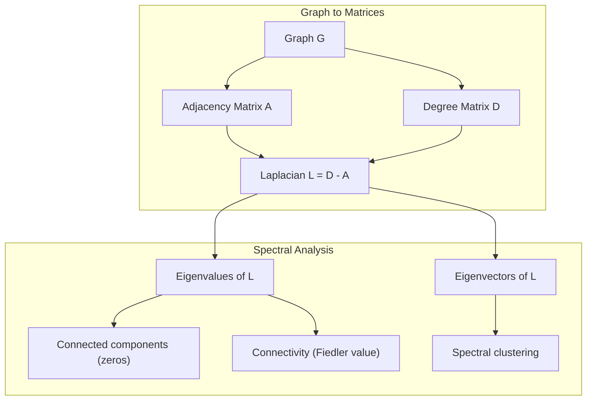
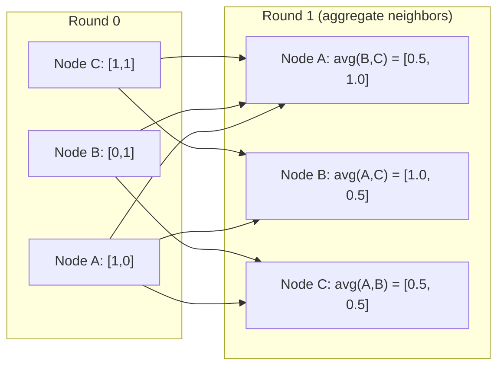

# Makine Öğrenimi Graf Teorisi

> Grafikler ilişkilerin veri yapısıdır. Eğer verileriniz bağlantılı ise, grafik teorisine ihtiyacınız var.
> 图是关系的数据结构―― eğer verileriniz bağlantılı ise, bir grafik gereklidir―

**Type:** Build | **类型:** 动手
**Language:**Python .**语言:**Python
**Prerequisites:** Phase 1, Lessons 01-03 (linear algebra, matrices) | **前置知识:** Phase 1, 第 01-03 课（线性代数、矩阵）
**Time:** ~90 minutes | **时间:** ~90 分钟

## Öğrenme hedefleri

- Yakınlık matrisi/list temsilleri ile bir grafik sınıfı oluşturun ve BFS ve DFS geçişleri uygulayın
  构建带有邻矩阵/列表表示的图类,实现 BFS 和 DFS 遍历
- Laplacian grafikini hesaplayın ve bağlantılı bileşenleri ve klüster düğümlerini tespit etmek için kendi değerlerini kullanın
  計算图拉普拉斯矩阵 (Graph Laplacian) ve özelliği değerini kullanıyor
- Normalleştirilmiş bitişiklik matrisi çarpımı olarak geçen GNN tarzı mesajın bir turunu uygulayın
  实现一轮 GNN 风格的消息传递归归归归归归归归归归邻矩阵乘法
- Bir grafiği Fiedler vektörü kullanarak bölmek için spektral gruplama uygulayın
  应用谱聚类(Spectral Clustering) Fiedler 向量划分图


> **【中文解读】**
> 社交网络、分子结构、知识图谱都是图──GNN'in mesajı mesajı özünde komşu matron çarpımı──谱聚类, K-Means'a göre küresel olmayan verilere daha uygun olan TÜLAPRAS matronun özellikleri ve boyutları topluluğuyla birlikte oluşur.

## Sorunlar. Sorunlar.

Sosyal ağlar, moleküller, bilgi tabanları, sitasyon ağları, yol hariteleri - hepsi grafikler. Geleneksel ML verileri düz tablolar gibi değerlendirir. Her satır bağımsızdır. Her özellik bir sütundur. Ama bağlantıların yapısı önemli olduğunda, tablolar başarısız olur.

> 社交网络、分子、知识库、引文网络、道路图都是图(Graph)  Traditional ML DATA will be viewed as 平表格──每行独立──每列 is a feature── ancak bağlantı yapısı önemli olduğunda,表格就失效──

Bir sosyal ağı düşünün. Bir kullanıcının hangi ürünü alacağını tahmin etmek istiyorsunuz. Alış tarihi önemli. Ama arkadaşlarının satın alma tarihi daha önemli. Bağlantılar sinyal taşıyor.

> 考虑社交网络――你想预测用户会买什么产品―― onların satın alma tarihi çok önemlidir――但他们朋友的购买历史更重要――连接带信号――

Ya da bir molekülü düşünün. Bir proteine bağlanıp bağlanmayacağını tahmin etmek istiyorsunuz. Atomlar önemli ama asıl önemli olan atomların birbirine nasıl bağlandığını.

> Ya da molekül düşünmek. Proteinlerle birleştiğini tahmin etmek istersin. Atom önemli, ama aslında önemli olan atomlar arasındaki bağın oluşumu.

Graf sinir ağları (GNN) derin öğrenme alanında en hızlı büyüyen alanlardır. İlaç keşfi, sosyal tavsiye, dolandırıcılık tespit ve bilgi grafi düşüncesini güçlendiriyorlar. Her GNN aynı temel üzerinde inşa edilir: temel grafi teorisi.

> 图神经网络 (GNN) derin öğrenim içinde en hızlı büyüyen alanlardır. Bunlar ilaç keşfini, sosyal önerileri, aldatmaca testleri ve bilgi çizelgesi önerileri yönlendirir.

Dört şeye ihtiyacın var:
1. Grafikleri matris olarak göstermenin bir yolu (onları çoğaltabilirsiniz)
   Bu şekilde, matron çarpı şeklini gösterir.
2. Graf yapısını keşfetmek için geçiş algoritmaları
   探索图结构的遍历算法
3. Laplakya -- spektral grafik teorisi'nde en önemli tek matris
   Raplas'ın matçı Spectre diagramı teorisi içinde en önemli matç
4. Mesaj geçiş - GNN'leri çalıştırmak için yapılan işlem
   消息传递使 GNN 工作的操作

## Konsepten bir şey.

> **【中文解读】**
> 图是关系的数据结构──社交网络中人是节点、关注是边;分子中原子是节点、化学键是边;知识图谱中实体是节点、关系是边──图神经网络 (GNN) 核操作消息传递本质上是邻属矩阵乘法──谱聚类图拉普拉斯矩阵的特征向量聚类──

> **【拓展：图神经网络在药物发现中的突破】**
> DeepMind'in AlphaFold2 (2020) ile neörolojik ağ tahmin protein 3D yapısı, sorunlu biyoloji dünyasında 50 yıllık protein çarpma sorunu çözüldü. Bu, amino acid kalanını bir çizgi noktası olarak, kalanın arasındaki uzay ilişkisini bir kenara olarak oluşturdu. CASP14  yarışmasında, AlphaFold2'in ortalama GDT oranı 92.4'e ulaştı.

### Grafikler: Kısımlar ve Kenarlar

Bir grafik G = (V, E) V ve E kenarlarından oluşan zirvelerden (nodlardan) oluşur. Her kenar iki düğmeyi birbirine bağlar.

> 图 G = (V, E) 由顶点(节点) V 和边 E 组成──每条边连接两个节点──

**Directed vs undirected.**Yönlendirilmemiş bir graftede, kenar (u, v) u v ile bağlantılıdır ve v u ile bağlantılıdır. Yönlendirilmiş bir graftede (digraft) kenar (u, v) u v'ye işaret eder, ancak mutlaka tersine değildir.

> **有向与无向。**Çekilme çizgisinde,边 (u, v) anlamı u 连接 v 且 v 连接 u──在有向图中,边 (u, v) anlamı u 指向 v,但反向不一定成立──

**Weighted vs unweighted.**Ağırlaştırılmamış bir grafikte kenarlar ya var ya da yok. Ağırlaştırılmış bir grafikte her kenarın sayısal bir ağırlığı vardır - bir mesafe, bir maliyet, bir güç.

> **加权与无权。**Üstün bir çizgi içinde, yan yan yan yan yan yan yan yan yan yan yan yan yan yan yan yan yan yan yan yan yan yan yan yan yan yan yan yan yan yan yan yan yan yan yan yan yan yan yan yan yan yan yan yan yan yan yan yan yan yan yan yan yan yan yan yan yan yan yan yan yan yan yan yan yan yan yan yan yan yan yan yan yan yan yan yan yan yan yan yan yan yan yan yan yan yan yan yan yan yan yan yan yan yan yan yan yan yan yan yan yan yan yan yan yan yan yan yan yan yan yan yan yan yan yan yan yan yan yan yan yan yan yan yan yan yan yan yan yan yan yan yan yan yan yan yan yan yan yan yan yan yan yan yan yan yan yan yan yan yan yan yan yan yan yan yan yan yan yan yan yan yan yan yan yan yan yan yan yan yan yan yan yan yan yan yan yan yan yan yan yan yan yan yan yan yan yan yan yan yan yan yan yan yan yan yan yan yan yan yan yan yan yan yan yan yan yan yan yan yan yan yan yan yan yan yan yan yan yan yan yan yan yan yan yan yan yan yan yan yan yan yan yan yan yan yan yan yan yan yan yan yan yan yan yan yan yan yan yan yan yan yan yan yan yan yan yan yan yan yan yan yan yan yan yan yan yan yan yan yan yan yan yan yan yan yan yan yan yan yan yan yan yan yan yan yan yan yan yan yan yan yan yan yan yan yan yan yan yan yan yan yan yan yan yan yan yan yan yan yan yan yan yan yan yan yan yan yan yan yan yan yan yan yan yan yan yan yan yan yan yan yan yan yan yan yan yan yan yan yan yan yan yan yan yan yan yan yan yan yan yan yan yan yan yan yan yan yan yan yan yan yan yan yan yan yan yan yan yan yan yan yan yan yan yan yan yan yan yan yan yan yan yan yan yan yan yan yan yan yan yan yan yan yan yan yan yan yan yan yan yan yan yan yan yan yan yan yan yan yan yan yan yan yan yan yan yan yan yan yan yan yan yan yan yan yan yan yan yan yan yan yan yan yan yan yan yan yan yan yan yan yan yan yan yan yan yan yan yan yan yan yan yan yan yan yan yan yan yan yan yan yan yan yan yan yan yan yan yan yan yan yan yan yan yan yan yan yan yan yan yan yan yan yan yan yan yan yan yan yan yan yan yan yan yan yan yan yan yan yan yan yan

| Graph type | Example |
|-----------|---------|
| Undirected, unweighted | Facebook friendship network |
| Directed, unweighted | Twitter follow network |
| Undirected, weighted | Road map (distances) |
| Directed, weighted | Web page links (PageRank scores) |

### Yakınlık Matrisi

A'nın bitişiklik matrisi çekirdek temsilidir. n düğümlü bir grafik için:

> 邻接矩阵(Ayacence Matrix) A ∈ A ∈ A ∈ A ∈ A ∈ A ∈ A ∈ A ∈ A ∈ A ∈ A ∈ A ∈ A ∈ A ∈ A ∈ A ∈ A ∈ A ∈ A ∈ A ∈ A ∈ A ∈ A ∈ A ∈ A ∈ A ∈ A ∈ A ∈ A ∈ A ∈ A ∈ A ∈ A ∈ A ∈ A ∈ A ∈ A ∈ A ∈ A ∈ A ∈ A ∈ A ∈ A ∈ A ∈ A ∈ A ∈ A ∈ A ∈ A ∈ A ∈ A ∈ A ∈ A ∈ A ∈ A ∈ A ∈ A ∈ A ∈ A ∈ A ∈ A ∈ A ∈ A ∈ A ∈ A ∈ A ∈ A ∈ A ∈ A ∈ A ∈ A ∈ A ∈ A ∈ A ∈ A ∈ A ∈ A ∈ A ∈ A   ∈ A       ∈ A                                                                                                                                                                                                                                                        

```
A[i][j] = 1    if there is an edge from node i to node j
A[i][j] = 0    otherwise
```

Yönlendirilmemiş grafikler için, A simetriktir: A[i][j] = A[j][i]. Ağırlaştırılmış grafikler için, A[i][j] = kenar ağırlığı (i, j).

> 对于无向图,A 是对称的:A[i][j] = A[j][i]。对于加权图,A[i][j] = 边 (i, j) 的权重──

**Example -- a triangle:**

```
Nodes: 0, 1, 2
Edges: (0,1), (1,2), (0,2)

A = [[0, 1, 1],
     [1, 0, 1],
     [1, 1, 0]]
```

A'daki matris işlemleri grafikteki işlemlere karşılık gelir.

> 隣接矩阵是每个 GNN 的输入──对 A 的矩阵运算对应于图上的操作──

> **【中文解读】**
> 邻近矩阵是图的"数字化表示"──A[i][j]=1 表示节点 i 和 j 之间有边──矩阵乘法的奇之处:A^2 的元素A^2[i][j]恰好等于从 i 到 j 长度为 2 的路径数──GNN'in mesajı aslında A 乘以特征矩阵每个节点聚合邻居的信息──

### Derece

Bir düğümün derecesi, ona bağlı olan kenarların sayısını gösterir. Yönlendirilmiş grafikler için, dereceden (girenler giren) ve dış dereceden (girenler çıkıp giden) vardır.

> 节点的度(Degree) 是连接到它的边数──对有向图,有入度(In-degree,进入的边) 和出度(Out-degree,出去的边)──

D derece matrisi diyagonaldir:

> 度矩阵(Degree Matrix) D =对角矩阵:

```
D[i][i] = degree of node i
D[i][j] = 0    for i != j
```

Üçgen örneği için: D = diag(2, 2, 2) çünkü her düğüm diğer iki düğüme bağlanır.

Derece, düğüm önemi hakkında size bilgi verir. Yüksek derece = merkez düğümü. Bir ağın derece dağılımı yapısını ortaya çıkarır. Sosyal ağlar güç yasalarını izler (beçik merkezler, birçok yaprak düğümü).

> 库告诉你节点的重要性──高度 = 枢纽节点──网络的度分布揭露其结构──社交网络遵循律──少数枢纽,大量叶节点──随机图的度从泊松分布──

### BFS ve DFS

İki temel grafik geçiş algoritması. İkisine de ihtiyacınız var.

> İki temel algoritma vardır.

**Breadth-First Search (BFS):**Önce komşuları araştırın, sonra komşu komşularını.

> **广度优先搜索（BFS）：**Önce tüm komşuları araştırın, sonra komşuların komşularını.

```
BFS from node 0:
  Visit 0
  Queue: [1, 2]        (neighbors of 0)
  Visit 1
  Queue: [2, 3]        (add neighbors of 1)
  Visit 2
  Queue: [3]           (neighbors of 2 already visited)
  Visit 3
  Queue: []            (done)
```

BFS, ağırlıksız grafiklerde en kısa yolları bulur. Başlangıçtan herhangi bir düğümye kadar olan mesafe, bu düğümün ilk keşfedilen BFS seviyesine eşittir. Bu nedenle BFS sosyal ağlarda hop-sayım mesafeleri için kullanılır.

> BFS, bir çizimdeki en kısa yolu bulur. Baş noktalardan herhangi bir düğümün mesafesinin, bu düğümün ilk keşfedildiği sırada BFS seviyesine eşit olmasıdır.

**Depth-First Search (DFS):**Geriye dönmeden önce mümkün olduğunca derinlere git.

> **深度优先搜索（DFS）：**尽可能深入再回溯──使用(后进先出) 或递归──

```
DFS from node 0:
  Visit 0
  Stack: [1, 2]        (neighbors of 0)
  Visit 2               (pop from stack)
  Stack: [1, 3]         (add neighbors of 2)
  Visit 3               (pop from stack)
  Stack: [1]
  Visit 1               (pop from stack)
  Stack: []             (done)
```

DFS:
- Bağlı bileşenleri bulmak (gelenmeyen düğümlerden DFS çalıştırmak)
  寻找连通分量(从未访问节点运行 DFS)
- DFS ağacında döngü tespit (Arka kenarları)
  环检测(DFS 树中的后向边)
- Topolojik sıralama (DFS son sırası tersine)
  拓排序(DFS 完成顺序的逆序)

| Algorithm | Data structure | Finds | Use case |
|-----------|---------------|-------|----------|
| BFS | Queue | Shortest paths | Social network distance, knowledge graph traversal |
| DFS | Stack | Components, cycles | Connectivity, topological sort |

### Grafik Laplakyan

L = D - A. Spektral grafik teorisi'nde en önemli matris.

> L = D - A──谱图理论中最重要的矩阵──

Üçgen için:

```
D = [[2, 0, 0],    A = [[0, 1, 1],    L = [[2, -1, -1],
     [0, 2, 0],         [1, 0, 1],         [-1, 2, -1],
     [0, 0, 2]]         [1, 1, 0]]         [-1, -1,  2]]
```

Laplakya'nın dikkat çekici özellikleri vardır:

> Raplas'ın sıradan bir özelliği vardır:

1. **L is positive semi-definite.**Tüm öz değerleri >= 0'dur.

> 1. **L 是半正定的。**Tüm özellikler değer >= 0

2. **The number of zero eigenvalues equals the number of connected components.**Bağlı bir grafik tam olarak bir sıfır öz değere sahiptir. 3 bağlantısız bileşenli bir grafik üç sıfır öz değere sahiptir.

> 2. **零特征值的个数等于连通分量的个数。**连通图恰好有一个零特征值──有3 连通分数图有3零特征值──

3. **The smallest non-zero eigenvalue (Fiedler value) measures connectivity.**Büyük Fiedler değeri, grafikin iyi bağlantılı olduğunu, küçük Fiedler değeri ise grafikin zayıf bir noktası olduğunu, bir şişek boynuzuna sahip olduğunu gösterir.

> 3. **最小非零特征值（Fiedler 值）衡量连通性。**Fiedler 值大 图 连接好 ‧ Fiedler 值小 图有弱点 瓶──

4. **The eigenvector of the Fiedler value (Fiedler vector) reveals the best split.**Pozitif değerli düğümler bir grupta, negatif değerli düğümler diğer grupta gider.

> 4. **Fiedler 值对应的特征向量（Fiedler 向量）揭示最佳划分。**Normal değerin noktaları bir grup, negatif değerlerin diğer gruplara katılır.

> **【中文解读】**
> 图拉普拉斯 L = D - A 谱图 kuramında en önemli矩阵dır. Onun dört anahtar özelliği vardır: 1) 半正定; 2) 零特征值个数 = 连通分量个数; 3) 最小非零特征值 Fiedler 值) 连通性越大越紧的测量; 4) Fiedler 向量的正负号自动将图分成两──这是谱聚类的数学基础──



### Spektral Özellikler

Yakınlık matrisinin ve Laplakistan'ın öz değerleri herhangi bir geçiş olmadan yapısal özellikleri ortaya çıkarır.

> Komşu matron ve Lapras matronlarının özellik değerleri yapısal özellikleri ortaya çıkarabilmesi için geçilmeye gerek yoktur.

**Spectral clustering**Bu şekilde çalışır:
1. Laplak L'yi hesaplayın
   计算拉普拉斯矩阵 L
2. L'nin k en küçük öz vektörlerini bul (birincisi atlayın, bu bağlantılı grafikler için tüm-birler)
   找到 L'in k 个最小特征向量(跳过第一个,连通图中它是全1向量)
3. Bu öz vektörleri her düğüm için yeni koordinatlar olarak kullanın
   Bu özellikleri her düğümün yeni bir simgesi olarak kullanmak.
4. K- ortalamaları bu koordinatlarda çalıştır
   Bu yolculukların k-mahası

Bu neden çalışır? L'nin özvektorları grafikteki "en ince" fonksiyonları kodlar. İyi bağlantılı düğümler benzer özvektor değerlerini alır. Botluk boynuzıyla ayrılmış düğümler farklı değerler alır. Özvektorlar doğal olarak kümeleri ayırır.

> Neden geçerli?L'nin özellik vektörleri, çizelgedeki "en düz" işleviyi kodlar. İyi bağlantı nodu benzer özellik vektör değerlerini elde eder.

**Random walk connection.**Normalleştirilmiş Laplakyan, grafikte rastgele yürüyüşlerle ilgilidir. rastgele yürüyüşün sabit dağılımı düğüm derecesine orantılıdır. Karıştırma zamanı ( yürüyüşün ne kadar hızlı bir şekilde yakınlaşması) spektral boşluğu üzerine bağlıdır.

> **随机游走联系。**归结拉普拉斯与图上的随机游走有关──随机游走的平稳分布与节点度成正比──混合时间收速度) 取决于谱间隙光谱差 (spectral gap) ‖

### Mesaj Geçiriliyor

Graf Sinir Ağlarının temel işlevi. Her düğüm komşularından mesajlar toplar, onları toplar ve kendi durumunu güncelleyebilir.

> 图神经网络的核心操作──每个节点从邻居收集信息,聚聚它们,并更新自己的状态──

```
h_v^(k+1) = UPDATE(h_v^(k), AGGREGATE({h_u^(k) : u in neighbors(v)}))
```

En basit biçimde, AGGREGATE = ortalama ve UPDATE = doğrusal dönüşüm + etkinleştirme:

```
h_v^(k+1) = sigma(W * mean({h_u^(k) : u in neighbors(v)}))
```

Bu, maskeli matris çarpımıdır. Eğer H tüm düğüm özelliklerinin matrisidir ve A bitişiklik matrisidirse:

```
H^(k+1) = sigma(A_norm * H^(k) * W)
```

A_norm normalleştirilmiş bitişiklik matrisidir (her satır 1'e kadar tutar).

Bir mesaj geçiş turunda her düğüm yakın komşularını "gör" sağlar. İki turda komşu komşuları görmesine izin verir. K turları her düğümde K-hop komşularından bilgi verir.

> **【拓展：消息传递与 GNN 架构演进】**
> GCN (Kipf & Welling, 2017) en basit mesaj ileti GNN: her katman bir kez birleştirilmiş komşu矩阵乘法 + 线性变换――GAT (Veličković et al., 2018) 引入注意力机制让节点学习邻居的重要性权重――GraphSAGE (Hamilton et al., 2017) 支持采样邻居以处理大规模图――Pinterest'ın PinSage 模型在30亿节点图上运行,每天产生超过10亿次推──GNN, en hızlı büyüyen AI 子领域之一──



### Anlaşmalar ve ML Uygulamaları

| Concept | ML Application |
|---------|---------------|
| Adjacency matrix | GNN input representation |
| Graph Laplacian | Spectral clustering, community detection |
| BFS/DFS | Knowledge graph traversal, path finding |
| Degree distribution | Node importance, feature engineering |
| Message passing | GNN layers (GCN, GAT, GraphSAGE) |
| Eigenvalues of L | Community detection, graph partitioning |
| Spectral clustering | Unsupervised node grouping |
| PageRank | Node importance, web search |

> 概念与 ML 应用对照:邻接矩阵(GNN 输入表示) 图拉普拉斯(谱聚类、社区检测) 、BFS/DFS(知识图谱遍历、路径查找) 度分布(节点重要性、特征工程) 、消息传递(GNN 层 GCN/GAT/GraphSAGE) 、L 的特征值(社区检测聚图、划分) 、谱类(无监督节点分组) 、PageRank(节点重要性、Web 搜索) ⋅

## Yapın.
```figure
graph-degree-distribution
```

## Yapın

### Adım 1: Graf sınıfı sıfırdan

```python
class Graph:
    def __init__(self, n_nodes, directed=False):
        self.n = n_nodes
        self.directed = directed
        self.adj = {i: {} for i in range(n_nodes)}

    def add_edge(self, u, v, weight=1.0):
        self.adj[u][v] = weight
        if not self.directed:
            self.adj[v][u] = weight

    def neighbors(self, node):
        return list(self.adj[node].keys())

    def degree(self, node):
        return len(self.adj[node])

    def adjacency_matrix(self):
        import numpy as np
        A = np.zeros((self.n, self.n))
        for u in range(self.n):
            for v, w in self.adj[u].items():
                A[u][v] = w
        return A

    def degree_matrix(self):
        import numpy as np
        D = np.zeros((self.n, self.n))
        for i in range(self.n):
            D[i][i] = self.degree(i)
        return D

    def laplacian(self):
        return self.degree_matrix() - self.adjacency_matrix()
```

Etraflılık listesine (`self.adj`Bu nedenle, komşuları etkin bir şekilde depolar.

> 邻接表(`self.adj`) Yüksek verimlilik depolama komşu. Komşu.

### Adım 2: BFS ve DFS

```python
from collections import deque

def bfs(graph, start):
    visited = set()
    order = []
    distances = {}
    queue = deque([(start, 0)])                     # BFS 用队列：先进先出
    visited.add(start)
    while queue:
        node, dist = queue.popleft()                # 取出队列头部的节点
        order.append(node)
        distances[node] = dist                      # 距离 = BFS 层级（最短路径）
        for neighbor in graph.neighbors(node):
            if neighbor not in visited:
                visited.add(neighbor)
                queue.append((neighbor, dist + 1))  # 邻居距离 +1
    return order, distances


def dfs(graph, start):
    visited = set()
    order = []
    stack = [start]
    while stack:
        node = stack.pop()
        if node in visited:
            continue
        visited.add(node)
        order.append(node)
        for neighbor in reversed(graph.neighbors(node)):
            if neighbor not in visited:
                stack.append(neighbor)
    return order
```

BFS, O(1) pop sol için bir deque (iki uçlı kuyruk) kullanır. DFS bir listeyi bir yığın olarak kullanır. Her iki düğümde tam olarak bir kez ziyaret eder - O(V + E) zaman.

> BFS 用 deque(双端队列) gerçekleştirmek O(1) popleft;DFS 用 list 当──两者都恰好访问每个节点一次时间复杂度 O(V+E)。

### Adım 3: Bağlı bileşenler ve Laplak öz değerleri

```python
def connected_components(graph):
    visited = set()
    components = []
    for node in range(graph.n):
        if node not in visited:
            order, _ = bfs(graph, node)
            visited.update(order)
            components.append(order)
    return components


def laplacian_eigenvalues(graph):
    import numpy as np
    L = graph.laplacian()
    eigenvalues = np.linalg.eigvalsh(L)
    return eigenvalues
```

`eigvalsh`Laplakya'nın, yönlendirilmemiş grafikler için her zaman simetrik olduğu için simetrik matrisler için.

> `eigvalsh`Rektörün                                                                                                                                                                                                                                                             

### 4. Adım: Spektral gruplama

```python
def spectral_clustering(graph, k=2):
    import numpy as np
    L = graph.laplacian()                           # 计算图拉普拉斯矩阵 L = D - A
    eigenvalues, eigenvectors = np.linalg.eigh(L)   # 特征分解（对称矩阵用 eigh）
    features = eigenvectors[:, 1:k+1]               # 取第 2 到 k+1 个特征向量（跳过第一个全 1 向量）

    labels = np.zeros(graph.n, dtype=int)
    for i in range(graph.n):
        if features[i, 0] >= 0:                     # Fiedler 向量 >= 0 → 簇 A
            labels[i] = 0
        else:                                       # Fiedler 向量 < 0 → 簇 B
            labels[i] = 1
    return labels
```

Fiedler vektörünün işaretinin k=2 için grafiği iki kümeye ayırması gerekir. k>2 için ilk k öz vektörlerinde k- ortalamaları çalıştırırsınız (büyük tüm-bir öz vektör hariç).

> K=2 时,Fiedler 向量的符号把图分成两──k>2 时,在前 k 个特征向量上跑 k-means (跳过平凡的全1特征向量) ⋅

### Adım 5: Mesaj aktarılıyor

```python
def message_passing(graph, features, weight_matrix):
    import numpy as np
    A = graph.adjacency_matrix()
    row_sums = A.sum(axis=1, keepdims=True)
    row_sums[row_sums == 0] = 1
    A_norm = A / row_sums
    aggregated = A_norm @ features
    output = aggregated @ weight_matrix
    return output
```

Bu, GNN mesajının bir turundan geçer. Her düğümün yeni özellikleri, ağırlık matrisi ile dönüştürülen komşu özelliklerinin ağırlıklı ortalamasıdır.

> Bu GNN haber aktarımının bir döngüsüdür. Her bir noktadan yeni özellikler = komşu özelliklerinin artış oranı × ıkıtlılık rütbesi.

## Çerçeveyi kullanın.

Networkx ve numpy ile aynı işlemler tek satırlı:

> Netwerkx ve Numpy ile aynı işlem bir kod:

```python
import networkx as nx
import numpy as np

G = nx.karate_club_graph()

A = nx.adjacency_matrix(G).toarray()
L = nx.laplacian_matrix(G).toarray()

eigenvalues = np.linalg.eigvalsh(L.astype(float))
print(f"Smallest eigenvalues: {eigenvalues[:5]}")
print(f"Connected components: {nx.number_connected_components(G)}")

communities = nx.community.greedy_modularity_communities(G)
print(f"Communities found: {len(communities)}")

pr = nx.pagerank(G)
top_nodes = sorted(pr.items(), key=lambda x: x[1], reverse=True)[:5]
print(f"Top 5 PageRank nodes: {top_nodes}")
```

networkx, optimize edilmiş C arka planları ile herhangi bir boyutdaki grafikleri işliyor.

> Networkx, optimize edilmiş C 后端'ı kullanarak herhangi bir küçük resim işlemeyi yapar.

### Numpy spektral analizi

```python
import numpy as np

A = np.array([
    [0, 1, 1, 0, 0],
    [1, 0, 1, 0, 0],
    [1, 1, 0, 1, 0],
    [0, 0, 1, 0, 1],
    [0, 0, 0, 1, 0]
])

D = np.diag(A.sum(axis=1))
L = D - A

eigenvalues, eigenvectors = np.linalg.eigh(L)
print(f"Eigenvalues: {np.round(eigenvalues, 4)}")
print(f"Fiedler value: {eigenvalues[1]:.4f}")
print(f"Fiedler vector: {np.round(eigenvectors[:, 1], 4)}")

fiedler = eigenvectors[:, 1]
group_a = np.where(fiedler >= 0)[0]
group_b = np.where(fiedler < 0)[0]
print(f"Cluster A: {group_a}")
print(f"Cluster B: {group_b}")
```

Fiedler vektörü ağır yüklenmeyi yapar. Bir küme pozitif girişler, diğerinde negatif girişler. İteratif optimizasyon gerekmez. Sadece bir özde kompozisyon.

## İndirin . Ürünler .

Bu ders şunları ortaya çıkarır:
- `outputs/skill-graph-analysis.md`-- grafik yapılı verileri analiz etmek için bir beceri referansı

## Bağlantılar kavramı

| Concept | Where it shows up |
|---------|------------------|
| Adjacency matrix | GCN, GAT, GraphSAGE input |
| Laplacian | Spectral clustering, ChebNet filters |
| BFS | Knowledge graph traversal, shortest path queries |
| Message passing | Every GNN layer, neural message passing |
| Spectral gap | Graph connectivity, mixing time of random walks |
| Degree distribution | Power-law networks, node feature engineering |
| Connected components | Preprocessing, handling disconnected graphs |
| PageRank | Node importance ranking, attention initialization |

GNN'ler özel bir değinime layık. GCN'deki grafik konvulsiyon işlevi (Kipf & Welling, 2017) A_hat = A + I:

```text
H^(l+1) = sigma(D_hat^(-1/2) * A_hat * D_hat^(-1/2) * H^(l) * W^(l))
```

A_hat = A + I (ekşilik artı kendi-süküller) ve D_hat A_hat'ın dereceleri matrisidir. Kendi kendini oluşturan döngüler, her düğümün toplanma sırasında kendi özelliklerini içerdiğini sağlar. Bu tam olarak simetrik normallaşımla geçen mesaj. D_hat^(-1/2) * A_hat * D_hat^(-1/2) normalleştirilmiş bitişiklik matrisidir. Laplakyan ortaya çıkıyor çünkü bu normallaşma L_sym = I - D^(-1/2) * A * D^(-1/2) ile ilişkilidir. Laplakya'yı anlamak, GCN'lerin neden çalıştığını anlamak demektir.

> GNN 值得特别说明──GCN(Kipf & Welling, 2017) 图卷积用加了自环的邻属矩阵 A_hat = A + I:H^(l+1) = σ(D_hat^(-1/2) A_hat D_hat^(-1/2) H^(l) W^(l))──自环让每个节点聚合时包含自身特征──这就是对称归结的消息传递──理解拉普拉斯阵 =理解 GCN 为何有效──

## Egzersizler.

1. **Implement PageRank from scratch.**Her adımda: skor(v) = (1-d) /n + d * toplam(score(u) /out_degree(u)) için v'ye işaret eden tüm u için. d=0.85 kullanın.

2. **Find communities using spectral clustering.**İki açıkça ayrılmış kümelerle bir grafik oluşturun (örneğin, tek bir kenar ile bağlantılı iki klik). Spektral kümeler çalıştırın ve doğru bölünmeyi bulduğunu kontrol edin.

3. **Implement Dijkstra's algorithm**Boşluklı grafiklerde en kısa yollar için.

4. **Build a 2-layer message passing network.**Farklı ağırlık matrisleri ile iki kez mesaj geçirme uygulayın. 2 turdan sonra her düğümün 2 hop komşusundan bilgi olduğunu gösterin.

5. **Analyze a real-world graph.**Karate Kulübü grafikini kullanın (34 düğüm, 78 kenar). Derece dağılımını, Laplakya öz değerlerini ve spektral kümeler oluşturmayı hesaplayın.

## Anahtar Şartlar .

| Term | What people say | What it actually means |
|------|----------------|----------------------|
| Graph | "Nodes and edges" | A mathematical structure G=(V,E) encoding pairwise relationships |
| Adjacency matrix | "The connection table" | An n x n matrix where A[i][j] = 1 if nodes i and j are connected |
| Degree | "How connected a node is" | The number of edges touching a node |
| Laplacian | "D minus A" | L = D - A, the matrix whose eigenvalues reveal graph structure |
| Fiedler value | "The algebraic connectivity" | The smallest non-zero eigenvalue of L, measuring how well-connected the graph is |
| BFS | "Level-by-level search" | Traversal that visits all neighbors before going deeper, finds shortest paths |
| DFS | "Go deep first" | Traversal that follows one path to its end before backtracking |
| Message passing | "Nodes talk to neighbors" | Each node aggregates information from its neighbors, the core of GNNs |
| Spectral clustering | "Cluster by eigenvectors" | Partition a graph using eigenvectors of its Laplacian |
| Connected component | "A separate piece" | A maximal subgraph where every node can reach every other node |

> 术语速查:Graph(图 G=(V,E))、Adjacency matrix(邻接矩阵 A[i][j]=1 表示 i、j 连接)、Degree(度,节点连接的边数)、Laplacian(拉普拉斯 L=D-A)、Fiedler value(最小非零特征值,代数连通性)、BFS(广度优先,按层遍历)、DFS深度 priority,走到底再回溯)、Message passing(消息传递,GNN 核心)、Spectral clustering using拉普拉斯特征向量聚类)、Connected component(连通量)、

## Daha fazla okumak

- **Kipf & Welling (2017)**-- "Grafik Konvolyasyon Ağları ile Yarım Denetimli Sınıflandırma". Modern GNN'leri başlatan makale. Spektral grafik konvolyasyonlarının mesaj geçişini basitleştirdiğini gösterir.
- **Spielman (2012)**-- "Spektral Graf Teorisi" ders notları. Laplaklar, spektral boşluklar ve grafik bölünmesi hakkında kesin bir giriş.
- **Hamilton (2020)**-- "Grafik Temsil Öğrenimi". GNN'leri temellerden uygulamalara kadar kapsar.
- **Bronstein et al. (2021)**-- "Jometri Derin Öğrenimi: Gridler, Gruplar, Grafikler, Jeodetik ve Ölçüler".
- **Veličković et al. (2018)**- "Grafik Dikkat Ağları".
