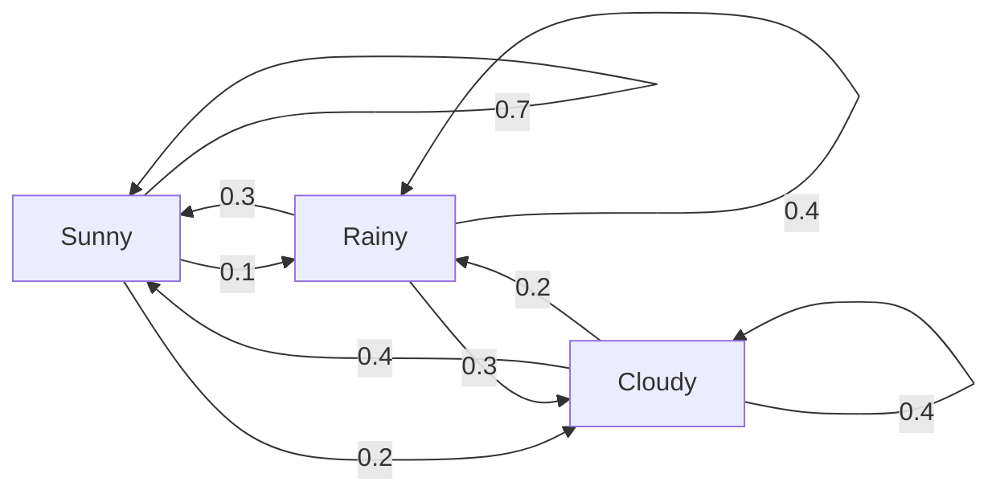
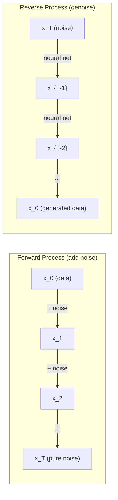

# Stochastic Processlar.

> Rastgele yürüyüşlerin, Markov zincirlerinin ve difüzyon modellerinin arkasındaki matematik.
> Yapısal rastlantı var.

**Type:** Learn | **类型:** 学习
**Language:**Python .**语言:**Python
**Prerequisites:** Phase 1, Lessons 06-07 (probability, Bayes) | **前置知识:** Phase 1, 第 06-07 课（概率、贝叶斯）
**Time:** ~75 minutes | **时间:** ~75 分钟

## Öğrenme hedefleri

- 1D ve 2D rastgele yürüyüşleri simüle edin ve yer değiştirme oranını doğrulayın
  模拟一维和二维随机游走,验证位移的 √n 缩放规律
- Markov zinciri simülatörü oluşturun ve kendi kompozisyon yoluyla sabit dağılımını hesaplayın
  Markova zinciri simülatörü oluşturmak, özellikleri çözmek ile hesaplama düz dağılım
- Metropolis-Hastings MCMC ve Langevin dinamiklerini hedef dağıtımlardan örnek almak için uygula
  实现 Metropolis-Hastings MCMC 和 Langevin 动力学, from target distribution中采样
- Önceki difüzyon sürecini Brownian hareketi ile bağlayın ve ters süreçten veri nasıl üretildiğini açıklayın
  Ön yönlü yayılma sürecini Browning hareketi ile bağlamak, ters yönlü süreçlerin veriyi nasıl ürettiğini açıklamak


> **【中文解读】**
> 随机过程是有结构的随机性――马尔可夫链( mevcut durum sadece ön adımdan bağlıdır) PageRank'in temelidir―― yayılma modelinin ön yönü, 布朗运动 (Bran)  (Göyük Ses)  (Göyük Ses)  (Göyük Ses)  (Göyük Ses)  (Göyük Ses)  (Göyük Ses)  (Göyük Ses)  (Göyük Ses)  (Göyük Ses)  (Göyük Ses)  (Göyük Ses)  (Göyük Ses)  (Göyük Ses)  (Göyük Ses)  (Göyük Ses)  (Göyük Ses)  (Göyük Ses)  (Göyük Ses)  (Göyük Ses)  (Göyük Ses)  (Göyük Ses)  (Göyük Ses)  (Göyük Ses)  (Göyük Ses)  (Göyük Ses)  (Göyük Ses)  (Göyük Ses)  (Göyük Ses)  (Göyük Ses)  (Göyük)  (Göyük)  (Göyük Seek)  (Göyük)  (Göyük)  (Göyük)  (Göyük)  (Göyük)  (Göyük)  (Göyük)  (Göyük)

## Sorunlar. Sorunlar.

Birçok AI sistemi zamanla gelişen rastlantıyı içerir. Statik rastlantıyı değil, her adımın daha önce gelenlere bağlı olduğu yapılandırılmış, sıralı rastlantıyı.

> Birçok AI sistemi zamanla gelişen bir rastlantıya bağlıdır. Statik bir rastlantı değil, yapılı bir sıralanma rastlantısı.

Dil modelleri bir seferde birer token oluşturur. Her token önceki bağlamdan bağlıdır. Model bir olasılık dağılımını, örnekleri çıkarır ve ilerler. Bu bir stohastik süreçtir.

> 语言模型个别生成代币――每个代币依赖于之前的上下文――模型输出一个概率分布,从中采样,然后继续――这是随机过程――

Diffusion modelleri saf statik olana kadar bir görüntüye adım adım gürültü ekler. Sonra da süreci tersine çevirirler, yeni bir görüntü ortaya çıkana kadar adım adım denetler. Önüme giden süreç Markov zinciridir. Geriye giden süreç, geriye giden öğrenilmiş bir Markov zinciridir.

> 扩散模型逐步向图像添加噪音,直到变成纯静态──然后反转过程,逐步去噪音,直到新图像出现──前向过程是马尔可夫链,反向过程是学习的反向马尔可夫链──

Bir ortamda güçlendirme öğrenme ajanları eylemler yapar. Her eylem bir olasılık ile yeni bir duruma yol açar. Bir rastgele dünyada rastgele bir politika izler. Tüm şey bir Markov karar süreci.

> 强化学习智能体在环境中执行动作──每个动作以一定概率导致新状态──智能体在随机世界中随机策略──整个系统是马尔可夫决策过程──MDP

MCMC örneklemesi Bayesian sonuçlarının omurgası, Markov zincirini oluşturur.

> MCMC'nin temel taşı, bir Markov zinciri oluşturmak için bir temel taş oluşturur.

Bunların hepsi dört temel fikir üzerine kuruluyor:
1. Rastgele yürüyüşler -- en basit stohastik süreç
2. Markov zincirleri -- geçiş matrisi ile yapılandırılmış rastlantı
3. Langevin dinamikleri - gürültü ile gradient düşüşü
4. Metropolis-Hastings - herhangi bir dağıtımdan örnek almak

> Tüm bunlar dört temel kavram üzerine kurulmuştur: 1. 随机游走最简单随机过程; 2. 马尔可夫链带转移矩阵的结构化随机性; 3. Langevin 动力学带噪声的梯度下降; 4. Metropolis-Hastings任意分布中采样;

## Konsepten bir şey.

### - Rastgele Yürüyüşler

0 pozisyonundan başlayın. Her adımda adil bir madeni para atın. Başlar: sağ (+1) hareket et. Kuyruklar: sola (-1) hareket et.

> Yerden 0 開始── her adım bir adil sikke atıyor──正面:向右 (+1)──反面:向左 (-1)──

N adımdan sonra pozisyonunuz n rastgele +/-1 değerlerinin toplamıdır. Beklenen pozisyon 0 (yolculuk tarafsızdır).

> n 步后, yeriniz n 个随机 ±1 值的求和――期望位置为 0(游走无偏), ancak başlangıç noktasının beklenen mesafesine göre √n 增︎

Bu mantıklı değil. Yürüyüş adil - her iki yönde de sürüklenmez. Ama zamanla, başladığı yerden gittikçe daha da uzaklaşır. n adımdan sonra standart sapma n'dir.

> Bu bir nokta karşı doğrusudur. Bu yolculuk adil bir yolun iki yönünde hareket etmemektedir. Ama zaman geçtikçe, başlangıç noktasından giderek daha uzaklaşıyor.

```
Step 0:  Position = 0
Step 1:  Position = +1 or -1
Step 2:  Position = +2, 0, or -2
...
Step 100: Expected distance from origin ~ 10 (sqrt(100))
Step 10000: Expected distance from origin ~ 100 (sqrt(10000))
```

**In 2D**Bu yol, aynı olasılık ile yukarı, aşağı, sola veya sağa hareket eder.

> **二维情况下**, √n √n √n √n √n √n √n √n √n √n √n √n √n √n √n √n √n √n √n √n √n √n √n √n √n √n √n √n √n √n √n √n √n √n √n √n √n √n √n √n √n √n √n √n √n √n √n √n √n √n √n √n √n √n √n √n √n √n √n √n √n √n √n √n √n √n √n √n √n √n √n √n √n √n √n √n √n √n √n √n √n √n √n √n √n √n √n √n √n √n √n √n √n √n √n √n √n √n √n √n √n √n √n √n √n √n √n √n √n √n √n √n √n √n √n √n √n √n √n √n √n √n √n √n √n √n √n √n √n √n √n √n √n √n √n √n √n √n √n √n √n √n √n √n √n √n √n √n √n √n √n √n √n √n √n √n √n √n √n √n √n √n √n √n √n √n √n √n √n √

**Why sqrt(n)?**Her adım eşit olasılıkla +1 veya -1'dir. N adımdan sonra, S_n = X_1 + X_2 + ... + X_n konumunda her X_i +/-1. Her adımın varyansi 1'dir ve adımlar bağımsızdır, bu nedenle Var(S_n) = n. Standart sapma = sqrt(n. Merkez sınır teoremi ile S_n / sqrt(n) standart normal bir dağılım ile birleşti.

> **为什么是 √n？**Her adım farklılığı 1, adım bağımsız olarak var, bu yüzden Var(S_n) = n, standart farklılık = √n。由中心极限定理,S_n/√n 收到标准正态分布。

Bu sqrt(n) ölçekleme ML'de her yerde görünür. SGD gürültü ölçekleri 1/sqrt(batch_size olarak.

> √n 缩放放置在 ML 中无处不在──SGD 噪音按1/√(batch_size) 缩放,嵌入维度按√d 缩放──平方根是独立随机叠加的标志──

**Connection to Brownian motion.**Adım boyutu 1/sqrt(n) ve n adımları birim zaman ile rastgele bir yürüyüş yapın. n sonsuzluğa giderken yürüyüş Brownian hareketi B(t) - B(t) normalde ortalama 0 ve varyansa t ile dağılmış olan bir sürekli zaman süreci olarak birleşti.

> **与布朗运动的联系。**取步长 1/√n、每单位时间 n 步的随机游走──当 n → ∞ 时,游走收到布朗运动 B(t) 一个连续时间过程,B(t) ~ N(0, t) ・・・

Brownian hareketi, difüzyonun matematiksel temelidir. Bir sıvıdaki parçacıkların rastgele titreşimini, hisse senet fiyatlarının dalgalanmasını ve - en önemlisi - difüzyon modellerinde gürültü sürecini modellemektedir.

> Brown Hareketi, yayılma modelinin matematiksel temelidir. Bu, akımdaki parçacıkların aksamlı hareketlerini, hisse senedi fiyatlarının hareketlerini ve yayılma modelindeki en önemli gürültü sürecini anlatır.

**Gambler's ruin.**0 ve N'de absorber engellerle, k pozisyonundan başlayan rastgele yürüyüşçü. 0'dan önce N'ye ulaşma olasılığı nedir?

> **赌徒破产问题。**0 ve N'de                                                                                                                                                                                                                                                             

### Markov Zincirleri

Markov zinciri, sabit olasılıklara göre eyaletler arasında geçiş yapan bir sistemdir. Ana özellik: bir sonraki devlet sadece tarihte değil, mevcut durumda bağlıdır.

> Markov zinciri, sabit olasılıkla durumlar arasında geçiş yapan bir sistemdir.

```
P(X_{t+1} = j | X_t = i, X_{t-1} = ...) = P(X_{t+1} = j | X_t = i)
```

Bu Markov özelliği. Tüm dinamikleri geçiş matrisi P ile tanımlayabilirsiniz:

> Bu da Markov'un doğası. Yani tüm hareketleri tarif etmek için P'yi kullanmak gerekir.

```
P[i][j] = probability of going from state i to state j
```

P'nin her satırı 1'e denk gelir (bir yere gitmelisin).

> P'nin her satırı ve 1 için.

**Example -- Weather:**

> **示例——天气：**

```
States: Sunny (0), Rainy (1), Cloudy (2)

P = [[0.7, 0.1, 0.2],    (if sunny: 70% sunny, 10% rainy, 20% cloudy)
     [0.3, 0.4, 0.3],    (if rainy: 30% sunny, 40% rainy, 30% cloudy)
     [0.4, 0.2, 0.4]]    (if cloudy: 40% sunny, 20% rainy, 40% cloudy)
```

Herhangi bir durumdan başlayın. Birçok geçişten sonra durumların dağılımı pi * P = pi olduğu sabit dağılım pi'ye yaklaşıyor. Bu, P'nin öz değerine sahip sol öz vektörüdür.

> İstediği bir durumdan başlayarak, yeterince fazla bir dönüşümden sonra, durum dağılımının alınması, düz bir dağılım pi'ye ulaşır, satis π·P = π── bu P'nin özellik değeri 1'in sol özellik yönü olarak görülür.

Hava zinciri için, sabit dağılım [0.53, 0.18, 0.29] olabilir. Uzun vadede, başlangıç durumundan bağımsız olarak, zamanın % 53'ünde güneşli olur.
Hava zinciri için, sabit dağılım [0.55, 0.18, 0.27] -- uzun vadede, başlangıç durumundan bağımsız olarak, zamanın %55'inde güneşli.

> Hava zinciri için, düz düz dağılım mümkün olan [0.53, 0.18, 0.29]  uzun süreli olarak 53%'nin zamanlı olarak değişmesi, başlangıç durumuna bağlı değildir.



**Computing the stationary distribution.**İki yaklaşım vardır:

1. **Power method**Bu da bir dizi farklılıktan sonra, bir dizi farklılıktan sonra, birbiriyle bir araya gelir.
2. **Eigenvalue method**: P'nin sol öz vektörünü öz değeri 1 ile bul. Bu, P^T'nin öz vektörünü öz değeri 1 ile bulur.

> **计算平稳分布。**İki yöntem: 1.**幂法**:反复任意初始分布乘P,足足多次后收──2. **特征值法**:P'nin özellik değerini 1'in sol özellik yönü olarak arayın (yani P^T'nin özellik değerini 1'in sağ özellik yönü olarak arayın)

Her iki yaklaşım da zincirin konverjense koşullarını karşılamasını gerektirir.

> İki yöntem de karşılama koşullarını karşılamayı gerektirir.

**Convergence conditions.**Bir Markov zinciri, eğer:
- **Irreducible**Her eyalete diğer eyaletlerden ulaşılabilir.
- **Aperiodic**: zincir belirli bir süreyle döngülenmez

> **收敛条件。**                                                                                                                                                                                                                                                              **不可约**(her bir devlet diğer devletlerden gelebilir);**非周期**(Şebekeler sabit döngü döngüsünde gerçekleşmeyecek)

ML'de karşılaştığınız zincirlerin çoğu her iki şartı da karşılar.

> ML'de karşılaştığınız çoğu zincir bu iki şartı karşılıyor.

**Absorbing states.**Bir durum, bir kere girdiğinizde asla ayrılmıyorsanız, emiliyor (P[i][i] = 1). Markov zincirlerini emleme terminal durumlarla modellemektedir. Sonlanan bir oyun, sarsılan bir müşteri, metin sonu tokenine çarpan bir token dizisi.

> **吸收状态。**Bir kez gittikten sonra, bir kez daha, bir kez daha, bir kez daha, bir kez daha, bir kez daha, bir kez daha, bir kez daha, bir kez daha, bir kez daha, bir kez daha, bir kez daha, bir kez daha, bir kez daha, bir kez daha, bir kez daha, bir kez daha, bir kez daha, bir kez daha, bir kez daha, bir kez daha, bir kez daha, bir kez daha, bir kez daha, bir kez daha, bir kez daha, bir kez daha, bir kez daha, bir kez daha, bir kez daha, bir kez daha, bir kez daha, bir kez daha, bir kez daha, bir kez daha, bir kez daha, bir kez daha, bir kez daha, bir kez daha, bir kez daha, bir kez daha, bir kez daha, bir kez daha, bir kez daha, bir kez daha, bir kez daha, bir kez daha daha, bir kez daha daha, bir kez daha daha, daha daha daha daha daha, daha daha daha daha daha daha, daha daha daha daha, daha daha daha, daha daha daha daha, daha daha, daha daha daha daha daha, daha daha daha daha, daha daha daha, daha daha daha, daha, daha daha daha daha, daha daha daha daha daha, daha daha daha daha daha, daha daha daha daha daha daha, daha, daha daha daha daha daha daha daha daha daha daha, daha, daha daha daha daha daha daha daha daha daha daha daha daha daha daha daha daha daha daha daha daha daha daha daha daha daha daha daha daha daha daha daha daha daha daha daha daha daha daha daha daha daha daha daha daha daha daha daha daha daha daha daha daha daha daha daha daha daha daha daha daha daha daha daha daha daha daha daha daha daha daha daha daha daha daha daha daha daha daha daha daha daha daha daha daha daha daha daha daha daha daha daha daha daha daha daha daha daha daha daha daha daha daha daha daha daha daha daha daha daha daha daha daha daha daha daha daha daha daha daha daha daha daha daha daha daha daha daha daha daha daha daha daha daha daha daha daha daha daha daha daha daha daha daha daha daha daha daha daha daha daha daha daha daha daha daha daha daha daha daha daha daha daha daha daha daha daha daha daha daha daha daha daha daha daha daha daha daha daha daha daha daha daha daha daha daha daha daha daha daha daha daha daha daha daha daha daha daha daha daha daha daha daha daha daha daha daha daha daha daha daha daha daha daha daha daha daha daha daha

**Mixing time.**Zincir sabit dağılımına "yaklaşan" kaç adım var? Formal olarak, sabitliğin toplam değişim mesafesine kadar adım sayısı bir sınırın altında düşer. Hızlı karıştırma = birkaç adım gereklidir. P'nin spektral boşluğu (1 eksi en büyük özdeğer) karıştırma süresini kontrol eder. Büyük boşluk = daha hızlı karıştırma.

> **混合时间。**链"接近"平稳分布需要多少步骤?形式上,是与平稳分布的总变差距降至值以下的步数──快混合 = 步数少──谱间隙(1 -第二大特征值) 控制混合时间:间隙越大,混合越快──

### Dil Modelleri ile Bağlantı

Bir dil modelinde simge üretimi yaklaşık olarak Markov işlemidir. Şu anki bağlamı göz önüne alarak, model bir sonraki simge üzerinde bir dağılım çıkarır.

> 语言模型的代币 生成近似是一个马尔可夫的过程――给定当前上下文,模型输出下一个代币的概率分布――温度 控制分布的尖程度:

```
P(token_i) = exp(logit_i / temperature) / sum(exp(logit_j / temperature))
```

- Sıcaklık = 1,0: standart dağılım
- Temperatür < 1,0: keskin (öntemsel)
- Temperatür > 1,0: daha düz (daha rastgele)
- Temperatür -> 0: argmax (açık)

> Temperature=1.0 标准分布;<1.0 更尖(更确定性);>1.0 更平坦(更随机);→0 退化为 argmax(贪心解码)

Top-k örnekleme, en yüksek olasılıklı k simgelere kısaltır. Top-p (nukleus) örnekleme, toplama olasılığı p'yi aşan en küçük simgelere kısaltır. Her ikisi de Markov geçiş olasılığını değiştirir.

> Top-k 采样保留概率最高的 k 个代币;Top-p(核采样) birikmiş olasılıkların en az p 代币 toplamından fazlasını tutmak.

### Brownian Hareketi

Rastgele yürüyüşün sürekli zaman sınırı. B(t) pozisyonunun üç özelliği vardır:
1. B(0) = 0
2. B(t) - B(s) normalde ortalama 0 ve varians t -s ile (t > s için) dağılır
3. Dönüşmeyen aralıklarda artışlar bağımsızdır.

> 布朗运动是随机游走的连续时间极限──B(t) 有三条性质:B(0) =0;B(t) -B(s) ~ N(0, t-s);非重叠区间上的增量独立──

Brownian hareketi sürekli ama hiçbir yerde ayırt edilemez. Her ölçekte titreşiyor. Yolu düzlemde fraktal boyut 2'e sahiptir.

> 布朗運動連續, fakat yönlendirme imkansızdır.

Ayrı simülasyonda Brownian hareketi ile yaklaşır:

```
B(t + dt) = B(t) + sqrt(dt) * z,    where z ~ N(0, 1)
```

Sqrt(dt) ölçeklenmesi önemlidir. Bu rastgele yürüyüşlere uygulanan merkezi sınır teoreminden gelir.

> 离散仿真中用 B(t+dt) = B(t) + √dt × z 近似布朗运动(z ~ N(0,1)) √dt 缩放很关键,源自随机游走的中心极限定理。

### Langevin Dinamikleri

Langevin dinamikleri, U'nun bir enerji fonksiyonu, T'nin ise sıcaklık olduğu exp(-U(x) / T'ye nispeten olasılık dağılımını bulur.

> 梯度下降找函数最小值──Langevin 动力学找概率分布  exp(-U(x) /T), içinde U enerji işlevi, T sıcaklık。

```
x_{t+1} = x_t - dt * gradient(U(x_t)) + sqrt(2 * T * dt) * z_t
```

Parçacık üzerinde iki güç etkilidir:
1. **Gradient force**(-dt * gradient(U)): düşük enerjiye doğru (gredyen düşüşü gibi) itme
2. **Random force**(sqrt(2*T*dt) * z): rastgele yönlerde itmektedir (kaşlama)

> Partikel üzerinde iki güç var.**梯度力**推向低能量 (aşağı bir 梯度下降)**随机力**推向随机方向 (Hazırlanmak)

Bu, yüksek sıcaklıkta neredeyse rastgele bir yürüyüştür. Doğru sıcaklıkta parçacık enerji manzarasını keşfeder ve düşük enerji bölgelerinde daha fazla zaman geçirir.

> 温度 T=0 时是纯梯度下降──高温时近似随机游走──合适的温度下, parçacıklar enerji manzarasını keşfeder ve düşük enerji bölgesinde daha uzun süre kalır──

**Connection to diffusion models.**Bir difüzyon modelinin ileriye doğru süreci:

```
x_t = sqrt(alpha_t) * x_{t-1} + sqrt(1 - alpha_t) * noise
```

Bu, Markov zinciri, veriyi gürültü ile yavaş yavaş karıştırır.

> 扩散模型的前向过程:x_t = √α_t × x_{t-1} + √(1-α_t) × 噪音──这是逐步混入噪音的马尔可夫链,足足多步后 x_T 变为纯高的噪音──

Geri dönüş süreci - gürültüden veriye dönüş - aynı zamanda Markov zinciri, ama geçiş olasılığı bir nöral ağ tarafından öğrenilmiştir. Ağ her adımda eklenen gürültüyü tahmin etmeyi öğrenir, sonra da onu çıkarır.

> Bu da bir Markov zinciri, ancak dönüşüm olasılığı, sinir ağ öğrenimi tarafından gerçekleşir.



### MCMC: Markov Chain Monte Carlo

Bazen bir dağılımdan örnek almak gerekir p ((x) değerlendirebilirsiniz (bir sabit kadar) ama doğrudan örnek alamazsınız. Bayesian poziterleri klasik örnekler -- olasılığı önceden çarpıyor bilirsiniz, ama normalleşen sabit çözülebilir.

> Bazen hesaplanabilir bir adetden geçmeniz gerekir, ancak eksikliğiyle birleştirilmiş adetlerden oluşur.

**Metropolis-Hastings**sabit dağılımının p ((x) olduğu Markov zinciri oluşturur:

1. Bir pozisyondan başla x
2. Teklif dağıtımından yeni bir pozisyon x' önerin Q(x'
3. Hesaplama kabul oranı: a(x') * Q(x (x) = (x) = (x) * (x) * (x) = (x)
4. - 1'nin olasılıkları ile x'yi kabul edin.
5. Tekrar ediyorum.

> **Metropolis-Hastings**构建一个平稳分布为 p(x) 的马尔可夫链:1) 从某点 x 出发;2) 从提议分布 Q(x'还x) 提出新位置 x';3) 计算接受率 a = p(x') Q(x'x') /((x) Q(x'x'x'时));4) 以概率 min(1,a) 接受,否则停留;5) 重复.

Eğer Q simetrik ise örneğin, Q(x' (leavingx) = Q(x (leavingx') = N(x, sigma^2)), oran a = p(x') / p(x'e basitleştirilir. Sadece olasılık oranına ihtiyacınız var - normalleşen sabitler iptal edilir.

> Eğer Q için ifade edilirse (g) kabul oranı a = p (x) / p (x) olarak basitleştirilmişse, bu MCMC için Bayce'nin son deneyimi için çok faydalı olan bir nedendir.

Zincir hafif koşullarda p ((x) 'e doğru bir şekilde yaklaşması garantilidir. Ancak bir teklif çok küçükse (hassasi yürüyüş) veya çok büyükse (yüksek reddedilme) bir dönüş yavaş olabilir.

> Bu nedenle, bu, MCMC'nin sanatı olarak kabul edilmesi gereken bir yöntemdir.

**Why it works.**Kabul oranı detaylı dengeyi sağlar: x'de olma ve x'ye geçme olasılığı x'de olma ve x'ye geçme olasılığına eşittir. Detaylı denge p(x) zincirin sabit dağılımını içerir.

> **为什么有效**Bu nedenle, bu değerlerin birincil olarak değerlendirilmesi için, birincil olarak değerlendirilmesi gereken değerlerin değerlendirilmesi için, birincil olarak değerlendirilmesi gereken değerlerin değerlendirilmesi için, birincil olarak değerlendirilmesi gereken değerlerin değerlendirilmesi için, değerlendirilmesi gereken değerlerin değerlendirilmesi için, değerlendirilmesi gereken değerlerin değerlendirilmesi için, değerlendirilmesi gereken değerlerin değerlendirilmesi için, değerlendirilmesi gereken değerlerin değerlendirilmesi için, değerlendirilmesi gereken değerlerin değerlendirilmesi için, değerlendirilmesi gereken değerlerin değerlendirilmesi için, değerlendirilmesi gereken değerlerin değerlendirilmesi için, değerlendirilmesi gereken değerlerin değerlendirilmesi için, değerlendirilmesi gereken değerlerin değerlendirilmesi için, değerlendirilmesi gereken değerlerin değerlendirilmesi için, değerlendirilmesi gereken değerlerin değerlendirilmesi için, değerlendirilmesi gereken değerlerin değerlendirilmesi için, değerlendirilmesi gereken değerlerin değerlendirilmesi için, değerlendirilmesi için, değerlendirilmesi gereken değerlerin değerlendirilmesi için, değerlendirilmesi için, değerlendirilmesi gereken değerlendirilmesi için, değerlendirilmesi gereken değerlerin değerlendirilmesi için, değerlendirilmesi için, değerlendirilmesi gereken değerlendirilmesi gereken değerlerin değerlendirilmesi için, değerlendirilmesi gereken değerlendirilmesi için, değerlendirilmesi gereken değerlendirilmesi için, değerlendirilmesi gereken değerlendirilmesi gereken değerlendirilmesi gereken değerleri değerleri değerlendirilmesi gerekmektedir.

**Practical considerations:**
- **Burn-in**Zincir, başlangıç noktasından sabit dağılımına ulaşmak için zaman gerektirir.
- **Thinning**: otokorrelasyonu azaltmak için her k-th örnek tutun.
- **Multiple chains**Eğer aynı dağılımlara doğru birleştilerse, birleştiği kanıtları elde edebilirsiniz.
- **Acceptance rate**Bu nedenle, bu değerler, bir dizi değişkenlik ve bir dizi değişkenlik gibi bir değişkenlik anlamına gelir.

> Gerçek savaşın önemi:**Burn-in**丢弃前 N 个样本(链需要时间到达平稳分布);**Thinning**Her k 个样本取一个(降低自相关);**Multiple chains**Farklı bir nokta üzerinde koşuşturma çoklu zincirden oluşur.**Acceptance rate**D 维高斯提议'nin en iyi kabul oranı yaklaşık %23

### AI'de Stochastic Prosesler

| Process | AI Application |
|---------|---------------|
| Random walk | Exploration in RL, Node2Vec embeddings |
| Markov chain | Text generation, MCMC sampling |
| Brownian motion | Diffusion models (forward process) |
| Langevin dynamics | Score-based generative models, SGLD |
| Markov decision process | Reinforcement learning |
| Metropolis-Hastings | Bayesian inference, posterior sampling |

> 随机过程在 AI 中的应用:随机游走:RL 探索、Node2Vec 嵌入) 、马尔可夫链 、文本生成、MCMC) 、布朗运动 、扩散模型前向) 、Langevin 动力学 、Score tabanlı 模型、SGLD) 、马尔可夫 karar verme süreci 、强化学习) 、Metropolis-Hastings 、贝叶斯推理、后验采样) 、

## Yapın.
```figure
random-walk-diffusion
```

## Yapın

### Adım 1: Rastgele yürüyüş simülatörü

> 第1 adım:随机游走模拟器──1D 用累加和,2D 用四个方向(上下左右) 的累加──

```python
import numpy as np

def random_walk_1d(n_steps, seed=None):
    rng = np.random.RandomState(seed)
    steps = rng.choice([-1, 1], size=n_steps)
    positions = np.concatenate([[0], np.cumsum(steps)])
    return positions


def random_walk_2d(n_steps, seed=None):
    rng = np.random.RandomState(seed)
    directions = rng.choice(4, size=n_steps)
    dx = np.zeros(n_steps)
    dy = np.zeros(n_steps)
    dx[directions == 0] = 1   # right
    dx[directions == 1] = -1  # left
    dy[directions == 2] = 1   # up
    dy[directions == 3] = -1  # down
    x = np.concatenate([[0], np.cumsum(dx)])
    y = np.concatenate([[0], np.cumsum(dy)])
    return x, y
```

1D yürüyüşü kumületif toplamları saklar. Her adım +1 veya -1. n adımdan sonra pozisyon toplamdır. Değişiklik n ile doğrusal olarak büyür, bu nedenle standart sapma sqrt(n olarak büyür.

> Bir adım artarken bir adım artarken bir adım artarken bir adım artarken bir adım artarken bir adım artarken bir adım artarken bir adım artarken bir adım artarken bir adım artarken bir adım artarken bir adım artarken bir adım artarken bir adım artarken bir adım artarken bir adım artarken bir adım artarken bir adım artarken bir adım artarken bir adım artarken bir adım artarken bir adım artarken bir adım artarken bir adım artarken bir adım artarken bir adım artarken bir adım artarak bir adım artarak bir adım artarak bir adım artarak bir adım artarak bir adım artarak bir adım artarak bir adım artarak bir adım artarak bir adım artarak bir adım artarak bir adım artarak bir adım artarak bir adım artarak bir adım artarak bir adım artarak bir adım artarak bir adım artarak bir adım artarak bir adım artarak bir adım artarak bir adım artarak bir adım artarak bir adım artarak bir adım artarak bir adım artarak bir adımlar artarak bir adımlar artarak bir adımlar artarak bir adımlar artarak bir adımlar artarak bir adımlar artarak bir adımlar artarak bir adımlar artarak bir adımlar artarak bir adımlar artarak bir adımlar artarak bir adımlar artarak bir adımlarlar artarak bir adımlar artarak bir adımlarlarlarlar artarak bir adımlarlarlar artarak bir adımlarlarlarlar artarak bir adımlarlar artarak bir adımlarlarlarlarlarlarlarlarlarlarlarlarlarlarlarlarlarlarlarlarlarlarlarlarlarlarlarlarlarlarlarlarlarlarlarlarlarlarlarlarlarlarlarlarlarlarlarlarlarlarlarlarlarlarlarlarlarlarlarlarlarlarlarlarlarlarlarlarlarlarlarlarlarlarlarlarlarlarlarlarlarlarlarlarlarlarlarlarlarlarlarlarlarlarlarlarlarlarlarlarlarlarlarlarlarlarlarlarlarlarlarlarlarlarlarlarlarlarlarlarlarlarlarlarlarlarlarlarlarlar

### Adım 2: Markov zinciri

> 第2 adım:                                                                                                                                                                                                                                                             

```python
class MarkovChain:
    def __init__(self, transition_matrix, state_names=None):
        self.P = np.array(transition_matrix, dtype=float)
        self.n_states = len(self.P)
        self.state_names = state_names or [str(i) for i in range(self.n_states)]

    def step(self, current_state, rng=None):
        if rng is None:
            rng = np.random.RandomState()
        probs = self.P[current_state]
        return rng.choice(self.n_states, p=probs)

    def simulate(self, start_state, n_steps, seed=None):
        rng = np.random.RandomState(seed)
        states = [start_state]
        current = start_state
        for _ in range(n_steps):
            current = self.step(current, rng)
            states.append(current)
        return states

    def stationary_distribution(self):
        eigenvalues, eigenvectors = np.linalg.eig(self.P.T)
        idx = np.argmin(np.abs(eigenvalues - 1.0))
        stationary = np.real(eigenvectors[:, idx])
        stationary = stationary / stationary.sum()
        return np.abs(stationary)
```

Durgun dağılım, P'nin sol özvektoru ve öz değeridir 1. Onu P^T'nin özvektorlarını hesaplayarak (sol özvektorları sağ özvektorlara dönüştürerek) buluruz.

> Düzgün dağılım P'nin özellik değeri 1'nin sol özellik yöntemi olarak görülür.

### Adım 3: Langevin dinamikleri

> 第3 adım: Langvin 动力学──梯度下降 + 高斯噪声 = 探索能量景观并采样──

```python
def langevin_dynamics(grad_U, x0, dt, temperature, n_steps, seed=None):
    rng = np.random.RandomState(seed)
    x = np.array(x0, dtype=float)
    trajectory = [x.copy()]
    for _ in range(n_steps):
        noise = rng.randn(*x.shape)
        x = x - dt * grad_U(x) + np.sqrt(2 * temperature * dt) * noise
        trajectory.append(x.copy())
    return np.array(trajectory)
```

Bu da bir diğer devirde, bir devirde, bir devirde, bir devirde, bir devirde, bir devirde, bir devirde, bir devirde, bir devirde, bir devirde, bir devirde, bir devirde, bir devirde, bir devirde, bir devirde, bir devirde, bir devirde, bir devirde, bir devirde, bir devirde, bir devirde, bir devirde, bir devirde, bir devirde, bir devirde, bir devirde, bir devirde, bir devirde, bir devirde, bir devirde, bir devirde, bir devirde, bir devirde, bir devirde, bir devirde, bir devirde, bir devirde, bir devirde, bir devirde, bir devirde, bir devirde, bir devirde, bir devirde, bir devirde, bir devirde, bir devirde, bir devirde, bir devirde, bir devirde, bir devirde, bir devirde, bir devirde, bir devirde, bir devirde, bir devirde, bir devirde, bir devirde, bir devirde, bir devirde, bir devirde, bir devirde, devirde, bir devirde, devirde, devirde, devirde, bir devirde, devirde, devirde, devirde, devirde, devirde, devirde, devirde, devirde, devirde, devirde, devirde, devirde, devirde, devirde, devirde, devirde, devirde, devirde, devirde, devirde, devirde, devirde, devirde, de de de de devirde, devirde, de de de de de de de de de de de de de de de de de de de de de de de de de de de de de de de de de de de de de de de de de de de de de de de de de de de de de de de de de de de de de de de de de de de de de de de de

> 梯度把 x 推向低能量区, noise prevention to be trapped in the local area 梯度把 x 推向低能量区, noise prevention to be trapped in the local area 梯度把 x 推向低能量区, noise prevention to be trapped in the local area 梯度把 x 推向低能量区, noise prevention to be trapped in the local area 梯度把 x 梯度把 x 梯度把 x 推向低能量区, noise prevention to be trapped in the local area 梯度把 x 梯度把 x 梯度把 x 梯度把 x 梯度把 x 低能量区, noise prevention to be trapped in the local area 梯度, 梯度把 x 梯度把 x 梯度, 梯度把 x 梯度, 梯度, 梯度, 梯度, 梯度, 梯度, 梯度, 梯度, 梯度, 梯度, 梯度, 梯度, 梯度, 梯度, 梯, 梯, 梯, 梯, 梯, 梯, 梯, 梯, 梯, 梯, 梯, 梯, 梯, 梯, 梯, 梯, 梯, 梯, 梯, 梯, 梯, 梯, 梯, 梯, 梯, 梯, 梯, 梯, 梯, 梯, 梯, 梯, 梯, 梯, 梯, 梯, 梯, 梯, 梯, 梯, 梯, 梯, 梯, 梯, 梯, 梯, 梯, 梯, 梯, 梯, 梯, 梯, 梯, 梯, 梯, 梯, 梯, 梯, 梯, 梯, 梯, 梯, 梯, 梯, 梯, 梯, 梯, 梯, 梯, 梯, 梯, 梯, 梯, 梯, 梯, 梯, 梯, 梯, 梯, 梯, 梯, 梯, 梯, 梯, 梯, 梯, 梯, 梯, 

### Dördüncü Adım: Metropolis-Hastings

> 第4 adım: Metropolis-Hastings MCMC── hedef dağılımından

```python
def metropolis_hastings(target_log_prob, proposal_std, x0, n_samples, seed=None):
    rng = np.random.RandomState(seed)
    x = np.array(x0, dtype=float)
    samples = [x.copy()]
    accepted = 0
    for _ in range(n_samples - 1):
        x_proposed = x + rng.randn(*x.shape) * proposal_std
        log_ratio = target_log_prob(x_proposed) - target_log_prob(x)
        if np.log(rng.rand()) < log_ratio:
            x = x_proposed
            accepted += 1
        samples.append(x.copy())
    acceptance_rate = accepted / (n_samples - 1)
    return np.array(samples), acceptance_rate
```

Algoritm yeni bir noktayı önerir, daha yüksek olasılıkla olup olmadığını kontrol eder (veya oranla oranla kabul eder) ve tekrarlar. İyi karıştırma için kabul oranı yaklaşık 23-50% olmalıdır.

> 算法流程:提议新点 → 检查概率是否更高 (或按比例接受)→ 重复──良好混合的接受率应在23-50% 之间──

## Çerçeveyi kullanın.

Bu algoritmalar için pratikte mevcut kütüphaneler kullanılır ama mekanikleri anlamak debugging ve ayarlama için önemlidir.

> Bu algoritmaları gerçekleştirmek için aslında olgun bir kitle kullanıyorsunuz.

```python
import numpy as np

rng = np.random.RandomState(42)
walk = np.cumsum(rng.choice([-1, 1], size=10000))
print(f"Final position: {walk[-1]}")
print(f"Expected distance: {np.sqrt(10000):.1f}")
print(f"Actual distance: {abs(walk[-1])}")
```

> NumPy 随机游走:一行代码生成 10000 步 ±1 随机游走,验证实际距离与理论值 √10000 = 100 接近──

### geçiş matrisleri için numpy

```python
import numpy as np

P = np.array([[0.7, 0.1, 0.2],
              [0.3, 0.4, 0.3],
              [0.4, 0.2, 0.4]])

distribution = np.array([1.0, 0.0, 0.0])
for _ in range(100):
    distribution = distribution @ P

print(f"Stationary distribution: {np.round(distribution, 4)}")
```

> NumPy 处理转移矩阵: 发发,反复左乘 P 100 次, otomatik olarak 收到平稳分布──这是PageRank等算法的核心──

İlk dağıtımını P ile tekrar tekrar çarpın. Yeterli tekrarlardan sonra, nereden başladığınızı düşünmeden sabit dağıtımına doğru birleşti.

> P. için ilk dağılımın tekrarlanması.

### Gerçek çerçevelere bağlantılar

- **PyTorch diffusion:**- Evet .`DDPMScheduler`Yüzü sarılmış .`diffusers`Ön ve ters Markov zincirlerini uyguluyor
- **NumPyro / PyMC:**Bayesian sonuçları için MCMC (Metropolis-Hastings'de gelişen NUTS örneklemeci) kullanın
- **Gymnasium (RL):**Çevre adım işlevi Markov karar süreci tanımlar

> Gerçek çerçeve ile bağlantı:Kıcak yüz`diffusers`DDPMS şedüellerinin yayılma modelinin ön yönünü / karşı yönünü gerçekleştirdi.NumPyro / PyMC NUTS 采样器 (Metropolis-Hastings'in geliştirilmiş sürümü) ile Beyaz önerileri yaptı.Gimnazistan'ın adım işlevi, Markoff karar verme sürecini tanımladı.

### Markov zincirinin yakınlaşmasını doğrulama

```python
import numpy as np

P = np.array([[0.9, 0.1], [0.3, 0.7]])

eigenvalues = np.linalg.eigvals(P)
spectral_gap = 1 - sorted(np.abs(eigenvalues))[-2]
print(f"Eigenvalues: {eigenvalues}")
print(f"Spectral gap: {spectral_gap:.4f}")
print(f"Approximate mixing time: {1/spectral_gap:.1f} steps")
```

Spektral boşluk, zincirin başlangıç durumunu ne kadar hızlı unutuyor olduğunu gösterir. 0,2 boşluk yaklaşık 5 adım karışmak demektir. 0.01 boşluk yaklaşık 100 adım demektir. Uzun simülasyonlar çalıştırmadan önce bunu her zaman kontrol edin.

> 谱隙告诉你链多快忘初始状态――0.2 间隙大约需要5步混合;0.01 大约需要100步――运行长仿真前总要检查这个慢混合的链浪费算力――

## İndirin . Ürünler .

Bu ders şunları ortaya çıkarır:
- `outputs/prompt-stochastic-process-advisor.md`-- hangi stohastik süreç çerçevesinin belirli bir soruya uygulanacağını belirlemeye yardımcı olan bir ipucu

> Bu ders çıkıyor: yardımcı belirlenmiş sorunları tanımlamak için hangi tür süreç çerçevesinin önerileri kullanılır

## Bağlantılar kavramı

| Concept | Where it shows up |
|---------|------------------|
| Random walk | Node2Vec graph embeddings, exploration in RL |
| Markov chain | Token generation in LLMs, MCMC sampling |
| Brownian motion | Forward diffusion process in DDPM, SDE-based models |
| Langevin dynamics | Score-based generative models, stochastic gradient Langevin dynamics (SGLD) |
| Stationary distribution | MCMC convergence target, PageRank |
| Metropolis-Hastings | Bayesian posterior sampling, simulated annealing |
| Temperature | LLM sampling, Boltzmann exploration in RL, simulated annealing |
| Mixing time | Convergence speed of MCMC, spectral gap analysis |
| Absorbing state | End-of-sequence token, terminal states in RL |
| Detailed balance | Correctness guarantee for MCMC samplers |

> 概念关联:随机游走(Node2Vec、RL 探索)、马尔可夫链(LLM token 生成、MCMC)、布朗运动)、DDPM 前向过程)、Langevin 动力学(Score tabanlı 模型、SGLD)、平稳分布(MCMC 收目标、PageRank)、Metropolis-Hastings(贝叶斯后验、模拟退火)、Temperature (((M 采样、Boltzmann 探索)、Mixing time ((MCMC 收速度)、Absorbing state ((序列结束、RL 终止状态)、Detailed balance (((MCMC 采样器的正确性保证)、

DDPM (Ho et al., 2020) ileri Markov zinciri tanımlar:

```
q(x_t | x_{t-1}) = N(x_t; sqrt(1-beta_t) * x_{t-1}, beta_t * I)
```

T adımlarından sonra x_T yaklaşık olarak N(0, I.) ters süreç, gürültüyü öngören bir sinir ağı tarafından parametrelidir:

```
p_theta(x_{t-1} | x_t) = N(x_{t-1}; mu_theta(x_t, t), sigma_t^2 * I)
```

Her aşama öğrenilmiş bir Markov zincirinde bir adımdır. Markov zincirlerini anlamak, difüzyon modellerinin nasıl ve neden verileri ürettiğini anlamak demektir.

SGLD (Stochastic Gradient Langevin Dynamics) mini-batch gradient düşüşünü Langevin gürültüsü ile birleştirir. Tam gradiyenti hesaplamak yerine, bir stohastik tahmin kullanır ve kalibrli gürültü eklersiniz. Öğrenme hızı azalırken, SGLD optimizasyondan örnek alma geçişleri yapar -- Bayesian arka örnekleri ücretsiz olarak elde edersiniz. Bu, bir sinir ağından belirsizlik tahminlerini elde etmenin en basit yollarından biridir.

Tüm bu bağlantıların anahtar anlayışı: Stochastic süreçler sadece teorik araçlar değildir. Bunlar modern AI sistemlerinin içindeki hesaplama mekanizmaları. Bir LLM'nin sıcaklığını ayarladığında, Markov zincirini ayarlıyorsun. Bir difüzyon modeli eğitildiğinde, Brownian hareket benzeri bir süreci tersine çevirmeyi öğreniyorsun. Bayesian sonucu kullanırken, arka tarafına doğru bir zincir oluşturursunuz.

> 穿越所有这些联系的核心洞见:随机过程不仅仅是理论工具,它们是现代 AI 系统内部的计算机械――调节 LLM 温度时,你调整马尔可夫链;训练扩散模型时,你学习反转布朗运动过程;运行贝叶斯推理时,你构建收收到后验的链――

## Egzersizler.

1. **Simulate 1000 random walks of 10000 steps.**Son pozisyonların dağılımını çiz. Ortalama 0 ve standart sapma sqrt ((10000) = 100 ile yaklaşık olarak Gaussian olduğunu doğrulayın.

2. **Build a text generator using a Markov chain.**Küçük bir korpus üzerinde eğit: her kelime için, bir sonraki kelimeye geçişleri sayın. Değişim matrisi oluşturun. Zincirden örnek alarak yeni cümleler oluşturun.

3. **Implement simulated annealing**Metropolis-Hastings'i kullanın. Yüksek sıcaklıkta başlayın (geleneksel olarak her şeyi kabul edin) ve yavaş yavaş soğurun (sadece geliştirmeleri kabul edin).

4. **Compare Langevin dynamics at different temperatures.**İkiz kuyu potansiyelinden örnek U(x) = (x^2 - 1)^2. Düşük sıcaklıkta örnekler bir kuyuya toplanır. Yüksek sıcaklıkta, her iki kuyuya da yayılır.

5. **Implement the forward diffusion process.**1 boyutlu bir sinyalle başlayın (örneğin sinüs dalgası). Sıcak bir gürültü programı ile 100 adımdan fazla gürültü ekleyin. Sinyalın saf gürültüye nasıl düştüğünü gösterin. Sonra süreci tersine çeviren basit bir denoizer uygulayın (hətta tahmin edilen gürültüyü sadece çıkarırsa dahi saf bir şey).

## Anahtar Şartlar .

| Term | What people say | What it actually means |
|------|----------------|----------------------|
| Random walk | "Coin-flip movement" | A process where position changes by random increments at each step |
| Markov property | "Memoryless" | The future depends only on the present state, not on the history |
| Transition matrix | "The probability table" | P[i][j] = probability of moving from state i to state j |
| Stationary distribution | "The long-run average" | The distribution pi where pi*P = pi -- the chain's equilibrium |
| Brownian motion | "Random jiggling" | The continuous-time limit of a random walk, B(t) ~ N(0, t) |
| Langevin dynamics | "Gradient descent with noise" | Update rule that combines deterministic gradient and random perturbation |
| MCMC | "Walking toward the target" | Constructing a Markov chain whose stationary distribution is the one you want |
| Metropolis-Hastings | "Propose and accept/reject" | MCMC algorithm that uses acceptance ratios to ensure convergence |
| Temperature | "The randomness knob" | Parameter controlling the tradeoff between exploration and exploitation |
| Diffusion process | "Noise in, noise out" | Forward: gradually add noise. Reverse: gradually remove it. Generates data. |

> 术语速查:Random walk(随机游走)、Markov özelliği(无记忆性)、Transition matrix(转移矩阵 P[i][j])、Stationary distribution(平稳分布 π·P=π)、Brownian motion(布朗运动 B(t) ~N(0,t))、Langevin dinamikleri(带噪声的梯度下降)、MCMC(构建平稳分布为目标分布的马尔可夫链)、Metropolis-Hastings(提议-接受/拒绝MC 算法)、温度探索/利用平衡参数)、MC 解析 (Difusion) √前加噪、反向去噪生成数据) 

## Daha fazla okumak

- **Ho, Jain, Abbeel (2020)**- "Difusion Model Probability Models'i Kulaklayan". - DDPM makalesinde, difüzyon model devrimini başlattı.
- **Song & Ermon (2019)**-- "Verilerin dağıtımının gradiyentlerini tahmin ederek jeneratif modellerleme".
- **Roberts & Rosenthal (2004)**"Genel devlet uzay Markov zincirleri ve MCMC algoritmaları". MCMC'nin ne zaman ve neden çalıştığını ortaya koyan teori.
- **Norris (1997)**- "Markov Zincirleri". Standart ders kitabı.
- **Welling & Teh (2011)**- "Stochastic Gradient Langevin Dinamikleri üzerinden Bayesian Öğrenimi".
