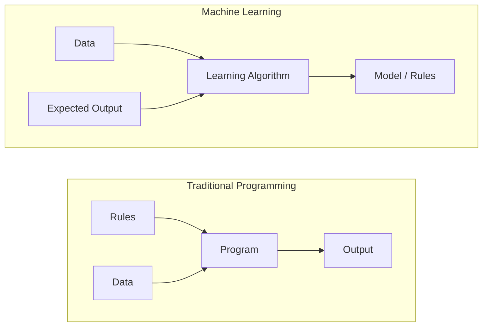
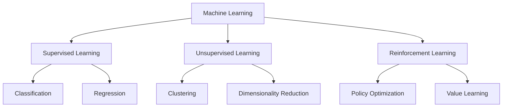
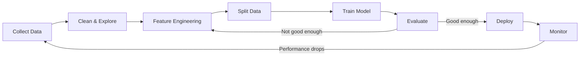
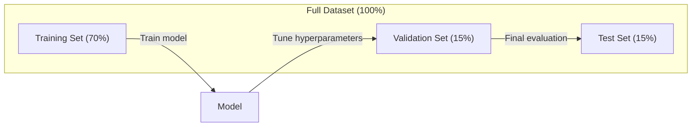
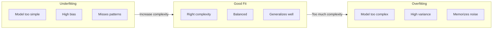
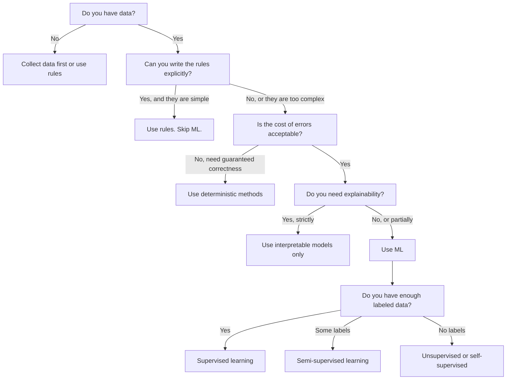

# Makine Öğrenimi Nedir?
# 什么是机器学习


> Makine öğrenimi, bilgisayarlara el ile kural yazmak yerine verilerde kalıplar bulmayı öğretiyor.

> Makine öğrenimi, bilgisayarın yapay yazma kuralları üzerine değil, verilerden bulma kurallarını öğretir.

**Type:** Learn | **类型：** 学习
**Languages:** Python
**Prerequisites:** Phase 1 (Math Foundations) | **前置知识：** Phase 1（数学基础）
**Time:** ~45 minutes | **时间：** 约 45 分钟

## Öğrenme hedefleri

- Gözetimli, gözetimsiz ve güçlendirme öğrenimi arasındaki farkı açıklayın ve belirli bir soruna hangi türde uygulanacağını belirleyin.
  解释监督学习、无监督学习与强化学习 arasındaki farkı,并判断给给定问题适用于哪种类型
- En yakın merkez bölge sınıflandırıcısını sıfırdan uygulayın ve rastgele bir başlangıç çizgisi ile değerlendiriniz
  Son derece değerlendirme, sıfırdan gerçekleştirilen, ve birlikte temel çizgi karşılaştırma değerlendirmesi yapılır.
- Sınıflandırma ve gerileme görevleri arasında ayrım yapın ve her bir için uygun kayıp fonksiyonunu seçin.
  区分分类和归归任务, her görev için uygun bir kayıp işlevi seçmek
- Belirli bir iş sorununun ML için uygun olup olmadığını veya belirlenme kurallarıyla daha iyi çözülmediğini değerlendirmek
                                                                                                                                                                                                                                                                                                                                                                                                                                                                                                                               


> **【中文解读】**
> 机学习, bilgisayarın, yapay yazma kurallarına dayanarak değil, verilerden otomatik olarak öğrenmesini sağlamak. 监督学习 (监督学习) 无监督学习 (监督学习) 无标签 (监督学习) 强化学习 (奖励信号) ⇒

> **【拓展：机器学习范式的产业应用】**
> GPT-4 kullanmak kendi kendine kontrol öğrenmek(预测下一个代币) 约13亿代币上训练;BERT 使用掩码语言建模在 Wikipedia + BookCorpus 上预训练;AlphaGo 使用强化学习通过自我对对超越人类围棋冠军。

## Sorunlar. Sorunlar.

Spam filtreyi oluşturmak istiyorsunuz. Geleneksel yaklaşım: oturup yüzlerce kural yazın. "E-posta 'Ücretsiz Para' içerirse, spam işaretleyin. 3'den fazla çığlık işaretine sahipse, spam işaretleyin". Kural yazmak için haftalar harcıyorsunuz. Sonra spamcılar kelimelerini değiştirirler. Kurallarınız kırılır. Daha fazla kural yazıyorsunuz.

> Bir çöp posta filtresi inşa etmek istersin. Geleneksel yöntem, oturup yüzlerce kural yazmaktır. "Eğer posta 'Ücretsiz Para' içerirse, çöp posta olarak işaretlenir.

Makine öğrenimi bunu tersine çevirir. Kural yazmak yerine, bilgisayarına binlerce etiketlenmiş e-posta veriyorsunuz ("spam" veya "spam değil") ve kuralları kendi başına bulmasına izin veriyorsunuz. Bilgisayar asla düşünmediğiniz bir kalıp bulur. Spamcılar taktiklerini değiştirdiğinde, kod yazmak yerine yeni veriler üzerinde yeniden eğitilersiniz.

> 机学颠覆了这种方式――你不是编写规则,而是给计算机数千封标记好的邮件――"垃圾邮件"或"正常邮件"),让它自己找出规则――计算机能发现你从未想过的模式――垃圾邮件发送者改变策略时,你只需要在新数据上重新训练,而不是重写代码――

Bu değişim "programlama kurallarından" "verilerden öğrenme"e makineler öğrenmesinin çekirdeğidir. Her tavsiye motoru, ses asistanı, kendi kendine çalışan araba ve dil modeli bu şekilde çalışır.

> Programlama kurallarından veri içi öğrenme'ye dönüşüm makineler öğrenmesinin merkezinde yer almaktadır.

> **【中文解读】**
> 傳統編程是"人寫規則,机器執行";机器學習是"人給資料,机器自己發現規則"──垃圾郵件過濾器: 傳統編程需要手動维护数百条規則,而 ML 方法只需提供大量标注邮件,模型自动学习判別模式──垃圾郵件策略變化時,只需重新訓練而不是重寫代碼──

> **【拓展：垃圾邮件过滤的演进】**
> Gmail'in çöpe gönderilen posta filtresi günde yaklaşık 300 milyar posta işlemeyi başarıyor, doğruluk oranı %99.9'dan fazladır.

## Konsepten bir şey.

### Kurallar değil, Verilerden Öğrenmek

Geleneksel programlama ve makine öğrenimi sorunları karşı yönde çözüyor.

> 傳統編程與機學習相反的方向解決問題──



Geleneksel programlama: kuralları yazıyorsunuz. Program onları verilere uyguluyor.

> 傳統編程:你编寫規則──程序将规则应用于数据生成输出──

Makine öğrenimi: verileri ve beklenen çıkışları sağlıyorsunuz. Algoritm kuralları keşfeder.

> 机器学习:你提供数据和期望输出―― algoritma otomatik bulma kuralları―

Eğitimden çıkan "model" kurallardır, sayılar (koşullar, parametreler) olarak kodlanmıştır.

> 訓練 hasil edilen "model" kuralın kendisidir, sayısal olarak kodlanır.

> **【中文解读】**
> 传统编程与机器学习的本质区别:传统编程输入"规则+数据"得到"输出";机器学习输入"数据+期望输出"得到"模型 (规则) ⋅模型本质上就是数字编码的规则 (权重和参数) 的规则 (权重和参数) 的规则 (),它能对从未见过的新数据做预测 (预测) ⋅

### Makine Öğrenimi Üç Türü



**Supervised Learning**Modelle giriş ve çıkış çiftleri vardır. Modelle giriş ve çıkışları haritalamayı öğrenir.
- "Burada kedi veya köpek etiketi olan 10.000 fotoğraf var.
- "Burada ev özellikleri ve fiyatları var.

> **监督学习**:You have input-output对;; Model öğrenmek için input-mapping to output;;
> - "Burada 10.000 张, kedilerin veya köpeklerin fotoğraflarını işaret ediyor.
> - "Burada ev özellikleri ve fiyatı vardır.

**Unsupervised Learning**Sadece girişler var, etiket yok, model kendi kendine yapı bulur.
- "Burada 10.000 müşteri satın alma tarihi var. Doğal gruplamaları bulun".
- "Burada 1000 boyutlu veri noktası var. Yapısal olarak iki boyutlu olarak azaltın".

> **无监督学习**:You only input, no tag;; Model itself found structure in data;;
> - "Burada 10.000 müşteri satın alımı kayıtları var.
> - "Burada 1.000 维'li veri noktası var.

**Reinforcement Learning**Bir ajan, bir ortamda eylemler yapar ve ödül veya cezalar alır.
- "Bu oyunu oynayın. Kazanmak için +1 , kaybetmek için -1.
- "Bu robot kolunu kontrol et. Nesneyi ele geçirmek için +1'e, harcanmış her saniyede -0.01'e".

> **强化学习**Bu, bir akıllı bedenin çevre içinde harekete geçmesi ve ödüllendirilmesi veya cezalandırılması için bir strateji öğrenmesi ve genel ödüllendirilmeyi en üst düzeye çıkarması için bir politika oluşturmasıdır.
> - "Bu oyunu oynayın. +1, kaybettiğiniz -1. Kendi stratejinizi bulun".
> - "Bu makineli kolunu kontrol et. " "Bununla bir nesneyi yakalamak için başarılar elde et. "

Pratik olarak inşa edeceğiniz şeylerin çoğu denetim altında öğrenmeyi kullanır. Denetimsiz öğrenme önceden işleme ve keşif için yaygındır.

> Uygulama ve araştırmalar için kullanılan sistemlerin çoğu, kontrolden öğrenme ve kontrolden geçme sistemidir.

> **【拓展：三种范式在真实系统中的分工】**
> Netflix 推系统同时使用三种范式:协同过(无监督聚类用户群) 监督学习(预测用户对电影的评分 1-5 星) 强化学习(A/B 测试选择最优推策略) ;;Tesla Autopilot 使用监督学习(目标检测) + 强化学习(路径规划) ;;Stable Diffusion 训练涉及自监督(图像文本对学习 CLIP) + 监督微调;;

### Büyük Üçlü'nün Ötesinde

Yukarıdaki üç kategori temizdir, ama gerçek dünya ML genellikle çizgileri bulanıklaştırır.

> Bu üç sınıf çok net, ama gerçek dünya ML'si bu sınırları bulanıklaştırıyor.

**Semi-supervised learning**Etiketlenmiş ve etiketlenmemiş bir dizi küçük veriyi kullanır. 100 etiketlenmiş tıbbi görüntü ve 100.000 etiketlenmemiş görüntü olabilir. Teknikler şunları içerir:

> **半监督学习**Az sayıda etiketleme verisi ve çok sayıda etiketlenmemiş verisi kullanın. 100 adet etiketlenmemiş tıbbi görüntü ve 100.000 adet etiketlenmemiş görüntü bulunur. Teknikler şunları içerir:

- **Label propagation:**Benzer veri noktalarını birbirine bağlayan bir grafik oluşturun. Etiketler etiketlenmiş düğümlerden etiketlenmemiş komşulara grafik üzerinden yayılır.
  **标签传播：**DATA POINT'lerin bir bağlantısı oluşturmak. Etiketler işaretleme noktasından işaretleme yapılmamış komşu noktalara yayılmak.
- **Pseudo-labeling:**Etiketlenmiş veriler üzerinde bir model eğit, etiketlenmemiş veriler için etiketleri tahmin etmek için kullan, sonra her şeyi yeniden eğit.
  **伪标签：**Etiketlenmemiş veriler üzerinde bir eğitim modeli, onu işaretlenmemiş veriler üzerinde bir etiket tahmin ederek, sonra tüm veriler üzerinde yeniden eğitim yaparak.
- **Consistency regularization:**Modeldeki giriş için aynı tahmin ve bu girişin biraz rahatsız edilmiş bir versiyonu verilmelidir.
  **一致性正则化：**Modeller giriş ve hafif rahatsız edici sürümlerine aynı tahminleri yapmalıdır.

**Self-supervised learning**Bu model, verilerin yapısından kendi tahmin görevini oluşturur.

> **自监督学习**Veri kendiliğinden oluşturmak kontrol sinyalleri. Tamamen yapay etiket gerekmez.

- **Masked language modeling (BERT):**Bir cümlede kelimelerin %15'ini gizle, modelin eksik kelimeleri tahmin etmesini eğit. "Etiketler" orijinal metinden gelir.
  **掩码语言建模（BERT）：**遮盖句中 15% の词,訓練模型预测被遮盖的词──"标签" orijinal metinlerden oluşmaktadır──
- **Contrastive learning (SimCLR):**Bir görüntü alın, iki genişletilmiş versiyon oluşturun. Modelin aynı görüntüden geldiğini fark etmesini ve diğer görüntülerin genişletilmiş versiyonlarından ayırt etmesini eğitin.
  **对比学习（SimCLR）：**取一张图像, create two enhanced versions── training model identifying them from the same image, simultaneously differentiating them from the other images.
- **Next-token prediction (GPT):**Önceki kelimeleri vererek bir sonraki kelimeyi tahmin edin. Her metin belge bir eğitim örneği haline gelir.
  **下一 token 预测（GPT）：**给定前面所有词,预测下一个词──每个文本文档都成为训练样本──

> **【拓展：自监督学习如何驱动大模型革命】**
> GPT-4'ün eğitim verileri yaklaşık 13 milyar token, eğer yapay etiketleme temelinde mümkün değilse.

Bu üç büyük sınıftan ayrı kategoriler değil. Onlar denetim altında ve denetimsiz fikirleri birleştiren stratejiler. Kendini denetim altında öğrenme teknik olarak denetim altında (modeldeki bir şey öngörülür), ancak etiketler otomatik olarak üretilir, insanlar tarafından değil.

> Bu üç sınıfın farklılıkları ile yeni sınıflar değildir. Bunlar denetim ve denetimsiz düşünce stratejilerinin birleştirilmesidir.

### Sınıflandırma vs. Geri dönüş

Bunlar iki ana denetimli öğrenme görevi.

> Bu iki ana kontrol öğrenme görevi.

| Aspect | Classification | Regression |
|--------|---------------|------------|
| Output | Discrete categories | Continuous numbers |
| Example | "Is this email spam?" | "What will the house price be?" |
| Output space | {cat, dog, bird} | Any real number |
| Loss function | Cross-entropy, accuracy | Mean squared error, MAE |
| Decision | Boundaries between classes | A curve that fits the data |

| 方面 | 分类 | 回归 |
|------|------|------|
| 输出 | 离散类别 | 连续数值 |
| 示例 | "这封邮件是垃圾邮件吗？" | "房价会是多少？" |
| 输出空间 | {猫, 狗, 鸟} | 任意实数 |
| 损失函数 | 交叉熵、准确率 | 均方误差、MAE |
| 决策方式 | 类别之间的边界 | 拟合数据的曲线 |

Sınıflama "ne kategori" cevabını verir.

> 分类回答" hangi sınıf?"

Bazı sorunlar her iki şekilde de çerçeve edilebilir. Bir hisse senedi yükselmesinin veya düşmesinin tahmin edilmesi sınıflandırma demektir.

> Bazı sorunlar iki şekilde yapılandırılabilir.

> **【中文解读】**
> Klas ve regres, denetim öğrenmesinin iki temel görevi vardır. Klas tahmin ayrıntılı sınıflar ("çöp posta/normal posta"), regres tahmin devamlı sayı değerleri ("hanenin fiyatı 250 milyon") olarak.

### ML Çalışma Akışı

Her makine öğrenme projesi algoritma ne olursa olsun aynı boru hattını takip eder.

> Her makine öğrenme projesi, hangi algoritmayı kullanırsa kullansın aynı süreci izler.



**Collect Data**Daha fazla veri neredeyse her zaman daha iyidir, ancak kalite miktardan daha önemlidir.

> **收集数据**: Asıl verileri elde etmek. Daha fazla veri neredeyse her zaman daha iyidir, ancak kalitesi miktardan daha önemlidir.

**Clean & Explore**: Kayıp değerleri işleme, kopyaları kaldırma, dağılımları görselleştirme, anomalileri tespit etme.

> **清洗与探索**Bu adım genellikle proje toplam zamanının %60-80%'ini oluşturur.

**Feature Engineering**Modelin kullanabileceği özelliklere dönüştürmek. Tarihleri haftanın gününe dönüştürmek. Sayı sütunlarını normalleştirmek. Kategoriyal değişkenleri kodlamak. İyi özellikler, zarif algoritmalardan daha önemlidir.

> **特征工程**:将原始数据转换为模型可用特征――将日期转换为几周――标准化数值列――编码分类变量――好的特征比花哨的算法更重要――

**Split Data**: Eğitim, doğrulama ve test setlerine bölünür. Model eğitim verilerine dayanır, doğrulama verilerine hiperparametre ayarlanır ve test verilerine dayanarak son performans raporlanır.

> **划分数据**: Bölümlü eğitim kümesi, test kümesi ve test kümesi. Model eğitim verilerinde öğrenir, test verilerinde süperparametrleri düzenler, test verilerinde son performans rapor eder.

**Train Model**: Algoritme'ye eğitim verilerini ekleyin. Algoritm bir kayıp fonksiyonunu en aza indirmek için iç parametreleri ayarlar.

> **训练模型**:将训练数据输入算法──算法调整内部参数以最小化损失函数──

**Evaluate**Eğer performans kabul edilemezse, geri dönüp farklı özellikleri, algoritmaları veya hiperparametreyi deneyin.

> **评估**Test verilerinde ölçüm performansı: Eğer performans kabul edilemezse, farklı özellikleri, algoritmaları veya süper parametreleri deneyin.

**Deploy**Modelle yeni verilere göre tahminler yaparak üretime koyun.

> **部署**Modelleyi üretim ortamına, yeni verilere karşı öngörülmeye başlayacak.

**Monitor**: Zamanla performans izleyin. Veriler dağıtımları değişir (veriler sürüklenir) ve modeller bozulur. Performans düştüğünde, yeniden eğitil.

> **监控**: Zamanla takip performansı, veri dağılımı değişir, model geri döner, performans düştüğünde yeniden eğitilmektedir.

### Eğitim, Valide ve Sınav Bölümleri

Bu, yeni başlayanların yanlış anladığı en önemli kavramdır. Modelini eğitimin sırasında hiç görmediği verilere dayanarak değerlendirmelisin. Aksi takdirde öğrenme değil hafıza ölçüyorsunuz.

> Bu, yeni başlayanların en kolay hata yapmalarının en önemli kavramıdır. Eğitim sırasında hiç görmediğiniz verilere dayalı bir model değerlendirmek zorundasınız.



| Split | Purpose | When used | Typical size |
|-------|---------|-----------|-------------|
| Training | Model learns from this data | During training | 60-80% |
| Validation | Tune hyperparameters, compare models | After each training run | 10-20% |
| Test | Final unbiased performance estimate | Once, at the very end | 10-20% |

| 划分 | 用途 | 使用时机 | 典型比例 |
|------|------|---------|---------|
| 训练集 | 模型从中学习 | 训练期间 | 60-80% |
| 验证集 | 调节超参数，比较模型 | 每次训练后 | 10-20% |
| 测试集 | 最终无偏性能估计 | 最后仅使用一次 | 10-20% |

Test setinin kutsal olduğu için, tam bir kez bakarsınız. Eğer test performansına göre modelinizi düzenlemeye devam ederseniz, test setinde etkili bir şekilde eğitim veriyorsunuz ve rapor edilen rakamlarınız anlamsızdır.

> Test kitleri kutsaldır. Sadece bir kez görebilirsin. Eğer test performansını düzenleme modeline göre sürekli çalışırsan, aslında test kitlerinde eğitim görüyorsun.

> **【中文解读】**
> Veri ayırt etme, ML'de en kolay hatalardan biridir. Eğitim kümesi, verileme kümesi, süper-parametr ve seçim modellerini düzenlemek için kullanılır, test kümesi yalnızca son değerlendirme için kullanılır.

Küçük veri kümeleri için k katlı çapraz onay kullanın: verileri k parçalara ayırın, k-1 parçaları üzerinde çalışın, kalan kısmını onaylayın, döndürün ve ortalama sonuçlar.

> 对于小数据集,使用 k 折交叉验证:将数据分成 k 份,在 k-1 份训练中,在剩余上验证中,轮换并取平均――

### Üstü vs. Altı



**Underfitting**Modeldeki kalıpları yakalamak için çok basit. Kürük bir ilişkiyi uyumlu hale getirmeye çalışan düz çizgi. Eğitim hatası yüksek. Test hatası yüksek.

> **欠拟合**Model çok basit, verilerdeki modelleri yakalayamıyorum.

**Overfitting**Modelle çok karmaşık ve sesleri de dahil olmak üzere eğitim verilerini ezberler. Her eğitim noktasından geçen, ancak yeni verilerde başarısız olan bir kaygan eğri. Eğitim hatası düşük. Test hatası yüksek.

> **过拟合**Modelle çok karmaşık, eğitim verilerindeki gürültüyü hatırlıyor.

**Good fit**: Modelle, gürültüyi ezberlemeden gerçek desenleri yakalar.

> **良好拟合**Model gerçek bir şablonı kaydetmeden kaydediyor.

> **【中文解读】**
> 欠拟合 = 模型太简单,连训练数据中的规律都没有学到;过拟合 = 模型太复杂,把训练数据中的噪音都记得,遇到新数据就就"露"―― 模型太简单,连训数据中的规律都没学到;过拟合 = 模型太复杂,把训练数据中的噪音都记得,遇到新数据就"露"―― 模型太简单,连训数据中的规律都没学到;过拟合 = 模型太复杂,对训练数据中的噪音都记得,遇到新数据就"露"―― 模型太简单,连训数据中的规律都没学到;过拟合 = 模型太复杂,对训数据中的噪音都记得,遇到新数据就"露"―― 模型在训练集和测集中表现得很好――判断标准:如果训练准确率远高于验证准确率,就是过拟合的典型信号――

Üstü takma belirtileri:
- Eğitim doğruluğu, onay doğruluğundan çok daha yüksek.
  訓練准确率远高于验证准确率 訓練准确率 远高于验证准确率                                                                                                                                                                                                                                                                                                                                                                                                                                                                                                   
- Model eğitim verileri üzerinde iyi performans gösterir, ancak yeni veriler üzerinde kötü performans gösterir.
  Model eğitim verilerinde iyi performans gösterdi, ancak yeni verilerde kötü performans gösterdi
- Daha fazla eğitim verisini eklemek performansı artırır (modeldeki öğrenme değil, ezberlemeydi)
  增加训练数据能提升性能 (bunu öğrenmek yerine hatırlamak için yapılır)

> 过拟合的迹象:

Üstü takma için sabitlemeler:
- Daha fazla eğitim verisini alın
  Get more training data
- Modelin karmaşıklığını azaltmak (sadece parametreler, daha basit mimarlık)
  降低模型复杂度 ((更少参数、更简单的架构)
- Düzenlendirme (büyük ağırlıklar için ceza eklenir)
  Doğruluk (Hüküm)
- İptal (eğitim sırasında tesadüfen nöronları sıfırlamak)
  Durdurma:)
- Erken durdurma (valyasyon hatası artmaya başladığında eğitim durdurma)
  Sabah durdurulduğunda test hatası yükselirken durdurulduğunda eğitim)

> 过拟合的修复方法:

İhtiyacın düşük olması için sabitlemeler:
- Daha karmaşık bir model kullanın
  Daha karmaşık bir model kullan
- Daha fazla özellik ekle
  添加更多特征
- Düzenlenmeyi azaltmak
   減正则化
- Tren daha uzun
  訓練更长时间

> 欠拟合的修复方法:

### Tarafsızlık ve Çeşitlilik Arası

Bu, aşırı ve düşük uyum altında kalmanın arkasındaki matematiksel çerçeve.

> Bu, uygunluğun ve uygunsuzluğun arkasındaki matematiksel çerçeve.

**Bias**Modeldeki yanlış varsayımlardan kaynaklanan hata. Gerçek ilişki doğrusal olmayan bir modeldeki yüksek önyargıya sahiptir. Yüksek önyargı uygunsuzluğa yol açar.

> **偏差**Gerçek ilişkiler doğrusal olmayan bir ilişki olduğunda, doğrusal model yüksek önyargıya sahiptir.

**Variance**Eğitim verilerindeki küçük dalgalanmalara karşı hassasiyet hatası. Yüksek varyansa olan bir model, farklı veri alt kümeleri üzerinde eğitildiğinde çok farklı tahminler verir. Yüksek varyansa aşırı uyumlu hale gelmesine neden olur.

> **方差**Eğitim verilerine karşı küçük hareketli hassas hatalardan kaynaklanan yüksek farklı modeller farklı veri kümelerinde eğitim sırasında çok farklı tahminler verir.

| Model complexity | Bias | Variance | Result |
|-----------------|------|----------|--------|
| Too low (linear model for curved data) | High | Low | Underfitting |
| Just right | Medium | Medium | Good generalization |
| Too high (degree-20 polynomial for 10 points) | Low | High | Overfitting |

| 模型复杂度 | 偏差 | 方差 | 结果 |
|-----------|------|------|------|
| 太低（用线性模型拟合弯曲数据） | 高 | 低 | 欠拟合 |
| 恰好 | 中 | 中 | 良好泛化 |
| 太高（10 个点用 20 次多项式） | 低 | 高 | 过拟合 |

Toplam hata = Tarafsızlık^2 + Varians + Kısıtlanamayan gürültü

> 总误差 = 偏差^2 + 方差 + 不可约噪音

Kısıtlanamayan gürültüyi azaltamazsınız (bu verilerin kendisinde rastlantı) ve önyargının en az olarak azaltıldığı tatlı noktayı bulmak istiyorsunuz.

> Siz de bu kadar sessiz olmayı başaramıyorsunuz.

### Ücretsiz Öğle Öğle Teoremi Yok

Her sorunun en iyi işlediği tek bir algoritma yoktur. Bir sorunun bir sınıfında iyi performans gösteren bir algoritma, bir diğerinde kötü performans gösterecektir. Bu nedenle veri bilimcileri birden fazla algoritma denemek ve sonuçları karşılaştırmak için nedenler vardır.

>  tek bir algoritma tüm sorunlarda en iyi performans gösteremez.  Bir sınıf sorunun üzerinde iyi performans gösteren algoritmalar diğer sınıf sorunun üzerinde çok kötü performans gösterir.  Bu nedenle veri bilimcileri çeşitli algoritmalar denemek ve sonuçları karşılaştırmak için nedenlerdir.

> **【拓展：没有免费午餐定理的实践意义】**
> Bu teoride şöyle anlatılır: Kaggle  yarış şampiyonları neredeyse sadece bir algoritma kullanmakla değil, bütünleşik yöntemlerle birlikte çalışmaktadırlar. XGBoost + LightGBM + 神经网络) birden fazla modeli birleştirir.

Bu seçim, pratikte aşağıdakilere bağlıdır:
- Ne kadar veri var
  Ne kadar veriniz var ?
- Kaç tane özellik var ?
  Çok fazla özellik var.
- İlişki doğrusal ya da doğrusal olmayan
  İlişki doğaldır mı yoksa doğaldır mı?
- Anlatabilme ihtiyacınız olup olmadığını
  Açıklama gerekliliği
- Ne kadar hesaplayabilirsin
  Bilgisayar maliyetini karşılayabilirsin.

> Praktike, seçim karar verir:

### Makine Öğrenimi Ne Zaman Kullanmaması Gerekebilir

ML güçlü bir araç ama her zaman doğru değildir.

> ML  güçlüdür, ama her zaman doğru bir araç değildir.

**Do not use ML when:**

> **以下情况不要使用 ML：**

- **Rules are simple and well-defined.**Vergi hesaplamaları, sıralama algoritmaları, birim dönüşümleri. Eğer mantığı birkaç if if if if if if if if if if if if if if if if if if if if if if if if if if if if if if if if if if if if if if if if if if if if if if if if if if if if if if if if if if if if if if if if if if if if if if if if if if if if if if if if if if if if if if if if if if if if if if if if if if if if if if if if if if if if if if if if if if if if if if if if if if if if if if if if if if if if if if if if if if if if if if if if if if if if if if if if if if if if if if if if if if if if if if if if if if if if if if if if if if if if if if if if if if if if if if if if if if if if if if if if if if if if if if if if if if if if if if if if if if if if if if if if if if if if if if if if if if if if if if if if if if if if if if if if if if if if if if if if if if if if if if if if if if if if if if if if if if if if if if if if if if if if if if if if if if if if if if if if if if if if if if if if if if if if if if if if if if if if if if if if if if if if if if if if if if if if if if if if if if if if if if if if if if if if if if if if if if if if if if if if if if if if if if if if if if if if if if if if if if if if if if if if if if if if if if if if if if if if if if if if if if if if if if if if if if if if if if if if if if if if if if if if if if if if if if if if if if if if if if if if if if if if if if if if if if if if if if if if if if if if if if if if if if if if if if if if if if if if if if if if if if if if if if if if if
  **规则简单且明确。**税费计算、排序算法、单位转换―― eğer birkaç 语句写完逻辑 kullanırsanız, model sadece karmaşıklığı artıracak ve hiçbir yararı olmayacaktır。
- **You have no data or very little data.**ML'nin öğrenmek için örnekler ihtiyacı var. 10 veri noktasıyla anlamlı bir şey eğitemezsin. Önce verileri topla.
  **没有数据或数据极少。**ML  örneklerden öğrenmek gerekir. Sadece 10 veri noktası, sen hiçbir anlamlı şey eğitemezsin. Önce veri topla.
- **The cost of being wrong is catastrophic and you need guaranteed correctness.**Tıbbi doz hesaplaması, nükleer reaktör kontrolü, şifreleme doğrulama. ML modelleri olasılıklıdır. Bazen yanılıyorlar.
  **错误的代价是灾难性的且需要保证正确性。**医学量計算、核反应堆控制、密码学验证──ML 模型概率性, bazen hatalar çıkar.
- **A lookup table or heuristic solves the problem.**Eğer basit bir eşiğin veya tabloun %99'u kapsamaktadırsa, ML eklenmesi, bakım maliyetlerini anlamlı bir iyileştirme olmadan arttırır.
  **查找表或启发式规则就能解决问题。**Eğer basit bir değer veya tablo %99'u kapsayabilirse, ML eklenmesi sadece bakım maliyetini arttırır ve hiçbir önemli gelişme olmaz.
- **You cannot explain the decision and explainability is required.**Düzenlenmiş endüstriler (kredit, sigorta, ceza adaleti) bazen her kararın tam olarak açıklanabilmesini gerektirir.
  **无法解释决策但需要可解释性。**Örgütlenmiş sektör ((kredit, sigorta, ceza) bazen her kararın tam olarak açıklanabilmesi gerekmektedir.
- **The problem changes faster than you can retrain.**Kurallar her gün değişirse ve yeniden eğitim bir hafta sürerse model her zaman eski olur.
  **问题变化的速度快于重训练速度。**Eğer kurallar her gün değişir ve tekrar antrenman bir hafta gerektirirse, model her zaman eski bir şeydir.

Bu karar akış çizelgesini kullanın:

> Şimdiki karar süreci:



## Yapın.
```figure
f3-learning-boundary
```

## Yapın

Kodun içinde .`code/ml_intro.py`En basit ML algoritması olan en yakın merkez bölge sınıflandırıcısını sıfırdan uyguluyor.

> `code/ml_intro.py`Orta kod, en basit ML algoritması olan son质心分类器'ı sıfırdan gerçekleştirir.

> **【中文解读】**
> Son derece basit bir şekilde, yeni bir örnek yakın bir merkezine dağıtılacak. Ancak bu, yeni bir veriyi tahmin etmek için yapılan bir proje olarak ortaya çıkar. Yeni bir veriyi tahmin etmek için yapılan bir proje olarak, yeni bir veriyi tahmin etmek için yapılan bir proje olarak ortaya çıkar.

### Adım 1: En yakın Centroid sınıflandırıcısı sıfırdan

En yakın merkez sınıflandırıcısı, eğitim verilerindeki her sınıfın merkezini (orta) hesaplar. Tahmin etmek için, her yeni noktayı en yakın merkezi olan sınıfına tahsis eder.

> Son derece sınıflandırma çalışmaları için yapılan çalışmalarda, her yeni puanın en yakın sınıflara dağıtılacağı tahmin edilmektedir.

```python
class NearestCentroid:
    def fit(self, X, y):
        self.classes = np.unique(y)  # 获取所有唯一类别标签
        self.centroids = np.array([
            X[y == c].mean(axis=0) for c in self.classes  # 计算每个类别的质心（均值向量）
        ])

    def predict(self, X):
        distances = np.array([
            np.sqrt(((X - c) ** 2).sum(axis=1))  # 计算每个样本到各质心的欧氏距离
            for c in self.centroids
        ])
        return self.classes[distances.argmin(axis=0)]  # 返回距离最近的质心对应的类别
```

Bu tüm algoritma. Fit iki yolu hesaplar. Predict mesafeleri hesaplar.

> İşte tüm algoritma. Fit  hesaplama iki ortalama değer.

### İkinci Adım: Sintez veriyi eğit

İki sınıfın biraz üst üste geçişiyle 2 boyutlu bir sınıflandırma verisi oluştururuz.

> İki sınıfın üzerinde bir 2D sınıflandırma verisi oluşturduk.

```python
rng = np.random.RandomState(42)  # 设置随机种子以保证可复现
X_class0 = rng.randn(100, 2) + np.array([1.0, 1.0])  # 类别 0 的数据：中心在 (1,1) 附近
X_class1 = rng.randn(100, 2) + np.array([-1.0, -1.0])  # 类别 1 的数据：中心在 (-1,-1) 附近
X = np.vstack([X_class0, X_class1])  # 合并所有特征数据
y = np.array([0] * 100 + [1] * 100)  # 创建对应的标签数组
```

### Üçüncü Adım: Başlangıç Bilgiyle Karşılaştır

Her ML modeli önemsiz bir temel çizgiyle karşılaştırılmalıdır. Burada, temel çizgi rastgele bir sınıf öngörüyor. Eğer ML modeli rastgele tahminleri yenmezse, bir şey yanlış.

> Her bir ML modeli basit bir temel çizgi ile karşılaştırılmalıdır.

```python
baseline_preds = rng.choice([0, 1], size=len(y_test))  # 随机猜测作为基线
baseline_acc = np.mean(baseline_preds == y_test)  # 计算基线准确率
```

Merkez bölümü sınıflandırıcısı bu temiz veri kümesinde %90+ doğruluk elde etmeli.

> Bu temiz veri kümesi üzerinde 质心分类器 yaklaşık %90+ doğruluk oranına ulaşabilmelidir.

### Neden Önemli?

En yakın merkez bölge sınıflandırıcısı önemsiz bir şekilde basit. Hiperparametre, iterasyon veya gradient düşüşü yoktur.

> Son derece basit bir sistemdir. Süperparament, 代, 梯度 indirimi yoktur.

1. **Learn**Eğitim verilerinden bir temsil (centroids)
   **学习**訓練数据的表示(质心)
2. **Predict**Bu temsil ile ilgili yeni veriler (en yakın mesafe)
   Yeni verilere gösterilme**预测**(son mesafe)
3. **Evaluate**Baseline karşısında (hassasi tahmin)
   Kişilik (Hazırlık)**评估**

Her ML algoritması, lojistik gerileme ile transformatörlere kadar, aynı üç adımlı bir kalıp izler.

> Logiğe geri dönüp Transformer'e dönünce, her ML algoritması aynı üç adımlı bir biçime uyar. Sadece daha karmaşık olduğunu gösterir, ancak çalışma süreci değişmez.

### Adım 4: Centroid sınıflandırıcısı ne yapamaz

En yakın merkez bölge sınıflandırıcısı, her sınıfın tek bir nokta oluşturduğunu varsayır.

> Son derece sınıflandırma, her sınıfın tek bir grup parçası oluşturduğunu varsaymaktadır.

- Sınıflar birden fazla kümelere sahiptir (örneğin, "1" rakamı çeşitli şekillerde yazılabilir)
  类别有多个 (örneğin, "数字" " " " " " " " " " " " " " " " " " " " " " " " " " " " " " " " " " " " " " " " " " " " " " " " " " " " " " " " " " " " " " " " " " " " " " " " " " " " " " " " " " " " " " " " " " " " " " " " " " " " " " " " " " " " " " " " " " " " " " " " " " " " " " " " " " " " " " " " " " " " " " " " " " " " " " " " " " " " " " " " " " " " " " " " " " " " " " " " " " " " " " " " " " " " " " " " " " " " " " " " " " " " " " " " " " " " " " " " " " " " " " " " " " " " " " " " " " " " " " " " " " " " " " " " " " " " " " " " " " " " " " " " " " " " " " " " " " " " " " " " " " " " " " " " " " " " " " " " " " " " " " " " " " " " " " " " " " " " " " " " " " " " " " " " " " " " " " " " " " " " " " " " " " " " " " " " " " " " " " " " " " " " " " " " " " " " " " " " " " " " " " " " " " " " " " " " " " " " " " " " " " " " " " " " " " " " " " " " " " " " " " " " " " " " " " " " " " " " " " " " " " " " " " " " " " " " " " " " " " " " " " " " " " " " " " " " " " " " " " " " " " " " " " " " " " " " " " " " "
- Karar sınırı doğrusal değildir (örneğin, bir sınıf diğerini sarar)
  决策边界非线性 (örneğin, bir sınıf diğer sınıfın etrafında)
- Özellikler çok farklı ölçeklere sahiptir (uzaktan en büyük ölçek özellikleri baskınlık yapmaktadır)
  Özellik seviyesindeki fark çok büyüktür (en büyük seviyesindeki özelliklerin yönlendirmesiyle uzaklık)

Bu sınırlamalar öğrendiğiniz diğer algoritmaları motive eder. K'nin en yakın komşuları birden fazla kümeleri ele alır. Karar ağaçları çizgisiz sınırları ele alır. Özellik ölçekleme ölçek sorunu çözür. Her ders önceki birinin sınırlamalarına dayanır.

> Bu sınırlamalar, öğrendiğiniz diğer algoritmaların her birine güç verdi. K yakınlık işlemleri çoklu ── karar ağacı, doğalı olmayan sınırları işlemeyi sürdürüyor.

## Çerçeveyi kullanın.

sklearn sağlıyor `NearestCentroid`ve sentetik veri üreticileri:

> Süküler  sağladı `NearestCentroid`& synthetic data generator:

```python
from sklearn.neighbors import NearestCentroid
from sklearn.datasets import make_classification
from sklearn.model_selection import train_test_split

# 生成 500 个样本、2 个特征的合成分类数据集
X, y = make_classification(
    n_samples=500, n_features=2, n_redundant=0,
    n_clusters_per_class=1, random_state=42
)
# 按 70/30 比例划分训练集和测试集
X_train, X_test, y_train, y_test = train_test_split(X, y, test_size=0.3)

# 创建最近质心分类器并训练
clf = NearestCentroid()
clf.fit(X_train, y_train)
# 在测试集上评估准确率
print(f"Accuracy: {clf.score(X_test, y_test):.3f}")
```

## İndirin . Ürünler .

Bu ders bize çok yararlı .`outputs/prompt-ml-problem-framer.md`- belirsiz iş sorunlarını, tam bir ML görevlerine dönüştüren bir istek. Bir sorun açıklaması verin ("çıkışı azaltmak istiyoruz" veya "ölçümcü çeyrek için talep tahmin edelim") ve öğrenme türünü tanımlar, tahmin hedefini tanımlar, aday özelliklerini listeler, bir başarı ölçüsü seçer, bir temel çizgi oluşturur ve verilerin sızması veya sınıf dengesizliği gibi tuzakları işaretler. Yanlış şeyi yapmaktan kaçınmak için herhangi bir ML projesinin başında kullanın.

> 本课产 出 `outputs/prompt-ml-problem-framer.md` Bir belirsiz iş sorunu belirli bir ML görevinin ipucu kelimesine dönüştürülür. Bir sorun tanımını verir. "Biz müşteri kaybını azaltmak istiyoruz" veya "son dönem gereksinimini tahmin edeceğiz" diye bir sorunu tanımlar. Öğrenme türünü tanımlar, öngörüleme hedeflerini tanımlar, aday özelliklerini listeler, başarı göstergeleri seçer, temel çizgi oluşturur, ve veri sızıntılarını veya sınıf dengesizliği gibi tuzakları işaretler.

## Anahtar Şartlar .

| Term | What people say | What it actually means |
|------|----------------|----------------------|
| Model | "The AI" | A mathematical function with learnable parameters that maps inputs to outputs |
| Training | "Teaching the AI" | Running an optimization algorithm to adjust model parameters so predictions match known outputs |
| Feature | "An input column" | A measurable property of the data that the model uses to make predictions |
| Label | "The answer" | The known output for a training example, used to compute the error signal |
| Hyperparameter | "A setting you tweak" | A parameter set before training that controls the learning process (learning rate, number of layers) |
| Loss function | "How wrong the model is" | A function that measures the gap between predicted and actual outputs, which training tries to minimize |
| Overfitting | "It memorized the test" | The model learned training-specific noise instead of general patterns, so it fails on new data |
| Underfitting | "It didn't learn anything" | The model is too simple to capture the real patterns in the data |
| Generalization | "It works on new data" | The model's ability to make accurate predictions on data it was not trained on |
| Cross-validation | "Testing on different chunks" | Repeatedly splitting data into train/test folds and averaging results, giving a more robust performance estimate |
| Regularization | "Keeping weights small" | Adding a penalty term to the loss function that discourages overly complex models |
| Data drift | "The world changed" | The statistical distribution of incoming data shifts over time, debegrading model performance |

| 术语 | 俗称 | 实际含义 |
|------|------|---------|
| Model / 模型 | "AI" | 一个具有可学习参数的数学函数，将输入映射到输出 |
| Training / 训练 | "教 AI" | 运行优化算法调整模型参数，使预测匹配已知输出 |
| Feature / 特征 | "输入列" | 数据中模型用于做预测的可测量属性 |
| Label / 标签 | "答案" | 训练样本的已知输出，用于计算误差信号 |
| Hyperparameter / 超参数 | "你调的设置" | 训练前设置的参数，控制学习过程（学习率、层数） |
| Loss function / 损失函数 | "模型有多错" | 衡量预测与实际输出差距的函数，训练试图最小化它 |
| Overfitting / 过拟合 | "它记住了测试集" | 模型学习了训练数据的噪声而非通用模式，在新数据上失效 |
| Underfitting / 欠拟合 | "它什么都没学到" | 模型太简单，无法捕捉数据中的真实模式 |
| Generalization / 泛化 | "在新数据上有效" | 模型对未训练数据做出准确预测的能力 |
| Cross-validation / 交叉验证 | "在不同块上测试" | 反复将数据划分为训练/测试折并平均结果，给出更稳健的性能估计 |
| Regularization / 正则化 | "保持权重小" | 在损失函数中添加惩罚项，阻止过于复杂的模型 |
| Data drift / 数据漂移 | "世界变了" | 输入数据的统计分布随时间变化，导致模型性能下降 |

## Egzersizler.

1. Herhangi bir veri kümesini (örneğin Iris, Titanic) alın. 70/15/15'i tren/validasyon/test olarak bölün.
   1. 取任意数据集(如Iris、Titanic) 』按 70/15/15 划分为训练/验证/测试集──解释为什么不应在测试集上调节超参数──
2. Her bir sorun için sınıflandırma, geri dönüş veya gruplama olup olmadığını ve denetim altında olup olmadığını belirleyin.
   2. 列出三个现实世界问题──对每一个问题,判断它是分类、归归还是聚类,以及是监督学习还是无监督学习──
3. Bir model eğitim verilerinde %99 doğruluk elde eder, test verilerinde ise %60 doğruluk elde eder.
   3. Bir model eğitim verilerinde %99 doğruluk oranına sahip, ancak test verilerinde sadece %60 doğruluk oranına sahip.

## Daha fazla okumak

- [An Introduction to Statistical Learning](https://www.statlearning.com/)- tüm klasik ML yöntemlerini kapsadığı ücretsiz ders kitabı pratik örneklerle
  [An Introduction to Statistical Learning](https://www.statlearning.com/)- 免费教材, pratik örneklerle tüm klasik ML 方法leri kapsar
- [Google's Machine Learning Crash Course](https://developers.google.com/machine-learning/crash-course)- ML kavramlarına kısa bir görsel giriş
  [Google's Machine Learning Crash Course](https://developers.google.com/machine-learning/crash-course)- 简明的 ML 概念可视化介绍
- [Scikit-learn User Guide](https://scikit-learn.org/stable/user_guide.html)- Python'da ML uygulaması için pratik referans
  [Scikit-learn User Guide](https://scikit-learn.org/stable/user_guide.html)- Python 实现 ML'nin pratik referansı
