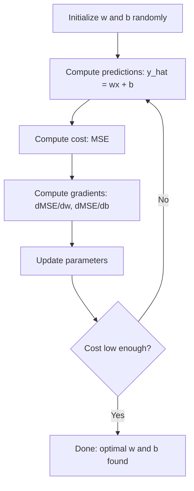

# Düzsel Geri Dönüş
# 线性回归


> Düzsel geri dönüş, verilerinizi en iyi düz çizgiyi çizer. Bu makine öğrenme "hello world"ıdır.

> 线性回归穿越你的数据图出最佳直线──它是机器学习的"Hello World"──

**Type:** Build | **类型：** 构建
**Languages:** Python
**Prerequisites:** Phase 1 (Linear Algebra, Calculus, Optimization), Phase 2 Lesson 1 | **前置知识：** Phase 1（线性代数、微积分、优化），Phase 2 第 1 课
**Time:** ~90 minutes | **时间：** 约 90 分钟

## Öğrenme hedefleri

- Orta kareler hatası için gradient düşüş güncelleme kurallarını çıkarın ve sıfırdan çizgisi geri dönüşü uygulayın
  推导均方差的梯度下降更新规则并从零实现线性回归 推导均方差的梯度下降更新规则并从零实现线性回归
- Bilgisayar karmaşıklığı açısından gradient düşüşü ve normal denklemle karşılaştırın ve her birini ne zaman kullanmanız gerektiği
  Dönüşüm ve normal denklemin hesaplama karmaşıklığı ile karşılaştırın, ne zaman kullanıldığını belirleyin
- Özellik standartlaması ile birden fazla doğrusal gerileme modeli oluşturun ve öğrenilen ağırlıkları yorumlayın
  构建带特征标准化多线性归归模型并解释学习到的权重
- Ridge gerilemesinin (L2 düzenlenmesi) büyük ağırlıkları cezalandırarak aşırı uyumlu olmayı nasıl engellediğini açıklayın
  解释 Ridge 回归(L2 正则化) nasıl bir şekilde aşırı uyum önlemek için büyük bir güçten cezayı geçebilirsiniz


> **【中文解读】**
> 线性归归 () 线性归 () 线性归 () 线性归 () 线性归 () 线性归 () 线性归 () 线性归 () 线性归 () 线性归 () 线性归 () 线性归 () 线性归 () 线性归 () 线性归 () 线性归 () 线性归 () 线性归 () 线性归 () 线性归 () 线性归 () 线性归 () 线性归 () 线性归 () 线性归 () 线性归 () 线性归 () 线性归 () 线性归 () 线性归 () 线性归 () 线性归 () 线性归 () 线性归 () 线性归 () 线性归 () 线性归 () 线性归 () 线性归 () 线性归 () 线性归 () 线性归 () 线性归 () 线性归 () 线性归 () 线性归 () 线性归 () 线性归 () 线性归 () 线性归 () 线性归 () 线性归 () 线性归 () 线性归 () 线性归 () 线性归 () 线性归 () 线性归 () 线性归 () 线性归 () 线性归 () 线性归 () 线性归 () 线性归 () 线性归 () 线性归 () 线性归 () 线性归 () 线性归 () 线性归 () 线性归 () 线性归 () 线性归 () 线性归 () 线性归 () 线性归 () 线性归 () 线性归 () 线性归 () 线性归 () 线性归 () 线性归 () 线性归 () 线性归 () 线性归 () 线性归 () 线性归 () 线性归 () 线性归 () 线性归 () 线性归 () 线性归 () 线性归 () 线性归 () 线性归 () 线性归 () 线性归 () 线性归 () 线性归 () 线性归 () 线性归 () 线性归

> **【拓展：线性回归在真实 AI 系统中的角色】**
> "Deep learning" daha fazla ilgi çekici olsa da, 線性归归 (linear regression) hala endüstri dünyasında en sık kullanılan modellerden biridir. Google A/B test analizinde 線性归 (linear regression) değerlendirmelerini büyük ölçüde kullanıyor.

## Sorunlar. Sorunlar.

Evlerin boyutları ve satış fiyatları. Yeni bir evin fiyatını tahmin etmek istersin.

> Sizde veriler var: Ev alanı ve karşı karşı karşı karşı karşı karşı karşı karşı karşı karşı karşı karşı karşı karşı karşı karşı karşı karşı karşı karşı karşı karşı karşı karşı karşı karşı karşı karşı karşı karşı karşı karşı karşı karşı karşı karşı karşı karşı karşı karşı karşı karşı karşı karşı karşı karşı karşı karşı karşı karşı karşı karşı karşı karşı karşı karşı karşı karşı karşı karşı karşı karşı karşı karşı karşı karşı karşı karşı karşı karşı karşı karşı karşı karşı karşı karşı karşı karşı karşı karşı karşı karşı karşı karşı karşı karşı karşı karşı karşı karşı karşı karşı karşı karşı karşı karşı karşı karşı karşı karşı karşı karşı karşı karşı karşı karşı karşı karşı karşı karşı karşı karşı karşı karşı karşı karşı karşı karşı karşı karşı karşı karşı karşı karşı karşı karşı karşı karşı karşı karşı karşı karşı karşı karşı karşı karşı karşı karşı karşı karşı karşı karşı karşı karşı karşı karşı karşı karşı karşı karşı karşı karşı karşı karşı karşı karşı karşı karşı karşı karşı karşı karşı karşı karşı karşı karşı karşı karşı karşı karşı karşı karşı karşı karşı karşı karşı karşı karşı karşı karşı karşı karşı karşı karşı karşı karşı karşı karşı karşı karşı karşı karşı karşı karşı karşı karşı karşı karşı karşı karşı karşı karşı karşı karşı karşı karşı karşı karşı karşı karşı karşı karşı karşı karşı karşı karşı karşı karşı karşı karşı karşı karşı karşı karşı karşı karşı karşı karşı karşı karşı karşı karşı karşı karşı karşı karşı karşı karşı karşı karşı karşı karşı karşı karşı karşı karşı karşı karşı karşı karşı karşı karşı karşı karşı karşı karşı karşı karşı karşı karşı karşı karşı karşı karşı karşı karşı karşı karşı karşı karşı karşı karşı karşı karşı karşı karşı karşı karşı karşı karşı karşı karşı karşı karşı karşı karşı karşı karşı karşı karşı karşı karşı karşı karşı karşı karşı karşı karşı karşı karşı karşı karşı karşı karşı karşı karşı karşı karşı karşı karşı karşı karşı karşı karşı karşı karşı karşı karşı karşı karşı karşı karşı karşı karşı karşı karşı karşı karşı karşı karşı karşı karşı karşı karşı karşı karşı karşı karşı karşı karşı karşı karşı karşı karşı karşı karşı karşı karşı karşı karşı karşı karşı karşı karşı karşı karşı karşı karşı karşı karşı karşı karşı karşı karşı karşı karşı karşı karşı karşı karşı karşı karşı karşı karşı karşı karşı karşı karşı karşı karşı karşı karşı karşı karşı karşı karşı karşı karşı karşı karşı karşı karşı karşı karşı karşı karşı karşı karşı karşı karşı karşı karşı karşı karşı karşı karşı karşı karşı karşı karşı karşı karşı karşı karşı karşı karşı karşı karşı karşı karşı karşı karşı karşı karşı karşı karşı karşı karşı karşı karşı karşı karşı karşı karşı karşı karşı karşı karşı karşı karşı karşı karşı karşı karşı karşı karşı karşı karşı karşı karşı karşı karşı karşı karşı karşı karşı karşı karşı karşı karşı karşı karşı karşı karşı karşı karşı karşı karşı karşı karşı karşı karşı karşı karşı karşı karşı karşı karşı karşı karşı karşı karşı karşı karşı karşı karşı karşı karşı karşı karşı karşı karşı karşı karşı karşı karşı karşı karşı karşı karşı

Hattı gerileme size bu çizgiyi verir. Daha da önemlisi, tüm ML eğitim döngüsünü içeriyor: bir model tanımlamak, bir maliyet fonksiyonunu tanımlamak, parametreleri optimize etmek. Her ML algoritması aynı kalıpı takip eder. En basit durumla burada ustalaşın ve her yerde tanıyacaksınız.

> 线性归归为你提供了那条线――更重要的是,它引入了整个 ML 训练循环:定义模型、定义价值函数、优化参数――每个 ML 算法都遵循相同的模式――; bu en basit durumlarda onu ele geçirmek, sen de onu herhangi bir yerde tanıyabilirsin――

Bu sadece basit sorunlar için değil. Linyer gerileme talep tahminleri, A / B test analizi, finansal modellerleme ve her gerileme görevi için bir temel olarak üretim sistemlerinde kullanılır.

> Bu sadece basit sorular için değil, üretim sistemlerinde talep tahminleri için, A/B test analizi için, finansal yapılandırma için ve her bir dönüşüm görevinin temel hattı olarak kullanılır.

> **【中文解读】**
> 线性归归不仅是入门知识,更是整个机器学习训练循环的缩写:定义模型 → 定义损失函数 → 优化参数―― 线性归归不仅是入门知识,更是整个机器学习训练循环的缩写:定义模型 → 定义损失函数 → 优化参数―― 线性归归不仅是入门知识,更是整个机器学习训练循环的缩写:定义模型 → 定义损失函数 → 优化参数―― 定义损失函数 → 优化参数―― 优化参数―― 线性归归归的简单例掌握,你就能理解从逻辑归归到神经网络的全部算法――它们只是模型更复杂,损失函数不同,但训练流程完全相同――

## Konsepten bir şey.

### Örnek

Düzsel gerileme giriş (x) ve çıkış (y) arasındaki düzsel bir ilişkiyi varsayır:

> 线性归归假设输入 (x) ve输出 (y) 之间存在线性关系:

```
y = wx + b
```

- `w`(koleksiyon/eğim): x 1 arttığında y'nin değişimi
  `w`(权重/斜率):x 增加 1 时 y 变化多少
- `b`(bias/intercept): x = 0 olduğunda y'nin değeri
  `b`(偏置/截距):当 x = 0 时 y 的值

Çoklu girişler (karakterlikler) için, bu aşağıdakilere kadar uzanır:

> 对于多个输入(特征),扩展为:

```
y = w1*x1 + w2*x2 + ... + wn*xn + b
```

Ya da vektör biçiminde: `y = w^T * x + b`

> Ya da                                                                                                                                                                                                                                                              `y = w^T * x + b`

Amaç: tüm eğitim örneklerinde öngörülen y'yi mümkün olduğunca gerçek y'ye yakın hale getiren w ve b değerlerini bulmak.

> 目標: w 和 b'in değerini bul, tüm eğitim örneklerinde tahminlerin y ı mümkün olduğunca gerçek y ı yakınlaştırmak

> **【中文解读】**
> 线性归归的模型非常直观:`y = wx + b`,w is slant (sırıntılı) ),b is cross (sırıntılı) ),`y = w1*x1 + w2*x2 + ... + wn*xn + b`, yani süper düzlemli denklemli verileri kullanarak eğitimin amacı, tahmin değerinin gerçek değerle farkı en azlaştırarak en iyi w ve b'yi bulmaktır.

### Maliyet işlevi (Orta Çekirde Hata)

"Mümkün olduğunca yakın" ölçmek için nasıl bir sayı gerekir? Öncülüklerinizin ne kadar yanlış olduğunu anlatan tek bir sayı gerekir. En yaygın seçenek ortalama kare hatadır (MSE):

> "Most possible approach" ölçüsünü nasıl ölçersin? Önceden tahmin edilen hata derecesini anlayabilen bir tek sayı değeri gerekir. En sık kullanılan seçenek ortalama hata (MSE) dir:

```
MSE = (1/n) * sum((y_predicted - y_actual)^2)
```

Neden kare? İki neden. Birincisi, büyük hataları küçük hatalardan daha fazla cezalandırır (10'un hatası 1'den 100 kat daha kötüdür, 10'un hatasından daha kötüdür).

> Neden kare kullanılır? iki nedenle. İlk olarak, büyük hataların cezası küçük hatalardan daha ağırdır.

Masraf fonksiyonu bir yüzey oluşturur. Tek bir ağırlık w ve önyargı b için, MSE yüzeyi bir kase gibi görünür (konveks bir paraboloid).

> 代价函数 oluşturmak bir eğilime. B.E. 曲面 looks like a bowl.

### Aralıklı Düşüş

Devamlı bir inme, tepeden aşağı adımlar atarak kavanozun dibini bulur.

> 梯度下降 梯度下走步骤 梯度下降 梯度下降 梯度下走步骤 梯度下降 梯度下降 梯度下降 梯度下降 梯度下走步步步步 梯度下降 梯度下降 梯度下降 梯度下降 梯度下降 梯度下降 梯度下降 梯度下降 梯度下降 梯度下降 梯度下降 梯度下降 梯度下降 梯度下降 梯度下降 梯度下降 梯度下降 梯度 下降 梯度 下降 梯度 下降 梯度 下降 梯度 下降 梯度 下降 梯度 下降 梯度 下降 梯度 下降 梯 下降 梯 下降 梯 下降 梯 下降 梯 下降 梯 下降 梯 下 下 下 下 下 下 下 下 下 下 下 下 下 下 下 下 下 下 下 下 下 下 下 下 下 下 下 下 下 下 下 下 下 下 下 下 下 下 下 下 下 下 下 下 下 下 下 下 下 下 下 下 下 下 下 下 下 下 下 下 下 下 下 下 下 下 下 下 下 下 下 下 下 下 下 下 下 下 下 下 下 下 下 下 下 下 下 下 下 下 下 下 下 下 下 下 下 下 下 下 下 下 下 下 下 下 下 下 下 下 下 下 下 下 下 下 下 下 下 下 下 下 下 下 下 下 下 下 下 下 下 下 下 下 下 下 下 下 下 下 下 下 下 下 下 下 下 下 下 下 下 下 下 下 下 下 下 下 下 下 下 下 下 下 下 下 下 下 下 下 下 下 下 下 下 下 下 下 下 下 下 下 下 下 下 下 下 下 下 下 下 下 下 下 下 下 下 下 下 下 下 下 下 下 下 下 下 下 下 下 下 下 下 下 下 下 下 下 下 下 下 下 下 下 下 下 下 下 下 下 下 下 下 下 下 下 下 下 下 下 下 下 下 下 下 下 下 下 下 下 下 下 下 下 下 下 下 下 下 下 下 下 下 下 下 下 下 下 下 下 下 下 下 下 下 下 下 下 下 下 下 下 下 下 下 下 下 下 下 下 下 下 下 下 下 下



Değişkenler size iki şeyi söyler: her parametreyi hangi yönde hareket ettirmek ve ne kadar hareket etmek.

> 梯度 size iki şeyi söyler: her parametre hangi yöne hareket etmesi gerektiği ve ne kadar hareket etmesi gerektiği.

Y_hat = wx + b ile MSE için:

> 对于 MSE 且 y_hat = wx + b:

```
dMSE/dw = (2/n) * sum((y_hat - y) * x)
dMSE/db = (2/n) * sum(y_hat - y)
```

Güncelleme kuralı:

> 更新规则:

```
w = w - learning_rate * dMSE/dw
b = b - learning_rate * dMSE/db
```

Öğrenme hızı adım boyutunu kontrol eder. Çok büyük: minimumı aşarsınız ve ayrılığa düşersiniz. Çok küçük: eğitim sonsuza kadar sürer. Tipik başlangıç değerleri: 0.01, 0.001, veya 0.0001.

> Öğrenme oranı kontrol etmektedir. Çok büyük: en az değerden geçersiniz ve yayılır.

> **【中文解读】**
> 梯度下降, makinelerin öğrenmesinin en çekirdeği olan optimizasyon algoritmasıdır. 梯度下降 çok basit bir algılama: dağ yamacında dur, en aşağı yamacın aşağı yamacında bir adım at, tekrar tekrar ve sonunda çöken kadar. 梯度下降 (导数) size yön ve 度, öğrenme oranı kontrol eden adımların büyüklüğünü gösterir. 学習率 太大→跳越最低点发散;太小→收收太慢── bu prensip sinir ağı eğitimlerinde tamamen aynıdır.

> **【拓展：梯度下降在现代 AI 中的演进】**
> GPT-4'ün eğitiminde AdamW   optimizer(Adam + 权重衰减), bu 梯度下降的高级变体──学习率从0 开始预热到峰值,然后余弦退火下降──训练 批量大小约6000万代币,使用约25000块 A100 GPU 并行──虽然优化器更复杂,但核心思想仍然是"沿梯度方向走一步"──

### Normal denklem (Kuplanmış Form Çözümü)

Özellikle doğrusal gerileme için, herhangi bir iterasyon olmadan en iyi ağırlıkları veren doğrudan bir formül vardır:

>  Özellikle doğal geri dönüş için, en iyi ağırlığı verebilecek bir doğrudan formül vardır:

```
w = (X^T * X)^(-1) * X^T * y
```

Bu, bir adım içinde w için çözülecek bir matrisin tersine çevirir. Küçük veri kümeleri için mükemmel bir şekilde çalışır. Büyük veri kümeleri için (milyonlarca satır veya binlerce özellik), gradient düşüşü özellik sayısı için tercih edilir.

> Bu, küçük veri kümesi için çok etkili. Büyük veri kümesi için ise, gradient downsides are better, çünkü bir matçın özellik sayısı üzerinde ters gerektirici O (n^3) ̇

> **【拓展：正规方程 vs 梯度下降的选择】**
> Düzenli denklemin zaman karmaşıklığı O (n^3) (n) nitelik sayısıdır), özellikleri binlerce saatten fazla hesaplanır. Çok yavaş. Derin öğrenme modeli milyarlarca parametre sahiptir. Sadece derecede düşer.

### Çoklu Düzsel Geri Dönüş

Çoklu özelliklerle, model:

> Çok farklı özellikler var.

```
y = w1*x1 + w2*x2 + ... + wn*xn + b
```

Her şey aynı şekilde çalışır: MSE maliyet fonksiyonu, gradient düşüşü tüm ağırlıkları aynı anda güncelleyebilir. Tek fark, bir çizgi yerine bir hiper düzlem yerleştirmek.

> Tüm prensipler aynı: MSE, fiyat işlevi, derecesi düşerken tüm hakkı güncelleştirir. Tek fark, bir düz çizgi değil, bir süper düzlemde uyumlu olmanızdır.

Özellik ölçeklemesi burada önemlidir. Eğer bir özellik 0'dan 1'e, diğerinden 0'dan 1.000.000'e kadar değişirse, maliyet yüzeyi uzanırken gradient düşüşü zorlanacaktır.

> Burada kısaltma çok önemlidir. Eğer bir özellik 0'dan 1'e kadar bir diğerine 0'dan 1.000.000'e kadar ise, fiyatın düşmesi zor olur.

> **【中文解读】**
> Çoklülülü geri dönüşte, özellik küçülmesi önemlidir. Özellik seviyesindeki fark çok büyükse (örneğin 500-3000 vs. 1-5 oda sayısı gibi), derecede düşen kayıp işlevi, ağırlıklı olarak büyür, alım yavaşına hatta alımsızlığa neden olur.

### Polinom geri dönüşü

Eğer ilişki doğrusal değilse ne olacak?

> Eğer ilişki linear değilse, daha fazla özellik oluşturarak linear geri dönüşü kullanmaya devam edebilirsiniz:

```
y = w1*x + w2*x^2 + w3*x^3 + b
```

Bu hala "lineer" geri dönüştür, çünkü model ağırlıklarda (w1, w2, w3) doğrusaldır.

> Bu hala "linear" bir dönüştür, çünkü model ağırlıkta (w1, w2, w3) üstü linear bir özelliktir.

Yüksek dereceleri polinomlar daha karmaşık eğriye uyum sağlayabilir, ancak aşırı uyum sağlama riski vardır. 10 dereceli bir polinom 10 nokta verisi kümesindeki her noktayı geçecek, ancak yeni veriler üzerinde kötü tahmin edecektir.

> Yüksek bir çok sayısal biçim daha karmaşık eğilime göre göre görebilir, ancak daha fazla bir risk vardır. 10 kez bir çok sayısal biçim 10 veri kümesindeki her noktayı geçirir, ancak yeni verilerde tahmin çok düşüktür.

### R-Squared puanı

MSE size ne kadar yanıldığınızı söyler, ancak sayı y'in ölçeğine bağlıdır. R kare (R^2) ölçek bağımsız bir ölçüm verir:

> MSE size ne kadar yanlış olduğunu söyler, ancak bu sayı y'nin ölçüm seviyesine bağlıdır. R kare (R^2) bir ölçüm verir.

```
R^2 = 1 - (sum of squared residuals) / (sum of squared deviations from mean)
    = 1 - SS_res / SS_tot
```

- R^2 = 1.0: mükemmel tahminler
  R^2 = 1.0:完美预测
- R^2 = 0.0: model her seferinde ortalamayı tahmin etmekten daha iyi değildir
  R^2 = 0.0: Model Not compared per forecast average good
- R^2 < 0.0: model ortalama tahmininden daha kötüdür
  R^2 < 0.0: modelbkz.

### Düzenleme Önbellek (Ridge Regression)

Çok sayıda özellik varsa, model büyük ağırlıklar tahsis ederek aşırı uyum sağlayabilir.

> Eğer çok fazla özellikiniz varsa, model size büyük bir güç vererek, daha fazla güç verebilir.

```
Cost = MSE + lambda * sum(w_i^2)
```

Ceza terimi büyük ağırlıkları engeller. Hiperparametr lambda, ödemeyi kontrol eder: daha yüksek lambda daha küçük ağırlıkları ve daha fazla düzenlenmeyi ifade eder. Bu daha sonraki bir dersde derinlemesine ele alınacaktır.

> 惩罚项阻止权重过大──超参数 lambda 控制权衡:lambda 越大意味着权重越小、正则化越强── bu sonraki derslerde derinlemesine tartışılacak── şimdi sadece varlığını ve etkisini bilmemiz gerekir──

> **【中文解读】**
> Ridge Returns (Ridge Returns) L2 Normalleştirme: Kayıp işlevi içinde ağırlık ekleme ve ceza programı kullanarak aşırı uyum sağlanmasını önlemek.

## Yapın.
```figure
linear-regression-fit
```

## Yapın

### Adım 1: Örnek verileri oluştur

```python
import random
import math

random.seed(42)  # 设置随机种子以确保结果可复现

TRUE_W = 3.0  # 真实斜率（权重）
TRUE_B = 7.0  # 真实截距（偏置）
N_SAMPLES = 100  # 样本数量

X = [random.uniform(0, 10) for _ in range(N_SAMPLES)]  # 生成 0-10 之间的随机特征值
y = [TRUE_W * x + TRUE_B + random.gauss(0, 2.0) for x in X]  # 真实关系 + 高斯噪声

print(f"Generated {N_SAMPLES} samples")
print(f"True relationship: y = {TRUE_W}x + {TRUE_B} (+ noise)")
print(f"First 5 points: {[(round(X[i], 2), round(y[i], 2)) for i in range(5)]}")
```

### Adım 2: Dönüşe doğru aşağıdaki derecede sıfırdan çizgi gerileme

```python
class LinearRegression:
    def __init__(self, learning_rate=0.01):
        self.w = 0.0  # 权重初始化为 0
        self.b = 0.0  # 偏置初始化为 0
        self.lr = learning_rate  # 学习率控制梯度下降步长
        self.cost_history = []  # 记录每轮的损失值

    def predict(self, X):
        return [self.w * x + self.b for x in X]  # y_hat = wx + b

    def compute_cost(self, X, y):
        predictions = self.predict(X)
        n = len(y)
        # 计算 MSE：均方误差
        cost = sum((pred - actual) ** 2 for pred, actual in zip(predictions, y)) / n
        return cost

    def compute_gradients(self, X, y):
        predictions = self.predict(X)
        n = len(y)
        # 对 w 的偏导数
        dw = (2 / n) * sum((pred - actual) * x for pred, actual, x in zip(predictions, y, X))
        # 对 b 的偏导数
        db = (2 / n) * sum(pred - actual for pred, actual in zip(predictions, y))
        return dw, db

    def fit(self, X, y, epochs=1000, print_every=200):
        for epoch in range(epochs):
            dw, db = self.compute_gradients(X, y)  # 计算梯度
            self.w -= self.lr * dw  # 沿梯度反方向更新权重
            self.b -= self.lr * db  # 沿梯度反方向更新偏置
            cost = self.compute_cost(X, y)
            self.cost_history.append(cost)
            if epoch % print_every == 0:
                print(f"  Epoch {epoch:4d} | Cost: {cost:.4f} | w: {self.w:.4f} | b: {self.b:.4f}")
        return self

    def r_squared(self, X, y):
        predictions = self.predict(X)
        y_mean = sum(y) / len(y)
        ss_res = sum((actual - pred) ** 2 for actual, pred in zip(y, predictions))  # 残差平方和
        ss_tot = sum((actual - y_mean) ** 2 for actual in y)  # 总变差
        return 1 - (ss_res / ss_tot)  # R² = 1 - SS_res/SS_tot


print("=== Training Linear Regression (Gradient Descent) ===")
model = LinearRegression(learning_rate=0.005)
model.fit(X, y, epochs=1000, print_every=200)
print(f"\nLearned: y = {model.w:.4f}x + {model.b:.4f}")
print(f"True:    y = {TRUE_W}x + {TRUE_B}")
print(f"R-squared: {model.r_squared(X, y):.4f}")
```

### Adım 3: Normal denklem (kapalı biçimli çözüm)

```python
class LinearRegressionNormal:
    def __init__(self):
        self.w = 0.0  # 斜率
        self.b = 0.0  # 截距

    def fit(self, X, y):
        n = len(X)
        x_mean = sum(X) / n  # 计算 x 的均值
        y_mean = sum(y) / n  # 计算 y 的均值
        # 协方差 / 方差 = 最优斜率
        numerator = sum((X[i] - x_mean) * (y[i] - y_mean) for i in range(n))
        denominator = sum((X[i] - x_mean) ** 2 for i in range(n))
        self.w = numerator / denominator
        # 截距 = y 均值 - 斜率 * x 均值
        self.b = y_mean - self.w * x_mean
        return self

    def predict(self, X):
        return [self.w * x + self.b for x in X]

    def r_squared(self, X, y):
        predictions = self.predict(X)
        y_mean = sum(y) / len(y)
        ss_res = sum((actual - pred) ** 2 for actual, pred in zip(y, predictions))
        ss_tot = sum((actual - y_mean) ** 2 for actual in y)
        return 1 - (ss_res / ss_tot)


print("\n=== Normal Equation (Closed-Form) ===")
model_normal = LinearRegressionNormal()
model_normal.fit(X, y)
print(f"Learned: y = {model_normal.w:.4f}x + {model_normal.b:.4f}")
print(f"R-squared: {model_normal.r_squared(X, y):.4f}")
```

### Adım 4: Çoklu doğrusal gerileme

```python
class MultipleLinearRegression:
    def __init__(self, n_features, learning_rate=0.01):
        self.weights = [0.0] * n_features
        self.bias = 0.0
        self.lr = learning_rate
        self.cost_history = []

    def predict_single(self, x):
        return sum(w * xi for w, xi in zip(self.weights, x)) + self.bias

    def predict(self, X):
        return [self.predict_single(x) for x in X]

    def compute_cost(self, X, y):
        predictions = self.predict(X)
        n = len(y)
        return sum((pred - actual) ** 2 for pred, actual in zip(predictions, y)) / n

    def fit(self, X, y, epochs=1000, print_every=200):
        n = len(y)
        n_features = len(X[0])
        for epoch in range(epochs):
            predictions = self.predict(X)
            errors = [pred - actual for pred, actual in zip(predictions, y)]
            for j in range(n_features):
                grad = (2 / n) * sum(errors[i] * X[i][j] for i in range(n))
                self.weights[j] -= self.lr * grad
            grad_b = (2 / n) * sum(errors)
            self.bias -= self.lr * grad_b
            cost = self.compute_cost(X, y)
            self.cost_history.append(cost)
            if epoch % print_every == 0:
                print(f"  Epoch {epoch:4d} | Cost: {cost:.4f}")
        return self

    def r_squared(self, X, y):
        predictions = self.predict(X)
        y_mean = sum(y) / len(y)
        ss_res = sum((actual - pred) ** 2 for actual, pred in zip(y, predictions))
        ss_tot = sum((actual - y_mean) ** 2 for actual in y)
        return 1 - (ss_res / ss_tot)


random.seed(42)
N = 100
X_multi = []
y_multi = []
for _ in range(N):
    size = random.uniform(500, 3000)
    bedrooms = random.randint(1, 5)
    age = random.uniform(0, 50)
    price = 50 * size + 10000 * bedrooms - 1000 * age + 50000 + random.gauss(0, 20000)
    X_multi.append([size, bedrooms, age])
    y_multi.append(price)


def standardize(X):
    n_features = len(X[0])
    means = [sum(X[i][j] for i in range(len(X))) / len(X) for j in range(n_features)]
    stds = []
    for j in range(n_features):
        variance = sum((X[i][j] - means[j]) ** 2 for i in range(len(X))) / len(X)
        stds.append(variance ** 0.5)
    X_scaled = []
    for i in range(len(X)):
        row = [(X[i][j] - means[j]) / stds[j] if stds[j] > 0 else 0 for j in range(n_features)]
        X_scaled.append(row)
    return X_scaled, means, stds


y_mean_val = sum(y_multi) / len(y_multi)
y_std_val = (sum((yi - y_mean_val) ** 2 for yi in y_multi) / len(y_multi)) ** 0.5
y_scaled = [(yi - y_mean_val) / y_std_val for yi in y_multi]

X_scaled, x_means, x_stds = standardize(X_multi)

print("\n=== Multiple Linear Regression (3 features) ===")
print("Features: house size, bedrooms, age")
multi_model = MultipleLinearRegression(n_features=3, learning_rate=0.01)
multi_model.fit(X_scaled, y_scaled, epochs=1000, print_every=200)

print(f"\nWeights (standardized): {[round(w, 4) for w in multi_model.weights]}")
print(f"Bias (standardized): {multi_model.bias:.4f}")
print(f"R-squared: {multi_model.r_squared(X_scaled, y_scaled):.4f}")
```

### Adım 5: Polinom geri dönüşü

```python
class PolynomialRegression:
    def __init__(self, degree, learning_rate=0.01):
        self.degree = degree
        self.weights = [0.0] * degree
        self.bias = 0.0
        self.lr = learning_rate

    def make_features(self, X):
        return [[x ** (d + 1) for d in range(self.degree)] for x in X]

    def predict(self, X):
        features = self.make_features(X)
        return [sum(w * f for w, f in zip(self.weights, row)) + self.bias for row in features]

    def fit(self, X, y, epochs=1000, print_every=200):
        features = self.make_features(X)
        n = len(y)
        for epoch in range(epochs):
            predictions = [sum(w * f for w, f in zip(self.weights, row)) + self.bias for row in features]
            errors = [pred - actual for pred, actual in zip(predictions, y)]
            for j in range(self.degree):
                grad = (2 / n) * sum(errors[i] * features[i][j] for i in range(n))
                self.weights[j] -= self.lr * grad
            grad_b = (2 / n) * sum(errors)
            self.bias -= self.lr * grad_b
            if epoch % print_every == 0:
                cost = sum(e ** 2 for e in errors) / n
                print(f"  Epoch {epoch:4d} | Cost: {cost:.6f}")
        return self

    def r_squared(self, X, y):
        predictions = self.predict(X)
        y_mean = sum(y) / len(y)
        ss_res = sum((actual - pred) ** 2 for actual, pred in zip(y, predictions))
        ss_tot = sum((actual - y_mean) ** 2 for actual in y)
        return 1 - (ss_res / ss_tot)


random.seed(42)
X_poly = [x / 10.0 for x in range(0, 50)]
y_poly = [0.5 * x ** 2 - 2 * x + 3 + random.gauss(0, 1.0) for x in X_poly]

x_max = max(abs(x) for x in X_poly)
X_poly_norm = [x / x_max for x in X_poly]
y_poly_mean = sum(y_poly) / len(y_poly)
y_poly_std = (sum((yi - y_poly_mean) ** 2 for yi in y_poly) / len(y_poly)) ** 0.5
y_poly_norm = [(yi - y_poly_mean) / y_poly_std for yi in y_poly]

print("\n=== Polynomial Regression (degree 2 vs degree 5) ===")
print("True relationship: y = 0.5x^2 - 2x + 3")

print("\nDegree 2:")
poly2 = PolynomialRegression(degree=2, learning_rate=0.1)
poly2.fit(X_poly_norm, y_poly_norm, epochs=2000, print_every=500)
print(f"  R-squared: {poly2.r_squared(X_poly_norm, y_poly_norm):.4f}")

print("\nDegree 5:")
poly5 = PolynomialRegression(degree=5, learning_rate=0.1)
poly5.fit(X_poly_norm, y_poly_norm, epochs=2000, print_every=500)
print(f"  R-squared: {poly5.r_squared(X_poly_norm, y_poly_norm):.4f}")

print("\nDegree 2 fits the true curve well. Degree 5 fits training data slightly better")
print("but risks overfitting on new data.")
```

### Adım 6: Ridge regresyonu (L2 düzenlenmesi)

```python
class RidgeRegression:
    def __init__(self, n_features, learning_rate=0.01, alpha=1.0):
        self.weights = [0.0] * n_features
        self.bias = 0.0
        self.lr = learning_rate
        self.alpha = alpha

    def predict_single(self, x):
        return sum(w * xi for w, xi in zip(self.weights, x)) + self.bias

    def predict(self, X):
        return [self.predict_single(x) for x in X]

    def fit(self, X, y, epochs=1000, print_every=200):
        n = len(y)
        n_features = len(X[0])
        for epoch in range(epochs):
            predictions = self.predict(X)
            errors = [pred - actual for pred, actual in zip(predictions, y)]
            mse = sum(e ** 2 for e in errors) / n
            reg_term = self.alpha * sum(w ** 2 for w in self.weights)
            cost = mse + reg_term
            for j in range(n_features):
                grad = (2 / n) * sum(errors[i] * X[i][j] for i in range(n))
                grad += 2 * self.alpha * self.weights[j]
                self.weights[j] -= self.lr * grad
            grad_b = (2 / n) * sum(errors)
            self.bias -= self.lr * grad_b
            if epoch % print_every == 0:
                print(f"  Epoch {epoch:4d} | Cost: {cost:.4f} | L2 penalty: {reg_term:.4f}")
        return self


print("\n=== Ridge Regression (L2 Regularization) ===")
print("Same data as multiple regression, with alpha=0.1")
ridge = RidgeRegression(n_features=3, learning_rate=0.01, alpha=0.1)
ridge.fit(X_scaled, y_scaled, epochs=1000, print_every=200)
print(f"\nRidge weights: {[round(w, 4) for w in ridge.weights]}")
print(f"Plain weights: {[round(w, 4) for w in multi_model.weights]}")
print("Ridge weights are smaller (shrunk toward zero) due to the L2 penalty.")
```

## Çerçeveyi kullanın.

Şimdi aynı şey, üretiminde kullanacağınız scikit-learn ile de geçerli.

> Şimdi küçük öğrenme ile aynı işlevi gerçekleştirmek için, bu sizin üretim sırasında kullanılacak araçtır.

```python
from sklearn.linear_model import LinearRegression as SklearnLR
from sklearn.linear_model import Ridge
from sklearn.preprocessing import PolynomialFeatures, StandardScaler
from sklearn.model_selection import train_test_split
from sklearn.metrics import mean_squared_error, r2_score
import numpy as np

# 生成与从零实现相同的数据
np.random.seed(42)
X_sk = np.random.uniform(0, 10, (100, 1))
y_sk = 3.0 * X_sk.squeeze() + 7.0 + np.random.normal(0, 2.0, 100)

# 划分训练集和测试集（80/20）
X_train, X_test, y_train, y_test = train_test_split(X_sk, y_sk, test_size=0.2, random_state=42)

# 线性回归
lr = SklearnLR()
lr.fit(X_train, y_train)
y_pred = lr.predict(X_test)

print("=== Scikit-learn Linear Regression ===")
print(f"Coefficient (w): {lr.coef_[0]:.4f}")
print(f"Intercept (b): {lr.intercept_:.4f}")
print(f"R-squared (test): {r2_score(y_test, y_pred):.4f}")
print(f"MSE (test): {mean_squared_error(y_test, y_pred):.4f}")

# 多项式回归（degree=2）
poly = PolynomialFeatures(degree=2, include_bias=False)
X_poly_sk = poly.fit_transform(X_train)  # 生成 x, x² 特征
X_poly_test = poly.transform(X_test)

lr_poly = SklearnLR()
lr_poly.fit(X_poly_sk, y_train)
print(f"\nPolynomial degree 2 R-squared: {r2_score(y_test, lr_poly.predict(X_poly_test)):.4f}")

# 标准化后使用 Ridge 回归
scaler = StandardScaler()
X_train_scaled = scaler.fit_transform(X_train)  # 在训练集上拟合并转换
X_test_scaled = scaler.transform(X_test)  # 在测试集上只转换

ridge = Ridge(alpha=1.0)  # alpha 即正则化强度 lambda
ridge.fit(X_train_scaled, y_train)
print(f"Ridge R-squared: {r2_score(y_test, ridge.predict(X_test_scaled)):.4f}")
print(f"Ridge coefficient: {ridge.coef_[0]:.4f}")
```

Scikit-learn'ın ve Scikit-learning'ın uygulaması aynı sonuçları verir. Farklılık: Scikit-learn kenar durumları, sayısal istikrar ve performans optimizasyonlarını ele alır.

> Sizin de sıfır gerçekleştirme ve küçük öğrenme aynı sonuçlar elde etmenizi sağlar. Fark şu: küçük öğrenme sınır koşullarını ele alır, sayısal istikrar ve performans iyileştirmesini sağlar.

## İndirin . Ürünler .

Bu ders şunları ortaya çıkarır:
- `outputs/skill-regression.md`- soruna göre doğru gerileme yaklaşımını seçme becerisi

> 本课产 出:
> - `outputs/skill-regression.md`- Bir sorun üzerine doğru dönüş yöntemi seçme becerisi

## Egzersizler.

1. Parçelerdaki gradient düşüşünü, stohastik gradient düşüşünü (SGD) ve mini-parçelerdeki gradient düşüşünü uygulayın. Aynı veri kümesinde yakınlaşma hızını karşılaştırın. Hangisi en hızlı yakınlaşır? Hangisinin en düzgün maliyet eğri var?
   1. 实现批量梯度下降,随机梯度下降 (SGD) 和小批量梯度下降.
2. Bir küp fonksiyonundan veri oluşturmak (y = ax^3 + bx^2 + cx + d + gürültü). 1, 3 ve 10 dereceye ait uyumlu polinomlar.
   2. Üçüncü işlevi (y = ax^3 + bx^2 + cx + d + gürültü) 生成データ──拟合 1、3 和 10 次多项式──比较训练 R^2 和测试 R^2──几次多项式时过拟合变得明显吗?
3. Lasso geri dönüşü uygulayın (L1 düzenlenmesi: ceza alfa *((sümesi = çiğnemesi)). Çoklu özellikli konut verilerini çalıştırın. Hangi ağırlıkların sıfır vs. Ridge'e gittiğini karşılaştırın. L1 neden nadir çözümler üretir, L2 neden yapmaz?
   3. 实现 Lasso 回归(L1 正则化:penalty * alpha sum *(((((((((((((((((((((((((((((((((((((((((((((((((((((((((((((((((((((((((((((((((((((((((((((((((((((((((((((((((((((((((((((((((((((((((((((((((((((((((((((((((((((((((((((((((((((((((((((((((((((((((((((((((((((((((((((((((((((((((((((((((((((((((((((((((((((((((((((((((((((((((((((((((((((((((((((((((((((((((((((((((((((((((((((((((((((((((((((((((((((((((((((((((((((((((((((((((((((((((((((((((((((((((((((((((((((((((((((((((((((((((((((((((((((((((((((((((((((((((((((((((((((((((((

## Anahtar Şartlar .

| Term | What people say | What it actually means |
|------|----------------|----------------------|
| Linear regression | "Draw a line through data" | Find weight w and bias b that minimize the sum of squared differences between wx+b and actual y values |
| Cost function | "How bad the model is" | A function that maps model parameters to a single number measuring prediction error, which optimization minimizes |
| Mean squared error | "Average of squared errors" | (1/n) * sum of (predicted - actual)^2, penalizing large errors disproportionately |
| Gradient descent | "Walk downhill" | Iteratively adjust parameters in the direction that reduces the cost function, using partial derivatives |
| Learning rate | "Step size" | A scalar that controls how much parameters change per gradient descent step |
| Normal equation | "Solve it directly" | The closed-form solution w = (X^T X)^-1 X^T y that gives optimal weights without iteration |
| R-squared | "How good the fit is" | The fraction of variance in y explained by the model, ranging from negative infinity to 1.0 |
| Feature scaling | "Make features comparable" | Transforming features to similar ranges (e.g., zero mean, unit variance) so gradient descent converges faster |
| Regularization | "Penalize complexity" | Adding a term to the cost function that shrinks weights, preventing overfitting |
| Ridge regression | "L2 regularization" | Linear regression with a penalty of lambda * sum(w_i^2) added to MSE |
| Polynomial regression | "Fitting curves with linear math" | Linear regression on polynomial features (x, x^2, x^3, ...), still linear in the weights |
| Overfitting | "Memorizing training data" | Using a model so complex that it fits noise in training data and fails on new data |

## Daha fazla okumak

- [An Introduction to Statistical Learning (ISLR)](https://www.statlearning.com/)-- ücretsiz PDF, bölümler 3 ve 6 pratik R örnekleriyle çizgisi gerileme ve düzenlenmeyi kapsar
  [An Introduction to Statistical Learning (ISLR)](https://www.statlearning.com/)-- 免费教材, Bölüm 3 ve Bölüm 6 gerçek R örnekleri kapsamlı linear geri dönüş ve normalleşme
- [The Elements of Statistical Learning (ESL)](https://hastie.su.domains/ElemStatLearn/)-- ücretsiz PDF, ISLR'nin daha matematiksel arkadaşı, tepesi ve lasso'nun daha derin bir şekilde tedavi edilmesi ile
  [The Elements of Statistical Learning (ESL)](https://hastie.su.domains/ElemStatLearn/)- 免费教材,ISLR'ın matematik baskısı,Ridge ve lasso için daha derinlemesine işleme
- [Stanford CS229 Lecture Notes on Linear Regression](https://cs229.stanford.edu/main_notes.pdf)-- Andrew Ng'in notları normal denklem ve gradient düşüşü ilk ilkelerden elde eder
  [Stanford CS229 Lecture Notes on Linear Regression](https://cs229.stanford.edu/main_notes.pdf)-- Andrew Ng'in Notları İlk Doğal İlkelerden Yasal Yöntem ve Dönem Düşüşü
- [scikit-learn LinearRegression documentation](https://scikit-learn.org/stable/modules/linear_model.html)-- LinearRegression, Ridge, Lasso ve ElasticNet için pratik referans kod örnekleri ile
  [scikit-learn LinearRegression documentation](https://scikit-learn.org/stable/modules/linear_model.html)-- LinearRegression、Ridge、Lasso 和 ElasticNet'in pratik referans及代码 örneği
