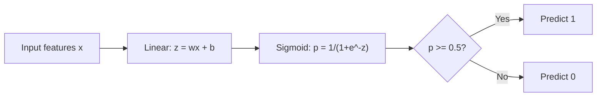
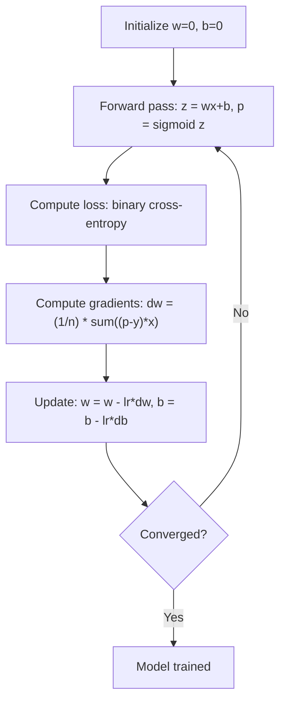

# Logistik Geri Dönüş
# 逻辑回归


> Lojiistik gerileme, olasılıklarla evet veya hayır sorularına cevap vermek için düz çizgiyi S eğriye eğer.

> 逻辑回归将直线成 S 形曲线,概率 ile yanıtlı olarak是非问题──

**Type:** Build | **类型：** 构建
**Languages:** Python
**Prerequisites:** Phase 2 Lesson 1-2 (What Is ML, Linear Regression) | **前置知识：** Phase 2 第 1-2 课（什么是机器学习、线性回归）
**Time:** ~90 minutes | **时间：** 约 90 分钟

## Öğrenme hedefleri

- Sigmoid işlevi ve ikili çapraz entropi kaybı kullanarak sıfırdan lojistik geri dönüşü uygulayın
  Züreyi gerçekleştirmek için geri dönüş, Sigmoid  işlevi ve ikili交叉 損失
- Bilgisayar ve yorumlama doğruluğu, hatırlama, F1 puanı ve ikili sınıflandırma için karışıklık matrisi
  計算并解释精确率 (Precision) 召回率 (Rekall)  F1 分数和混矩阵
- MSE'nin sınıflandırılmayı neden başarısız ettiğini ve ikili çapraz entropi'nin neden konveks bir maliyet yüzeyini ürettiğini açıklayın.
  解释为什么平均方差 (MSE) 分类任务不适合,以及为什么二元交叉能产生凸的价格曲面
- Çoklu sınıflandırma için softmax gerileme modeli oluşturun ve eşiğin ayarlama anlaşmaları değerlendirin
  构建 Softmax 回归模型进行多类,并评估值调优的权衡


> **【中文解读】**
> Logik geri dönüşüm, iki sınıf bir temel taşdır. Sigmoid işlevi ile 線性输出映射到 [0,1] 概率── although called geri dönüşüm, but it is a分类器──sklearn 內的 LogisticRegression──信用卡欺诈检查──疾病诊断都可用逻辑 geri dönüşüm──

> **【拓展：逻辑回归在工业界的广泛应用】**
> Facebook'un erken reklam atış oranı tahmin sistemi, mantıksal geri dönüşe dayanır; Google'ın arama reklamlarının CTR'si, mantıksal geri dönüşe de uzun süre kullanılır. Daha sonra derin öğrenme için yükseltilmiştir.

## Sorunlar. Sorunlar.

Bir tümörün büyüklüğü bakıldığında kötü huylu veya iyi huylu olup olmadığını tahmin etmek istersiniz. Düzsel geri dönüş denersiniz. 0.3 veya 1.7 veya -0.5 gibi sayılarda sonuçlar verir. Bunlar ne anlama gelir? 1.7 "çok kötü huylu" mu? -0.5 "çok iyi huylu" mu? Düzsel geri dönüş sınırsız sayılarda sonuçlar verir. Sınıflandırmaya 0 ile 1 arasında sınırlı olasılıklar ve net bir karar gerekir: evet veya hayır.

> Bu rakamların anlamı nedir? 1.7 çok kötüdür? 0.5 çok iyidür? Linear geri dönüşün sonucu sınırsız rakamlardır. 0 ile 1 arasındaki sınırlı olasılığı ve kesin bir karar: evet veya hayır.

Logistik gerileme bunu çözür. Aynı doğrusal kombinasyonu (wx + b) alır ve herhangi bir sayıyı (0, 1) aralığına sıyrarak sigmoid işlevi üzerinden geçer.

> 逻辑归归解决了这个问题──它取同样线性组合 (wx + b),通过Sigmoid 函数将任意数字压缩到 (0, 1) 范围内──输出是一个概率──你设定一个值(通常0.5) 决策──

Bu uygulamalarda en yaygın kullanılan algoritmalardan biridir. Adına rağmen, lojistik gerileme bir sınıflandırma algoritması, gerileme algoritması değil. Adı kullanıldığı lojistik (sigmoid) işleviyle gelir.

> Bu uygulamada en yaygın kullanılan algoritmalardan biridir. Bu isimde "gelişme" olmasına rağmen, logjik geriliş bir sınıf algoritmasıdır, geriliş algoritması değildir.

> **【中文解读】**
> 线性归归不能直接用于分类:它的输出是无界的实数(-∞至 +∞),而分类需要0-1 之间的概率──逻辑归归通过Sigmoid 函数将线性输出"挤压"到 (0,1) 区间,从而输出概率──设值(通常0.5) 即可做出二分类决策──Sigmoid's导数形式简洁:σ'(z) = σ(z) 1-σ(z)),使梯度计算高效──

## Konsepten bir şey.

### Neden Düzsel Geri Dönüştürme Klasikasyonda Başarısız

Çalışma saatlerine dayanarak geçiş/başarısızlık tahminini hayal edin.

> 想象根据学习时间预测通过/不通过(1/0)。线性归归拟合一根直线穿过数据:

```
hours:  1   2   3   4   5   6   7   8   9   10
actual: 0   0   0   0   1   1   1   1   1   1
```

Bir doğrusal uyumlama saat 1'de -0.2 ve saat 10'da 1.3 gibi tahminler üretebilir. Bu değerler olasılıklar değildir. 0'dan aşağı ve 1'den yukarı giderler. Daha da kötüsü, tek bir dışa çıkış (50 saat incelediği biri) tüm çizgiyi sürükler ve herkes için tahminleri değiştirir.

> 线性拟合可能在 1 小时内产生 -0.2 预测,在 10 小时内产生 1.3 预测──这些值不是概率──它们低于0或超过1──更糟的是,单个异常值(学习了50 小时的人) 将拖动整条线,改变所有者的预测──

Sınıflandırma, aşağıdaki fonksiyona ihtiyaç duyar:
- 0 ile 1 arasındaki çıkış değerleri (muhtemelenlikler)
  输出 0                                                                                                                                                                                                                                                                                                                                                                                                                                                                                                                          
- Keskin bir geçiş yaratır (bir karar sınırı)
  创建急剧过渡 (Hükümetin kararlılığı)
- Sınırdan uzak bir sıradanlık tarafından çarpıtılmamıştır
  Sınırdan uzak olmayan anormal değerler çarpıklığı

> 分类 bir işlevi gerektirir,

### Sigmoid Fonksiyonu

Sigmoid fonksiyonu tam olarak bunu yapar:

> Sigmoid 函数恰好 bunu yaptı:

```
sigmoid(z) = 1 / (1 + e^(-z))
```

Özellikleri:
- Z büyük ve pozitif olduğunda, sigmoid ((z) 1'e yaklaşır.
  Z = 1'e yakınlaşırken,
- Z büyük ve negatif olduğunda, sigmoid ((z) 0'ya yaklaşır.
  Z = 0 = 0 = 0 = 0 = 0 = 0 = 0 = 0 = 0 = 0 = 0 = 0 = 0 = 0 = 0 = 0 = 0 = 0 = 0 = 0 = 0 = 0 = 0 = 0 = 0 = 0 = 0 = 0 = 0 = 0 = 0 = 0 = 0 = 0 = 0 = 0 = 0 = 0 = 0 = 0 = 0 = 0 = 0 = 0 = 0 = 0 = 0 = 0 = 0 = 0 = 0 = 0 = 0 = 0 = 0 = 0 = 0 = 0 = 0 = 0 = 0 = 0 = 0 = 0 = 0 = 0 = 0 = 0 = 0 = 0 = 0 = 0 = 0 = 0 = 0 = 0 = 0 = 0 = 0 = 0 = 0 = 0 = 0 = 0 = 0 = 0 = 0 = 0 = 0 = 0 = 0 = 0 = 0 = 0 = 0 = 0 = 0 = 0 = 0 = 0 = 0 = 0 = 0 = 0 = 0 = 0 = 0 = 0 = 0 = 0 = 0 = 0 = 0 = 0 = 0 = 0 = 0 = 0 = 0 = 0 = 0 = 0 = 0 = 0 = 0 = 0 = 0 = 0 = 0 = 0 = 0 = 0 = 0 = 0 = 0 = 0 = 0 = 0 = 0 = 0 = 0 0 0 0 = 0 = 0 0 = 0 0 0 = 0 0 0 0 0 0 0 0 0 0 0 0 0 0 0 0 0 0 0 0 0 0 0 0 0 0 0 0 0 0 0 0 0 0 0 0 0 0 0 0 0 0 0 0 0 0 0 0 0 0 0 0 0 0 0 0 0 0 0 0 0 0 0 0 0 0 0 0 0 0 0 0 0 0 0 0 0 0 0 0 0 0 0 0 0 0 0 0 0 0 0 0 0 0 0 0 0 0 0 0 0 0 0 0 0 0 0 0 0 0 0 0 0 0 0 0 0 0 0 0 0 0 0 0 0 0 0 0 0 0 0 0 0 0 0 0 0 0 0 0 0 0 0 0 0 0 0 0 0 0 0 0 0 0 0 0 0 0 0 0 0 0 0 0 0 0 0 0 0 0 0 0 0 0 0 0 0 0 0 0 0 0 0 0 0 0 0 0 0 0 0 0 0 0 0 0 0 0 0 0 0 0 0 0 0 0 0 0 0 0 0 0 0 0
- Z = 0, sigmoid(z) = 0,5 olduğunda
  当 z = 0 时,sigmoid(z) = 0.5
- Çıktı her zaman 0 ile 1 arasında
  输出始终在0 和 1 之间
- İşlev her yerde düzgün ve farklılık gösterir
  函数处处平滑可微

Delivyenin uygun bir şekli vardır: sigmoid'(z) = sigmoid(z) * (1 - sigmoid(z)). Bu gradient hesaplamasını verimli kılar.

> 导数, kolay bir biçimde vardır:sigmoid'(z) = sigmoid(z) * (1 - sigmoid(z))。 Bu da gradiente hesaplama çok yüksek bir etki sağlar。

### Logistik Geri Dönüş = Düzsel Model + Sigmoid

Model z = wx + b (sadece doğrusal gerileme olarak) hesaplar ve sonra sigmoid uyguluyor:

> 模型计算 z = wx + b(与线性归归相同), sonra Sigmoid uygulamak:



Çıktı p P ((y=1)) olarak yorumlanır. Girişlerin 1. sınıfına ait olma olasılığı. Karar sınırı wx + b = 0 olduğu yerde, bu da sigmoid çıkışını tam olarak 0.5 yapar.

> 输出 p olarak açıklanır P(y=1 x), yani input sınıf 1'nin olasılığı── karar sınırı wx + b = 0'de, bu durumda Sigmoid 输出恰好为0.5──

### Biner çapraz entropik kaybı

MSE'yi lojistik gerileme için kullanamazsınız. Sigmoid ile MSE, birçok yerel minimum ile konveks olmayan bir maliyet yüzeyini oluşturur.

> Siz MSE kullanmak için mantıksal geri dönüş yapamazsınız. MSE ile birlikte Sigmoid bir yapı oluşturmak için çok sayıda yerel en az değer vardır.

```
Loss = -(1/n) * sum(y * log(p) + (1-y) * log(1-p))
```

Neden işe yarıyor:
- Y=1 ve p 1: log(1) = 0'ya yakın olduğunda, kaybı 0'ya yakın olur (doğru, düşük maliyet)
  Y = 1 ve p = yakın 1 时:log(1) = 0, kaybı yakın 0(正确,低代价)
- Y=1 ve p 0'ya yakın olduğunda: log(0) negatif sonsuzluk yaklaşır, bu yüzden kayıp büyüktür (hatalı, yüksek maliyet)
  当 y=1 且 p 接近 0 时:log(0) 趋向负无穷,损失极大(错误,高代价)
- Y=0 ve p 0'ya yakın olduğunda: log(1) = 0, bu nedenle kaybı 0'ya yakın (doğru, düşük maliyet)
  0 = 0 ve p = 0 yakın: log(1) = 0, kaybı 0 yakın (正确,低代价)
- Y=0 ve p 1: log(0) yakın olduğunda negatif sonsuzluk yaklaşır, bu yüzden kayıp büyüktür (hatalı, yüksek maliyet)
  当 y=0 且 p 接近 1 时:log(0) 趋向负无穷,损失极大(错误,高代价)

Bu kayıp işlevi, lojistik gerileme için eğri ve tek bir küresel minimum garanti eder.

> Bu kayıp işlevi, mantıksal geri dönüş için bir kamsal işlevi, tek bir tümsel en az değere sahip olduğunu garanti eder.

> **【中文解读】**
> Neden 分类不能使用 MSE? MSE + Sigmoid 会产生非凸的损失函数曲面,存在许多局部最小值,梯度下降可能卡住;;二元交叉(log loss) Logiğe geri dönüşü凸函数,保证找到全局最佳解解;;核心原理:正确预测时损失趋近0,错误预测且高信度时损失趋向无穷"错得越自信,惩罚越重"

> **【拓展：交叉熵损失在深度学习中的核心地位】**
> 交叉损失 sadece mantıksal geri dönüş için kullanılmaz, tüm 分类 神经网络的标配损失函数――GPT'nin dil modeli eğitimi esasında sözcük şöyelerine karşı softmax yapmak + 交叉损失 Her adım ön tahmin bir sonraki simge, bir kez milyonlarca türden 分类问题――ResNet yapmak ImageNet 分类 ((1000 类) 交叉损失也使用交叉损失――理解交叉是理解深度学习训练机制的基础――

### Logistik Geri Dönüşüm için Aralıklı Düşüş

Sigmoid ile ikili çapraz entropi için gradientler temiz bir formda bulunur:

> Sigmoid'in                                                                                                                                                                                                                                                             

```
dL/dw = (1/n) * sum((p - y) * x)
dL/db = (1/n) * sum(p - y)
```

Bunlar doğrusal gerileme gradiyentilerine benzer görünüyor. Fark ise p = sigmoid(wx + b) yerine p = wx + b. Sigmoid doğrusal olmayanlığı tanıtır, ancak gradient güncelleme kuralı aynı kalır.

> Bunlar, ırkın geri dönüş derecesi ile tamamen aynı görünüyor. Farklılık p = sigmoid(wx + b) değil p = wx + b değil. Sigmoid ırkın dışı bir şekilde kullanılmıştır.

> **【中文解读】**
> 逻辑归归的梯度公式与线性归归惊人地相似:`dL/dw = (1/n) * sum((p-y)*x)`◊ tek fark p = sigmoid(wx+b) ve p = wx+b değil. Bu, Sigmoid 和交叉'in kombinasyonunun matematiğin karmaşıklıklarını "刚好" olarak ortadan kaldırması nedeniyle, gradient biçimini çok basit kılıyor.



### Karar Sınırı

2D giriş için (iki özellik), karar sınırı, aşağıdaki çizgidir:

> 2D 输入 için iki özellik), karar sınırları aşağıdaki düz çizgilerdir:

```
w1*x1 + w2*x2 + b = 0
```

Bir tarafta noktalar 1 olarak sınıflandırılır, diğer tarafta 0 olarak sınıflandırılır. Logistik geri dönüş her zaman doğrusal bir karar sınırı üretir. Eğer eğri bir sınırı istiyorsanız, ya polinom özellikleri eklersiniz ya da doğrusal olmayan bir model kullanırsınız.

> Bir tarafta nokta 1 olarak sınıflandırılır, diğer tarafta 0 olarak sınıflandırılır. Logiği geri dönüşü daima doğrusal karar sınırları oluşturur. Eğer 曲的边界 gerekiyorsa, çoklu özellikler eklemek veya doğrusal olmayan modeller kullanmak gerekir.

### Softmax ile çok sınıf sınıflandırma

İkili lojistik gerileme iki sınıfı ele alır. k sınıfları için softmax fonksiyonunu kullanın:

> İki sınıfı işleme için Softmax işlevi kullanılır:

```
softmax(z_i) = e^(z_i) / sum(e^(z_j) for all j)
```

Her sınıfın kendi ağırlık vektörü vardır. Model her sınıf için bir puan z_i hesaplar, sonra softmax puanları 1'e toplam olasılıklara dönüştürür.

> Her sınıfın kendi ağırlık vektörü vardır. Model her sınıf için bir sayı z_i hesaplar, sonra Softmax, sayıları toplam ve 1 olasılığına dönüştürür.

Kayıp işlevi kategorik çapraz entropiye dönüşür:

> 损失函数变为分类交叉:

```
Loss = -(1/n) * sum(sum(y_k * log(p_k)))
```

y_k gerçek sınıf için 1 ve diğer tüm sınıflar için 0 (bir sıfır kodlama) olduğu yerlerde.

> İçlerinden 1 için gerçek sınıf, 0 için diğerleri için 1 için 编码)

### Değerlendirme Metrikleri

Sadece doğruluk yeterli değildir. %95 negatif ve %5 pozitif olan bir veri kümesi için, her zaman negatif tahmin eden bir model %95 doğruluk elde eder ancak işe yaramaz.

> Sadece doğru oranla güvenmek yeterli değildir. %95 olumsuz örneklerle %5 olumsuz örneklerle ilgili bir veri kümesi için, her zaman olumsuz örneklerle öngörülen bir model %95 doğruluk oranını elde eder, ancak hiçbir işe yaramaz.

**Confusion Matrix**- ...

> **混淆矩阵**- ...

| | Predicted Positive | Predicted Negative |
|---|---|---|
| Actually Positive | True Positive (TP) | False Negative (FN) |
| Actually Negative | False Positive (FP) | True Negative (TN) |

| | 预测为正 | 预测为负 |
|---|---|---|
| 实际为正 | 真正例 (TP) | 假负例 (FN) |
| 实际为负 | 假正例 (FP) | 真负例 (TN) |

**Precision**Tüm öngörülen olumlu sonuçlardan kaçı aslında olumlu?
```
Precision = TP / (TP + FP)
```

> **精确率**Tüm tahminlerin doğru olduğu örneklerden, ne kadar gerçek doğru var?

**Recall**(Sensitivite): Tüm olumlu sonuçlardan kaç tane yakaladık?
```
Recall = TP / (TP + FN)
```

> **召回率**(Sensillik): Tüm gerçek örnekler arasında, ne kadar bulmuştuk?

**F1 Score**: Harmonik kesim kesimleri, doğru ve geri çağırma.
```
F1 = 2 * (Precision * Recall) / (Precision + Recall)
```

> **F1 分数**: Detaksiyon oranı ve geri dönüş oranı düzenlemesi ve ortalaması.

Öncelikleri ne zaman belirleyin:
- **Precision**: yanlış pozitiflerin maliyetli olduğu zaman (spam filtre, meşru e-postaları engellemek istemezsiniz)
  **精确率**Bu yüzden, bu durumun bir sonucu olarak, bu durumun bir sonucu olarak, bu durumun bir sonucu olarak, bu durumun bir sonucu olarak, bu durumun bir sonucu olarak, bu durumun bir sonucu olarak, bu durumun bir sonucu olarak, bu durumun bir sonucu olarak, bu durumun bir sonucu olarak, bu durumun bir sonucu olarak, bu durumun bir sonucu olarak, bu durumun bir sonucu olarak, bu durumun bir sonucu olarak, bu durumun bir sonucu olarak, bir sonucu olarak, bir sonucu olarak, bir sonucu olarak, bir sonucu olarak, bir sonucu olarak, bir sonucu olarak, bir sonucu olarak, bir sonucu olarak, bir sonucu olarak, bir sonucu olarak, bir sonucu olarak, bir sonuca var.
- **Recall**: yanlış negatiflerin maliyetli olduğu (kanser taraması, tümörü kaçırmak istemezsiniz)
  **召回率**Bu yüzden, bu durumdan sonra, bu durumdan kurtulmak için bir süre daha beklemiyorum.
- **F1**: tek dengeli bir metrik gerekirse
  **F1**Bir dengeleme tek bir gösterge zaman

>  öncelikli olarak hangi göstergeyi göz önünde bulundurmak gerekir:

> **【中文解读】**
> Klas değerlendirmesi sadece doğruluk oranını göremez. Klass dengesizlik durumunda (örneğin, sahtekarlık testi sadece %0,1 oranında) tüm öngörü olumsuz durumlarda %99.9 doğruluk oranı vardır ama hiçbir değeri yoktur.

> **【拓展：评估指标在真实系统中的选择】**
> Google'da arama yapılmış çöp sayfaları kontrolü öncelikli doğruluk oranı(Neredeyse bazı çöp sayfalarını bırakabilirsiniz, normal sayfaları yanlışlıkla çöp olarak değerlendirebilirsiniz); tıbbi görüntüler AI(Google Sağlığı'nın meme kanseri testi gibi) öncelikli çağırma oranı(Neredeyse daha fazla sahte olumsuz bir şekilde doktoru tekrar görmesine izin vererek gerçek bir tümörü bile kaçıramazsınız); Otomatik sürücülerin sürücü kontrolü kuralları doğruluk oranı ve çağırma oranı talep eder, F1 daha uygun bir genel göstergedir.
```figure
logistic-sigmoid
```

## Yapın

### Adım 1: Sigmoid fonksiyonu ve veri üretimi

```python
import random
import math

def sigmoid(z):
    z = max(-500, min(500, z))  # 裁剪防止数值溢出
    return 1.0 / (1.0 + math.exp(-z))  # Sigmoid 函数：将任意实数映射到 (0,1)


random.seed(42)
N = 200
X = []
y = []

# 生成类别 0 的数据：中心在 (2,2)
for _ in range(N // 2):
    X.append([random.gauss(2, 1), random.gauss(2, 1)])
    y.append(0)

# 生成类别 1 的数据：中心在 (5,5)
for _ in range(N // 2):
    X.append([random.gauss(5, 1), random.gauss(5, 1)])
    y.append(1)

combined = list(zip(X, y))
random.shuffle(combined)
X, y = zip(*combined)
X = list(X)
y = list(y)

print(f"Generated {N} samples (2 classes, 2 features)")
print(f"Class 0 center: (2, 2), Class 1 center: (5, 5)")
print(f"First 5 samples:")
for i in range(5):
    print(f"  Features: [{X[i][0]:.2f}, {X[i][1]:.2f}], Label: {y[i]}")
```

### Adım 2: Lojiistik geri dönüş sıfırdan

```python
class LogisticRegression:
    def __init__(self, n_features, learning_rate=0.01):
        self.weights = [0.0] * n_features  # 权重初始化为 0
        self.bias = 0.0  # 偏置初始化为 0
        self.lr = learning_rate  # 学习率
        self.loss_history = []  # 记录训练损失

    def predict_proba(self, x):
        z = sum(w * xi for w, xi in zip(self.weights, x)) + self.bias  # 线性组合 z = wx + b
        return sigmoid(z)  # 通过 Sigmoid 得到概率

    def predict(self, x, threshold=0.5):
        return 1 if self.predict_proba(x) >= threshold else 0  # 概率 >= 阈值则预测为 1

    def compute_loss(self, X, y):
        n = len(y)
        total = 0.0
        for i in range(n):
            p = self.predict_proba(X[i])
            p = max(1e-15, min(1 - 1e-15, p))  # 裁剪防止 log(0)
            # 二元交叉熵损失
            total += y[i] * math.log(p) + (1 - y[i]) * math.log(1 - p)
        return -total / n  # 取负号得到正值损失

    def fit(self, X, y, epochs=1000, print_every=200):
        n = len(y)
        n_features = len(X[0])
        for epoch in range(epochs):
            dw = [0.0] * n_features
            db = 0.0
            for i in range(n):
                p = self.predict_proba(X[i])
                error = p - y[i]  # 预测概率 - 真实标签
                for j in range(n_features):
                    dw[j] += error * X[i][j]  # 累积权重梯度
                db += error  # 累积偏置梯度
            # 梯度下降更新参数
            for j in range(n_features):
                self.weights[j] -= self.lr * (dw[j] / n)
            self.bias -= self.lr * (db / n)
            loss = self.compute_loss(X, y)
            self.loss_history.append(loss)
            if epoch % print_every == 0:
                print(f"  Epoch {epoch:4d} | Loss: {loss:.4f} | w: [{self.weights[0]:.3f}, {self.weights[1]:.3f}] | b: {self.bias:.3f}")
        return self

    def accuracy(self, X, y):
        correct = sum(1 for i in range(len(y)) if self.predict(X[i]) == y[i])
        return correct / len(y)


split = int(0.8 * N)
X_train, X_test = X[:split], X[split:]
y_train, y_test = y[:split], y[split:]

print("\n=== Training Logistic Regression ===")
model = LogisticRegression(n_features=2, learning_rate=0.1)
model.fit(X_train, y_train, epochs=1000, print_every=200)

print(f"\nTrain accuracy: {model.accuracy(X_train, y_train):.4f}")
print(f"Test accuracy:  {model.accuracy(X_test, y_test):.4f}")
print(f"Weights: [{model.weights[0]:.4f}, {model.weights[1]:.4f}]")
print(f"Bias: {model.bias:.4f}")
```

### Adım 3: Kafanın matrisi ve ölçümleri sıfırdan

```python
class ClassificationMetrics:
    def __init__(self, y_true, y_pred):
        # 统计混淆矩阵四个值
        self.tp = sum(1 for t, p in zip(y_true, y_pred) if t == 1 and p == 1)  # 真正例
        self.tn = sum(1 for t, p in zip(y_true, y_pred) if t == 0 and p == 0)  # 真负例
        self.fp = sum(1 for t, p in zip(y_true, y_pred) if t == 0 and p == 1)  # 假正例
        self.fn = sum(1 for t, p in zip(y_true, y_pred) if t == 1 and p == 0)  # 假负例

    def accuracy(self):
        total = self.tp + self.tn + self.fp + self.fn
        return (self.tp + self.tn) / total if total > 0 else 0

    def precision(self):
        denom = self.tp + self.fp
        return self.tp / denom if denom > 0 else 0

    def recall(self):
        denom = self.tp + self.fn
        return self.tp / denom if denom > 0 else 0

    def f1(self):
        p = self.precision()
        r = self.recall()
        return 2 * p * r / (p + r) if (p + r) > 0 else 0

    def print_confusion_matrix(self):
        print(f"\n  Confusion Matrix:")
        print(f"                  Predicted")
        print(f"                  Pos   Neg")
        print(f"  Actual Pos     {self.tp:4d}  {self.fn:4d}")
        print(f"  Actual Neg     {self.fp:4d}  {self.tn:4d}")

    def print_report(self):
        self.print_confusion_matrix()
        print(f"\n  Accuracy:  {self.accuracy():.4f}")
        print(f"  Precision: {self.precision():.4f}")
        print(f"  Recall:    {self.recall():.4f}")
        print(f"  F1 Score:  {self.f1():.4f}")


y_pred_test = [model.predict(x) for x in X_test]
print("\n=== Classification Report (Test Set) ===")
metrics = ClassificationMetrics(y_test, y_pred_test)
metrics.print_report()
```

### 4. Adım: Karar sınırları analizi

```python
print("\n=== Decision Boundary ===")
w1, w2 = model.weights
b = model.bias
print(f"Decision boundary: {w1:.4f}*x1 + {w2:.4f}*x2 + {b:.4f} = 0")
if abs(w2) > 1e-10:
    print(f"Solved for x2:     x2 = {-w1/w2:.4f}*x1 + {-b/w2:.4f}")

print("\nSample predictions near the boundary:")
test_points = [
    [3.0, 3.0],
    [3.5, 3.5],
    [4.0, 4.0],
    [2.5, 2.5],
    [5.0, 5.0],
]
for point in test_points:
    prob = model.predict_proba(point)
    pred = model.predict(point)
    print(f"  [{point[0]}, {point[1]}] -> prob={prob:.4f}, class={pred}")
```

### Adım 5: Softmax ile çok sınıflı

```python
class SoftmaxRegression:
    def __init__(self, n_features, n_classes, learning_rate=0.01):
        self.n_features = n_features
        self.n_classes = n_classes
        self.lr = learning_rate
        self.weights = [[0.0] * n_features for _ in range(n_classes)]
        self.biases = [0.0] * n_classes

    def softmax(self, scores):
        max_score = max(scores)
        exp_scores = [math.exp(s - max_score) for s in scores]
        total = sum(exp_scores)
        return [e / total for e in exp_scores]

    def predict_proba(self, x):
        scores = [
            sum(self.weights[k][j] * x[j] for j in range(self.n_features)) + self.biases[k]
            for k in range(self.n_classes)
        ]
        return self.softmax(scores)

    def predict(self, x):
        probs = self.predict_proba(x)
        return probs.index(max(probs))

    def fit(self, X, y, epochs=1000, print_every=200):
        n = len(y)
        for epoch in range(epochs):
            grad_w = [[0.0] * self.n_features for _ in range(self.n_classes)]
            grad_b = [0.0] * self.n_classes
            total_loss = 0.0
            for i in range(n):
                probs = self.predict_proba(X[i])
                for k in range(self.n_classes):
                    target = 1.0 if y[i] == k else 0.0
                    error = probs[k] - target
                    for j in range(self.n_features):
                        grad_w[k][j] += error * X[i][j]
                    grad_b[k] += error
                true_prob = max(probs[y[i]], 1e-15)
                total_loss -= math.log(true_prob)
            for k in range(self.n_classes):
                for j in range(self.n_features):
                    self.weights[k][j] -= self.lr * (grad_w[k][j] / n)
                self.biases[k] -= self.lr * (grad_b[k] / n)
            if epoch % print_every == 0:
                print(f"  Epoch {epoch:4d} | Loss: {total_loss / n:.4f}")
        return self

    def accuracy(self, X, y):
        correct = sum(1 for i in range(len(y)) if self.predict(X[i]) == y[i])
        return correct / len(y)


random.seed(42)
X_3class = []
y_3class = []

centers = [(1, 1), (5, 1), (3, 5)]
for label, (cx, cy) in enumerate(centers):
    for _ in range(50):
        X_3class.append([random.gauss(cx, 0.8), random.gauss(cy, 0.8)])
        y_3class.append(label)

combined = list(zip(X_3class, y_3class))
random.shuffle(combined)
X_3class, y_3class = zip(*combined)
X_3class = list(X_3class)
y_3class = list(y_3class)

split_3 = int(0.8 * len(X_3class))
X_train_3 = X_3class[:split_3]
y_train_3 = y_3class[:split_3]
X_test_3 = X_3class[split_3:]
y_test_3 = y_3class[split_3:]

print("\n=== Multi-class Softmax Regression (3 classes) ===")
softmax_model = SoftmaxRegression(n_features=2, n_classes=3, learning_rate=0.1)
softmax_model.fit(X_train_3, y_train_3, epochs=1000, print_every=200)
print(f"\nTrain accuracy: {softmax_model.accuracy(X_train_3, y_train_3):.4f}")
print(f"Test accuracy:  {softmax_model.accuracy(X_test_3, y_test_3):.4f}")

print("\nSample predictions:")
for i in range(5):
    probs = softmax_model.predict_proba(X_test_3[i])
    pred = softmax_model.predict(X_test_3[i])
    print(f"  True: {y_test_3[i]}, Predicted: {pred}, Probs: [{', '.join(f'{p:.3f}' for p in probs)}]")
```

### Adım 6: Eğitme eşiği ayarlama

```python
print("\n=== Threshold Tuning ===")
print("Default threshold: 0.5. Adjusting the threshold trades precision for recall.\n")

thresholds = [0.3, 0.4, 0.5, 0.6, 0.7]
print(f"{'Threshold':>10} {'Accuracy':>10} {'Precision':>10} {'Recall':>10} {'F1':>10}")
print("-" * 52)

for t in thresholds:
    y_pred_t = [1 if model.predict_proba(x) >= t else 0 for x in X_test]
    m = ClassificationMetrics(y_test, y_pred_t)
    print(f"{t:>10.1f} {m.accuracy():>10.4f} {m.precision():>10.4f} {m.recall():>10.4f} {m.f1():>10.4f}")
```

## Çerçeveyi kullanın.

Şimdi de tıpkı tıpkı tıpkı tıpkı tıpkı tıpkı tıpkı tıpkı tıpkı tıpkı tıpkı tıpkı tıpkı tıpkı tıpkı tıpkı tıpkı tıpkı tıp gibi.

> Şimdi küçük bir öğrenme ile aynı işlevleri gerçekleştirmek için.

```python
from sklearn.linear_model import LogisticRegression as SklearnLR
from sklearn.metrics import accuracy_score, precision_score, recall_score, f1_score
from sklearn.metrics import confusion_matrix, classification_report
from sklearn.model_selection import train_test_split
from sklearn.preprocessing import StandardScaler
import numpy as np

np.random.seed(42)
X_0 = np.random.randn(100, 2) + [2, 2]
X_1 = np.random.randn(100, 2) + [5, 5]
X_sk = np.vstack([X_0, X_1])
y_sk = np.array([0] * 100 + [1] * 100)

X_tr, X_te, y_tr, y_te = train_test_split(X_sk, y_sk, test_size=0.2, random_state=42)

scaler = StandardScaler()
X_tr_sc = scaler.fit_transform(X_tr)
X_te_sc = scaler.transform(X_te)

lr = SklearnLR()
lr.fit(X_tr_sc, y_tr)
y_pred = lr.predict(X_te_sc)

print("=== Scikit-learn Logistic Regression ===")
print(f"Accuracy:  {accuracy_score(y_te, y_pred):.4f}")
print(f"Precision: {precision_score(y_te, y_pred):.4f}")
print(f"Recall:    {recall_score(y_te, y_pred):.4f}")
print(f"F1:        {f1_score(y_te, y_pred):.4f}")
print(f"\nConfusion Matrix:\n{confusion_matrix(y_te, y_pred)}")
print(f"\nClassification Report:\n{classification_report(y_te, y_pred)}")
```

Scikit-learn çözücü seçeneklerini (liblinear, lbfgs, saga), otomatik düzenlendirme, çok sınıflı stratejiler (bir vs. geri kalan, çok sayısal) ve sayısal istikrar optimizasyonlarını ekler.

> Çizimlerin sınırları ve göstergeleri aynıdır.

## İndirin . Ürünler .

Bu ders şunları ortaya çıkarır:
- `code/logistic_regression.py`- metriklerle sıfırdan lojistik geri dönüş

> 本课产 出:
> - `code/logistic_regression.py`- Çıktırılmadan gerçekleşen mantıksal geri dönüş ve değerlendirme göstergesi

## Egzersizler.

1. Düzsel olarak ayırılabilir olmayan bir veri kümesi oluşturun (örneğin iki konsentrik döngü). Logistik gerilemeyi çalıştırın ve başarısızlığını gözlemleyin.
   1. Bir tane oldu.**非**线性可分的数据集 (例如两个同心圆) 』; 线性可分的数据集 (例如两个同心圆) 』; 线性可分的数据集 (例如两个同心圆) 』; 线性可分的数据集 (例如两个同心圆) 』; 线性可分的数据集 (例如两个同心圆) 』; 线性可分的数据集 (例如两个同心圆) 』; 线性可分的数据集 (例如两个同心圆) 』; 线性可分的数据集 (例如两个同心圆) 』; 线性可分的数据集 (例如两个同心圆) 』; 线性可分的数据集 (例如两个同心圆) 』; 线性可分的数据集 (例如两个同心圆) 』; 线性可分的数据集 (例如两个同心圆) 』; 线性可分的数据集 (例如 x1^2, x2^2, x2^2, x1^2, x1^2); 线性可分的数据集 (再训练) ;; 显示准确率的提升率的提升率;
2. 3 sınıf softmax modeli için bir çok sınıf karışıklık matrisi uygulayın.
   2. 3 sınıf Softmax modeli, birçok sınıf karışıklığı matçını gerçekleştirir.
3. 0'dan 1'e kadar 100 eşiğin değerleri için gerçek pozitif oranı ve yanlış pozitif oranı hesaplayın.
   3. 0'dan 1'e kadar 100  değer için, gerçek durum oranı ve sahte durum oranı hesaplanır.

## Anahtar Şartlar .

| Term | What people say | What it actually means |
|------|----------------|----------------------|
| Logistic regression | "Regression for classification" | A linear model followed by a sigmoid function that outputs class probabilities |
| Sigmoid function | "The S-curve" | The function 1/(1+e^(-z)) that maps any real number to the range (0, 1) |
| Binary cross-entropy | "Log loss" | The loss function -[y*log(p) + (1-y)*log(1-p)] that penalizes confident wrong predictions severely |
| Decision boundary | "The dividing line" | The surface where the model's output probability equals 0.5, separating predicted classes |
| Softmax | "Multi-class sigmoid" | A function that converts a vector of scores into probabilities that sum to 1 |
| Precision | "How many selected are relevant" | TP / (TP + FP), the fraction of positive predictions that are actually positive |
| Recall | "How many relevant are selected" | TP / (TP + FN), the fraction of actual positives that the model correctly identifies |
| F1 score | "Balanced accuracy" | The harmonic mean of precision and recall: 2*P*R / (P+R) |
| Confusion matrix | "The error breakdown" | A table showing TP, TN, FP, FN counts for each class pair |
| Threshold | "The cutoff" | The probability value above which the model predicts class 1 (default 0.5, tunable) |
| One-hot encoding | "Binary columns for categories" | Representing class k as a vector of zeros with a 1 at position k |
| Categorical cross-entropy | "Multi-class log loss" | The extension of binary cross-entropy to k classes using one-hot encoded labels |
