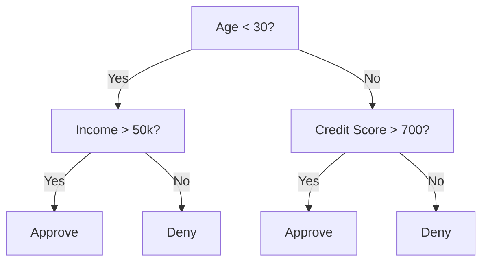
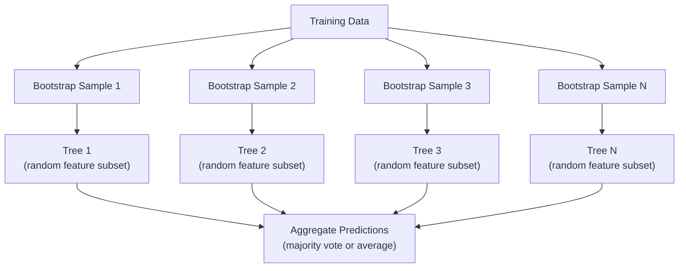

# Karar ağaçları ve rastgele ormanlar
# 决策树与随机森林


> Bir karar ağacı sadece bir akış haritasıdır. Ama bir orman, ML'de en güçlü araçlardan biridir.

> Bir karar ağacı bir süreç çizgisidir. Ama ormanlardan oluşan bir parça, makine öğrenmesinin en güçlü araçlarından biridir.

**Type:** Build | **类型：** 构建
**Language:**Python .**语言：**Python
**Prerequisites:** Phase 1 (Lessons 09 Information Theory, 06 Probability) | **前置知识：** Phase 1（第 9 课信息论、第 6 课概率论）
**Time:** ~90 minutes | **时间：** 约 90 分钟

## Öğrenme hedefleri

- Optimal karar ağacı bölünmeleri bulmak için Gini kirliliği, entropi ve bilgi kazanç hesaplamalarını uygulayın
  实现 Gini 不纯度、和信息增益计算, en iyi kararlar
- Ön kesim kontrolleriyle bir karar ağacı sınıflandırıcısı oluşturmak (maksimum derinlik, minimum örnekler)
  0 yapı ile birlikte ön kesim kontrolü ile (en büyük derinlik ve en küçük örnek sayısı) karar biçim biçimleri
- Bootstrap örneği ve özellik rastlantısını kullanarak rastgele bir orman inşa edin ve neden varyansiyi azaltdığını açıklayın
  Bootstrap kullanın 采样和特征随机化随机森林构建,并解释为什么它能降低方差
- MDI özelliklerinin önemini permutasyon önemine karşılaştırın ve MDI'nin tarafsız olduğunu belirleyin
  MDI özelliklerinin önemini ve değişim önemini karşılaştırın, MDI'nin farkı sorunu


> **【中文解读】**
> 决策树通过 if-else 规则分割数据,随机森林是多个决策树的投票组合――sklearn 中最常用模型之一――金融风控、医疗诊断中随机森林是基线模型――

> **【拓展：树模型在 Kaggle 和工业界的主导地位】**
> Kağıl  yapılandırılmış veri yarışmasında, yaklaşık %70'lik kazanç programı 梯度提升树 (HGBoost/LightGBM/CatBoost) kullanmaktadır. Finansal alanda, kredi değerleri, FICO %) geniş çapta karar verme ağacı değişikliği kullanmaktadır.

## Sorunlar. Sorunlar.

Tablo verileri var. Satırlar örnekler, sütunlar özellikler ve tahmin etmek istediğiniz bir hedef sütun vardır. Ona bir sinir ağı atabilirsiniz. Ancak tablo verileri için, ağaç tabanlı modeller (hüküm ağaçları, rastgele ormanlar, gradient artmış ağaçlar) sürekli derin öğrenmeyi üstlenir. Yapılandırılmış veriler üzerinde Kaggle yarışları XGBoost ve LightGBM tarafından egemenlik kazanılır, transformatörler değil.

> Sen bir tablo verisi var. Yol örneği, bir özellik, bir de tahmin etmek istediğin hedef bir dizi vardır. Sen sinir ağı ile işleyebilirsin.

Neden? Ağaçlar önceden işleme yapmadan karıştırılmış özellik türlerini (sayısal ve kategorik) işliyor. Özellik mühendisliği olmadan çizgisiz ilişkileri işliyor. Anlatabilir: ağaca bakabilir ve tahminlerin tam olarak neden yapıldığını görebilirsiniz.

> Neden? Ağaç modeli önceden işleme yapmaz karışık özellik türlerini işleyebilir. Ağaç modellerini neden bir tahmin yapmadığını anlayabilirsiniz.

Bu ders, geri dönüşlü bölünme kullanarak karar ağaçlarını sıfırdan inşa eder, sonra üstte rastgele bir orman inşa eder. Bölünme kriterlerinin arkasındaki matematiği uygulayacaksınız (Gini kirlilik, entropi, bilgi kazancı) ve zayıf öğrencilerin bir grubunun neden güçlü bir grup haline geldiğini anlayacaksınız.

> Bu ders, sıfırdan geri dönüştürülmüş bölünme yapma karar ağacını oluşturmak, sonra da üzerinde bölünme standartlarının arkasındaki matematikleri gerçekleştirmek için kullanılır.

> **【中文解读】**
> √√√√√√√√√√√√√√√√√√√√√√√√√√√√√√√√√√√√√√√√√√√√√√√√√√√√√√√√√√√√√√√√√√√√√√√√√√√√√√√√√√√√√√√√√√√√√√√√√√√√√√√√√√√√√√√√√√√√√√√√√√√√√√√√√√√√√√√√√√√√√√√√√√√√√√√√√√√√√√√√√√√√√√√√√√√√√√√√√√√√√√√√√√√√√√√√√√√√√√√√√√√√√√√√√√√√√√√√√√√√√√√√√√√√√√√√√√√√√√√√√√√√√√√√√√√√√√√√√√√√√√√√√√√√√√√√√√√√√√√√√√√√√√√√√√√√√√√√√√√√√√√√√√√√√√√√√√√√√√√√√√√√√√√√√√√√√√√√√√√√√√√√√√√√√√√√√√√√√√√√√√√√√√√√√√√√√√√√√√√√√√√√√√√√√√√√√√√√√√√√√√√√√√√√√√√√√√√√√√√√√√√√√√√√√√√√√√√√√√√√√√√√√√√√√√√√√√√√√√√√√√√√√√√√√√√√√√√√√√√√√√√√√√√√√√√√√√√√√√√√√√√√√√√√√

## Konsepten bir şey.

### Karar ağacının ne işi var ?

Bir karar ağacı, evet/hayır soruları bir dizi sorarak özellik alanını dikdörtgen bölgelere ayırır.

> 决策树通过一系列非问题将特征空间分为矩形区域――



Her iç düğüm bir özelliği bir eşiğe karşı test eder. Her bir yaprak düğüm bir tahmin yapar. Yeni bir veri noktasını sınıflandırmak için, köküden başlayıp bir yaprak olana kadar dalları takip edersiniz.

> Her iç düğüm bir özellik ile  değer karşılaştırır. Her bir yaprak düğüm bir tahmin yapar.

Ağaç, her düğümde verileri en iyi şekilde ayıran özellik ve eşiği seçerek üst-üstün inşa edilir. "En iyi" bölünme kriterine göre tanımlanır.

> 树自顶向下构建,在每个节点选择最能分离数据的特征和值――"最好"由分离标准定义──

### Ayrılma kriterleri: kirlilik ölçümü

Her düğümde bir dizi örnek var. Onları bölmek istiyoruz, böylece elde edilen çocuk düğümleri mümkün olduğunca "temiz" olur, yani her çocuk çoğunlukla bir sınıf içerir.

> Her bir noktada, bir örnek grupumuz vardır. Onları mümkün olduğunca "temiz" bir grup olarak ayırmak istiyoruz.

**Gini impurity**Bu, rastgele seçilen bir örneğin, bu düğümdeki sınıf dağılımına göre etiketlenmesi durumunda yanlış sınıflandırılma olasılığını ölçer.

> **Gini 不纯度**Bir seçeneği ölçmek  Eğer bu noktada sınıf dağılımı belirlenirse, yanlış sınıflandırma olasılığı vardır

```
Gini(S) = 1 - sum(p_k^2)

where p_k is the proportion of class k in set S.
```

Saf bir düğüm için (her biri bir sınıf), Gini = 0. 50/50 sınıflı bir ikili bölünme için Gini = 0.5.

> 对于纯节点(全是一个类别),Gini = 0──对 50/50 的二元分裂,Gini = 0.5──越低越好──

```
Example: 6 cats, 4 dogs

Gini = 1 - (0.6^2 + 0.4^2) = 1 - (0.36 + 0.16) = 0.48
```

**Entropy**Bir düğümdeki bilgi içeriğini (bozukluğu) ölçer.

> **熵**衡量节点中的信息内容 (Büyük bir karışıklık) ◊

```
Entropy(S) = -sum(p_k * log2(p_k))
```

saf bir düğüm için entropy = 0. 50/50 çift bölünme için entropy = 1.0.

> 对于纯节点, = 0;;对于 50/50 的二元分裂, = 1.0;;越低越好;;

```
Example: 6 cats, 4 dogs

Entropy = -(0.6 * log2(0.6) + 0.4 * log2(0.4))
        = -(0.6 * -0.737 + 0.4 * -1.322)
        = 0.442 + 0.529
        = 0.971 bits
```

**Information gain**bölünmeden sonra kirlilik (entropy veya Gini) azalmasıdır.

> **信息增益**                                                                                                                                                                                                                                                              

```
IG(S, feature, threshold) = Impurity(S) - weighted_avg(Impurity(S_left), Impurity(S_right))

where the weights are the proportions of samples in each child.
```

Her düğümde açgözlü algoritma: her özelliği ve olası her eşiği deneyin. Bilgi kazanımını en üst düzeye çıkaran (söz, eşiği) çiftini seçin.

> Her noktayı açgözlü algoritma: ️️️️️️️️️️️️️️️️️️️️️️️️️️️️️️️️️️️️️️️️️️️️️️️️️️️️️️️️️️️️️️️️️️️️️️️️️️️️️️️️️️️️️️️️️️️️️️️️️️️️️️️️️️️️️️️️️️️️️️️️️️️️️️️️️️️️️️️️️️️️️️️️️️️️️️️️️️️️️️️️️️️️️️️️️️️️️️️️️️️️️️️️️️️️️️️️️️️️️️️️️️️️️️️️️️️️️️️️️️️️️️️️️️️️️️️️️️️️️️️️️️️️️️️️️️️️️️️️️️️️️️️️️️️️️️️️️️️️️️️️️️️️️️️️️️️️️️️️️️️️️️️️️️️️️️️️️️️️️️️️️️️️️️️️️️️️️️️️️️️️️️️️️️️️️️️️️️️️️️️️️️️️️️️️️️️️️️️️️️️️️️️️️️️️️️️️️️️️️️️️️️️️️️️️️️️️️️️️️️️️️️️️️️️️️️️️️️️️️️️️️️️️️️️️️️️️️️️️️️️️️️️️️️️️️️️️️️️️️️️️️️️️️️️️️️️️️️️️️

> **【中文解读】**
>                                                                                                                                                                                                                                                               

### Bölünme nasıl çalışır

N özellikleri ve m örnekleri olan bir veri kümesi için geçerli düğümde:

> 对于有 n 个特征和 m 个样本的当前节点:

1. Her bir özellik için j (j = 1 ila n):
   J                                                                                                                                                                                                                                                              
   - Örnekleri j özelliğine göre sıralayın
     按特征 j对样本排序
   - Ardından farklı değerler arasındaki her orta noktayı bir eşiği olarak deneyin
     尝试对相对不同值的中点作为值
   - Her eşiğin bilgi kazanımını hesaplayın
     计算每值的信息增益
2. En yüksek bilgi kazancı olan özellik ve eşiği seçin
   选择信息增益 En yüksek özellik ve değer
3. Verileri sola (sırh <= değer) ve sağa (sırh > değer) bölün
   Verileri sola ayırmak (tıpkı "tıpkı "tıpkı "tıpkı "tıpkı "tıpkı "tıpkı "tıpkı "tıpkı "tıpkı "tıpkı "tıpkı "tıpkı "tıpkı "tıpkı "tıpkı "tıpkı "tıpkı "tıpkı "tıpkı "tıpkı "tıpkı "tıpkı "tıpkı "tıpkı "tıpkı "tıpkı "tıpkı "tıpkı "tıpkı "tıpkı "tıpkı "tıpkı "tıpkı "tıpkı "tıpkı "tıpkı "tıpkı "tıpkı "tıpkı "tıpkı "tıpkı "tıpkı "tıpkı "tıpkı "tıpkı "tıpkı "tıpkı "tıpkı "tıpkı "tıpkı "tıpkı "tıpkı "tıpkı "tıpkı "tıpkı "tıpkı "tıpkı "tıpkı "tıpkı "tıp " gibi "tıpkı "tıpkı "tıp "tıpkı "tıp "tıp "tıp "tıp "tıpkı "tıp "tıp " gibi "tıp "tıp "tıp "tıp "hi "hi "hi "hi "hi "hi "hi "hi "hi "hi "hi "hi "hi "hi "hi "hi "hi "hi "hi "hi "hi "hi "hi "hi "hi "hi "hi "hi "hi "hi "hi "hi "hi "hi "hi "hi "hi "hi "hi "hi "hi "hi "hi "hi "hi "hi "hi "hi "hi "hi "hi "hi "hi "hi "hi "hi "hi "hi "hi "hi "hi "hi "hi "hi "hi "hi "hi "hi "hi "hi "hi "hi "hi "hi "hi "hi "hi "hi "hi "hi "hi "hi "hi "hi "hi "hi "hi "hi "hi "hi "hi "hi "hi "hi "hi "hi "hi "hi "hi "hi "hi "hi "hi "hi "
4. Her çocuğa tekrar
   Her bir noktaya geri dönmek

Bu açgözlülükle yaklaşım küresel olarak en iyi ağacı garanti etmez. En iyi ağacı bulmak NP-kısıtlı. Ama açgözlülükle bölmek pratikte iyi çalışır.

> Bu tür açgözlülük yöntemleri tüm dünyadaki en iyi ağaçları garantilemez. En iyi ağaçları bulmak NP-kısıtlıdır.

### Durdurma koşulları

Ağaç, her yaprak saf olana kadar (yarrak başına bir örnek) durmadan büyür.

> 没有停止条件,树会一直长着直到每叶节点都是纯的(每个叶节点是一个样本) .

**Pre-pruning**ağaç tamamen büyümeden önce durdurur:
- Maksimum derinlik: ağaç belirlenmiş bir derinliğe ulaştığında bölünmeyi durdurur
  Maksimum derinlik: Ağaçlar belirlenmiş derinliklere ulaştığında bölünmeyi durdururlar.
- Yaprak başına minimum örnekler: bir düğüm k örnekten daha az varsa durur
  Her sayfa en az örnek sayısı: Eğer nokta k 个 örnekten az ise durdurulur
- En az bilgi kazanımı: en iyi bölünme pisliği bir eşiğinden daha az iyileştirirse durur
  En iyi bölünme gelişimi, saflık oranının  değerden aşağı kalırsa, durur.
- Maksimum yaprak düğümleri: toplam yaprak sayısını sınırlayın
  Maksimum nokta sayısı: sınırlama noktalarının toplam sayısı

**Post-pruning**Sonra da onu biçer.
- Masraflı karmaşıklıklı kesim (sikit-learn kullanılır): yaprak sayısına orantılı bir ceza eklenir.
  代价复杂度剪枝(skikit-learn 使用): 添加与叶节点数成正比的惩罚──增加惩罚得到更小的树
- Kötü hata kesimi: Eğer doğrulama hatası artmazsa alt ağacı kaldırın
  减差剪枝: Eğer验证误差不增加,则移除子树

Ön kesim daha basit ve daha hızlıdır. Kesimden sonra genellikle daha iyi ağaçlar üretilir, çünkü daha faydalı daha fazla kesime yol açabilecek kesimleri erken durdurmaz.

> 预剪枝更简单更快―― son kesim genellikle daha iyi bir ağaç üretir, çünkü daha erken durmaz ve faydalı bir sonraki ayrım noktasını getirebilir―

### Geri dönüş için karar ağaçları

Regresiyon için, yaprak tahminleri bu yapraktaki hedef değerlerin ortalamasıdır.

> Geri dönüş için, bir nokta tahmininin bu değerin hedef değerinin ortalama değeri olması; ayrıca bölünme standartları da değişti:

**Variance reduction**bilgi kazanımı yerine:

> **方差减少**替代了信息增益:

```
VR(S, feature, threshold) = Var(S) - weighted_avg(Var(S_left), Var(S_right))
```

Ağaç giriş alanını bölgeye ayırır ve her bölgede sabit (ortalama) tahmin eder.

> 选择方差减少最多的分裂──树将输入空间划分为区域,在每个区域预测一个常数(平均值)──

### Rastgele ormanlar: Ansembllerin gücü

Tek bir karar ağacı yüksek bir değişikliğe sahiptir. Verilerdeki küçük değişiklikler tamamen farklı ağaçlar üretebilir.

>  Single tree decision tree has high-faceted differences DATA'nın küçük değişiklikleri tamamen farklı ağaçlar üretir                                                                                                                                                                                                                                                 



İki rastlantı kaynağı ağaçları çeşitlendirir:

> İki çeşit rastlantı kaynakları ağaçların çeşitliliğini artırır:

**Bagging (bootstrap aggregating):**Her ağaç, eğitim verilerinden değiştirilen rastgele bir örnek olan bir başlangıç örneği üzerinde eğitilir.

> **Bagging（Bootstrap 聚合）**Bu nedenle, bu testlerin tümü, bir süre önce yapılmış olan bir testin ardından yapılmış bir testin ardından yapılmış bir testin ardından yapılmış bir testin ardından yapılmış bir testin ardından yapılmış bir testin ardından yapılmış bir testin ardından yapılmış bir testin ardından yapılmış bir testin ardından yapılmış bir testin ardından yapılmış bir testin ardından yapılmış bir testin ardından yapılmış bir testin ardından yapılmış bir testin ardından yapılmış bir testin ardından yapılmış bir testin ardından yapılmış bir testin ardından yapılmış bir testin ardından yapılmış bir testin ardından yapılmış bir testin ardından yapılmış bir testin ardından yapılmış bir testin ardından yapılmış bir testin ardından yapılmış bir testin ardından yapılmış bir testin ardından yapılmış bir testin ardından yapılmış bir testin ardından yapılmış bir testin ardından yapılmış bir testin ardından yapılmış bir testin ardından yapılmış bir testin ardından yapılmış bir testin ardından yapılmış bir testin ardından yapılmış bir testin sonucu yapılmış bir testin ardından yapılmış bir testin sonucu yapılmış bir testin sonucu yapılmış bir testin sonucu olarak yapılmışdır.

**Feature randomization:**Her bölünmede, yalnızca rastgele bir alt dizi özellik göz önünde bulundurulur. sınıflandırma için, varsayılan özellik sqrt(n_features). Geri dönüş için, n_features/3. Bu, tüm ağaçların aynı baskın özellik üzerinde bölünmesini engeller.

> **特征随机化**: her bölünme sırasında, sadece her bölünmenin özelliklerini düşünün.

Anahtar bir anlayış: ortalama bir çok koraylı ağaç, önyargıyı arttırmadan farklılığı azaltır.

> 核心洞察: ortalama birçok ilgili ağaç, farkı azaltırken farkı artırmaz.

> **【中文解读】**
> 随机森林'ın iki temel 随机化 mekanizması: 1) Çöpleme  her ağaç kullanımı  随机化  随机化  随机化  随机化   随机化   随机化  随机化  随机化  随机化  随机化  随机化  随机化  随机化  随机化  随机森林的两个核心随机化  随机森林的两个核心随机化机制: 1) Çöpleme  随机化  随机化  随机化  随机化  随机化  随机化  随机化  随机化  随机化  随机化  随机化  随机化  随机化  随机化  随机化  随机化  随机化  随机化  随机化   随机化   随机化   随机化   随机化   随机化    随机化    随机化    随机化     随机化       随机化                                                                             

> **【拓展：随机森林 vs 梯度提升树】**
> 随机森林是并行训练 (随机森林是并行训练) 随机森林是并行训练 (随机森林是并行训练) 随机森林是并行训练 (随机森林是并行训练) 随机森林是并行训练 (随机森林是并行训练) 随机森林是并行训练 (随机森林是并行训练) 随机森林是并行训练 (随机森林是并行训练) 随机森林是并行训练 (随机森林是并行训练) 随机森林是并行训练 (随机森林是并行训练) 随机森林是并行训练 (随机森林是并行训练) 随机森林是并行训练 (随机森林是并行训练) 随机森林是并行训练 (随机森林是并行训练) 随机森林是并行训练) 随机森林的基本训练 (随机森林是并行训练) 随机训练) 随机森林竞赛中,XGBoost 获奖方案中出现60% 实际项目中.

### Özellik önemi

Rastgele ormanlar doğal olarak özellik önem puanları sağlar.

> 随机森林天然提供特征重要性分数── en yaygın yöntem:

**Mean Decrease in Impurity (MDI):**Her bir özellik için, tüm ağaçlar ve bu özellik kullanıldığı tüm düğümlerdeki kirliliklerin toplam azalmasını toplamlayın.

> **平均不纯度减少（MDI）**Bu özellikler, her özellik için, tüm özellikleri kullanan ağaç ve noktalarda artan ve saf olmayanların toplam azalması miktarı için daha önce bölünmüşken daha büyük saf olmayanların azalması daha önemlidir.

```
importance(feature_j) = sum over all nodes where feature_j is used:
    (n_samples_at_node / n_total_samples) * impurity_decrease
```

Bu hızlı (öğrenme sırasında hesaplanır), ancak yüksek kardinalite özelliklerine ve birçok olası bölünme noktasına yönelen özelliklere yönlendirilir.

> Bu çok hızlı bir şekilde yapılır. Ama yüksek seviyelik bir eğilimi ve birçok farklı farklılık vardır.

**Permutation importance**Bu seçenek, bir özelliğin değerlerini karıştırıp modelin doğruluğunun ne kadar düştüğünü ölçmek.

> **置换重要性**Bu da bir alternatif. Bir özelliğin değerini çürütmek, ölçüm modeli doğruluk oranını azaltmak.

> **【拓展：特征重要性的陷阱】**
> MDI özelliklerinin önemi iki bilinen bir önyargıya sahiptir: 1) Yüksek sayısal özellikler (örneğin kullanıcı kimliği) daha fazla bölünme noktası seçilebilir olduğundan yüksek bir değerlendirme yapılır; 2) ilgili özellikler arasında bir bölünme önemi vardır, böylece her biri daha az önemli görünür.

### Ağaçlar sinir ağlarını vurduğunda

Ağaçlar ve ormanlar, tablo verileri üzerinde sinir ağlarında egemenlik göstermektedir.

> 树和森林在表格数据上优于神经网络──原因如下:

| Factor | Trees | Neural networks |
|--------|-------|----------------|
| Mixed types (numeric + categorical) | Native support | Need encoding |
| Small datasets (< 10k rows) | Work well | Overfit |
| Feature interactions | Found by splitting | Need architecture design |
| Interpretability | Full transparency | Black box |
| Training time | Minutes | Hours |
| Hyperparameter sensitivity | Low | High |

| 因素 | 树模型 | 神经网络 |
|------|-------|---------|
| 混合类型（数值 + 类别） | 原生支持 | 需要编码 |
| 小数据集（< 1 万行） | 表现良好 | 容易过拟合 |
| 特征交互 | 通过分裂自动发现 | 需要架构设计 |
| 可解释性 | 完全透明 | 黑盒 |
| 训练时间 | 分钟级 | 小时级 |
| 超参数敏感度 | 低 | 高 |

Nöral ağlar verilerin uzaylı veya sıralı yapısı (resimler, metin, ses) olduğunda kazanır.

> Veriler, bir dizi veya bir alanın oluşumunu oluştururken, sinir ağları daha fazla bir düzen oluşturur.

## Yapın.
```figure
decision-tree-depth
```

## Yapın

### Adım 1: Gini kirliliği ve entropi

Her iki bölünme kriterini sıfırdan oluşturun ve hangi bölünmeler iyi olduğuna dair anlaştıklarını kontrol edin.

> İki bölünme standartının oluşturulmasından, hangi bölünme konusunda uyumlu olduklarını kanıtlamak için.

```python
import math

def gini_impurity(labels):
    n = len(labels)
    if n == 0:
        return 0.0
    counts = {}
    for label in labels:
        counts[label] = counts.get(label, 0) + 1  # 统计每个类别的出现次数
    # Gini = 1 - sum(p_k^2)，衡量节点的不纯度
    return 1.0 - sum((c / n) ** 2 for c in counts.values())

def entropy(labels):
    n = len(labels)
    if n == 0:
        return 0.0
    counts = {}
    for label in labels:
        counts[label] = counts.get(label, 0) + 1
    # Entropy = -sum(p_k * log2(p_k))，信息论中的不确定性度量
    return -sum(
        (c / n) * math.log2(c / n) for c in counts.values() if c > 0
    )
```

### Adım 2: En iyi bölümü bul

Her özellik ve her eşiği deneyin.

> 尝试每特征和每值──回复信息增益最高的──

```python
def information_gain(parent_labels, left_labels, right_labels, criterion="gini"):
    measure = gini_impurity if criterion == "gini" else entropy  # 选择不纯度度量
    n = len(parent_labels)
    n_left = len(left_labels)
    n_right = len(right_labels)
    if n_left == 0 or n_right == 0:
        return 0.0  # 空节点无法产生信息增益
    parent_impurity = measure(parent_labels)  # 父节点不纯度
    # 子节点加权不纯度
    child_impurity = (
        (n_left / n) * measure(left_labels) +
        (n_right / n) * measure(right_labels)
    )
    # 信息增益 = 父节点不纯度 - 子节点加权不纯度
    return parent_impurity - child_impurity
```

### Adım 3: DecisionTree sınıfını oluşturun

Tekrarlı bölünme, tahmin ve özellik önemini takip etmek. `_build`Ağacın kalbi: bir düğüm saf olduğunda veya kesim öncesi bir sınırın bulunduğu zaman durur, aksi takdirde en iyi bölünmeyi alır ve her iki çocuğa da geri döner.

> 递归分裂、预测和特征重要性追踪──

```python
import random

class DecisionTree:
    def __init__(self, max_depth=None, min_samples_split=2,
                 min_samples_leaf=1, criterion="gini",
                 max_features=None):
        self.max_depth = max_depth
        self.min_samples_split = min_samples_split
        self.min_samples_leaf = min_samples_leaf
        self.criterion = criterion
        self.max_features = max_features
        self.tree = None
        self.feature_importances_ = None

    def fit(self, X, y):
        self.n_features = len(X[0])
        self.feature_importances_ = [0.0] * self.n_features
        self.n_samples = len(X)
        self.tree = self._build(X, y, depth=0)
        total = sum(self.feature_importances_)
        if total > 0:
            self.feature_importances_ = [
                fi / total for fi in self.feature_importances_
            ]

    def predict(self, X):
        return [self._predict_one(x, self.tree) for x in X]

    def _build(self, X, y, depth):
        if len(set(y)) == 1:
            return {"leaf": True, "value": y[0]}

        if self.max_depth is not None and depth >= self.max_depth:
            return self._make_leaf(y)

        if len(y) < self.min_samples_split:
            return self._make_leaf(y)

        best_feature, best_threshold, best_gain = self._best_split(X, y)

        if best_feature is None or best_gain <= 0:
            return self._make_leaf(y)

        left_X, left_y, right_X, right_y = self._split_data(
            X, y, best_feature, best_threshold
        )

        if len(left_y) < self.min_samples_leaf or len(right_y) < self.min_samples_leaf:
            return self._make_leaf(y)

        weight = len(y) / self.n_samples
        self.feature_importances_[best_feature] += weight * best_gain

        return {
            "leaf": False,
            "feature": best_feature,
            "threshold": best_threshold,
            "left": self._build(left_X, left_y, depth + 1),
            "right": self._build(right_X, right_y, depth + 1),
        }

    def _make_leaf(self, y):
        counts = {}
        for label in y:
            counts[label] = counts.get(label, 0) + 1
        return {"leaf": True, "value": max(counts, key=counts.get)}

    def _best_split(self, X, y):
        best_feature = None
        best_threshold = None
        best_gain = -1.0

        if self.max_features == "sqrt":
            k = max(1, int(math.sqrt(self.n_features)))
            feature_indices = random.sample(range(self.n_features), k)
        elif isinstance(self.max_features, int):
            if self.max_features < 1:
                raise ValueError("max_features must be at least 1 when given as an integer")
            k = min(self.max_features, self.n_features)
            feature_indices = random.sample(range(self.n_features), k)
        else:
            feature_indices = list(range(self.n_features))

        for feature_idx in feature_indices:
            values = sorted(set(X[i][feature_idx] for i in range(len(X))))
            if len(values) <= 1:
                continue

            for i in range(len(values) - 1):
                threshold = (values[i] + values[i + 1]) / 2.0
                left_y = [y[j] for j in range(len(X)) if X[j][feature_idx] <= threshold]
                right_y = [y[j] for j in range(len(X)) if X[j][feature_idx] > threshold]

                if len(left_y) < self.min_samples_leaf or len(right_y) < self.min_samples_leaf:
                    continue

                gain = information_gain(y, left_y, right_y, self.criterion)
                if gain > best_gain:
                    best_gain = gain
                    best_feature = feature_idx
                    best_threshold = threshold

        return best_feature, best_threshold, best_gain

    def _split_data(self, X, y, feature, threshold):
        left_X, left_y, right_X, right_y = [], [], [], []
        for i in range(len(X)):
            if X[i][feature] <= threshold:
                left_X.append(X[i])
                left_y.append(y[i])
            else:
                right_X.append(X[i])
                right_y.append(y[i])
        return left_X, left_y, right_X, right_y

    def _predict_one(self, x, node):
        if node["leaf"]:
            return node["value"]
        if x[node["feature"]] <= node["threshold"]:
            return self._predict_one(x, node["left"])
        return self._predict_one(x, node["right"])
```

### Dördüncü adım: RandomForest sınıfını oluşturun

Bootstrap örneklemesi, özellikler rastlantısı ve çoğunluk oylaması.

> Bootstrap 采样、特征随机化和多数投票──

```python
class RandomForest:
    def __init__(self, n_trees=100, max_depth=None,
                 min_samples_split=2, max_features="sqrt",
                 criterion="gini"):
        self.n_trees = n_trees
        self.max_depth = max_depth
        self.min_samples_split = min_samples_split
        self.max_features = max_features
        self.criterion = criterion
        self.trees = []

    def fit(self, X, y):
        n = len(X)
        for _ in range(self.n_trees):
            indices = [random.randint(0, n - 1) for _ in range(n)]
            X_boot = [X[i] for i in indices]
            y_boot = [y[i] for i in indices]
            tree = DecisionTree(
                max_depth=self.max_depth,
                min_samples_split=self.min_samples_split,
                max_features=self.max_features,
                criterion=self.criterion,
            )
            tree.fit(X_boot, y_boot)
            self.trees.append(tree)

    def predict(self, X):
        all_preds = [tree.predict(X) for tree in self.trees]
        predictions = []
        for i in range(len(X)):
            votes = {}
            for preds in all_preds:
                v = preds[i]
                votes[v] = votes.get(v, 0) + 1
            predictions.append(max(votes, key=votes.get))
        return predictions
```

Bakın .`code/trees.py`Tüm yardımcı yöntemlerle birlikte tam olarak uygulanması için.

> 完整实现(含所有辅助方法)见 `code/trees.py`- Evet.

## Çerçeveyi kullanın.

> **【中文解读】**
> sklearn'ın her zamanki ormanı sadece üç sıra kodlar gerektirir: oluşturun 分类器 → fit → skor. Fakat pratikte dikkat edilmelidir: n_estimators: 树的数量) genellikle 100-500 on enough,随机森林几乎不会过适应树多;max_features 控制每次分裂考虑的特征数,默认√n是经验的最佳值.

Sikit-learn ile rastgele bir ormanı eğitmek üç çizgidir:

> Sadece üç kodla çalışmak gerekir.

```python
from sklearn.ensemble import RandomForestClassifier
from sklearn.datasets import load_iris
from sklearn.model_selection import train_test_split

X, y = load_iris(return_X_y=True)  # 加载鸢尾花数据集
X_train, X_test, y_train, y_test = train_test_split(X, y, random_state=42)  # 划分训练/测试集

rf = RandomForestClassifier(n_estimators=100, random_state=42)  # 100 棵树的随机森林
rf.fit(X_train, y_train)  # 训练
print(f"Accuracy: {rf.score(X_test, y_test):.4f}")  # 评估准确率
print(f"Feature importances: {rf.feature_importances_}")
```

Pratikte, gradient artıran ağaçlar (XGBoost, LightGBM, CatBoost) genellikle rastgele ormanlardan daha güçlüdür çünkü ağaçları sıradan olarak inşa ederler ve her ağaç önceki hataları düzeltir.

> Uygulamada, 梯度提升树 (XGBoost、LightGBM、CatBoost) genellikle asbestan orman daha güçlüdür, çünkü ağaçların yapılandırılması sırasıyla, her ağaç bir ağacın hatalarını düzeltir.

## İndirin . Ürünler .

Bu ders bize çok yararlı .`outputs/prompt-tree-interpreter.md`-- bir istek, karar ağacı bölünmelerini işletme paydaşları için yorumlar. Ona eğitimli bir ağaç yapısını (daha derinlik, özellikler, bölünme eşiği, doğruluk) besler ve modelini basit dil kurallarına çevirir, özelliklerin önemini sıralar, bayrakların aşırı doldurulmasını veya sızmasını önerir ve sonraki adımları önerir.

> 本课产 出 `outputs/prompt-tree-interpreter.md` Bir iş ilişkili kişi için açıklama karar ağacı ayrılma ipucu sözcüğü.                                                                                                                                                                                                                                                    

> **【中文解读】**
> 树模型最大优点之一是可解释性                                                                                                                                                                                                                                                         

## Egzersizler.

1. 3 sınıflı 2 boyutlu bir veri kümesinde tek bir karar ağacını çalıştırın. Bölümleri elca izleyin ve dikdörtgen karar sınırlarını çizin. Sınırları max_depth=2 vs max_depth=10'da karşılaştırın.
   1. 3 sınıf 2D veriler üzerinde eğitim tek bir karar ağacı,. el izleme bölünme ve çizim düzlem karar sınırları,, max_depth=2 ve max_depth=10 sınırları karşılaştırın:.

2. Gerileme ağaçları için varyansa azaltma bölümü uygulayın. Y = sin(x) + 200 nokta için gürültü oluşturun ve gerileme ağacınıza uyun. Ağaçın parça-sıra sabit tahminlerini gerçek eğriyle çizin.
   2. 实现归归树的方差减少分裂──为200个点生成 y = sin((x) + noise,拟合归树──绘制树的分段常数预测与真曲线──

3. 1, 5, 10, 50 ve 200 ağaçla rastgele bir orman inşa edin. Plan eğitimi doğruluğu ve test doğruluğu vs. ağaç sayısına karşı.
   3. Bölüm 1,5,1050 y 200 ağaç oluşturmak için kullanılır. Ormanların sayısı değişir.

4. Gini kirlilik ile entropiyi 5 farklı veri kümesi üzerinde ayrılmış kriter olarak karşılaştırın.
   4. 5 farklı veri kümesi üzerinde Gini'nin saflığı ve ayrım standartları olarak karşılaştırıldı.

5. Permutasyon önemi uygulayın. Bir özelliğin rastgele gürültü olduğu ancak yüksek bir kardinallüğe sahip olduğu bir veri kümesindeki MDI önemi ile karşılaştırın. MDI gürültü özelliğini yüksek derecede sıralayacaktır. Permutasyon önemi olmayacaktır.
   5.  değişim önemi:                                                                                                                                                                                                                                                            

## Anahtar Şartlar .

| Term | What people say | What it actually means |
|------|----------------|----------------------|
| Decision tree | "A flowchart for predictions" | A model that partitions feature space into rectangular regions by learning a sequence of if/else splits |
| Gini impurity | "How mixed the node is" | Probability of misclassifying a random sample at a node. 0 = pure, 0.5 = maximum impurity for binary |
| Entropy | "The disorder in a node" | Information content at a node. 0 = pure, 1.0 = maximum uncertainty for binary. From information theory |
| Information gain | "How good a split is" | Reduction in impurity after a split. The greedy criterion for choosing splits |
| Pre-pruning | "Stop the tree early" | Stopping tree growth early by setting max depth, min samples, or min gain thresholds |
| Post-pruning | "Trim the tree after" | Growing the full tree, then removing subtrees that do not improve validation performance |
| Bagging | "Train on random subsets" | Bootstrap aggregating. Train each model on a different random sample with replacement |
| Random forest | "A bunch of trees" | Ensemble of decision trees, each trained on a bootstrap sample with random feature subsets at each split |
| Feature importance (MDI) | "Which features matter" | Total impurity decrease contributed by each feature, summed across all trees and nodes |
| Permutation importance | "Shuffle and check" | Accuracy drop when a feature's values are randomly shuffled. More reliable than MDI for noisy features |
| Variance reduction | "The regression version of info gain" | The regression tree analogue of information gain. Picks the split that reduces target variance the most |
| Bootstrap sample | "Random sample with repeats" | A random sample drawn with replacement from the original dataset. Same size, but with duplicates |

## Daha fazla okumak

- [Breiman: Random Forests (2001)](https://link.springer.com/article/10.1023/A:1010933404324)- orijinal rastgele orman kağıdı
  [Breiman: Random Forests (2001)](https://link.springer.com/article/10.1023/A:1010933404324)- 随机森林原始论文
- [Grinsztajn et al.: Why do tree-based models still outperform deep learning on tabular data? (2022)](https://arxiv.org/abs/2207.08815)- tablolar görevleri için ağaçların sinir ağları ile karşılaştırılması.
  [Grinsztajn et al.: Why do tree-based models still outperform deep learning on tabular data? (2022)](https://arxiv.org/abs/2207.08815)- Şekil modelinin ve sinir ağının tablo verileri ile ilgili ciddi bir karşılaştırma
- [scikit-learn Decision Trees documentation](https://scikit-learn.org/stable/modules/tree.html)- Görüşümsel araçlarla pratik rehberlik
  [scikit-learn 决策树文档](https://scikit-learn.org/stable/modules/tree.html)- 实用指南及可视化工具
- [XGBoost: A Scalable Tree Boosting System (Chen & Guestrin, 2016)](https://arxiv.org/abs/1603.02754)- Kaggle'i ele alan gradient artıran kağıt
  [XGBoost: A Scalable Tree Boosting System (Chen & Guestrin, 2016)](https://arxiv.org/abs/1603.02754)- 统治 Kaggle 的梯度提升论文
