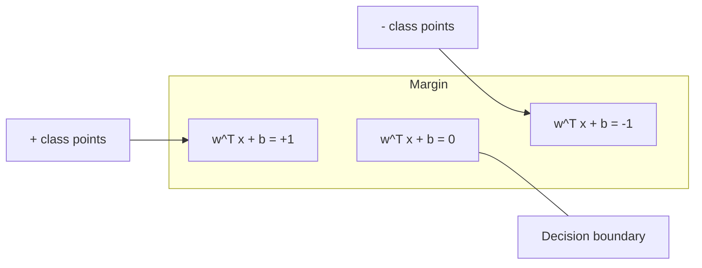
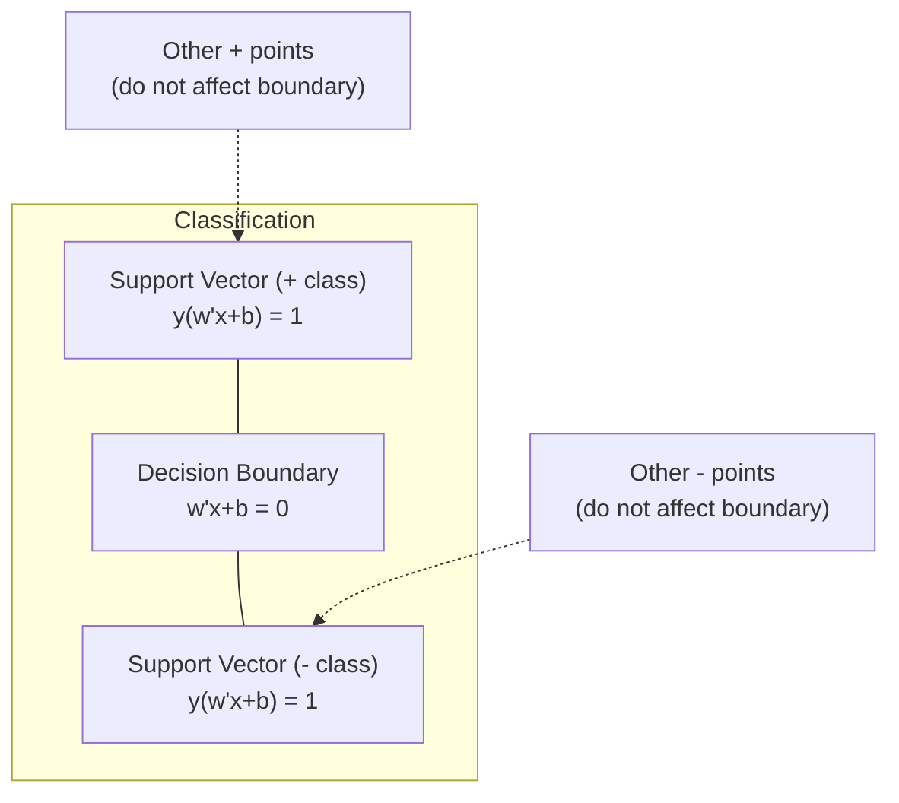
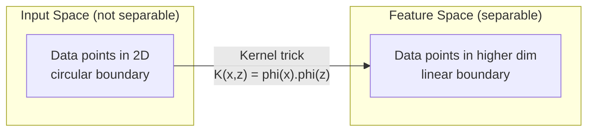

# Destek Vektör Makineleri
# 支持向量机 (SVM)


> İki sınıf arasındaki en geniş sokak bul.

> Bu iki sınıf arasında en geniş sokakları bulmak.

**Type:** Build | **类型：** 构建
**Language:**Python .**语言：**Python
**Prerequisites:** Phase 1 (Lessons 08 Optimization, 14 Norms and Distances, 18 Convex Optimization) | **前置知识：** Phase 1（第 8 课优化、第 14 课范数与距离、第 18 课凸优化）
**Time:** ~90 minutes | **时间：** 约 90 分钟

## Öğrenme hedefleri

- İlk formülasyonda çelişki kaybı ve gradient düşüşünü kullanarak sıfırdan bir doğrusal SVM uygulayın
  Asıl biçiminde kullanımı kopyalık kayıp ve derecesi sıfırdan aşağı gerçekleşen liniyel SVM
- Maksimum marj prensibini açıklayın ve eğitilmiş bir modelden destek vektörlerini belirleyin
  解释最大间隔原理,并从训练好的模型中识别支持向量
- Düzsel, çok boyutlu ve RBF çekirdekleri karşılaştırın ve çekirdek hilesi açık yüksek boyutlu haritalamaları nasıl önlediğini açıklayın
  Hızlı nükleer 、 çok yönlü nükleer ve RBF nükleer, nükleer tekniklerin açıkça yüksek seviyede görüntülenmeyi nasıl engellediğini açıklayın
- C parametri tarafından kontrol edilen marjin genişliği ve sınıflandırma hataları arasındaki karıştırmayı değerlendirmek
  评估 C 参数 kontrolünün 间隔宽度 ve 分类错误 arasındaki dengeli


> **【中文解读】**
> SVM en büyük aralıklı bölge sınırı bulur. Nükleer teknikler SVM'nin yüksek boyutlu alanlarda doğayı olmayan sorunları çözmesine izin verir.

> **【拓展：SVM 在深度学习时代仍然重要的场景】**
> SVM küçük veri kümesi içinde (yüzden binlerce örnek) derin öğrenimden daha iyidir. Google'ın erken çöp posta sınıflarında 線性 SVM kullanımı (LIBLINEAR) nedeniyle, TF-IDF özellikleri yüksek boyutlu ama örnekler nadirdir.

## Sorunlar. Sorunlar.

İki sınıf veri noktası vardır ve onları ayırmak için bir çizgi (veya hiper düzlem) çizmeniz gerekir. Sonsuz sayıda çizgi çalışabilir. Hangisini seçmelisiniz?

> İki tür veri noktası var, bir çizgi çizmek gerekir. Onları ayırmak için.

En büyük marjı olan marj, karar sınırı ile her tarafta en yakın veri noktaları arasındaki mesafedir. Daha geniş bir marj sınıflandırıcı daha güvenilir ve görünmeyen verilere daha iyi genelleştirir.

> 间隔最大的那条──间隔是决策界限到每一侧近数据点的距离──较宽的间隔意味着分类器更有信心,未见数据的泛化能力更好──

Bu algılama, ML'deki en matematiksel olarak zarif algoritmalardan biri olan Destek vektör makinelerine yol açar. SVM derin öğrenmeden önce baskın sınıflandırma yöntemiydi ve küçük veri kümeleri, yüksek boyutlu veri ve teorik garantilerle ilkelerli, iyi anlaşılmış bir modele ihtiyaç duyan sorunlar için en iyi seçim olarak kalmaktadır.

> Bu algı, XML'i destekleyen en iyi algoritmalardan birini ortaya çıkardı. SVM, derin öğrenme öncesi ana sınıflandırma yöntemidir, bugün bile küçük veri kümesi, yüksek veri ve teorik güvence gerektiren sorulara en iyi seçeneği olarak görülmektedir.

SVM'ler doğrudan 1'inci aşamaya bağlanır: optimizasyon konveks (Dene 18), kenar normlarla ölçülür (Dene 14), ve çekirdek hilesi, yüksek boyutlu alanlarda hiçbir zaman hesaplama yapmadan çizgi olmayan sınırları ele almak için nokta ürünlerini kullanır.

> SVM ve 1. aşama doğrudan ilişkili: optimization is凸的 (BİHM'nin 18. sınıfı), bölük bölük sayısı ölçümünün 14. sınıfı), nükleer teknikler, noktayı işlemden yararlanarak, doğalı olmayan sınırları ve yüksek boyutlu alanlarda hesaplama gerekmez.

> **【中文解读】**
> SVM'nin temel düşüncesi: İki tür veriyi ayırmak için sayısız madde arasında, en uzak olan en yakın veri noktasından seçmek, "en büyük aralığı" prensibi olarak görülmektedir.

## Konsepten bir şey.

### Maksimum marjin sınıflandırıcısı

{-1, +1} etiketleri y_i ve özellik vektörleri x_i ile doğrusal olarak ayırılabilir veriler verildiğinde sınıfları ayıran bir hiper düzlem w^T x + b = 0 istiyoruz.

> 给定标签 y_i 为 {-1, +1} 线性可分数据和特征向量 x_i,我们需要一个超平面 w^T x + b = 0 来分离类──

Bir noktadan x_i'ye hiper düzlemine olan mesafe:

> X_i'ye kadar uzaktan uzaklık:

```
distance = |w^T x_i + b| / ||w||
```

Doğru sınıflandırılmış bir nokta için: y_i * (w^T x_i + b) > 0. Marj iki katı, hiper düzlemden her iki tarafta en yakın noktaya kadar olan mesafedir.

> 对于正确分类的点:y_i * (w^T x_i + b) > 0──间隔是超平面到两侧近点距离的两倍──



Optimizeleme sorunu:

> 优化问题:

```
maximize    2 / ||w||     (the margin width)
subject to  y_i * (w^T x_i + b) >= 1  for all i
```

Benzer şekilde (minimize edilmek, optimize edilmek için daha kolay):

> Ürünlerin en azı, daha kolay olarak optimize edilebilir:

```
minimize    (1/2) ||w||^2
subject to  y_i * (w^T x_i + b) >= 1  for all i
```

Bu bir konveks kareli programdır. Bu programın eşsiz bir küresel çözümü vardır. Sınır sınırlarında tam olarak yer alan veri noktaları (y_i * (w^T x_i + b) = 1) destek vektörleri.

> Bu bir iki planlama sorunu. Bu sorunun tek bir çözümü vardır. Bu sorunun çözümü, bir arada bir sınırdaki veri noktasında yer alan bir veri noktasıdır.

### Destek vektörleri: kritik birkaç



Çoğu eğitim noktası önemsizdir. Sadece destek vektörleri önemlidir. Bu nedenle SVM'ler tahmin zamanında hafıza verimlidir: sadece destek vektörlerini depolamanız gerekir, tüm eğitim kümesini değil.

> Çoğu eğitim noktası önemlidir. Sadece destek vektörleri etkilidir. Bu, SVM'nin öngörülmüş zamanlarda yüksek depo verimliliğinin nedeni: tüm eğitim kümesi yerine sadece destek vektörlerini depolamanız gerekir.

Destek vektörlerinin sayısı genelleştirme hatası için de bir sınır sağlar. Verim kümesi boyutuna göre daha az destek vektörü daha iyi genelleştirme anlamına gelir.

> 支持向量数, genelleşme hatasının üst sınırını da ortaya koydu.

### Yumuşak kenarlık: C parametresi ile işleme gürültüsü

Gerçek veriler nadiren mükemmel bir şekilde ayrılabilir. Bazı noktalar sınırın yanlış tarafında veya kenarın içinde olabilir. Yumuşak kenar formülasyonu gevşek değişkenleri ekleyerek ihlallere izin verir.

> Gerçek veriler çok azdır. Bazı noktalar sınırın yanlışı bir tarafında veya ara sıra olabilir.

```
minimize    (1/2) ||w||^2 + C * sum(xi_i)
subject to  y_i * (w^T x_i + b) >= 1 - xi_i
            xi_i >= 0  for all i
```

Bu değerler, bu değerlerin değerini belirlerken, bu değerlerin değerini belirler.

> 松变量 xi_i 衡量点 i 违反间隔的程度──C 控制权衡:

| C value | Behavior |
|---------|----------|
| Large C | Penalizes violations heavily. Narrow margin, fewer misclassifications. Overfits |
| Small C | Allows more violations. Wide margin, more misclassifications. Underfits |

| C 值 | 行为 |
|------|------|
| 大 C | 严重惩罚违规。窄间隔，较少误分类。易过拟合 |
| 小 C | 允许更多违规。宽间隔，较多误分类。易欠拟合 |

C, düzenlenme gücü, tersine. Büyük C = daha az düzenlenme. Küçük C = daha fazla düzenlenme.

> C =                                                                                                                                                                                                                                                              

### Çakışıklık kaybı: SVM kaybı fonksiyonu

Yumuşak Marjin SVM, kısıtlama dışı bir optimizasyon olarak yeniden yazılabilir:

> 软间隔 SVM kısıtlama 无束优化 için yeniden yazılabilir:

```
minimize    (1/2) ||w||^2 + C * sum(max(0, 1 - y_i * (w^T x_i + b)))
```

Max(0, 1 - y_i * f(x_i)) terimi, bir nokta doğru bir şekilde sınıflandırıldığında ve kenardan öte olduğunda sıfırdır.

> 项 max(0, 1 - y_i * f(x_i)) 合页损失──当点被正确分类而在间隔之外时为零──当点在间隔内或被误分类时为线性惩罚──

```
Hinge loss for a single point:

loss
  |
  | \
  |  \
  |   \
  |    \
  |     \_______________
  |
  +-----|-----|-------->  y * f(x)
       0     1

Zero loss when y*f(x) >= 1 (correctly classified, outside margin).
Linear penalty when y*f(x) < 1.
```

Logistik kayıplarla (logistik gerileme) karşılaştırın:

> Logiği geri dönüşün Logiği kayıpları ile karşılaştır:

```
Hinge:     max(0, 1 - y*f(x))          Hard cutoff at margin
Logistic:  log(1 + exp(-y*f(x)))        Smooth, never exactly zero
```

Hinge kaybı nadir çözümler üretir (sadece destek vektörleri sıfır dışı katkılara sahiptir).

> 合页损失产生稀疏解 (sadece destek 量有非零贡献) ⋅ Logical loss use all data points ⋅ bu da SVM'nin öngörülmüş zamanlarda daha fazla kayda tasarruf etmesini sağlar.

### Dönüşe doğru düşen bir doğrusal SVM eğitimi

Sınırlı QP çözmeden, bir doğrusal SVM'yi, zarf kaybı ve L2 düzenlenmesi üzerinde gradient düşüşü kullanarak antrene edebilirsiniz:

> L2 normalleşme üzerinde birlikte kayıp L2 normalleşme üzerinde kullanılabilir.

```
L(w, b) = (lambda/2) * ||w||^2 + (1/n) * sum(max(0, 1 - y_i * (w^T x_i + b)))

Gradient with respect to w:
  If y_i * (w^T x_i + b) >= 1:  dL/dw = lambda * w
  If y_i * (w^T x_i + b) < 1:   dL/dw = lambda * w - y_i * x_i

Gradient with respect to b:
  If y_i * (w^T x_i + b) >= 1:  dL/db = 0
  If y_i * (w^T x_i + b) < 1:   dL/db = -y_i
```

Bu, ilk formülasyon olarak adlandırılır. O(n * d) epoca başına çalışır, burada n örnek sayısı ve d özellik sayısıdır. Büyük, nadir, yüksek boyutlu veriler (metin sınıflandırması) için bu hızlıdır.

> Bu, orijinal biçim olarak adlandırılır. Her turun süresi O (n * d) olarak adlandırılır.

> **【中文解读】**
> 合页损失(Hinge Loss) SVM'nin temel kayıp işlevi: örnek doğru olarak sınıflandırıldığında ve ayrım dışı bir şekilde kaybedildiğinde 0, yoksa 线性罰── logik geri dönüşün bir parçasından farklı olarak, 合页损失产生稀疏解 只有支持向量有非零贡献,预测时只需存储这些点──C 参数控制间隔宽度与分类错误的权衡:大 C = 狭间隔少犯错(可能过合),小 C = 宽间隔多错误可能不合) 

### Çift formülasyon ve çekirdek hilesi

SVM sorununun Lagrangian çiftliği (Fase 1 Ders 18, KKT koşullarından) şunlardır:

> SVM 问题拉格朗日对偶 (Fase 1 第 18 课 KKT 条件) için:

```
maximize    sum(alpha_i) - (1/2) * sum_ij(alpha_i * alpha_j * y_i * y_j * (x_i . x_j))
subject to  0 <= alpha_i <= C
            sum(alpha_i * y_i) = 0
```

Dual sadece nokta ürünleri x_i. x_j ile veri noktaları arasında içerir. Bu ana bilgilerdir. Her nokta ürünü bir çekirdek fonksiyonu K(x_i, x_j ile değiştirin ve SVM, dönüşümün açıkça hesaplanmadan doğrusal olmayan sınırları öğrenebilir.

> Bu, önemli bir anlayıştır. SVM'de her nokta nükleer işlevi K (x_i, x_j) olarak değiştirilir.

```
Linear kernel:      K(x, z) = x . z
Polynomial kernel:  K(x, z) = (x . z + c)^d
RBF (Gaussian):     K(x, z) = exp(-gamma * ||x - z||^2)
```

RBF çekirdeği verileri sonsuz boyutlu bir alanın haritasına yerleştiriyor. Giriş alanında yakın olan noktaların çekirdeğin değeri 1.

> RBF 核将数据映射到无限维空间――输入空间中相近点核值接近1――远离点核值接近0――; herhangi bir 滑滑的决策边界――;



Kernelik hilesi, yüksek boyutlu alanın nokta ürünü'ni hiç oraya gitmeden hesaplar. D boyutlarında derece d'li polinom çekirdeği için açık özellik alanının O(D^d) boyutları vardır.

> 核技巧在高维空间中计算点积而无需实际到达那里──对于 D 维中的 d 次多项式核,显式特征空间有 O  D 维──但 K  X, z)  时间计算──

> **【中文解读】**
> 核技巧是SVM 最优雅的数学贡献――偶形式只涉及数据点之间的点积 x_i · x_j,将其替换为核函数 K(x_i, x_j) 即可在高维(甚至无限维)空间中学习非线性边界,而无需显式计算高维映射――RBF 核将数据映射到无限维空间,能学习任意光滑的决策边缘――计算开销:多项式核的式特征空间有多个维 (d) 维,但核函数只需要多个维 (d) 时间――

> **【拓展：核技巧的思想在现代 AI 中的延续】**
> 核技巧的核心思想"高维空间中计算相似度而不显式映射" Transformer'ın dikkat mekanizmasında benzer bir体现有.

### Geri dönüş için SVM (SVR)

Destek vektörü Geri dönüşü, verilerin etrafında genişliğinde epsilon bir tüp tutar. tüp içindeki noktaların sıfır kaybı vardır. tüp dışındaki noktalar doğrusal olarak cezalandırılır.

> 支持向量回归在数据周围拟合一个宽度为 epsilon的管道──管道内点损失为零──管道外的点被线性惩罚──

```
minimize    (1/2) ||w||^2 + C * sum(xi_i + xi_i*)
subject to  y_i - (w^T x_i + b) <= epsilon + xi_i
            (w^T x_i + b) - y_i <= epsilon + xi_i*
            xi_i, xi_i* >= 0
```

Epsilon parametri tüp genişliğini kontrol eder. Geniş tüp = daha az destek vektörü = daha düzgün uyum. dar tüp = daha fazla destek vektörü = daha sıkı uyum.

> Epsilon parametr kontrol borunun genişliği── daha geniş boru = daha az destek torunu = daha düzlüge uygunluğu── daha dar boru = daha fazla destek torunu = daha sıkı uygunluğu──

### Neden SVM'ler derin öğrenme karşısında kaybediyor (ve hala ne zaman kazanıyorlar)

SVM'ler 1990'ların sonundan 2010'ların başlarına kadar ML'de egemenlik gösterdi. Derin öğrenme birkaç nedenden dolayı onları aştı:

> SVM, 20. yüzyılın 90'lı yıllarının sonundan 2010'lu yılların başlarına kadar ML'yi yönlendirdi.

| Factor | SVMs | Deep learning |
|--------|------|---------------|
| Feature engineering | Requires it | Learns features |
| Scalability | O(n^2) to O(n^3) for kernel | O(n) per epoch with SGD |
| Image/text/audio | Needs handcrafted features | Learns from raw data |
| Large datasets (>100k) | Slow | Scales well |
| GPU acceleration | Limited benefit | Massive speedup |

| 因素 | SVM | 深度学习 |
|------|-----|---------|
| 特征工程 | 需要手动 | 自动学习 |
| 可扩展性 | 核方法 O(n^2) 到 O(n^3) | SGD 每轮 O(n) |
| 图像/文本/音频 | 需要手工特征 | 从原始数据学习 |
| 大数据集（>10 万） | 较慢 | 扩展性好 |
| GPU 加速 | 有限收益 | 大幅提速 |

SVM'ler hala bu durumlarda kazanır:
- Küçük veri kümeleri (yüzlerce ila binlerce örnek)
  Küçük veriler (yüzden binlerce örneğe)
- Yüksek boyutlu nadir veriler (TF-IDF özellikleri olan metin)
  高维稀疏数据 (Message of TF-IDF Özellikleri)
- Matematik garantilere ihtiyaç duyduğunuzda (marjin sınırları)
  需要数学保证时(间隔边界)
- Eğitim süresi minimum olması gerektiğinde (lineer SVM çok hızlıdır)
  訓練時間必須最短時間 (Hızlı ve hızlı)
- Açık marjin yapısı olan ikili sınıflandırma
  具有清晰间隔结构的二分类
- Anomalyayı tespit etmek (bir sınıf SVM)
  异常检测(单类 SVM)

> SVM, aşağıdaki durumlarda hâlâ kazanıyor:

## Yapın.
```figure
svm-margin
```

## Yapın

### Adım 1: Çakışıklık kaybı ve eğilimi

Bir parti için zar kaybını ve eğilimi hesaplayın.

> 基础―― bir dizi veriyi ve onun derecesini hesaplamak.

```python
def hinge_loss(X, y, w, b):
    n = len(X)
    total_loss = 0.0
    for i in range(n):
        margin = y[i] * (dot(w, X[i]) + b)  # 计算样本到决策边界的函数间隔
        total_loss += max(0.0, 1.0 - margin)  # 合页损失：间隔 < 1 时才有惩罚
    return total_loss / n  # 返回平均损失
```

### Adım 2: Dönüşe doğru düşen çizgi SVM

Düzenlenmiş zarf kaybını en aza indirerek eğit.

> 通过最小化正则化合物损失训练──无需 QP 求解器──

```python
class LinearSVM:
    def __init__(self, lr=0.001, lambda_param=0.01, n_epochs=1000):
        self.lr = lr  # 学习率
        self.lambda_param = lambda_param  # 正则化参数（对应 1/C）
        self.n_epochs = n_epochs
        self.w = None  # 权重向量
        self.b = 0.0  # 偏置

    def fit(self, X, y):
        n_features = len(X[0])
        self.w = [0.0] * n_features
        self.b = 0.0

        for epoch in range(self.n_epochs):
            for i in range(len(X)):
                margin = y[i] * (dot(self.w, X[i]) + self.b)  # 函数间隔
                if margin >= 1:
                    # 样本在间隔之外，只需正则化梯度
                    self.w = [wj - self.lr * self.lambda_param * wj
                              for wj in self.w]
                else:
                    # 样本在间隔内或被误分类，需要额外的损失梯度
                    self.w = [wj - self.lr * (self.lambda_param * wj - y[i] * X[i][j])
                              for j, wj in enumerate(self.w)]
                    self.b -= self.lr * (-y[i])

    def predict(self, X):
        return [1 if dot(self.w, x) + self.b >= 0 else -1 for x in X]  # 根据符号预测类别
```

### Adım 3: Kernel fonksiyonları

Düzsel, polinom ve RBF çekirdekleri uygulayın.

> 实现线性核、多项式核和 RBF 核──

```python
def linear_kernel(x, z):
    return dot(x, z)  # 线性核：直接点积

def polynomial_kernel(x, z, degree=3, c=1.0):
    return (dot(x, z) + c) ** degree  # 多项式核：(x·z + c)^d

def rbf_kernel(x, z, gamma=0.5):
    diff = [xi - zi for xi, zi in zip(x, z)]  # 计算差向量
    return math.exp(-gamma * dot(diff, diff))  # RBF 核：exp(-γ||x-z||²)
```

### Adım 4: Marjin ve destek vektörünü tanımlamak

Eğitimden sonra hangi noktaların destek vektörleri olduğunu belirleyin ve kenar genişliğini hesaplayın.

>                                                                                                                                                                                                                                                               

```python
def find_support_vectors(X, y, w, b, tol=1e-3):
    support_vectors = []
    for i in range(len(X)):
        margin = y[i] * (dot(w, X[i]) + b)
        if abs(margin - 1.0) < tol:
            support_vectors.append(i)
    return support_vectors
```

Bakın .`code/svm.py`Tüm demolarla birlikte tam olarak uygulanması için.

> 完整实现(含所有演示) See `code/svm.py`- Evet.

## Çerçeveyi kullanın.

> **【中文解读】**
> sklearn 中 SVM kullanımı:(1) 必須先標準化特征SVM 特性尺度敏感,因为间隔依赖于它;(2) 小数据集用 SVC(支持核函数),大数据集用 LinearSVC(使用原始形式,O(n) 每轮);(3) gamma 控制 RBF 核范围,太大→过拟合,太小→欠拟合.

Sikit-learn ile:

> Sikit-learn kullanın:

```python
from sklearn.svm import SVC, LinearSVC, SVR
from sklearn.preprocessing import StandardScaler
from sklearn.pipeline import Pipeline

# 标准化 + SVM 的标准管线
clf = Pipeline([
    ("scaler", StandardScaler()),  # 标准化是 SVM 的必选项
    ("svm", SVC(kernel="rbf", C=1.0, gamma="scale")),  # RBF 核 SVM
])
clf.fit(X_train, y_train)
print(f"Accuracy: {clf.score(X_test, y_test):.4f}")
print(f"Support vectors: {clf['svm'].n_support_}")
```

Önemli: SVM'yi eğitmeden önce her zaman özelliklerinizi ölçeklendirin. SVM'ler özellik büyüklüklerine hassasdır çünkü kenarlık ölçeklenmemiş özelliklere bağlıdır ve geometriyi çarpıtır.

> Önemli: S.V.M. önceden eksiksizleştirilmiş özelliklere duyarlı olması gerekir.

Büyük veri kümeleri için kullan `LinearSVC`(başlangıç formu, O(n) dönem başına) yerine `SVC`(ikili formülasyon, O(n^2) ile O(n^3)):

> 对于大数据集,使用 `LinearSVC`(原始形式,每轮 O(n)) yerine `SVC`(O(n^2) ile O(n^3) arasında):

```python
from sklearn.svm import LinearSVC

clf = Pipeline([
    ("scaler", StandardScaler()),
    ("svm", LinearSVC(C=1.0, max_iter=10000)),
])
```

## Egzersizler.

1. 2D doğrusal olarak ayırılabilir bir veri kümesi oluşturun. LinearSVM'inizi çalıştırın ve destek vektörlerini tanımlayın. Destek vektörlerinin karar sınırına en yakın noktaları olup olmadığını kontrol edin.
   1. 2D 線性可分資料集 oluşturmak. LinearSVM'inizi eğitmek ve destek vektörünü tanımlamak.

2. C'nin değişimi 0.001'den 1000'e kadar gürültülü bir veri kümesi üzerinde. Her C değeri için karar sınırını çiz. Geniş marjinden (kilitsiz) dar marjine (kilitsiz) geçişi gözlemleyin.
   2. Bu nedenle, C'nin değişimi, 0.001'den 1000'e değişir.

3. Sınıf sınırlarının yuvarlak (lineer olmayan) bir veri kümesi oluşturun. Düzsel bir SVM'nin başarısız olduğunu gösterin. RBF çekirdek matrisini hesaplayın ve sınıfların çekirdek indüksiyonlu özellik alanında ayrılabilir olduğunu gösterin.
   3.  oluşturmak                                                                                                                                                                                                                                                             

4. Aynı veri kümesi üzerinde kargaşa kaybı ile lojistik kaybı karşılaştırın. Düzsel SVM ve lojistik gerilemeyi eğitiniz. Her modelin karar sınırına kaç eğitim noktası katkıda bulunduğunu sayın (dayanım vektörleri vs. tüm noktalar).
   4. Aynı veri kümesi üzerinde karşılaştırma yapılır ve mantıksal kayıplar vardır.

5. SVR (epsilon-ansansitif kaybı) uygulayın. Y = sin(x) + gürültü ayarlayın. epsilon tüpünü tahminlerin etrafında çizin ve destek vektörlerini (tubanın dışındaki noktaları) vurgulayın.
   5. 实现 SVR(epsilon 不敏感损失) ・拟合 y = sin(x) + noise──绘制预测周围的epsilon 管道并标记支持向量(管道外的点)。

## Anahtar Şartlar .

| Term | What it actually means |
|------|----------------------|
| Support vectors | The training points closest to the decision boundary. The only points that determine the hyperplane |
| Margin | The distance between the decision boundary and the nearest support vectors. SVMs maximize this |
| Hinge loss | max(0, 1 - y*f(x)). Zero when correctly classified and outside the margin. Linear penalty otherwise |
| C parameter | Trade-off between margin width and classification errors. Large C = narrow margin, small C = wide margin |
| Soft margin | SVM formulation that allows margin violations via slack variables. Handles non-separable data |
| Kernel trick | Computing dot products in a high-dimensional feature space without explicitly mapping to that space |
| Linear kernel | K(x, z) = x . z. Equivalent to standard dot product. For linearly separable data |
| RBF kernel | K(x, z) = exp(-gamma * \|\|x-z\|\|^2). Maps to infinite dimensions. Learns any smooth boundary |
| Polynomial kernel | K(x, z) = (x . z + c)^d. Maps to a feature space of polynomial combinations |
| Dual formulation | Reformulation of the SVM problem that depends only on dot products between data points. Enables kernels |
| SVR | Support Vector Regression. Fits an epsilon-tube around the data. Points inside the tube have zero loss |
| Slack variables | xi_i: measures how much a point violates the margin. Zero for correctly classified points outside margin |
| Maximum margin | The principle of choosing the hyperplane that maximizes the distance to the nearest points of each class |

## Daha fazla okumak

- [Vapnik: The Nature of Statistical Learning Theory (1995)](https://link.springer.com/book/10.1007/978-1-4757-3264-1)- SVM ve istatistik öğrenimi üzerine temel metin
  [Vapnik: The Nature of Statistical Learning Theory (1995)](https://link.springer.com/book/10.1007/978-1-4757-3264-1)- SVM ve statistika öğrenme teorisinin temelini oluşturan kitaplar
- [Cortes & Vapnik: Support-vector networks (1995)](https://link.springer.com/article/10.1007/BF00994018)- orijinal SVM kağıdı
  [Cortes & Vapnik: Support-vector networks (1995)](https://link.springer.com/article/10.1007/BF00994018)- SVM 原始论文
- [Platt: Sequential Minimal Optimization (1998)](https://www.microsoft.com/en-us/research/publication/sequential-minimal-optimization-a-fast-algorithm-for-training-support-vector-machines/)- SVM eğitimi pratik kılan SMO algoritması
  [Platt: Sequential Minimal Optimization (1998)](https://www.microsoft.com/en-us/research/publication/sequential-minimal-optimization-a-fast-algorithm-for-training-support-vector-machines/)- SVM                                                                                                                                                                                                                                                                                                                                                                                                                                                                                                                           
- [scikit-learn SVM documentation](https://scikit-learn.org/stable/modules/svm.html)- uygulamalar hakkında detaylı pratik rehberlik
  [scikit-learn SVM 文档](https://scikit-learn.org/stable/modules/svm.html)- 实用指南及实现细节
- [LIBSVM: A Library for Support Vector Machines](https://www.csie.ntu.edu.tw/~cjlin/libsvm/)- çoğu SVM uygulamasının arkasındaki C++ kütüphanesi
  [LIBSVM](https://www.csie.ntu.edu.tw/~cjlin/libsvm/)- Büyük çoğunluk SVM                                                                                                                                                                                                                                                                                                                                                                                                                                                                                                                        
