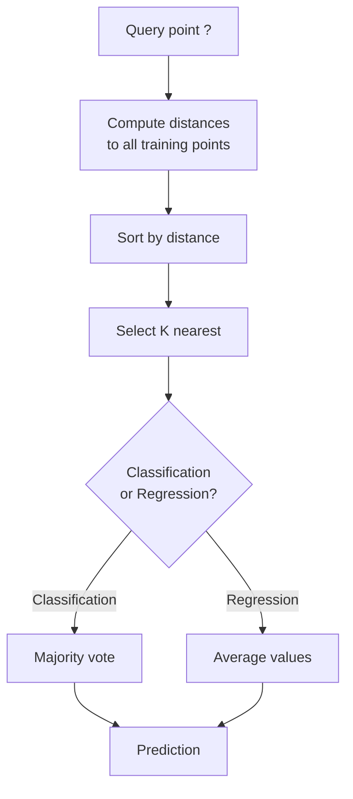
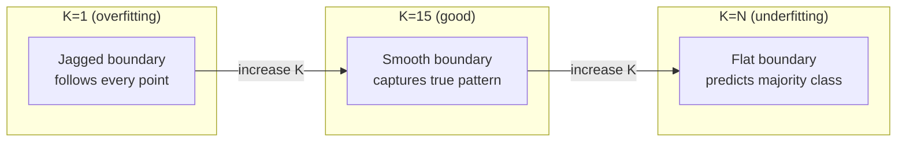
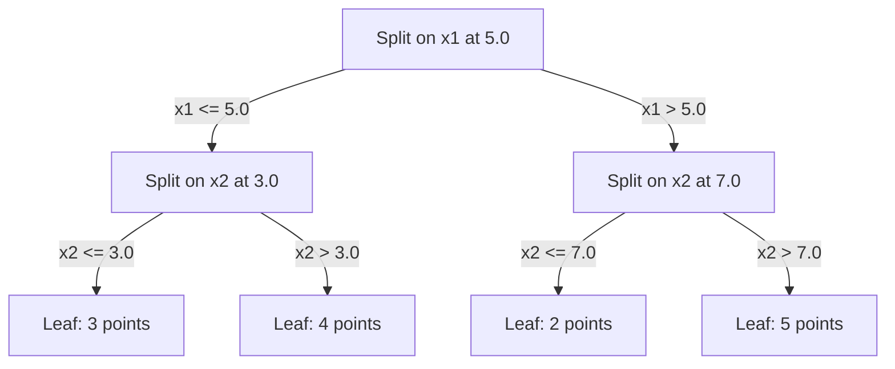

# K-En Yakın Komşular ve Uzaklıklar
# K yakın yakınlık


> Her şeyi sakla, komşularına bakarak tahmin et, en basit algoritma aslında işe yarıyor.

> 保存一切──预测时看邻居── en basit ama gerçekten etkili algoritma──

**Type:** Build | **类型：** 构建
**Language:**Python .**语言：**Python
**Prerequisites:** Phase 1 (Lesson 14 Norms and Distances) | **前置知识：** Phase 1（第 14 课范数与距离）
**Time:** ~90 minutes | **时间：** 约 90 分钟

## Öğrenme hedefleri

- KNN sınıflandırmasını ve sıfırdan geri çekilmeyi yapılandırılabilir K ve mesafe ağırlıklı oylama ile uygula
  K değerinin ve artan oylama hakkı arasındaki KNN sınıfı ve geri dönüşün sıfırdan gerçekleştirilebilir yapılandırılması
- L1, L2, cosine ve Minkowski mesafe ölçümlerini karşılaştırın ve verilen veri tipi için uygun olanı seçin
  L1 ̊ L2 ̊ YY string ̊ ve 可夫斯基 ̊ mesafe ölçümlerini karşılaştırın, belirli veri türü için uygun ölçümleri seçin
- Boyutlulığın lanetini açıkla ve KNN'nin yüksek boyutlu alanlarda neden bozulduğunu göster
  解释维度灾难,演示为什么KNN 在高维空间中性能下降
- En yakın komşunu etkin bir şekilde aramak ve analiz etmek için bir KD ağacı inşa et .
  KD  ağacı inşa etmek yüksek verimlilik yakın komşu arama, analiz etmek şiddet arama ne zaman daha iyi


> **【中文解读】**
> KNN'in temel düşüncesi, yakınınızdaki K 个邻居是什么类别,你就预测什么类别――推系统中找相似用户就是 KNN 思想――sklearn in K NeighborsClassifier――KN'in en yakın komşularının sınıflandırılmasıdır.

> **【拓展：KNN 思想在现代 AI 中的广泛应用】**
> RAG(检索增强生成) 本质就是 KNN:将用户问题编码为向量,在向量数据库中搜索 K 个最相似的文档片段,再将它们提供给 LLM 生成回答──Spotify'in音乐推用近似近邻的近邻的️ANN) 数亿首歌中搜索相似的;Pinterest'ın resim aramaları görsel gömülme + KNN──KNN'in düşünceleri yok, sadece veri yapısı ve boyutları farklıdır──

## Sorunlar. Sorunlar.

Bir veri kümesi var. Yeni bir veri noktası geliyor. Onu sınıflandırmak veya değerini tahmin etmek gerekir. Verilerden parametreleri öğrenmek yerine (süre gerileme veya SVM gibi), yeni noktaya en yakın K eğitim noktalarını bulup oy vermelerini bırakın.

> Yeni bir veri noktası var. Onu sınıflandırmak veya değerini tahmin etmek gerekir. Verilerden öğrenmek için bir dizi (örneğin, bir geri dönüş veya bir SVM) değil, yeni bir noktaya yakın olan K'yi bulup oy vererek kullanın.

Bu K-en yakın komşular. Eğitim aşaması yok. Öğrenmek için parametre yok. Düşükleme için kayıp fonksiyonu yok. Tüm eğitim setini depolar ve tahmin zamanında mesafeleri hesaplarsınız.

> İşte K yakın komşuyor. Hiç eğitim aşaması yok. Hiç öğrenme gerekmez.

İşlemek için çok basit gibi görünüyor. Ancak KNN, özellikle küçük ve orta ölçekli veri kümeleri ile birçok sorun için şaşırtıcı derecede rekabetçi ve bunu anlamak temel kavramları derinlemesine ortaya çıkarır: mesafe metriklerinin seçimi (Faz 1 Ders 14 ile bağlantı kurmak), boyutlulığın laneti ve tembel ve istekli öğrenme arasındaki fark.

> 聽起來太簡單,但KNN, özellikle de 細小資料集 için birçok konuda oldukça rekabetçi görünüyor.

KNN, modern AI'de de farklı isimlerle her yerde görünür. Vektör veritabanları KNN'in gömülmeler üzerinde arama yapmasını sağlar. Arama artıran nesil (RAG) K'ye en yakın belge parçalarını bulur. Tavsiye sistemleri benzer kullanıcıları veya öğeleri bulur. Algoritm aynıdır. Ölçü ve veri yapıları farklıdır.

> KNN modern AI'de var, sadece isim farklıdır.  KN 搜索 搜索 搜索 增强生成.  K 个最近的文档片段.  K 个近期的文档片段.  K 个近期的文档片段.  K 个近期的文档片段.  K 个近期的文档片段.  K 个近期的文档片段.  K 个近期的文档片段.  K 个近期的文档片段.  K 个近期的文档片段.  K 个近期的文档片段.  K 个近期的文档片段.  K 个近期的文档.  K 个近期的文档.  K 个近期的文档.

> **【中文解读】**
> KNN 惰学习没有训练过程,预测时才计算距离──核心三要素:K 值选择(太小→过拟合噪声,太大→不适合) 距离度量(欧氏、曼哈顿、余弦等) 投票规则(等权或距离加权) ⋅KNN'ın eksikliği:高维空间中距离失意(维度灾难),大数据集预测慢(需要与所有训练点比较) ⋅

## Konsepten bir şey.

### KNN' in işleyişi

Etiketlenmiş noktaların bir veri kümesi ve yeni bir soru noktası verildiğinde:

>                                                                                                                                                                                                                                                                                                                                                                                                                                                                                                                              

1. Sorgudan veri kümesindeki her noktaya kadar mesafeyi hesaplayın
    hesaplama sorgu noktası ile veri merkezi arasındaki mesafe
2. Mesafe ile düzenlenir
   按距离排序
3. K'ye en yakın noktaları alın .
   取 K 个最近的点
4. Sınıflandırma için: K komşuları arasında çoğunluk oyları
   Çevre: K 个邻居中多数投票
5. Geri dönüş için: K komşu değerlerinin ortalaması (veya ağırlıklı ortalaması)
   Return tasks:K 个邻居值的平均 (K 个邻居值的平均)



Bu tüm algoritma. Hiç uygunluk yok.

> Bu, tüm algoritma. Hiç bir düzen yok.

### K'yi seçmek

K tek hiperparametre.

> K tek süperparametridir.

| K | Behavior |
|---|----------|
| K = 1 | Decision boundary follows every point. Zero training error. High variance. Overfits |
| Small K (3-5) | Sensitive to local structure. Can capture complex boundaries |
| Large K | Smoother boundaries. More robust to noise. May underfit |
| K = N | Predicts the majority class for every point. Maximum bias |

| K | 行为 |
|---|------|
| K = 1 | 决策边界跟随每个点。训练误差为零。高方差。过拟合 |
| 小 K (3-5) | 对局部结构敏感。能捕捉复杂边界 |
| 大 K | 更平滑的边界。对噪声更鲁棒。可能欠拟合 |
| K = N | 每个点都预测多数类。最大偏差 |

Bir ortak başlangıç noktası, N noktaları olan bir veri kümesi için K = sqrt(N'dir.

> 常用初始值是 K = sqrt(N)(N 为数据集大小)。二分类使用奇数 K 以避免平票。



### Mesafe ölçümleri

Mesafe fonksiyonu "yaklaş" ne anlama geldiğini belirler.

> 距离函数 defines "近" 的含义── farklı ölçüler farklı komşuları, farklı öngörüleri oluşturur──

**L2 (Euclidean)**- Düz çizgi mesafesini.

> **L2（欧氏距离）**Yürüyenler için de bir seçim var.

```
d(a, b) = sqrt(sum((a_i - b_i)^2))
```

Özellik ölçekine duyarlı. KNN ile L2 kullanmadan önce özellikleri her zaman standartlaştırın.

> Özellik ölçüsüne duyarlılık. KNN'de L2 kullanılması önemiyetli standartlaştırılmış özellikler.

**L1 (Manhattan)**L2'den daha güçlü, çünkü farklılıkları karıştırmaz.

> **L1（曼哈顿距离）**L2'den daha fazla, çünkü bu, çeyreğin değerini içermez.

```
d(a, b) = sum(|a_i - b_i|)
```

**Cosine distance**Vectörler arasındaki açıyı ölçerken büyüklüğü görmezden gelir.

> **余弦距离**                                                                                                                                                                                                                                                              

```
d(a, b) = 1 - (a . b) / (||a|| * ||b||)
```

**Minkowski**L1 ve L2'yi p parametri ile genelleştirir.

> **闵可夫斯基距离**L1 ve L2'yi kullanmak için kullanılan parametreler.

```
d(a, b) = (sum(|a_i - b_i|^p))^(1/p)

p=1: Manhattan
p=2: Euclidean
p->inf: Chebyshev (max absolute difference)
```

Hangi metrik kullanılması verilere bağlıdır:

> 选择哪种度取决于数据:

| Data type | Best metric | Why |
|-----------|------------|-----|
| Numeric features, similar scale | L2 (Euclidean) | Default, works for spatial data |
| Numeric features, outliers | L1 (Manhattan) | Robust, does not amplify large differences |
| Text embeddings | Cosine | Magnitude is noise, direction is meaning |
| High-dimensional sparse | Cosine or L1 | L2 suffers from curse of dimensionality |
| Mixed types | Custom distance | Combine metrics per feature type |

| 数据类型 | 最佳度量 | 原因 |
|---------|--------|------|
| 数值特征，量级相近 | L2（欧氏） | 默认选择，适合空间数据 |
| 数值特征，有异常值 | L1（曼哈顿） | 鲁棒，不放大大的差异 |
| 文本嵌入 | 余弦 | 大小是噪声，方向是含义 |
| 高维稀疏 | 余弦或 L1 | L2 受维度灾难影响 |
| 混合类型 | 自定义距离 | 按特征类型组合度量 |

### Ağır KNN

Standart KNN tüm K komşular için eşit ağırlık verir.

> 標準 KNN tüm K ̇ komşularına aynı ağırlık verir. Fakat 0.1'in komşusu 5.0'un komşusu olmaktan daha önemlidir.

**Distance-weighted KNN**Her komşunun mesafe ile tersine ağırlıkları:

> **距离加权 KNN**                                                                                                                                                                                                                                                              

```
weight_i = 1 / (distance_i + epsilon)

For classification: weighted vote
For regression:     weighted average = sum(w_i * y_i) / sum(w_i)
```

Epsilon, bir sorgu noktası eğitim noktasıyla tam olarak eşleştiğinde sıfırla bölünmeyi engeller.

> Epsilon                                                                                                                                                                                                                                                                                                                                                                                                                                                                                                                           

K seçeneğine göre ağır KNN daha az duyarlıdır çünkü uzak komşular ne olursa olsun çok az katkı sağlar.

> K'nin seçimi çok hassas değildir, çünkü K'nin değeri ne olursa olsun uzak komşuların katkıları çok küçüktür.

### Boyutsuzluk laneti

KNN performansı yüksek boyutlarda azalıyor. Bu belirsiz bir kaygı değil.

> KNN 性能在高维中退化──これは模糊の懸念ではなく数学 gerçektir──

**Problem 1: distances converge.**Boyutlulık arttıkça, maksimum mesafe ile minimum mesafe oranı 1. yaklaşır. Tüm noktalar sorudan eşit derecede "uzaktır".

> **问题 1：距离趋同。**△ boyut artışıyla birlikte, en büyük mesafe ile en küçük mesafe oranı 1e yakınlaşır.

```
In d dimensions, for random uniform points:

d=2:    max_dist / min_dist = varies widely
d=100:  max_dist / min_dist ~ 1.01
d=1000: max_dist / min_dist ~ 1.001

When all distances are nearly equal, "nearest" is meaningless.
```

**Problem 2: volume explodes.**K komşularını verilerin sabit bir kısmında yakalamak için arama radiüsünü çok daha büyük bir bölümün kapsamına genişletmelisiniz.

> **问题 2：体积爆炸。**Verilerin sabit oranında K'nin komşularını yakalamak için arama yarısını kapsamlı bir alanın daha büyük bir kısmına yaymak gerekir.

**Problem 3: corners dominate.**D boyutlarındaki birim hiper küpünde, hacmin büyük kısmı merkez değil, köşeler yakınında yoğunlaşır.

> **问题 3：角落主导。**D  维单位超立体中, büyük kısmı gövdeden yakın, merkezden uzak bir bölgede yoğunlaşır.

Pratik sonuç: KNN yaklaşık 20-50 özelliklere kadar iyi çalışır. Bundan daha fazlası, KNN uygulamadan önce boyut azaltma (PCA, UMAP, t-SNE) veya verilerin içsel düşük boyutluğunu sömüren ağaç tabanlı arama yapıları kullanmanız gerekir.

> 实际后果:KNN 约20-50 个特征下面的效果好――超过这个范围,需要在应用KNN 之前进行降维(PCA、UMAP、t-SNE),或使用利用数据内在低维性的树搜索结构──

### KD ağaçları: en yakın komşu arayışı

Kötü kuvvet KNN, sorgudan her eğitim noktasına kadarki mesafeyi hesaplar. Bu sorgu başına O(n * d) demektir. Büyük veri kümeleri için bu çok yavaş.

> 暴力 KNN 计算查询点到每个训练点的距离――每次查询 O(n * d) ――大数据集 için çok yavaş oldu。

Bir KD ağacı, alanı özellik ekseleri boyunca geri dönüşlü olarak bölüyor. Her seviyede, ortalama değerde bir boyutta bölünür.

> KD 树沿特征轴递归划分空间―― her katın üzerinde bir boyut içinde orta değerler arasında bölünmüştür――



En yakın komşunu bulmak için, ağaçtan soruyu içeren yaprağa geçin, sonra geriye dönün ve komşu bölmelerini sadece daha yakın noktaları içerebilecekleri durumlarda kontrol edin.

> Yakın komşu bulmak için, aramaya dayanan bir nokta içeren bir yaprak noktasına kadar, sonra geri dönüp sadece komşu bölgede daha yakın nokta içerebilir.

Ortalama sorgu süresi: düşük boyutlarda O(log n). Ancak KD- ağaçları yüksek boyutlarda (d > 20) O(n'e düşer, çünkü geriye doğru ilerleme giderek daha az dalı ortadan kaldırır.

> 低维平均查询时间:O(log n) ・・・ ama KD 树在高维(d > 20) 时退化为O(n),因为回溯消除的分支越来越少──

### Top ağaçları: Orta boyutlu için daha iyi

Top ağaçları, birikleri birer kemer yerine yuvalara yerleştirilmiş hiperferlere ayırır. Her düğüm, bu alt ağaçtaki tüm noktaları içeren bir top (merkez + radyüs) tanımlar.

> 球树将数据分为嵌套的超球面而不是轴对齐的盒──每个节点定义一个包含该子树所有点的球──中心 +半径──

KD ağaçlarına göre avantajlar:
- Orta boyutlarda (~50) daha iyi çalışın
  Orta seviyelerde (artık 50'e kadar) daha iyi sonuçlar elde ediliyor.
- Ekipmanın aksine bağlı olmayan yapısı
  能处理非轴对齐结构
- Sınırlama hacmi daha sıkı olması arama sırasında daha fazla dal kesildiği anlamına gelir
  Daha da yakın bir çevre arama sırasında daha fazla dal kesmek anlamına gelir.

Hem KD ağaçları hem de top ağaçları tam algoritmalardır. Gerçekten büyük ölçekli arama (milyonlarca nokta, yüzlerce boyut), bunun yerine en yakın komşu yöntemleri (HNSW, IVF, ürün kuantitesi) kullanılır. Bunlar Fase 1 Ders 14'te ele alınmıştır.

> KD 树和球树都是精确算法──真正的大规模搜索的 (真正大规模搜索的)  (KD 树和球树)  (KD 树和球树)  (KD 树和球树)  (KD 树和球树)  (KD 树和球树)  (KD 树和球树)  (KD 树和球树)  (KD 树和球树)  (KD 树和球树)  (KD 树和球树)  (KD 树和球树)  (KD 树和球树)  (KD 树和球树)  (KD 树和球树)  (KD 树和球树)  (KD 树和树)  (KD 树和树)  (KD 树和树和树)  (KD 树和树)  (KD 树和树) )  (KD )  (KD)  (KD)  (KD)  (D) )  (D)  (D)  (D)  (D)  (D)  ()  ()  () )  ()  ()  () )  ()  () )  ()  () )  ()

### Uşak öğrenme vs. öğrenmek için hevesli

KNN tembel bir öğrenci: eğitim sırasında çalışmaz ve tüm çalışmalar tahmin zamanında. Diğer algoritmaların çoğu (lineer gerileme, SVM, sinir ağları) öğrenci isteklidir: kompakt bir model oluşturmak için eğitim sırasında ağır hesaplamalar yaparlar, sonra tahminler hızlıdır.

> KNN is a lazy learning machine: training time does not do any work, all work in prediction time completed;; çoğu diğer algoritma  linear regression  SVM、 neura net) is an active learning machine: training time do a lot of computation construct tight models, then prediction very quickly;;

| Aspect | Lazy (KNN) | Eager (SVM, neural net) |
|--------|------------|------------------------|
| Training time | O(1) just store data | O(n * epochs) |
| Prediction time | O(n * d) per query | O(d) or O(parameters) |
| Memory at prediction | Store entire training set | Store model parameters only |
| Adapts to new data | Add points instantly | Retrain the model |
| Decision boundary | Implicit, computed on the fly | Explicit, fixed after training |

| 方面 | 懒惰学习 (KNN) | 积极学习 (SVM, 神经网络) |
|------|---------------|------------------------|
| 训练时间 | O(1) 仅存储数据 | O(n * epochs) |
| 预测时间 | 每次查询 O(n * d) | O(d) 或 O(参数) |
| 预测时内存 | 存储整个训练集 | 仅存储模型参数 |
| 适应新数据 | 即时添加点 | 重新训练模型 |
| 决策边界 | 隐式，即时计算 | 显式，训练后固定 |

Uykucu öğrenme idealdir:
- Veri kümesi sıkça değişir (tekrar eğitim almadan nokta ekle/ekle)
  Numerolar: %2 %2 %2 %2 %2 %2 %2 %2 %2 %2 %2 %2 %2 %2 %2 %2 %2 %2 %2 %2 %2 %2 %2 %2 %2 %2 %2 %2 %2 %2 %2 %2 %2 %2 %2 %2 %2 %2 %2 %2 %2 %2 %2 %2 %2 %2 %2 %2 %2 %2 %2 %2 %2 %2 %2 %2 %2 %2 %2 %2 %2 %2 %2 %2 %2 %2 %2 %2 %2 %2 %2 %2 %2 %2 %2 %2 %2 %2 %2 %2 %2 %2 %2 %2 %2 %2 %2 %2 %2 %2 %2 %2 %2 %2 %2 %2 %2 %2 %2 %2 %2 %2 %2 %2 %2 %2 %2 %2 %2 %2 %2 %2 %2 %2 %2 %2 %2 %2 %2 %2 %2 %2 %2 %2 %2 %2 %2 %2 %2 %2 %2 %2 %2 %2 %2 %2 %2 %2 %2 %2 %2 %2 %2 %2 %2 %2 %2 %2 %2 %2 %2 %2 %2 %2 %2 %2 %2 %2 %2 %2 %2 %2 %2 %2 %2 %2 %2 %2 %2 %2 %2 %2 %2 %2 %2 %2 %2 %2 %2 %2 %2 %2 %2 %2 %2 %2 %2 %2 %2 %2 %2 %2 %2 %2 %2 %2 %2 %2 %2 %2 %2 %2 %2 %2 %2 %2 %2 %2 %2 %2 %2 %2 %2 %2 %2 %2 %2 %2 %2 %2 %2 %2 %2 %2 %2 %2 %2 %2 %2 %2 %2 %2 %2 %2 %2 %2 %2 %2 %2 %2 %2 %2 %2 %2 %2 %2 %2 %2 %2 %2 %2 %2 %2
- Çok az soruya tahmin gerek.
  Sadece çok az soruya karşı tahmin yapmalıyız.
- Eğitim zamanı sıfır istiyorsun.
  需要零训练时间
- Veriler yeterince küçüktür ki , kaba güçle arama hızlıdır .
  Çok hızlı arama.

> 惰学习:

### Regresiyon için KNN

Çoğunlukla oy kullanmak yerine, K komşularının hedef değerlerini gerileme için KNN ortalamalar.

> KNN geri dönmek çoğunluk oy kullanmıyor, ama K 个邻居的目标值取平均──

```
prediction = (1/K) * sum(y_i for i in K nearest neighbors)

Or with distance weighting:
prediction = sum(w_i * y_i) / sum(w_i)
where w_i = 1 / distance_i
```

KNN geri dönüşü, parça-sasta (veya parça-sımsıkı ağırlık ile) tahminler üretir. Eğitim verilerinin aralığı ötesinde ekstrapolasyon yapamaz. Eğitim hedeflerinin hepsi 0 ile 100 arasında ise, KNN asla 200'ü tahmin edemez.

> KNN dönüşümü oluşur bölge sıkı sayı ((( veya artırma zaman bölge 滑) tahminleri. Bu, eğitim verilerinin kapsamından dışarı çıkarılamaz.

> **【中文解读】**
> KNN geri dönüşü K 个近邻的目标值取平均(或距离加权平均) olarak öngörü değerleri olarak kullanılır.

> **【拓展：大规模最近邻搜索——从 KNN 到 FAISS】**
> Verilerin büyüklüğü binlerce'den milyarlarca'a kadar büyüdüğünde, net KNN 搜索太慢──Meta 开源的 FAISS 库使用乘积量化(PQ) 和倒排文件索引(IVF), 10 milyar seviyesinde milosecond级搜索实现──HNSW(分层可导航小世界图) başka bir popüler algoritmadır, Elasticsearch 和 Milvus 采用──这些近似近邻的ANN) yöntemleri az miktarda kesinliği kurban ederek 100-1000 倍 aranan hızlandırmaktadır──

## Yapın.
```figure
knn-smoothness
```

## Yapın

### Adım 1: Uzaklık fonksiyonları

L1, L2, cosine ve Minkowski mesafelerini uygulayın. Bunlar doğrudan 1. aşama 14. dersi ile bağlantılıdır.

> L1、L2、余弦和可夫斯基距離── bunlar doğrudan 1. aşama ile bağlantılıdır.

```python
import math

def l2_distance(a, b):
    return math.sqrt(sum((ai - bi) ** 2 for ai, bi in zip(a, b)))  # 欧氏距离（L2 范数）

def l1_distance(a, b):
    return sum(abs(ai - bi) for ai, bi in zip(a, b))  # 曼哈顿距离（L1 范数）

def cosine_distance(a, b):
    dot_val = sum(ai * bi for ai, bi in zip(a, b))  # 点积
    norm_a = math.sqrt(sum(ai ** 2 for ai in a))  # 向量 a 的模
    norm_b = math.sqrt(sum(bi ** 2 for bi in b))  # 向量 b 的模
    if norm_a == 0 or norm_b == 0:
        return 1.0
    return 1.0 - dot_val / (norm_a * norm_b)  # 余弦距离 = 1 - 余弦相似度

def minkowski_distance(a, b, p=2):
    if p == float('inf'):
        return max(abs(ai - bi) for ai, bi in zip(a, b))  # p=∞ 时为切比雪夫距离
    return sum(abs(ai - bi) ** p for ai, bi in zip(a, b)) ** (1 / p)  # 闵可夫斯基距离
```

### Adım 2: KNN sınıflandırıcısı ve geri dönüşçüsü

K, mesafe metrikası ve seçeneği olarak mesafe ağırlığı ile KNN'yi tamamlayın.

> KN'yi tamamlayarak, K'yi yapılandırmayı destekleyebilir, ölçüm ve seçilebilir mesafe artışı güçlendirebilir.

```python
class KNN:
    def __init__(self, k=5, distance_fn=l2_distance, weighted=False,
                 task="classification"):
        self.k = k
        self.distance_fn = distance_fn
        self.weighted = weighted
        self.task = task
        self.X_train = None
        self.y_train = None

    def fit(self, X, y):
        self.X_train = X
        self.y_train = y

    def predict(self, X):
        return [self._predict_one(x) for x in X]
```

### Adım 3: Verimli arama için KD ağacı

Her boyutun ortalamasında gerici olarak bölünen bir KD ağacını sıfırdan yapın.

> KD  ağacı, her boyut boyunca orta değer geri dönüştürülür.

```python
class KDTree:
    def __init__(self, X, indices=None, depth=0):
        # Recursively partition the data
        self.axis = depth % len(X[0])
        # Split on median of the current axis
        ...

    def query(self, point, k=1):
        # Traverse to leaf, then backtrack
        ...
```

Bakın .`code/knn.py`Tüm yardımcı yöntemler ve demolarla birlikte tam bir uygulama için.

> 完整实现 (全实现) 见`code/knn.py`- Evet.

### Adım 4: Özellik ölçeklendirme

KNN, özelliklerin ölçeklendirilmesini gerektirir, çünkü mesafeler özellik büyüklüklerine duyarlıdır. 0 ila 1000 aralığında bir özellik 0 ila 1 aralığında bir özelliğe hakim olacaktır.

> KNN  needs characterization shrinking, since distance to characterization grade sensitivity. 0-1000'in karakterizasyon alanı 0-1'in karakterizasyon alanı.

```python
def standardize(X):
    n = len(X)
    d = len(X[0])
    means = [sum(X[i][j] for i in range(n)) / n for j in range(d)]
    stds = [
        max(1e-10, (sum((X[i][j] - means[j]) ** 2 for i in range(n)) / n) ** 0.5)
        for j in range(d)
    ]
    return [[((X[i][j] - means[j]) / stds[j]) for j in range(d)] for i in range(n)], means, stds
```

## Çerçeveyi kullanın.

Sikit-learn ile:

> Sikit-learn kullanın:

```python
from sklearn.neighbors import KNeighborsClassifier
from sklearn.preprocessing import StandardScaler
from sklearn.pipeline import Pipeline

clf = Pipeline([
    ("scaler", StandardScaler()),
    ("knn", KNeighborsClassifier(n_neighbors=5, metric="euclidean")),
])
clf.fit(X_train, y_train)
print(f"Accuracy: {clf.score(X_test, y_test):.4f}")
```

Scikit-learn, veri kümesi yeterince büyük ve boyutları yeterince düşük olduğunda otomatik olarak KD ağaçları veya top ağaçlarını kullanır. Yüksek boyutlu veriler için, kaba kuvvete geri düşer.`algorithm`Parametre.

> Sikit-learn, yeterince büyük ve yeterince düşük boyutlu bir veri kümesi olduğunda otomatik olarak KD 树或球树── yüksek boyutlu veri için, şiddetli aramalara geri dönecektir── geçebilirsiniz.`algorithm`参数控制。

Büyük ölçekli en yakın komşu arama (milyonlarca vektör) için FAISS, Annoy veya vektör veritabanını kullanın:

> 对于大规模近邻搜索(百万向量), FAISS、Annoy veya向量 veritabanını kullanın:

```python
import faiss

index = faiss.IndexFlatL2(dimension)
index.add(embeddings)
distances, indices = index.search(query_vectors, k=5)
```

> **【拓展：从 KNN 到向量数据库——AI 基础设施的演进】**
> KNN'in düşüncesi modern AI altyapısının merkezi olarak görülmektedir. RAG (Righting and Strength Generation) olarak KNN'le birlikte veyer veritabanında ilgili dosyaları araştırmak için kullanılır. Yakın komşu olarak kullanılan sistemle birlikte veyerlerde benzer ürünler bulmak için kullanılır.

## Egzersizler.

1. 3 sınıflı 2 boyutlu bir veri kümesine KNN sınıflandırmasını uygulayın. K=1, K=5, K=15, ve K=N için karar sınırını çizin.
   1. 3 sınıf 2 boyutlu veriler üzerinde KNN sınıfını gerçekleştirmek için K=1、K=5、K=15 ve K=N'in karar sınırlarını çizmek için, uyguntan uygun olmayan dönüşümlere kadar gözlemlemek için,

2. 2, 5, 10, 50, 100, ve 500 boyutlarda 1000 rastgele nokta oluşturun. Her boyut için maksimum çiftlik mesafesinin en az çiftlik mesafesine oranını hesaplayın. Boyutsuzluk lanetini görselleştirmek için boyutsuzluk karşılığı oranı çizin.
   2. 2、5、10、50、100 和 500 维中各生成 1000 随机点──各维度,计算最大成对距离与最小成对距离的比值──绘制比值与维度的关系图,可视化维度的灾难──

3. Bir metin sınıflandırma sorunu üzerinde L1, L2 ve KNN için cosine mesafesini karşılaştırın (TF-IDF vektörlerini kullanın). Hangi metrik en iyi doğruluk sağlar?
   3. Bu nedenle, bu konularda, bir dizi metin ve bir dizi metin ve bir dizi metin ve bir dizi metin ve bir dizi metin ve bir dizi metin ve bir dizi metin ve bir dizi metin ve bir dizi metin ve bir dizi metin ve bir dizi metin ve bir dizi metin ve bir dizi metin ve bir dizi metin ve bir dizi metin ve bir dizi metin ve bir dizi metin ve bir dizi metin ve bir dizi metin ve bir dizi metin ve bir dizi metin ve bir dizi metin ve bir dizi metin ve bir dizi metin ve bir dizi metin ve bir dizi metin ve bir dizi metin ve bir dizi metin ve bir dizi metin ve bir dizi metin ve bir dizi metin ve bir dizi metin ve bir dizi metin ve bir dizi metin ve bir dizi metin ve bir dizi metin ve bir dizi metin ve bir dizi metin ve bir dizi metin ve bir dizi metin ve bir dizi metin ve bir dizi metin ve bir dizi metin ve bir metin arasında daha fazla metin ve bir bağlantı vardır.

4. KD ağacını uygulayın ve 2D, 10D ve 50D'de 1k, 10k ve 100k noktaları olan veri kümeleri için sorgu zamanını ve kaba kuvvetini ölçün. KD ağacı hangi boyutlarda kaba kuvvetten daha hızlı olmaktan vazgeçir?
   4. KD 树, ölçüm 1k、10k 和 100k nokta 2D、10D 和 50D arasındaki arama süresi ile şiddet arama oranı. Hangi boyutta KD 树 artık şiddet arama süresi ile karşılaştırılır?

5. Y = sin(x) + gürültü için ağırlıklı KNN gerici oluşturun. K=3, 10, 30 için ağırlıklı olmayan KNN ile karşılaştırın.
   5. K=3、10、30 时与未加权 KNN 比较──展示加权产生更光滑的预测,特别是大 K 时──

## Anahtar Şartlar .

| Term | What it actually means |
|------|----------------------|
| K-nearest neighbors | Non-parametric algorithm that predicts by finding the K closest training points to a query |
| Lazy learning | No computation at training time. All work happens at prediction time. KNN is the canonical example |
| Eager learning | Heavy computation at training time to build a compact model. Most ML algorithms are eager |
| Curse of dimensionality | In high dimensions, distances converge and neighborhoods expand to cover most of the space, making KNN ineffective |
| KD-tree | Binary tree that recursively partitions space along feature axes. O(log n) queries in low dimensions |
| Ball tree | Tree of nested hyperspheres. Works better than KD-trees in moderate dimensions (up to ~50) |
| Weighted KNN | Neighbors weighted inversely by distance. Closer neighbors have more influence on the prediction |
| Feature scaling | Normalizing features to comparable ranges. Required for distance-based methods like KNN |
| Majority vote | Classification by counting which class is most common among K neighbors |
| Brute force search | Computing distance to every training point. O(n*d) per query. Exact but slow for large n |
| Approximate nearest neighbor | Algorithms (HNSW, LSH, IVF) that find approximately nearest points much faster than exact search |
| Voronoi diagram | The partition of space where each region contains all points closer to one training point than any other. K=1 KNN produces Voronoi boundaries |

## Daha fazla okumak

- [Cover & Hart: Nearest Neighbor Pattern Classification (1967)](https://ieeexplore.ieee.org/document/1053964)- temel KNN kağıdı, en fazla Bayes'in en iyisinin iki katı hata oranına sahip olduğunu kanıtlar
  [Cover & Hart: Nearest Neighbor Pattern Classification (1967)](https://ieeexplore.ieee.org/document/1053964)- 证明 KNN 错误率最多是贝叶斯最优两倍的基础论文
- [Friedman, Bentley, Finkel: An Algorithm for Finding Best Matches in Logarithmic Expected Time (1977)](https://dl.acm.org/doi/10.1145/355744.355745)- orijinal KD- ağaç kağıdı
  [Friedman, Bentley, Finkel: An Algorithm for Finding Best Matches in Logarithmic Expected Time (1977)](https://dl.acm.org/doi/10.1145/355744.355745)- KD 树原始论文
- [Beyer et al.: When Is "Nearest Neighbor" Meaningful? (1999)](https://link.springer.com/chapter/10.1007/3-540-49257-7_15)- En yakın komşuya boyutsuzluk lanetinin resmi analizi
  [Beyer et al.: When Is "Nearest Neighbor" Meaningful? (1999)](https://link.springer.com/chapter/10.1007/3-540-49257-7_15)- Yakın bir bölge felaketinin resmi analizleri
- [scikit-learn Nearest Neighbors documentation](https://scikit-learn.org/stable/modules/neighbors.html)- Algoritm seçimi ile ilgili pratik rehber
  [scikit-learn 最近邻文档](https://scikit-learn.org/stable/modules/neighbors.html)- 实用指南及算法选择
- [FAISS: A Library for Efficient Similarity Search](https://github.com/facebookresearch/faiss)- Meta'nın milyarlık ölçekli yaklaşık komşu arama kütüphanesi
  [FAISS](https://github.com/facebookresearch/faiss)- Meta'nın milyarlarca sınıfı yakın yakın arama kitlesine
