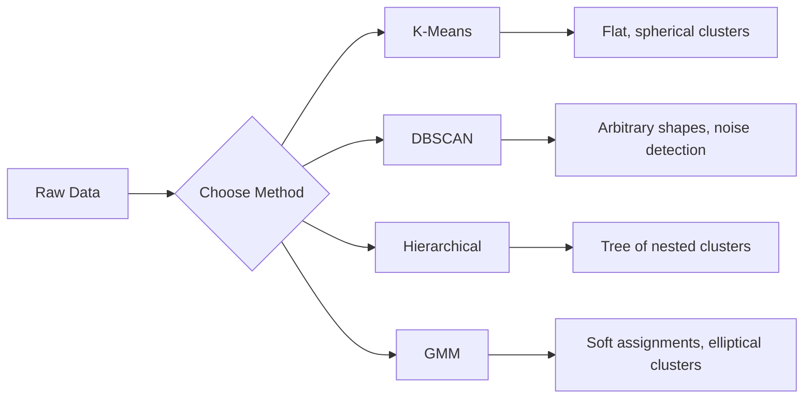

# Denetimsiz Öğrenme
# 无监督学习


> Etiket yok, öğretmen yok.

> 没有标签,没有老师──算法自己发现结构──

**Type:** Build | **类型：** 构建
**Languages:** Python
**Prerequisites:** Phase 1 (Norms & Distances, Probability & Distributions), Phase 2 Lessons 1-6 | **前置知识：** Phase 1（范数与距离、概率与分布），Phase 2 第 1-6 课
**Time:** ~90 minutes | **时间：** 约 90 分钟

## Öğrenme hedefleri

- K-Means, DBSCAN ve Gaussian Karışıklık Modellerini sıfırdan uygulayın ve gruplama davranışlarını karşılaştırın
  K-Yöntemleri, DBSCAN ve Yüksek Karışık Modeller (GMM) 'i sıfırdan gerçekleştirmekle, onların toplama davranışlarını karşılaştırın
- Optimal K seçmek için silüette puanı ve dirsek yöntemi kullanarak klüster kalitesini değerlendir
  Kullanım: Rondı ve boyutları değerlendirmek
- DBSCAN'ın K-Means'ı ne zaman geçirdiğini açıklayın ve hangi algoritmanın küre dışı kümeleri ve dış değerleri ele aldığını belirleyin.
  解释 DBSCAN 何時優越K-Means,识别哪种算法能处理非球形和异常值
- Normal desenlerden farklı noktaları işaretlemek için gruplama yöntemleri kullanarak anomali tespit boru hattı oluşturmak
  Bir gruplama yöntemi kullanarak, normalden uzak noktaları işaretleyen anormal test hattı oluşturmak


> **【中文解读】**
> 无监督学习没有标签,目标是发现数据中的结构──K-Means is the most classic聚类算法,DBSCAN 能发现任意形的──sklearn 中的KMeans/DBSCAN──客户分群、异常检测是典型应用──

> **【拓展：无监督学习在真实 AI 系统中的价值】**
> Google Fotoğraflar'ın otomatik fotoğraf bölümü, bir fotoğraf sınıflandırma algoritması kullanmakla benzer bir şekilde fotoğraf sınıflandırma yapar.Spotify'in "görün" işlevi, bir kullanıcı sınıflandırma yapar.

## Sorunlar. Sorunlar.

Şimdiye kadar her ML dersi etiketlenen verileri varsaydı: "burada bir giriş, burada doğru çıkış var". Gerçek dünyada etiketler pahalı. Bir hastanenin milyonlarca hastane kayıtları var ama kimse her hastaneyi bir hastalık kategorisine işaretlememiştir. Bir e-ticaret sitesi milyonlarca kullanıcı seansına sahiptir ama hiçbiri el etiketleri ile müşteri segmentlerine sahip değildir. Güvenlik ekibi ağ kayıtlarına sahip ama hiç kimse her anomaliyi işaretlememiştir.

>  Önceki her ders, "Bu giriş, bu doğru çıkış" olarak işaretlenen verileri varsaydı. "Gerçek dünyada, işaretleme pahalıdır.

Gözetimsiz öğrenme, neye bakması gerektiğini söylemeden kalıpları bulur. Benzer veri noktalarını gruplar, gizli yapıları keşfeder ve anomalileri yüze çıkarır. Gözetimsiz öğrenme bir cevap anahtarı olan bir ders kitabı ile öğrenirse, gözetimsiz öğrenme kalıplar ortaya çıkana kadar ham verilere bakıyor.

> 无监督学习在未被告中寻找什么的情况下发现模式――它将相似的数据点分组,发现隐藏结构,揭露异常――如果监督学习是从有答案的教科书学习,无监督学习就是从原始数据中开始到模式自显现――

Açıkçası, etiketsiz "sağ" veya "sağ"ı doğrudan ölçemezsiniz. Algoritmanızın bulduğu yapının anlamlı olup olmadığını değerlendirmek için farklı araçlara ihtiyacınız var.

> Önemli bir soru: Etiket yok, doğrudan "kef" veya "hat" ölçemezsiniz. Algoritmanın bulduğu yapıların anlamlı olup olmadığını değerlendirmek için farklı araçlara ihtiyacınız var.

> **【中文解读】**
> 无监督学习的核心挑战是评估:没有标签就无法直接衡量"对错"――轮系数、肘部法等标标间接评估聚类质量――K-Means 假设是球形的且大小相近,对异常值敏感;DBSCAN 能够发现任意形的并自动识别噪点,但需要设置密度参数――

## Konsepten bir şey.

### Gruplama: Eşyaları Bir araya getirmek

Gruplama, her veri noktasını bir gruba (cluster) tahsis eder, böylece aynı grubun içindeki noktalar diğer gruplardaki noktalara göre birbirine daha çok benzer.

> 聚类将每个数据点分给一个组),使同一组内的点比其他组的点更相似――问题始终是:"相似"的意思是什么?



### K-Means: İş Atı

K-Means verileri tam olarak K kümelerine ayırır. Her kümenin bir merkez bölgesi (masası merkezi) vardır ve her nokta en yakın merkez bölgesine aittir.

> K-Böylece verileri K 个 ── olarak ayrıştırır. Her  个有一个质心,每个点属于最近的质心──

Lloyd'un algoritması:

> Lloyd 算法:

1. K'yi başlangıç merkezleri olarak seçin
   随机选择 K 个点作为初始质心
2. Her veri noktasını en yakın merkez noktasına tahsis edin
   Her veri noktasını en yakın kalite merkezine dağıt
3. Her merkez bölgeyi, verilen noktaların ortalaması olarak hesaplayın
   重新计算每个质心为其分配点的平均值
4. Görevler değişmeyi bırakana kadar adımları 2-3 tekrarlayın
   重复步骤 2-3 dağıtım değişmezken

Objektif fonksiyon (inertia) her noktadan verilen merkezine toplam kare mesafeyi ölçer. K-Means bunu en aza indirir, ancak sadece yerel bir minimum bulur.

> 目標函数 (慣性) her noktayı kendi dağılım kalitesi toplam kare mesafesine kadar ölçmek K-Yöntemleri en küçükleştirir, ancak sadece yerel en az değerleri bulunur.

### K'yi seçmek

İki standart yöntem:

> 两种标准方法:

**Elbow method:**K-Yolları çalıştır K = 1, 2, 3, ..., n. Plot inersiyası vs K. Daha fazla kümelerin eklenmesi inersiyanı önemli ölçüde azaltmayı durdurduğu "kökü" için bakın.

> **肘部法则：**K = 1, 2, 3, ..., n 运行 K-Means──绘制惯性 vs K'ın çizimleri──寻找"肘部"增加更多不再显著减少惯性的位置──

**Silhouette score:**Her nokta için kendi kümesine (a) karşı en yakın diğer kümesine (b) ne kadar benzer olduğunu ölçün. Silouet katılamı -1 ( yanlışı kümesi) ile +1 (iyi kümesi) arasında değişen (b - a) / max(a, b) dir.

> **轮廓系数：**Her noktaya göre, onun kendi kendine benzerliğini ölçmek için (a) yakın diğer noktalar ile karşılaştırıldığında (b) ◊ rotanın ◊ √ √ √ √ √ √ √ √ √ √ √ √ √ √ √ √ √ √ √ √ √ √ √ √ √ √ √ √ √ √ √ √ √ √ √ √ √ √ √ √ √ √ √ √ √ √ √ √ √ √ √ √ √ √ √ √ √ √ √ √ √ √ √ √ √ √ √ √ √ √ √ √ √ √ √ √ √ √ √ √ √ √ √ √ √ √ √ √ √ √ √ √ √ √ √ √ √ √ √ √ √ √ √ √ √ √ √ √ √ √ √ √ √ √ √ √ √ √ √ √ √ √ √ √ √ √ √ √ √ √ √ √ √ √ √ √ √ √ √ √ √ √ √ √ √ √ √ √ √ √ √ √ √ √ √ √ √ √ √ √ √ √ √ √ √ √ √ √ √ √ √ √ √ √ √ √ √ √ √ √ √ √ √ √ √ √ √ √ √ √ √ √ √ √ √ √ √ √ √ √ √ √ √ √ √ √ √ √ √ √ √ √ √ √ √ √ √ √ √ √ √ √ √ √ √ √ √ √ √ √ √ √   √ √     

### DBSCAN: Sıklık Temelinde Gruplama

K-Means, kümelerin küresel olduğunu varsayır ve K'yi önceden seçmenizi gerektirir. DBSCAN hiçbir varsayım yapmaz.

> K-Böyle bir varsayım  is ball shaped and needs to be pre-selected K;;DBSCAN does not make these assumptions;;

İki parametre:
- **eps**: bir mahalle radyüsü
  **eps**: 邻域半径
- **min_samples**: yoğun bir bölge oluşturmak için gereken en az nokta sayısı
  **min_samples**: yoğun bölge oluşturmak için gerekli en az nokta sayısı

Üç tip nokta:
- **Core point**: eps mesafesinde en az min_sampel noktaları vardır
  **核心点**: eps                                                                                                                                                                                                                                                                                                                                                                                                                                                                                                                           
- **Border point**: bir çekirdek noktasının eps'lerinde ama kendisi çekirdek noktası değil
  **边界点**: eps'in merkezi noktası içinde ama kendisinde merkezi noktası değil
- **Noise point**Bu değerler dış seviyelerdir.
  **噪声点**Bu da normal değeri değil.

DBSCAN, birbirinden eps uzaklıkta bulunan çekirdek noktaları aynı küme ile bağlar. Sınır noktaları yakın bir çekirdek noktasının kümesine katılır.

> DBSCAN, eps'in kapsamındaki çekirdek noktaya birbirini bağlayacaktır.

Güçleri: herhangi bir şekildeki kümeleri bulur, kümelerin sayısını otomatik olarak belirler, dış değerleri belirler. Zayıflık: değişik yoğunluklu kümelerle mücadele eder.

> 优势: 发现任意形的,自动确定数,识别异常值.

### Yerarşik Gruplama

Yatağındaki kümelerden oluşan bir ağaç (dendrogram) oluşturur.

> 构建嵌套的树树状图)

Agglomeratif (altından yukarı):

> 聚合式(自底上):

1. Her noktayı kendi kümesi olarak başlat .
   Başlayın her şey kendiliğinden.
2. En yakın iki kümesi birleştir .
   合并两个最近的
3. Tekrarlayın , sadece bir küme kalana kadar
   Tekrar tekrar.
4. K kümeleri elde etmek için dendrogramı istenen düzeyde kes
   K                                                                                                                                                                                                                                                                                                                                                                                                                                                                                                                             

Gruplar arasındaki "yakınlık" aşağıdakiler gibi ölçülebilir:
- **Single linkage**: iki kümedeki herhangi iki noktanın arasındaki en az mesafe
  **单链接**İki  arasında herhangi iki nokta arasındaki en küçük mesafe
- **Complete linkage**: herhangi iki nokta arasındaki maksimum mesafe
  **全链接**: herhangi iki nokta arasındaki en büyük mesafe
- **Average linkage**: tüm çiftler arasındaki ortalama mesafe
  **平均链接**: tüm noktalara karşı ortalama mesafe
- **Ward's method**: küme içindeki toplam değişkenliğin en küçük artışına neden olan birleşim
  **Ward 方法**: 内总方差增加最小的合并

### Gaussian Karışıklık Modelleri (GMM)

K-Means zor görevler verir: her nokta tam olarak bir küme aittir. GMM yumuşak görevler verir: her nokta her küme aittir olasılığına sahiptir.

> K-Yöntem                                                                                                                                                                                                                                                                                                                                                                                                                                                                                                                         

GMM verilerin her biri kendi ortalaması ve kovariansı olan K Gaussian dağılımlarının bir karışımından üretildiğini varsayır.

> GMM 假设数据由K 个高斯分布的混合生成,各有自己的平均值和协方差──期望最大化(EM) algoritması交换进行:

- **E-step**: her noktanın her Gaussian ' a ait olma olasılığını hesaplayın
  **E 步**: hesaplama: Her nokta her yüksek dağılımın olasılığına aittir
- **M-step**: verilerin olasılığını en üst düzeye çıkarmak için her Gaussian'ın ortalama, kovarians ve karışım ağırlığını güncelleyin
  **M 步**: Her bir alt dağılımın ortalama değerini, eşdeğer farkını ve karışık ağırlığı en fazla veriyi artırmak için güncelleme

GMM eliptik kümeleri (K-Means gibi sadece küresel değil) modelleyebilir ve doğal olarak üst üste yığınan kümeleri ele alabilir.

> GMM 能建模圆(不只是 K-Means 的球形),自然处理重叠──

### Hangi Zaman Kullanılır

| Method | Best for | Avoid when |
|--------|----------|------------|
| K-Means | Large datasets, spherical clusters, known K | Irregular shapes, outliers present |
| DBSCAN | Unknown K, arbitrary shapes, outlier detection | Varying densities, very high dimensions |
| Hierarchical | Small datasets, need dendrogram, unknown K | Large datasets (O(n^2) memory) |
| GMM | Overlapping clusters, soft assignments needed | Very large datasets, too many dimensions |

| 方法 | 最适合 | 避免使用 |
|------|--------|---------|
| K-Means | 大数据集，球形簇，已知 K | 不规则形状，有异常值 |
| DBSCAN | 未知 K，任意形状，异常检测 | 密度不均匀，极高维度 |
| 层次聚类 | 小数据集，需要树状图，未知 K | 大数据集（O(n^2) 内存） |
| GMM | 重叠簇，需要软分配 | 非常大的数据集，维度太高 |

### Gruplama ile Anomaly Deteksiyonu

Gruplama doğal olarak anomali tespitini destekler:
- **K-Means**: herhangi bir merkezden uzak noktalar anormallikler
  **K-Means**Her şeyden uzak bir nokta , sıradan bir değer .
- **DBSCAN**: gürültü noktaları tanımıyla anomalilerdir
  **DBSCAN**Bu da bir garip değer .
- **GMM**Tüm Gaussiler altında düşük olasılık olan noktalar anormalliklerdir .
  **GMM**Tüm yüksek dağılımlarda olasılık çok düşük .

> 聚类天然支持异常检测:

## Yapın.

> **【中文解读】**
> K-Means'ı gerçekleştirmek için üç adımlı bir süreç: K-Means'ın başlangıç merkezi → Bölümsel bir başlangıç merkezi → 重新计算中心──重复收──DBSCAN yüksek yoğunluklu bölgeye doğru genişlemeye başlıyor, otomatik bir ses işleme noktası──
```figure
kmeans-step
```

## Yapın

### Adım 1: K-Yani sıfırdan

```python
import math
import random


def euclidean_distance(a, b):
    return math.sqrt(sum((ai - bi) ** 2 for ai, bi in zip(a, b)))


def kmeans(data, k, max_iterations=100, seed=42):
    random.seed(seed)
    n_features = len(data[0])

    centroids = random.sample(data, k)

    for iteration in range(max_iterations):
        clusters = [[] for _ in range(k)]
        assignments = []

        for point in data:
            distances = [euclidean_distance(point, c) for c in centroids]
            nearest = distances.index(min(distances))
            clusters[nearest].append(point)
            assignments.append(nearest)

        new_centroids = []
        for cluster in clusters:
            if len(cluster) == 0:
                new_centroids.append(random.choice(data))
                continue
            centroid = [
                sum(point[j] for point in cluster) / len(cluster)
                for j in range(n_features)
            ]
            new_centroids.append(centroid)

        if all(
            euclidean_distance(old, new) < 1e-6
            for old, new in zip(centroids, new_centroids)
        ):
            print(f"  Converged at iteration {iteration + 1}")
            break

        centroids = new_centroids

    return assignments, centroids
```

### Adım 2: Elbow metodu ve siluet skor

```python
def compute_inertia(data, assignments, centroids):
    total = 0.0
    for point, cluster_id in zip(data, assignments):
        total += euclidean_distance(point, centroids[cluster_id]) ** 2
    return total


def silhouette_score(data, assignments):
    n = len(data)
    if n < 2:
        return 0.0

    clusters = {}
    for i, c in enumerate(assignments):
        clusters.setdefault(c, []).append(i)

    if len(clusters) < 2:
        return 0.0

    scores = []
    for i in range(n):
        own_cluster = assignments[i]
        own_members = [j for j in clusters[own_cluster] if j != i]

        if len(own_members) == 0:
            scores.append(0.0)
            continue

        a = sum(euclidean_distance(data[i], data[j]) for j in own_members) / len(own_members)

        b = float("inf")
        for cluster_id, members in clusters.items():
            if cluster_id == own_cluster:
                continue
            avg_dist = sum(euclidean_distance(data[i], data[j]) for j in members) / len(members)
            b = min(b, avg_dist)

        if max(a, b) == 0:
            scores.append(0.0)
        else:
            scores.append((b - a) / max(a, b))

    return sum(scores) / len(scores)


def find_best_k(data, max_k=10):
    print("Elbow method:")
    inertias = []
    for k in range(1, max_k + 1):
        assignments, centroids = kmeans(data, k)
        inertia = compute_inertia(data, assignments, centroids)
        inertias.append(inertia)
        print(f"  K={k}: inertia={inertia:.2f}")

    print("\nSilhouette scores:")
    for k in range(2, max_k + 1):
        assignments, centroids = kmeans(data, k)
        score = silhouette_score(data, assignments)
        print(f"  K={k}: silhouette={score:.4f}")

    return inertias
```

### Adım 3: DBSCAN sıfırdan

```python
def dbscan(data, eps, min_samples):
    n = len(data)
    labels = [-1] * n
    cluster_id = 0

    def region_query(point_idx):
        neighbors = []
        for i in range(n):
            if euclidean_distance(data[point_idx], data[i]) <= eps:
                neighbors.append(i)
        return neighbors

    visited = [False] * n

    for i in range(n):
        if visited[i]:
            continue
        visited[i] = True

        neighbors = region_query(i)

        if len(neighbors) < min_samples:
            labels[i] = -1
            continue

        labels[i] = cluster_id
        seed_set = list(neighbors)
        seed_set.remove(i)

        j = 0
        while j < len(seed_set):
            q = seed_set[j]

            if not visited[q]:
                visited[q] = True
                q_neighbors = region_query(q)
                if len(q_neighbors) >= min_samples:
                    for nb in q_neighbors:
                        if nb not in seed_set:
                            seed_set.append(nb)

            if labels[q] == -1:
                labels[q] = cluster_id

            j += 1

        cluster_id += 1

    return labels
```

### Adım 4: Gaussian Karışıklık Modülü (EM algoritması)

```python
def gmm(data, k, max_iterations=100, seed=42):
    random.seed(seed)
    n = len(data)
    d = len(data[0])

    indices = random.sample(range(n), k)
    means = [list(data[i]) for i in indices]
    variances = [1.0] * k
    weights = [1.0 / k] * k

    def gaussian_pdf(x, mean, variance):
        d = len(x)
        coeff = 1.0 / ((2 * math.pi * variance) ** (d / 2))
        exponent = -sum((xi - mi) ** 2 for xi, mi in zip(x, mean)) / (2 * variance)
        return coeff * math.exp(max(exponent, -500))

    for iteration in range(max_iterations):
        responsibilities = []
        for i in range(n):
            probs = []
            for j in range(k):
                probs.append(weights[j] * gaussian_pdf(data[i], means[j], variances[j]))
            total = sum(probs)
            if total == 0:
                total = 1e-300
            responsibilities.append([p / total for p in probs])

        old_means = [list(m) for m in means]

        for j in range(k):
            r_sum = sum(responsibilities[i][j] for i in range(n))
            if r_sum < 1e-10:
                continue

            weights[j] = r_sum / n

            for dim in range(d):
                means[j][dim] = sum(
                    responsibilities[i][j] * data[i][dim] for i in range(n)
                ) / r_sum

            variances[j] = sum(
                responsibilities[i][j]
                * sum((data[i][dim] - means[j][dim]) ** 2 for dim in range(d))
                for i in range(n)
            ) / (r_sum * d)
            variances[j] = max(variances[j], 1e-6)

        shift = sum(
            euclidean_distance(old_means[j], means[j]) for j in range(k)
        )
        if shift < 1e-6:
            print(f"  GMM converged at iteration {iteration + 1}")
            break

    assignments = []
    for i in range(n):
        assignments.append(responsibilities[i].index(max(responsibilities[i])))

    return assignments, means, weights, responsibilities
```

### Adım 5: Test verilerini oluşturun ve her şeyi çalıştırın

```python
def make_blobs(centers, n_per_cluster=50, spread=0.5, seed=42):
    random.seed(seed)
    data = []
    true_labels = []
    for label, (cx, cy) in enumerate(centers):
        for _ in range(n_per_cluster):
            x = cx + random.gauss(0, spread)
            y = cy + random.gauss(0, spread)
            data.append([x, y])
            true_labels.append(label)
    return data, true_labels


def make_moons(n_samples=200, noise=0.1, seed=42):
    random.seed(seed)
    data = []
    labels = []
    n_half = n_samples // 2
    for i in range(n_half):
        angle = math.pi * i / n_half
        x = math.cos(angle) + random.gauss(0, noise)
        y = math.sin(angle) + random.gauss(0, noise)
        data.append([x, y])
        labels.append(0)
    for i in range(n_half):
        angle = math.pi * i / n_half
        x = 1 - math.cos(angle) + random.gauss(0, noise)
        y = 1 - math.sin(angle) - 0.5 + random.gauss(0, noise)
        data.append([x, y])
        labels.append(1)
    return data, labels


if __name__ == "__main__":
    centers = [[2, 2], [8, 3], [5, 8]]
    data, true_labels = make_blobs(centers, n_per_cluster=50, spread=0.8)

    print("=== K-Means on 3 blobs ===")
    assignments, centroids = kmeans(data, k=3)
    print(f"  Centroids: {[[round(c, 2) for c in cent] for cent in centroids]}")
    sil = silhouette_score(data, assignments)
    print(f"  Silhouette score: {sil:.4f}")

    print("\n=== Elbow Method ===")
    find_best_k(data, max_k=6)

    print("\n=== DBSCAN on 3 blobs ===")
    db_labels = dbscan(data, eps=1.5, min_samples=5)
    n_clusters = len(set(db_labels) - {-1})
    n_noise = db_labels.count(-1)
    print(f"  Found {n_clusters} clusters, {n_noise} noise points")

    print("\n=== GMM on 3 blobs ===")
    gmm_assignments, gmm_means, gmm_weights, _ = gmm(data, k=3)
    print(f"  Means: {[[round(m, 2) for m in mean] for mean in gmm_means]}")
    print(f"  Weights: {[round(w, 3) for w in gmm_weights]}")
    gmm_sil = silhouette_score(data, gmm_assignments)
    print(f"  Silhouette score: {gmm_sil:.4f}")

    print("\n=== DBSCAN on moons (non-spherical clusters) ===")
    moon_data, moon_labels = make_moons(n_samples=200, noise=0.1)
    moon_db = dbscan(moon_data, eps=0.3, min_samples=5)
    n_moon_clusters = len(set(moon_db) - {-1})
    n_moon_noise = moon_db.count(-1)
    print(f"  Found {n_moon_clusters} clusters, {n_moon_noise} noise points")

    print("\n=== K-Means on moons (will fail to separate) ===")
    moon_km, moon_centroids = kmeans(moon_data, k=2)
    moon_sil = silhouette_score(moon_data, moon_km)
    print(f"  Silhouette score: {moon_sil:.4f}")
    print("  K-Means splits moons poorly because they are not spherical")

    print("\n=== Anomaly detection with DBSCAN ===")
    anomaly_data = list(data)
    anomaly_data.append([20.0, 20.0])
    anomaly_data.append([-5.0, -5.0])
    anomaly_data.append([15.0, 0.0])
    anomaly_labels = dbscan(anomaly_data, eps=1.5, min_samples=5)
    anomalies = [
        anomaly_data[i]
        for i in range(len(anomaly_labels))
        if anomaly_labels[i] == -1
    ]
    print(f"  Detected {len(anomalies)} anomalies")
    for a in anomalies[-3:]:
        print(f"    Point {[round(v, 2) for v in a]}")
```

## Çerçeveyi kullanın.

Scikit-learn ile aynı algoritmalar tek satırlı:

> Sikit-learn kullanın, aynı algoritma sadece bir kod çizgisine ihtiyaç duyar:

```python
from sklearn.cluster import KMeans, DBSCAN, AgglomerativeClustering
from sklearn.mixture import GaussianMixture
from sklearn.metrics import silhouette_score as sklearn_silhouette

km = KMeans(n_clusters=3, random_state=42).fit(data)  # K-Means 聚类（默认 K-Means++ 初始化）
db = DBSCAN(eps=1.5, min_samples=5).fit(data)  # DBSCAN 密度聚类（eps 为邻域半径）
agg = AgglomerativeClustering(n_clusters=3).fit(data)  # 层次聚类
gmm_model = GaussianMixture(n_components=3, random_state=42).fit(data)  # 高斯混合模型（EM 算法）
```

K-Means, tahsis ve yeniden hesaplama arasında tekrarlama yapar. DBSCAN yoğun tohumlardan kümeler büyütür. GMM bekleme ve maksimumlama arasında değişir. Kitaplık sürümleri sayısal istikrar, daha akıllı başlangıç (K-Means++) ve GPU hızlandırımı ekler, ancak temel mantık aynıdır.

> Bu kitaplar, 0'dan sonra hesaplanmıştır. K-Yöntemleri dağılım ve ağırlık hesaplama arasında 代. DBSCAN yoğun tohum genişleme ︎ GMM arasında değişim ︎ beklenti ve en büyükleştirme arasında değişim ︎.

## İndirin . Ürünler .

Bu ders, K-Means, DBSCAN ve GMM'nin çalışkan uygulamalarını sıfırdan üretir.

> Bu ders, K-Means, DBSCAN ve GMM'nin sıfırdan gerçekleşmiş bir kuruluştan oluştu.

> **【拓展：聚类在用户分群和推荐系统中的应用】**
> Spotify, kullanıcıları "tattoo grupları" olarak sınıflandırarak müzik önerir. Her gruptaki kullanıcıların benzer dinleme alışkanlıkları vardır. Airbnb, arama sıralamasını optimize etmek için bir grup oluşturur. Amazon, bir grup oluşturarak ürünleri önerir.

> **【中文解读】**
> 无监督学习的评估比监督学习更困难──轮系数衡量内密度对间分离度,范围 [-1, 1],越高越好──肘部法则寻找 WCSS(内平方和) K 增加的"拐点"──GMM EM 算法 (GMM) 期望最大化 (期望最大化) 交换更新分配和参数,比 K-Means 更灵活(圆而非球形)

## Egzersizler.

1. K-Means++ başlangıç uygulaması: rastgele centroidleri seçmek yerine, ilk merkezi rastgele ve sonraki her merkezi, en yakın mevcut merkezi arasındaki mesafesi karesine nispeten olan olasılık ile seçin.
   1. 实现 K-Means++初始化: not random selection quality, but random selection first, then each subsequent quality in order to compare to recent already qualified square distance to the probability choice──
2. Kodlara hiyerarşik aglomeratif gruplama ekleyin. Ward'ın bağlantısını uygulayın ve bir dendrogram (birleştirme listesi olarak) oluşturun.
   2. K-Means  sonuçları karşılaştırmak                                                                                                                                                                                                                                                                                                                                                                                                                                                                                                                    
3. Basit bir anomali tespit borusu oluşturun: DBSCAN ve GMM'yi aynı veriler üzerinde çalıştırın, her iki yöntemin de aynı fikirde olduğu işaret noktaları dış seviyeler (DBSCAN'da gürültü, GMM'de düşük olasılık)
   3. DBSCAN ve GMM'de aynı veriler üzerinde çalıştırılan basit bir anormal denetim hattı oluşturmak.

## Anahtar Şartlar .

| Term | What people say | What it actually means |
|------|----------------|----------------------|
| Clustering | "Grouping similar things" | Partitioning data into subsets where within-group similarity exceeds between-group similarity, measured by a specific distance metric |
| Centroid | "The center of a cluster" | The mean of all points assigned to a cluster; used by K-Means as the cluster representative |
| Inertia | "How tight the clusters are" | Sum of squared distances from each point to its assigned centroid; lower is tighter |
| Silhouette score | "How well-separated clusters are" | For each point, (b - a) / max(a, b) where a is mean intra-cluster distance and b is mean nearest-cluster distance |
| Core point | "A point in a dense region" | A point with at least min_samples neighbors within eps distance, in DBSCAN |
| EM algorithm | "Soft K-Means" | Expectation-Maximization: iteratively compute membership probabilities (E-step) and update distribution parameters (M-step) |
| Dendrogram | "A tree of clusters" | A tree diagram showing the order and distance at which clusters were merged in hierarchical clustering |
| Anomaly | "An outlier" | A data point that does not conform to the expected pattern, identified as noise by DBSCAN or low-probability by GMM |

## Daha fazla okumak

- [Stanford CS229 - Unsupervised Learning](https://cs229.stanford.edu/notes2022fall/main_notes.pdf)- Andrew Ng'in gruplama ve EM üzerine ders notları
  [Stanford CS229 - 无监督学习](https://cs229.stanford.edu/notes2022fall/main_notes.pdf)- Andrew Ng'in sınıfı ve EM 讲义
- [scikit-learn Clustering Guide](https://scikit-learn.org/stable/modules/clustering.html)- Tüm gruplama algoritmalarının görsel örneklerle pratik bir karşılaştırması
  [scikit-learn 聚类指南](https://scikit-learn.org/stable/modules/clustering.html)- Tüm sınıflandırma algoritmalarının pratik karşılaştırma ve görülebilir örnekleri
- [DBSCAN original paper (Ester et al., 1996)](https://www.aaai.org/Papers/KDD/1996/KDD96-037.pdf)- yoğunluk tabanlı gruplama başlatılan kağıt
  [DBSCAN 原始论文 (Ester et al., 1996)](https://www.aaai.org/Papers/KDD/1996/KDD96-037.pdf)- yoğunluk üzerine kurulu makaleler
