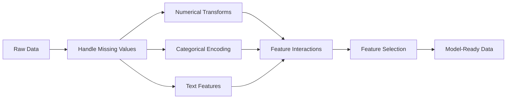

# Özellik Mühendisliği ve Seçim
# Özellikler


> İyi bir özellik bin veri noktasına değer.

> Bir iyi özellik.

**Type:** Build | **类型：** 构建
**Languages:** Python
**Prerequisites:** Phase 1 (Statistics for ML, Linear Algebra), Phase 2 Lessons 1-7 | **前置知识：** Phase 1（统计学、线性代数），Phase 2 第 1-7 课
**Time:** ~90 minutes | **时间：** 约 90 分钟

## Öğrenme hedefleri

- Sayısal dönüşümleri uygulayın (standartlama, minimum maksimum ölçekleme, log dönüşümü, binning) ve her biri ne zaman uygun olduğunu açıklayın
  实现数值变换(标准化、Min-Max 缩放、对数变换、分箱)并解释各自的适用场景
- Kategorik özellikler için tek sıcak, etiket ve hedef kodlama oluşturun ve hedef kodlama sırasında veri sızma riskini belirleyin
  Yeni kod oluşturmak  Etiket kodlaması ve hedef kodlaması, hedef kodlamayı tanımlamak  Veri sızdırma riski
- TF-IDF vektörlüğünü sıfırdan inşa edin ve metin sınıflandırması için çiğ kelime sayısını neden üstlendiğini açıklayın
  TF-IDF'yi azadan oluşturmak ve ölçerden neden daha iyi olduğunu açıklamak
- Boyutlandırmayı azaltmak için filtre tabanlı özellik seçimi (varians eşiği, korelasyon, karşılıklı bilgi) uygulanır
  应用基于过的特征选择 (tasarım 差 价值, 相关性, 互信息) 减小维度


> **【中文解读】**
> Özellik İnşaatı, orijinal verileri anlayabilen bir model olarak dönüştürmek için yapılan özelliklerdir. Bu, ML'de en çok zaman alıcı adımlardır. Standardize, kodlama, geçiş özellikleri, çok yönlü özellikler, her zaman kullanılan tekniklerdir.

> **【拓展：特征工程 vs 深度学习的自动特征学习】**
> Derin öğrenmenin temel avantajı otomatik öğrenme özellikleridir. Ancak, tablolama verileri kullanan tasarımcıların çoğu bu konuda %80'i zamanlarını kullanıyor. Netflix Ödülü'nün kazanan programı yüzlerce el tasarımı özellikleri içerir.

## Sorunlar. Sorunlar.

Verileriniz var. Bir algoritma seçersiniz. Eğitim veriyorsunuz. Sonuçlar ortalama. Daha şık bir algoritma denersiniz. Yine de ortalama. Bir hafta hiperparametre ayarlamayı geçiriyorsunuz.

> Bir veri kümesi var. Bir algoritma seçmişsin. Onu eğitmişsin. Sonuçları da aynıdır. Daha da güzel bir algoritma denemişsin.

Sonra birisi çiğ verileri daha iyi özelliklere dönüştürür ve basit bir lojistik geri dönüş, ayarlanmış gradient güçlendirilmiş ansamblinizi yenir.

> Sonra birisi orijinal verileri daha iyi özelliklere dönüştürdü, basit bir mantık geri dönüşü senin düzenlemenin seviyesini yendi.

Bu sürekli olarak gerçekleşir. Klasik ML'de, verilerin temsil edilmesi algoritmanın seçimine göre daha önemlidir. "Sıkere görüntü" ve "yataq odaları sayısı" ile bir ev fiyat modeli öğrencinin ne kadar karmaşık olmasına rağmen "başlangıçlı bir ip olarak" bir modelden daha üstün olacaktır. Algoritm sadece verdiğiniz ile çalışabilir.

> Bu durum sık sık görülür. Klasik ML'de, veri gösterimi algoritmanın seçimine göre daha önemlidir. "Yüzey" ve "Yatak sayıları" ile yapılan bir ev fiyat modeli, öğrenme makinesi ne kadar karmaşık olursa olsun, algoritma size sadece verdiği şeyleri işleyebilir.

Özellik mühendisliği, modellerin kalıpları bulmakta daha kolay hale getiren ham verileri temsillere dönüştürme sürecidir. Özellik seçimi, sinyal eklemeden gürültü ekleyen özellikleri atma sürecidir.

> Özellik İnceleme, orijinal verileri model tarafından daha kolay keşfedilen bir model olarak dönüştürmek için gösterme sürecidir. Özellik seçimi, sadece artan sesin artmadığı sinyallerin özelliklerini bırakma sürecidir.

> **【中文解读】**
> "Veriler ve özellikler ML'nin üst sınırlarını belirler, model ve algoritma sadece bu üst sınırın yakınlaşmasına neden olur. "İyi özellikler basit modellerin karmaşık modelleri yenmesine neden olur. Özellikler projesi, sayısal değişimleri, standartlama, sayısal değişimleri, sınıf kodlama, özel kodlama, hedef kodlama, metin özellikleri, zaman özellikleri, döngü kodlama, ve diğerleri içerir.

## Konsepten bir şey.

### Özellik Pipeline



### Sayısal Özellikler

Çiğ rakamlar nadiren model hazırdır.

> İlk sayı çok azdır.

**Scaling:**Özellikleri aynı aralıkta koyun, böylece mesafe tabanlı algoritmalar (K-Means, KNN, SVM) tüm özellikleri eşit şekilde değerlendirir. Min-max ölçekleme haritaları [0, 1]. Standartlama (z-not) haritaları ortalama = 0, std = 1.

> **缩放：**Özellikleri aynı aralıkta, mesafe algoritmasına göre aynı şekilde tüm özelliklere göre göre göre görecektir.

**Log transform:**Sağdaki dağılımları (gıda, nüfus, kelime sayıları) sıkıştırır.

> **对数变换：**压缩右偏分布(收入、人口、词频) ・・・将乘法关系变为加法关系──

**Binning:**Sürekli değerleri kategorilere dönüştürür. Özellik ve hedef arasındaki ilişki doğrusal değil ancak adımlarsal olduğunda yararlıdır (örneğin, yaş grupları).

> **分箱：**Bu özellikler ile hedef ilişkisi doğrusal değil ama aşama biçiminde kullanışlıdır.

**Polynomial features:**X^2, x^3, x1*x2 terimleri oluşturur.

> **多项式特征：**X^2、x^3、x1*x2 项──让线性模型以更多特征为价格捕捉非线性关系──

### Kategori Özellikleri

Modellerin sayılara, kategorilerin kodlanmasına ihtiyacı var.

> Model Numerolojiye İhtiyaç Duyar.

**One-hot encoding:**Her kategori için ikili bir sütun oluşturur. "color = red/blue/green" üç sütun haline gelir: is_red, is_blue, is_green. Düşük kardinallik özellikleri için iyi çalışır, ancak birçok kategori ile patlar.

> **独热编码：**"Renk = kırmızı/mavi/yeşil" 变成三列:is_red、is_blue、is_green。对低基数特征效果好,但类多时会爆炸。

**Label encoding:**Her kategorinin bir tam sayıya yerleştirilmesini çiz: kırmızı = 0, mavi = 1, yeşil = 2. Yanlış bir sıralama içeriyor (model yeşil > mavi > kırmızı düşünebilir). Sadece bireysel değerlere bölünen ağaç tabanlı modeller için uygundur.

> **标签编码：**Bu sayede, her sınıfı bütün sayıya göre görüntüleyebiliriz: kırmızı = 0、mavi = 1、yeşil = 2。 sahte sıralamalar yerleştirilmiştir.

**Target encoding:**Her kategoriyi bu kategori için hedef değişkenin ortalamasıyla değiştirir. Güçlü ama tehlikeli: veri sızma riski yüksek. Sadece eğitim verileri üzerine hesaplanmalı ve test verilerine uygulanmalıdır.

> **目标编码：**Her sınıfı bu sınıfın hedef değişkeninin ortalama değerine değiştirmek. Güçlü ama tehlikeli: veri sızma riski yüksek.

### Metin Özellikleri

**Count vectorizer:**Bir belgede her kelime kaç kez göründüğünü sayar. " kedi çarşafta oturuyordu " {: 2, kedi: 1, sat: 1, on: 1, mat: 1 } olur.

> **词频向量化：**計算每个词在文档中出现的次数──" kedi çarşafta oturuyordu" 变成 {the: 2, cat: 1, sat: 1, on: 1, mat: 1}──

**TF-IDF:**"Frequency-Inverse Document Frequency" terimi. Sözcüklerin farklılıklarına göre ağırlanır. "the" gibi yaygın kelimeler düşük ağırlık kazanır. Nadir, ayırt edici kelimeler yüksek ağırlık kazanır.

> **TF-IDF：**词频-逆文档频率──按词在文档中的唯一性加权──常见词如"the"获得低权重──稀有、有区分度的词获得高权重──

```
TF(word, doc) = count(word in doc) / total words in doc
IDF(word) = log(total docs / docs containing word)
TF-IDF = TF * IDF
```

### Kayıp Değerler

Gerçek verilerde boşluklar var.

> Gerçek veriler boşlukta.

- **Drop rows:**Kayıp veriler nadir ve rastgele olduğunda
  **删除行：**Sadece eksik olan veriler nadir ve rastlantı
- **Mean/median imputation:**Basit, dağılım şeklini korur (ortalama, dış değerlere daha sağlamdır)
  **均值/中位数填充：**简单,保持分布形 (中位数对异常值更鲁棒)
- **Mode imputation:**Kategorik özellikler için
  **众数填充：**Klasik özellikler için
- **Indicator column:**İletişimden önce "was_this_missing" ikili bir sütunu ekleyin. Verilerin eksik olduğu gerçeği kendisi bilgi vericidir
  **指示列：**填充前添加二进制列"hatırlanıyordu"──数据缺失本身可能是信息性
- **Forward/backward fill:**Zaman dizisi verileri için
  **前向/后向填充：**Zaman dizisi verilerine göre

### Özellikler etkileşimi

Bazen ilişki kombinasyondadır. "Yükseklik" ve "kozluk" tek başına "BMI = ağırlık / yükseklik^2" ile karşılaştırıldığında daha az öngörücüdür.

> "BMI = 体重 / 身高^2" gibi bir şekilde öngörülmüş bir ilişki vardır.

### Özellik Seçimi

Daha fazla özellik her zaman daha iyi değildir.

> 更多特征不一定好──无关特征 增加噪音、增加训练时间并可能导致过适应──

**Filter methods (pre-model):**
- İlişki: birbirine çok ilişkili olan özellikleri kaldırın (çıkıcı)
  相关性:移除高度相关的特征(冗余)
- Karşılıklı bilgi: Bir özelliği bilmek, hedef hakkında belirsizlikleri ne kadar azaltacağını ölçer
  互信息: Ölçmek bir özelliğin hedef miktarını ve belirsizliklerini azaltabilmesini sağlar
- Değişiklik eşiği: az değişen özellikleri kaldır
  方差值:移除几乎不变的特征

**Wrapper methods (model-based):**
- L1 düzenlenmesi (Lasso): İlişkin olmayan özellik ağırlıklarını tam olarak sıfıra çıkarır
  L1 正则化(Lasso): olacak 无关特征权重驱动到恰好为零
- Tekrarlı özelliklerin ortadan kaldırılması: tren, en az önemli özellikleri kaldırmak, tekrar etmek
  递归特征消除: eğitim, en önemsiz özellikleri kaldırmak,重复

**Why selection matters:**10 iyi özellikli bir model genellikle 10 iyi özellikli ve 90 gürültülü bir modelden daha iyi performans gösterecektir.

> **为什么选择很重要：**10 iyi özellikli bir model genellikle 10 iyi özellikle 90 gürültü özellikli bir modelden daha üstündür.

## Yapın.

> **【中文解读】**
> 0'dan 0'ya kadar küçültülmüş, 0'ye kadar genişletilmiş, sayısal değişimlere göre genişletilmiş, uzun son dağılımları işlenmiş, bölgeye göre genişletilmiş, farklı durumlarda uygulanabilen, farklı durumlarda değişen sayısal değişimlerin, gelirlerin, sağ yan dağılımların, KNN/SVM'nin ve diğer mesafe hassas algoritmaların uygulanması için uygulanmış değişimlerdir.
```figure
feature-scaling
```

## Yapın

### Adım 1: Sayı sıfırdan dönüştürülür

```python
import math


def min_max_scale(values):
    min_val = min(values)
    max_val = max(values)
    if max_val == min_val:
        return [0.0] * len(values)
    return [(v - min_val) / (max_val - min_val) for v in values]


def standardize(values):
    n = len(values)
    mean = sum(values) / n
    variance = sum((v - mean) ** 2 for v in values) / n
    std = math.sqrt(variance) if variance > 0 else 1.0
    return [(v - mean) / std for v in values]


def log_transform(values):
    return [math.log(v + 1) for v in values]


def bin_values(values, n_bins=5):
    min_val = min(values)
    max_val = max(values)
    bin_width = (max_val - min_val) / n_bins
    if bin_width == 0:
        return [0] * len(values)
    result = []
    for v in values:
        bin_idx = int((v - min_val) / bin_width)
        bin_idx = min(bin_idx, n_bins - 1)
        result.append(bin_idx)
    return result


def polynomial_features(row, degree=2):
    n = len(row)
    result = list(row)
    if degree >= 2:
        for i in range(n):
            result.append(row[i] ** 2)
        for i in range(n):
            for j in range(i + 1, n):
                result.append(row[i] * row[j])
    return result
```

### Adım 2: Kategori kodlama sıfırdan

```python
def one_hot_encode(values):
    categories = sorted(set(values))
    cat_to_idx = {cat: i for i, cat in enumerate(categories)}
    n_cats = len(categories)

    encoded = []
    for v in values:
        row = [0] * n_cats
        row[cat_to_idx[v]] = 1
        encoded.append(row)

    return encoded, categories


def label_encode(values):
    categories = sorted(set(values))
    cat_to_int = {cat: i for i, cat in enumerate(categories)}
    return [cat_to_int[v] for v in values], cat_to_int


def target_encode(feature_values, target_values, smoothing=10):
    global_mean = sum(target_values) / len(target_values)

    category_stats = {}
    for feat, target in zip(feature_values, target_values):
        if feat not in category_stats:
            category_stats[feat] = {"sum": 0.0, "count": 0}
        category_stats[feat]["sum"] += target
        category_stats[feat]["count"] += 1

    encoding = {}
    for cat, stats in category_stats.items():
        cat_mean = stats["sum"] / stats["count"]
        weight = stats["count"] / (stats["count"] + smoothing)
        encoding[cat] = weight * cat_mean + (1 - weight) * global_mean

    return [encoding[v] for v in feature_values], encoding
```

### Adım 3: Tekst özellikleri sıfırdan

> Üçüncü adım:文本特征──词频向量(CountVectorizer) 统计每词在文档中出现的次数;TF-IDF 在词频基础上乘以逆文档频率,降低常见词权重、提升稀有词权重──sklearn 的 `TfidfVectorizer`Bu gerçekleşmiş üretim sürümü.

```python
def count_vectorize(documents):
    vocab = {}
    idx = 0
    for doc in documents:
        for word in doc.lower().split():
            if word not in vocab:
                vocab[word] = idx
                idx += 1

    vectors = []
    for doc in documents:
        vec = [0] * len(vocab)
        for word in doc.lower().split():
            vec[vocab[word]] += 1
        vectors.append(vec)

    return vectors, vocab


def tfidf(documents):
    n_docs = len(documents)

    vocab = {}
    idx = 0
    for doc in documents:
        for word in doc.lower().split():
            if word not in vocab:
                vocab[word] = idx
                idx += 1

    doc_freq = {}
    for doc in documents:
        seen = set()
        for word in doc.lower().split():
            if word not in seen:
                doc_freq[word] = doc_freq.get(word, 0) + 1
                seen.add(word)

    vectors = []
    for doc in documents:
        words = doc.lower().split()
        word_count = len(words)
        tf_map = {}
        for word in words:
            tf_map[word] = tf_map.get(word, 0) + 1

        vec = [0.0] * len(vocab)
        for word, count in tf_map.items():
            tf = count / word_count
            idf = math.log(n_docs / doc_freq[word])
            vec[vocab[word]] = tf * idf
        vectors.append(vec)

    return vectors, vocab
```

### Adım 4: Kayıp değer sıfırdan algılama

> İlk adım: eksik değer doldurmak. Ortalama değer doldurmak. Normal dağılımlı veriler uygun, ortalama değerler normal değerlere göre değişik değerler.

```python
def impute_mean(values):
    present = [v for v in values if v is not None]
    if not present:
        return [0.0] * len(values), 0.0
    mean = sum(present) / len(present)
    return [v if v is not None else mean for v in values], mean


def impute_median(values):
    present = sorted(v for v in values if v is not None)
    if not present:
        return [0.0] * len(values), 0.0
    n = len(present)
    if n % 2 == 0:
        median = (present[n // 2 - 1] + present[n // 2]) / 2
    else:
        median = present[n // 2]
    return [v if v is not None else median for v in values], median


def impute_mode(values):
    present = [v for v in values if v is not None]
    if not present:
        return values, None
    counts = {}
    for v in present:
        counts[v] = counts.get(v, 0) + 1
    mode = max(counts, key=counts.get)
    return [v if v is not None else mode for v in values], mode


def add_missing_indicator(values):
    return [0 if v is not None else 1 for v in values]
```

### Adım 5: Baştan başlayan özellik seçimi

> Beşinci adım: Özellik Seçimi. Pierson ile ilgili faktörler: 1 ila +1); birbirine ilişkin olmayan ilişkileri daha kapsamlı olarak ele alabilme, ancak ayrıştırılması gerekir; farklılık değerinin hafifçe değişmeyen özelliklerini kaldırma; ilişkinlik eksikliği özelliklerini kaldırma; yükseklikle ilişkili özelliklerden birini koruma.`SelectKBest`- Evet.`VarianceThreshold`Bu yöntemlerin üretimi kapsamlı.

```python
def correlation(x, y):
    n = len(x)
    mean_x = sum(x) / n
    mean_y = sum(y) / n
    cov = sum((xi - mean_x) * (yi - mean_y) for xi, yi in zip(x, y)) / n
    std_x = math.sqrt(sum((xi - mean_x) ** 2 for xi in x) / n)
    std_y = math.sqrt(sum((yi - mean_y) ** 2 for yi in y) / n)
    if std_x == 0 or std_y == 0:
        return 0.0
    return cov / (std_x * std_y)


def mutual_information(feature, target, n_bins=10):
    feat_min = min(feature)
    feat_max = max(feature)
    bin_width = (feat_max - feat_min) / n_bins if feat_max != feat_min else 1.0
    feat_binned = [
        min(int((f - feat_min) / bin_width), n_bins - 1) for f in feature
    ]

    n = len(feature)
    target_classes = sorted(set(target))

    feat_bins = sorted(set(feat_binned))
    p_feat = {}
    for b in feat_bins:
        p_feat[b] = feat_binned.count(b) / n

    p_target = {}
    for t in target_classes:
        p_target[t] = target.count(t) / n

    mi = 0.0
    for b in feat_bins:
        for t in target_classes:
            joint_count = sum(
                1 for fb, tv in zip(feat_binned, target) if fb == b and tv == t
            )
            p_joint = joint_count / n
            if p_joint > 0:
                mi += p_joint * math.log(p_joint / (p_feat[b] * p_target[t]))

    return mi


def variance_threshold(features, threshold=0.01):
    n_features = len(features[0])
    n_samples = len(features)
    selected = []

    for j in range(n_features):
        col = [features[i][j] for i in range(n_samples)]
        mean = sum(col) / n_samples
        var = sum((v - mean) ** 2 for v in col) / n_samples
        if var >= threshold:
            selected.append(j)

    return selected


def remove_correlated(features, threshold=0.9):
    n_features = len(features[0])
    n_samples = len(features)

    to_remove = set()
    for i in range(n_features):
        if i in to_remove:
            continue
        col_i = [features[r][i] for r in range(n_samples)]
        for j in range(i + 1, n_features):
            if j in to_remove:
                continue
            col_j = [features[r][j] for r in range(n_samples)]
            corr = abs(correlation(col_i, col_j))
            if corr >= threshold:
                to_remove.add(j)

    return [i for i in range(n_features) if i not in to_remove]
```

### Adım 6: Tam bir boru hattı ve demo

```python
import random


def make_housing_data(n=200, seed=42):
    random.seed(seed)
    data = []
    for _ in range(n):
        sqft = random.uniform(500, 5000)
        bedrooms = random.choice([1, 2, 3, 4, 5])
        age = random.uniform(0, 50)
        neighborhood = random.choice(["downtown", "suburbs", "rural"])
        has_pool = random.choice([True, False])

        sqft_with_missing = sqft if random.random() > 0.05 else None
        age_with_missing = age if random.random() > 0.08 else None

        price = (
            50 * sqft
            + 20000 * bedrooms
            - 1000 * age
            + (50000 if neighborhood == "downtown" else 10000 if neighborhood == "suburbs" else 0)
            + (15000 if has_pool else 0)
            + random.gauss(0, 20000)
        )

        data.append({
            "sqft": sqft_with_missing,
            "bedrooms": bedrooms,
            "age": age_with_missing,
            "neighborhood": neighborhood,
            "has_pool": has_pool,
            "price": price,
        })
    return data


if __name__ == "__main__":
    data = make_housing_data(200)

    print("=== Raw Data Sample ===")
    for row in data[:3]:
        print(f"  {row}")

    sqft_raw = [d["sqft"] for d in data]
    age_raw = [d["age"] for d in data]
    prices = [d["price"] for d in data]

    print("\n=== Missing Value Handling ===")
    sqft_missing = sum(1 for v in sqft_raw if v is None)
    age_missing = sum(1 for v in age_raw if v is None)
    print(f"  sqft missing: {sqft_missing}/{len(sqft_raw)}")
    print(f"  age missing: {age_missing}/{len(age_raw)}")

    sqft_indicator = add_missing_indicator(sqft_raw)
    age_indicator = add_missing_indicator(age_raw)
    sqft_imputed, sqft_fill = impute_median(sqft_raw)
    age_imputed, age_fill = impute_mean(age_raw)
    print(f"  sqft filled with median: {sqft_fill:.0f}")
    print(f"  age filled with mean: {age_fill:.1f}")

    print("\n=== Numerical Transforms ===")
    sqft_scaled = standardize(sqft_imputed)
    age_scaled = min_max_scale(age_imputed)
    sqft_log = log_transform(sqft_imputed)
    age_binned = bin_values(age_imputed, n_bins=5)
    print(f"  sqft standardized: mean={sum(sqft_scaled)/len(sqft_scaled):.4f}, std={math.sqrt(sum(v**2 for v in sqft_scaled)/len(sqft_scaled)):.4f}")
    print(f"  age min-max: [{min(age_scaled):.2f}, {max(age_scaled):.2f}]")
    print(f"  age bins: {sorted(set(age_binned))}")

    print("\n=== Categorical Encoding ===")
    neighborhoods = [d["neighborhood"] for d in data]

    ohe, ohe_cats = one_hot_encode(neighborhoods)
    print(f"  One-hot categories: {ohe_cats}")
    print(f"  Sample encoding: {neighborhoods[0]} -> {ohe[0]}")

    le, le_map = label_encode(neighborhoods)
    print(f"  Label encoding map: {le_map}")

    te, te_map = target_encode(neighborhoods, prices, smoothing=10)
    print(f"  Target encoding: {({k: round(v) for k, v in te_map.items()})}")

    print("\n=== Text Features ===")
    descriptions = [
        "large modern house with pool",
        "small cozy cottage near downtown",
        "spacious family home with large yard",
        "modern apartment downtown with view",
        "rustic cabin in rural area",
    ]
    cv, cv_vocab = count_vectorize(descriptions)
    print(f"  Vocabulary size: {len(cv_vocab)}")
    print(f"  Doc 0 non-zero features: {sum(1 for v in cv[0] if v > 0)}")

    tf, tf_vocab = tfidf(descriptions)
    print(f"  TF-IDF vocabulary size: {len(tf_vocab)}")
    top_words = sorted(tf_vocab.keys(), key=lambda w: tf[0][tf_vocab[w]], reverse=True)[:3]
    print(f"  Doc 0 top TF-IDF words: {top_words}")

    print("\n=== Polynomial Features ===")
    sample_row = [sqft_scaled[0], age_scaled[0]]
    poly = polynomial_features(sample_row, degree=2)
    print(f"  Input: {[round(v, 4) for v in sample_row]}")
    print(f"  Polynomial: {[round(v, 4) for v in poly]}")
    print(f"  Features: [x1, x2, x1^2, x2^2, x1*x2]")

    print("\n=== Feature Selection ===")
    feature_matrix = [
        [sqft_scaled[i], age_scaled[i], float(sqft_indicator[i]), float(age_indicator[i])]
        + ohe[i]
        for i in range(len(data))
    ]

    print(f"  Total features: {len(feature_matrix[0])}")

    surviving_var = variance_threshold(feature_matrix, threshold=0.01)
    print(f"  After variance threshold (0.01): {len(surviving_var)} features kept")

    surviving_corr = remove_correlated(feature_matrix, threshold=0.9)
    print(f"  After correlation filter (0.9): {len(surviving_corr)} features kept")

    binary_prices = [1 if p > sum(prices) / len(prices) else 0 for p in prices]
    print("\n  Mutual information with target:")
    feature_names = ["sqft", "age", "sqft_missing", "age_missing"] + [f"neigh_{c}" for c in ohe_cats]
    for j in range(len(feature_matrix[0])):
        col = [feature_matrix[i][j] for i in range(len(feature_matrix))]
        mi = mutual_information(col, binary_prices, n_bins=10)
        print(f"    {feature_names[j]}: MI={mi:.4f}")

    print("\n  Correlation with price:")
    for j in range(len(feature_matrix[0])):
        col = [feature_matrix[i][j] for i in range(len(feature_matrix))]
        corr = correlation(col, prices)
        print(f"    {feature_names[j]}: r={corr:.4f}")
```

## Çerçeveyi kullanın.

> **【拓展：sklearn Pipeline 的工业级实践】**
> sklearn'ın ColumnTransformer + Pipeline özellik mühendisliği en iyi uygulamadır: sayısal özellikleri ve sınıf özelliklerini ayrı ayrı işleme, bir uçtan sonuna kadar bir akış hattı oluşturmak. Bu, eğitim kümesi ve test kümesi tamamen aynı değişimlerin kullanılmasını sağlar, veri sızdırılmasını önler.

Scikit-learn ile bu dönüşümler kompose edilebilir boru hattı:

> Bu değişimler, küçük bir öğrenme kullanarak, birleştirilebilir:

```python
from sklearn.preprocessing import StandardScaler, OneHotEncoder, PolynomialFeatures  # 预处理变换器
from sklearn.impute import SimpleImputer  # 缺失值填充
from sklearn.feature_extraction.text import TfidfVectorizer  # 文本 TF-IDF 向量化
from sklearn.feature_selection import mutual_info_classif, VarianceThreshold  # 特征选择
from sklearn.compose import ColumnTransformer  # 按列分组处理
from sklearn.pipeline import Pipeline  # 构建端到端流水线

numeric_pipe = Pipeline([
    ("imputer", SimpleImputer(strategy="median")),
    ("scaler", StandardScaler()),
])

categorical_pipe = Pipeline([
    ("encoder", OneHotEncoder(sparse_output=False)),
])

preprocessor = ColumnTransformer([
    ("num", numeric_pipe, ["sqft", "age"]),
    ("cat", categorical_pipe, ["neighborhood"]),
])
```

Kitaplık sürümleri kenar durum yönetimi, nadir matris desteği ve boru hattı kompozisyonunu ekler, ancak matematik aynıdır.

> 0'dan doğru olarak her değişim içinde neler olduğunu gösterir. Kitap versiyonu sınır koşulları işlemeyi ekler.

## İndirin . Ürünler .

Bu ders şunları ortaya çıkarır:
- `outputs/prompt-feature-engineer.md`- ham verilerden sistematik olarak mühendislik özellikleri için bir çağrı

> 本课产 出:
> - `outputs/prompt-feature-engineer.md`- İlk veri sistemleştirme mühendisliği özelliklerinden bir ipucu

> **【拓展：自动化特征工程——Featuretools 和 AutoML】**
> Özellik araçları, bir açık kaynaklı otomatik özellik mühendisliği bazıdır, ilişki türü verilerden binlerce özellik otomatik olarak oluşturabilir.

> **【中文解读】**
> TF-IDF ({{lang-IDF}}) }} }} }} }} }} }} }} }} }} }} }} }} }} }} }} }} }} }} }} }} }} }} }} }} }} }} }} }} }} }} }} }} }} }} }} }} }} }} }} }} }} }} }} }} }} }} }} }} }} }} }} }} }} }} }} }} }} }} }} }} }} }} }} }} }} }} }} }} }} }} }} }} }} }} }} }} }} }} }} }} }} }} }} }} }} }} }} }} }} }} }} }} }} }} }} }} }} }} }} }} }} }} }} }} }} }} }} }} }} }} }} }} }} }} }} }} }} }} }} }} }} }} }} }} }} }} }} }} }} }} }} }} }} }} }} }} }} }} }} }} }} }} }} }} }} }} }} }} }} }} }} }} }} }} }} }} }} }} }} }} }} }} }} }} }} }} }} }} }} }} }} }} }} }} }} }} }} }} }} }} }} }} }} }} }} }} }} }} }} }} }} }} }} }} }} }} }} }} }} }} }} }} }} }} }} }} }} }} }} }} }} }} }} }} }} }} }} }} }} }} }} }} }} }} }} }} }} }} }} }} }} }} }} }} }} }} }} }} }} }} }} }} }} }} }} }} }} }} }}

## Egzersizler.

1. Sayı dönüşümlerine güçlü ölçeklendirme (orta ve karartel aralığı ortalama ve standart sapma yerine kullanılarak) ekleyin.
   1. Değer değişimlerinde ortalama ve dört nokta mesafesinin yerine ortalama ve standart fark kullanmak.
2. Bir kaç hedef kodlamasını uygulayın: Her satır için, hedef değeri hariç hedef ortalamasını hesaplayın. Bu, naif hedef kodlamasına kıyasla aşırı uyumluluğu nasıl azaltır.
   2. 留一法目標编码: 留一法目標编码: 留一法目標编码: 留一法目标编码: 留一法目标编码: 留一法目标编码: 留一法目标编码: 留一法目标编码: 留一法目标编码: 留一法目标编码: 留一法目标编码: 留一法目标编码: 留一法目标编码: 留一法目标编码: 留一法目标编码: 留一法目标编码: 留一条, 留一条, 留一条, 计算除该行本身目标值的目标平均值.
3. Değişiklik eşiği, korelasyon filtrasyonu ve karşılıklı bilgi sıralamasını birleştiren otomatik bir özellik seçimi borusu oluşturun.
   3. Bu yapı otomatik özellikler seçme hattı,  değer farkı                                                                                                                                                                                                                                                       

## Anahtar Şartlar .

| Term | What people say | What it actually means |
|------|----------------|----------------------|
| Feature engineering | "Making new columns" | Transforming raw data into representations that expose patterns to the model |
| Standardization | "Making it normal" | Subtracting the mean and dividing by standard deviation so the feature has mean=0 and std=1 |
| One-hot encoding | "Making dummy variables" | Creating one binary column per category, where exactly one column is 1 for each row |
| Target encoding | "Using the answer to encode" | Replacing each category with the average target value for that category, with smoothing to prevent overfitting |
| TF-IDF | "Fancy word counts" | Term Frequency times Inverse Document Frequency: words weighted by how distinctive they are across the corpus |
| Imputation | "Filling in blanks" | Replacing missing values with estimated values (mean, median, mode, or model-predicted) |
| Feature selection | "Throwing out bad columns" | Removing features that add noise or redundancy, keeping only those with signal about the target |
| Mutual information | "How much one thing tells you about another" | A measure of the reduction in uncertainty about variable Y gained by observing variable X |
| Data leakage | "Accidentally cheating" | Using information during training that would not be available at prediction time, giving falsely optimistic results |

## Daha fazla okumak

- [Feature Engineering and Selection (Max Kuhn & Kjell Johnson)](http://www.feat.engineering/)- Özellik mühendisliği alanının tüm alanlarını kapsayan ücretsiz çevrimiçi kitap
  [Feature Engineering and Selection (Max Kuhn & Kjell Johnson)](http://www.feat.engineering/)- 涵盖特征工程全景的免费在线书籍
- [scikit-learn Preprocessing Guide](https://scikit-learn.org/stable/modules/preprocessing.html)- Tüm standart dönüşümler için pratik referans
  [scikit-learn 预处理指南](https://scikit-learn.org/stable/modules/preprocessing.html)- Tüm standart değişimlerinin pratik referansı
- [Target Encoding Done Right (Micci-Barreca, 2001)](https://dl.acm.org/doi/10.1145/507533.507538)- hedef kodlama ile ilgili orijinal kağıt
  [Target Encoding Done Right (Micci-Barreca, 2001)](https://dl.acm.org/doi/10.1145/507533.507538)- 带平滑的目标编码原始论文
