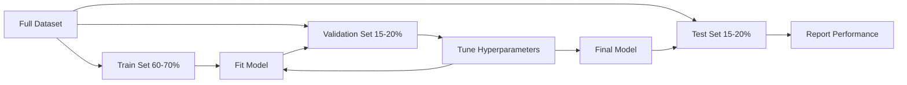

# Model değerlendirme
# 模型评估


> Bir model, ölçtüğün kadar iyi.

> Modelin iyi ve kötü durumu onu nasıl ölçtüğüne bağlıdır.

**Type:** Build | **类型：** 构建
**Languages:** Python
**Prerequisites:** Phase 1 (Probability & Distributions, Statistics for ML), Phase 2 Lessons 1-8 | **前置知识：** Phase 1（概率与分布、统计学），Phase 2 第 1-8 课
**Time:** ~90 minutes | **时间：** 约 90 分钟

## Öğrenme hedefleri

- K katlı ve katlı K katlı çapraz onaylamaları sıfırdan uygulanmalı ve dengesiz veriler için katlılığın neden önemli olduğunu açıklayın.
  K 折和分层 K 折交叉验证'ı sıfırdan gerçekleştirmek, neden bölge seviyelerine karşı dengesiz veriler neden önemli olduğunu açıklamak
- Bilgisayar hassasiyeti, geri çağırma, F1, AUC-ROC ve gerileme ölçümleri (MSE, RMSE, MAE, R-squared) sıfırdan hesaplayın
  0 hesaplama kesinlik oranı, çağrı oranı, F1 AUC-ROC, geri dönüş göstergesi, MSE, RMSE, MAE, R kare)
- Bir modelin yüksek önyargılı veya yüksek varyansiyondan muzdarip olmadığını teşhis etmek için öğrenme eğrilerini yorumlayın
  解释学习曲线 解释学习曲线 解释学习曲线 解释学习曲线 解释学习曲线 解释学习曲线 解释学习曲线 解释学习曲线 解释学习曲线 解释学习曲线 解释曲线 解释曲线 解释曲线 解释曲线 解释曲线 解释曲线 解释曲线 解释曲线 解释曲线 解释曲线 解释曲线 曲线 曲线 曲线 曲线 曲线 曲线 曲线 曲线 曲线 曲线 曲线 曲线 曲线 曲线 曲线 曲线 曲线 曲线 曲线 曲线 曲 曲 曲 曲 曲 曲 曲 曲 曲 曲 曲 曲 曲 曲 曲 曲 曲 曲 曲 曲 曲 曲 曲 曲 曲 曲 曲 曲 曲 曲 曲 曲 曲 曲 曲 曲 曲 曲 曲 曲 曲 曲 曲 曲 曲 曲 曲 曲 曲 曲 曲 曲 曲 曲 曲 曲 曲 曲 曲 曲 曲 曲 曲 曲 曲 曲 曲 曲 曲 曲 曲 曲 曲 曲 曲 曲 曲 曲 曲 曲 曲 曲 曲 曲 曲 曲 曲 曲 曲 曲 曲 曲 曲 曲 曲 曲 曲 曲 曲 曲 曲 曲 曲 曲 曲 曲 曲 曲 曲 曲 曲 曲 曲 曲 曲 曲 曲 曲 曲 曲 曲 曲 曲 曲 曲 曲 曲 曲 曲 曲 曲 曲 曲 曲 曲 曲 曲 曲 曲 曲 曲 曲 曲 曲 曲 曲 曲 曲 曲 曲 曲 曲 曲 曲 曲 曲 曲 曲 曲 曲 曲 曲 曲 曲 曲 曲 曲 曲 曲 曲 曲 曲 曲 曲 曲 曲 曲 曲
- Verilerin sızması, yanlış metrik seçimi ve test setinin kirlenmesi gibi yaygın değerlendirme hatalarını tanımlamak
  识别常见评估错误,包括数据泄漏、错误标标选择和测试集污染


> **【中文解读】**
> 模型评估回答模型到底好不好──准确率、精确率、召回率、F1、AUC-ROC 分类指标;MSE、MAE、R^2 回归指标──交叉验证防止过拟评估──sklearn 中的 cross_val_score/classification_report──

> **【拓展：模型评估失误导致的生产事故】**
> Amazon'un işe alma AI  araçları, eğitim verilerinde değerlendirilmemişken kadın adaylarına sistematik ayrımcılığa yol açan bağımsız testler (BİT) nedeniyle, son olarak zorlanmaya başladı.

## Sorunlar. Sorunlar.

Bir model eğitmişsin, verilerinde %95 doğruluk elde ediyor.

> Bir model eğitmişsin. Verilerinde %95 doğruluk oranı elde etmişsin.

- Belki de. Belki de hayır. Eğer verilerinizin %95'i bir sınıfa aitse, bu sınıfa her zaman öngördüğü bir model tamamen işe yaramazken %95 doğruluk elde eder. Eğer eğitim verdiğiniz aynı verilere göre değerlendirseniz, %95 numarası anlamsız olur çünkü model sadece cevapları ezberledi. Veriler kümenizde zaman bileşenleri varsa ve bölmeden önce rastgele karıştırdıysanız, modeliniz geçmişi tahmin etmek için gelecekteki verileri kullanabilir.

> Belki iyi, belki kötü. Eğer 95% veri bir sınıfın altındaysa, daima tahmin edilir. Bu sınıfın modeli 95% doğruluk oranını elde eder, ancak tamamen işe yaramaz. Eğer eğitimli verilerle değerlendirseniz, bu rakamın %95'i hiçbir anlamı yoktur, çünkü model sadece cevapları hatırlıyor. Eğer verileriniz zaman bileşenleri varsa ve bölünmeden önce rastlantı varsa, modeliniz gelecekte geçmişi tahmin edebilir.

Model değerlendirme çoğu ML projesinin yanlış gittiği yerdir. Yanlış ölçüm kötü bir modeli iyi görünebilir. Yanlış bölünme bir modeli aldatır. Yanlış bir karşılaştırma sizi daha kötü bir modeli seçmenize neden eder. Doğru değerlendirme yapmak seçenektir. Bu gerçek verileri gördüğünde üretimde çalışan bir model ile başarısız olan bir model arasındaki farkdır.

> Model değerlendirme çoğu ML projesinin yanlış çıkardığı yerlerdir. Hata göstergesi kötü modellerin iyi görünmesini sağlar. Hata ayırt etmeyi başarısız bir modelle karşılaştırır. Doğru değerlendirme seçeneği değildir.

> **【中文解读】**
> 模型评估最容易犯三个错误: 1) eğitim verilerinde değerlendirmek; 2) yanlış gösterge kullanmak; 3) veri sızması; 3) test kitlerinin eğitim sürecine sızması;

## Konsepten bir şey.

### Tren, Valide, Test



Üç bölük, üç amaç:

> Üç çeşit kullanım:

- **Training set**Bu verilerden öğrenir ve eğitim sırasında bu örnekleri görür.
  **训练集**Model: Modell From Middle Learning.
- **Validation set**Bu veriler, modelin hiçbir zaman bu verilere dayanmıyor, ancak kararlarınız onun etkisi altındadır.
  **验证集**Modelleler bu verilere dayalı bir eğitim değildir, ancak kararlarınız etkilenir.
- **Test set**Test performansına bakarsanız ve modelinizi değiştirmeye geri dönerseniz, artık test set değil, ikinci bir doğrulama seti haline geldi.
  **测试集**Son kez dokunarak, son performans rapor edilmiştir. Eğer test performansını izlersen, model değiştirmeye devam edersen, artık test kümesi değildir.

Test setinin rapor edilen performansın gerçekten görülmemiş veriler üzerinde modelin nasıl davranacağını yansıtması için garanti sağlayabilirsiniz.

> Test kit, raporun performansının gerçek görünmeyen veriler üzerinde gösterilmesini sağlayan bir garanti.

### K-Fold çapraz onaylama

Küçük veri kümeleri ile tek bir tren/validasyon bölümü, atık verilerini atıyor ve gürültülü tahminler veriyor. K katlı çapraz onaylama hem eğitim hem de doğrulama için tüm verileri kullanıyor:

>  Küçük veri kümesi için, tek kez eğitim/tesdiyat ayırma harcama verileri ve gürültü tahminleri verileri.

```mermaid
flowchart TB
    subgraph Fold1["Fold 1"]
        direction LR
        V1["Val"] --- T1a["Train"] --- T1b["Train"] --- T1c["Train"] --- T1d["Train"]
    end
    subgraph Fold2["Fold 2"]
        direction LR
        T2a["Train"] --- V2["Val"] --- T2b["Train"] --- T2c["Train"] --- T2d["Train"]
    end
    subgraph Fold3["Fold 3"]
        direction LR
        T3a["Train"] --- T3b["Train"] --- V3["Val"] --- T3c["Train"] --- T3d["Train"]
    end
    subgraph Fold4["Fold 4"]
        direction LR
        T4a["Train"] --- T4b["Train"] --- T4c["Train"] --- V4["Val"] --- T4d["Train"]
    end
    subgraph Fold5["Fold 5"]
        direction LR
        T5a["Train"] --- T5b["Train"] --- T5c["Train"] --- T5d["Train"] --- V5["Val"]
    end
    Fold1 --> R["Average scores"]
    Fold2 --> R
    Fold3 --> R
    Fold4 --> R
    Fold5 --> R
```



1. Verileri K eşit boyutlu katlara bölün
   Verileri K 个大相等折 olarak bölün
2. Her kat için K-1 katlarında çalıştırın ve kalan kat üzerinde doğrulayın
   Her bir dönüş için, K-1 dönüşü için eğitim, kalan bir dönüşü için test.
3. K doğrulama puanlarının ortalaması
   K 个验证分数取平均 için

K=5 veya K=10 standart seçimlerdir. Her veri noktası doğrulamak için tam olarak bir kez kullanılır. Ortalama puan herhangi bir tek bölünmeden daha istikrarlı bir tahmindir.

> K=5 veya K=10 standart seçimdir. Her bir veri noktası bir kez doğrulanmak için kullanılır.

> K=5 veya K=10 standart seçimdir. Her bir veri noktası bir kez doğrulanmak için kullanılır.

**Stratified K-fold**Eğer veri kümeniz %70 sınıf A ve %30 sınıf B ise, her katlama yaklaşık olarak aynı oranı olacaktır. Bu, rastgele bir bölünme tüm azınlık örneklerini bir katmaya koyabileceği dengesiz veri kümeleri için önemlidir.

> **分层 K 折**Eğer verileriniz %70 A sınıfı ve %30 B sınıfı ise, her birim yaklaşık aynı oranda olacaktır.

> **分层 K 折**Eğer bir veri kümesi %70'lik A sınıfı ve %30'luk B sınıfı ise, her bir dönüm yaklaşık olarak aynı oranda olacaktır.

### Sınıflandırma Metrikleri

**Confusion matrix**: temel. İkili sınıflandırma için:

> **混淆矩阵**:基础──对二分类:

> **混淆矩阵**:基础──对二分类:

|  | Predicted Positive | Predicted Negative |
|--|---|---|
| Actually Positive | True Positive (TP) | False Negative (FN) |
| Actually Negative | False Positive (FP) | True Negative (TN) |

Bu matristen, diğer tüm metrikler aşağıdakiler:

> Bu yöntemi kullanarak diğer tüm göstergeleri çıkar:

> Bu rektürden, diğer tüm göstergeleri buradan yönlendirilir:

- **Accuracy**= (TP + TN) / (TP + TN + FP + FN). Doğru tahminlerin bir kısmı. Sınıfların dengesiz olduğu zaman yanıltıcı.
  **准确率**= (TP + TN) / (TP + TN + FP + FN)。正确预测的比例──类别不平衡时具有误导性──
- **Precision**= TP / (TP + FP). Tüm tahmin edilen olumlu şeylerden, kaç tane aslında olumluydu? Yanlış olumlu olanlar pahalı olduğunda kullanın (örneğin, gerçek e-postaları spam olarak işaretleyen spam filtre).
  **精确率**= TP / (TP + FP) ・・・ tüm tahminler doğru örnekler arasında, gerçekçi olarak ne kadar doğru var?
- **Recall**(hisslilik) = TP / (TP + FN). Tüm gerçek olumlu sonuçlardan kaç taneyi yakaladık? Yanlış negatifler pahalı olduğunda kullanın (örneğin, kanser taraması tümörün eksik olduğunu gösterir).
  **召回率**(Sensitivity) = TP / (TP + FN) ◊ tüm gerçek için doğru örnekler içinde, biz ne kadar yakaladık?
- **F1 score**= 2 * doğruluk * geri çağırma / (doğrulık + geri çağırma).
  **F1 分数**= 2 * 精确率 * 召回率 / (精确率 + 召回率) ・・・精确率和召回率调和平均──在两者中都不明占优时平衡两者中──
- **AUC-ROC**Alıcı İşlem Karakteristik Küresi Altındaki Alan. Farklı sınıflandırma eşiğinde gerçek pozitif oranla yanlış pozitif oranı gösterir. AUC = 0.5 rastgele tahmin anlamına gelir, AUC = 1.0 mükemmel ayrım anlamına gelir. Eşiği bağımsız: modelin ne kadar iyi olduğunu ölçer.
  **AUC-ROC**:ROC 曲线下面积──在不同分类值下绘制真率与假正率──AUC = 0.5 表示随机猜测,AUC = 1.0 表示完美区分──与值无关:它衡量模型将正样本排在负样本前面的能力,无论你选择什么截止值──

### Gerileme Metrikleri

- **MSE**(Mean Square Error) = mean((y_true - y_pred) ^ 2). Büyük hataları karadrat olarak cezalandırır.
  **均方误差 (MSE)**= ortalama (y_true - y_pred) ^2)。
- **RMSE**(Kök ortalama kare hatası) = sqrt(MSE). Hedef değişken ile aynı birim.
  **均方根误差 (RMSE)**= mss) ◊========================================================================================================================================================================================================================================================================================================================================================================================================================================================================================================================
- **MAE**(Medi Absolute Error) = ortalama y_true - y_pred y). Tüm hataları doğrusal olarak ele alır.
  **平均绝对误差 (MAE)**= ortalama = = = = = = = = = = = = = = = = = = = = = = = = = = = = = = = = = = = = = = = = = = = = = = = = = = = = = = = = = = = = = = = = = = = = = = = = = = = = = = = = = = = = = = = = = = = = = = = = = = = = = = = = = = = = = = = = = = = = = = = = = = = = = = = = = = = = = = = = = = = = = = = = = = = = = = = = = = = = = = = = = = = = = = = = = = = = = = = = = = = = = = = = = = = = = = = = = = = = = = = = = = = = = = = = = = = = = = = = = = = = = = = = = = = = = = = = = = = = = = = = = = = = = = = = = = = = = = = = = = = = = = = = = = = = = = = = = = = = = = = = = = = = = = = = = = = = = = = = = = = = = = = = = = = = = = = = = = = = = = = = = = = = = = = = = = = = = = = = = = = = = = = = = = = = = = = = = = = = = = = = = = = = = = = = = = = = = = = = = = = = = = = = = = = = = = = = = = = = = = = = = = = = = = = = = = = = = = = = = = = = = = = = = = = = = = = = = = = = = = = = = = = = = = = = = = = = = = = = = = = = = = = = = = = = = = = = = = = = = = = = = = = = = = = = = = = = = = = = = = = = = = = = = = =
- **R-squared**= 1 - SS_res / SS_tot, burada SS_res = toplam((y_true - y_pred) ^2) ve SS_tot = toplam(((y_true - y_mean) ^2).
  **决定系数 (R-squared)**= 1 - SS_res / SS_tot, bunlardan SS_res = toplam(((y_true - y_pred) ^2),SS_tot = toplam((((y_true - y_mean) ^2);; model açıklaması:

### Öğrenme Kurbalıkları

Eğitim setinin boyutuna göre plan eğitim ve doğrulama puanları:

>  çizim eğitim bölüm sayısı ve test bölüm sayısı eğitim kümesi büyük değişikliklerin eğilimi:

> Eğitim bölümleri ve test bölümleri, Eğitim kümesi büyüklüğündeki işlevi çizim olarak kullanılır:

- **High bias (underfitting)**Bu nedenle, bu iki eğri de düşük bir puan elde eder.
  **高偏差（欠拟合）**İki eğrilik: iki eğrilik: iki eğrilik: iki eğrilik: iki eğrilik: iki eğrilik: iki eğrilik: iki eğrilik: iki eğrilik: iki eğrilik: iki eğrilik: iki eğrilik: iki eğrilik: iki eğrilik: iki eğrilik: iki eğrilik: iki eğrilik: iki eğrilik: iki eğrilik: iki eğrilik: iki eğrilik: iki eğrilik: iki eğrilik: iki eğrilik: iki eğrilik: iki eğrilik: iki eğrilik: iki eğrilik: iki eğrilik: iki eğrilik: iki eğrilik: iki eğrilik: iki eğrilik: iki eğrilik: iki eğrilik: iki eğrilik: iki eğrilik: iki eğrilik: iki eğrilik:
- **High variance (overfitting)**Bu nedenle, eğitim puanları yüksek, ancak doğrulama puanları çok daha düşük.
  **高方差（过拟合）**Bu nedenle, bu süreçte daha fazla veri sağlanmalıdır.

### Validecilik eğri

Bir hiperparametre fonksiyonu olarak çizelge eğitim ve doğrulama puanları:

>  çizim eğitim bölüm sayısı ve test bölüm sayısı süper parameter değişim eğilimi:

> Eğitim ve test sayılarını süper parametre işlevi olarak çizmek:

- Düşük karmaşıklık: her iki puan da düşük (kiçik uygun)
  复杂度低时:两个分数都低(欠拟合)
- Doğru karmaşıklıkta: her iki puan da yüksek ve birbirine yakın
  复杂度合适时: iki分数都高且接近
- Yüksek karmaşıklık: eğitim puanı yüksek kalır ama doğrulama puanı düşer (üstünleştirme)
  复杂度高时:训练分数保持高但验证分数下降(过拟合)

Optimal hiperparametre değeri, doğrulama puanının zirvesinde bulunur.

> En iyi süper parametre değeri, test oranlarının en yüksek değere ulaştığı konumdadır.

> En iyi süper parametre değeri, test oranlarının en yüksek değere ulaştığı konumdadır.

### Genel değerlendirme hataları

**Data leakage**Örneğin: zaman dizisi tahmininde gelecek verileri de dahil olmak üzere, bir ölçüde ölçer cihazı bölmeden önce tüm veri kümesine yerleştirmek.

> **数据泄漏**Testing collection information leakage to training. Örnek: 始终先划分,再预处理.

**Class imbalance**İşlemlerin %99'u meşru, %1'ü dolandırıcılık. Her zaman " meşru " tahmin eden bir model %99 doğruluk elde eder.

> **类别不平衡**%99'un işlemleri yasal, %1'ün işlemleri sahtekarlık. %99'un doğruluk oranını elde etmek için %1'in satışı yapılması gerekir.

**Wrong metric**: hatırlatmayı (tıp teşhisini) optimize etmeniz gerektiğinde doğruluğu optimize etmek veya verileriniz ağır dış seviyelerdeyken RMSE'yi optimize etmek (MAE yerine kullanın).

> **错误指标**Bu nedenle, bu durumun daha da yaygınlaşması için, bu durumun daha da yaygınlaşması için, bu durumun daha da yaygınlaşması için, bu durumun daha da yaygınlaşması için, bu durumun daha da yaygınlaşması için, bu durumun daha da yaygınlaşması için, bu durumun daha da yaygınlaşması için, bu durumun daha da yaygınlaşması için, bu durumun daha da yaygınlaşması için, bu durumun daha da yaygınlaşması için, bu durumun daha da yaygınlaşması için, bu durumun daha da önemli bir neden olduğunu belirlemek gerekir.

**Not using stratified splits**: Denge dengesiz verilerle rastgele bir bölünme, doğrulama katmanında çok az sayıda azınlık örneği yerleştirebilir ve bu da istikrarsız tahminler sağlayabilir.

> **不使用分层划分**Bu nedenle, bu değerlendirme, bir süre sonra bir süre sonra bir süre sonra bir süre sonra bir süre sonra bir süre sonra bir süre sonra bir süre sonra bir süre sonra bir süre sonra bir süre sonra bir süre sonra bir süre sonra bir süre sonra bir süre sonra bir süre sonra bir süre sonra bir süre sonra bir süre sonra bir süre sonra bir süre sonra bir süre sonra bir süre sonra bir süre sonra bir süre sonra bir süre sonra bir süre sonra bir süre sonra bir süre sonra bir süre sonra bir süre sonra bir süre sonra bir süre sonra bir süre sonra bir süre sonra bir süre sonra bir süre sonra bir süre sonra bir süre daha bir süre daha daha bir süre daha daha daha daha daha daha daha daha daha daha daha daha daha daha daha daha daha daha daha daha daha daha daha daha daha daha daha daha daha daha daha daha daha daha daha daha daha daha daha daha daha daha daha daha daha daha daha daha daha daha daha daha daha daha daha daha daha daha daha daha daha daha daha daha daha daha daha daha daha daha daha daha daha daha daha daha daha daha daha daha daha daha daha daha daha daha daha daha daha daha daha daha daha daha daha daha daha daha daha daha daha daha daha daha daha daha daha daha daha daha daha daha daha daha daha daha daha daha daha daha daha daha daha daha daha daha daha daha daha daha daha daha daha daha daha daha daha daha daha daha daha daha daha daha daha daha daha daha daha daha daha daha daha daha daha daha daha daha daha daha daha daha daha daha daha daha daha daha daha daha daha daha daha daha daha daha daha daha daha daha daha daha daha daha daha daha daha daha daha daha daha daha daha daha daha daha daha daha daha daha daha daha daha daha daha daha daha daha daha daha daha daha daha daha daha daha daha daha daha daha daha daha daha daha daha daha daha daha daha daha daha daha daha daha daha daha daha daha daha daha daha daha daha daha daha daha daha daha daha daha daha daha daha daha daha daha daha daha daha daha daha daha daha daha daha daha daha daha daha daha daha daha daha daha daha daha daha daha daha daha daha daha daha daha daha daha daha daha daha daha daha daha daha daha daha daha daha daha daha daha daha daha daha daha daha daha daha daha daha daha daha daha daha daha daha daha daha daha daha daha daha daha daha daha daha daha daha daha daha daha daha daha daha daha daha daha daha daha daha daha daha daha daha daha daha daha daha daha daha daha daha daha daha daha daha daha daha daha daha daha daha daha daha daha daha daha daha daha daha daha daha daha daha daha daha daha daha daha daha

**Testing too often**Test performansına bakıp ayarladığınızda test setine aşırı uyum sağlıyorsunuz.

> **测试过于频繁**Testleme yapısı düzenlenmiş, testleme yapısı düzenlenmiş.

## Yapın.

> **【中文解读】**
> Çıkarma testi (K katı ve K katı katı)                                                                                                                                                                                                                                                       

> **【拓展：学习曲线——诊断模型问题的利器】**
> Öğrenme eğilimi (Learning Curve) (Training Curve) eğitim hataları ve verification hatalarını çizmek, yüksek önyargı/ yüksek önyargı problemlerini teşhis etmek için doğrudan bir araçtır.
```figure
precision-recall-threshold
```

## Yapın

### Adım 1: Tren/Validasyon/Sınav bölümü

```python
import random
import math


def train_val_test_split(X, y, train_ratio=0.6, val_ratio=0.2, seed=42):
    random.seed(seed)
    n = len(X)
    indices = list(range(n))
    random.shuffle(indices)

    train_end = int(n * train_ratio)
    val_end = int(n * (train_ratio + val_ratio))

    train_idx = indices[:train_end]
    val_idx = indices[train_end:val_end]
    test_idx = indices[val_end:]

    X_train = [X[i] for i in train_idx]
    y_train = [y[i] for i in train_idx]
    X_val = [X[i] for i in val_idx]
    y_val = [y[i] for i in val_idx]
    X_test = [X[i] for i in test_idx]
    y_test = [y[i] for i in test_idx]

    return X_train, y_train, X_val, y_val, X_test, y_test
```

### Adım 2: K katlı ve katlı K katlı çapraz onaylama

```python
def kfold_split(n, k=5, seed=42):
    random.seed(seed)
    indices = list(range(n))
    random.shuffle(indices)

    fold_size = n // k
    folds = []

    for i in range(k):
        start = i * fold_size
        end = start + fold_size if i < k - 1 else n
        val_idx = indices[start:end]
        train_idx = indices[:start] + indices[end:]
        folds.append((train_idx, val_idx))

    return folds


def stratified_kfold_split(y, k=5, seed=42):
    random.seed(seed)

    class_indices = {}
    for i, label in enumerate(y):
        class_indices.setdefault(label, []).append(i)

    for label in class_indices:
        random.shuffle(class_indices[label])

    folds = [{"train": [], "val": []} for _ in range(k)]

    for label, indices in class_indices.items():
        fold_size = len(indices) // k
        for i in range(k):
            start = i * fold_size
            end = start + fold_size if i < k - 1 else len(indices)
            val_part = indices[start:end]
            train_part = indices[:start] + indices[end:]
            folds[i]["val"].extend(val_part)
            folds[i]["train"].extend(train_part)

    return [(f["train"], f["val"]) for f in folds]


def cross_validate(X, y, model_fn, k=5, metric_fn=None, stratified=False):
    n = len(X)

    if stratified:
        folds = stratified_kfold_split(y, k)
    else:
        folds = kfold_split(n, k)

    scores = []
    for train_idx, val_idx in folds:
        X_train = [X[i] for i in train_idx]
        y_train = [y[i] for i in train_idx]
        X_val = [X[i] for i in val_idx]
        y_val = [y[i] for i in val_idx]

        model = model_fn()
        model.fit(X_train, y_train)
        predictions = [model.predict(x) for x in X_val]

        if metric_fn:
            score = metric_fn(y_val, predictions)
        else:
            score = sum(1 for yt, yp in zip(y_val, predictions) if yt == yp) / len(y_val)
        scores.append(score)

    return scores
```

### Adım 3: Kafası karışıklık matrisi ve sınıflandırma ölçütleri

> Üçüncü adım:混矩阵和分类指标──零实现 TP/TN/FP/FN 计数,再推导出准确率、精确率、召回率、F1──ROC 曲线扫描所有可能值,记录每点的 (FPR, TPR),AUC 是曲线下面积(梯形法计算)

```python
def confusion_matrix(y_true, y_pred):
    tp = sum(1 for yt, yp in zip(y_true, y_pred) if yt == 1 and yp == 1)
    tn = sum(1 for yt, yp in zip(y_true, y_pred) if yt == 0 and yp == 0)
    fp = sum(1 for yt, yp in zip(y_true, y_pred) if yt == 0 and yp == 1)
    fn = sum(1 for yt, yp in zip(y_true, y_pred) if yt == 1 and yp == 0)
    return tp, tn, fp, fn


def accuracy(y_true, y_pred):
    tp, tn, fp, fn = confusion_matrix(y_true, y_pred)
    total = tp + tn + fp + fn
    return (tp + tn) / total if total > 0 else 0.0


def precision(y_true, y_pred):
    tp, tn, fp, fn = confusion_matrix(y_true, y_pred)
    return tp / (tp + fp) if (tp + fp) > 0 else 0.0


def recall(y_true, y_pred):
    tp, tn, fp, fn = confusion_matrix(y_true, y_pred)
    return tp / (tp + fn) if (tp + fn) > 0 else 0.0


def f1_score(y_true, y_pred):
    p = precision(y_true, y_pred)
    r = recall(y_true, y_pred)
    return 2 * p * r / (p + r) if (p + r) > 0 else 0.0


def roc_curve(y_true, y_scores):
    thresholds = sorted(set(y_scores), reverse=True)
    tpr_list = []
    fpr_list = []

    total_positives = sum(y_true)
    total_negatives = len(y_true) - total_positives

    for threshold in thresholds:
        y_pred = [1 if s >= threshold else 0 for s in y_scores]
        tp = sum(1 for yt, yp in zip(y_true, y_pred) if yt == 1 and yp == 1)
        fp = sum(1 for yt, yp in zip(y_true, y_pred) if yt == 0 and yp == 1)

        tpr = tp / total_positives if total_positives > 0 else 0.0
        fpr = fp / total_negatives if total_negatives > 0 else 0.0

        tpr_list.append(tpr)
        fpr_list.append(fpr)

    return fpr_list, tpr_list, thresholds


def auc_roc(y_true, y_scores):
    fpr_list, tpr_list, _ = roc_curve(y_true, y_scores)

    pairs = sorted(zip(fpr_list, tpr_list))
    fpr_sorted = [p[0] for p in pairs]
    tpr_sorted = [p[1] for p in pairs]

    area = 0.0
    for i in range(1, len(fpr_sorted)):
        width = fpr_sorted[i] - fpr_sorted[i - 1]
        height = (tpr_sorted[i] + tpr_sorted[i - 1]) / 2
        area += width * height

    return area
```

### 4. Adım: Gerileme ölçümleri

> 第四步:归归指标──MSE(均方差) 对于大误差二次惩罚、异常值;RMSE与目标单位一致便于解释;MAE(平均绝对误差) 线性处理、对异常值鲁棒;R2(决定系数) = 1 -残差平方和 / 总平方和,表示模型解释了多少方差──

```python
def mse(y_true, y_pred):
    n = len(y_true)
    return sum((yt - yp) ** 2 for yt, yp in zip(y_true, y_pred)) / n


def rmse(y_true, y_pred):
    return math.sqrt(mse(y_true, y_pred))


def mae(y_true, y_pred):
    n = len(y_true)
    return sum(abs(yt - yp) for yt, yp in zip(y_true, y_pred)) / n


def r_squared(y_true, y_pred):
    mean_y = sum(y_true) / len(y_true)
    ss_res = sum((yt - yp) ** 2 for yt, yp in zip(y_true, y_pred))
    ss_tot = sum((yt - mean_y) ** 2 for yt in y_true)
    if ss_tot == 0:
        return 0.0
    return 1.0 - ss_res / ss_tot
```

### Adım 5: Öğrenme eğri

> 第五步:学习曲线──逐步增加训练数据量,记录训练分数和验证分数──两条曲线都低→高偏差(欠配);训练高但验证低→高方差(过拟合)──这是诊断模型问题的最直观的工具──

```python
def learning_curve(X, y, model_fn, metric_fn, train_sizes=None, val_ratio=0.2, seed=42):
    random.seed(seed)
    n = len(X)
    indices = list(range(n))
    random.shuffle(indices)

    val_size = int(n * val_ratio)
    val_idx = indices[:val_size]
    pool_idx = indices[val_size:]

    X_val = [X[i] for i in val_idx]
    y_val = [y[i] for i in val_idx]

    if train_sizes is None:
        train_sizes = [int(len(pool_idx) * r) for r in [0.1, 0.2, 0.4, 0.6, 0.8, 1.0]]

    train_scores = []
    val_scores = []

    for size in train_sizes:
        subset = pool_idx[:size]
        X_train = [X[i] for i in subset]
        y_train = [y[i] for i in subset]

        model = model_fn()
        model.fit(X_train, y_train)

        train_pred = [model.predict(x) for x in X_train]
        val_pred = [model.predict(x) for x in X_val]

        train_scores.append(metric_fn(y_train, train_pred))
        val_scores.append(metric_fn(y_val, val_pred))

    return train_sizes, train_scores, val_scores
```

### Adım 6: Test için basit bir sınıflandırıcı ve tam demo

> 第六步: Test değerlendirmesi kodları için kullanılan basit bir mantıksal geri dönüş sınıflandırma aracı.

```python
class SimpleLogistic:
    def __init__(self, lr=0.1, epochs=100):
        self.lr = lr
        self.epochs = epochs
        self.weights = None
        self.bias = 0.0

    def sigmoid(self, z):
        z = max(-500, min(500, z))
        return 1.0 / (1.0 + math.exp(-z))

    def fit(self, X, y):
        n_features = len(X[0])
        self.weights = [0.0] * n_features
        self.bias = 0.0

        for _ in range(self.epochs):
            for xi, yi in zip(X, y):
                z = sum(w * x for w, x in zip(self.weights, xi)) + self.bias
                pred = self.sigmoid(z)
                error = yi - pred
                for j in range(n_features):
                    self.weights[j] += self.lr * error * xi[j]
                self.bias += self.lr * error

    def predict_proba(self, x):
        z = sum(w * xi for w, xi in zip(self.weights, x)) + self.bias
        return self.sigmoid(z)

    def predict(self, x):
        return 1 if self.predict_proba(x) >= 0.5 else 0


class SimpleLinearRegression:
    def __init__(self, lr=0.001, epochs=200):
        self.lr = lr
        self.epochs = epochs
        self.weights = None
        self.bias = 0.0

    def fit(self, X, y):
        n_features = len(X[0])
        self.weights = [0.0] * n_features
        self.bias = 0.0
        n = len(X)

        for _ in range(self.epochs):
            for xi, yi in zip(X, y):
                pred = sum(w * x for w, x in zip(self.weights, xi)) + self.bias
                error = yi - pred
                for j in range(n_features):
                    self.weights[j] += self.lr * error * xi[j] / n
                self.bias += self.lr * error / n

    def predict(self, x):
        return sum(w * xi for w, xi in zip(self.weights, x)) + self.bias


def standardize(values):
    n = len(values)
    mean = sum(values) / n
    var = sum((v - mean) ** 2 for v in values) / n
    std = math.sqrt(var) if var > 0 else 1.0
    return [(v - mean) / std for v in values], mean, std


def make_classification_data(n=300, seed=42):
    random.seed(seed)
    X = []
    y = []
    for _ in range(n):
        x1 = random.gauss(0, 1)
        x2 = random.gauss(0, 1)
        label = 1 if (x1 + x2 + random.gauss(0, 0.5)) > 0 else 0
        X.append([x1, x2])
        y.append(label)
    return X, y


def make_regression_data(n=200, seed=42):
    random.seed(seed)
    X = []
    y = []
    for _ in range(n):
        x1 = random.uniform(0, 10)
        x2 = random.uniform(0, 5)
        target = 3 * x1 + 2 * x2 + random.gauss(0, 2)
        X.append([x1, x2])
        y.append(target)
    return X, y


def make_imbalanced_data(n=300, minority_ratio=0.05, seed=42):
    random.seed(seed)
    X = []
    y = []
    for _ in range(n):
        if random.random() < minority_ratio:
            x1 = random.gauss(3, 0.5)
            x2 = random.gauss(3, 0.5)
            label = 1
        else:
            x1 = random.gauss(0, 1)
            x2 = random.gauss(0, 1)
            label = 0
        X.append([x1, x2])
        y.append(label)
    return X, y


if __name__ == "__main__":
    X_clf, y_clf = make_classification_data(300)

    print("=== Train/Validation/Test Split ===")
    X_train, y_train, X_val, y_val, X_test, y_test = train_val_test_split(X_clf, y_clf)
    print(f"  Train: {len(X_train)}, Val: {len(X_val)}, Test: {len(X_test)}")
    print(f"  Train class distribution: {sum(y_train)}/{len(y_train)} positive")
    print(f"  Val class distribution: {sum(y_val)}/{len(y_val)} positive")

    # 主程序：完整演示训练/验证/测试划分、分类指标（含混淆矩阵、F1、AUC-ROC）、K 折交叉验证、回归指标（MSE/RMSE/MAE/R²）、学习曲线、不平衡数据评估。每个环节都展示具体数值，让评估方法变得具体。

    model = SimpleLogistic(lr=0.1, epochs=200)
    model.fit(X_train, y_train)

    print("\n=== Classification Metrics ===")
    y_pred = [model.predict(x) for x in X_test]
    tp, tn, fp, fn = confusion_matrix(y_test, y_pred)
    print(f"  Confusion matrix: TP={tp}, TN={tn}, FP={fp}, FN={fn}")
    print(f"  Accuracy:  {accuracy(y_test, y_pred):.4f}")
    print(f"  Precision: {precision(y_test, y_pred):.4f}")
    print(f"  Recall:    {recall(y_test, y_pred):.4f}")
    print(f"  F1 Score:  {f1_score(y_test, y_pred):.4f}")

    y_scores = [model.predict_proba(x) for x in X_test]
    auc = auc_roc(y_test, y_scores)
    print(f"  AUC-ROC:   {auc:.4f}")

    print("\n=== K-Fold Cross-Validation (K=5) ===")
    cv_scores = cross_validate(
        X_clf, y_clf,
        model_fn=lambda: SimpleLogistic(lr=0.1, epochs=200),
        k=5,
        metric_fn=accuracy,
    )
    mean_cv = sum(cv_scores) / len(cv_scores)
    std_cv = math.sqrt(sum((s - mean_cv) ** 2 for s in cv_scores) / len(cv_scores))
    print(f"  Fold scores: {[round(s, 4) for s in cv_scores]}")
    print(f"  Mean: {mean_cv:.4f} (+/- {std_cv:.4f})")

    print("\n=== Stratified K-Fold Cross-Validation (K=5) ===")
    strat_scores = cross_validate(
        X_clf, y_clf,
        model_fn=lambda: SimpleLogistic(lr=0.1, epochs=200),
        k=5,
        metric_fn=accuracy,
        stratified=True,
    )
    strat_mean = sum(strat_scores) / len(strat_scores)
    strat_std = math.sqrt(sum((s - strat_mean) ** 2 for s in strat_scores) / len(strat_scores))
    print(f"  Fold scores: {[round(s, 4) for s in strat_scores]}")
    print(f"  Mean: {strat_mean:.4f} (+/- {strat_std:.4f})")

    print("\n=== Imbalanced Data: Why Accuracy Lies ===")
    X_imb, y_imb = make_imbalanced_data(300, minority_ratio=0.05)
    positives = sum(y_imb)
    print(f"  Class distribution: {positives} positive, {len(y_imb) - positives} negative ({positives/len(y_imb)*100:.1f}% positive)")

    always_negative = [0] * len(y_imb)
    print(f"  Always-negative baseline:")
    print(f"    Accuracy:  {accuracy(y_imb, always_negative):.4f}")
    print(f"    Precision: {precision(y_imb, always_negative):.4f}")
    print(f"    Recall:    {recall(y_imb, always_negative):.4f}")
    print(f"    F1 Score:  {f1_score(y_imb, always_negative):.4f}")

    X_tr_i, y_tr_i, X_v_i, y_v_i, X_te_i, y_te_i = train_val_test_split(X_imb, y_imb)
    model_imb = SimpleLogistic(lr=0.5, epochs=500)
    model_imb.fit(X_tr_i, y_tr_i)
    y_pred_imb = [model_imb.predict(x) for x in X_te_i]
    print(f"\n  Trained model on imbalanced data:")
    print(f"    Accuracy:  {accuracy(y_te_i, y_pred_imb):.4f}")
    print(f"    Precision: {precision(y_te_i, y_pred_imb):.4f}")
    print(f"    Recall:    {recall(y_te_i, y_pred_imb):.4f}")
    print(f"    F1 Score:  {f1_score(y_te_i, y_pred_imb):.4f}")

    print("\n=== Regression Metrics ===")
    X_reg, y_reg = make_regression_data(200)

    col0 = [x[0] for x in X_reg]
    col1 = [x[1] for x in X_reg]
    col0_s, m0, s0 = standardize(col0)
    col1_s, m1, s1 = standardize(col1)
    X_reg_scaled = [[col0_s[i], col1_s[i]] for i in range(len(X_reg))]

    X_tr_r, y_tr_r, X_v_r, y_v_r, X_te_r, y_te_r = train_val_test_split(X_reg_scaled, y_reg)
    reg_model = SimpleLinearRegression(lr=0.01, epochs=500)
    reg_model.fit(X_tr_r, y_tr_r)
    y_pred_r = [reg_model.predict(x) for x in X_te_r]

    print(f"  MSE:       {mse(y_te_r, y_pred_r):.4f}")
    print(f"  RMSE:      {rmse(y_te_r, y_pred_r):.4f}")
    print(f"  MAE:       {mae(y_te_r, y_pred_r):.4f}")
    print(f"  R-squared: {r_squared(y_te_r, y_pred_r):.4f}")

    mean_baseline = [sum(y_tr_r) / len(y_tr_r)] * len(y_te_r)
    print(f"\n  Mean baseline:")
    print(f"    MSE:       {mse(y_te_r, mean_baseline):.4f}")
    print(f"    R-squared: {r_squared(y_te_r, mean_baseline):.4f}")

    print("\n=== Learning Curve ===")
    sizes, train_sc, val_sc = learning_curve(
        X_clf, y_clf,
        model_fn=lambda: SimpleLogistic(lr=0.1, epochs=200),
        metric_fn=accuracy,
    )
    print(f"  {'Size':>6} {'Train':>8} {'Val':>8}")
    for s, tr, va in zip(sizes, train_sc, val_sc):
        print(f"  {s:>6} {tr:>8.4f} {va:>8.4f}")

    print("\n=== Statistical Model Comparison ===")
    model_a_scores = cross_validate(
        X_clf, y_clf,
        model_fn=lambda: SimpleLogistic(lr=0.1, epochs=100),
        k=5, metric_fn=accuracy,
    )
    model_b_scores = cross_validate(
        X_clf, y_clf,
        model_fn=lambda: SimpleLogistic(lr=0.1, epochs=500),
        k=5, metric_fn=accuracy,
    )
    diffs = [a - b for a, b in zip(model_a_scores, model_b_scores)]
    mean_diff = sum(diffs) / len(diffs)
    std_diff = math.sqrt(sum((d - mean_diff) ** 2 for d in diffs) / len(diffs))
    t_stat = mean_diff / (std_diff / math.sqrt(len(diffs))) if std_diff > 0 else 0.0
    print(f"  Model A (100 epochs) mean: {sum(model_a_scores)/len(model_a_scores):.4f}")
    print(f"  Model B (500 epochs) mean: {sum(model_b_scores)/len(model_b_scores):.4f}")
    print(f"  Mean difference: {mean_diff:.4f}")
    print(f"  Paired t-statistic: {t_stat:.4f}")
    print(f"  (|t| > 2.78 for significance at p<0.05 with df=4)")
```

## Çerçeveyi kullanın.

Scikit-learn ile değerlendirme iş akışına dahil edilmiştir:

> Sikit-learn kullanılarak, evalüye内置于工作流中:

```python
from sklearn.model_selection import cross_val_score, StratifiedKFold, learning_curve
from sklearn.metrics import (
    accuracy_score, precision_score, recall_score, f1_score,
    roc_auc_score, confusion_matrix, mean_squared_error, r2_score,
)
from sklearn.linear_model import LogisticRegression

model = LogisticRegression()
scores = cross_val_score(model, X, y, cv=StratifiedKFold(5), scoring="f1")
```

Çıkarılı onaylama tam olarak ne yaptığını (sihir yok, sadece ön döngüler ve indeks izleme), her metrik nasıl hesaplanır (sadece TP /FP /TN / FN sayılması) ve neden stratifikasyon önemli olduğunu (her kattaki sınıf oranlarını korumak) göstermektedir.

> 0'dan doğru olarak, geçiş testi ne yaptığını gösterdi.

## İndirin . Ürünler .

Bu ders şunları ortaya çıkarır:
- `outputs/skill-evaluation.md`- sınıflandırma ve gerileme modelleri için değerlendirme stratejisini kapsayan bir beceri

> 本课产 出:
> - `outputs/skill-evaluation.md`- sınıflandırma ve geri dönüş modeli değerlendirme stratejisi becerilerini kapsar

> **【拓展：A/B 测试——模型评估的终极标准】**
> Endüstri dünyasında, çevrimiçi değerlendirme göstergesi ((( doğruluk oranı、AUC vb) sadece bir referans, gerçek değerlendirme çevrimiçi A/B testidir. Google her yıl 10 bin kez A/B testini yürütüyor. Arama algoritmasını geliştirmek için; A/B testini kullanan Netflix, algoritmanın çevrimiçi olup olmadığını belirler. A/B testinin değerlendirilmesinin merkezi olan A/B testinin merkezi, rastlantı akışı ve statistik belirginlik testidir.

> **【中文解读】**
> ROC  eğilimi çizim farklı  değer altında TPR( gerçek oran) karşı FPR( sahte doğruluk oranı),AUC  eğilimi  面积(0.5=随机,1.0=完美) ・・・AUPRC(精确率-召回率曲线下面积) on imbalance data on AUC-ROC より有信息量。MCC(马修斯相关系数) on imbalance data on comprehensive indicator, considering all four of the imbalance矩阵。

## Egzersizler.

1. Precision-recall eğri uygulama: grafik doğruluğu vs. farklı eşişlerde geri çağırma. Ortalama doğruluğu hesaplayın (PR eğri altında alan). PR eğriyi dengesiz bir veri kümesinde ROC eğriyle karşılaştırın ve her biri ne zaman daha bilgilendirici olduğunu açıklayın.
   1. 实现精确率-召回率曲线:在不同值下绘制精确率与召回率──计算平均精确率(PR 曲线下面积)──在不平衡数据集上将PR 曲线与ROC 曲线比较,解释各自何时有更多信息──
2. Bir yuva oluşturun: dış yuva model performansını değerlendirir, iç yuva hiperparametre ayarlar.
   2. 构建嵌套交叉验证循环:外循环评估模型性能,内循环调优超参数――;
3. Model karşılaştırması için bir permutasyon testi uygulayın: etiketleri karıştırın, yeniden eğitilin ve performans ölçülsün. Null dağılım oluşturmak için 100 kez tekrarlayın. Bu dağılımla gözlemlenen model performansının p değerini hesaplayın.
   3. 实现模型比较的置换检验:打乱标签,重新训练,测量性能──重复 100次建立零分布──计算观测模型性能对这个分布的p 值──

## Anahtar Şartlar .

| Term | What people say | What it actually means |
|------|----------------|----------------------|
| Overfitting | "Memorizing the training data" | The model captures noise in the training data, performing well on training but poorly on unseen data |
| Cross-validation | "Testing on different subsets" | Systematically rotating which portion of data is used for validation, averaging results across all rotations |
| Precision | "How many predicted positives are correct" | TP / (TP + FP): the fraction of positive predictions that are actually positive |
| Recall | "How many actual positives we found" | TP / (TP + FN): the fraction of actual positives that were correctly identified |
| AUC-ROC | "How well the model separates classes" | The area under the curve of true positive rate vs false positive rate across all thresholds, from 0.5 (random) to 1.0 (perfect) |
| R-squared | "How much variance is explained" | 1 - (sum of squared residuals / total sum of squares): the fraction of target variance captured by the model |
| Data leakage | "The model cheated" | Using information during training that would not be available at prediction time, leading to optimistic evaluation |
| Learning curve | "How performance changes with more data" | A plot of training and validation scores vs training set size, revealing underfitting or overfitting |
| Stratified split | "Keeping class ratios balanced" | Splitting data so each subset has the same proportion of each class as the full dataset |

## Daha fazla okumak

- [scikit-learn Model Selection Guide](https://scikit-learn.org/stable/model_selection.html)- çapraz onaylama, ölçümler ve hiperparametre ayarlamaları hakkında kapsamlı bir referans
  [scikit-learn 模型选择指南](https://scikit-learn.org/stable/model_selection.html)- 交叉验证、指标和超参数调优 之全面参考
- [Beyond Accuracy: Precision and Recall (Google ML Crash Course)](https://developers.google.com/machine-learning/crash-course/classification/precision-and-recall)- açık açıklama ve etkileşimli örnekler
  [Beyond Accuracy: Precision and Recall (Google ML Crash Course)](https://developers.google.com/machine-learning/crash-course/classification/precision-and-recall)- 带交互示例的清晰解释
- [A Survey of Cross-Validation Procedures (Arlot & Celisse, 2010)](https://projecteuclid.org/journals/statistics-surveys/volume-4/issue-none/A-survey-of-cross-validation-procedures-for-model-selection/10.1214/09-SS054.full)- farklı CV stratejileri ne zaman ve neden işe yarayacağı konusunda sıkı bir
  [A Survey of Cross-Validation Procedures (Arlot & Celisse, 2010)](https://projecteuclid.org/journals/statistics-surveys/volume-4/issue-none/A-survey-of-cross-validation-procedures-for-model-selection/10.1214/09-SS054.full)- farklılıkları verification stratejisi ne zaman etkili sert analiz
