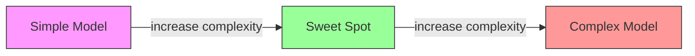
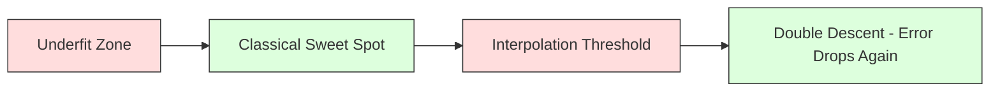
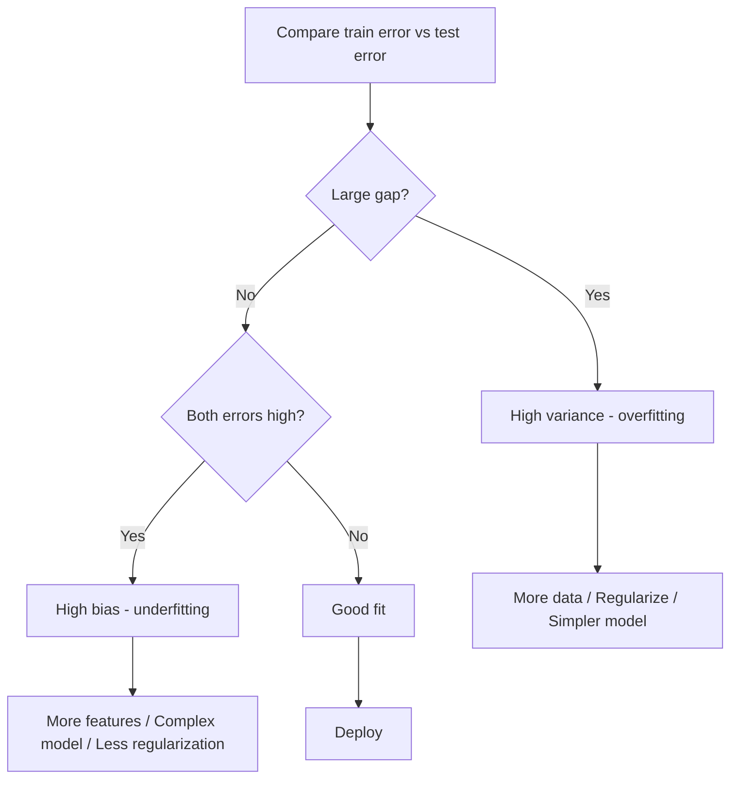
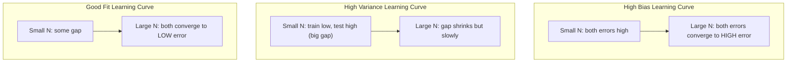
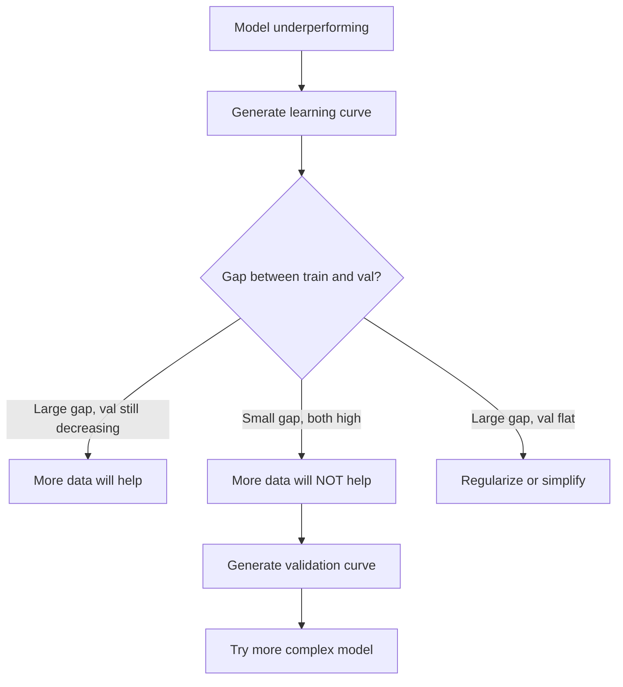

# Taraflı Çeşitlilik Ticaret
# 偏差-方差权衡


> Her model hatası üç kaynağın birinden gelir: önyargı, varyansa veya gürültü. Sadece ilk iki kaynağı kontrol edebilirsiniz.

> Her model hatası üç kaynağın birinden gelir: fark fark, fark veya gürültü.

**Type:** Learn | **类型：** 学习
**Language:**Python .**语言：**Python
**Prerequisites:** Phase 2, Lessons 01-09 (ML basics, regression, classification, evaluation) | **前置知识：** Phase 2 第 1-9 课（ML 基础、回归、分类、评估）
**Time:** ~75 minutes | **时间：** 约 75 分钟

## Öğrenme hedefleri

- Beklenen tahmin hatasındaki önyargı-varians parçalanmasını çıkarın ve azaltılamaz gürültünün rolünü açıklayın
  推导期望预测 误差的偏差-方差分解, açıklamak için 无约噪声的角色
- Bir modelin yüksek önyargılılık veya yüksek varyansa ile ilgili olarak eğitim ve test hata modellerini kullanarak teşhis edilmelidir.
  Uses training error and test error mode Diagnostic model yüksek özenli veya yüksek özenli bir fark olup olmadığını
- Düzenleme tekniklerinin (L1, L2, bırakma, erken durma) varians için nasıl önyargılı olduğunu açıklayın
  解释正则化技术(L1、L2、Dropout、早停) nasıl bir fark ve fark arasında bir tartışma
- Artan karmaşıklık modellerinde önyargı-varians pazarlamasını görselleştiren deneyler uygula
   görülebilirlik modellerinin karmaşıklığı arttıkça fark-aralık ağırlık ölçüm deneylerini gerçekleştirmek


> **【中文解读】**
> 偏差 (Önemli) 模型 çok basit 欠拟合) vs 方差 (Önemli) 模型 çok karmaşık 过拟合) 的平衡──正则化──L1/L2)、增加数据、降低模型复杂度是常用手段──理解偏差-方差权衡是调调的理论基础──

> **【拓展：偏差-方差在深度学习中的新理解】**
> Klasik teoriler, büyüme büyük modellerin yüksek ve yüksek farklılıklara sahip olacağını, ancak derin öğrenim içinde "iki kat düşüş" oluştuğunu iddia ediyor. Bu durum, derin öğrenimlerde "iki kat düşüş" anlamına gelir.

## Sorunlar. Sorunlar.

Bir model eğitmişsin. Test verilerinde bir hata var. Bu hata nereden geliyor?

> Bir model eğitmişsin. Test verilerinde bazı hatalar var. Bu hatalar nereden çıktı?

Eğer modeliniz çok basitse (eğlenmiş bir veri kümesinde doğrusal gerileme), doğru örneği sürekli kaybeder. Bu tarafsızlık. Eğer modeliniz çok karmaşıksa (15 veri noktasında 20 derece polinom) eğitim verilerine mükemmel bir şekilde uyar ancak yeni verilere karşı çok farklı tahminler verir. Bu varyans.

> Eğer modeliniz çok basitse, gerçek modelden uzaklaşmaya devam eder. Bu da bir fark. Eğer modeliniz çok karmaşıksa, 15 veri noktasında 20 adet daha fazla konumu kullanırsa, mükemmel bir şekilde egzersiz verilerine uygun olur.

Bir sabit model kapasitesi için her ikisini de aynı anda en aza indiremezsiniz. Tasarım ayrımını aşağıya ve varyansa artıyor. Varyansa ayrımını aşağıya ve varyansa artıyor. Bu anlaşmayı anlamak makine öğreniminde en faydalı teşhis becerisi.

> Sistemsel model kapasitesi için, ikisini de aynı anda en aza indiremezsiniz  basınç düşük ayrımcılık, açıktırma artar  basınç düşük ayrımcılık, açıktırma artar  bu tartıyı anlamak, makine öğreniminde en faydalı teşhis becerisi dır. Bu, modelin daha karmaşık veya daha basit hale getirilmesi, daha fazla veri veya daha iyi bir mühendislik özellikleri elde edilmesi, daha fazla veya daha az bir düzeltme yapılması gerektiğini söyler.

> **【中文解读】**
> 误差 = 偏差2 + 方差 + 不可约噪声。偏差来自模型的错假设(如用直线拟合曲线), 偏差来自训练数据波动的过度敏感──诊断方法:训练误差高+测试误差高→高偏差(欠拟合);训练误差低+测试误差高→高方差(过拟合)──对应的解决方案完全不同──

## Konsepten bir şey.

### Tarafsızlıklar: Sistematik Hata

Tarafsızlık, modelinizin ortalama tahmininin gerçek değerden ne kadar uzak olduğunu ölçer. Eğer aynı modelyi aynı dağılımdan elde edilen ve tahminleri ortalama olarak değerlendirdiğiniz birçok farklı eğitim kümesi üzerinde eğitirseniz, tarafsızlık ortalama ile gerçeğin arasındaki farkdır.

> 偏差, modelinizin ortalama tahmininin gerçek değer ile arasındaki farkı ölçer. Eğer aynı dağılımdan çıkarılan birçok farklı eğitim kitlesinde aynı model ve ortalama tahmin sonuçlarını eğitirseniz,偏差, bu ortalama değer ile gerçek değer arasındaki farkdır.

Yüksek tarafsızlık, modelin gerçek örneği yakalayamayacak kadar sert olduğu anlamına gelir. Parabolaya uygun düz çizgi her zaman eğriyi kaçırır, ne kadar veri verirseniz veriniz. Bu uygunsuzluk.

> Yüksek özelim, modelin gerçek bir modeli yakalayamaması anlamına gelir.

```
High bias (underfitting):
  Model always predicts roughly the same wrong thing.
  Training error: HIGH
  Test error: HIGH
  Gap between them: SMALL
```

### Değişiklik: Eğitim Verilerine Duyarlılık

Varians, farklı veri alt kümeleri üzerinde eğitim verdiğinizde tahminlerin ne kadar değiştiğini ölçer.

> 方差 ölçüsü farklı veri kümeleri üzerinde eğitim yaparken tahmin edilen sonuçların değişim derecesini ölçer. 方差 çok yüksek olur.

Yüksek farklılık, modelin altındaki sinyal değil, eğitim verilerine gürültüye uygun olması anlamına gelir. 20 dereceli bir polinom her eğitim noktasını geçecek, ancak aralarında vahşice titreşecektir. Bu aşırı uygun.

> Yüksek fark, modelin uygun eğitim verilerindeki gürültü anlamına gelir, potansiyel sinyal değil.

```
High variance (overfitting):
  Model fits training data perfectly but fails on new data.
  Training error: LOW
  Test error: HIGH
  Gap between them: LARGE
```

### Çürümesi

Herhangi bir x noktası için, karesi kaybı altında beklenen tahmin hatası tam olarak parçalanır:

> 对于任意点 x,在平方损失下,期望预测误差精确分解为:

```
Expected Error = Bias^2 + Variance + Irreducible Noise

where:
  Bias^2   = (E[f_hat(x)] - f(x))^2
  Variance = E[(f_hat(x) - E[f_hat(x)])^2]
  Noise    = E[(y - f(x))^2]             (sigma^2)
```

- `f(x)`gerçek fonksiyon
  `f(x)`Evet gerçek bir işlevi
- `f_hat(x)`modelinizin tahminidir.
  `f_hat(x)`Evet senin modelinin öngörüsü
- `E[...]`farklı eğitim setleri karşı beklentiler
  `E[...]`Farklı eğitim gruplarının beklentileri
- `y`gözlemlenen etiket (gerçek işlev artı gürültü)
  `y`Evet, bu da bir şey.

Bu nedenle, sesli verilerde sigma^2'den daha iyi bir model bulunamaz.

> 噪音项是不可约的――噪音数据上没有任何模型能比 sigma^2做得更好――你的任务是找到偏差^2 和方差之间的正确平衡――

### Modelleştirilmişlik vs Hata



Klasik U şeklinde eğri:

> Klasik U 形曲线:

| Complexity | Bias | Variance | Total Error |
|-----------|------|----------|-------------|
| Too low | HIGH | LOW | HIGH (underfitting) |
| Just right | MODERATE | MODERATE | LOWEST |
| Too high | LOW | HIGH | HIGH (overfitting) |

| 复杂度 | 偏差 | 方差 | 总误差 |
|--------|------|------|--------|
| 太低 | 高 | 低 | 高（欠拟合） |
| 刚好 | 中等 | 中等 | 最低 |
| 太高 | 低 | 高 | 高（过拟合） |

### Düzenlendirme, Taraflı Çeşitlilik Kontrolü olarak

Düzenlendirme, değişimi azaltmak için bilerek önyargıyı arttırır.

> Normalleşme, farkı azaltmak için farkı artırmak için kasıtlı olarak farkı azaltır.

- **L2 (Ridge):**Tüm ağırlıkları sıfıra doğru küçültür, tüm özellikleri korur ama etkilerini azaltır.
  **L2 (Ridge)**Bu, bir diğer önemli etken olarak görülür.
- **L1 (Lasso):**Bazı ağırlıkları tam olarak sıfıra doğru itirir.
  **L1 (Lasso)**Bu, bir diğer deyişle, bir deyişle, bir deyişle, bir deyişle, bir deyişle, bir deyişle, bir deyişle, bir deyişle, bir deyişle, bir deyişle, bir deyişle, bir deyişle, bir deyişle, bir deyişle, bir deyişle, bir deyişle, bir deyişle, bir deyişle, bir deyişle, bir deyişle, bir deyişle, bir deyişle, bir deyişle, bir deyişle, bir deyişle, bir deyişle, bir deyişle, bir deyişle, bir deyişle, bir deyişle, bir deyişle, bir deyişle, bir deyişle, bir deyişle, bir deyişle, bir deyişle, bir deyişle, bir deyişle, bir deyişle, bir deyişle, bir deyişle, bir deyişle, bir deyişle, bir deyişle, bir deyişle, bir deyişle, bir deyişle, bir deyişle, bir deyişle, bir deyişle, bir deyişle, bir de, bir deyişle, bir de, bir deyişle, bir de,
- **Dropout:**Eğitim sırasında sinir hücrelerini rastgele devre dışı bırakır.
  **Dropout**Neuralar: ︎ ︎ ︎ ︎
- **Early stopping:**Model eğitim verilerine tam olarak uyum sağlamadan eğitimini durdurur.
  **早停**: in model tamamıyla uygun eğitim verilerinden önce eğitim durdurun。

Düzenlenme gücü (lambda, çıkış oranı, dönem sayısı) önyargı-varians eğrisinde oturduğunuz yeri doğrudan kontrol eder.

> Doğruluklı Kuvvet (Lambda, Drop-out Rate, Epoch Numbers) Doğruluklı Kuvvet (Lambda, Drop-out Rate, Epoch Numbers) Doğruluklı Kuvvet (Lambda, Drop-out Rate, Epoch Numbers) Doğruluklı Kuvvet (Lambda, Lambda, Lambda, Lambda, Lambda, Lambda, Lambda, Lambda, Lambda, Lambda, Lambda, Lambda, Lambda, Lambda, Lambda, Lambda, Lambda, Lambda, Lambda, Lambda, Lambda, Lambda, Lambda, Lambda, Lambda, Lambda, Lambda, Lambda, Lambda, Lambda, Lambda, Lambda, Lambda, Lambda, Lambda, Lambda, Lambda, Lambda, Lambda, Lambda, Lambda, Lambda, Lambda, Lambda, Lambda, Lambda, Lambda, Lambda, Lambda, Lambda, Lambda, Lambda, Lambda, Lambda, Lambda, Lambda, Lambda, Lambda, Lambda, Lambda, Lambda, Lambda, Lambda, Lambda, Lambda, Lambda, Lambda, Lambda, Lambda, Lambda, Lambda, Lambda, Lambda, Lambda, Lambda, Lambda, Lambda, Lambda, Lambda, Lambda, Lambda, Lambda, Lambda, Lambda, Lambda, Lambda, Lambda, Lambda, Lambda, Lambda, Lambda.

### İki Katlı Bir Soykırım: Modern Bakış Açısı

Klasik teori şöyle diyor: tatlı noktan sonra daha fazla karmaşıklık her zaman ağrıtır. Ancak 2019'dan bu yana yapılan araştırmalar beklenmedik bir şey gösterdi. Eğer model kapasitesini interpolasyon eşiğinden çok daha fazla artırmaya devam ederseniz (modelde eğitim verilerine mükemmel şekilde uyum sağlayacak yeterli parametreler olduğu yerlerde), test hatası tekrar azalır.

> Klasik teoriler şöyle diyor: En iyi noktan sonra daha fazla karmaşıklık her zaman zararlıdır. Ancak 2019 yılından bu yana yapılan araştırmalar beklenmedik bir fenomen göstermiştir. Eğer model kapasitesini artırmaya devam ederseniz, model yeterince parametre sahip olur, test hataları tekrar düşebilir.



Bu "ikili düşüş" fenomeni, neden büyük ölçüde aşırı parametreli sinir ağlarının (öğretim örneklerinden çok daha fazla parametre ile) hala iyi genelleşmesini açıklıyor.

> Bu "iki ağırlık düşüş" fenomeni, neden büyük çapta aşırı parametreleşmiş sinir ağlarının (parametre eğitim örneğinden çok daha fazla) hala iyi bir şekilde genelleşebileceğini açıklıyor.

Çift düşüşle ilgili temel gözlemler:

> 关于双重下降的关键观察:

- Düzsel modeller, karar ağaçları ve sinir ağlarında olur.
  Olaylar, netleşen bir sistem ve sinir ağında gerçekleşir.
- Daha fazla veri aslında interpolasyon bölgesinde zarar verebilir (sampül yönünde çift düşüş)
  Bu yüzden, bu durumun daha fazla bir sonucu olabilir.
- Daha fazla eğitim dönemleri de buna neden olabilir (epoca yönünde çift düşüş)
  更多训练时代 也可能导致它(epoch-wise 双重下降)
- Düzenlenme, zirveyi düzeltir ama ortadan kaldırmaz
  Normalde en yüksek değeri düzeltti ama onu ortadan kaldıramıyorum.

Neden böyle oluyor? Interpolasyon eşiğinde, model tüm eğitim noktalarına uygun olarak yeterli kapasiteye sahiptir. Her noktayı geçiren çok özel bir çözüme zorlanır ve verilerdeki küçük rahatsızlıklar uyum içinde büyük değişiklikler meydana getirir. Bu, değişikliğin zirvesinin olduğu yer. Eğitimin ötesinde, model verilere mükemmel şekilde uymak için birçok olası çözüm bulunmaktadır. Öğrenme algoritması (örneğin, içerikli düzenlenme ile gradient düşüşü) bunların arasında en basit olanı seçmeye eğilimlidir. Basit çözümlere yönelik bu içten tarafsızlık, aşırı parametreli modellerin genelleşmesinin nedenidir.

> Neden böyle olur? değer eklemede, model sadece yeterli kapasiteye sahip tüm antrenman noktalarına uymak için yeterli bir çözümü bulmaya zorlanır. Her noktayı geçerek, verilerin küçük rahatsızlıkları uymak için büyük değişiklikler meydana getirir. değerden fazla olan bu, modelin mükemmel uymak için birçok çözüm vardır. değerden fazla olan bu, modelin mükemmel uymak için gereken verileri çözmeye yönelik bir algoritma (örneğin, gizli düzeltme derecesinin düşmesi) seçme eğilimindedir.

| Regime | Parameters vs Samples | Behavior |
|--------|----------------------|----------|
| Underparameterized | p << n | Classical tradeoff applies |
| Interpolation threshold | p ~ n | Variance peaks, test error spikes |
| Overparameterized | p >> n | Implicit regularization kicks in, test error drops |

| 状态 | 参数 vs 样本 | 行为 |
|------|-------------|------|
| 欠参数化 | p << n | 经典权衡适用 |
| 插值阈值 | p ~ n | 方差峰值，测试误差飙升 |
| 过参数化 | p >> n | 隐式正则化起效，测试误差下降 |

Pratik amaçla: sinir ağlarını veya büyük ağaç gruplarını kullanıyorsanız, interpolasyon eşiğinde durmayın. Ya çok aşağıda kalın (aşırı düzenleyerek) ya da çok geçin.

> 实际操作中: Eğer sinir ağını veya büyük ağaçların birleştirilmesini kullanıyorsanız, 值处中止しないでください. 值处中止しないでください. 值处中止しないでください. 值处中止しないでください. 值处中止しないでください. 值处中止しないでください. 值处中止しないでください.

### Modelinizi Tanımayın



| Symptom | Diagnosis | Fix |
|---------|-----------|-----|
| High train error, high test error | Bias | More features, complex model, less regularization |
| Low train error, high test error | Variance | More data, regularization, simpler model, dropout |
| Low train error, low test error | Good fit | Ship it |
| Train error decreasing, test error increasing | Overfitting in progress | Early stopping |

| 症状 | 诊断 | 修复 |
|------|------|------|
| 训练误差高，测试误差高 | 偏差 | 更多特征、更复杂的模型、更少的正则化 |
| 训练误差低，测试误差高 | 方差 | 更多数据、正则化、更简单的模型、dropout |
| 训练误差低，测试误差低 | 好的拟合 | 发布它 |
| 训练误差下降，测试误差上升 | 正在过拟合 | 早停 |

### Uygulanabilir Stratejler

**When bias is the problem:**
- Polinom veya etkileşim özelliklerini ekle
  添加多项式或交互特征
- Daha esnek bir model kullanın (lineer yerine ağaç ansambl)
  Daha yumuşak bir model kullanın (tree集成代替线性模型)
- Düzenleme gücünü azaltmak
  减小正则化强度
- Daha uzun tren (eğer henüz birleşmemişse)
  訓練更长时间 (if還没收)

**When variance is the problem:**

> **当方差是问题时：**
- Daha fazla eğitim verisini alın
  Get more training data
- Çantalama (hassasi ormanlar) kullanın
  Use Bagging(随机森林)
- Düzenlenmeyi artırmak (yüksek lambda, daha fazla düşüş)
  增加正则化(更高的 lambda、更多 dropup)
- Özellik seçimi (gürültülü özellikleri kaldır)
  Özellik seçimi (Sıcak sesli sesli sesli sesli sesli sesli sesli sesli sesli sesli sesli sesli sesli sesli sesli sesli sesli sesli sesli sesli sesli sesli sesli sesli sesli sesli sesli sesli sesli sesli sesli sesli sesli sesli sesli sesli sesli sesli sesli sesli sesli sesli sesli sesli sesli sesli sesli sesli sesli sesli sesli sesli sesli sesli sesli sesli sesli sesli sesli sesli sesli sesli sesli sesli sesli sesli sesli sesli sesli sesli sesli sesli sesli sesli sesli sesli sesli sesli sesli sesli sesli sesli sesli sesli sesli sesli sesli sesli sesli sesli sesli sesli sesli sesli sesli sesli sesli sesli sesli sesli sesli sesli sesli sesli sesli sesli sesli sesli sesli sesli sesli sesli sesli sesli sesli sesli sesli sesli sesli sesli sesli sesli sesli sesli sesli sesli sesli sesli sesli sesli sesli sesli sesli sesli sesli sesli sesli sesli sesli sesli sesli sesli sesli sesli sesli sesli sesli sesli sesli sesli sesli sesli sesli sesli sesli sesli sesli sesli sesli sesli sesli sesli sesli sesli sesli sesli sesli sesli sesli sesli sesli sesli sesli sesli sesli sesli sesli sesli sesli sesli sesli sesli sesli sesli sesli sesli sesli sesli sesli sesli sesli sesli sesli sesli sesli sesli sesli sesli sesli sesli sesli sesli sesli sesli sesli sesli sesli sesli sesli sesli sesli sesli sesli sesli sesli sesli sesli sesli sesli sesli sesli sesli sesli sesli sesli sesli sesli sesli sesli sesli sesli sesli sesli sesli sesli sesli sesli sesli sesli sesli sesli sesli sesli sesli sesli sesli sesli sesli sesli sesli sesli
- Erken tespit için çapraz onay kullanın
  使用交叉验证及早检测

### Metotları Birleştirmek ve Değişiklikleri azaltmak

Birleştirme yöntemleri, farklılıklarla mücadele için en pratik araçtır.

> 集成 yöntemi, farklılıklara karşı en pratik araçtır.

**Bagging (Bootstrap Aggregating)**Bu, eğitim verilerinin farklı başlangıç örnekleri üzerinde birden fazla model yetiştirir, sonra tahminlerini ortalamalar. Her bireysel model yüksek varyansa, ancak ortalama çok daha düşük varyansa.

> **Bagging（Bootstrap 聚合）**Eğitim verilerinin farklı bootstrap örneklerinde bir çok model eğitilmeli ve sonra onların tahminlerini ortalama yapılmalıdır.

Matematik olarak neden çalışır: Eğer her biri varyansa sigma^2 ile N bağımsız tahminleri ortalama yaparsanız, ortalamanın varyansa sigma^2 / N. Modeller gerçekten bağımsız değildir (hepsi benzer verileri görür), bu nedenle azalım 1/N'den daha azdır, ancak hala önemli.

> Matematik prensibi: Eğer ortalama N 个独立预测, her yön farkı sigma^2, ortalama değerin yön farkı sigma^2 / N ⋅ model gerçek bağımsız değil, böylece oranı 1/N'den küçüktür, ancak yine de çok görünür.

**Boosting**Bu nedenle, her yeni modelin en az iki farklı modelleştirilmesi ve birbiriyle uyumlu olması için, birbiriyle uyumlu olarak modeller oluşturarak önyargıyı azaltır.

> **Boosting**                                                                                                                                                                                                                                                              

| Method | Primary Effect | Bias Change | Variance Change |
|--------|---------------|-------------|-----------------|
| Bagging | Reduces variance | No change | Decreases |
| Boosting | Reduces bias | Decreases | Can increase |
| Stacking | Reduces both | Depends on meta-learner | Depends on base models |
| Dropout | Implicit bagging | Slight increase | Decreases |

| 方法 | 主要效果 | 偏差变化 | 方差变化 |
|------|---------|---------|---------|
| Bagging | 减少方差 | 不变 | 下降 |
| Boosting | 减少偏差 | 下降 | 可能增加 |
| Stacking | 减少两者 | 取决于元学习器 | 取决于基模型 |
| Dropout | 隐式 Bagging | 略微增加 | 下降 |

**Practical rule:**Eğer temel modeliniz yüksek bir varyansa ( derin ağaçlar, yüksek dereceli polinomlar) varsa, paketleme kullanın. Eğer temel modeliniz yüksek bir önyargıya sahipse (sıska saplar, basit doğrusal modeller), güçlendirme kullanın.

> **实践规则：**Eğer temel modeliniz yüksek yönlü bir farkı varsa, Bagging kullanın.

### Öğrenme Kurbalıkları

Öğrenme eğrilikleri eğitim setinin boyutuna göre eğitim ve doğrulama hatasını çizer. Bunlar sahip olduğunuz en pratik teşhis aracıdır. Tek bir tren/test karşılaştırmasından farklı olarak, öğrenme eğrilikleri size modelinizin yörüngesini gösterir ve daha fazla verinin yardımcı olup olmadığını söyler.

> Öğrenme eğilimi, eğitim hataları ve doğrulama hatalarını eğitim kümesi büyüklükteki işlevi çizimleri olarak kullanacaktır. Bunlar en pratik teşhis araçlarıdır. Tek bir eğitim/test karşılaştırması ile farklı olarak, öğrenme eğilimi gösterim modelinin yolları ve daha fazla verinin yardımcı olup olmadığını size söyler.



Nasıl okuyacağınız:

> Nasıl anlaşıldı:

| Scenario | Training Error | Validation Error | Gap | What It Means | What to Do |
|----------|---------------|-----------------|-----|---------------|------------|
| High bias | High | High | Small | Model cannot capture the pattern | More features, complex model, less regularization |
| High variance | Low | High | Large | Model memorizes training data | More data, regularization, simpler model |
| Good fit | Moderate | Moderate | Small | Model generalizes well | Ship it |
| High variance, improving | Low | Decreasing with more data | Shrinking | Variance problem that data can fix | Collect more data |
| High bias, flat | High | High and flat | Small and flat | More data will NOT help | Change model architecture |

| 场景 | 训练误差 | 验证误差 | 间隙 | 含义 | 应对 |
|------|---------|---------|------|------|------|
| 高偏差 | 高 | 高 | 小 | 模型无法捕捉模式 | 更多特征、更复杂模型、减少正则化 |
| 高方差 | 低 | 高 | 大 | 模型记住训练数据 | 更多数据、正则化、更简单模型 |
| 好的拟合 | 中等 | 中等 | 小 | 模型泛化良好 | 发布它 |
| 高方差，正在改善 | 低 | 随数据增加而下降 | 缩小 | 数据可以解决的方差问题 | 收集更多数据 |
| 高偏差，平坦 | 高 | 高且平坦 | 小且平坦 | 更多数据不会有帮助 | 更改模型架构 |

Önemli bir anlayış: her iki eğri de sabitlenmiş ve boşluk küçükse ama her iki hata da yüksekse, daha fazla verinin faydası olmaz. Daha iyi bir modele ihtiyacınız var. Eğer boşluk büyükse ve hala küçülüyorsa, daha fazla veri yardımcı olacaktır.

> 关键洞察: Eğer iki eğri düz ve küçük bir boşlukta olmasına rağmen iki hatalı daha yüksekse, daha fazla verinin kullanılması gerekmez. Daha iyi bir model gerekir.

### Öğrenme Kurbalıkları Nasıl Oluşturulur

İki yaklaşım vardır:

> İki yöntem var:

**Approach 1: Vary training set size, fixed model.**Modelin ve hiperparametreyi sabit tutun. Eğitim verilerinin giderek daha büyük alt kümelerinde eğitim yapın. Eğitim hatası ve her boyutta doğrulama hatasını ölçün. Bu standart öğrenme eğri.

> **方法 1：变化训练集大小，固定模型。**保持模型和超参数不变──在越来越大的训练数据集上训练──在每大小下测量训练误差和验证误差──这是标准的学习曲线──

**Approach 2: Vary model complexity, fixed data.**Verileri sabit tutun. Karmaşıklık parametrini (polinom derecesi, ağaç derinliği, katman sayısı) tarayın. Her karmaşıklıkta eğitim hatası ve doğrulama hatasını ölçün. Bu bir doğrulama eğri ve önyargı-varians pazarlamasını doğrudan gösterir.

> **方法 2：变化模型复杂度，固定数据。**保持数据不变──扫描复杂度参数(多项式次数、树深度、层数)──在每个复杂度下测量训练误差和验证误差──这是验证曲线,直接显示偏差-方差权衡──

İki yaklaşım birbirini tamamlıyor. Birincisi size daha fazla verinin yardımcı olup olmadığını söylüyor. İkincisi de size farklı bir modelin yardımcı olup olmadığını söylüyor.

> 两种方法互补―― birincisi size daha fazla veriyi yardımcı olup olmadığını söyler―― birincisi size farklı modellerin yardımcı olup olmadığını söyler―― bir sonraki adım karar vermeden önce, ikisi de çalışmalıdır――



## Yapın.

> **【中文解读】**
> 通过实验可视化偏差-方差权衡:不同复杂性的多项式归归归 (,) 1→20)                                                                                                                                                                                                                                                
```figure
bias-variance
```

## Yapın

Kodun içinde .`code/bias_variance.py`Bu yaklaşım adım adım.

> `code/bias_variance.py`Orta kod çalışması tam bir öge-öge çözme deneyi:

### Adım 1: Tanınmış bir fonksiyondan sentetik veriler oluştur

Kullanıyoruz .`f(x) = sin(1.5x) + 0.5x`Gerçek fonksiyonu bilmek, doğru tarafsızlığı ve değişimi hesaplamamıza olanak tanır.

> Biz kullanıyoruz .`f(x) = sin(1.5x) + 0.5x`Daha yüksek sesli. Gerçek işlevi bilmemiz, doğru bir fark ve fark hesaplamamıza yardımcı olur.

```python
def true_function(x):
    return np.sin(1.5 * x) + 0.5 * x

def generate_data(n_samples=30, noise_std=0.5, x_range=(-3, 3), seed=None):
    rng = np.random.RandomState(seed)
    x = rng.uniform(x_range[0], x_range[1], n_samples)
    y = true_function(x) + rng.normal(0, noise_std, n_samples)
    return x, y
```

### Adım 2: Bootstrap Örnekleme ve Polinomal Ekleme

Her bir polinom derecesi için, birçok bootstrap eğitim seti çizerek, polinomya uygun ve sabit bir test şebekesinde tahminleri kaydetiriyoruz. Bu bize her test noktasında tahminlerin dağılmasını sağlar.

> Her bir çok sayı için, birçok bootstrap  antrenman kümesi çekip, çok sayıdaki bir diziyi hazırladık ve sabit test ağında kayıtlı bir tahmin oluşturduk.

```python
def fit_polynomial(x_train, y_train, degree, lam=0.0):
    X = np.column_stack([x_train ** d for d in range(degree + 1)])
    if lam > 0:
        penalty = lam * np.eye(X.shape[1])
        penalty[0, 0] = 0
        w = np.linalg.solve(X.T @ X + penalty, X.T @ y_train)
    else:
        w = np.linalg.lstsq(X, y_train, rcond=None)[0]
    return w
```

200 farklı bootstrap örneğine sığıyoruz. Her bootstrap örneği aynı altta yatan dağılımdan alınır ama farklı noktaları içerir.

> 200 farklı çizgi örneği üzerinde hazırlanmıştır. Her bir çizgi örneği aynı alt kat dağılımdan çıkarılmış ama farklı noktaları içerir.

### Adım 3: Bilgisayar Taraflılık^2, Varians Decomposition

Her test noktasında 200 dizi tahminle, ayrıntıları tanımdan doğrudan hesaplayabiliriz:

> Her test noktasında 200 组 tahminleri varsa, doğrudan tanımlama ile hesaplama yapabiliriz:

```python
mean_pred = predictions.mean(axis=0)
bias_sq = np.mean((mean_pred - y_true) ** 2)
variance = np.mean(predictions.var(axis=0))
total_error = np.mean(np.mean((predictions - y_true) ** 2, axis=1))
```

- `mean_pred`E[f_hat(x) başlangıç örneğinden tahmin edilmiştir
  `mean_pred`Bu yüzden de bu kadar çok şey var.
- `bias_sq`ortalama tahmin ve gerçek arasındaki karede boşluk
  `bias_sq`Yöntemli tahmin ile gerçek değer arasındaki karek fark
- `variance`bu, başlangıç örneği üzerinde tahminlerin ortalama yayılmasıdır
  `variance`➜ ♂️ ♂️ ♂️ ♂️ ♂️ ♂️ ♂️ ♂️ ♂️ ♂️ ♂️ ♂️ ♂️ ♂️ ♂️ ♂️ ♂️ ♂️ ♂️ ♂️ ♂️ ♂️ ♂️ ♂️ ♂️ ♂️ ♂️ ♂️ ♂️ ♂️ ♂️ ♂️ ♂️ ♂️ ♂️ ♂️ ♂️ ♂️ ♂️ ♂️ ♂️ ♂️ ♂️ ♂️ ♂️ ♂️ ♂️ ♂️ ♂️ ♂️ ♂️ ♂️ ♂️ ♂️ ♂️ ♂️ ♂️ ♂️ ♂️ ♂️ ♂️ ♂️ ♂️ ♂️ ♂️ ♂️ ♂️ ♂️ ♂️ ♂️ ♂️ ♂️ ♂️ ♂️ ♂️ ♂️ ♂️ ♂️ ♀️ ♀️ ♀️ ♀️ ♀️ ♀️ ♀️ ♀️ ♀️ ♀️ ♀️ ♀️ ♀️ ♀️ ♀️ ♀️ ♀️ ♀️ ♀️ ♀️ ♀️ ♀️ ♀️ ♀️ ♀️ ♀️ ♀️ ♀️ ♀️ ♀️ ♀️ ♀️ ♀️ ♀️ ♀️ ♀️ ♀️ ♀️ ♀️ ♀️ ♀️ ♀️ ♀️ ♀️ ♀️ ♀️ ♀️ ♀️ ♀️ ♀️ ♀️ ♀️ ♀️ ♀️ ♀️ ♀️ ♀️ ♀️ ♀️ ♀️ ♀️ ♀️ ♀️ ♀️ ♀️ ♀️ ♀️ ♀️ ♀️ ♀️ ♀️ ♀️ ♀️ ♀️ ♀️ ♀️ ♀️ ♀️ ♀️ ♀️ ♀️ ♀️ ♀️ ♀️ ♀️ ♀️ ♀️ ♀️ ♀️ ♀️ ♀️ 
- `total_error`yaklaşık olarak eşit bir önyargı^2 + varyansa + gürültü
  `total_error`应约等于偏差^2 + varyansa + gürültü

### Dördüncü Adım: Öğrenme Kurbalıkları

Öğrenme eğrilikleri, model karmaşıklığını sabit tutarak eğitim setinin boyutunu tarar.

> Öğrenim eğilimi sabit model karmaşıklığı ile birlikte tarama eğitimleri büyüklükte.

```python
def demo_learning_curves():
    sizes = [10, 15, 20, 30, 50, 75, 100, 150, 200, 300]
    degree = 5

    for n in sizes:
        train_errors = []
        test_errors = []
        for seed in range(50):
            x_train, y_train = generate_data(n_samples=n, seed=seed * 100)
            w = fit_polynomial(x_train, y_train, degree)
            train_pred = predict_polynomial(x_train, w)
            train_mse = np.mean((train_pred - y_train) ** 2)
            test_pred = predict_polynomial(x_test, w)
            test_mse = np.mean((test_pred - y_test) ** 2)
            train_errors.append(train_mse)
            test_errors.append(test_mse)
        # Average over runs gives the learning curve point
```

Yüksek varianslı bir model için (5 derece küçük veriler ile) şunları görürsünüz:

> 对于高方差模型 (小数据上的 5 次多项式), göreceksiniz:
- Eğitim hatası düşük başlar ve daha fazla veri hafızayı zorlaştırır
  Eğitim hataları düşük seviyeden başlayarak, daha fazla veri ile hafıza güçlenir.
- Test hatası yüksek başlar ve model daha fazla sinyal aldığı için azalır
  测试差高开始,模型获得更多信号随着下降
- Daha fazla veriyle fark azalıyor .
  间隙 with more data and shrink

Yüksek önyargılı bir modelde (1 derece), her iki hata da aynı yüksek değere hızla yaklaşıyor ve daha fazla veri yardımı olmaz.

> 对于高偏差模型 (高偏差模型) ), iki yanlışlık hızla aynı yüksek değere ulaştı, daha fazla veri hiç yardımcı olmadı

### Adım 5: Düzenlenme Arama

Kod ayrıca `demo_regularization_sweep()`, yüksek dereceli bir polinom (degre 15) sabitler ve Ridge düzenleme gücünü 0.001'den 100'e kadar tarar. Bu farklı bir açıdan önyargı-varians ticareti gösterir: model karmaşıklığı değişmek yerine, kısıtlama gücünü değiştiriyoruz.

> 代码                                                                                                                                                                                                                                                                                                                                                                                                                                                                                                                           `demo_regularization_sweep()`, sabit yüksek seksin çokluklı bir değişimdir.15 kez, 0,001'den 100'e doğru 扫描 Ridge  正则化强度── farklı açılardan gösterilen fark fark farkı: model karmaşıklığını değiştirmek değil, kısım gücünü değiştirmek.

```python
def demo_regularization_sweep():
    alphas = [0.001, 0.005, 0.01, 0.05, 0.1, 0.5, 1.0, 5.0, 10.0, 50.0, 100.0]
    for alpha in alphas:
        results = bias_variance_decomposition([15], lam=alpha)
        r = results[15]
        print(f"alpha={alpha:.3f}  bias={r['bias_sq']:.4f}  var={r['variance']:.4f}")
```

Alfa düşük seviyede, 15 derece polinom neredeyse kısıtlanmamıştır. Varians baskın çünkü model her başlangıç örneğinde gürültü kovalar. Yüksek alfa'da ceza o kadar güçlüdür ki model etkili bir şekilde neredeyse sabit bir fonksiyona dönüşür. Tarafsızlık baskın. Optimal alfa bu aşırılıkların arasında yer alır.

> Düşük alfa'da, 15 katlı bir dizi neredeyse kısıtlanmamıştır. Çünkü model her bir bootstrap örneğinde gürültü kovalar. Yüksek alfa'da, çok güçlü bir ceza, model aslında yakın bir sabit işlevi haline gelmiştir.

Bu, değişik polinom derecesinden aynı U eğri, ancak ayrı bir yerine sürekli bir düğme ile kontrol edilir.

> Bu, değişken çok sayıdaki kez U şekli eğri ile aynıdır, ancak sürekli döngüden değil ayrı döngüden kontrol edilir.

## Çerçeveyi kullanın.

sklearn sağlıyor `learning_curve`ve `validation_curve`Bu teşhisleri, bootstrap döngüleri yazmadan otomatikleştirmek için.

> Süküler       `learning_curve`和 `validation_curve`Bu teşhisleri otomatikleştirmek için, başlatma döngüsünü yazmak gerekmez.

### Validasyon eğri: Arama Modelli Karmaşıklık

```python
from sklearn.model_selection import validation_curve
from sklearn.pipeline import make_pipeline
from sklearn.preprocessing import PolynomialFeatures
from sklearn.linear_model import Ridge

degrees = list(range(1, 16))
train_scores_all = []
val_scores_all = []

for d in degrees:
    pipe = make_pipeline(PolynomialFeatures(d), Ridge(alpha=0.01))
    train_scores, val_scores = validation_curve(
        pipe, X, y, param_name="polynomialfeatures__degree",
        param_range=[d], cv=5, scoring="neg_mean_squared_error"
    )
    train_scores_all.append(-train_scores.mean())
    val_scores_all.append(-val_scores.mean())
```

Bu size doğrudan önyargı-varians karşılaşma eğri verir. Valide skorunun tren puanına göre en kötü olduğu yerde, farklılık baskın eder. Her ikisi de kötü olduğu yerde, önyargı baskın eder.

> Bu doğrudan bir fark-fark ağırlığı eğilimi sağlar.

### Öğrenme eğri: Yıkım Eğitim Seti Boyutu

```python
from sklearn.model_selection import learning_curve

pipe = make_pipeline(PolynomialFeatures(5), Ridge(alpha=0.01))
train_sizes, train_scores, val_scores = learning_curve(
    pipe, X, y, train_sizes=np.linspace(0.1, 1.0, 10),
    cv=5, scoring="neg_mean_squared_error"
)
train_mse = -train_scores.mean(axis=1)
val_mse = -val_scores.mean(axis=1)
```

Çeviri`train_mse`ve `val_mse``train_sizes`Şekil modeliniz hakkında her şeyi anlatır.

> - Ben de .`train_mse`和 `val_mse`- Evet .`train_sizes`図図――形状 model hakkında her şeyi anlatmak.

### Çelişkili Valideasyon ve Düzenlenme Arama

```python
from sklearn.model_selection import cross_val_score

alphas = [0.001, 0.01, 0.1, 1.0, 10.0, 100.0]
for alpha in alphas:
    pipe = make_pipeline(PolynomialFeatures(10), Ridge(alpha=alpha))
    scores = cross_val_score(pipe, X, y, cv=5, scoring="neg_mean_squared_error")
    print(f"alpha={alpha:>7.3f}  MSE={-scores.mean():.4f} +/- {scores.std():.4f}")
```

Bu, sabit bir model karmaşıklığı için düzenleme gücünü tarar. Aynı önyargı-varians karşılaştırmasını göreceksiniz: düşük alfa yüksek varans, yüksek alfa yüksek önyargı anlamına gelir.

> Bu sabit model karmaşıklığı altında tarama normalleşmiş güçlüğe göreceksiniz. Aynı fark fark fark fark fark fark fark fark fark fark fark fark fark fark fark fark fark fark fark fark fark fark fark fark fark fark fark fark fark fark fark fark fark fark fark fark fark fark fark fark fark fark fark fark fark fark fark fark fark fark fark fark fark fark fark fark fark fark fark fark fark fark fark fark fark fark fark fark fark fark fark fark fark fark fark fark fark fark fark fark fark fark fark fark fark fark fark fark fark fark fark fark fark fark fark fark fark fark fark fark fark fark fark fark fark fark fark fark fark fark fark fark fark fark fark fark fark fark fark fark fark fark fark fark fark fark fark fark fark fark fark fark fark fark fark fark fark fark fark fark fark fark fark fark fark fark fark fark fark fark fark fark fark fark fark fark fark fark fark fark fark fark fark fark fark fark fark fark fark fark fark fark fark fark fark fark fark fark fark fark fark fark fark fark fark fark fark fark fark fark fark fark fark fark fark fark fark fark fark fark fark fark fark fark fark fark fark fark fark fark fark fark fark fark fark fark fark fark fark fark fark fark fark fark fark fark fark fark fark fark fark fark fark fark fark fark fark fark fark fark fark fark fark fark fark fark fark fark fark fark fark fark fark fark fark fark fark fark fark fark fark fark fark fark fark fark fark fark fark fark fark fark fark fark fark fark fark fark fark fark fark fark fark fark fark fark fark fark fark fark fark fark fark fark fark fark fark fark fark fark fark fark fark fark fark fark fark fark fark fark fark fark fark fark fark fark fark fark fark fark fark fark fark fark fark fark fark fark fark fark fark fark fark fark fark fark fark fark fark fark fark fark fark fark fark fark fark fark fark fark fark fark fark fark fark fark fark fark fark fark fark fark fark fark fark fark fark fark fark fark fark fark fark fark fark fark fark fark fark fark fark fark fark fark fark fark fark fark fark fark fark fark fark fark fark fark fark fark fark fark fark fark fark fark fark fark fark fark fark fark fark fark fark fark fark fark fark fark fark fark fark fark fark fark fark fark fark fark fark fark fark fark fark fark fark fark fark fark fark fark fark fark fark fark fark fark fark fark fark fark fark fark fark fark fark fark fark fark fark fark fark fark fark fark fark fark fark fark fark fark fark fark fark fark fark fark fark fark fark fark fark fark fark fark fark fark fark fark fark fark fark fark

### Her şeyi Birleştirmek: Tam Bir Tanıdıcı İş Akışı

Uygulamalarda, bu teşhisleri sırayla yapıyorsunuz:

> 实践中,you按顺序运行这些诊断:

1. Modelinizi çalıştırın, tren hesaplayın ve test hatası yapın.
   訓練你的模型──計算訓練和測試誤差──
2. Eğer her ikisi de yüksekse, tarafsızlık sorunu var.
   Eğer ikisi de yüksekse, senin de bir farkın var.
3. Eğer tren düşükse, test yüksekse: bir varyansa sorunu var. Daha fazla verinin yardımcı olup olmadığını görmek için bir öğrenme eğri oluşturun.
   Eğer eğitim düşük ama test yüksek ise: Eğer farklı bir sorun varsa, daha fazla bilgi elde etmek için bir çalışma eğilimi oluşturun.
4. Ana karmaşıklık parametrini tarayan bir doğrulama eğri oluşturun.
   ÖZGÜZLÜŞÜN KÖRÜŞÜN SANEYEN ÖZGÜZLÜŞÜN ÖZGÜZLÜŞÜN ÖZGÜZLÜŞÜN ÖZGÜZLÜŞÜN ÖZGÜZLÜŞÜN ÖZGÜZLÜŞÜN ÖZGÜZLÜN ÖZGÜZLÜN ÖZGÜZLÜN ÖZGÜZLÜN ÖZGÜN ÖZGÜN ÖZGÜN ÖZGÜN ÖZGÜN ÖZGÜN ÖZGÜN ÖZGÜN ÖZGÜN ÖZGÜN ÖZGÜN ÖZGÜN ÖZGÜN ÖZGÜN ÖZGÜN ÖZGÜN ÖZGÜN ÖZGÜN ÖZGÜN ÖZGÜN ÖZGÜN ÖZGÜN ÖZGÜN ÖZGÜNÜN ÖZÜNÜNÜNÜNÜNÜNÜNÜNÜNÜNÜNÜNÜNÜNÜNÜNÜNÜNÜNÜNÜNÜNÜNÜNÜNÜNÜNÜNÜNÜNÜNÜNÜNÜNÜNÜNÜNÜNÜNÜNÜNÜNÜNÜNÜNÜNÜNÜNÜNÜNÜNÜNÜNÜNÜNÜNÜNÜNÜNÜNÜNÜNÜNÜNÜNÜNÜNÜNÜNÜNÜNÜNÜNÜNÜNÜNÜNÜNÜNÜNÜNÜNÜNÜNÜNÜNÜNÜNÜNÜNÜNÜNÜNÜNÜNÜNÜNÜNÜNÜNÜNÜNÜNÜNÜNÜNÜNÜNÜNÜNÜNÜNÜNÜNÜNÜNÜNÜNÜNÜNÜNÜNÜNÜNÜNÜNÜNÜNÜNÜNÜNÜNÜNÜNÜNÜNÜ
5. Eğer boşluk hala büyükse, daha fazla veri veya düzenlenme gerekir.
   En iyi öğrenme eğilimi oluşturma noktasında. Eğer boşluk hala büyükse, daha fazla veri veya düzeltme gerekir.
6.                                                                                                                                                                                                                                                                                                                                                                                                                                                                                                                              `cross_val_score`- Anahtar hatası en düşük olduğu alfa seçin.
   Kullan .`cross_val_score`尝试不同 alpha 值的 Ridge/Lasso──选择交叉验证误差最低的 alpha──

Bu, çoğu tablo verileri için 10-15 dakika hesaplama alır ve saatlerce tahmin yapmayı tasarruf eder.

> Çoğu tablo verisi için 10-15 dakika hesaplama gerekir, ancak tahmin saatleri tasarruf edilir.

## İndirin . Ürünler .

Bu ders şu sonuçları verir: `outputs/prompt-model-diagnostics.md`

> 本课产 出:`outputs/prompt-model-diagnostics.md`

## Egzersizler.

1. Çürümeyi  ile çalıştırın`noise_std=0`(Gürültü yok) Geri alınmaz hata terimi ne olacak?
   1. Kullan .`noise_std=0`(Biraz sessiz) Çözüm Yapma.

2. Eğitim setinin büyüklüğünü 30'dan 300'e çıkarmak, bu değişim bileşenini nasıl etkiler?
   2. Bu nasıl bir etki yapar? En iyi sayıdaki kez nasıl hareket ediyor?

3. Deneye L2 düzenlenmesini (Ridge gerileme) ekleyin. sabit yüksek dereceli bir polinom için (degre 15) lambda'yı 0'dan 100'e kadar süpürün.
   3. En deneyde L2 düzeltme ekle Ridge dönüşüm) ・ sabit yüksek derecede çok sayısal bir işlem için (degrees 15), 0'dan 100'e kadar 扫描 lambda。

4. Gerçek işlevi bir polinomdan `sin(x)`- Taraf-varians parçalanması nasıl değişir?
   4. Gerçek işlevi bir çok yönlü olarak değiştirmek`sin(x)`◊ Farklılık-farklılık çözümü nasıl değişir?

5. Basit bir bootstrap toplama (bagging) ambalajı uygulayın: 10 model bootstrap örnekleri ve ortalama tahminleri üzerinde eğit. Bu, önyargıyı çok arttırmadan farklılığı azaltır.
   5. 实现简单的Bootstrap 聚聚️Bagging) 包装器: ️Bootstrap 样本上训练10个模型并平均预测──展示这减少了方差而显著增加偏差──

> **【中文解读】**
> 偏差-方差分解的数学表达:E[((y - f_hat) ^2] = Bias^2 + Variance + sigma^2──其中 Bias^2 = model sistematik hatası kare, Variance = model eğitimi veri hareketine duyarlılık, sigma^2 = model kendiliğinden de düzensiz gürültü── Reducing the bias method: more complex model、 better features── Reducing the bias difference method:正则化增加数据、集成方法(Bagging)──

> **【拓展：正则化如何在偏差和方差之间取得平衡】**
> L2 Düzenleştirici (Ridge) , model karmaşıklığını azaltmak için büyük güç ağırlığı cezalandırarak, aslında, büyük ölçüde farklılıkları azaltmak için bazı önyargıları kasıtlı olarak kullanmakla birlikte, derin öğrenimdeki rastlantı eksikliği (Dropout) da bir normalleştirme (Ridge) türüdür.

## Anahtar Şartlar .

| Term | What people say | What it actually means |
|------|----------------|----------------------|
| Bias | "The model is too simple" | Systematic error from wrong assumptions. The gap between the average model prediction and truth. |
| Variance | "The model is overfitting" | Error from sensitivity to training data. How much predictions change across different training sets. |
| Irreducible error | "Noise in the data" | Error from randomness in the true data-generating process. No model can eliminate it. |
| Underfitting | "Not learning enough" | Model has high bias. It misses the real pattern even on training data. |
| Overfitting | "Memorizing the data" | Model has high variance. It fits noise in training data that does not generalize. |
| Regularization | "Constraining the model" | Adding a penalty to reduce model complexity, trading bias for lower variance. |
| Double descent | "More parameters can help" | Test error decreases again when model capacity far exceeds the interpolation threshold. |
| Model complexity | "How flexible the model is" | The capacity of a model to fit arbitrary patterns. Controlled by architecture, features, or regularization. |

## Daha fazla okumak

- [Hastie, Tibshirani, Friedman: Elements of Statistical Learning, Ch. 7](https://hastie.su.domains/ElemStatLearn/)-- Taraf-varians parçalanmasının sonucunda tedavi
  [Hastie, Tibshirani, Friedman: Elements of Statistical Learning, Ch. 7](https://hastie.su.domains/ElemStatLearn/)- 偏差-方差分解的权威论述
- [Belkin et al., Reconciling modern machine learning practice and the bias-variance trade-off (2019)](https://arxiv.org/abs/1812.11118)-- çift düşme kağıdı
  [Belkin et al., Reconciling modern machine learning practice and the bias-variance trade-off (2019)](https://arxiv.org/abs/1812.11118)- 双重下降论文
- [Nakkiran et al., Deep Double Descent (2019)](https://arxiv.org/abs/1912.02292)-- çağ ve örnek açısından çift düşüş
  [Nakkiran et al., Deep Double Descent (2019)](https://arxiv.org/abs/1912.02292)- çağ ve örnek değerleri 双重下降
- [Scott Fortmann-Roe: Understanding the Bias-Variance Tradeoff](http://scott.fortmann-roe.com/docs/BiasVariance.html)- Açık görsel açıklama
  [Scott Fortmann-Roe: Understanding the Bias-Variance Tradeoff](http://scott.fortmann-roe.com/docs/BiasVariance.html)- Açık bir açıklama
