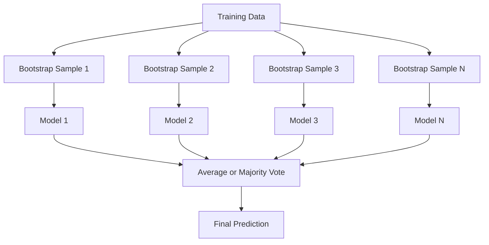
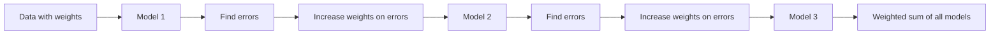
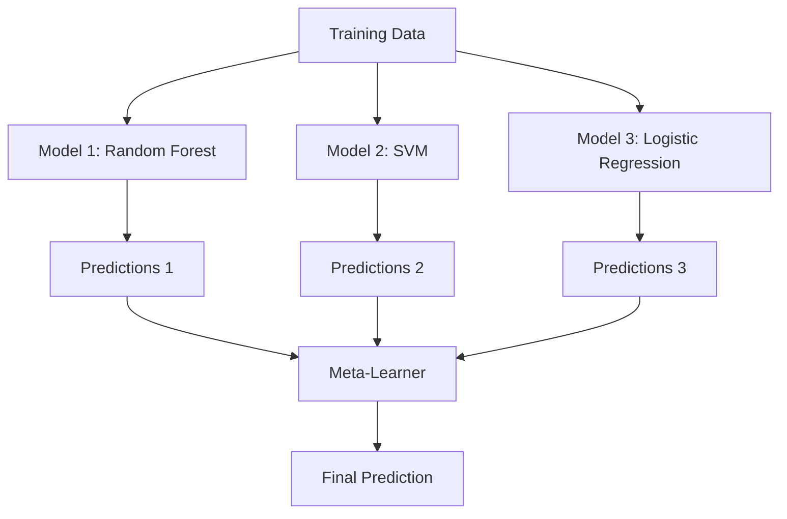

# Metotları Birleştir
# 集成方法


> Zayıf öğrencilerden oluşan bir grup doğru bir şekilde birleştirildiğinde güçlü öğrenci olur.

> Bir grup zayıf öğrenci, doğru bir gruptan sonra, güçlü öğrenci haline gelir.

**Type:** Build | **类型：** 构建
**Language:**Python .**语言：**Python
**Prerequisites:** Phase 2, Lesson 10 (Bias-Variance Tradeoff) | **前置知识：** Phase 2 第 10 课（偏差-方差权衡）
**Time:** ~120 minutes | **时间：** 约 120 分钟

## Öğrenme hedefleri

- AdaBoost ve gradient boosting uygulamasını sıfırdan başlatın ve boosting'ın tersi nasıl bir dizi olarak azaltıldığını açıklayın
  AdaBoost ve 梯度提升, nasıl 串行减偏差
- Bir paketleme ansamblini oluşturun ve ortalama korelasyonsuz modellerin önyargıyı arttırmadan nasıl azaltdığını gösterin
  Construction Bagging 集成, show average unrelated model nasıl 差 eksikliği arttırmadan 差 eksikliği azaltır
- Her yöntemin hangi hata bileşenini hedeflediği açısından paketleme, güçlendirme ve yığma karşılaştırın
  Bağlama, Yükleme ve Yükleme ile karşılaştırın
- Ensem çeşitliliğini değerlendirin ve çoğunluk oylama doğruluğunun daha bağımsız zayıf öğrencilerle neden iyileştiğini açıklayın
  评估集成多样性,解释为什么多数投票准确率随着更多独立弱学习器而提高


> **【中文解读】**
> 集成方法组合多个弱模型 into a strong model──Bagging(随机森林) 低方差,Boosting(XGBoost) 低偏差──XGBoost/LightGBM 在 Kaggle 比赛中占据统治地位──金融风控、推系统广泛使用──

> **【拓展：集成方法在 Kaggle 和工业界的主导地位】**
> Kaggle  yapılandırılmış veri yarışmasında, sıradaki 10'un programı neredeyse %100 birleştirme yöntemini kullanmaktadır. Netflix Ödülü'nün kazanan programı 107 modelin birleştirme gücünü artırmaktadır. Endüstri dünyasında, ödeme değerinin rüzgar kontrol sistemini XGBoost + LightGBM'in birleştirmesini kullanmaktadır. Amazon'un ürün önerisi çok model kullanmaktadır.

## Sorunlar. Sorunlar.

Tek bir karar ağacı eğitilmesi hızlı ve yorumlanması kolaydır, ancak aşırı derecede. Tek bir çizgi model karmaşık sınırlara uymaktadır. Mükemmel model mimarisini tasarlamak için günler harcayabilirsiniz. Ya da bir grup kusurlu modelleri birleştirerek onlardan herhangi birinden ayrı olarak daha iyi bir şey elde edebilirsiniz.

> 单棵决策树训练快、易解释,但会过拟合――单个线性模型在复杂边界上不适合―― mükemmel bir model yapısını tasarlamak için birkaç gün harcayabilirsin, ya da bir sürü kusursuz model toplayarak, herhangi birinden daha iyi sonuçlar elde edebilirsin―

Birleştirme yöntemleri tam olarak bunu yapar. Tablolar veriler üzerinde Kaggle yarışlarını kazanmak için en güvenilir tekniklerdir, çoğu üretim ML sistemini güçlendirirler ve eylemdeki önyargı-varians ticareti gösterirler. Çantalama farklılığı azaltır. Geliştirme önyargıyı azaltır. Yükleme hangi modellere güvenmeyi öğrenir.

> Entegre yöntemler bunu yapıyor. Onlar Kaggle'in en güvenilir teknolojisini kazanıyor. Bu, çoğu üretimi yöneten bir sistemdir.

> **【中文解读】**
> 集成 yöntemi'nin temel prensibi: Eğer çok sayıda kusurlu model farklı hatalar yaparsa, onların ortalama tahminleri daha doğru olacaktır.

## Konsepten bir şey.

### Grupların Neden Çalışması

N bağımsız sınıflandırıcılarınız var, her biri p > 0.5 doğruluğuna sahip.

> 假设你有N个独立分类器,每个准确率为p > 0.5──多数投票的准确率为:

```
P(majority correct) = sum over k > N/2 of C(N,k) * p^k * (1-p)^(N-k)
```

Her biri %60 doğruluğu olan 21 sınıflandırıcı için çoğunluk oylarının doğruluğu yaklaşık %74'dir. 101 sınıflandırıcı ile %84'e yükselmektedir.

> 21 个准确率 个别分类器的60% ,多数投票准确率 个别分类器的74%──101 个准确率 个别分类器时上升至84%──模特犯不同错误时,差异会相互抵消──

Ana şart:**diversity**Tüm modeller aynı hatalar yaparsa, bunları birleştirmek hiçbir işe yaramaz.

> 关键要求是**多样性** Eğer tüm modeller aynı hatalar yaparsa, bunları bir araya getirmenin bir faydası olmaz.

- Farklı eğitim alt takımları (bagging)
  Önemli bir eğitim.
- Farklı özellik alt kümeleri (hassasi ormanlar)
  不同的特征子集 (tıpkı orman gibi)
- Düzgün hata düzeltmesi (yüksetme)
  顺序错误纠正(Boosting)
- Farklı model aileleri (tüklenme)
  不同的模型族(Durmalama)

### Çantalama (Bootstrap Aggregating)

Çantalama, her modelin eğitim verilerinin farklı bir başlangıç örneği üzerinde eğitilmesiyle çeşitliliği yaratır.

> Çantalama  her farklı bootstrap  eğitim örneği  eğitim örneği  eğitim her model yaratmak için çeşitlilik oluşturmak için.



Bir bootstrap örneği orijinal verilerden değiştirilmiş olarak çizilmiştir. Orijinal ile aynı boyutta. Her bootstrap'da benzersiz örneklerin yaklaşık %63.2'si görünür. Geri kalan %36.8'i (bag dışı örnekler) ücretsiz bir onay kümesi sağlar.

> Bootstrap örneği, orijinal veriden geri çekilmiştir, büyüklüğü orijinal veriden aynıdır.

Çöpleme, önyargıyı çok arttırmadan değişimi azaltır. Her bireysel ağaç, başlangıç örneğine aşırı katılır, ancak her ağaç için aşırı katılım farklıdır, bu nedenle ortalama gürültü iptal eder.

> Çantalama çok fazla fark arttırılmadan, farkı azaltır. Her tek ağaç kendi başlık örneğine uygun olur, ancak her ağaçın aşırı uyum farklıdır, bu nedenle ortalama gürültü giderir.

**Random Forests**Ekstra bir dönüşle paketleme yapıyorlar: her bölünmede, yalnızca rastgele bir alt dizi özellik göz önünde bulundurulur. Bu ağaçlar arasında daha da çok çeşitliliği zorlar.`sqrt(n_features)`sınıflandırma ve `n_features / 3`Geri dönüş için.

> **随机森林**Bu da ağaçlar arasında daha çok çeşitlilik yaratmaya zorlar.`sqrt(n_features)`, 归为`n_features / 3`- Evet.

### Geliştirme (Sekvensiyel Hata Düzeltme)

Tren modellerini sıradan olarak artırmak. Her yeni model önceki modellerin yanlış yaptıkları örneklere odaklanır.

> 顺序训练模型──每个新模型关注之前模型弄错的样本──



Bu nedenle, yeni modeller, tüm modellerin ağırlıklı toplamını oluşturur ve daha iyi modellerin daha yüksek ağırlıkları elde eder.

> Boosting  reducing bias.                                                                                                                                                                                                                                                            

Tasarım: Fazla atış yaparsanız, artış çok fazla atış yapabilir, çünkü bazılarının gürültü olabileceği daha zor örnekleri takmaya devam eder.

> 权衡: Eğer çok fazla tekerlek yürütülürse, Boosting daha uygun olabilir, çünkü daha zor örneklere uygun olmaya devam eder, bunlardan bazıları gürültü olabilir.

### AdaBoost

AdaBoost (Adaptive Boosting) ilk pratik güçlendirme algoritmasıydı.

> AdaBoost (自适应提升) ilk pratik geliştirme algoritmasıdır.

Algoritm:

> 算法流程:

```
1. Initialize sample weights: w_i = 1/N for all i

2. For t = 1 to T:
   a. Train weak learner h_t on weighted data
   b. Compute weighted error:
      err_t = sum(w_i * I(h_t(x_i) != y_i)) / sum(w_i)
   c. Compute model weight:
      alpha_t = 0.5 * ln((1 - err_t) / err_t)
   d. Update sample weights:
      w_i = w_i * exp(-alpha_t * y_i * h_t(x_i))
   e. Normalize weights to sum to 1

3. Final prediction: H(x) = sign(sum(alpha_t * h_t(x)))
```

Daha düşük hata olan modeller daha yüksek alfa alır. Yanlış sınıflandırılmış örnekler daha yüksek ağırlıklara sahip olur.

> 低誤率模型はより高いアルファを獲得します. 誤分類のサンプルがより高い重量を得るため, sonraki model onlara odaklanır.

### Aradan Artarak

Gradyent artırma, keyfi kayıp fonksiyonlarına yükseltmeyi genelleştirir. Örnekleri yeniden ağırlaştırmak yerine, her yeni modeli mevcut ansamblın kalıntılarına (kayıpın negatif gradiyenti) uyarlar.

> 梯度提升, 梯度提升 olarak herhangi bir kayıp işleviyle 升广为任意损失函数── yeniden yükleme örneğinden farklı olarak, her yeni modelin mevcut birleştirilen 残差 (损失的负梯度)                                                                                                                                                                                                                                  

```
1. Initialize: F_0(x) = argmin_c sum(L(y_i, c))

2. For t = 1 to T:
   a. Compute pseudo-residuals:
      r_i = -dL(y_i, F_{t-1}(x_i)) / dF_{t-1}(x_i)
   b. Fit a tree h_t to the residuals r_i
   c. Find optimal step size:
      gamma_t = argmin_gamma sum(L(y_i, F_{t-1}(x_i) + gamma * h_t(x_i)))
   d. Update:
      F_t(x) = F_{t-1}(x) + learning_rate * gamma_t * h_t(x)

3. Final prediction: F_T(x)
```

Karakter hata kaybı için, sahte kalıntılar sadece gerçek kalıntılardır: `r_i = y_i - F_{t-1}(x_i)`Her ağaç, öncekilerin hatalarına uyuyor.

> √2 hata kaybı için, sahte haraç gerçek haraçtır:`r_i = y_i - F_{t-1}(x_i)`❖ Her ağaç aslında, uyumadan önce toplanmış bir hata.

Öğrenme hızı (kısaltma) her ağacın ne kadar katkıda bulunduğunu kontrol eder. Daha küçük öğrenme hızı daha fazla ağaç gerektirir ancak daha iyi genelleştirir. Tipik değerler: 0.01 ila 0.3.

> Öğrenme oranı (shrinking) her ağacın katkı miktarını kontrol etmek. Daha küçük öğrenme oranı daha fazla ağaç gerektirir ama daha iyi genelleşir.

### XGBoost: Neden Tablo Verileri Üstünlükte

XGBoost (eXtreme Gradient Boosting) hızlı, doğru ve aşırı uyumlu hale getiren mühendislik optimizasyonlarıyla gradient artırma:

> XGBoost (极端梯度提升) ise, hızlı, doğru ve karşı karşıya hale getiren bir işlemi iyileştirme derecesinin yükseltilmesidir.

- **Regularized objective:**Yaprak ağırlıkları için L1 ve L2 cezaları, bireysel ağaçların çok güvenini engeller
  **正则化目标**Yukarıdaki: Yukarıdaki: Yukarıdaki: Yukarıdaki: Yukarıdaki: Yukarıdaki: Yukarıdaki: Yukarıdaki: Yukarıdaki: Yukarıdaki: Yukarıdaki: Yukarıdaki: Yukarıdaki: Yukarıdaki: Yukarıdaki: Yukarıdaki: Yukarıdaki: Yukarıdaki: Yukarıdaki: Yukarıdaki: Yukarıdaki: Yukarıdaki: Yukarıdaki: Yukarıdaki: Yukarıdaki: Yukarıdaki: Yukarıdaki: Yukarıdaki: Yukarıdaki: Yukarıdaki: Yukarıdaki: Yukarıdaki: Yukarıdaki: Yukarıdaki: Yukarıdaki: Yukarıdaki: Yukarıdaki: Yukarıdaki: Yukarıdaki: Yukarı: Yukarıdaki: Yukarıdaki: Yukarı: Yukarı: Yukarı: Yukarı: Yukarı: Yukarı: Yukarı: Yukarı: Yukarı: Yukarı: Yukarı: Yukarı: Yukarı: Yukarı: Yukarı: Yukarı: Yukarı: Yukarı: Yukarı: Yukarı: Yukarı: Yukarı: Yukarı: Yukarı: Yukarı: Yukarı: Yukarı: Yukarı: Yukarı: Yukarı: Yukarı: Yukarı: Yukarı: Yukarı: Yukarı: Yukarı: Yukarı: Yukarı: Yukarı: Yukarı: Yukarı: Yukarı: Yukarı: Yukarı: Yukarı: Yukarı: Yukarı: Yukarı: Yukarı: Yukarı: Yukarı: Yukarı: Yukarı: Yukarı: Yukarı: Yukarı: Yukarı: Yukarı: Yukarı: Yukarı: Yukar: Yukar: Yukarı: Yukar: Yukarı: Yukar: Yukar: Yukar: Yukarı: Yukar: Yukarı: Yukar: Yukar: Yukar: Yukar: Yukar: Yukar: Yukar: Yukar:
- **Second-order approximation:**Kayıpın hem birinci hem de ikinci türevlerini kullanır, böylece daha iyi bölünmüş kararlar verir.
  **二阶近似**Birinci ve ikinci aşama kayıpları kullanırken, daha iyi bir bölünme kararı verir.
- **Sparsity-aware splits:**Kayıp veriler için en iyi yönü öğrenerek kayıp değerleri kendiliğinden ele alır
  **稀疏感知分裂**: original processing missing value, in each split point learning missing data'nın en iyi yönü
- **Column subsampling:**Rastgele ormanlar gibi, her bölünmede çeşitlilik için örnekler vardır.
  **列子采样**Her bölünme sırasında çeşitliliği artırmak için çeşitli özellikler kullanılır.
- **Weighted quantile sketch:**Etkili olarak dağıtılmış verilerdeki sürekli özellikler için bölünme noktaları bulur
  **加权分位数草图**Yüksek verimlilik: dağıtılmış verilerde sürekli özelliklerin bölünme noktalarını bul
- **Cache-aware block structure:**CPU cache hatları için optimize edilmiş bellek düzenlemesi
  **缓存感知块结构**CPU 缓存行优化内存布局

Tablolar verileri için, XGBoost (ve onun halefi LightGBM) sürekli olarak sinir ağlarını üst kat eder. Bu yakın zamanda değişmeyecek. Verileriniz sıra ve sütunlu bir tabloya sığırsa, gradient artışı ile başlayın.

> 对于表格数据,XGBoost (XGBoost) ve onun ardıcısı LightGBM) 始终优优于神经网络――短期内这不会改变―― Eğer verileriniz list格中插入时,从梯度升级开始――

### Dökme (Meta-Learning)

Yükleme, meta öğrenci için özellik olarak birden fazla temel modelin tahminlerini kullanır.

> Yükleme, bir çok temel modelin öngörülmesini bir öğrenci cihazının özelliği olarak kullanır.



Meta-öğrenci hangi temel modelin hangi girişlere güvenmesini öğrenir. Eğer rastgele orman belirli bölgelerde ve SVM diğerlerinde daha iyiyse, meta-öğrenci buna göre yönlendirmeyi öğrenecektir.

> Eğer bazı bölgelerde orman daha iyiyse, diğer bölgelerde SVM daha iyiyse, bu süreç daha da gelişmiş olacaktır.

Verilerin sızmasını önlemek için, temel model tahminleri eğitim kümesinde çapraz onaylama yoluyla oluşturulmalıdır.

> Veriler sızdırılmasını önlemek için, temel model tahminleri eğitim kitlesinde geçiş testi üretimi yoluyla yapılmalıdır.

### Oylama

En basit takım. Sadece tahminleri doğrudan birleştirin.

> En basit bir birleşim.

- **Hard voting:**Çoğu sınıf etiketiyle oy kullanıyor.
  **硬投票**Etiketler için çoğunlukla oy kullanmak:
- **Soft voting:**Ortalama tahmin olasılığı, en yüksek ortalama olasılığı olan sınıfı seçin.
  **软投票**Ortalama tahmin olasılık, ortalama olasılık en yüksek sınıfı seçer.

## Yapın.

> **【中文解读】**
> Çıktırma (Bacing) ✓ ✓ ✓ ✓ ✓ ✓ ✓ ✓ ✓ ✓ ✓ ✓ ✓ ✓ ✓ ✓ ✓ ✓ ✓ ✓ ✓ ✓ ✓ ✓ ✓ ✓ ✓ ✓ ✓ ✓ ✓ ✓ ✓ ✓ ✓ ✓ ✓ ✓ ✓ ✓ ✓ ✓ ✓ ✓ ✓ ✓ ✓ ✓ ✓ ✓ ✓ ✓ ✓ ✓ ✓ ✓ ✓ ✓ ✓ ✓ ✓ ✓ ✓ ✓ ✓ ✓ ✓ ✓ ✓ ✓ ✓ ✓ ✓ ✓ ✓ ✓ ✓ ✓ ✓ ✓ ✓ ✓ ✓ ✓ ✓ ✓ ✓ ✓ ✓ ✓ ✓ ✓ ✓ ✓ ✓ ✓ ✓ ✓ ✓ ✓ ✓ ✓ ✓ ✓ ✓ ✓ ✓ ✓ ✓ ✓ ✓ ✓ ✓ ✓ ✓ ✓ ✓ ✓ ✓ ✓ ✓ ✓ ✓ ✓ ✓ ✓ ✓ ✓ ✓ ✓ ✓ ✓ ✓ ✓ ✓ ✓ ✓ ✓ ✓ ✓ ✓ ✓ ✓ ✓ ✓ ✓ ✓ ✓ ✓ ✓ ✓ ✓ ✓ ✓ ✓ ✓ ✓ ✓ ✓ ✓ ✓ ✓ ✓ ✓ ✓ ✓ ✓ ✓ ✓ ✓ ✓ ✓ ✓ ✓ ✓ ✓ ✓ ✓ ✓ ✓ ✓ ✓ ✓ ✓ ✓ ✓ ✓ ✓ ✓ ✓ ✓ ✓ ✓ ✓ ✓ ✓ ✓ ✓ ✓ ✓ ✓ ✓ ✓ ✓ ✓ ✓ ✓ ✓ ✓ ✓ ✓ ✓ ✓ ✓ ✓ ✓ ✓ ✓ ✓ ✓ ✓ ✓ ✓ ✓ ✓ ✓ ✓ ✓ ✓ ✓ ✓ ✓ ✓ ✓ ✓ ✓ ✓ ✓ ✓ ✓ ✓ ✓ ✓ ✓ ✓ ✓ ✓ ✓ ✓ ✓
```figure
f3-ensemble-average
```

## Yapın

### Adım 1: Kararlılık (Baş Öğrenci)

Kodun içinde .`code/ensembles.py`Bir karar topuyla başlayalım: tek bir parçacık olan bir ağaç.

> `code/ensembles.py`Çeviri: Çeviri: Çeviri: Çeviri: Çeviri: Çeviri: Çeviri: Çeviri: Çeviri: Çeviri: Çeviri: Çeviri: Çeviri: Çeviri: Çeviri: Çeviri: Çeviri: Çeviri: Çeviri: Çeviri: Çeviri: Çeviri: Çeviri: Çeviri: Çeviri: Çeviri: Çeviri: Çeviri: Çeviri: Çeviri: Çeviri: Çeviri: Çeviri: Çeviri: Çeviri: Çeviri: Çeviri: Çeviri: Çeviri: Çeviri: Çeviri: Çeviri: Çeviri: Çeviri: Çeviri: Çeviri: Çeviri: Çeviri: Çeviri: Çeviri: Çeviri: Çeviri: Çeviri: Çeviri: Çeviri: Çeviri: Çeviri: Çeviri: Çeviri: Çeviri: Çeviri: Çeviri: Çeviri: Çeviri: Çeviri: Çeviri: Çeviri: Çeviri: Çeviri: Çeviri: Çeviri: Çeviri: Çeviri: Çeviri: Çeviri: Çeviri: Çeviri: Çeviri: Çeviri: Çeviri: Çeviri: Çeviri: Çeviri: Çeviri: Çeviri: Çeviri: Çeviri: Çeviri: Çeviri: Çeviri: Çeviri: Çeviri: Çeviri: Çeviri: Çeviri: Çeviri: Çeviri: Çeviri: Çeviri: Çeviri: Çeviri: Çeviri: Çeviri: Çeviri: Çeviri: Çeviri: Çeviri: Çeviri: Çeviri: Çeviri: Çeviri: Çeviri: Çeviri: Çeviri: Çeviri: Çeviri: Çeviri: Çeviri: Çeviri: Çeviri: Çeviri: Ç Ç Ç Ç Ç Ç Ç Ç Ç Ç Ç Ç Ç Ç Ç Ç Ç Ç Ç Ç Ç Ç Ç Ç Ç Ç

```python
class DecisionStump:
    def __init__(self):
        self.feature_idx = None
        self.threshold = None
        self.polarity = 1
        self.alpha = None

    def fit(self, X, y, weights):
        n_samples, n_features = X.shape
        best_error = float("inf")

        for f in range(n_features):
            thresholds = np.unique(X[:, f])
            for thresh in thresholds:
                for polarity in [1, -1]:
                    pred = np.ones(n_samples)
                    pred[polarity * X[:, f] < polarity * thresh] = -1
                    error = np.sum(weights[pred != y])
                    if error < best_error:
                        best_error = error
                        self.feature_idx = f
                        self.threshold = thresh
                        self.polarity = polarity

    def predict(self, X):
        n = X.shape[0]
        pred = np.ones(n)
        idx = self.polarity * X[:, self.feature_idx] < self.polarity * self.threshold
        pred[idx] = -1
        return pred
```

### Adım 2: AdaBoost sıfırdan

```python
class AdaBoostScratch:
    def __init__(self, n_estimators=50):
        self.n_estimators = n_estimators
        self.stumps = []
        self.alphas = []

    def fit(self, X, y):
        n = X.shape[0]
        weights = np.full(n, 1 / n)

        for _ in range(self.n_estimators):
            stump = DecisionStump()
            stump.fit(X, y, weights)
            pred = stump.predict(X)

            err = np.sum(weights[pred != y])
            err = np.clip(err, 1e-10, 1 - 1e-10)

            alpha = 0.5 * np.log((1 - err) / err)
            weights *= np.exp(-alpha * y * pred)
            weights /= weights.sum()

            stump.alpha = alpha
            self.stumps.append(stump)
            self.alphas.append(alpha)

    def predict(self, X):
        total = sum(a * s.predict(X) for a, s in zip(self.alphas, self.stumps))
        return np.sign(total)
```

### Adım 3: Baştan İleri Gelişme

```python
class GradientBoostingScratch:
    def __init__(self, n_estimators=100, learning_rate=0.1, max_depth=3):
        self.n_estimators = n_estimators
        self.lr = learning_rate
        self.max_depth = max_depth
        self.trees = []
        self.initial_pred = None

    def fit(self, X, y):
        self.initial_pred = np.mean(y)
        current_pred = np.full(len(y), self.initial_pred)

        for _ in range(self.n_estimators):
            residuals = y - current_pred
            tree = SimpleRegressionTree(max_depth=self.max_depth)
            tree.fit(X, residuals)
            update = tree.predict(X)
            current_pred += self.lr * update
            self.trees.append(tree)

    def predict(self, X):
        pred = np.full(X.shape[0], self.initial_pred)
        for tree in self.trees:
            pred += self.lr * tree.predict(X)
        return pred
```

### Adım 4: Sklern ile karşılaştır

Kod, sıfırdan uygulamalarımızın sklearn'ınki gibi bir doğruluk ürettiğini doğruluyor.`AdaBoostClassifier`ve `GradientBoostingClassifier`, ve tüm yöntemleri yan yana karşılaştırır.

> Kodu testimiz , sıfırdan gerçekleşen oluşumuzun ve oluşumuzun gerçekleştiğini gösterir .`AdaBoostClassifier`和 `GradientBoostingClassifier`Benzer doğruluk oranı, tüm yöntemleri karşılaştırır.

## Çerçeveyi kullanın.

### Her Bir Yolu Ne Zaman Kullanmalıyız?

> Her türlü yöntem kullanır mısın?

| Method | Reduces | Best for | Watch out for |
|--------|---------|----------|---------------|
| Bagging / Random Forest | Variance | Noisy data, many features | Does not help with bias |
| AdaBoost | Bias | Clean data, simple base learners | Sensitive to outliers and noise |
| Gradient Boosting | Bias | Tabular data, competitions | Slow to train, easy to overfit without tuning |
| XGBoost / LightGBM | Both | Production tabular ML | Many hyperparameters |
| Stacking | Both | Getting last 1-2% accuracy | Complex, risk of overfitting meta-learner |
| Voting | Variance | Quick combination of diverse models | Only helps if models are diverse |

| 方法 | 减少 | 最适合 | 注意事项 |
|------|------|--------|---------|
| Bagging / 随机森林 | 方差 | 噪声数据、多特征 | 不能帮助偏差 |
| AdaBoost | 偏差 | 干净数据、简单基学习器 | 对异常值和噪声敏感 |
| 梯度提升 | 偏差 | 表格数据、竞赛 | 训练慢、不调参容易过拟合 |
| XGBoost / LightGBM | 两者 | 生产表格 ML | 超参数多 |
| Stacking | 两者 | 获取最后 1-2% 准确率 | 复杂、元学习器有过拟合风险 |
| Voting | 方差 | 快速组合多样模型 | 模型不多样时无帮助 |

### Tablo Verileri Üretim Stabı

Çoğu tablo önceden bildirim sorunu için, denemek için bu sıradır:

>                                                                                                                                                                                                                                                               

1. **LightGBM or XGBoost**Varsayılan parametrelerle
   **LightGBM 或 XGBoost**kullanılır
2. N_estimatorları ayarlayın, öğrenme oranı, maksimum derinlik, çocuk ağırlığı
   调优 n_estimators、learning_rate、max_depth、min_child_weight
3. Son %0,5'e ihtiyacınız varsa 3-5 farklı modelle bir yığma ansamblini yapın.
   Eğer son 0.5% gerekiyorsa, 3-5 farklı model oluşturmak
4. Tüm süreçlerde çapraz onay kullanın.
   Önemli bir işçi

Tablolar verilerindeki sinir ağları, sürekli araştırma girişimlerine rağmen, neredeyse her zaman gradient artışından daha kötüdür. TabNet, NODE ve benzer mimarlıklar bazen eşleşir, ancak nadiren iyi ayarlanmış bir XGBoost'u yenir.

> Sürekli araştırmalar yapılmasına rağmen, sinir ağları, tablo verilerinde neredeyse her zaman yükselmez. TabNet, NODE ve benzer yapıların bazen de uyumlu olması mümkün, ancak çok azı XGBoost'u yenebilir.

## İndirin . Ürünler .

Bu ders bize çok yararlı .`outputs/prompt-ensemble-selector.md`- bir veri kümesi için doğru ansambl yöntemi seçmenize yardımcı olan bir istek. Verilerinizi (ölüm, özellik türleri, gürültü seviyesi, sınıf dengesi) ve çözmekte olduğunuz sorunu açıklayın. istek bir karar kontrol listesini geçirir, bir yöntemi önerir, hiperparametre başlatmayı önerir ve bu yöntemi için yaygın hatalar konusunda uyarır.`outputs/skill-ensemble-builder.md`Tam seçme rehberliği ile.

> 本课产 出 `outputs/prompt-ensemble-selector.md` Bir veri kümesi için doğru bir entegrasyon yöntemi seçmenize yardımcı olacak bir ipucu sözcüğü.  Size verilen veriyi tanımlamak için size yardımcı olacak bir ipucu sözcüğü.  Size verilen veri kümesi için doğru bir entegrasyon yöntemi seçmenize yardımcı olacak bir ipucu sözcüğü.  Size verilen veriyi tanımlamak için size yardımcı olacak bir ipucu sözcüğü.  Size verilen veri kümesi için doğru bir entegrasyon yöntemi seçmenize yardımcı olacak bir ipucu sözcüğü.  Size verilen veriyi tanımlamak için size yardımcı olacak bir ipucu sözcüğü.  Size verilen veri kümesi için doğru bir entegrasyon yöntemi seçmenize yardımcı olacak bir ipucu sözcüğü.  Size verilen veri türünün büyüklüğünü, özellik türünü, ses seviyesi, ses seviyesi, sınıfı dengesi, sorunu çözmekte olan sorunuzu yönlendirecektir.  Bu ipucu sözcüğunun genel hatayı uyarmak için tavsiye edilen bir tavır hatalar ortaya çıkaracaktır.`outputs/skill-ensemble-builder.md`,包含完整选择指南──

## Egzersizler.

1. AdaBoost uygulamasını değiştirerek her turdan sonra eğitim doğruluğunu takip edin.
   1. AdaBoost'u değiştirmek, takip eğitimi doğruluk oranını gerçekleştirmek için.

2. Rastgele bir orman uygulamak için, regresyon ağacına rastgele bir örnekleme özelliği ekleyerek sıfırdan başlayın.`max_features=sqrt(n_features)`Ve ortalama tahminler.
   2. Çölden Çölden Çölden Çölden Çölden Çölden Çölden Çölden Çölden Çölden Çölden Çölden Çölden Çölden Çölden Çölden Çölden Çölden Çölden Çölden Çölden Çölden Çölden Çölden Çölden Çölden Çölden Çölden Çölden Çölden Çölden Çölden Çölden Çölden Çölden Çölden Çölden Çölden Çölden Çölden Çölden Çölden Çölden Çölden Çölden Çölden Çölden Çölden Çölden Çölden Çölden Çölden Çölden Çölden Çölden Çölden Çölden Çölden Çölden Çölden Çölden Çölden Çölden Çölden Çölden Çölden Çölden Çölden Çölden Çölden Çölden Çölden Çölden Çölden Çölden Çölden Çölden Çölden Çölden Çölden Çölden Çölden Çölden Çölden Çölden Çölden Çölden Çölden Çölden Çölden Çölden Çölden Çölden Çölden Çölden Çölden Çölden Çölden Çölden Çölden Çölden Çölden Çölden Çölden Çölden Çölden Çölden Çölden Çölden Çölden Çölden Çölden Çölden Çölden Çölden Çölden Çölden Çölden Çölden Çölden Çölden Çölden Çölden Çölden Çölden Çölden Çölden Çölden Çölden Çölden Çölden Çölden Çölden Çölden Çölden Çölden Çölden Çölden Çöl Çölden Çölden Çöl Çöl Çöl Çöl Çöl Çöl Ç Ç Ç Ç Ç Ç Ç Ç Ç Ç Ç Ç Ç Ç Ç Ç Ç Ç Ç Ç Ç Ç Ç Ç Ç Ç Ç Ç Ç Ç Ç Ç Ç Ç Ç Ç Ç Ç Ç Ç Ç Ç Ç Ç Ç Ç Ç Ç Ç Ç Ç Ç Ç Ç Ç Ç Ç Ç Ç Ç Ç Ç Ç Ç Ç Ç Ç Ç Ç Ç Ç Ç Ç Ç Ç Ç`max_features=sqrt(n_features)`, ortalama tahmin:                                                                                                                                                                                                                                                             

3. Gelişme artıran uygulamada erken duraklama ekleyin: her turdan sonra doğrulama kaybını izleyin ve 10 adet ardıcıl sürede iyileşmediğinde durun.
   3. Gelişme aşamasında gerçekleşen erken duraklama: Her turda takip edilme testi kaybı, devamlı 10 turda gelişme olmaz.

4. Üç temel model (lojik gerileme, karar ağacı, k-en yakın komşu) ve bir lojik gerileme meta öğrenci ile bir yığma ansamblini oluşturun. Meta- özellikleri oluşturmak için 5 katlı çapraz onay kullanın. Her bir temel modelle tek başına karşılaştırın.
   4. 构建三个基础模型 (逻辑归归、决策树、KNN) ve bir逻辑归元学习器'ın 集成 集成── 5 折交叉验证生成元特征──与每个基础模型单独比较──

5. XGBoost'u aynı veri kümesiyle öntanımlı parametrelerle çalıştırın. Düzgünlüğünü sıfırdan gradient artışına karşılaştırın. Her ikisini de zamanlandırın.
   5. Aynı veri kümesi üzerinde varsayılan parametrelerle XGBoost kullanılarak.

> **【中文解读】**
> AdaBoost(Öz Adaptasyon Yükseltmesi) çekirdek süreci: eğitmek bir zayıf sınıflandırma→ hesaplama hata oranı→ artırmak yanlış sınıflandırma örneği                                                                                                                                                                                                                                          

> **【拓展：XGBoost、LightGBM、CatBoost——梯度提升树三巨头】**
> XGBoost(eXtreme Gradient Boosting) Chen天奇 tarafından 2014 yılında geliştirilmiştir, düzeltme、稀疏数据处理和并行计算, Kaggle 竞赛的标配工具成为了. LightGBM(Microsoft,2017) düz düz düz çizimlere dayalı bölünme ve yarı büyüme stratejisi kullanır.

## Anahtar Şartlar .

| Term | What people say | What it actually means |
|------|----------------|----------------------|
| Bagging | "Train on random subsets" | Bootstrap aggregating: train models on bootstrap samples, average predictions to reduce variance |
| Boosting | "Focus on hard examples" | Train models sequentially, each correcting errors of the ensemble so far, to reduce bias |
| AdaBoost | "Reweight the data" | Boosting via sample weight updates; misclassified points get higher weight for the next learner |
| Gradient boosting | "Fit the residuals" | Boosting via fitting each new model to the negative gradient of the loss function |
| XGBoost | "The Kaggle weapon" | Gradient boosting with regularization, second-order optimization, and systems-level speed tricks |
| Stacking | "Models on top of models" | Use predictions of base models as input features for a meta-learner |
| Random forest | "Many randomized trees" | Bagging with decision trees, adding random feature subsampling at each split for diversity |
| Ensemble diversity | "Make different mistakes" | Models must be uncorrelated in their errors for the ensemble to improve over individuals |
| Out-of-bag error | "Free validation" | Samples not in a bootstrap draw (~36.8%) serve as a validation set without needing a holdout |

## Daha fazla okumak

- [Schapire & Freund: Boosting: Foundations and Algorithms](https://mitpress.mit.edu/9780262526036/)-- AdaBoost'un yaratıcılarının kitabı
  [Schapire & Freund: Boosting: Foundations and Algorithms](https://mitpress.mit.edu/9780262526036/)- AdaBoost 创始人的著作
- [Friedman: Greedy Function Approximation: A Gradient Boosting Machine (2001)](https://statweb.stanford.edu/~jhf/ftp/trebst.pdf)-- orijinal gradient artıran kağıt
  [Friedman: Greedy Function Approximation: A Gradient Boosting Machine (2001)](https://statweb.stanford.edu/~jhf/ftp/trebst.pdf)- 梯度提升 orijinal makale
- [Chen & Guestrin: XGBoost (2016)](https://arxiv.org/abs/1603.02754)-- XGBoost kağıdı
  [Chen & Guestrin: XGBoost (2016)](https://arxiv.org/abs/1603.02754)- XGBoost 论文
- [Wolpert: Stacked Generalization (1992)](https://www.sciencedirect.com/science/article/abs/pii/S0893608005800231)-- orijinal yığma kağıdı
  [Wolpert: Stacked Generalization (1992)](https://www.sciencedirect.com/science/article/abs/pii/S0893608005800231)- Yükleme
- [scikit-learn Ensemble Methods](https://scikit-learn.org/stable/modules/ensemble.html)-- pratik referans
  [scikit-learn 集成方法](https://scikit-learn.org/stable/modules/ensemble.html)- 实用参考
