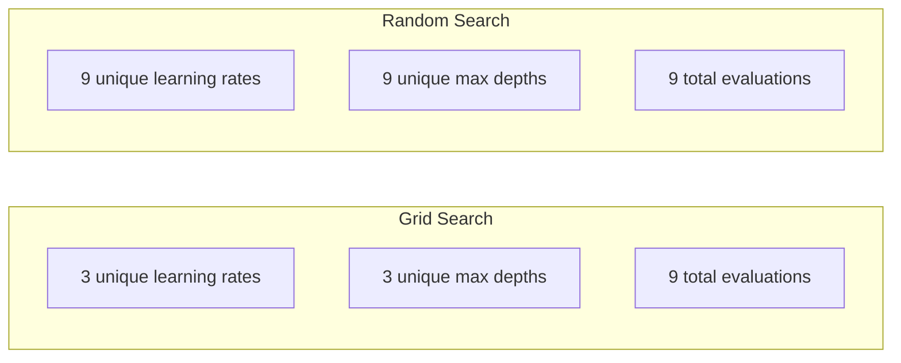
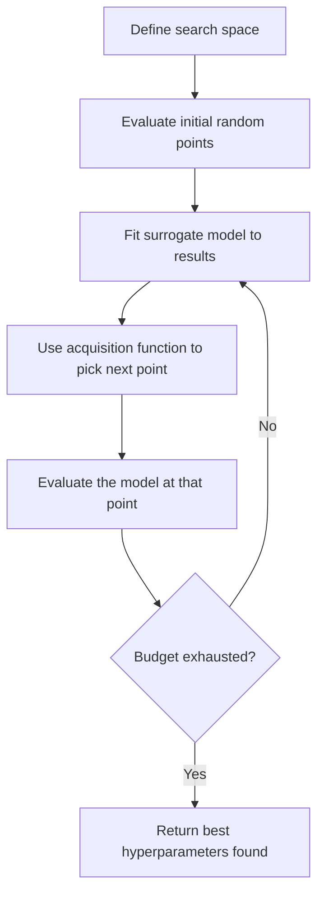
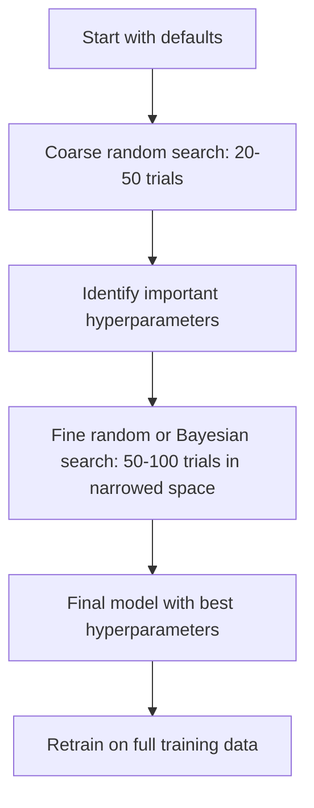
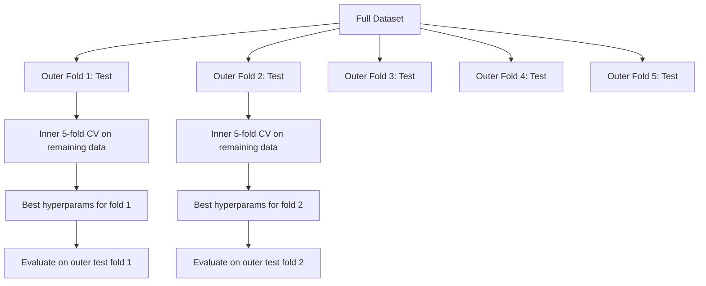

# Hiperparameter Düzenleme
# 超参数调优


> Hiperparametre, antrenman başlamadan önce döndürülen düğmelerdir.

> 超参数 = 超参数 = 超参数 = 超参数 = 超参数 = 超参数 = 超参数 = 超参数 = 超参数 = 超参数 = 超参数 = 超参数 = 超参数 = 超参数 = 超参数 = 超参数 = 超参数 = 超参数 = 超参数 = 超参数 = 超参数 = 超参数 = 超参数 = 超参数 = 超参数 = 超参数 = 超参数 = 超参数 = 超参数 = 超参数 = 超参数 = 超参数 = 超参数 = 超参数 = 超参数 = 超参数 = 超参数 = 超参数 = 超参数 = 超参数 = 超参数 = 超参数 = 超参数 = 超参数 = 

**Type:** Build | **类型：** 构建
**Language:**Python .**语言：**Python
**Prerequisites:** Phase 2, Lesson 11 (Ensemble Methods) | **前置知识：** Phase 2 第 11 课（集成方法）
**Time:** ~90 minutes | **时间：** 约 90 分钟

## Öğrenme hedefleri

- Çubuğu arama, rastgele arama ve Bayesian optimizasyonu sıfırdan uygulayın ve örnek verimliliğini karşılaştırın
  Çerez aramaları, zamanla arama ve bayis optimizasyonu, örnek verimliliğini karşılaştır
- Çoğu hiperparametre düşük etkili boyutlu olduğunda rastgele arama neden ağ arayışını aşırıyorsa açıklayın .
   açıklayın neden rastlantı arama en çok süperparamantal geçerli ölçüm düşük zaman net arama daha iyi
- Arama rehberliği için bir alternatif model ve edinme fonksiyonu kullanarak Bayesian optimizasyon döngüsü oluşturun
  Arama yönlendirmek için bir temsilci modeli ve toplama işlevi kullanın
- Uygun çapraz onaylama yoluyla onaylama kümesine aşırı uyum sağlamayı önleyen bir hiperparametre ayarlama stratejisini tasarlayın
   uygun bir verifiye aracılığıyla verifiyeleme toplu üzerinde uygun olmayan bir süperparamantal düzenleme stratejisi tasarlan


> **【中文解读】**
> 超参数 (超参数) model eğitimi önceden belirlenmiş parametrelerdir.

> **【拓展：超参数调优在大模型训练中的重要性】**
> GPT-4'ün eğitimi, onlarca süperparamantalı içerir. Öğrenme oranı düzenleme, parti boyutu, ağırlık kaybı, düşüş oranı, ve diğerleri) her tam eğitim maliyeti yaklaşık 1 milyar dolardır.

## Sorunlar. Sorunlar.

Bu, altı hiperparametre anlamına gelir. Eğer her birinin 5 makul değeri varsa, ağ 5^6 = 15.625 kombinasyonlara sahiptir. Her birinin eğitimi 10 saniye alır. Bu, hepsini denemek için 43 saat hesaplama demektir.

> Senin dereceli yükseltme modeli öğrenme oranı, ağaç sayısı, en büyük derinlik, yarı noktalarının en küçük örnek sayısı, çocuk örneklemesi oranı ve sıra örneklemesi oranı vardır.

Grid arama, açık bir yaklaşımdır ve ölçekte en kötüdür. Kaç hesaplama ile rastgele arama daha iyi yapar. Bayesian optimizasyonu geçmiş değerlendirmelerden öğrenerek daha da iyi yapar. Hangi stratejiyi kullanmak gerektiğini ve hangi hiperparametreyi gerçekten önemli olarak bilmek, günlerce CPU zamanının boşa harcanmasını sağlar.

> 网格 arama, açıkça görülebilir bir yöntemdir, aynı zamanda büyük ölçekte en kötü yöntemdir. Arama daha az hesaplama ile daha iyi yapılır.

> **【中文解读】**
> 超参数调优的核心矛盾:搜索空间大但每次评估成本高――网格搜索穷举所有组合,成本指数增长;随机搜索随机采样,在同样的预算下探索更多区域;贝叶斯优化概率模型(高斯过程) hangi bölgeleri daha iyi kullanabileceğini tahmin etmek,智能地选择下一个评估点――实践中, önce随机搜索快速缩小范围,再利用贝叶斯优化精细搜索――

## Konsepten bir şey.

### Parametre vs. Hiperparametre

Parametre eğitim sırasında öğrenilir (koşullar, tarafsızlıklar, bölünmüş eşişler).

> 参数在训练中学习(权重、偏置、分裂值) ――超参数在训练开始前设定,控制学习如何发生──

| Hyperparameter | What it controls | Typical range |
|---------------|-----------------|---------------|
| Learning rate | Step size per update | 0.001 to 1.0 |
| Number of trees/epochs | How long to train | 10 to 10,000 |
| Max depth | Model complexity | 1 to 30 |
| Regularization (lambda) | Overfitting prevention | 0.0001 to 100 |
| Batch size | Gradient estimation noise | 16 to 512 |
| Dropout rate | Fraction of neurons dropped | 0.0 to 0.5 |

| 超参数 | 控制什么 | 典型范围 |
|--------|---------|---------|
| 学习率 | 每次更新的步长 | 0.001 到 1.0 |
| 树的数量/epoch 数 | 训练多久 | 10 到 10,000 |
| 最大深度 | 模型复杂度 | 1 到 30 |
| 正则化 (lambda) | 防止过拟合 | 0.0001 到 100 |
| 批量大小 | 梯度估计噪声 | 16 到 512 |
| Dropout 率 | 丢弃的神经元比例 | 0.0 到 0.5 |

### Çubuğu Arama

Grid arama belirtilen değerlerin her kombinasyonunu değerlendirir.

> 网格搜索评估指定值的每个组合──它尽尽且易于理解,但随着超参数数指数数级的增长──

```
Grid for 2 hyperparameters:

  learning_rate: [0.01, 0.1, 1.0]
  max_depth:     [3, 5, 7]

  Evaluations: 3 x 3 = 9 combinations

  (0.01, 3)  (0.01, 5)  (0.01, 7)
  (0.1,  3)  (0.1,  5)  (0.1,  7)
  (1.0,  3)  (1.0,  5)  (1.0,  7)
```

Grid arama temel bir kusura sahiptir: bir hiperparametre önemli ise diğerine değilse, çoğu değerlendirme boşa çıkar.

> 网格 arama bir temel eksikliği vardır: Eğer bir süperparametre önemli ise diğerinin önemli olmadığı takdirde, çoğu değer kayboluyor.

### - Kesinlikle .

Rastgele arama örnekleri, bir şebekeden değil dağılımlardan hiperparametre. Aynı 9 değerlendirme bütçesi ile, her hiperparametre için 9 benzersiz değer elde edersiniz.

> 随时搜索分布中采采取超参数而非使用网格──同样 9 kez değerlendirilen bütçede, her bir超参数 için 9 benzersiz değer elde edersiniz──



Neden rastgele şebekeleri çarpıyor (Bergstra & Bengio, 2012):

> Neden随机优于网格(Bergstra & Bengio, 2012):

- Çoğu hiperparametre düşük etkili boyutlu bir boyutluğa sahiptir.
  Çoğu süperparamantalın geçerli boyutu düşük.6 süperparamantal arasında genellikle sadece 1-2'si belirli bir soruya karşı önemlidir.
- Ağ araması, önemsiz boyutlarda atık değerlendirmeleri.
  网格搜索在不重要维度上浪费评估──
- Rastgele arama aynı bütçe için önemli boyutları daha yoğun bir şekilde kapsar.
  随时搜索在同样的预算下更密集地覆盖重要维度──
- 60 rastgele deneyde, optimumun% 5'inde bir noktayı bulma şansınız% 95'dir (eğer arama alanında varsa).
  60 kez yapılan testte,% 95'lik bir olasılık ile en iyi puanı % 5'in içindeki değerleri bulursunuz.

### Bayesian Optimizasyon

Rastgele arama sonuçları görmezden gelir. Yüksek öğrenme oranlarının farklılıklara neden olduğunu veya derinliğin 3'ün derinliğin 10'u sürekli olarak üstlendiğini öğrenmez. Bayesian optimizasyonu, sonraki arama yerini belirlemek için geçmiş değerlendirmeleri kullanır.

> 随机搜索忽略结果──它不会学到高学习率导致发散或深度 3 总是优于深度 10──贝叶斯优化利用过去的评估来决定下一步搜索哪里──



İki ana bileşen:

**Surrogate model:**Pahalı objektif fonksiyonu yakından yakından tanımlayan ucuz değerlendirilebilir bir model (genellikle Gaussian süreci). Arama alanındaki herhangi bir noktada hem bir tahmin hem de belirsizlik tahminini verir.

> **代理模型：**Bir ucuz değerlendirme modeli (öntenlikle Yüksek Sıcaklık Süreci) ise, neredeyse pahalı hedef işlevi olarak, arama alanındaki herhangi bir noktada tahmin ve belirsizlik tahminini verir.

**Acquisition function:**İstifadenin (bilinen iyi noktaların yakınında arama) ve araştırmanın (görünmezliğin yüksek olduğu yerlerde arama) dengesini kullanarak bir sonraki değerlendirme yapılması gereken yerleri belirler.

> **采集函数：**通过平衡开发 (Beliw well-known point near) 和探索 (Beliw well-known point near) 通过平衡开发 (Beliw well-known point near) 搜索 (Beliw well-known point near) 搜索 (Beliw well-known point near) 搜索 (Beliw well-known point near) 搜索 (Beliw well-known point near) 搜索 (Beliw well-known point near) 搜索 (Beliw well-known point near) 搜索 (Beliw well-known point near) 搜索 (Beliw well-known point near) 搜索 (Beliw well-known point near) 搜索 (Beliw well-known area) 搜索 (Beliw well-known area) 搜索 (Beliw well-known area) 搜索 (Beliw well-known area) 搜索 (Beliw well-known areas) 搜索 (Beliw well-behaving) 搜索 (Beliwhich area) 搜索 (Beliwhich area) 搜索 (Beliwhich area) 搜索) 搜索 (Beliwhich area (Beliwhich area) 搜索) 搜索) 搜索 (Beliwhich area (Beliwhich area) ) ) :

- **Expected Improvement (EI):**Şu anda ne kadar iyileşmeyi bekliyoruz?
  **期望改进 (EI)：**Bu noktada, bugüne kadarki en iyi sonuçlardan ne kadar iyileşmeyi bekliyoruz?
- **Upper Confidence Bound (UCB):**- UCB'nin yüksekliği, ya umut verici ya da keşfedilmemiş demektir.
  **上置信界 (UCB)：**预测加上不确定性的倍数──更高的 UCB, 预测加上不确定性的倍数──
- **Probability of Improvement (PI):**Bu noktanın mevcut en iyi noktayı yenmesinin olasılığı nedir?
  **改进概率 (PI)：**Bu bir nokta daha fazla olan en iyi sonuçların olasılığı nedir?

Bayesian optimizasyonu genellikle 2-5 kat daha az değerlendirme ile rastgele arama ile daha iyi hiperparametre bulur.

> Bayes Optimization genellikle 2-5 kat daha az değerlendirme süresi ile rastgele aramalardan daha iyi bir süperparamantal bulunur.

> **【中文解读】**
> 贝叶斯优化是最智能调调调方法──核心组件:代理模型(通常高斯过程拟合目标函数) 和采集函数(平衡"探索未知区域"和"利用已知好区域")──每次评估后更新代理模型,采集函数决定下一个评估点──随机搜索相比,贝叶斯优化, 2-5 倍较少的评估次数的评估次数的使用就能找到更好的超值参数,训练成本较高的模型有特殊价值──

> **【拓展：Optuna——自动化超参数调优的工业标准】**
> Optuna, Japonya'nın Tercihleri Ağları geliştirdiği 超参数优化框架, geniş çapta Kaggle 竞赛和工业项目──它支持贝叶斯优化(TPE 采样器) 剪枝(自动停止不前途的试验) 分布式搜索──DeepMind's AlphaGo 和 Google's Vizier ayrıca kendi sistemlerinin 超参数优化技术的类似贝叶斯优化技术的使用──LLM 微调中,Optuna 常常用于学习率,批量,LoRA ర్యాంక్等关键超参数的搜索──

### Erken Durma

Her antrenmanın bitmesi gerekmez. Eğer bir yapılandırma 10 dönemden sonra açıkça kötüse, durdurup devam et. Bu hiperparametre arama bağlamında erken durmak.

> Her antrenmanın tamamlanması gerekmiyor. Eğer bir sıralama 10 dönemden sonra kötüse, bir sonraki süreye kadar devam etmelisiniz.

Stratejiler:
- **Patience-based:**N ardılı dönemlerde geçerlilik kaybı iyileşmediyse durdurun.
  **基于耐心：**Eğer test kaybı devam ederse , bir dönem gelişmezse , durdurulur .
- **Median pruning:**Deneyinin ortalama sonucu aynı aşamada tamamlanan deneylerin ortalamasından daha kötüse durdurun.
  **中位数剪枝：**Eğer deneyin ortalama sonucu aynı adımdan tamamlanmışken deneyin ortalama oranı farkı durdurulursa
- **Hyperband:**Küçük bütçeleri birçok yapılandırmaya ayırın, sonra en iyi bütçeleri için bütçeyi yavaş yavaş artırın
  **Hyperband：**Bazı büdceden fazla konuma ayrım yapın, sonra da en iyi konuma yönelik bütçeyi yavaş yavaş artırın

Hyperband özellikle etkili. Her biri 1 dönem ile 81 yapılandırmayı başlatır, en üst üçte birini tutar, onlara 3 dönem verir, en üst üçte birini tutar ve böylece. Bu, iyi yapılandırmaları tüm yapılandırmaları tam bütçe için değerlendirmekten 10-50 kat daha hızlı bulur.

> Hyperband 特别有效── 81 配置各 1 时代 开始,保留前三分之一,给它们 3 时代,再保留前三分之一,以此类推──

### Öğrenme Tarih Programcıları

Öğrenme hızı neredeyse her zaman en önemli hiperparametre.

> Öğrenme oranı neredeyse her zaman en önemli süperparametridir.

| Scheduler | Formula | When to use |
|-----------|---------|-------------|
| Step decay | Multiply by 0.1 every N epochs | Classic CNN training |
| Cosine annealing | lr * 0.5 * (1 + cos(pi * t / T)) | Modern default |
| Warmup + decay | Linear increase then cosine decay | Transformers |
| One-cycle | Increase then decrease over one cycle | Fast convergence |
| Reduce on plateau | Reduce by factor when metric stalls | Safe default |

| 调度器 | 公式 | 何时使用 |
|--------|------|---------|
| 阶梯衰减 | 每 N 个 epoch 乘以 0.1 | 经典 CNN 训练 |
| 余弦退火 | lr * 0.5 * (1 + cos(pi * t / T)) | 现代默认 |
| 预热+衰减 | 线性增加后余弦衰减 | Transformer |
| 单周期 | 一个周期内先增后减 | 快速收敛 |
| 平台期衰减 | 指标停滞时按因子减小 | 安全默认 |

### Hiperparametr önemi

Tüm hiperparametre eşit derecede önemli değildir. Rastgele ormanlar üzerinde yapılan araştırmalar (Probst et al., 2019) ve gradient artışı tutarlı bir kalıp göstermektedir:

> Tüm süperparametraller aynı derecede önemlidir. Asasönlü Orman Hakkında yapılan araştırmalar ve derece yükseltme çalışmaları, uyumlu bir model göstermiştir:

**High importance:**
- Öğrenme oranı (her zaman önce ayarlayın)
  Öğrenme oranı (始终首先调优)
- Tahminler / dönemler sayısı (tüning yerine erken durma kullanın)
  估计器数量 / epoch 数 (Öldürünce durdurulmak yerine düzenlenmek)
- Düzenleme gücü
  Doğal güç

**Medium importance:**
- Maksimum derinlik / katman sayısı
  Maksimum derinlik / 层数
- Yarpaq / ağırlık kaybı başına minimum örnekler
  叶节点最小样本数 / 权重衰减
- Alt örnek oranı
  采样率

**Low importance:**
- Maksimum özellikler (hassasi ormanlar için)
  Maksimum özellik sayısı ([[随机森林]])
- Özel etkinleştirme fonksiyonu seçimi
  具体激活函数选择
- Satır boyutu (makul bir aralığında)
  批量大小(在合理范围内)

Önce önemli olanları ayarlayın, geri kalanını varsayılanlar için bırakın.

> Önceden önemli, kalanı da kabullenmiştir.

### Uygulanabilir Strateji



Beton iş akışı:

> 具体工作流:

1. **Start with library defaults.**Bu yöntemler deneyimli uygulayıcılar tarafından seçilir ve genellikle bu yöntemlerin %80'ini oluşturuyor.
   **从库默认值开始。**Bu ürünler, deneyimli uygulayıcılar tarafından seçilir ve genellikle %80'e ulaşmıştır.
2. **Coarse random search.**Geniş aralıklarda, 20 ila 50 deneme, erken duraklama ile kötü koşular hızlı öldürülür.
   **粗粒度随机搜索。**宽范围,20-50 次试验──用早停快速终止差的运行──
3. **Analyze results.**Hangi hiperparametre performansla ilişkilidir? Arama alanını daraltın.
   **分析结果。**什么超参数与性能相关?
4. **Fine search.**Bayesian optimizasyonu veya dar alanlarda odaklı rastgele arama. 50-100 deneme.
   **精细搜索。**Gelişmiş bir alan içinde, 50-100 kez deney.
5. **Retrain on all training data**En iyi hiperparametre ile.
   En iyi süperparametreyi bul**所有训练数据上重新训练**- Evet.

### Çarşıt Değerlendirme Entegreliği

Tek bir doğrulama bölümü üzerinde hiperparametre ayarlamak risklidir. En iyi hiperparametre belirli doğrulama katmanına fazla uyum sağlayabilir.

> Tek bir test bölümü üzerinde ayarlı 优超参数有风险. En iyi 超参数 belirli bir test çarpması için uygun olabilir.

- **Outer loop**(değerlendirme): verileri tren+val ve testlere ayırır.
  **外循环**(評価):将数据分为训练+验证和测试―― raporlar önyargısız performans
- **Inner loop**(Tuning): tren+val'i tren ve val'e ayırır. En iyi hiperparametreyi bulur.
  **内循环**(调优):将训练+验证分为训练和验证――找到最佳超参数――



Her dış kat kendi en iyi hiperparametrelerini bağımsız olarak bulur.

> Her bir dış çarpma kendi en iyi süperparametreyi bulur.

Sklüarn ile:

```python
from sklearn.model_selection import cross_val_score, GridSearchCV
from sklearn.ensemble import GradientBoostingRegressor

inner_cv = GridSearchCV(
    GradientBoostingRegressor(),
    param_grid={
        "learning_rate": [0.01, 0.05, 0.1],
        "max_depth": [2, 3, 5],
        "n_estimators": [50, 100, 200],
    },
    cv=5,
    scoring="neg_mean_squared_error",
)

outer_scores = cross_val_score(
    inner_cv, X, y, cv=5, scoring="neg_mean_squared_error"
)

print(f"Nested CV MSE: {-outer_scores.mean():.4f} +/- {outer_scores.std():.4f}")
```

Bu pahalı (5 dış katlama x 5 iç katlama x 27 şerit noktası = 675 model uyar) ama güvenilir bir performans tahminini sağlar.

> Bu çok pahalı bir yöntemdir. 5 dış kırılma x 5 iç kırılma x 27 网格点 = 675 model uygun), ancak bu size güvenilir bir performans tahminini sağlar.

### Etkin İpuçlar

**Start with the learning rate.**Bu, gradient tabanlı yöntemler için her zaman en önemli hiperparametre. Kötü öğrenme oranı diğer her şeyi önemsiz kılar. Diğer hiperparametreyi varsayılan durumlarda düzeltin ve önce öğrenme oranını tarayın.

> **从学习率开始。**梯度 tabanlı bir yöntem için, her zaman en önemli süperparametridir. Kötü öğrenme oranı diğer her şeyi önemsiz hale getirir.

**Use log-uniform distributions for learning rate and regularization.**0.001 ile 0.01 arasındaki fark 0.1 ile 1.0 arasındaki fark kadar önemlidir.

> **对学习率和正则化使用对数均匀分布。**0.001 ve 0.01 arasındaki fark ve 0.1 ve 1.0 arasındaki fark aynı zamanda önemlidir.

**Use early stopping instead of tuning n_estimators.**Boosting ve sinir ağları için n_estimators veya epochs yüksek ayarlayın ve erken durma ne zaman durması karar versin. Bu arama bir hiperparametre çıkarır.

> **用早停代替调优 n_estimators。**提升和神经网络,将 n_estimators 或 epoch 数设高,让早停止决定何时停止── bu, aramalardan bir süperparametr kaldırır.

**Budget allocation.**Harcama bütçenizin %60'ını en önemli iki hiperparametre için harcayın. Geri kalan %40'ını her şeye harcayın.

> **预算分配。**Bu bütçeyi düzenlemek için yapılan bütçenin %60'ı, öncekilerdeki en önemli iki süperparametre üzerinde kullanılmıştır.

**Scale matters.**Bir log ölçeğinde asla parti boyutunu arama (16, 32, 64 iyi). Her zaman bir log ölçeğinde öğrenme oranını arama. Arama dağılımını hiperparametrin model üzerinde nasıl etkisi olduğu ile karşılaştırın.

> **尺度很重要。**永遠不要在数量上搜索批量大小 ((16、32、64 就行) 〜始终在数量上搜索学习率──搜索分布与超参数影响模型的方式相匹配──

| Model Type | Top Hyperparameters | Recommended Search | Budget |
|-----------|--------------------|--------------------|--------|
| Random Forest | n_estimators, max_depth, min_samples_leaf | Random search, 50 trials | Low (fast training) |
| Gradient Boosting | learning_rate, n_estimators, max_depth | Bayesian, 100 trials + early stopping | Medium |
| Neural Network | learning_rate, weight_decay, batch_size | Bayesian or random, 100+ trials | High (slow training) |
| SVM | C, gamma (RBF kernel) | Grid on log scale, 25-50 trials | Low (2 params) |
| Lasso/Ridge | alpha | 1D search on log scale, 20 trials | Very low |
| XGBoost | learning_rate, max_depth, subsample, colsample | Bayesian, 100-200 trials + early stopping | Medium |

**When in doubt:**Testler olarak hiperparametre sayısının 2 katı ile rastgele arama (örneğin, 6 hiperparametre = 12+ test minimumı). 50 deney ile rastgele arama dikkatle tasarlanmış şebekede arama'yı ne kadar sıklıkla yendiğinize şaşırırsınız.

> **拿不准时：**随机搜索,试验数为超参数数的2倍(如 6 超参数 =至少12次试验) ―― 50 kez yapılan随机搜索多经常击败精心设计的网格搜索──

## Yapın.

> **【中文解读】**
> Züif bir ağ arama, rastgele arama ve Bayes optimizasyonu, aynı veri kümesi ile üç kişinin verimliliğine karşı karşılaştırmak için kullanılmıştır.

> **【拓展：Hyperband 和 ASHA——大规模超参数搜索的加速器】**
> Hiperband Algoritminin temel düşüncesi: önce çok fazla konuma az kaynak (örneğin 1 dönem), seçme performansının farklılığı, daha fazla kaynak sağlanmaya devam edenlere verilmesi.
```figure
k-fold-cv
```

## Yapın

### Adım 1: Grid Arama

Kodun içinde .`code/tuning.py`Şebekede arama, rastgele arama ve sıfırdan basit Bayesian optimizasyonu uyguluyor.

> `code/tuning.py`İç kod sıfırdan net arama, rastlantı arama ve basit Bayes Optimizer gerçekleştirir.

```python
def grid_search(model_fn, param_grid, X_train, y_train, X_val, y_val):
    keys = list(param_grid.keys())
    values = list(param_grid.values())
    best_score = -float("inf")
    best_params = None
    n_evals = 0

    for combo in itertools.product(*values):
        params = dict(zip(keys, combo))
        model = model_fn(**params)
        model.fit(X_train, y_train)
        score = evaluate(model, X_val, y_val)
        n_evals += 1

        if score > best_score:
            best_score = score
            best_params = params

    return best_params, best_score, n_evals
```

### İkinci Adım: Baştan Baştan İzleme

```python
def random_search(model_fn, param_distributions, X_train, y_train,
                  X_val, y_val, n_iter=50, seed=42):
    rng = np.random.RandomState(seed)
    best_score = -float("inf")
    best_params = None

    for _ in range(n_iter):
        params = {k: sample(v, rng) for k, v in param_distributions.items()}
        model = model_fn(**params)
        model.fit(X_train, y_train)
        score = evaluate(model, X_val, y_val)

        if score > best_score:
            best_score = score
            best_params = params

    return best_params, best_score, n_iter
```

### Adım 3: Bayesian Optimizasyon (Sederleştirilmiş)

Temel fikir: gözlemlenen (hiperparametre, puan) çiftlere bir Gaussian sürecini uygulayın, sonra bir kazanım fonksiyonunu kullanın ve daha sonra nereye bakılacağını belirleyin.

> 核心思想:将高斯过程拟合到观察的 (超参数,分数)对, sonra toplama işlevi ile bir sonraki adımın ne olduğuna karar vererek görülecek.

```python
class SimpleBayesianOptimizer:
    def __init__(self, search_space, n_initial=5):
        self.search_space = search_space
        self.n_initial = n_initial
        self.X_observed = []
        self.y_observed = []

    def _kernel(self, x1, x2, length_scale=1.0):
        dists = np.sum((x1[:, None, :] - x2[None, :, :]) ** 2, axis=2)
        return np.exp(-0.5 * dists / length_scale ** 2)

    def _fit_gp(self, X_new):
        X_obs = np.array(self.X_observed)
        y_obs = np.array(self.y_observed)
        y_mean = y_obs.mean()
        y_centered = y_obs - y_mean

        K = self._kernel(X_obs, X_obs) + 1e-4 * np.eye(len(X_obs))
        K_star = self._kernel(X_new, X_obs)

        L = np.linalg.cholesky(K)
        alpha = np.linalg.solve(L.T, np.linalg.solve(L, y_centered))
        mu = K_star @ alpha + y_mean

        v = np.linalg.solve(L, K_star.T)
        var = 1.0 - np.sum(v ** 2, axis=0)
        var = np.maximum(var, 1e-6)

        return mu, var

    def _expected_improvement(self, mu, var, best_y):
        sigma = np.sqrt(var)
        z = (mu - best_y) / (sigma + 1e-10)
        ei = sigma * (z * norm_cdf(z) + norm_pdf(z))
        return ei

    def suggest(self):
        if len(self.X_observed) < self.n_initial:
            return sample_random(self.search_space)

        candidates = [sample_random(self.search_space) for _ in range(500)]
        X_cand = np.array([to_vector(c) for c in candidates])
        mu, var = self._fit_gp(X_cand)
        ei = self._expected_improvement(mu, var, max(self.y_observed))
        return candidates[np.argmax(ei)]

    def observe(self, params, score):
        self.X_observed.append(to_vector(params))
        self.y_observed.append(score)
```

GP surrogate, her aday noktasında iki şeyi verir: bir öngörülen puan (mu) ve bir belirsizlik (var). Beklenen iyileşme bunları dengeleyir: modelin yüksek puanları tahmin ettiği veya belirsizlik yüksek olduğu noktaları tercih eder.

> GP 代理在每个候选点上给出两样东西:预测分数(mu) 和不确定性(var) ・期望改善平衡

### Dördüncü Adım: Tüm yöntemleri karşılaştırın

Bu karşılaştırma, her optimizeri doğrudan bir objektif fonksiyonla (model eğitimi yoktur) çağıran basitleştirilmiş bir sarma kullanır.

> Bu karşılaştırma, basitleştirilmiş paketleme makinesi kullanılarak, hedef işlevi ile doğrudan her optimizer'i düzenlerek yapılır. Bu nedenle API yukarıdaki model tabanlı uygulamalardan farklıdır:

```python
def synthetic_objective(params):
    lr = params["learning_rate"]
    depth = params["max_depth"]
    return -(np.log10(lr) + 2) ** 2 - (depth - 4) ** 2 + 10

param_grid = {
    "learning_rate": [0.001, 0.01, 0.1, 1.0],
    "max_depth": [2, 3, 4, 5, 6, 7, 8],
}

grid_best = None
grid_score = -float("inf")
grid_history = []
for combo in itertools.product(*param_grid.values()):
    params = dict(zip(param_grid.keys(), combo))
    score = synthetic_objective(params)
    grid_history.append((params, score))
    if score > grid_score:
        grid_score = score
        grid_best = params

param_dist = {
    "learning_rate": ("log_float", 0.001, 1.0),
    "max_depth": ("int", 2, 8),
}

rand_best = None
rand_score = -float("inf")
rand_history = []
rng = np.random.RandomState(42)
for _ in range(28):
    params = {k: sample(v, rng) for k, v in param_dist.items()}
    score = synthetic_objective(params)
    rand_history.append((params, score))
    if score > rand_score:
        rand_score = score
        rand_best = params

optimizer = SimpleBayesianOptimizer(param_dist, n_initial=5)
bayes_history = []
for _ in range(28):
    params = optimizer.suggest()
    score = synthetic_objective(params)
    optimizer.observe(params, score)
    bayes_history.append((params, score))
bayes_score = max(s for _, s in bayes_history)

print(f"{'Method':<20} {'Best Score':>12} {'Evaluations':>12}")
print("-" * 50)
print(f"{'Grid Search':<20} {grid_score:>12.4f} {len(grid_history):>12}")
print(f"{'Random Search':<20} {rand_score:>12.4f} {len(rand_history):>12}")
print(f"{'Bayesian Opt':<20} {bayes_score:>12.4f} {len(bayes_history):>12}")
```

Aynı bütçe ile Bayesian optimizasyonu genellikle en iyi puanı en hızlı bulur çünkü açıkça kötü bölgelerde değerlendirmeleri boşa harcamıyor. Rastgele arama, grid aramalarından daha fazla alanı kapsar. Grid arama sadece çok az hiperparametre olduğunda kazanır ve kapsamlı olmayı göze alabilir.

> Aynı bütçe altında, Bayes optimizasyonu genellikle en iyi puanı en hızlı bulur, çünkü belirgin bir bölge harcama değerlendirmesinde fark etmez.

## Çerçeveyi kullanın.

### Optuna Uygulama

Optuna, ciddi hiperparametre ayarlamaları için önerilen kütüphanedir.

> Optuna, sert bir süper parametre ayarlama önerisi kitlesidir.

```python
import optuna

def objective(trial):
    lr = trial.suggest_float("learning_rate", 1e-4, 1e-1, log=True)
    n_est = trial.suggest_int("n_estimators", 50, 500)
    max_depth = trial.suggest_int("max_depth", 2, 10)

    model = GradientBoostingRegressor(
        learning_rate=lr,
        n_estimators=n_est,
        max_depth=max_depth,
    )
    model.fit(X_train, y_train)
    return mean_squared_error(y_val, model.predict(X_val))

study = optuna.create_study(direction="minimize")
study.optimize(objective, n_trials=100)

print(f"Best params: {study.best_params}")
print(f"Best MSE: {study.best_value:.4f}")
```

Optuna'nın ana özellikleri:
- `suggest_float(..., log=True)`Kayıt ölçeğinde en iyi şekilde araştırılan parametreler için (öğrenme oranı, düzenlenme)
- `suggest_int`tam sayı parametreleri için
- `suggest_categorical`ayrı seçenekler için
- Kötü denemelerin erken durdurulması için MedanPruner'a dahil edilmiş.
- `study.trials_dataframe()`analiz için

### Çürümekle Optuna

Kesim, umutsuz deneyleri erken durdurur ve büyük hesaplamalar tasarruf eder.

> 剪枝及早停止无前景的试验,省大量计算──以下是模式:

```python
import optuna
from sklearn.model_selection import cross_val_score

def objective(trial):
    params = {
        "learning_rate": trial.suggest_float("lr", 1e-4, 0.5, log=True),
        "max_depth": trial.suggest_int("max_depth", 2, 10),
        "n_estimators": trial.suggest_int("n_estimators", 50, 500),
        "subsample": trial.suggest_float("subsample", 0.5, 1.0),
    }

    model = GradientBoostingRegressor(**params)
    scores = cross_val_score(model, X_train, y_train, cv=3,
                             scoring="neg_mean_squared_error")
    mean_score = -scores.mean()

    trial.report(mean_score, step=0)
    if trial.should_prune():
        raise optuna.TrialPruned()

    return mean_score

pruner = optuna.pruners.MedianPruner(n_startup_trials=10, n_warmup_steps=5)
study = optuna.create_study(direction="minimize", pruner=pruner)
study.optimize(objective, n_trials=200)
```

- Evet .`MedianPruner`bir deneyin orta değeri aynı aşamada tamamlanan tüm deneylerin ortalamasından daha kötü ise bir deneyi durdurur.`trial.report()`Ortalama ölçümleri rapor etmek ve`trial.should_prune()`Denemeyi durdurmak için.`n_startup_trials=10`Bu, genellikle toplam hesaplamaların %40-60'ını tasarruf eder.

> `MedianPruner`Testin orta değerinin aynı adımla karşılaştırıldığında testin orta değer farkı deneyi durdurmak için kullanılmalıdır.`trial.report()`报告中间指标,`trial.should_prune()`Kontrol yapılması mı durdurulmalı?`n_startup_trials=10`                                                                                                                                                                                                                                                              

### Sklern'in İçerilen Tunerleri

Hızlı deneyler için sklearn `GridSearchCV`- Evet .`RandomizedSearchCV`ve`HalvingRandomSearchCV`- ...

> 对于快速实验,sklearn 提供 `GridSearchCV`- Evet.`RandomizedSearchCV`和 `HalvingRandomSearchCV`- ...

```python
from sklearn.model_selection import RandomizedSearchCV
from scipy.stats import loguniform, randint

param_dist = {
    "learning_rate": loguniform(1e-4, 0.5),
    "max_depth": randint(2, 10),
    "n_estimators": randint(50, 500),
}

search = RandomizedSearchCV(
    GradientBoostingRegressor(),
    param_dist,
    n_iter=100,
    cv=5,
    scoring="neg_mean_squared_error",
    random_state=42,
    n_jobs=-1,
)
search.fit(X_train, y_train)
print(f"Best params: {search.best_params_}")
print(f"Best CV MSE: {-search.best_score_:.4f}")
```

Kullanım`loguniform`Öğrenme hızını ve düzenlenmesini sağlamak için.`randint`Tam sayılardaki hiperparametre için.`n_jobs=-1`Bayrak tüm CPU çekirdeklerinde paralelleşir.

> Öğrenme oranı ve öğrenme yöntemlerinin kullanımı`loguniform`◊ △ △ △ △ △ △ △ △ △ △ △ △ △ △ △ △ △ △ △ △ △ △ △ △ △ △ △ △ △ △ △ △ △ △ △ △ △ △ △ △ △ △ △ △ △ △ △ △ △ △ △ △ △ △ △ △ △ △ △ △ △ △ △ △ △ △ △ △ △ △ △ △ △ △ △ △ △ △ △ △ △ △ △ △ △ △ △ △ △ △ △ △ △ △ △ △ △ △ △ △ △ △ △ △ △ △ △ △ △ △ △ △ △ △ △ △ △ △ △ △ △ △ △ △ △ △ △ △ △ △ △ △ △ △ △ △ △ △ △ △ △ △ △ △ △ △ △ △`randint`- Evet.`n_jobs=-1`标志跨所有 CPU 核心并行──

### Hiperparameter Düzenlemesinde Genel Hatalar

**Data leakage through preprocessing.**Eğer verilemeyi çaprazlama onaylamadan önce tüm veri kümesine bir ölçekleme cihazı yerleştirirseniz, onay katından alınan bilgiler eğitim için sızar.`Pipeline`Bu yüzden sadece eğitim katmanına uygundur.

> **通过预处理的数据泄漏。**Eğer verileşme işleminden önce tüm veriyi bir miniatürle karşılaştırırsanız, verileşme işleminin bilgileri eğitim sırasında sızdırılır.`Pipeline`İç, sadece antrenman için uygun olsun.

**Overfitting to the validation set.**Binlerce deneme yürütmek, doğrulama seti üzerinde etkili bir şekilde çalışır. Son performans tahminleri için yuvacı çapraz doğrulama kullanın veya ayarlama sırasında asla dokunmadığınız ayrı bir test seti tutun.

> **对验证集过拟合。**运行数千次试验实际上是在验证集上训练――嵌套交叉验证的使用进行最终性能估计,或保留一个调优时永远不碰的独立测试集――

**Searching too narrow a range.**Eğer en iyi değerin arama alanının sınırında ise, yeterince geniş arama yapmadın. Optimal değer aralığının dışında olabilir. Her zaman en iyi parametrelerin kenarlarda olup olmadığını kontrol et.

> **搜索范围太窄。**Eğer en iyi değer arama alanının sınırlarında ise, arama yapman yeterli değildir. En iyi değer, sınır dışında olabilir.

**Ignoring interaction effects.**Öğrenme oranı ve tahminçilerin sayısı artışta güçlü etkileşimlere sahiptir. Düşük öğrenme oranına daha fazla tahminçi gerekmektedir.

> **忽略交互效应。**Öğrenme oranı ve tahminci sayısı artışta güçlü bir ilişki içinde.

**Not using early stopping for iterative models.**Gradyent artışı ve sinir ağları için n_estimatorları veya dönemleri yüksek bir değere ayarlayın ve erken durma kullanın. Bu, hiperparametre olarak tekrarların sayısını ayarlamaktan kesinlikle daha iyidir.

> **不对迭代模型使用早停。**                                                                                                                                                                                                                                                              

## Egzersizler.

1. Aynı bütçe ile (örneğin, 50 değerlendirme) grid arama ve rastgele arama çalıştırın. Bulunan en iyi puanları karşılaştırın. deneyi 10 kez farklı tohumlarla çalıştırın. rastgele arama ne sıklıkla kazanır?
   1. Aynı bütçe altında ((50 kez değerlendirilmiş gibi) 10 kez farklı tohumlarla çalışmak ve kaç kez kazanmak için bir araya gelmek için en iyi oranı bulmak için bir araya gelmek gerekir.

2. Hyperband'ı sıfırdan uygulayın. Her biri 1 dönem için eğitilmiş 81 yapılandırma ile başlayın. Her turda üst 1/3'ü tutun ve bütçelerini üç katına çıkarın.
   2. Hyperbandı gerçekleştirmek için: 0.1'den başlayarak: 81'e kadar devreye girmek, her devreye 1'e kadar devreye girmek.

3. Ders 11'den uygulanmayı hızlandırıcı derecede artırmak için bir öğrenme hız programcısı (kosine annealing) ekleyin.
   3. 11. Sınıfın Dönem Yükseltmesi ve Öğrenme Aralıkları Düzenleyici (YYYR)

4. RandomForestClassifier' ı gerçek bir veri kümesine (örneğin sklearn' ın meme kanseri verisi kümesine) ayarlamak için Optuna kullanın.`optuna.visualization.plot_param_importances(study)`Bu dersdeki önem sıralamasına uygun mu?
   4. Optuna в реальном данных собрании (Skularn'ın Göğüs Kanseri Verimleri)`optuna.visualization.plot_param_importances(study)`Bakın hangi superparametrler en önemli.

5. Basit bir satın alma işlevi (Önümüzdeki İyileşme) uygulayın ve keşif ve sömürü gösterin.
   5.                                                                                                                                                                                                                                                               

> **【中文解读】**
> Öğrenme oranı neredeyse her zaman en önemli süperparametridir. Düzenleme stratejisi sabit öğrenme oranından daha etkili:Warmup(0 线性 增加到目标值) + Cosine Decay(余弦退火下降) is Transformer 训练的标准配置──早停(Early Stopping) en basit ama en etkili düzeltme aracı验证损失不再下降时就停止训练──Hyperband 算法通过先给大量配置少量资源逐步淘汰以加速搜索──

## Anahtar Şartlar .

| Term | What people say | What it actually means |
|------|----------------|----------------------|
| Hyperparameter | "A setting you choose" | A value set before training that controls the learning process, not learned from data |
| Grid search | "Try every combination" | Exhaustive search over a specified parameter grid. Exponential cost. |
| Random search | "Just sample randomly" | Sample hyperparameters from distributions. Covers important dimensions better than grid search. |
| Bayesian optimization | "Smart search" | Uses a surrogate model of the objective to decide where to evaluate next, balancing exploration and exploitation |
| Surrogate model | "A cheap approximation" | A model (usually Gaussian process) that approximates the expensive objective function from observed evaluations |
| Acquisition function | "Where to look next" | Scores candidate points by balancing expected improvement with uncertainty. EI and UCB are common choices. |
| Early stopping | "Stop wasting time" | Terminate training early when validation performance stops improving |
| Hyperband | "Tournament bracket for configs" | Adaptive resource allocation: start many configs with small budgets, keep the best and increase their budgets |
| Learning rate scheduler | "Change lr during training" | A function that adjusts the learning rate over the course of training for better convergence |

## Daha fazla okumak

- [Bergstra & Bengio: Random Search for Hyper-Parameter Optimization (2012)](https://jmlr.org/papers/v13/bergstra12a.html)- Rastgele çarpma şebekesini gösteren kağıt
  [Bergstra & Bengio: Random Search for Hyper-Parameter Optimization (2012)](https://jmlr.org/papers/v13/bergstra12a.html)- 证明随机优于网格的论文
- [Snoek et al., Practical Bayesian Optimization of Machine Learning Algorithms (2012)](https://arxiv.org/abs/1206.2944)-- ML için Bayesian optimizasyonu
  [Snoek et al., Practical Bayesian Optimization of Machine Learning Algorithms (2012)](https://arxiv.org/abs/1206.2944)- ML'nin gelişim
- [Li et al., Hyperband: A Novel Bandit-Based Approach (2018)](https://jmlr.org/papers/v18/16-558.html)- Hyperband kağıdı
  [Li et al., Hyperband (2018)](https://jmlr.org/papers/v18/16-558.html)- Hiperband 论文
- [Optuna: A Next-generation Hyperparameter Optimization Framework](https://arxiv.org/abs/1907.10902)-- Optuna gazetesi
  [Optuna](https://arxiv.org/abs/1907.10902)- Optuna 论文
- [Probst et al., Tunability: Importance of Hyperparameters (2019)](https://jmlr.org/papers/v20/18-444.html)-- hangi hiperparametre önemli
  [Probst et al., Tunability (2019)](https://jmlr.org/papers/v20/18-444.html)- 哪些超参数重要
