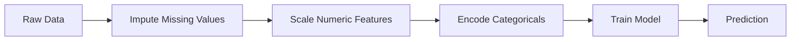
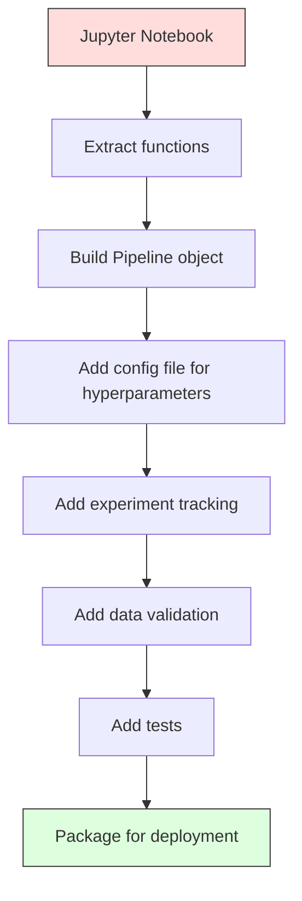

# ML boru hattları
# ML 管线


> Bir model bir ürün değil. bir boru hattı. boru hattı ham veriden uygulanan tahminlere kadar her şeydir ve her adım yeniden üretilebilir olmalıdır.

> Modeller ürün değil, tüp hatları sadece. Tüp hatları, başlangıç verilerinden başlatma tahminlerine kadar her adımı tekrarlamalıdır.

**Type:** Build | **类型：** 构建
**Language:**Python .**语言：**Python
**Prerequisites:** Phase 2, Lesson 12 (Hyperparameter Tuning) | **前置知识：** Phase 2 第 12 课（超参数调优）
**Time:** ~120 minutes | **时间：** 约 120 分钟

## Öğrenme hedefleri

- İsimlendirme, ölçekleme, kodlama ve model eğitimi tek bir yeniden üretilebilir nesneye zincirleyen bir ML boru hattını sıfırdan inşa edin
  Zücre oluşturan ML 管 line, doldurulacak, küçültülecek, kodlanacak ve model eğitimi bağlantısı tek bir tekrarlanabilir nesneye dönüştürülecek.
- Veriler sızdırma senaryolarını tanımlamak ve boru hattlarının bunları sadece eğitim verilerine dönüştürücü takarak nasıl engellediğini açıklamak
  识别数据泄漏场景,解释管线如何通过仅在训练数据上适应变换器以防止泄漏
- Farklı preprocessing kullanan bir sütunTransformer oluşturmak için sayısal ve kategorik özellikler
  Construct ColumnTransformer, numeric value and class characteristics application
- Kök hattının serileştirilmesini uygulayarak, aynı monte edilmiş kök hattının eğitim ve üretimde aynı sonuçlar verdiğini göstermek
                                                                                                                                                                                                                                                                


> **【中文解读】**
> ML 管线把数据预处理、特征工程、模型训练串串成一条流水线──sklearn pipeline 确保训练与推理的数据处理一致──生产环境中管线化是模型部署的基础──

> **【拓展：从 sklearn Pipeline 到 MLOps 工业级管线】**
> SELLON/TF Servis)  Google'ın TFX  TensorFlow Extended) ve Kubeflow Pipelines ise MLOps'in temsilci çerçevesidir.

## Sorunlar. Sorunlar.

Verileri yükleyen, eksik değerleri ortalama ile dolduran, özellikleri ölçeyen, bir modeli eğiten ve kesinlik yazdırırmış bir defteriniz var.

> Bir defteriniz var, verileri yükleyip, ortalama değerlerle doldurmak, eksik değerleri azaltmak, eğitim modellerini oluşturmak, doğru oranı yazmak.

Bir ay sonra, birisi modelini yeniden eğitmiş ve farklı sonuçlar elde etmiş. Ortalama test verileri (veriler sızması) dahil tüm veri kümesi üzerinde hesaplandı. Ölçekleme parametreleri kaydedilmedi, bu yüzden sonuç farklı istatistikler kullanır. Özellik mühendisliği kodu eğitim ve hizmet arasında kopyalandı ve kopyalar farklılaştı. Kategorik bir sütun, kodlayıcı tarafından hiç görülmemiş bir yeni bir değer elde etti.

> Bir ay sonra, birileri yeniden eğitim modelini elde etti ve farklı sonuçlar elde etti. Ortalama sayı test verilerinin toplam miktarı verilerinde hesaplanmıştır.

Bu, hipotetik değil. Bunlar, ML sistemlerinin üretimde başarısız olmasının en yaygın nedenleri. boru hattları, her dönüşüm adımını tek, düzenli, yeniden üretilebilir bir nesneye paketleyerek hepsini çözmektedir.

> Bunlar varsayımlar değildir. Bunlar, ML sistemlerinin üretim başarısızlığının en yaygın nedenleri. Tüm bu sorunları çözmek için her değişim adımını düzenli bir nesne olarak paketleyecek.

> **【中文解读】**
> ML 管线解决的核心问题:训练和推理的数据处理必须完全一致. 训练中全量数据计算平均值标准化训练中全量数据计算平均值标准化测试集含),推理时新数据计算平均值

## Konsepten bir şey.

### Bir Boru hattı Nedir

Bir boru hattı, bir model tarafından takip edilen veri dönüşümlerinin düzenli bir sırasıdır. Her adım önceki adımın çıkışını giriş olarak alır. Tüm boru hattı eğitim verilerine bir kez monte edilir. Tahmin zamanı, aynı donatılmış boru hattı yeni verileri dönüştürür ve tahminler üretir.

> 管线, bir modelle son olarak düzenli bir veri değişim dizisidir. Her adım, bir giriş olarak üst adımın çıkışını yapar. Tüm bir boru hattı bir kez eğitim verilerine uyarlanır.



Bu boru hattı garanti ediyor:
- Değişiklikler sadece eğitim verilerine dayandırılır (sızıntı yoktur)
  变换只在训练数据上拟合(没有泄漏)
- Aynı dönüşümler çıkarma zamanında uygulanır
  推理时应用相同变更
- Tüm nesne seriye edilebilir ve tek bir eser olarak dağıtılabilir
  Tüm nesne bir yapılandırma olarak sıralanıp yerleştirilebilir.
- Çarpışık doğrulama, boru hattının her katlaması için uygulanır ve ince bir sızmanın önlenmesi gerekir.
  交叉验证 交叉验证 交叉验证 交叉验证 交叉验证 交叉验证 交叉验证 交叉验证 交叉验证 交叉验证 交叉验证 交叉验证 交叉验证 交叉验证 交叉验证 交叉验证 交叉验证 交叉验证 交叉验证 交叉验证 交叉验证 交叉验证 交叉验证 交叉验证 交叉验证 交叉验证 交叉验证 交叉验证 交叉验证 交叉验证 交叉验证 交叉验证 交叉验证 交叉验证 交叉验证 交叉验证 交叉验证 交叉验证 交叉验证 交叉验证 交叉验证 交叉验证 交叉验证 交叉验证 交叉验证 交叉验证 交交交交交交交交交交交交交交交交交交交交交交交交交交交交交交交交交交交交交交交交交交交交交交交交交交交交交交交交交交交交交交交交交交交交交交交交交交交交交交交交交交交交交交交交交交交交交交交交交交交交交交交交交交交交交交交交交交交交交交交交交交交交交交交交交交交交交交交交交交交交交交交交交交交交交交交交交交交交交交交交交交交交交交交交交交交交交交交交交交交交交交交交交交交交交交交交交交交交交交交交交交交交交交交交交交交交交交交交交交交交交交交交交交交交交交交交交交交交交交交交交交交交交交交交交交交交交交交交交交交交交交交交交交交交交交交交交交交交交交交

### Veriler Sızdı: Sessiz Katil

Test setinden veya gelecekteki verilerden alınan bilgiler eğitimleri kirlettiklerinde veri sızması meydana gelir.

> Test kümesi veya gelecek verilerinde bilgi kirliliği eğitimi sırasında veri sızdırılması gerçekleşir.

**Leaky (wrong):**
```python
X = df.drop("target", axis=1)
y = df["target"]

scaler = StandardScaler()
X_scaled = scaler.fit_transform(X)

X_train, X_test = X_scaled[:800], X_scaled[800:]
y_train, y_test = y[:800], y[800:]
```

Skaliratör test verilerini gördü. Ortalama ve standart sapma test örneklerini içerir. Bu doğruluk tahminlerini şişiriyor.

> 缩放器看到了测试数据──平均值和标准差包含测试样本── bu, doğrulık oranının tahminini fazla ileriye çıkarır──

**Correct:**
```python
X_train, X_test = X[:800], X[800:]

scaler = StandardScaler()
X_train_scaled = scaler.fit_transform(X_train)
X_test_scaled = scaler.transform(X_test)
```

Bir boru hattı için bunu düşünmenize gerek yok.

> Bu tür bir işlem yapmanız gerekmiyor.

### Sklern boru hattı

Sklern'in `Pipeline`zincir transformatörleri ve bir tahminci.`.fit()`- Evet .`.predict()`ve`.score()`Bu, tüm adımları düzenli olarak uygulayacak.

> Sklern'in `Pipeline`Değişken ve Tahminci bağlantılarını açığa çıkarır.`.fit()`- Evet.`.predict()`和 `.score()`, tüm adımları uygulayacak şekilde.

```python
from sklearn.pipeline import Pipeline
from sklearn.preprocessing import StandardScaler
from sklearn.linear_model import LogisticRegression

pipe = Pipeline([
    ("scaler", StandardScaler()),
    ("model", LogisticRegression()),
])

pipe.fit(X_train, y_train)
predictions = pipe.predict(X_test)
```

Aradığın zaman .`pipe.fit(X_train, y_train)`- ...
1. Scaler çağrıları `fit_transform`X_tren'de
2. Model çağrılar `fit`Skalalı X_tren üzerinde

Aradığın zaman .`pipe.predict(X_test)`- ...
1. Scaler çağrıları `transform`(fit_transform değil) X_test'te
2. Model çağrılar `predict`Skalalı X_test üzerinde

Skaliratör montaj sırasında test verilerini görmez.

> - Ne ? - Ne ?`pipe.fit(X_train, y_train)`- ...
> 1. 缩放器对 X_train 调用 `fit_transform`
> 2. 模型对缩放后的 X_train 调用 `fit`
>
> - Ne ? - Ne ?`pipe.predict(X_test)`- ...
> 1. 缩放器对 X_test 调用 `transform`(Not fit_transform)
> 2. 模型对缩放后的 X_test 调用 `predict`
>
> 缩放器在拟合期间永远看不到测试数据――这是全部意义――

### KolonTransformer: Farklı sütunlar için farklı boru hattları

Gerçek veri kümeleri farklı önceden işleme gerektiren sayısal ve kategorik sütunlara sahiptir. `ColumnTransformer`Bunu halledeceğim.

> Gerçek veri kümesi, farklı bir önceden işleme gerektiren sayısal değerler ve sınıflar içerir.`ColumnTransformer`Bu işi halledelim.

```python
from sklearn.compose import ColumnTransformer
from sklearn.preprocessing import StandardScaler, OneHotEncoder
from sklearn.impute import SimpleImputer

numeric_pipe = Pipeline([
    ("impute", SimpleImputer(strategy="median")),
    ("scale", StandardScaler()),
])

categorical_pipe = Pipeline([
    ("impute", SimpleImputer(strategy="most_frequent")),
    ("encode", OneHotEncoder(handle_unknown="ignore")),
])

preprocessor = ColumnTransformer([
    ("num", numeric_pipe, ["age", "income", "score"]),
    ("cat", categorical_pipe, ["city", "gender", "plan"]),
])

full_pipeline = Pipeline([
    ("preprocess", preprocessor),
    ("model", GradientBoostingClassifier()),
])
```

- Evet .`handle_unknown="ignore"`OneHotEncoder'da yeni bir kategori ortaya çıktığında (model hiç görmemiş bir şehir), çökmek yerine sıfır vektörü üretir.

> OneHotEncoder 中的 `handle_unknown="ignore"`Yeni sınıflar ortaya çıktığında, çöküş değil, sıfırlık oluşur.

### Deneyim Takip

Bir boru hattı eğitimyi yeniden üretilebilir hale getirir, ama aynı zamanda deneylerde ne olduğunu takip etmeniz gerekir: hangi hiperparametre kullanıldı, hangi veri kümesi sürümü, hangi ölçümler vardı, hangi kod çalıştırıldı.

> 管线让训练可复现, ama sen de deney arasında ne olduğunu takip etmek gerekir: hangi süperparametre kullanıldı, hangi veri kümesi sürümü, hangi gösterge ne, hangi kod çalıştırıldı.

**MLflow**En yaygın açık kaynaklı çözümdür:

> **MLflow**En yaygın açık kaynaklı çözüm:

```python
import mlflow

with mlflow.start_run():
    mlflow.log_param("max_depth", 5)
    mlflow.log_param("n_estimators", 100)
    mlflow.log_param("learning_rate", 0.1)

    pipe.fit(X_train, y_train)
    accuracy = pipe.score(X_test, y_test)

    mlflow.log_metric("accuracy", accuracy)
    mlflow.sklearn.log_model(pipe, "model")
```

Her çalışmanın parametre, metrik, eser ve tam modeli ile kaydedildiği için çalışmalar karşılaştırılabilir, herhangi bir deneyi yeniden oluşturabilir ve herhangi bir model sürümünü dağıtabilirsiniz.

> Her çalışmanın bir parçası olarak, parametre, gösterge, yapı ve tam model kayıtlıdır.

**Weights & Biases (wandb)**barındırılmış bir kontrol tablosu ile aynı işlevselliği sağlar:

> **Weights & Biases (wandb)**提供相同功能,带托管仪表盘:

```python
import wandb

wandb.init(project="my-pipeline")
wandb.config.update({"max_depth": 5, "n_estimators": 100})

pipe.fit(X_train, y_train)
accuracy = pipe.score(X_test, y_test)

wandb.log({"accuracy": accuracy})
```

### Model Versiyonlama

Deneyim izlemesinden sonra model sürümlerini yönetmek zorundasın. Hangi model üretimde?

> 实验追踪后,你需要管理模型版本―― Hangi model üretimde? Hangi modeli sahnede?

MLflow'un Model Kayıt Kaydı şunları belirtir:
- **Version tracking:**Kaydedilen her model bir versiyon numarasını alır.
  **版本追踪：**Her bir model için bir versiyon numara
- **Stage transitions:**"Stage", "Prodüksiyon", "Arşivlenmiş"
  **阶段转换：**"Stage" ̋"Prodüksiyon" ̋"Arşivlenmiş"
- **Approval workflow:**Modeller açıkça üretime teşvik edilmelidir
  **审批工作流：**Modelleri üretime açıkça yükseltmek zorundadır.
- **Rollback:**Önceki sürümlere geri dön
  **回滚：**立即切回之前的版本

### DVC ile Versiyonlama Versiyonları

Kod git ile versiyonlanmıştır. Versiyonlanmıştır. Versiyonlanmıştır.

> 代码用 git 版本化──数据也应该版本化,但 git 不能处理大文件──DVC(Data Version Control)

```
dvc init
dvc add data/training.csv
git add data/training.csv.dvc data/.gitignore
git commit -m "Track training data"
dvc push
```

DVC gerçek verileri uzaktan depolama (S3, GCS, Azure) ve küçük bir `.dvc`Git commit'i kontrol ettiğinde,`dvc checkout`kullanılmış olan kesin verileri geri getirir.

> DVC gerçek veri depolarını uzak uçta ((S3、GCS、Azure) bırakır, git içinde küçük bir tane saklar.`.dvc`Bir şey gönderdiğinde,`dvc checkout`O zamanlar kullanılan kesin verileri geri kazanmak.

Bu, her git'in hem kod hem de veriler için pinleri oluşturması anlamına gelir.

> Bu, her git'in gönderilmesinin aynı anda kod ve verileri sabitlediği anlamına gelir.

### Tekrarlanabilir Denemeler

Tekrarlanabilir bir deney dört şeyi gerektirir:

> Bir deney dört şeyi gerektirir:

1. **Fixed random seeds:**Numpy, random ve framework (fırın, sklearn) için tohumlar ayarlayın
   **固定随机种子：**Çeviri: Çeviri: Çeviri: Çeviri: Çeviri: Çeviri: Çeviri: Çeviri: Çeviri: Çeviri: Çeviri: Çeviri: Çeviri: Çeviri: Çeviri: Çeviri: Çeviri: Çeviri: Çeviri: Çeviri: Çeviri: Çeviri: Çeviri: Çeviri: Çeviri: Çeviri: Çeviri: Çeviri: Çeviri: Çeviri: Çeviri: Çeviri: Çeviri: Çeviri: Çeviri: Çeviri: Çeviri: Çeviri: Çeviri: Çeviri: Çeviri: Çeviri: Çeviri: Çeviri: Çeviri: Çeviri: Çeviri: Çeviri: Çeviri: Çeviri: Çeviri: Çeviri: Çeviri: Çeviri: Çeviri: Çeviri: Çeviri: Çeviri: Çeviri: Çeviri: Çeviri: Çeviri: Çeviri: Çeviri: Çeviri: Çeviri: Çeviri: Çeviri: Çeviri: Çeviri: Çeviri: Çeviri: Çeviri: Çeviri: Çeviri: Çeviri: Çeviri: Çeviri: Çeviri: Çeviri: Çeviri: Çeviri: Çeviri: Çeviri: Çeviri: Çeviri: Çeviri: Çeviri: Çeviri: Çeviri: Çeviri: Çeviri: Çeviri: Çeviri: Çeviri: Çeviri: Çeviri: Çeviri: Çeviri: Çeviri: Çeviri: Çeviri: Çeviri: Çeviri: Çeviri: Çeviri: Çeviri: Çeviri: Ç Ç Ç Çeviri: Ç Ç Ç Ç Ç Ç Çeviri: Ç Ç Ç Ç Ç Ç Ç Ç Ç Ç Ç Ç Ç Ç Ç Ç Ç Ç Ç Ç Ç Ç Ç Ç Ç Ç Ç Ç Ç Ç Ç Ç Ç Ç Ç Ç Ç Ç Ç Ç Ç Ç Ç Ç Ç Ç Ç Ç Ç Ç Ç Ç Ç Ç Ç Ç Ç Ç Ç Ç Ç
2. **Pinned dependencies:**doğru versiyonlarla requirements.txt veya poetry.lock
   **固定依赖：**requirements.txt veya poetry.lock 锁定精确版本
3. **Versioned data:**DVC veya benzeri
   **版本化数据：**DVC veya benzer araçlar
4. **Config files:**Tüm hiperparametre, sert kodlanmış değil
   **配置文件：**Tüm aşırı parametre ayarlama, sert kodlama

```python
import numpy as np
import random

def set_seed(seed=42):
    random.seed(seed)
    np.random.seed(seed)
    try:
        import torch
        torch.manual_seed(seed)
        torch.cuda.manual_seed_all(seed)
        torch.backends.cudnn.deterministic = True
    except ImportError:
        pass
```

### Notbuktan Üretim Kökü'ne



Tipik ilerleme:

> Tipik bir gelişme:

1. **Notebook exploration:**Hızlı deneyler, görselleştirmeler, özellik fikirleri
   **notebook 探索：**快速实验、可视化、特征思想
2. **Extract functions:**Ön işleme, özellik mühendisliği, değerlendirmeyi modüllere dönüştürmek
   **抽取函数：**Preprocessing, characterization, evaluation, modüllerdeki
3. **Build Pipeline:**Zincir transformasyonu sklearn boru hattı veya özel sınıf
   **构建 Pipeline：**Kütüphane veya kendi kendini tanımlayan bir zincir değiştirmek
4. **Config management:**Tüm hiperparametreyi YAML/JSON yapılandırmasına taşı
   **配置管理：**Tüm süper parametreyi YAML/JSON'a aktarın
5. **Experiment tracking:**MLflow veya wandb kaydı ekle
   **实验追踪：**添加 MLflow 或 wandb 日志
6. **Data validation:**Eğitimden önce şema, dağılım ve eksik değer kalıplarını kontrol edin
   **数据验证：**訓練前检查 schema、分布、缺失模式
7. **Tests:**Transformatörler için birim testleri, tüm boru hattı için entegrasyon testleri
   **测试：**变换器的单元测试、完整管线的集成测试
8. **Deployment:**Kök hattını seriye, bir API'ye (FastAPI, Flask) sarın, konteynerleştir
   **部署：**序列化管线、包成 API(FastAPI、Flask)、容器化

### Genel Pipeline Hataları

| Mistake | Why it is bad | Fix |
|---------|-------------|-----|
| Fitting on full data before splitting | Data leakage | Use Pipeline with cross_val_score |
| Feature engineering outside pipeline | Different transforms at train vs serve | Put all transforms in the Pipeline |
| Not handling unknown categories | Production crash on new values | OneHotEncoder(handle_unknown="ignore") |
| Hardcoded column names | Breaks when schema changes | Use column name lists from config |
| No data validation | Silently wrong predictions on bad data | Add schema checks before prediction |
| Training/serving skew | Model sees different features in prod | One Pipeline object for both |

| 错误 | 为什么坏 | 修复 |
|------|---------|------|
| 划分前在全量数据上 fit | 数据泄漏 | 用 Pipeline 配合 cross_val_score |
| 管线外做特征工程 | 训练和服务变换不同 | 把所有变换放进 Pipeline |
| 不处理未知类别 | 生产中新值导致崩溃 | OneHotEncoder(handle_unknown="ignore") |
| 硬编码列名 | schema 改变时失效 | 用配置中的列名列表 |
| 没有数据验证 | 坏数据上预测错误无提示 | 预测前加 schema 检查 |
| 训练/服务偏差 | 生产中模型看到不同特征 | 训练和服务用同一个 Pipeline 对象 |

## Yapın.

> **【中文解读】**
> Çizimden sıfır gerçekleştirmek için ML 管线:自定义 Transformer (self-definition Transformer) Pipeline 类 (Pipeline 类) Pipeline 类 (Pipeline 类) Pipeline 类 (Pipeline 类) ColumnTransformer (Column 类) Pipeline 类) Pipeline 类 (Pipeline 类) Pipeline 类 (Pipeline 类) Pipeline 类 (Pipeline 类) Pipeline 类 (Pipeline 类) Pipeline 类 (Pipeline 类) Pipeline 类 (Pipeline 类) Pipeline 类 (Pipeline 类) Pipeline 类 (Pipeline 类) Pipeline 类 (Pipeline 类) Pipeline 类) Pipeline 类 (Pipeline 类) Pipeline 类 (Pipeline 类) 类) Pipeline Pipeline Pipeline Pipeline Pipeline Pipeline Pipeline Pipeline                                                                                                            

> **【拓展：sklearn Pipeline 在 Kaggle 和工业界的标准模式】**
> Kaggle Grandmaster'ın standart kod modeli neredeyse her zaman bir sklearn boru hattı içerir: sayı özellikleri SimpleImputer + StandardScaler, sınıf özellikleri SimpleImputer + OneHotEncoder, ColumnTransformer 组合后输入模型── bu da:交叉验证中每折独立适应、新数据推理时变化一致、代码简洁可维护── üretim sırasında, boru hattı işlevleri 序列化保存,部署时直接加载使用──
```figure
f3-pipeline-flow
```

## Yapın

Kodun içinde .`code/pipeline.py`Tam bir ML boru hattını sıfırdan inşa eder:

### Adım 1: Özel Transformer

```python
class CustomTransformer:
    def __init__(self):
        self.means = None
        self.stds = None

    def fit(self, X):
        self.means = np.mean(X, axis=0)
        self.stds = np.std(X, axis=0)
        self.stds[self.stds == 0] = 1.0
        return self

    def transform(self, X):
        return (X - self.means) / self.stds

    def fit_transform(self, X):
        return self.fit(X).transform(X)
```

### Adım 2: Bomba Başlangıçtan

```python
class PipelineFromScratch:
    def __init__(self, steps):
        self.steps = steps

    def fit(self, X, y=None):
        X_current = X.copy()
        for name, step in self.steps[:-1]:
            X_current = step.fit_transform(X_current)
        name, model = self.steps[-1]
        model.fit(X_current, y)
        return self

    def predict(self, X):
        X_current = X.copy()
        for name, step in self.steps[:-1]:
            X_current = step.transform(X_current)
        name, model = self.steps[-1]
        return model.predict(X_current)
```

### Adım 3: Pipeline ile çapraz onaylama

Kod, bir boru hattı ile çapraz onaylamanın veri sızmasını nasıl önlediğini gösterir: Skalire her katın eğitim verilerine ayrı olarak eklenir.

### Adım 4: Sklörn ile Tam Üretim Borusu

Tam bir boru hattı ile `ColumnTransformer`, çok sayıda önceden işleme yolu ve uygun çapraz onaylama ve deney kayıtları ile eğitilmiş bir model.

## İndirin . Ürünler .

Bu ders şunları ortaya çıkarır:
- `outputs/prompt-ml-pipeline.md`-- ML boru hattlarını inşa etmek ve düzeltmek için bir beceri
- `code/pipeline.py`- Süklern'den sıfırdan tam bir boru hattı

## Egzersizler.

1. 3 sayısal sütun ve 2 kategorik sütunlu bir veri kümesini ele alan bir boru hattı oluşturun.`ColumnTransformer`Aralıklı değerlendirme + ölçeklendirme ve en sık değerlendirme + tek sıcaktan kodlama ile kategorilere uygulanmak.
   1. 构建处理 3 个数值列和 2 个类别列的数据集的管线──使用 `ColumnTransformer`Sınıflar için özel kodlar, 5 defa birleştirme testi eğitimi kullanmakla birlikte,

2. Bilgisayarın veri sızdırma işlemini yapın: Sıkıştırıcıyı bölmeden önce tüm veri kümesine yerleştirin. Çarpıştırıcı (sızdırıcı) veri veri veri veri veri veri veri puanı ile karşılaştırın.
   2. Bu nedenle, veri sızıntılarını başlatmak için: ayrım öncesi tüm veri ölçüsüne uygun bir ölçekleme yaparken, sızıntıların ve boru hattlarının sızıntıların farkı ne kadar büyüktür?

3. Kök hattını seriye yap .`joblib.dump`- Ayrı bir senaryoya yükle ve tahminleri çalıştır.
   3. Kullan .`joblib.dump`序列化你的管线──在另一个脚本中加载并运行预测──验证预测完全相同──

4. Pipoyu en önemli iki sayısal sütun için çok sayısal özellikler (degre 2) oluşturan özel bir transformatör ekleyin.
   4. Bu nedenle, bir tür değişken oluşturmak için bir öz tanımlama değişkenini ekleyin.

5. Çöp hattı için MLflow izleme ayarlayın.`mlflow ui`) yarışları karşılaştırmak ve en iyi modeli seçmek için.
   5. Çekilme ve kontrol için 5 deney yapın.`mlflow ui`) en iyi modeli seçmek için çalıştırmak için.

> **【中文解读】**
> ML 管线的关键设计原则:(1) Tüm değişimler iş kitabı/çırpıcı kullanılarak sıralanmalıdır 保存完整的配合管线,部署时直接加载;(2) ColumnTransformer 处理混合类型数值特征和类型特征分别变换后合并;(3) 管线内不能有任何全局状态每个变压器的适应只依赖传输的训练数据──这些原则确保了训练推理一致性──

> **【拓展：数据泄漏的六种常见形式】**
> (1) Tüm miktarda veri üzerinde uyum ölçeklemeci yeniden ayırmak;(2) 目標编码全量数据计算平均值 kullanmak;(3) 时间序列随机划分;(4) 特征选择在全量数据上做;(5) 交叉验证中重复样本出现多倍;(6) 预测时使用未来才能获取的特征――管道 通过严格的适应/转变 分离防止前四种泄漏――对于时间序列和重复样本,需要特殊的交叉验证策略――

## Anahtar Şartlar .

| Term | What people say | What it actually means |
|------|----------------|----------------------|
| Pipeline | "Chain of transforms + model" | An ordered sequence of fitted transformers and a model, applied as one unit to prevent leakage |
| Data leakage | "Test info leaked into training" | Using information from outside the training set to build the model, inflating performance estimates |
| ColumnTransformer | "Different preprocessing per column" | Applies different pipelines to different subsets of columns, combining results |
| Experiment tracking | "Logging your runs" | Recording parameters, metrics, artifacts, and code versions for every training run |
| MLflow | "Track and deploy models" | Open-source platform for experiment tracking, model registry, and deployment |
| DVC | "Git for data" | Version control system for large data files, storing hashes in git and data in remote storage |
| Model registry | "Model version catalog" | A system that tracks model versions with stage labels (staging, production, archived) |
| Training/serving skew | "It worked in the notebook" | Differences between how data is processed during training versus inference, causing silent errors |
| Reproducibility | "Same code, same result" | The ability to get identical results from the same code, data, and configuration |

## Daha fazla okumak

- [scikit-learn Pipeline docs](https://scikit-learn.org/stable/modules/compose.html)-- resmi boru hattı referansı
  [scikit-learn Pipeline 文档](https://scikit-learn.org/stable/modules/compose.html)- 官方管线参考
- [MLflow documentation](https://mlflow.org/docs/latest/index.html)-- deney izleme ve model kayıtları
  [MLflow 文档](https://mlflow.org/docs/latest/index.html)- 实验追踪和模型注册
- [DVC documentation](https://dvc.org/doc)-- Versiyonlama
  [DVC 文档](https://dvc.org/doc)- 数据版本管理
- [Sculley et al., Hidden Technical Debt in Machine Learning Systems (2015)](https://papers.nips.cc/paper/2015/hash/86df7dcfd896fcaf2674f757a2463eba-Abstract.html)-- ML sistemlerinin karmaşıklığı üzerine temel çalışma
  [Sculley et al., Hidden Technical Debt in ML Systems (2015)](https://papers.nips.cc/paper/2015/hash/86df7dcfd896fcaf2674f757a2463eba-Abstract.html)- ML 系统复杂性的奠基论文
- [Google ML Best Practices: Rules of ML](https://developers.google.com/machine-learning/guides/rules-of-ml)-- pratik üretim ML tavsiyesi
  [Google ML Best Practices](https://developers.google.com/machine-learning/guides/rules-of-ml)- 实用生产 ML 建议
