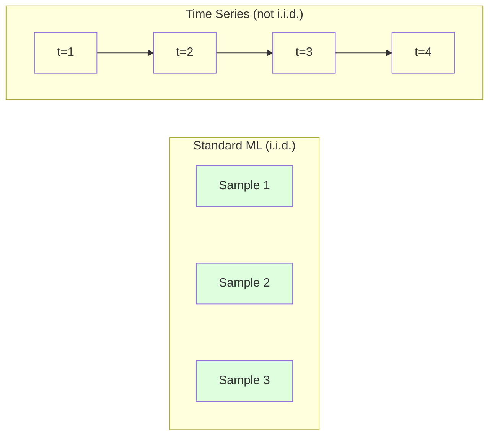
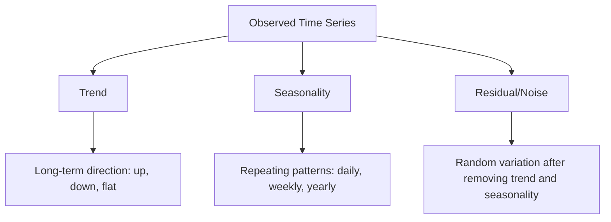
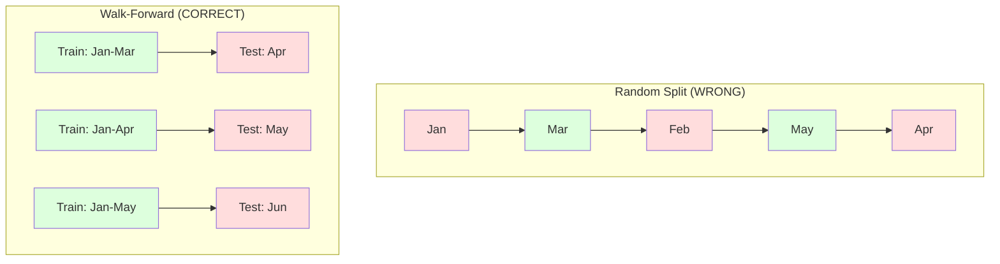

# Zaman Dizisi Temellikleri
# Zamanı ve süresi


> Geçmiş performans gelecek sonuçları tahmin eder -- eğer önce sabitliği kontrol ederseniz.

> Geçmişte yapılanlar, geleceği önceden tahmin edebiliyor.

**Type:** Build | **类型：** 构建
**Language:**Python .**语言：**Python
**Prerequisites:** Phase 2, Lessons 01-09 | **前置知识：** Phase 2 第 1-9 课
**Time:** ~90 minutes | **时间：** 约 90 分钟

## Öğrenme hedefleri

- Zaman dizisini trend, mevsimsellik ve kalan bileşenlere ayırıp sabitlik testi yapılır.
  Zaman dizisini trend, mevsimsel ve geride kalan kesimlere ayırıp dengeliliği kontrol edin.
- Zaman dizisini denetim altında öğrenme soruna dönüştürmek için gecikme özelliklerini ve döngülü istatistikleri uygula
  滞后特征实现和滚动统计将时间序列转换为监督学习问题
- Gelecekte verilerin eğitimlere sızmasını önleyen ileriye doğrulama çerçevesini oluşturmak
  Constructing pre-to-roll verification framework, preventing future data leakage to training
- Rastgele tren/test bölünmelerinin zaman dizileri için neden geçersiz olduğunu açıklayın ve performans boşluğu ile uygun zaman bölünmelerini gösterin.
  解释为什么随机训练/测试分类对时间序列无效,并使用正确时间分类显示性能差


> **【中文解读】**
> 时间序列是按时间序列排列的数据──ARIMA、指数平滑是经典方法,LSTM/Transformer是深度学习方法──股票预测、销量预测、天气预报是典型应用──

> **【拓展：时间序列预测在金融和供应链中的关键角色】**
> Amazon, günlük tahminlerin 4 milyar kez geçtiği küresel SKU stoklarını yönetmek için zaman dizisi tahminlerini kullanıyor. Uber, zaman dizisi tahminlerinin gereksinimlerini karşılamak için zaman dizisi tahminlerini kullanıyor.

## Sorunlar. Sorunlar.

Günlük satış, saatlik sıcaklık, dakika başına CPU kullanımı, haftalık hisse senedi fiyatları, gelecek hafta, gelecek çeyrek için ön tahmin yapmak.

> Zaman sıralamasındaki veriler var. Günün satış oranı, saat sıcaklığı, CPU kullanım oranı, saatlik hisse senedi fiyatı.

Standart ML araç kitinize ulaşırsınız: rastgele tren/test bölümü, çapraz onaylama, özellik matrisi, tahmin çıkışı. Her adım yanlış.

> Standart ML 工具:随机训练/测试划分、交叉验证、特征矩阵输入、预测输出── her adım yanlış¬¬¬¬¬¬¬¬¬¬¬¬¬¬¬¬¬¬¬¬¬¬¬¬¬¬¬¬¬¬¬¬¬¬¬¬¬¬¬¬¬¬¬¬¬¬¬¬¬¬¬¬¬¬¬¬¬¬¬¬¬¬¬¬¬¬¬¬¬¬¬¬¬¬¬¬¬¬¬¬¬¬¬¬¬¬¬¬¬¬¬¬¬¬¬¬¬¬¬¬¬¬¬¬¬¬¬¬¬¬¬¬¬¬¬¬¬¬¬¬¬¬¬¬¬¬¬¬¬¬¬¬¬¬¬¬¬¬¬¬¬¬¬¬¬¬¬¬¬¬¬¬¬¬¬¬¬¬¬¬¬¬¬¬¬¬¬¬¬¬¬¬¬¬¬¬¬¬¬¬¬¬¬¬¬¬¬¬¬¬¬¬¬¬¬¬¬¬¬¬¬¬¬¬¬¬¬¬¬¬¬¬¬¬¬¬¬¬¬¬¬¬¬¬¬¬¬¬¬¬¬¬¬¬¬¬¬¬¬¬¬¬¬¬¬¬¬¬¬¬¬¬¬¬¬¬¬¬¬¬¬¬¬¬¬¬¬¬¬¬¬¬¬¬¬¬¬¬¬¬¬¬¬¬¬¬¬¬¬¬¬¬¬¬¬¬¬¬¬¬¬¬¬¬¬¬¬¬¬¬¬¬¬¬¬¬¬¬¬¬¬¬¬¬¬¬¬¬¬¬¬¬¬¬¬¬¬¬¬¬¬¬¬¬¬¬¬¬¬¬¬¬¬¬¬¬¬¬¬¬¬¬¬¬¬¬¬¬¬¬¬¬¬¬¬¬¬¬¬¬¬¬¬¬¬¬¬¬¬¬¬¬¬¬¬¬¬¬¬¬¬¬¬¬¬¬¬¬¬¬¬¬¬¬¬¬¬¬¬¬¬¬¬¬¬¬¬¬¬¬¬¬¬¬¬¬¬¬¬¬¬¬¬¬¬¬¬¬¬¬¬¬¬¬¬¬¬¬¬¬¬¬¬¬¬¬¬¬¬¬¬¬¬¬

Zaman dizisi standart ML'nin güvendiği varsayımları kırar. Örnekler bağımsız değildir - bugünkü sıcaklık dünkiyi bağlıdır. Rastgele bölünmeler gelecekteki bilgileri geçmişe sızdırır. Geri denemelerde harika görünen özellikler üretimde başarısız olur çünkü zamanla değişen kalıplara dayanırlar.

> Zaman dizisi standart ML'ye bağlı olan varsayımları kırıyor. Örnekler bağımsız değildir. Bugün sıcaklık dünkiyi belirler. Gelecekte bilgiyi geçmişe sızdırmak için zaman ayırır.

Rastgele çapraz onayla %95 doğruluk elde eden bir model, doğru zaman tabanlı değerlendirme ile %55 elde edebilir. Fark teknik bir şey değildir. Kağıt üzerinde çalışan bir model ile üretim sırasında çalışan bir model arasındaki fark.

> Bir rastgele geçiş testi sırasında %95 doğruluk oranı elde eden bir model doğru zaman değerlendirmesi altında sadece %55 elde edebilir. Bu teknik ayrıntı değildir. Kağıt üzerinde geçerli olan model ile üretim sırasında geçerli olan model arasındaki fark budur.

Bu ders temel unsurları kapsar: zaman verilerini farklı kılan nedir, modelleri nasıl dürüstçe değerlendireceğiniz ve zaman dizisini standart ML modellerinin kullanabileceği özelliklere nasıl dönüştüreceğiniz.

> Bu ders temel bilgileri kapsar: Zaman verilerini farklı kılan nedir, nasıl dürüstçe değerlendirilebilir bir model ve zaman dizisini standart ML modeline nasıl dönüştürülebilir özellikleri.

> **【中文解读】**
> Zaman dizisi analizinin özelliği, veri noktaları arasında zaman bağımlılığı olmasıdır. Bugünün değeri dünki değerlere bağlıdır. Bu, standart ML'nin bağımsızlık ve dağılım varsayımlarını kırar.

## Konsepten bir şey.

### Zaman Dizini Nasıl Farklı Olur?

Standart ML, i.i.d. - bağımsız ve aynı şekilde dağılımı varsayır. Her örnek diğer örneklerden bağımsız olarak aynı dağılımdan alınır. Zaman dizisi her ikisini de ihlal eder:

> 標準 ML 假设 i.i.d.独立同分布── her örnek aynı dağılımdan çıkarılır, diğer örneklerle hiçbir ilişki yoktur── zaman dizisi bu iki varsayımı ihlal eder:

- **Not independent.**Bugünkü hisse senedi dünki fiyatına bağlıdır. Bu haftaki satışlar geçen hafta ile ilişkilidir.
  İndependent. Bugünki hisse senedi dünkiyle bağlıdır. Bu hafta satış sayısı önceki hafta ile ilişkili.
- **Not identically distributed.**Aralık ayında satışlar Mart ayında satışlardan farklı görünüyor.
  Bu, bir tarihte değişen bir satış oranı ve 3 aylık satış oranının farklılıkları ile gerçekleşmektedir.

Bu ihlaller küçük değil. Özellikleri nasıl oluşturduğunuz, modelleri nasıl değerlendirdiğiniz ve hangi algoritmalar çalıştığını değiştirirler.

> Bu ihlaller küçük bir sorun değil. Özellikleri nasıl oluşturduğunuzu, modelleri nasıl değerlendirdiğinizi ve hangi algoritmalar işe yarıyor.



Standart ML'de örnekler değiştirilebilir. Onları karıştırmak hiçbir şeyi değiştirmez. Zaman dizisinde, düzen her şeydir. Karıştırmak sinyali yok eder.

> Standard ML'de, örnekteki değişim vardır.

### Zaman Dizisinin Bileşenleri

Her zaman dizisi bir kombinasyon:

> Her zamanlı dizi aşağıdaki bileşenlerin bir parçasıdır:



- **Trend**Uzun vadeli yön: gelirler yılda %10 artar. Küresel sıcaklık artıyor.
  趋势:长期方向── gelir yılda %10 artıyor── küresel sıcaklık artıyor──
- **Seasonality**: Sıkı aralıklarda tekrarlanan kalıplar. Aralık ayında perakende satışları yükseldi. Temmuz ayında klima kullanımı zirveye ulaştı.
  季节性:固定间隔的重复模式──零售销量在12月激增──空调使用量在7月达到峰值──
- **Residual**Eğer kalıntı beyaz gürültü gibi görünüyorsa, parçalanma sinyalini yakaladı.
  Geride kalanlar: Gelişmeler ve mevsimsellik sonrası kalanlar kaldırılmaktadır. Geride kalanlar beyaz bir gürültü gibi görünürse, ayrıntıların sinyallerini yakaladığını göstermektedir.

### Dayanıklılık

Bir zaman dizisi, istatistik özellikleri (ortalama, varyans, otokorrelasyon) zamanla değişmezse sabitdir.

> Eğer bir zaman dizisinin istatistik özellikleri (meğerleri, farklılıklar, kendi kendine ilişkilendirilmiş) zamanla değişmezse, bu düz bir durumdur.

**Why it matters:**Stasyonel olmayan bir dizi, hareket eden bir ortalama vardır. Ocak'tan beri verilere dayalı bir model, Şubat'ın gösterdiği kadar farklı bir ortalama öğrenmiştir.

> **为什么重要：**Düzensiz düzene sahip bir dizinin ortalama değeri 1 aylık veri eğitimi modelinden öğrenilen ortalama değeri 2 aylık gösterilen değerden farklı olarak sistematik olarak çıkıyor.

**How to check:**Pencereler üzerinde yuvarlanma ortalamasını ve yuvarlanma standart sapmalarını hesaplayın.

> **如何检查：**計算 penceresindeki rolling average ve rolling standard差── eğer onlar hareket ederlerse, sıralama düz değilmişlerdir──

**How to fix:**Farklılaştırma. Çöm değerleri modelleme yerine, ardılı değerler arasındaki değişimi modelleme:

> **如何修复：**差分──不对原始值建模,而对连续值之间的变化建模:

```
diff[t] = value[t] - value[t-1]
```

Eğer bir farklılık döngüsü dizini sabitleştirmezse, tekrar uygulayın (ikinci sıradaki farklılık).

> Eğer bir sıra farkı, bir diziyi düzeltemezse, tekrar bir kez uygulamalıdır.

**Example:**

> **示例：**

Orijinal seri: [100, 102, 106, 112, 120]
İlk fark: [2, 4, 6, 8] (hâlâ yukarı doğru eğilimi)
İkinci fark: [2, 2, 2] (sağlam -- sabit)

İlk farklılık çizgisine dönüştü, ikinci farklılık düzleştirdi.

> İlk sırada ikinci bir eğilim vardır. Birinci aşama da doğrusal eğilim haline gelir.

**Formal test:**Gelişmiş Dickey-Fuller (ADF) testi, sabitlik için standart istatistik testidir. Null hipotezi "seriyalı bir istasyon değildir". 0.05'ten aşağı bir p değeri, sıfırı reddedebilir ve sabitliği sonuçlayabilirsiniz demektir. ADF'yi sıfırdan uygulamazız (asimptotik dağılım tabloları gerektirir), ancak kodumuzdaki yuvarlak istatistik yaklaşımı pratik bir görsel kontrol sağlar.

> **正式检验：**Gelişmiş Dickey-Fuller(ADF) kontrolü düz düzine statistik standart kontroldür.零 hipotezi "sözleri düzine olmayan"tır. p  değeri 0.05'ten düşüktür. Bu da sıfır hipotezi reddedebileceğinizi ve düz bir sonuç elde edebileceğinizi ifade eder.

### Otomatik ilişki

Otokorelasyon, t zamanındaki bir değerin t-k zamanındaki değerle ne kadar ilişkili olduğunu ölçer (geçmişteki k adımlar).

> Zamanın değerinin t-k-k                                                                                                                                                                                                                                                           

**ACF tells you:**
- Eğer ACF 5'den sonra sıfıra düşerse, 5 adımdan fazla öncesinin değerleri önemi yoktur.
  Bir dizi anısı çok uzak. Eğer ACF 5 adım sonra geri kalırsa, 5 adım öncesinin değeri geçerli olmaz.
- ACF'nin 12 (aylık veriler) gecikmesiyle yükseltilmesi, yıllık mevsimsellik anlamına gelir.
  Eğer ACF 12 aylık verilerde geri kalırsa, yıllık mevsimlik vardır.
- ACF'nin önemsiz hale geldiği yere kadar gecikmeler kullanın.
  ACF'nin göz ardı edilebilir bir geride kalmasına kadar kullanılır.

**PACF (Partial Autocorrelation Function)**Eğer bugün sadece ikisi de dün ile ilişkili olduğu için 3 gün önce ile ilişkiliyse, PACF 3'te 0 olurken ACF 3'te olmaz.

> **PACF（偏自相关函数）**Bu nedenle, bu gün ve 3 gün önce ilişkili olanların hepsi dün ile ilişkili olduğu için, PACF geri kalan 3'de sıfır, ACF geri kalan 3'de sıfır değildir.

### Lag Özellikleri: Zaman Serisini Gözetimli Öğrenmeye dönüştürmek

Standart ML modellerinde bir özellik matrisi X ve bir hedef y gerekir. Zaman dizisi size tek bir değer sütunu verir. Köprü gecikme özellikleri.

> 标准 ML 模型需要特征矩阵 X 和目标 y──时间序列给你一列值──桥梁是滞后特征──

[10, 12, 14, 13, 15] dizisini alın ve lag-1 ve lag-2 özelliklerini oluşturun:

> 取序列 [10, 12, 14, 13, 15] 并创建滞后 1 和滞后 2 Özellikleri:

| lag_2 | lag_1 | target |
|-------|-------|--------|
| 10    | 12    | 14     |
| 12    | 14    | 13     |
| 14    | 13    | 15     |

Şimdi standart bir gerileme sorunu var. Her türlü ML modeli (lineer gerileme, rastgele orman, gradient artışı) hedefi gecikmelerden tahmin edebilir.

> Şimdi bir standart geri dönüş sorunu var. Herhangi bir ML modeli (linear geri dönüş, asane orman, derece yükselme) geride kalan özelliklerin tahmin hedefinin üzerinden yapılabilir.

Yapabileceğiniz ek özellikler:
- **Rolling statistics:**ortalama, std, min, maksimum son k değerleri
  滚动统计:过去 k 个值的平均值、标准差、最小值、最大值
- **Calendar features:**Haftanın günü, ay, tatil, hafta sonu
  Gün: Gün: Gün: gün: gün: gün: gün: gün: gün: gün: gün: gün: gün: gün: gün: gün: gün: gün: gün: gün: gün: gün: gün: gün: gün: gün: gün: gün: gün: gün: gün: gün: gün: gün: gün: gün: gün: gün: gün: gün: gün: gün: gün: gün: gün: gün: gün: gün: gün: gün: gün: gün: gün: gün: gün: gün: gün: gün: gün: gün: gün: gün: gün: gün: gün: gün: gün: gün: gün: gün: gün: gün: gün: gün: gün: gün: gün: gün: gün: gün: gün: gün: gün: gün: gün: gün: gün: gün: gün: gün: gün: gün: gün: gün: gün: gün: gün: gün: gün: gün: gün: gün: gün: gün: gün: gün: gün: gün: gün: gün: gün: gün: gün: gün: gün: gün: gün: gün: gün: gün: gün: gün: gün: gün: gün: gün: gün: gün: gün: gün: gün: gün: gün: gün: gün: gün: gün: gün: gün: gün: gün: gün: gün: gün: gün: gün: gün: gün: gün: gün: gün: gün: gün: gün: gün: gün: gün: gün: gün: gün: gün: gün: gün: gün: gün: gün: gün: gün: gün: gün: gün: gün: gün::::
- **Differenced values:**Önceki aşamalı değişiklik
  差分值:与前一步的变化
- **Expanding statistics:**toplu ortalama, toplu toplam
  扩展统计:累积平均值、累积和
- **Ratio features:**Akım değer / döngü ortalaması (son ortalama ile ne kadar uzak)
  %s Özellikleri:  roll roll roll average value (Hazırlık ortalama değerinden farklılık derecesi)
- **Interaction features:**1 * haftayı gün (hafta günlerinin momentum üzerindeki etkisi)
  交互特征:lag_1 * gün_of_week(工作日对动量的影响)

**How many lags?**Otokorelasyon fonksiyonunu kullanın. ACF 10'a kadar önemli ise en az 10 gecikme kullanın. Haftalik mevsimsellik varsa, 7 (ve muhtemelen 14) gecikme dahil edin.

> **用多少个滞后？**Eğer ACF'nin geri kalan 10'u önemli ise, en az 10'u geri kalan kullanın. Eğer 7'den daha fazla gecikme varsa, daha fazla gecikme daha fazla tarih verir, ancak daha fazla özelliklere uyum sağlamalıdır, daha fazla uygun risk artırmalıdır.

**The target alignment trap.**Geçmiş özellikleri oluştururken hedef t zaman değer olmalıdır ve tüm özellikler t-1 veya daha önceki zaman değerlerini kullanmalıdır. Eğer yanlışlıkla t zaman değerini bir özellik olarak dahil ederseniz, mükemmel bir tahminci ve tamamen işe yaramaz bir modeliniz vardır. Bu, zaman dizisi özellik mühendisliği en yaygın hata.

> **目标对齐陷阱。**TEMPONT TEMPORTYONLARY TEMPONTYONLARY TEMPONTYONLARY TEMPONTYONLARY TEMPONTYONLARY TEMPONTYONLARY TEMPONTYONLARY TEMPONTYONLARY TEMPONTYONLARY TEMPONTYONLARY TEMPONTYONLARY TEMPONTYONLARY TEMPONTYONLARY TEMPONTYONLARY TEMPONTYONLARY TEMPONTYONLARY TEMPONTYONLARY TEMPONTYONLARY TEMPONTYONLARY TEMPONTYONLYONL TEMPONTYONLORY TEMPONTYONL TEMPONTYONL TEMPONTYON TEMPONTYON TEMPONTYON TEMPONTYON TEMPONTYON TYON TEMPONTYON TEMPONTYON TYON TYON TEMPONTYON TYON TYON TEMPON TYON TORYON TORYON TOR TOR TOR TOR TOR TOR TOR TOR TOR TOR TOR TEMPON TOR TOR TOR TOR TOR TOR TOR TOR TOR TOR TOR TOR TOR TOR TOR 

### İleride Değerlendirme

Bu dersdeki en önemli kavramdır. Standart k katlı çapraz onaylama, eğitim ve test için örnekleri rastgele tahsis eder. Zaman dizisi için, bu gelecekteki bilgileri sızdırır.

> Bu, dersinin en önemli kavramıdır. Standart k 折交叉验证 zamanla örneği eğitim ve test kümelerine dağıtır.



Önceki onaylama:
1. Zamanına kadar veriyi trenle
   Zamanın öncesinde eğitim
2. Zaman t+1 (veya t+1'den t+k'ye kadar çok adımlı)
   Zamanında t+1 预测(或多步预测 t+1 到 t+k)
3. Pencereyi ileriye kaydır
   Ön kaydırma penceresi
4. Tekrarla
   Şiddetli

Her test katmanı sadece tüm eğitim verilerinden sonra gelen verileri içerir. Gelecekte sızıntı yoktur. Bu size modelin dağıtıldığında nasıl performans göstereceğini dürüst bir tahmin verir.

> Her test kurumu sadece tüm eğitim verilerinin ardından gelen verileri içerir. Gelecekte bir sızıntı yoktur. Bu size model dağıtımında performansın dürüst bir tahminini sağlar.

**Expanding window**Tüm tarihi verileri eğitim için kullanır (fenster büyür). **Sliding window**Eski verilerin hâlâ önemli olduğuna inanıyorsanız genişlemeyi kullanın. Dünya değişir ve eski verilerin zarar verdiğinde sürüklemeyi kullanın.

> **扩展窗口**Tüm tarihi verileri kullanın.**滑动窗口**Uygulamayı kullanın. Uygulamayı kullanın. Uygulamayı kullanın.

### ARIMA İntüition

ARIMA klasik zaman dizisi modelidir.

> ARIMA klasik zaman dizisi modelidir. Üç bölümüne sahiptir:

- **AR (Autoregressive):**Geçmiş değerlerden tahmin. AR(p) son p değerlerini kullanır.
  AR(自归归): 从过去的价值预测──AR(p) 使用最近的 p 个价值──
- **I (Integrated):**D) Dönüştürme d) Dönüştürme d) Dönüştürme d) D) D) D) D) D) D) D) D) D) D) D) D) D) D) D) D) D) D) D) D) D) D) D) D) D) D) D) D) D) D) D) D) D) D) D) D) D) D) D) D) D) D) D) D) D) D) D) D) D) D) D) D) D) D) D) D) D) D) D) D) D) D) D) D) D) D) D) D) D) D) D) D) D) D) D) D) D) D) D) D) D) D) D) D) D) D) D) D) D) D) D) D) D) D) D) D) D) D) D) D) D) D) D) D) D) D) D) D) D) D) D) D) D) D) D) D) D) D) D) D) D) D) D) D) D) D) D) D) D) D) D) D) D) D) D) D) D) D) D) D) D) D) D) D) D) D) D) D) D) D) D) D) D) D) D) D) D) D) D) D) D) D) D) D) D) D) D) D) D) D) D) D) D) D) D) D) D) D) D) D) D) D) D) D) D) D) D) D) D) D) D) D) D) D) D) D) D) D) D) D) D) D) D) D) D) D) D) D) D) D) D) D) D) D) D) D) D) D) D) D) D) D) D) D) D) D) D) D) D) D) D) D) D) D) D) D) D) D) D) D) D) D) D) D
  I(积分): 轮差分を实现平稳性──I(d) 轮差分を实现平稳性──I(d) 轮差分を応用する
- **MA (Moving Average):**Geçmiş tahmin hatalarından tahmin. MA(q) son q hataları kullanır.
  MA(移动平均): 過去の预测誤差预测。MA(q) 使用最近の q 个誤差。

ARIMA ((p, d, q) üçü de birleştirir. ACF/PACF analizi veya otomatik arama (auto-ARIMA) üzerine kurulmuş olarak p, d, q seçilir.

> ARIMA(p, d, q) 组合了所有三成分──你基于ACF/PACF 分析或自动搜索(auto-ARIMA) 选择 p、d、q──

ARIMA'yı sıfırdan uygulamayacağız. Bu ders kapsamının ötesinde olan sayısal optimizasyonu gerektirir. Anahtar anlayış, her bileşenin ne yaptığını anlamak, böylece ARIMA sonuçlarını yorumlayabilir ve ne zaman kullanacağınızı bilebilirsiniz.

> ARIMA'nın bu sınıfın sınırlarını aşan sayısal optimizasyon gerektirir.

### Ne Zaman Kullanmalı

| Approach | Best For | Handles Seasonality | Handles External Features |
|----------|---------|-------------------|------------------------|
| Lag features + ML | Tabular with many external features | With calendar features | Yes |
| ARIMA | Single univariate series, short-term | SARIMA variant | No (ARIMAX for limited) |
| Exponential smoothing | Simple trend + seasonality | Yes (Holt-Winters) | No |
| Prophet | Business forecasting, holidays | Yes (Fourier terms) | Limited |
| Neural networks (LSTM, Transformer) | Long sequences, many series | Learned | Yes |

Çoğu pratik sorun için, gecikme özellikleri + gradient artışı en güçlü başlangıç noktasıdır.

> Çoğu gerçek sorunun için, geriye gitme özellikleri + 梯度提升 en güçlü başlangıç noktasıdır.

### Önceden Görülen Uçraklar ve Stratejiler

Tek adımlı tahminler bir adım ileriyi tahmin eder. Çok adımlı tahminler çok adımlı tahminler yapar.

> 单步预测预测 下一个时间步多步预测预测多个时间步有三种策略:

**Recursive (iterated):**Bir adım ileriyi tahmin edin, bir sonraki adım için giriş olarak tahmin kullanın. Basit ama hatalar birikir -- her tahmin önceki tahminleri kullanır, bu yüzden hatalar karışık.

> **递归（迭代）：**预测一步,将预测结果作为下一步的输入──简单但误差会积累每个预测使用前一个预测,因此错误会叠加──

**Direct:**Her ufuk için ayrı bir model eğit. Model-1 t+1 tahmin eder, Model-5 t+5 tahmin eder. Hata birikimi yoktur, ancak her model daha az eğitim örneğine sahiptir ve bilgi paylaşmazlar.

> **直接：**Her bir tahmin kapsamı için tek başına yapılan eğitimler. Model-1  tahmin t+1, Model-5  tahmin t+5── hiçbir hata birikmedi, ancak her bir modelin eğitim örnekleri daha az ve paylaşılmamış bilgiler¬¬¬tir.

**Multi-output:**Tüm ufukları aynı anda çıkaran bir model eğit. ufuklar arasında bilgi paylaşır, ancak birden fazla çıkışı destekleyen bir model (veya özel bir kayıp fonksiyonu) gerektirir.

> **多输出：**訓練一個模型同時输出所有预测范围──跨范围共享信息,但需要支持多输出模型──或自定义损失函数──

Çoğu pratik sorun için, kısa ufuklar için rekürsiv (1-5 adım) ve daha uzun ufuklar için doğrudan başlayın.

>                                                                                                                                                                                                                                                               

### Zaman Dizisi'nde Genel Hatalar

| Mistake | Why it happens | How to fix |
|---------|---------------|-----------|
| Random train/test split | Habit from standard ML | Use walk-forward or temporal split |
| Using future features | Feature at time t included by mistake | Audit every feature for temporal alignment |
| Overfitting to seasonality | Model memorizes calendar patterns | Hold out a full seasonal cycle in the test set |
| Ignoring scale changes | Revenue doubles but patterns stay | Model percentage change instead of absolute |
| Too many lag features | "More history is better" | Use ACF to determine relevant lags |
| Not differencing | "The model will figure it out" | Tree models handle trends; linear models need stationarity |

## Yapın.

> **【中文解读】**
> Zaman dizisinin çekirdek araçları: 滞后特征生成器 (Zero) 将序列转转为监督学习格式) 滚动统计 (Rolling Statistics) 移动平均 (移动平均) 移动标准差 (移动标准差) 平稳性检查 (平稳性检查) ADF (ADF) 检查) 时间序列分解 (时间序列分解) 趋势+季节性+残差) 前行 验证框架──关键教训:绝不能随机划分时间序列数据──

> **【拓展：从 ARIMA 到 Transformer——时间序列预测的进化】**
> 经典时间序列方法 (ARIMA、Holt-Winters) 单变量、短序列上仍然有效──但现代方法已大幅超越:Facebook'ın Prophet 自动处理节假日和季节性;Amazon'ın DeepAR kullanımı RNN 归归自归做概率预测;Google'ın TimesFM 和 Amazon'ın Chronos kullanımı Transformer 架构, 零样本 (零样本) 零射) 时间序列预测 突破取得──
```figure
f3-series-decompose
```

## Yapın

Kodun içinde .`code/time_series.py`Temel yapı taşlarını sıfırdan uyguluyor.

> `code/time_series.py`Orta kod, çekirdek yapı modülünü sıfırdan gerçekleştirdi.

### Lag Özelliği Yaratıcısı

```python
def make_lag_features(series, n_lags):
    n = len(series)
    X = np.full((n, n_lags), np.nan)
    for lag in range(1, n_lags + 1):
        X[lag:, lag - 1] = series[:-lag]
    valid = ~np.isnan(X).any(axis=1)
    return X[valid], series[valid]
```

Bu bir 1D serisini her satırın sonuncu olduğu bir özellik matrisine dönüştürür.`n_lags`değerleri özellik olarak ve hedefi olan mevcut değer.

> Bu bir diziyi bir çizgi olarak değiştirir.`n_lags`个值作为特征,当前值作为目标──

### Yürümeye Devam eden Çarmıhlı Değerlendirme

```python
def walk_forward_split(n_samples, n_splits=5, min_train=50):
    assert min_train < n_samples, "min_train must be less than n_samples"
    step = max(1, (n_samples - min_train) // n_splits)
    for i in range(n_splits):
        train_end = min_train + i * step
        test_end = min(train_end + step, n_samples)
        if train_end >= n_samples:
            break
        yield slice(0, train_end), slice(train_end, test_end)
```

Her bölünme, eğitim verilerinin test verilerinden önce sıkı şekilde gelmesini sağlar.

> Her bölüme göre eğitim verileri test verilerine kadar sıkı şekilde verilir.

### Basit Autoregressive Model

Saf AR modeli sadece gecikme özelliklerinin doğrusal gerilemesidir:

> 純AR 模型就是滞后特征上线性回归:

```python
class SimpleAR:
    def __init__(self, n_lags=5):
        self.n_lags = n_lags
        self.weights = None
        self.bias = None

    def fit(self, series):
        X, y = make_lag_features(series, self.n_lags)
        # Solve via normal equations
        X_b = np.column_stack([np.ones(len(X)), X])
        theta = np.linalg.lstsq(X_b, y, rcond=None)[0]
        self.bias = theta[0]
        self.weights = theta[1:]
        return self
```

Bu, kavramsal olarak Ders 02-den gelen doğrusal gerileme ile aynıdır, ancak aynı değişkenin zaman geçirilmiş sürümlerine uygulanır.

> Bu kavramda 2. sınıfın linear geri dönüşü ile aynıdır, ancak aynı değişkenliğin zaman geride kalan sürümleri için uygulanır.

### Duruşsuzluk Kontrolü

Kod, sabitliği görsel ve sayısal olarak değerlendirmek için kaydırma istatistiklerini hesaplar:

> 代码计算滚动统计量, görülebilirlik ve sayısal bir şekilde dengeliliği değerlendirme:

```python
def check_stationarity(series, window=50):
    rolling_mean = np.array([
        series[max(0, i - window):i].mean()
        for i in range(1, len(series) + 1)
    ])
    rolling_std = np.array([
        series[max(0, i - window):i].std()
        for i in range(1, len(series) + 1)
    ])
    return rolling_mean, rolling_std
```

Eğer yuvarlak ortalama sürüş veya yuvarlak std değişirse, seri sabit değildir.

> Eğer rolling average değerleri sürüklenirse veya rolling standardı değişirse, sıralama düzlemsiz olur.

Kod ayrıca serinin ilk yarısını ve ikinci yarısını karşılaştırarak sabitliği kontrol eder. Eğer araçlar standart sapmanın yarısından fazla farklılık gösterirse veya değişim oranı 2x'den fazla ise, seriler sabit olmayan olarak işaretlenir.

> Kodu da karşılaştırma dizisinin ilk yarısını ve ikinci yarısını incelemek için düzeltme sabitliğini kontrol eder. Eğer ortalama değer farkı yarıdan fazla standart farkı veya düzeltme farkı iki katından fazla ise dizisi düzeltme sabit değil olarak belirlenir.

### Otomatik ilişki

```python
def autocorrelation(series, max_lag=20):
    n = len(series)
    mean = series.mean()
    var = series.var()
    acf = np.zeros(max_lag + 1)
    for k in range(max_lag + 1):
        cov = np.mean((series[:n-k] - mean) * (series[k:] - mean))
        acf[k] = cov / var if var > 0 else 0
    return acf
```

## Çerçeveyi kullanın.

sklearn ile herhangi bir regresör ile doğrudan lag özelliklerini kullanırsınız:

> Bu cihazı kullanarak herhangi bir geri dönüş cihazı için doğrudan geriye dönersiniz:

```python
from sklearn.linear_model import Ridge
from sklearn.ensemble import GradientBoostingRegressor

X, y = make_lag_features(series, n_lags=10)

for train_idx, test_idx in walk_forward_split(len(X)):
    model = Ridge(alpha=1.0)
    model.fit(X[train_idx], y[train_idx])
    predictions = model.predict(X[test_idx])
```

ARIMA için, istatistik modellerini kullanın:

> 对于 ARIMA,使用统计模型:

```python
from statsmodels.tsa.arima.model import ARIMA

model = ARIMA(train_series, order=(5, 1, 2))
fitted = model.fit()
forecast = fitted.forecast(steps=30)
```

Kodun içinde .`time_series.py`her iki yaklaşımı da gösterir ve ilerleme doğrulama kullanılarak karşılaştırır.

> `time_series.py`Orta kod iki yöntem gösterdi ve ön yönlü yuvarlanma testi kullanılarak karşılaştırma yapıldı.

### sklearn Zaman Sıraları

sklearn sağlıyor `TimeSeriesSplit`ilerleme doğrulamasını uygulayan:

> Süküler  sağladı `TimeSeriesSplit`, ön yönlü rolling verification gerçekleştirildi:

```python
from sklearn.model_selection import TimeSeriesSplit

tscv = TimeSeriesSplit(n_splits=5)
for train_index, test_index in tscv.split(X):
    X_train, X_test = X[train_index], X[test_index]
    y_train, y_test = y[train_index], y[test_index]
    model.fit(X_train, y_train)
    score = model.score(X_test, y_test)
```

Bu sıfırdan başlayan bizim eşdeğerimiz .`walk_forward_split`Bu, Sklern'in çapraz onaylama çerçevesine entegre.`cross_val_score`- ...

> Bu bizim sıfırdan gerçekleştirdiğimiz şeyle aynı.`walk_forward_split`Bu, bir şirketin verileme çerçevesinde yer alan bir süreçtir.`cross_val_score`Birinci kullanımı:

```python
from sklearn.model_selection import cross_val_score

scores = cross_val_score(model, X, y, cv=TimeSeriesSplit(n_splits=5))
print(f"Mean score: {scores.mean():.4f} +/- {scores.std():.4f}")
```

### Değerlendirme Metrikleri

Zaman dizisi tahminleri regresyon metriklerini kullanır, ancak zaman farkında bağlamla:

> 时间序列预测 Return indicator kullanmak, ama Time sensitif on below:

- **MAE (Mean Absolute Error):**"Y_true - y_pred diction" ortalaması. "Orijinal birimlerde yorumlanmak kolaydır.
  MAE(平均绝对差 - ), y_predition'un ortalama değeri, basit bir şekilde açıklanır.
- **RMSE (Root Mean Squared Error):**Ortalama kare hataların kare kökü. Büyük hataların MAE'den daha fazla cezalandırılması. Büyük hataların birçok küçük hatalardan daha kötü olduğu zaman kullanın.
  RMSE (RMSE)  (RMSE)  (RMSE)  (RMSE)  (RMSE)  (RMSE)  (RMSE)  (RMSE)  (RMSE)  (RMSE)  (RMSE)  (RMSE)  (RMSE)  (RMSE)  (RMSE)  (RMSE)  (RMSE)  (RMSE)  (RMSE)  (RMSE)  (RMSE)  (RMSE)  (RMSE)  (RMSE)  (RMSE)  (RMSE)  (RMSE)  (RMSE)  (RMSE)  (RMSE)  (RMSE)  (RMSE)  (RMSE)  (RMSE)  (RMSE)  (RMSE)  (RMSE)  (RMSE)  (REME)  (REME)  (RES)  (RES)  (RES)  (RES)
- **MAPE (Mean Absolute Percentage Error):**Ortalama hata / gerçek değer = 100 * 100 . Ölçüsünden bağımsız, farklı diziler arasında karşılaştırmak için yararlı. Ama gerçek değerler sıfır olduğunda tanımlanmamış.
  MAPE (MAPE) (% % % % % % % % % % % % % % % % % % % % % % % % % % % % % % % % % % % % % % % % % % % % % % % % % % % % % % % % % % % % % % % % % % % % % % % % % % % % % % % % % % % % % % % % % % % % % % % % % % % % % % % % % % % % % % % % % % % % % % % % % % % % % % % % % % % % % % % % % % % % % % % % % % % % % % % % % % % % % % % % % % % % % % % % % % % % % % % % % % % % % % % % % % % % % % % % % % % % % % % % % % % % % % % % % % % % % % % % % % % % % % % % % % % % % % % % % % % % % % % % % % % % % % % % % % % % % % % % % % % % % % % % % % % % % % % % % % % % % % % % % % % % % % % % % % % % % % % % % % % % % % % % % % % % % % % % % % % % % % % % % % % % % % % % % % % % % % % % % % % % % % % % % % % % % % % % % % % % % % % % % % % % % % % % % % % % % % % % % % % % % % % % % % % % % % % % % % % % % % % % % % % % % % % % % % % % % % % % % % % % % % % % % % % % % % % % % % % % % % % % % % % % % % % % % % % % % % % % % % % % % % % % % % % % % % % % % % % % % % % % % % % % % % % % % % % % % % % % % % % % %
- **Naive baseline comparison:**Her zaman basit temel çizgilerle karşılaştırın. Mevsimsel naif temel çizgi bir dönemden önceki değeri tahmin eder (dün, geçen hafta).
  朴素基线比较:始终与简单基线比较──季节性朴素基线预测一个周期前的值(昨天、上周)── Eğer modeliniz basit基线'den geçemezse, sorun ortaya çıkarın──

### Çekilen Özellikler

Kod, gecikme özelliklerini eklemek için kaydırıcı istatistikler (7. ve 14. gün pencerelerindeki ortalama, std, min, max) eklenmesini gösterir. Bunlar model'e sadece gecikme özelliklerinin yakalamadığı son eğilimler ve değişkenlik hakkında bilgi verir.

> Kod, 7 天 ve 14 天 pencerelerinin ortalama ¥¥¥¥¥¥¥¥¥¥¥¥¥¥¥¥¥¥¥¥¥¥¥¥¥¥¥¥¥¥¥¥¥¥¥¥¥¥¥¥¥¥¥¥¥¥¥¥¥¥¥¥¥¥¥¥¥¥¥¥¥¥¥¥¥¥¥¥¥¥¥¥¥¥¥¥¥¥¥¥¥¥¥¥¥¥¥¥¥¥¥¥¥¥¥¥¥¥¥¥¥¥¥¥¥¥¥¥¥¥¥¥¥¥¥¥¥¥¥¥¥¥¥¥¥¥¥¥¥¥¥¥¥¥¥¥¥¥¥¥¥¥¥¥¥¥¥¥¥¥¥¥¥¥¥¥¥¥¥¥¥¥¥¥¥¥¥¥¥¥¥¥¥¥¥¥¥¥¥¥¥¥¥¥¥¥¥¥¥¥¥¥¥¥¥¥¥¥¥¥¥¥¥¥¥¥¥¥¥¥¥¥¥¥¥¥¥¥¥¥¥¥¥¥¥¥¥¥¥¥¥¥¥¥¥¥¥¥¥¥¥¥¥¥¥¥¥¥¥¥¥¥¥¥¥¥¥¥¥¥¥¥¥¥¥¥¥¥¥¥¥¥¥¥¥¥¥¥¥¥¥¥¥¥¥¥¥¥¥¥¥¥¥¥¥¥¥¥¥¥¥¥¥¥¥¥¥¥¥¥¥¥¥¥¥¥¥¥¥¥¥¥¥¥¥¥¥¥¥¥¥¥¥¥¥¥¥¥¥¥¥¥¥¥¥¥¥¥¥¥¥¥¥¥¥¥¥¥¥¥¥¥¥¥¥¥¥¥¥¥¥¥¥¥¥¥¥¥¥¥¥¥¥¥¥¥¥¥¥¥¥¥¥¥¥¥¥¥¥¥¥¥¥¥¥¥¥¥¥¥¥¥¥¥¥

Örneğin, yuvarlak ortalama yükselmek, bir yükseliş eğilimini gösterir. yuvarlak std artıyorsa, bu artan değişkenliği gösterir. Bunlar ağaç tabanlı modellerden öğrenebilecek, ama doğrusal modeller edemeyecek kalıp türleri.

> Örneğin, eğer rolling ortalama değeri yükseliyorsa, yükseliş eğilimini gösterir. Eğer rolling standart farkı arttırırsa, volatiliteyi büyütür.

## İndirin . Ürünler .

Bu ders şunları ortaya çıkarır:
- `outputs/prompt-time-series-advisor.md`-- zaman dizisi sorunlarını çerçevelemek için bir ipucu
  `outputs/prompt-time-series-advisor.md` 构建时间序列问题的提示词
- `code/time_series.py`-- gecikme özellikleri, ileri doğrulama, AR modeli, sabitlik kontrolleri
  `code/time_series.py` 滞后特征、前向滚动验证、AR 模型、平稳性检查

### Yıkmanız Gereken Temel Sınırlar

Bir model oluşturmadan önce, temel çizgiler belirleyin:

> Bu modelden önce, bir temel oluşturun:

1. **Last value (persistence).**Yarınki günün bugünki gibi olacağını tahmin et.
   Son değer: Önceden de bugün de var.
2. **Seasonal naive.**Eğer modeliniz bunu yenemezse, mevsimsellikten başka hiçbir faydalı örneği öğrenmedi.
   季节性朴朴――预测今日与上周 (或上周) 同一天―― Eğer modeliniz bu çizgiyi aşamazsa, herhangi bir 季节性超越的有用模式―― öğrenmez.
3. **Moving average.**Son k değerlerinin ortalamasını tahmin et.
   移动平均──预测 最近 k 个值的平均值──平滑噪音但无法捕获突变──

Eğer süslü ML modeliniz mevsimsel saf bir başlangıç çizgisine kaybedirse, bir hata var. En sık: gelecekteki özellikler sızması, yanlış değerlendirme yöntemi veya seri gerçekten rastgele ve tahmin edilemez.

> Eğer iyi tasarlanmış bir ML modeli, sezonal basit bir temel çizgiyi verirse, en sık görülür bir hata vardır.

### Etkin İpuçlar

1. **Start with plotting.**Herhangi bir modelleme yapmadan önce, çiğ serileri çizin. Eğilimleri, mevsimselliği, dış değerleri, yapısal kesintileri (harekette ani değişiklikler) araştırın. 30 saniyelik görsel inceleme genellikle size bir saatten fazla otomatik analiz anlatır.
   Önceden çizim. Herhangi bir tasarımdan önce, orijinal sırayı çizim. Gelişmeler, mevsimsellik, anormal değerler, yapısal değişiklikler (geleneksel davranışlarda ani değişiklikler) için araştırma.

2. **Difference first, model second.**Eğer seri açık bir eğilim gösterirse, gecikme özellikleri oluşturmadan önce fark et. Ağaç tabanlı modeller eğilimleri ele alabilir, ancak doğrusal modeller edemez ve farklılaştırmak asla zarar vermez.
   Önceki farklılıklar, sonraki yapı biçimleri. Eğer bir dizi belirgin bir eğilim gösterirse, oluşturma geride kalma özelliklerinden önce önce farklılıklar vardır.

3. **Hold out at least one full seasonal cycle.**Eğer haftalık mevsimsellik varsa, test setinize en az bir hafta, aylıksa en az bir ay gerekmektedir. Aksi takdirde modelin mevsimsel örneği yakaladığını değerlendiremezsiniz.
   Eğer haftalık bir dönemden sonra bir dönemden sonra bir dönemden sonra bir dönemden sonra bir dönemden sonra bir dönemden sonra bir dönemden sonra bir dönemden sonra bir dönemden sonra bir dönemden sonra bir dönemden sonra bir dönemden sonra bir dönemden sonra bir dönemden sonra bir dönemden sonra bir dönemden sonra bir dönemden sonra bir dönemden sonra bir dönemden sonra bir dönemden sonra bir dönemden sonra bir dönemden sonra bir dönemden sonra bir dönemden sonra bir dönemden sonra bir dönemden sonra bir dönemden sonra bir dönemden sonra bir dönemden sonra bir dönemden sonra bir dönemden sonra bir dönemden sonra bir dönemden sonra bir dönemden sonra bir dönemden sonra bir dönemden sonra bir dönemden sonra bir dönemden sonra bir dönemden sonra bir dönemden sonra bir dönemden sonra bir dönemden sonra bir dönemden sonra bir dönemden sonra bir dönemden sonra bir dönemden sonra bir dönemden sonra bir dönemden sonra bir dönemden sonra bir dönemden sonra bir dönemden sonra bir dönemden sonra bir dönemden bir süreye kadar bir süreye kadar bir süreye kadar bir süreye kadar bir süreye kadar bir süreye kadar bir süreye kadar bir süreye kadar bir süreye kadar bir süreye kadar bir süreye kadar bir süreye kadar bir süreye kadar bir süreye kadar bir süreye kadar bir süreye kadar bir süreye kadar bir süreye kadar bir süreye kadar bir süreye kadar bir süreye kadar bir süreye kadar bir süreye kadar bir süreye kadar bir süreye kadar bir süreye kadar bir sürece bir sürece bir sürece bir sürece bir sürece bir sürece bir sürece bir sürece bir sürece bir sürece bir sürece bir sürece bir sürece bir sürece bir sürece bir sürece bir sürece bir sürece bir sürece bir sürece bir sürecece bir sürece bir sürececececece bir sürecececececececececececececececece bir sürecececececececececececececececececececececececececececececececececececececececececececececececececececececececececececececececececececececececececececececececececececececececececececececececececece

4. **Monitor in production.**Zaman dizisi modelleri zamanla değiştikçe bozulur. Önceden tahmin hatalarını düzenli olarak takip edin. Hatalar artarken, modelin son verilere dayalı yeniden eğitilmesi gerekir.
   Yapımcılık kontrolü içinde. Zaman dizisi modeli, dünya değişimi ve çöküşüyle birlikte.

5. **Beware of regime changes.**Pandemi öncesi verilere dayalı bir model, pandemi sonrası davranışları tahmin edemez. Bilinen rejim değişikliklerinin göstergeleri özellikleri olarak dahil edilir veya eski verileri unuttuğu kaydırıcı bir pencere kullanılır.
   Epidemi öncesi veri eğitimi modeli ile salgın sonrası davranışları tahmin edemezler. Bilinen durum değişikliğinin göstergesi olarak belirtilmiş veya unutulmuş verilerin kaydırılma penceresi olarak kullanılmıştır.

6. **Log-transform skewed series.**Gelir, fiyatlar ve sayılar genellikle sağ tarafa çarpılır. Kayıt almayı alarak varyansiyi istikrarlı hale getirir ve çoğullama desenlerini katı yapar, bu da doğrusal modellerle başa çıkabilir. Kayıt alanında tahmin, sonra orijinal birimlere geri dönmek için eksponansyal.
   Sayı değişimleri için eğri bir dizi. Gelir, fiyat ve hesaplama genellikle sağ taraftır. Sayı değişimleri için sabit bir değişim vardır.

## Egzersizler.

1. **Stationarity experiment.**Düzsel bir eğilimle bir dizi oluşturun. Düzsellik ile statistik kontrol edin. İlk farklılık uygulayın. Tekrar kontrol edin.
   1. Gelişmiş ortalama ve fark çıkarma eğilimi kullanarak ırkın ve trendlerle birlikte bir yapım zaman dizisi oluşturulur.

2. **Lag selection.**ACF'yi mevsimsel bir dizide (period=7) hesaplayın. Hangi gecikmelerin en yüksek otokorrelasyonu vardır? Sadece o gecikmeleri (sıra üstü gecikmeleri değil) kullanarak gecikme özellikleri oluşturun. 1 ila 7 gecikmeleri kullanmakla karşılaştırıldığında doğruluk daha iyi mi?
   2. 构建滞后特征(lag 1-7) 和滚动统计(窗口 3、7、14)  梯度提升树预测──比较不同特征组合的准确率──

3. **Walk-forward vs random split.**Ridge geri dönüşünü gecikme özelliklerine uygulayın. Randeom 80/20 bölümü ve ileri doğrulamayı kullanarak değerlendirin. Randeom bölümü performansı ne kadar fazla değerlendirir?
   3. Aynı veri kümesi üzerinde karşılaştırma yapılırken, ileriye doğru yuvarlaklık yapılırken, gösterilen bölünme aşırı optimist bir tahminlere yol açar.

4. **Feature engineering.**Gecikme özelliklerine yuvarlanma ortalaması ( penceresi =7), yuvarlanma std ( penceresi = 7) ve haftanın günü özelliklerini ekleyin.
   4. 实现 ARIMA(p, d, q) 从零──网格搜索最优参数, AIC kullanılarak 选择最佳模型──

5. **Multi-step forecasting.**1. İki stratejiyi karşılaştırın: (a) bir adım tahmin edin, tahminini bir sonraki adım için giriş olarak kullanın (recursive) ve (b) her ufuk için ayrı modeller eğitiniz (direct). Hangisi daha doğru?

> **【中文解读】**
> Zaman dizisinin çekirdek araç kutusunda:ADF  inceleme hüküm düzeltme  p değer < 0.05  reddetme  qeyri- düzeltme varsayımları);差分 elimination trend ((一阶差分 = 今天 - 昨天);滞后特征将序列转转为监督学习格式 ((t-1, t-2,... 的值预测 t);滚动统计捕获局部趋势 ((7 天移动平均) ;;Walk-forward 验证唯一正确的评估方法:

## Anahtar Şartlar .

| Term | What people say | What it actually means |
|------|----------------|----------------------|
| Stationarity | "The stats don't change over time" | A series whose mean, variance, and autocorrelation structure are constant over time |
| Differencing | "Subtract consecutive values" | Computing y[t] - y[t-1] to remove trends and achieve stationarity |
| Autocorrelation (ACF) | "How a series correlates with itself" | The correlation between a time series and a lagged copy of itself, as a function of the lag |
| Partial autocorrelation (PACF) | "Direct correlation only" | Autocorrelation at lag k after removing the effect of all shorter lags |
| Lag features | "Past values as inputs" | Using y[t-1], y[t-2], ..., y[t-k] as features to predict y[t] |
| Walk-forward validation | "Time-respecting cross-validation" | Evaluation where training data always precedes test data chronologically |
| ARIMA | "The classic time series model" | AutoRegressive Integrated Moving Average: combines past values (AR), differencing (I), and past errors (MA) |
| Seasonality | "Repeating calendar patterns" | Regular, predictable cycles in a time series tied to calendar periods (daily, weekly, yearly) |
| Trend | "The long-term direction" | A persistent increase or decrease in the series level over time |
| Expanding window | "Use all history" | Walk-forward validation where the training set grows with each fold |
| Sliding window | "Fixed-size history" | Walk-forward validation where the training set is a fixed-length window that slides forward |

## Daha fazla okumak

- [Hyndman and Athanasopoulos, Forecasting: Principles and Practice (3rd ed.)](https://otexts.com/fpp3/)- Zaman dizisi tahminleri hakkında en iyi ücretsiz ders kitabı
  [Hyndman & Athanasopoulos: Forecasting: Principles and Practice](https://otexts.com/fpp3/)- 免费在线教材
- [scikit-learn Time Series Split](https://scikit-learn.org/stable/modules/generated/sklearn.model_selection.TimeSeriesSplit.html)- Sklern'in ileriye doğru yürüyen parçacığı
  [statsmodels 时间序列文档](https://www.statsmodels.org/stable/tsa.html)- Python 时间序列分析库
- [statsmodels ARIMA docs](https://www.statsmodels.org/stable/generated/statsmodels.tsa.arima.model.ARIMA.html)-- ARIMA uygulaması, teşhislerle
  [sklearn TimeSeriesSplit](https://scikit-learn.org/stable/modules/cross_validation.html#time-series-cross-validation)
- [Makridakis et al., The M5 Competition (2022)](https://www.sciencedirect.com/science/article/pii/S0169207021001874)-- ML yöntemlerini istatistiksel yöntemlerle karşılaştırarak büyük ölçekli tahminler yarışı
